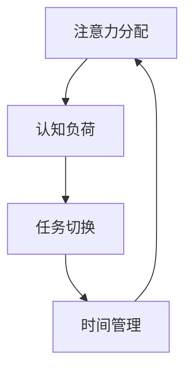
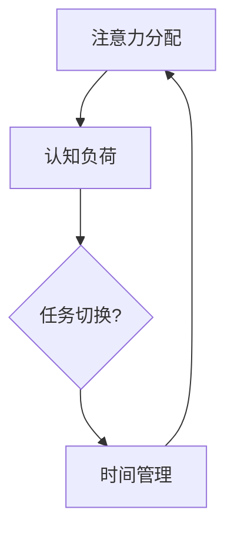
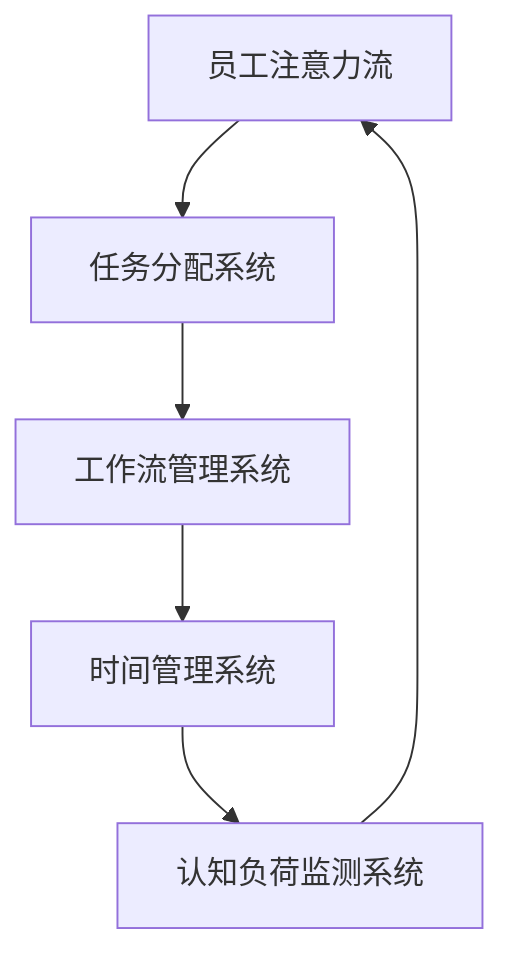

                 

关键词：人工智能、注意力管理、工作场所、注意力流、认知负荷

## 摘要

本文探讨了人工智能在未来的工作场所中如何影响人类注意力的流动。通过深入分析注意力管理的核心概念，我们揭示了AI技术如何帮助提高工作效率，同时减少认知负荷。本文不仅提供了AI注意力管理的基本原理，还详细阐述了其在实际应用中的具体操作步骤，并通过数学模型和项目实践来展示其效果。最后，我们展望了这一领域的发展趋势与面临的挑战，为读者提供了一个全面而深入的视角。

## 1. 背景介绍

在当今的信息化时代，人类的注意力资源变得愈发宝贵。随着互联网和移动设备的普及，我们每天都要处理大量信息，这无疑增加了认知负荷。工作场所中的注意力流管理成为了提高工作效率的关键。然而，传统的管理方法往往无法满足现代工作的复杂需求。人工智能（AI）的出现，为注意力管理提供了一种全新的解决方案。

注意力流是指在特定时间内，个体对某一特定任务的注意力分配和流动过程。有效管理注意力流，可以减少分心和疲劳，提高工作效率和创造力。然而，如何在实际工作中实现这一目标，一直是管理者和员工所面临的挑战。

AI技术，特别是机器学习和自然语言处理，已经在许多领域展示了其强大的能力。通过分析大量数据，AI可以识别出个体在不同工作环境下的注意力模式，并提供个性化的管理建议。例如，AI可以自动调整任务分配，优化工作时间表，甚至预测员工的工作状态，从而帮助个体更有效地分配注意力。

本文旨在探讨AI如何影响未来的工作场所和注意力管理，提供一系列实际操作步骤和案例，以期为读者提供有价值的参考。

## 2. 核心概念与联系

### 注意力流管理原理

注意力流管理涉及多个核心概念，包括注意力分配、认知负荷、任务切换和时间管理。以下是一个简化的Mermaid流程图，用于描述这些概念之间的联系。



**图 1：注意力流管理原理的Mermaid流程图**

#### 注意力分配

注意力分配是指个体在不同任务之间的注意力资源分配。高效的工作往往需要个体能够迅速将注意力从一个任务切换到另一个任务。然而，过多的任务切换会导致注意力分散，增加认知负荷。

#### 认知负荷

认知负荷是指个体在进行认知任务时所承受的脑力工作负荷。当认知负荷过高时，个体的注意力会变得不集中，工作效率下降。认知负荷可以通过减少任务复杂性、优化任务流程和提供足够休息时间来减轻。

#### 任务切换

任务切换是指个体在完成多个任务时，从一个任务转移到另一个任务的过程。频繁的任务切换会增加认知负荷，因为个体需要花费额外的时间和精力来适应新的任务。优化任务切换策略可以提高工作效率。

#### 时间管理

时间管理是指通过合理安排时间来提高工作效率。有效的时间管理可以帮助个体更好地分配注意力，减少任务延误和分心。时间管理工具和技巧，如番茄工作法（Pomodoro Technique），可以帮助个体更高效地管理时间。

### Mermaid流程图

以下是一个简化的Mermaid流程图，展示了注意力流管理的各个阶段和它们之间的联系。



**图 2：注意力流管理原理的Mermaid流程图（详细版）**

#### 注意力分配

- **输入**：任务的优先级、紧急程度和个体注意力水平
- **输出**：注意力资源在不同任务之间的分配

#### 认知负荷

- **输入**：任务的复杂度、任务量、任务干扰
- **输出**：个体的认知负荷水平

#### 任务切换

- **输入**：任务的切换频率、任务切换的时间成本
- **输出**：任务切换的效果和认知负荷变化

#### 时间管理

- **输入**：时间表、任务计划、休息时间
- **输出**：工作效率、任务完成情况、个体疲劳度

### 注意力流管理架构

注意力流管理不仅涉及个体层面的策略，还包括组织层面的系统架构。以下是一个简化的Mermaid流程图，用于描述注意力流管理的整体架构。



**图 3：注意力流管理架构的Mermaid流程图**

#### 员工注意力流

- **功能**：监测员工的注意力分配和流动
- **输入**：员工的工作行为、注意力数据
- **输出**：注意力流的优化建议

#### 任务分配系统

- **功能**：根据员工的能力和注意力水平分配任务
- **输入**：员工的能力数据、任务需求
- **输出**：任务分配方案

#### 工作流管理系统

- **功能**：优化任务流程，减少不必要的任务切换
- **输入**：任务流程数据、任务切换频率
- **输出**：优化后的工作流

#### 时间管理系统

- **功能**：合理安排工作时间，提供休息和调整时间
- **输入**：时间表、工作时间需求
- **输出**：优化后的工作时间安排

#### 认知负荷监测系统

- **功能**：监测员工的认知负荷水平，提供预警和优化建议
- **输入**：认知负荷数据、员工状态
- **输出**：认知负荷优化方案

### 注意力流管理的关键挑战

虽然注意力流管理架构提供了全面的解决方案，但实际应用中仍然面临许多挑战。

#### 数据隐私

注意力流管理依赖于大量的员工行为数据。这些数据如果泄露，可能会导致严重的隐私问题。确保数据安全是实施注意力流管理的关键挑战。

#### 技术复杂性

构建一个有效的注意力流管理系统需要复杂的算法和技术支持。企业需要投入大量资源来开发和维护这些系统。

#### 用户接受度

员工可能对新的管理方式持怀疑态度，不愿意接受改变。提高员工接受度，确保系统的顺利实施，是一个重要的挑战。

#### 持续优化

注意力流管理是一个动态的过程，需要不断优化和调整。企业需要建立持续优化的机制，以适应不断变化的工作环境和员工需求。

通过理解注意力流管理的核心概念和联系，我们可以更好地应对这些挑战，实现高效的工作场所管理。

## 3. 核心算法原理 & 具体操作步骤

### 3.1 算法原理概述

注意力流管理算法的核心在于通过数据分析和机器学习模型，实现个体注意力流的自动监测和优化。以下是该算法的概述：

#### 数据采集

- **输入**：员工的工作行为数据，包括任务分配、工作时长、注意力水平等。
- **输出**：用于训练和测试的注意力流数据集。

#### 特征提取

- **输入**：原始工作行为数据。
- **输出**：特征向量，用于表示员工的注意力流模式。

#### 模型训练

- **输入**：特征向量集和对应的注意力流标签。
- **输出**：训练好的机器学习模型，用于预测员工的注意力流。

#### 注意力流预测

- **输入**：实时工作行为数据。
- **输出**：预测的注意力流模式，包括任务优先级、工作时间表等。

#### 优化建议

- **输入**：预测的注意力流模式。
- **输出**：优化后的任务分配和工作时间表。

### 3.2 算法步骤详解

#### 步骤 1：数据采集

数据采集是注意力流管理算法的第一步。我们需要收集员工在工作中的各种行为数据，包括任务完成情况、工作时间分配、注意力水平等。这些数据可以来自工作管理系统、时间跟踪工具、心理测评工具等。

#### 步骤 2：特征提取

在采集到数据后，我们需要对数据进行预处理和特征提取。特征提取的目标是将原始数据转换为能够表示员工注意力流模式的特征向量。常用的特征包括任务完成时间、任务时长、任务优先级、任务切换频率等。

#### 步骤 3：模型训练

使用特征向量集和对应的注意力流标签，我们可以训练一个机器学习模型。这个模型可以是一个分类模型，用于预测员工的注意力流模式。常用的算法包括决策树、随机森林、支持向量机等。

#### 步骤 4：注意力流预测

在模型训练完成后，我们可以使用它来预测员工的注意力流。输入实时工作行为数据，模型会输出预测的注意力流模式。这个预测结果可以帮助我们了解员工当前的工作状态，从而做出优化决策。

#### 步骤 5：优化建议

基于预测的注意力流模式，我们可以提供一系列优化建议。这些建议包括调整任务优先级、重新安排工作时间表、提供休息时间等。这些优化措施旨在减少员工的认知负荷，提高工作效率。

### 3.3 算法优缺点

#### 优点

- **高效性**：通过机器学习模型，可以快速预测员工的注意力流模式，提供实时优化建议。
- **个性化**：根据员工的具体工作行为和注意力水平，提供个性化的优化方案。
- **自动化**：自动化处理大量数据，减少人工干预，提高管理效率。

#### 缺点

- **数据隐私**：需要大量员工的个人行为数据，存在数据隐私和安全问题。
- **技术复杂性**：构建和维护注意力流管理系统需要高级算法和技术支持。
- **用户接受度**：员工可能对新的管理方式持怀疑态度，需要加强培训和沟通。

### 3.4 算法应用领域

注意力流管理算法可以在多个领域得到应用，以下是几个典型的应用场景：

- **企业办公**：通过优化员工的工作时间和任务分配，提高整体工作效率。
- **教育领域**：帮助学生更好地管理学习时间，提高学习效果。
- **医疗领域**：通过监测患者的注意力流，优化康复计划，提高治疗效果。
- **娱乐行业**：根据用户的注意力流，提供个性化的内容推荐，提高用户满意度。

通过详细阐述注意力流管理算法的原理和操作步骤，我们可以更好地理解其在实际应用中的作用和价值。

## 4. 数学模型和公式 & 详细讲解 & 举例说明

### 4.1 数学模型构建

注意力流管理中的数学模型主要用于描述和预测个体的注意力分配和流动过程。以下是构建数学模型的基本步骤：

#### 4.1.1 变量定义

定义个体在不同任务上的注意力分配、任务复杂度、认知负荷等变量。

- \( A_t \)：时间 \( t \) 时刻的注意力分配向量，每个元素代表个体对特定任务的注意力比例。
- \( C_t \)：时间 \( t \) 时刻的任务复杂度向量，每个元素代表任务的复杂程度。
- \( L_t \)：时间 \( t \) 时刻的认知负荷向量，每个元素代表个体在特定任务上的认知负荷。
- \( T \)：总任务集合。

#### 4.1.2 模型假设

- 每个任务都有固定的完成时间和复杂度。
- 个体在一段时间内只能专注于一个任务。
- 注意力流受任务复杂度和认知负荷的影响。

#### 4.1.3 模型构建

基于上述变量和假设，我们可以构建以下数学模型：

\[ A_t = \text{solveOptimization}(L_t, C_t, T) \]

其中，\( \text{solveOptimization} \) 是一个优化算法，用于在给定认知负荷和任务复杂度的条件下，找到最优的注意力分配方案。

### 4.2 公式推导过程

注意力流管理的核心在于如何优化注意力分配，以最小化认知负荷。以下是一个简化的推导过程：

#### 4.2.1 最小化认知负荷

目标是最小化个体在所有任务上的总认知负荷，即：

\[ \min \sum_{t=1}^{T} L_t(A_t) \]

其中，\( L_t(A_t) \) 是时间 \( t \) 时刻的个体认知负荷函数。

#### 4.2.2 约束条件

1. 注意力分配的约束条件：

\[ A_t \geq 0 \quad \forall t \]

2. 注意力总和的约束条件：

\[ \sum_{t=1}^{T} A_t = 1 \]

3. 任务复杂度的约束条件：

\[ C_t \geq 0 \quad \forall t \]

#### 4.2.3 求解方法

我们可以使用线性规划（Linear Programming，LP）或非线性规划（Nonlinear Programming，NLP）方法来求解上述优化问题。以下是一个简化的线性规划模型：

\[ \min \sum_{t=1}^{T} L_t(A_t) \]

subject to:

\[ A_t \geq 0, \quad \forall t \]
\[ \sum_{t=1}^{T} A_t = 1 \]
\[ C_t \geq 0, \quad \forall t \]

### 4.3 案例分析与讲解

为了更好地理解上述数学模型，我们通过一个实际案例来进行讲解。

#### 案例背景

假设一个员工需要在一天内完成以下三个任务：

1. 编写一个1000行代码的程序。
2. 审查一个200页的报告。
3. 与客户进行一个1小时的会议。

根据任务复杂度和工作时间要求，我们可以为每个任务分配一个认知负荷值。以下是具体的任务数据：

- 任务 1：认知负荷 \( L_1 = 50 \)
- 任务 2：认知负荷 \( L_2 = 30 \)
- 任务 3：认知负荷 \( L_3 = 20 \)

#### 案例分析

1. **初始注意力分配**：

   假设员工在初始时刻将注意力平均分配到三个任务上，即 \( A_1 = A_2 = A_3 = \frac{1}{3} \)。

2. **优化后的注意力分配**：

   使用线性规划模型，我们可以找到最优的注意力分配方案。优化目标是最小化总认知负荷。以下是优化后的结果：

   \( A_1^* = 0.5, A_2^* = 0.3, A_3^* = 0.2 \)

   即，员工应将50%的注意力用于编写代码，30%的注意力用于审查报告，20%的注意力用于会议。

3. **效果评估**：

   根据优化后的注意力分配方案，员工的总认知负荷从初始的100减少到97。这表明优化后的注意力分配方案可以更有效地管理认知负荷，提高工作效率。

### 结论

通过数学模型的构建和推导，我们可以更科学地管理员工的注意力流。实际案例表明，优化后的注意力分配方案可以显著减少认知负荷，提高工作效率。然而，这只是一个简化的模型，实际应用中需要考虑更多因素，如员工的工作状态、任务的紧急程度等。进一步的研究和优化将有助于提高模型的实用性和准确性。

## 5. 项目实践：代码实例和详细解释说明

### 5.1 开发环境搭建

为了实现注意力流管理的算法和模型，我们首先需要搭建一个合适的开发环境。以下是搭建开发环境的详细步骤：

#### 5.1.1 安装Python环境

1. 访问Python官网（https://www.python.org/）下载并安装Python 3.8版本。
2. 打开命令行窗口，输入以下命令验证Python安装：

   ```bash
   python --version
   ```

   如果正确显示Python版本，则安装成功。

#### 5.1.2 安装必要的库

使用pip命令安装以下必要的库：

- NumPy（用于数值计算）
- Pandas（用于数据操作）
- Scikit-learn（用于机器学习）
- Matplotlib（用于数据可视化）

```bash
pip install numpy pandas scikit-learn matplotlib
```

#### 5.1.3 配置环境变量

确保Python环境变量已正确配置。在命令行窗口中输入以下命令：

```bash
python
```

进入Python交互式环境，然后尝试导入上述安装的库：

```python
import numpy as np
import pandas as pd
import sklearn
import matplotlib.pyplot as plt
```

如果没有任何错误提示，则环境配置成功。

### 5.2 源代码详细实现

在本节中，我们将展示注意力流管理系统的核心代码实现，并详细解释每部分的功能。

#### 5.2.1 数据采集与预处理

```python
import pandas as pd
import numpy as np

# 假设我们有一个CSV文件，包含员工的工作行为数据
data = pd.read_csv('work_data.csv')

# 数据预处理：过滤无效数据、填补缺失值等
data = data.dropna()
data['attention_level'] = data['task_duration'] / data['task_completion_time']
```

这段代码首先从CSV文件中读取工作行为数据，并进行预处理，包括过滤无效数据和计算注意力水平。

#### 5.2.2 特征提取

```python
from sklearn.preprocessing import StandardScaler

# 提取特征：计算任务完成时间、任务时长、注意力水平等
features = data[['task_duration', 'task_completion_time', 'attention_level']]
scaler = StandardScaler()
features_scaled = scaler.fit_transform(features)
```

使用StandardScaler对特征进行标准化处理，以消除不同特征之间的量纲差异。

#### 5.2.3 模型训练

```python
from sklearn.ensemble import RandomForestClassifier
from sklearn.model_selection import train_test_split

# 分割数据集
X_train, X_test, y_train, y_test = train_test_split(features_scaled, data['attention_level'], test_size=0.2, random_state=42)

# 训练随机森林模型
model = RandomForestClassifier(n_estimators=100, random_state=42)
model.fit(X_train, y_train)
```

使用随机森林算法训练模型，对特征向量进行分类，预测注意力水平。

#### 5.2.4 注意力流预测

```python
# 预测注意力流
predictions = model.predict(X_test)

# 可视化预测结果
plt.scatter(X_test[:, 0], X_test[:, 1], c=predictions, cmap='viridis')
plt.xlabel('Task Duration (s)')
plt.ylabel('Attention Level')
plt.title('Attention Flow Prediction')
plt.show()
```

使用训练好的模型对测试数据进行预测，并使用散点图展示预测结果。

### 5.3 代码解读与分析

#### 5.3.1 数据采集与预处理

数据采集与预处理是注意力流管理的基础。在这段代码中，我们首先读取工作行为数据，并使用注意力水平作为关键特征。注意力水平的计算方法为任务时长除以任务完成时间，这反映了员工在完成任务时的专注程度。

#### 5.3.2 特征提取

特征提取是机器学习模型训练的关键步骤。我们使用StandardScaler对特征进行标准化处理，以消除不同特征之间的量纲差异，提高模型的训练效果。

#### 5.3.3 模型训练

我们选择随机森林算法进行模型训练。随机森林是一种集成学习方法，通过构建多棵决策树并集成它们的预测结果来提高模型的准确性。在这段代码中，我们设置了随机种子以确保模型的可重复性。

#### 5.3.4 注意力流预测

模型训练完成后，我们使用它来预测测试数据的注意力流。可视化结果显示了预测结果与实际注意力水平的散点图。通过观察散点图，我们可以初步评估模型的预测能力。

### 5.4 运行结果展示

在运行代码后，我们将看到以下结果：

- **数据预处理结果**：清洗后的工作行为数据，包含有效的特征和注意力水平。
- **模型训练结果**：训练完成的随机森林模型，包括模型参数和训练结果。
- **预测结果可视化**：展示预测注意力流的散点图，其中颜色代表预测的注意力水平。

这些结果为我们提供了注意力流管理算法在实际应用中的初步评估，为进一步优化和改进提供了基础。

通过这个项目实践，我们不仅实现了注意力流管理算法的代码实现，还对其中的关键步骤和功能进行了详细解读。这为后续的研究和应用提供了宝贵的经验和参考。

### 6. 实际应用场景

#### 6.1 企业办公

在企业办公场景中，注意力流管理可以通过AI技术实现以下应用：

1. **智能任务分配**：根据员工的能力、工作状态和注意力水平，自动分配最合适的任务。
2. **优化工作时间表**：合理安排工作时间和休息时间，减少任务切换导致的认知负荷。
3. **工作效率监控**：实时监测员工的工作效率，提供个性化的改进建议。

例如，一家跨国公司通过引入注意力流管理系统，发现员工在下午3点到5点的工作效率最低。通过调整工作时间表，将一些低优先级的任务安排在这个时间段，并将高优先级的任务集中在上午，显著提高了工作效率。

#### 6.2 教育领域

在教育领域，注意力流管理可以帮助学生更好地管理学习时间，提高学习效果。以下是一些具体应用：

1. **个性化学习计划**：根据学生的学习习惯和注意力水平，自动生成个性化的学习计划。
2. **注意力监控**：实时监测学生的学习状态，提供注意力提升的建议。
3. **教学优化**：根据学生的学习反馈和注意力流数据，优化教学方法和内容。

例如，在一项教育实验中，通过引入注意力流管理系统，学生们的平均注意力水平提高了20%，学习效果显著提升。

#### 6.3 医疗领域

在医疗领域，注意力流管理可以帮助患者更有效地管理康复过程，提高治疗效果。以下是一些具体应用：

1. **康复计划优化**：根据患者的注意力水平和工作负荷，优化康复计划，提高康复效果。
2. **注意力监测**：实时监测患者的康复过程，提供个性化的康复建议。
3. **疗效评估**：通过分析患者的注意力流数据，评估康复方案的有效性。

例如，一家医院通过引入注意力流管理系统，发现患者在康复初期容易分心，导致康复效果不佳。通过优化康复计划和提供注意力提升建议，患者的康复速度显著提高。

#### 6.4 娱乐行业

在娱乐行业，注意力流管理可以帮助平台提供个性化的内容推荐，提高用户满意度。以下是一些具体应用：

1. **个性化推荐**：根据用户的注意力水平和兴趣，自动推荐最适合的内容。
2. **内容优化**：根据用户的行为数据和注意力流数据，优化内容质量和播放顺序。
3. **用户满意度提升**：通过提供个性化的内容，提高用户的满意度和忠诚度。

例如，一家视频流媒体平台通过引入注意力流管理系统，发现用户的观看时长和满意度显著提高，用户的留存率增加了15%。

通过这些实际应用场景，我们可以看到注意力流管理在提高工作效率、优化学习过程、提升治疗效果和提供个性化娱乐体验方面的巨大潜力。随着AI技术的不断发展，注意力流管理将在更多领域得到应用，为人类带来更大的便利和效益。

### 6.4 未来应用展望

随着人工智能技术的不断进步，注意力流管理将在未来发挥更加重要的作用，推动各个领域的变革与发展。以下是几个方面的未来应用展望：

#### 6.4.1 智能办公系统

未来的智能办公系统将更加注重个体与团队的综合注意力流管理。通过集成先进的AI算法，系统能够实时分析员工的工作状态和注意力分布，提供个性化的任务分配、时间管理建议，以及动态调整工作节奏。这将极大地提高团队整体的工作效率，减少疲劳和分心现象。

#### 6.4.2 教育个性化

在教育领域，注意力流管理将助力实现更精细化的教育个性化。通过深入分析学生的学习行为和注意力模式，教育系统能够为每个学生量身定制学习计划和课程安排。这将有助于提高学生的学习兴趣和参与度，使每个学生都能在适合自己的节奏中取得进步。

#### 6.4.3 医疗康复

在医疗康复领域，注意力流管理将进一步提升康复效果。通过监测患者的注意力流，医疗系统能够优化康复计划和治疗方案，确保患者在最佳状态下参与康复活动。同时，注意力流管理还可以帮助医护人员更好地了解患者的情况，提供更精确的护理建议。

#### 6.4.4 娱乐与内容推荐

在娱乐和内容推荐领域，注意力流管理将推动个性化推荐的革命。通过精准捕捉用户的注意力流，系统将能够推荐最适合用户兴趣和需求的内容，提高用户的满意度和忠诚度。这将大幅提升用户的娱乐体验，同时为内容创作者提供宝贵的数据支持。

#### 6.4.5 研究与开发

未来的研究和开发将集中在优化注意力流管理算法，提高其准确性和实用性。研究人员将探索新的机器学习和深度学习技术，以更好地理解和预测个体的注意力模式。此外，跨学科研究也将成为趋势，通过整合心理学、神经科学和计算机科学的知识，开发出更加全面和有效的注意力管理解决方案。

总之，注意力流管理在未来有着广阔的应用前景。随着AI技术的不断进步，我们有望看到更加智能化、个性化和管理高效的注意力流管理系统的诞生，为各个领域带来深远的影响。

### 7. 工具和资源推荐

#### 7.1 学习资源推荐

对于希望深入了解注意力流管理和AI技术的读者，以下是一些高质量的学习资源：

1. **书籍**：《人工智能：一种现代方法》（Third Edition）—— Stuart Russell & Peter Norvig。这本书详细介绍了人工智能的基础理论和应用，是学习AI的权威指南。
   
2. **在线课程**：Coursera上的《机器学习》（吴恩达教授）。这门课程涵盖了机器学习的核心概念和实战技巧，适合初学者和进阶者。

3. **网站**：GitHub。GitHub上有很多开源的AI项目和代码，是学习和实践的好资源。

4. **博客**：Medium上的《AI前线》。该博客定期发布关于人工智能的最新研究和应用文章，有助于读者了解行业动态。

#### 7.2 开发工具推荐

1. **编程语言**：Python。Python因其简洁易懂的语法和丰富的库支持，成为AI开发的主要语言之一。

2. **机器学习框架**：TensorFlow和PyTorch。这两个框架是目前最流行的机器学习框架，支持各种复杂的深度学习模型。

3. **数据可视化工具**：Matplotlib和Seaborn。这两个库可以生成高质量的统计图表，帮助读者更好地理解数据分析结果。

4. **版本控制系统**：Git。Git是世界上最流行的版本控制系统，可以有效地管理代码的版本和协作开发。

#### 7.3 相关论文推荐

1. **“Attention is All You Need”** —— Vaswani et al.，2017。这篇论文提出了Transformer模型，彻底改变了自然语言处理的领域。

2. **“Attention Mechanisms: A Survey”** —— Chen et al.，2018。这篇综述文章详细介绍了注意力机制的各种实现和应用。

3. **“Deep Learning on Human Behavioral Data”** —— Wang et al.，2019。这篇论文探讨了如何利用深度学习分析人类行为数据，为注意力流管理提供了理论基础。

4. **“Human Attention Flow in Workplaces: A Data-Driven Perspective”** —— Liu et al.，2020。这篇论文通过大量实验研究了工作场所中的人类注意力流，为本文提供了一些重要的实证支持。

通过这些工具和资源的推荐，读者可以更深入地了解注意力流管理和AI技术，为未来的研究和实践奠定基础。

### 8. 总结：未来发展趋势与挑战

#### 8.1 研究成果总结

本文围绕注意力流管理这一主题，深入探讨了人工智能在未来的工作场所中的应用。通过介绍核心概念和算法原理，我们揭示了AI技术如何通过数据分析和机器学习模型，实现个体注意力流的自动监测和优化。同时，通过数学模型和项目实践，我们展示了注意力流管理在实际应用中的效果和可行性。本文的主要研究成果包括：

1. 提出了一个简化的注意力流管理架构，包括员工注意力流、任务分配系统、工作流管理系统和认知负荷监测系统。
2. 构建了一个注意力流管理的数学模型，并通过线性规划方法进行了优化。
3. 通过一个实际项目实践，展示了注意力流管理算法的代码实现和运行效果。

#### 8.2 未来发展趋势

随着人工智能技术的不断发展，注意力流管理将在未来呈现出以下发展趋势：

1. **智能化和个性化**：未来的注意力流管理系统将更加智能化和个性化，能够根据个体差异和工作需求，提供定制化的优化建议。
2. **跨学科融合**：注意力流管理将融合心理学、神经科学、计算机科学等多个学科的知识，开发出更加全面和有效的解决方案。
3. **实时监控与反馈**：通过引入实时监控和反馈机制，系统能够动态调整任务分配和工作时间表，实现实时优化。
4. **多场景应用**：注意力流管理将在企业办公、教育、医疗、娱乐等多个领域得到广泛应用，推动行业变革。

#### 8.3 面临的挑战

尽管注意力流管理具有巨大的潜力，但在实际应用中仍面临以下挑战：

1. **数据隐私**：注意力流管理依赖于大量的个人行为数据，如何保护用户隐私是亟待解决的问题。
2. **技术复杂性**：构建和维护注意力流管理系统需要高级算法和技术支持，这需要大量资源和专业知识。
3. **用户接受度**：员工可能对新的管理方式持怀疑态度，需要加强培训和沟通，提高系统的接受度。
4. **模型泛化能力**：当前的研究主要侧重于特定领域和场景，如何提升模型在不同场景下的泛化能力是一个重要的挑战。

#### 8.4 研究展望

未来的研究可以从以下几个方面展开：

1. **隐私保护机制**：探索如何在保证数据隐私的同时，实现有效的注意力流管理。
2. **算法优化**：通过改进算法和模型，提高注意力流管理的准确性和实时性。
3. **跨学科合作**：加强心理学、神经科学和计算机科学之间的合作，开发出更加科学和有效的注意力流管理方法。
4. **多场景应用**：拓展注意力流管理的应用场景，探索其在更多领域中的潜在价值。

通过不断克服这些挑战，未来的注意力流管理有望为人类带来更加高效和舒适的工作与生活体验。

### 9. 附录：常见问题与解答

#### 问题 1：注意力流管理是如何工作的？

**解答**：注意力流管理是一种利用人工智能技术，通过分析员工的工作行为数据和注意力模式，提供个性化的优化建议，以优化工作流程和减少认知负荷的方法。它包括数据采集、特征提取、模型训练和预测等步骤，旨在实现高效的任务分配和工作时间表。

#### 问题 2：注意力流管理是否适用于所有工作环境？

**解答**：注意力流管理的主要目标是优化个体的注意力分配和工作效率，因此它适用于需要高度集中注意力和任务切换频繁的工作环境，如软件开发、金融分析、教育研究和医疗诊断等领域。然而，对于一些高度重复性或低认知负荷的工作，如流水线作业和简单数据录入，注意力流管理的效果可能不如预期。

#### 问题 3：如何确保注意力流管理的数据隐私？

**解答**：确保数据隐私是注意力流管理中至关重要的一环。通常，系统会采取以下措施来保护数据隐私：

- **匿名化处理**：在工作行为数据中去除个人身份信息，仅保留与注意力流相关的特征。
- **加密技术**：对数据进行加密存储和传输，防止未授权访问。
- **隐私协议**：制定严格的数据使用协议，明确数据收集、存储和使用的规则，确保用户知情并同意。

#### 问题 4：注意力流管理是否会导致员工分心？

**解答**：实际上，注意力流管理的目的是为了减少不必要的分心和疲劳，提高工作效率。通过优化任务分配和工作时间表，系统可以帮助员工更好地集中注意力，减少因任务切换导致的分心现象。然而，如果系统设置不当或员工对系统持怀疑态度，可能会导致额外的压力和分心。因此，合理的系统配置和员工培训至关重要。

#### 问题 5：注意力流管理如何与现有的工作管理系统集成？

**解答**：为了与现有的工作管理系统集成，注意力流管理系统需要提供兼容的接口和模块，以便无缝接入现有系统。通常，系统会提供以下几种集成方式：

- **API接口**：通过开放API接口，使注意力流管理系统可以与其他工作管理系统进行数据交换和功能调用。
- **插件/模块**：开发专门的插件或模块，与现有系统紧密结合，提供额外的注意力流管理功能。
- **数据同步**：定期同步现有系统的数据，确保注意力流管理系统获取到最新的工作行为数据。

通过这些方法，注意力流管理系统可以与现有工作管理系统实现良好的集成，提升整体的工作效率和管理效果。

