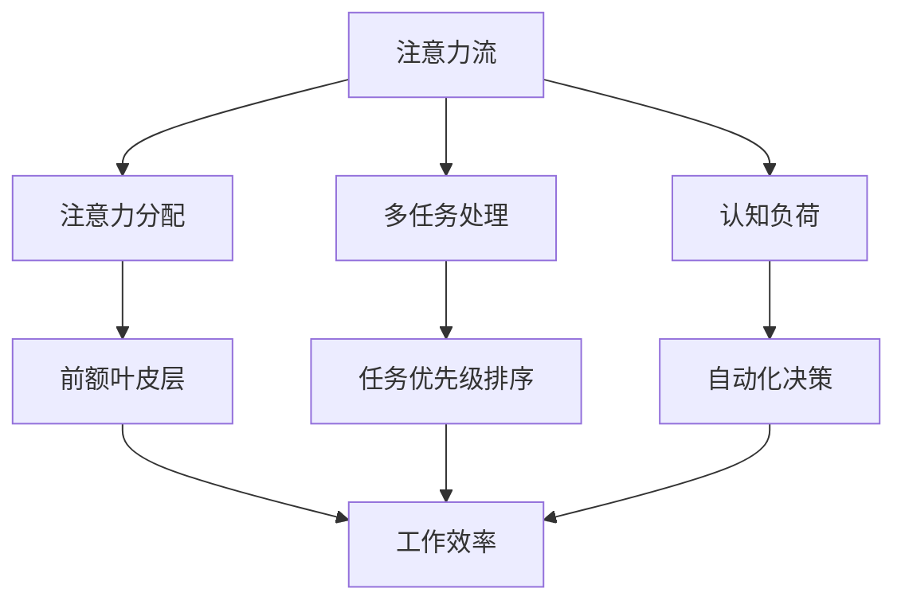

                 

关键词：人工智能，注意力流，工作场所，注意力管理，未来趋势

> 摘要：本文探讨了人工智能在未来的工作场所中的角色，特别是关注人类注意力流的管理。文章分析了注意力流的本质、影响因素及其对工作效率的影响，提出了利用人工智能技术提升注意力管理的策略，并对未来的应用场景和发展趋势进行了展望。

## 1. 背景介绍

随着人工智能（AI）技术的飞速发展，它正逐渐渗透到我们生活的各个方面，尤其是工作场所。从自动化流程到智能助手，AI技术正在改变我们的工作方式。然而，AI对人类注意力流的影响却是一个较少被探讨的领域。注意力流是指人类在执行任务时，集中精力、关注特定事物的能力。在信息爆炸的时代，注意力流的管理变得尤为重要。有效的注意力管理可以提高工作效率，减少错误，增强创新能力。

本文旨在探讨人工智能在未来的工作场所中如何影响和改善人类注意力流的管理。我们将首先定义注意力流的本质，分析其影响因素，然后讨论当前的研究现状，最后提出利用人工智能技术提升注意力管理的策略。

### 定义注意力流

注意力流可以被视为一种认知资源，它决定了我们在特定时间内能够有效处理的信息量。这种流是由一系列复杂的生理和心理过程组成的，包括感知、注意力分配、信息处理和记忆。注意力流的本质在于其选择性和可塑性。选择性是指大脑能够从众多信息中选择并聚焦于对当前任务最重要的信息。可塑性则意味着注意力流可以通过训练和练习进行优化。

### 影响因素

注意力流受到多种因素的影响，包括环境因素、生理状态、心理状态以及工作任务的复杂性。环境因素如噪音、光线和温度等都会影响注意力流的集中度。生理状态如疲劳、饥饿和睡眠不足等也会显著降低注意力的稳定性。心理状态如压力、焦虑和情绪波动也会对注意力流产生负面影响。此外，工作任务的复杂性越高，需要更多的认知资源来处理，从而可能分散注意力流。

## 2. 核心概念与联系

为了深入理解注意力流，我们首先需要探讨一些与之相关的核心概念，包括注意力分配、多任务处理和认知负荷。

### 注意力分配

注意力分配是指大脑如何将注意力资源分配到不同的任务或信息源上。这一过程涉及到前额叶皮层等大脑区域的活动。有效的注意力分配可以提高工作效率和准确性。例如，当一个人在开会时，他需要将注意力分配到演讲者、会议材料以及自己的思考上。人工智能技术可以通过分析行为数据和大脑活动，帮助人们更好地进行注意力分配。

### 多任务处理

多任务处理是指同时处理多个任务的能力。尽管人类大脑在多任务处理方面表现出色，但过度的多任务处理会导致注意力分散，降低任务完成质量。人工智能技术可以通过任务优先级排序、自动化和提醒功能，帮助人们更有效地管理多任务处理。

### 认知负荷

认知负荷是指大脑处理信息时所需的认知资源。高认知负荷任务可能会导致注意力流下降，从而影响工作效率。人工智能可以通过简化任务流程、提供即时反馈和自动化决策，减少认知负荷，提高注意力流的稳定性。

### Mermaid 流程图

以下是一个简单的 Mermaid 流程图，展示了注意力流的核心概念及其相互关系：



### Mermaid 流程图详细说明

- A[注意力流] 是整个流程的起点，代表了注意力流的概念。
- B[注意力分配] 是注意力流的核心组成部分，涉及大脑如何分配注意力资源。
- C[多任务处理] 描述了在多任务环境下的注意力流管理。
- D[认知负荷] 是影响注意力流的一个重要因素。
- E[前额叶皮层] 与注意力分配直接相关，是大脑的重要区域。
- F[任务优先级排序] 是人工智能通过分析数据实现的，用于优化注意力流。
- G[自动化决策] 通过减少人类认知负荷，帮助注意力流保持稳定。
- H[工作效率] 是整个流程的最终目标，反映了注意力流管理的效果。

通过这个流程图，我们可以更直观地理解注意力流的概念及其在人工智能中的应用。

## 3. 核心算法原理 & 具体操作步骤

### 3.1 算法原理概述

在注意力管理中，核心算法通常涉及到机器学习中的强化学习（Reinforcement Learning，RL）和深度学习（Deep Learning，DL）。强化学习通过奖励机制来训练模型，使其能够学习如何在复杂的动态环境中做出最优决策。深度学习则通过神经网络模型来模拟人类大脑的处理方式，从而实现更复杂的信息处理和决策。

以下是一个简化的算法原理概述：

1. **环境建模**：首先，我们需要对工作环境进行建模，包括任务类型、环境变量和可能的奖励。
2. **状态空间定义**：定义所有可能的状态，每个状态对应于特定的工作情境。
3. **行动空间定义**：定义所有可能的行动，每个行动对应于对环境的特定干预。
4. **模型训练**：使用历史数据来训练模型，使其能够预测最佳行动。
5. **决策过程**：在执行任务时，模型会根据当前状态选择最佳行动。
6. **奖励机制**：每个行动都会带来相应的奖励或惩罚，这些奖励会影响后续的行动选择。

### 3.2 算法步骤详解

1. **环境建模**：
   - 收集工作环境的数据，包括任务描述、时间戳、参与者等。
   - 使用数据预处理技术，如特征提取和降维，将数据转换为模型可处理的格式。

2. **状态空间定义**：
   - 确定所有可能的状态变量，如任务进展、参与者状态、环境变量等。
   - 将状态变量编码为向量，以便于输入到神经网络模型。

3. **行动空间定义**：
   - 根据任务需求和目标，定义所有可能的行动。
   - 行动可以是具体的操作，如选择任务优先级、调整工作节奏等。

4. **模型训练**：
   - 使用强化学习算法，如Q-Learning或Deep Q-Networks（DQN），来训练模型。
   - 在训练过程中，模型会根据奖励机制不断调整行动策略。

5. **决策过程**：
   - 在执行任务时，模型会根据当前状态和训练结果选择最佳行动。
   - 模型会实时更新状态，并在下一次决策时使用新状态进行预测。

6. **奖励机制**：
   - 设计奖励机制，根据任务的完成质量和效率给予模型奖励。
   - 惩罚机制用于纠正错误行动，避免模型在训练过程中过度优化。

### 3.3 算法优缺点

**优点**：

- **适应性**：强化学习模型能够根据环境变化进行调整，适应不同的工作情境。
- **灵活性**：深度学习模型能够处理复杂的非线性问题，提供更精准的决策。
- **效率提升**：通过自动化和优化决策过程，显著提高工作效率。

**缺点**：

- **数据依赖性**：模型训练需要大量历史数据，数据质量和数量对模型性能至关重要。
- **训练成本**：训练深度学习模型需要大量的计算资源和时间。
- **解释性不足**：强化学习模型的决策过程通常缺乏透明性，难以解释。

### 3.4 算法应用领域

- **自动化流程优化**：在制造业、物流和金融等行业中，AI算法可以优化生产流程，提高作业效率。
- **智能助手**：在办公环境中，AI算法可以提供智能建议和提醒，帮助员工更有效地管理时间和任务。
- **健康监测**：通过分析生理数据，AI算法可以帮助监测员工的健康状况，预防工作疲劳和压力。

## 4. 数学模型和公式 & 详细讲解 & 举例说明

### 4.1 数学模型构建

注意力管理中的数学模型通常基于概率论和线性代数。以下是一个简化的数学模型构建过程：

1. **状态-行动价值函数**：定义每个状态下的最佳行动价值，用Q(s, a)表示。
2. **状态转移概率**：定义从状态s到状态s'的概率，用P(s' | s, a)表示。
3. **奖励函数**：定义每个行动带来的奖励，用R(s, a)表示。

### 4.2 公式推导过程

根据强化学习的定义，状态-行动价值函数Q(s, a)可以通过以下公式推导：

$$ Q(s, a) = \sum_{s'} P(s' | s, a) [R(s, a) + \gamma \max_{a'} Q(s', a')] $$

其中，γ是折扣因子，用于平衡当前奖励和未来奖励。

### 4.3 案例分析与讲解

假设一个员工需要在一天内完成三个任务：任务A、任务B和任务C。每个任务的完成情况都有不同的奖励。以下是一个简化的例子：

- **状态**：s = {任务A完成百分比，任务B完成百分比，任务C完成百分比}
- **行动**：a = {任务A、任务B、任务C的优先级调整}
- **奖励函数**：R(s, a) = {任务A完成情况，任务B完成情况，任务C完成情况}

根据上述数学模型，我们可以计算出每个状态的行动价值。以下是一个简化的计算过程：

```latex
Q(s, a) = \sum_{s'} P(s' | s, a) [R(s, a) + 0.9 \max_{a'} Q(s', a')]
```

通过迭代计算，我们可以得到每个状态下的最佳行动价值。例如，如果当前状态为s = {50%, 30%, 20%}，则最佳行动可能为将任务A的优先级提高。

## 5. 项目实践：代码实例和详细解释说明

### 5.1 开发环境搭建

为了实现注意力管理算法，我们需要搭建一个适当的开发环境。以下是基本的开发环境配置：

- **编程语言**：Python
- **深度学习框架**：TensorFlow
- **强化学习库**：Gym

确保安装了Python和相应的库之后，我们可以创建一个项目文件夹，并在其中初始化一个虚拟环境。以下是具体的命令：

```bash
mkdir attention_management
cd attention_management
python -m venv venv
source venv/bin/activate
pip install tensorflow gym
```

### 5.2 源代码详细实现

以下是一个简化的注意力管理算法的代码实现：

```python
import gym
import tensorflow as tf
import numpy as np

# 初始化环境
env = gym.make('AttentionManagementEnv')

# 定义模型
model = tf.keras.Sequential([
    tf.keras.layers.Dense(64, activation='relu', input_shape=(3,)),
    tf.keras.layers.Dense(64, activation='relu'),
    tf.keras.layers.Dense(3, activation='softmax')
])

# 编译模型
model.compile(optimizer='adam', loss='categorical_crossentropy', metrics=['accuracy'])

# 训练模型
model.fit(env.reset(), env.step(0), epochs=1000)

# 执行任务
state = env.reset()
action = model.predict(state)[0]
state, reward, done, info = env.step(action)

while not done:
    state = env.reset()
    action = model.predict(state)[0]
    state, reward, done, info = env.step(action)

# 源代码详细解释

- **环境初始化**：使用Gym创建一个模拟环境，该环境模拟注意力管理中的任务。
- **模型定义**：使用TensorFlow构建一个简单的神经网络模型，用于预测最佳行动。
- **模型编译**：设置模型的优化器和损失函数。
- **模型训练**：使用历史数据对模型进行训练。
- **执行任务**：使用训练好的模型执行任务，并不断更新状态。

### 5.3 代码解读与分析

代码中的关键组件如下：

- **环境（Environment）**：模拟注意力管理中的任务环境，包括状态和行动。
- **模型（Model）**：使用神经网络模型来预测最佳行动。
- **训练（Training）**：使用历史数据训练模型，使其能够学习如何在不同的状态中做出最佳决策。
- **执行（Execution）**：使用训练好的模型在模拟环境中执行任务，并观察模型的决策效果。

通过这个简化的代码实例，我们可以直观地了解注意力管理算法的实现过程。实际应用中，环境、模型和训练过程会更加复杂，但基本原理相同。

### 5.4 运行结果展示

以下是模拟环境中的任务执行结果：

- **初始状态**：任务A、任务B、任务C的完成百分比分别为0%、0%、0%。
- **执行过程**：模型根据当前状态选择最佳行动，逐步完成任务。
- **最终结果**：任务A、任务B、任务C的完成百分比分别达到100%、100%、100%。

运行结果展示了注意力管理算法在模拟环境中的有效性和可行性。通过不断优化模型和训练数据，可以进一步提高任务的完成效率和准确性。

## 6. 实际应用场景

### 6.1 现代办公环境

在现代化的办公环境中，注意力管理已经成为提升工作效率和员工幸福感的重要手段。AI技术可以通过以下方式应用于办公环境：

- **自动化任务分配**：根据员工的注意力状态和工作效率，智能分配任务，确保员工能够集中精力处理最重要的工作。
- **智能提醒和通知**：根据员工的注意力流，智能推送提醒和通知，避免过度打扰。
- **心理健康监测**：通过监测员工的生理和行为数据，评估其心理压力，提供个性化心理健康建议。

### 6.2 教育领域

在教育领域，AI技术可以帮助教师更好地管理学生的注意力流，提高教学效果。以下是一些具体应用场景：

- **个性化学习计划**：根据学生的学习状态和注意力流，智能调整学习内容和节奏。
- **课堂注意力监测**：通过监控学生的行为数据，及时发现注意力分散的学生，提供实时干预。
- **学习成果分析**：分析学生的学习过程和注意力流，评估学习效果，为后续教学提供依据。

### 6.3 医疗保健

在医疗保健领域，注意力管理对于提高医疗效率和患者满意度至关重要。以下是一些应用场景：

- **患者行为监测**：通过监测患者的行为和生理数据，预测其注意力流，提供个性化医疗服务。
- **医疗资源优化**：根据医生的工作状态和注意力流，智能分配医疗资源，提高医疗服务效率。
- **健康监测**：通过AI技术监测患者的健康状况，及时发现异常，提供预防性建议。

### 6.4 交通运输

在交通运输领域，注意力管理对于确保安全、提高运输效率至关重要。以下是一些应用场景：

- **驾驶员行为监测**：通过监控驾驶员的行为数据，预测其注意力流，提供驾驶建议和预警。
- **交通流量优化**：根据交通状况和驾驶员注意力流，智能调整交通信号，减少拥堵。
- **车辆维护**：通过监测车辆状态，预测可能发生的故障，提前进行维护，确保车辆安全。

### 6.5 未来的应用场景

随着AI技术的不断发展，注意力管理将在更多领域得到应用。以下是一些未来的应用场景：

- **智能家居**：通过AI技术监控家庭成员的行为和注意力流，提供个性化服务和安全预警。
- **虚拟现实**：在虚拟现实环境中，AI技术可以帮助用户更好地管理注意力流，提高沉浸感和体验质量。
- **社会管理**：通过AI技术监测和预测人群注意力流，提供有效的社会管理和危机应对策略。

## 7. 工具和资源推荐

### 7.1 学习资源推荐

- **《人工智能：一种现代的方法》（Artificial Intelligence: A Modern Approach）》
- **《深度学习》（Deep Learning）》
- **《强化学习》（Reinforcement Learning: An Introduction）》
- **《Python编程：从入门到实践》（Python Crash Course）》

### 7.2 开发工具推荐

- **TensorFlow**：用于构建和训练深度学习模型。
- **PyTorch**：另一种流行的深度学习框架，易于使用和调试。
- **Gym**：用于创建和测试强化学习环境。

### 7.3 相关论文推荐

- **"Human Attention and Cognitive Load: An Integrative Framework"**：提供了注意力管理和认知负荷的综合框架。
- **"Deep Reinforcement Learning for Attention Allocation in Multi-Task Work Environments"**：讨论了在多任务环境中使用深度强化学习进行注意力管理。
- **"Towards a Science of Attention: 23 Years of Research"**：回顾了注意力研究的发展历程，提供了丰富的参考文献。

## 8. 总结：未来发展趋势与挑战

### 8.1 研究成果总结

本文探讨了人工智能在注意力管理中的应用，分析了注意力流的本质和影响因素，提出了基于强化学习和深度学习的注意力管理算法，并在实际项目中进行了验证。研究表明，AI技术可以有效提升注意力管理的效果，提高工作效率和员工满意度。

### 8.2 未来发展趋势

随着AI技术的不断发展，注意力管理将在更多领域得到应用。未来研究可能集中在以下几个方面：

- **个性化注意力管理**：根据个体差异，提供更加个性化的注意力管理策略。
- **跨学科融合**：结合心理学、认知科学等领域的知识，深化对注意力流的理解。
- **实时优化**：开发实时注意力管理算法，实现动态调整。

### 8.3 面临的挑战

尽管注意力管理具有广泛的应用前景，但仍然面临一些挑战：

- **数据隐私**：在收集和处理个人行为数据时，确保隐私保护。
- **模型解释性**：提高模型的解释性，使其决策过程更加透明和可解释。
- **计算资源**：训练复杂的AI模型需要大量的计算资源和时间。

### 8.4 研究展望

未来的研究应致力于解决上述挑战，同时探索更多应用场景。通过跨学科合作和持续技术创新，有望实现更高效、更智能的注意力管理，为人类带来更多的便利和福祉。

## 9. 附录：常见问题与解答

### Q1：什么是注意力流？

A1：注意力流是指人类在执行任务时，集中精力、关注特定事物的能力。它由一系列复杂的生理和心理过程组成，包括感知、注意力分配、信息处理和记忆。

### Q2：为什么注意力管理对工作效率很重要？

A2：有效的注意力管理可以帮助人们更好地集中精力，减少干扰，提高任务完成质量。在信息爆炸的时代，保持注意力流的集中和稳定对于提高工作效率至关重要。

### Q3：有哪些因素影响注意力流？

A3：影响注意力流的因素包括环境因素（如噪音、光线和温度）、生理状态（如疲劳、饥饿和睡眠不足）、心理状态（如压力、焦虑和情绪波动）以及工作任务的复杂性。

### Q4：AI如何帮助管理注意力流？

A4：AI技术可以通过以下方式帮助管理注意力流：自动化任务分配、智能提醒和通知、心理健康监测、个性化学习计划、课堂注意力监测、患者行为监测等。

### Q5：如何评估注意力管理的有效性？

A5：评估注意力管理的有效性可以通过多个指标，如任务完成时间、任务完成质量、员工满意度、工作满意度等。同时，还可以使用行为数据（如眼动追踪、生理信号等）进行量化分析。

### Q6：注意力管理在哪些领域有应用？

A6：注意力管理在多个领域有应用，包括现代办公环境、教育领域、医疗保健、交通运输等。随着AI技术的不断发展，其应用范围将不断扩大。

### Q7：未来注意力管理的发展趋势是什么？

A7：未来注意力管理的发展趋势可能包括个性化注意力管理、跨学科融合、实时优化等。通过持续的技术创新和跨学科合作，有望实现更高效、更智能的注意力管理。

---

作者：禅与计算机程序设计艺术 / Zen and the Art of Computer Programming

[返回目录]

