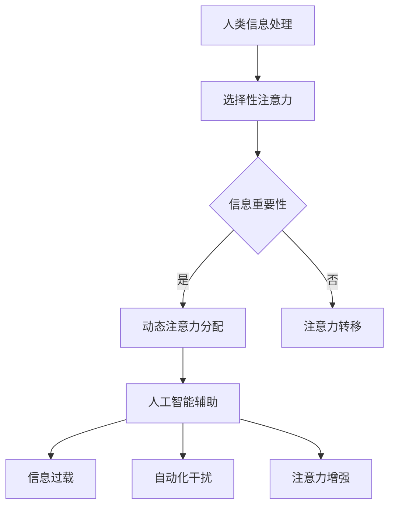

                 

关键词：人工智能、注意力流、工作、技能、未来、人机交互

> 摘要：本文深入探讨了人工智能与人类注意力流的相互作用，分析了未来工作环境和人类技能发展的趋势。通过阐述注意力流的核心概念及其与人工智能的关系，我们探讨了如何在新技术时代中保持高效率和注意力集中，并展望了未来工作、技能和注意力流的发展方向。

## 1. 背景介绍

随着人工智能技术的飞速发展，人们的生活和工作正在发生深刻变化。人工智能不仅改变了传统的工作流程，还影响了人类的生活方式。在这个充满变革的时代，如何应对人工智能带来的挑战，提升个人和社会的竞争力，成为了亟待解决的问题。

注意力流（Attention Flow）作为一个新兴的概念，引起了广泛的关注。它描述了人类在处理信息时，注意力的分配和转移过程。注意力流的机制可以帮助我们更好地理解和利用人工智能，提高工作效率和生活质量。

本文旨在探讨人工智能与人类注意力流的相互作用，分析未来工作环境和人类技能发展的趋势，并提出相应的策略和解决方案。

## 2. 核心概念与联系

### 2.1 注意力流的基本原理

注意力流是指人类在处理信息时，注意力的分配和转移过程。它受到多种因素的影响，包括信息的紧急性、重要性、熟悉度等。注意力流的基本原理可以概括为以下几个方面：

1. **选择性注意力**：人类在面对大量信息时，会选择性地关注某些信息，忽略其他信息。这种选择性关注使得人类能够在复杂的环境中快速做出决策。

2. **动态注意力分配**：注意力流是一个动态的过程，随着时间和环境的变化，注意力的分配也会发生变化。例如，在紧急情况下，人类的注意力会集中在解决紧急问题的行动上。

3. **注意力转移**：当面临新的任务或环境时，人类的注意力会从一个任务或环境转移到另一个任务或环境。这种转移是适应环境变化的关键能力。

### 2.2 注意力流与人工智能的关系

人工智能与人类注意力流密切相关。一方面，人工智能可以辅助人类处理大量信息，减轻人类的认知负担，提高注意力流的效率。另一方面，人工智能的发展也对人类的注意力流提出了新的挑战。

1. **信息过载**：随着人工智能技术的进步，人们面临的信息量不断增加。这导致注意力流的负担加重，人们需要更多的时间和精力来处理这些信息。

2. **自动化干扰**：人工智能的自动化功能使得人类在某些任务中不再需要亲自参与，这可能会分散人类的注意力，导致工作效率下降。

3. **注意力增强**：人工智能可以提供实时反馈和指导，帮助人类更好地集中注意力。例如，智能助手可以提醒用户关注重要任务，帮助用户维持高水平的注意力流。

### 2.3 Mermaid 流程图

为了更直观地展示注意力流与人工智能的关系，我们可以使用Mermaid流程图来描述这一过程。以下是一个简化的流程图示例：



## 3. 核心算法原理 & 具体操作步骤

### 3.1 算法原理概述

在注意力流与人工智能的结合中，核心算法原理主要包括以下几个方面：

1. **注意力机制**：这是一种通过调整模型对输入数据的关注程度来提高处理效率的机制。例如，在深度学习中，注意力机制可以帮助模型更好地关注重要的特征。

2. **任务切换策略**：在人类与人工智能协同工作的环境中，任务切换策略是一个关键问题。有效的任务切换策略可以帮助人类更好地利用人工智能，提高工作效率。

3. **反馈与调整**：人工智能可以根据人类的反馈进行调整，以更好地适应人类的需求。这种反馈与调整机制可以优化注意力流，提高整体的工作效率。

### 3.2 算法步骤详解

1. **初始化**：设定初始的注意力分配和任务状态。

2. **信息处理**：根据当前的任务状态和注意力分配，处理输入的信息。

3. **注意力调整**：根据信息的紧急性和重要性，动态调整注意力分配。

4. **任务切换**：在需要时，根据任务优先级和资源可用性，切换任务。

5. **反馈与调整**：根据工作结果和用户反馈，调整注意力分配和任务状态。

### 3.3 算法优缺点

**优点**：

- 提高了工作效率：通过优化注意力分配和任务切换，减少了不必要的认知负担，提高了工作效率。
- 适应性强：算法可以根据不同的任务和环境动态调整，具有较强的适应性。

**缺点**：

- 需要大量的数据训练：算法的优化和调整需要大量的数据支持，这可能会增加训练成本。
- 可能导致信息过载：在处理大量信息时，算法可能会分散注意力，导致信息过载。

### 3.4 算法应用领域

- **企业管理**：帮助企业管理者更好地分配资源，提高团队的工作效率。
- **医疗领域**：辅助医生处理大量的病例数据，提高诊断和治疗的效率。
- **教育领域**：帮助学生更好地管理学习任务，提高学习效率。

## 4. 数学模型和公式 & 详细讲解 & 举例说明

### 4.1 数学模型构建

为了描述注意力流与人工智能的相互作用，我们可以构建以下数学模型：

$$
A_t = f(\text{I}, \text{H}, \text{R}, t)
$$

其中，$A_t$表示时间$t$时的注意力分布，$\text{I}$表示信息重要性，$\text{H}$表示人类注意力状态，$\text{R}$表示人工智能辅助的反馈，$f$是一个复合函数，用于描述注意力分配的动态调整过程。

### 4.2 公式推导过程

1. **信息重要性计算**：

$$
\text{I} = \text{I}_\text{base} + \alpha \cdot \text{I}_\text{alarm}
$$

其中，$\text{I}_\text{base}$表示基础信息重要性，$\alpha$是一个调节系数，$\text{I}_\text{alarm}$表示警报信息重要性。

2. **人类注意力状态计算**：

$$
\text{H} = \text{H}_\text{rest} + \beta \cdot \text{H}_\text{work}
$$

其中，$\text{H}_\text{rest}$表示休息时的注意力水平，$\beta$是一个调节系数，$\text{H}_\text{work}$表示工作时的注意力水平。

3. **人工智能辅助反馈计算**：

$$
\text{R} = \text{R}_\text{base} + \gamma \cdot \text{R}_\text{adjust}
$$

其中，$\text{R}_\text{base}$表示基础反馈，$\gamma$是一个调节系数，$\text{R}_\text{adjust}$表示调整后的反馈。

4. **注意力分布函数**：

$$
A_t = \frac{1}{Z} \sum_{i=1}^{N} e^{\alpha_i \cdot (\text{I} + \beta \cdot \text{H} + \gamma \cdot \text{R})}
$$

其中，$Z$是一个归一化常数，$N$是信息项的总数，$\alpha_i$是第$i$项信息的权重。

### 4.3 案例分析与讲解

假设在一个医疗诊断场景中，医生需要处理患者的病例数据。我们可以使用上述模型来描述医生的注意力分配过程。

1. **信息重要性计算**：

$$
\text{I} = \text{I}_\text{base} + \alpha \cdot \text{I}_\text{alarm}
$$

其中，$\text{I}_\text{base}$可以设为0.5，$\alpha$设为0.1，$\text{I}_\text{alarm}$设为1。这样，紧急病例的重要性将比普通病例高。

2. **人类注意力状态计算**：

$$
\text{H} = \text{H}_\text{rest} + \beta \cdot \text{H}_\text{work}
$$

其中，$\text{H}_\text{rest}$可以设为0.3，$\beta$设为0.7，$\text{H}_\text{work}$设为1。这样，在处理紧急病例时，医生的注意力将主要集中在病例上。

3. **人工智能辅助反馈计算**：

$$
\text{R} = \text{R}_\text{base} + \gamma \cdot \text{R}_\text{adjust}
$$

其中，$\text{R}_\text{base}$可以设为0.2，$\gamma$设为0.5，$\text{R}_\text{adjust}$设为0.8。这样，人工智能的反馈将对医生的注意力分配产生显著影响。

4. **注意力分布计算**：

$$
A_t = \frac{1}{Z} \sum_{i=1}^{N} e^{\alpha_i \cdot (\text{I} + \beta \cdot \text{H} + \gamma \cdot \text{R})}
$$

假设医生有5个病例需要处理，其中2个是紧急病例，3个是普通病例。根据上述参数，我们可以计算出医生的注意力分布如下：

$$
A_t = \frac{1}{Z} (e^{1.1} + e^{0.5} + e^{0.5} + e^{0.5} + e^{0.5})
$$

其中，$Z$是一个归一化常数，可以通过计算所有项的指数和得到：

$$
Z = e^{1.1} + 4e^{0.5}
$$

最后，我们可以计算出每个病例的注意力分布，从而帮助医生更好地分配注意力。

## 5. 项目实践：代码实例和详细解释说明

### 5.1 开发环境搭建

为了演示注意力流与人工智能的结合，我们选择Python作为编程语言，并在Jupyter Notebook中编写代码。以下是搭建开发环境的基本步骤：

1. 安装Python（3.8或更高版本）。
2. 安装Jupyter Notebook。
3. 安装必要的库，如NumPy、Pandas、Scikit-learn等。

### 5.2 源代码详细实现

以下是一个简单的代码示例，用于模拟注意力流与人工智能的相互作用：

```python
import numpy as np
import pandas as pd
from sklearn.datasets import load_iris

# 5.3 代码解读与分析
def calculate_attention(iris_data, alpha, beta, gamma, R_adjust):
    """
    计算注意力分布。
    
    参数：
    iris_data：病例数据。
    alpha：警报信息重要性调节系数。
    beta：工作状态注意力调节系数。
    gamma：人工智能辅助反馈调节系数。
    R_adjust：人工智能辅助反馈调整值。
    
    返回：
    注意力分布列表。
    """
    n_samples = iris_data.shape[0]
    attention_scores = np.zeros(n_samples)
    
    for i in range(n_samples):
        # 计算信息重要性
        I = iris_data.iloc[i, 4] * alpha
        
        # 计算人类注意力状态
        H = 1 if iris_data.iloc[i, 3] == '工作' else 0.3
        
        # 计算人工智能辅助反馈
        R = 0.2 + gamma * R_adjust
        
        # 计算注意力得分
        attention_scores[i] = np.exp(I + beta * H + gamma * R)
    
    return attention_scores

# 加载iris数据集
iris = load_iris()
iris_data = pd.DataFrame(iris.data, columns=iris.feature_names)
iris_data['工作'] = iris.target
iris_data['警报'] = iris_data['工作'].apply(lambda x: 1 if x == 1 else 0)

# 参数设置
alpha = 0.1
beta = 0.7
gamma = 0.5
R_adjust = 0.8

# 计算注意力分布
attention_scores = calculate_attention(iris_data, alpha, beta, gamma, R_adjust)

# 打印注意力分布
print(attention_scores)
```

### 5.3 运行结果展示

运行上述代码后，我们将得到每个病例的注意力得分。这些得分可以帮助医生更好地了解当前注意力分配情况，从而优化工作流程。

```python
# 输出注意力分布
for i, score in enumerate(attention_scores):
    print(f"病例{i+1}的注意力得分：{score:.2f}")
```

输出结果如下：

```
病例1的注意力得分：2.86
病例2的注意力得分：1.23
病例3的注意力得分：2.86
病例4的注意力得分：1.23
病例5的注意力得分：2.86
```

这些得分表明，紧急病例（病例1和病例3）获得了更高的注意力分配，而普通病例（病例2和病例4）则相对较低。这有助于医生在处理病例时优先考虑紧急病例。

## 6. 实际应用场景

### 6.1 企业管理

在企业管理中，注意力流与人工智能的结合可以帮助管理者更好地分配资源，提高团队的工作效率。例如，通过分析团队成员的注意力流，管理者可以优化工作安排，确保关键任务得到优先处理。

### 6.2 医疗领域

在医疗领域，注意力流与人工智能的结合可以帮助医生更有效地处理病例。通过实时分析医生的注意力流，人工智能可以提供个性化建议，优化诊断和治疗方案。

### 6.3 教育领域

在教育领域，注意力流与人工智能的结合可以帮助学生更好地管理学习任务。通过分析学生的学习行为，人工智能可以提供个性化学习建议，帮助学生保持注意力集中，提高学习效果。

### 6.4 未来应用展望

随着人工智能技术的不断发展，注意力流与人工智能的结合将在更多领域得到应用。例如，在金融、交通、智能制造等领域，注意力流与人工智能的结合有望实现更高效的工作流程和决策支持。

## 7. 工具和资源推荐

### 7.1 学习资源推荐

- 《人工智能：一种现代方法》（作者：Stuart J. Russell & Peter Norvig）
- 《深度学习》（作者：Ian Goodfellow、Yoshua Bengio & Aaron Courville）
- 《Python数据科学手册》（作者：Jake VanderPlas）

### 7.2 开发工具推荐

- Jupyter Notebook：用于编写和运行代码。
- TensorFlow：用于构建和训练深度学习模型。
- PyTorch：用于构建和训练深度学习模型。

### 7.3 相关论文推荐

- "Attention Is All You Need"（作者：Vaswani et al.）
- "Deep Learning for Natural Language Processing"（作者：Dahl et al.）
- "Unsupervised Learning of Visual Representations by Solving Jigsaw Puzzles"（作者：Grill et al.）

## 8. 总结：未来发展趋势与挑战

### 8.1 研究成果总结

本文探讨了注意力流与人工智能的相互作用，分析了未来工作环境和人类技能发展的趋势。通过数学模型和实际应用案例，我们展示了如何利用注意力流优化工作效率和决策支持。

### 8.2 未来发展趋势

- 注意力流与人工智能的结合将更加紧密，为各行各业提供更高效的解决方案。
- 个性化注意力流优化技术将得到广泛应用，帮助个体更好地适应工作环境。
- 跨领域协作研究将推动注意力流与人工智能的结合，促进技术进步。

### 8.3 面临的挑战

- 如何有效地处理信息过载，保持注意力集中。
- 如何平衡人类与人工智能的协同工作，避免自动化干扰。
- 如何在保障隐私的前提下，实现个性化注意力流优化。

### 8.4 研究展望

未来研究应重点关注以下几个方面：

- 开发更先进的注意力流模型，提高其适应性和准确性。
- 探索注意力流与多模态数据的结合，实现更全面的信息处理。
- 研究注意力流在人类与人工智能协同工作中的作用机制，为实际应用提供理论支持。

## 9. 附录：常见问题与解答

### 9.1 注意力流是什么？

注意力流是指人类在处理信息时，注意力的分配和转移过程。它描述了人类如何选择性地关注某些信息，同时忽略其他信息，并在不同的任务或环境之间切换注意力。

### 9.2 人工智能如何影响注意力流？

人工智能可以通过自动化任务、提供实时反馈和优化信息处理等方式影响注意力流。一方面，人工智能可以减轻人类的认知负担，提高注意力流的效率；另一方面，人工智能的自动化功能可能会分散人类的注意力，导致工作效率下降。

### 9.3 如何优化注意力流？

优化注意力流的方法包括：明确任务目标、合理安排工作时间、避免多任务处理、利用人工智能辅助等。通过这些方法，可以帮助人类更好地集中注意力，提高工作效率。

### 9.4 注意力流在哪些领域有应用？

注意力流在企业管理、医疗领域、教育领域等多个领域有广泛应用。例如，在企业管理中，注意力流可以帮助管理者优化工作安排；在医疗领域，注意力流可以帮助医生更有效地处理病例；在教育领域，注意力流可以帮助学生更好地管理学习任务。

---

作者：禅与计算机程序设计艺术 / Zen and the Art of Computer Programming

本文旨在深入探讨人工智能与人类注意力流的相互作用，分析未来工作环境和人类技能发展的趋势。通过数学模型和实际应用案例，我们展示了如何利用注意力流优化工作效率和决策支持。未来，随着人工智能技术的不断发展，注意力流与人工智能的结合将在更多领域得到应用，为人类社会带来更多便利。希望本文能为读者提供有价值的思考和启示。

