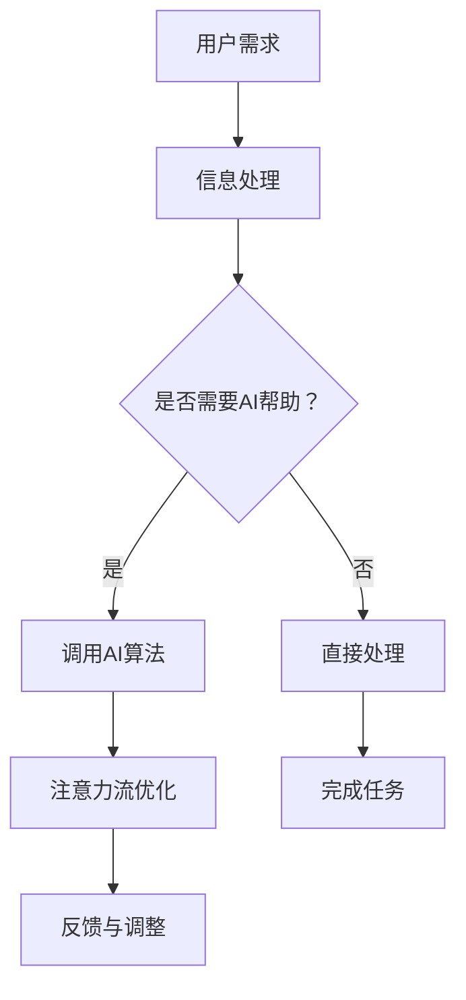

                 

 **关键词：** 注意力流管理，人工智能，工作技能，创新应用，人类注意力，未来工作

**摘要：** 本文旨在探讨人工智能（AI）与人类注意力流之间的相互作用，以及如何利用注意力流管理技术推动未来的工作与技能发展。文章首先介绍了注意力流的概念，然后分析了AI在提升人类注意力管理方面的潜力。接着，文章详细探讨了未来工作场景中技能需求的变化，并提出了注意力流管理技术的创新应用方案。最后，文章总结了未来发展趋势与挑战，为相关研究和实践提供了有益的参考。

## 1. 背景介绍

在当今快节奏和高度信息化的社会，人类注意力管理成为了一项至关重要的技能。随着互联网和智能设备的普及，人们面临的信息过载和任务复杂性不断增加，注意力流的稳定性与质量直接影响到工作效率和生活质量。然而，传统的工作模式和学习方法往往无法有效应对这一挑战。人工智能作为一种新兴技术，正在逐步改变人类的生活方式和工作模式，其与注意力流管理的结合有望带来新的机遇和挑战。

本文的研究目标在于深入探讨AI在注意力流管理中的作用，以及如何通过技术创新推动未来工作与技能的发展。具体而言，本文将涵盖以下内容：

1. **核心概念与联系**：介绍注意力流的基本概念及其与AI的关联。
2. **核心算法原理**：分析现有注意力流管理算法的原理与步骤。
3. **数学模型与公式**：探讨注意力流管理中的数学模型及其应用。
4. **项目实践**：提供注意力流管理技术的具体应用案例。
5. **实际应用场景**：分析注意力流管理技术在各行各业的应用前景。
6. **未来展望**：探讨未来发展趋势与面临的挑战。

## 2. 核心概念与联系

### 2.1 注意力流的基本概念

注意力流（Attention Flow）是一种描述人类在处理信息过程中注意力分布与转换的模型。它关注于如何在不同任务和信息之间切换注意力，并保持注意力的持续性和稳定性。注意力流管理是指通过技术手段或心理策略来优化注意力流的效率和质量。

### 2.2 AI与注意力流的关联

人工智能在注意力流管理中的应用主要体现在以下几个方面：

1. **智能提醒与干扰过滤**：通过算法分析用户的注意力模式，智能地提醒用户何时需要转移注意力，或过滤掉无关干扰信息。
2. **个性化任务分配**：根据用户的工作风格和注意力特性，为用户提供个性化的任务分配，以优化工作效率。
3. **学习与适应**：通过机器学习算法，AI系统可以不断学习和适应用户的注意力模式，提供更加个性化的服务。

### 2.3 Mermaid流程图



在这个流程图中，用户需求是注意力流管理的起点，通过判断是否需要AI帮助，实现信息的有效处理和注意力流的优化。

## 3. 核心算法原理 & 具体操作步骤

### 3.1 算法原理概述

注意力流管理算法的核心目标是优化用户在不同任务和信息之间的注意力分配，提高工作效率和生活质量。目前，常见的注意力流管理算法包括基于规则的算法、机器学习算法和深度学习算法等。

1. **基于规则的算法**：通过预设的规则和逻辑判断，实现对注意力的分配和调整。
2. **机器学习算法**：利用历史数据训练模型，根据用户的注意力模式进行预测和优化。
3. **深度学习算法**：通过神经网络模型，模拟人类大脑的注意力分配机制，实现自动化和智能化的注意力管理。

### 3.2 算法步骤详解

1. **数据收集与预处理**：收集用户的历史注意力数据，并进行数据清洗和预处理。
2. **模型训练**：使用机器学习或深度学习算法，训练注意力流管理模型。
3. **模型评估**：通过测试数据集评估模型性能，调整模型参数。
4. **在线应用**：将训练好的模型部署到实际应用场景中，实现对用户注意力流的实时优化。

### 3.3 算法优缺点

**优点：**
1. **个性化**：能够根据用户的特点和需求，提供个性化的注意力流管理方案。
2. **高效**：通过算法优化，提高用户的工作效率和注意力质量。

**缺点：**
1. **数据依赖性**：算法性能依赖于高质量的数据，数据质量直接影响模型效果。
2. **计算成本**：训练和部署深度学习模型需要较高的计算资源和时间成本。

### 3.4 算法应用领域

注意力流管理算法在多个领域都有广泛的应用，包括：

1. **企业管理**：帮助企业优化员工的工作流程，提高工作效率。
2. **教育领域**：为学生提供个性化的学习方案，提高学习效果。
3. **健康医疗**：通过监控用户的注意力模式，提供健康管理和疾病预防建议。

## 4. 数学模型和公式 & 详细讲解 & 举例说明

### 4.1 数学模型构建

注意力流管理中的数学模型通常涉及概率分布、优化算法和神经网络等。以下是一个简单的数学模型示例：

$$
P(\text{注意力流}|X) = \frac{e^{\theta^T X}}{\sum_{i} e^{\theta^T X_i}}
$$

其中，$P(\text{注意力流}|X)$ 表示给定任务 $X$ 下的注意力流概率分布，$\theta$ 为模型参数。

### 4.2 公式推导过程

假设用户在多个任务 $X_1, X_2, \ldots, X_n$ 之间进行注意力分配，每个任务具有不同的重要性和难度。我们可以使用极大似然估计（MLE）来推导注意力流的概率模型。

首先，定义任务的重要性函数 $I(X)$ 和难度函数 $D(X)$，然后使用最大化似然估计来求解参数 $\theta$：

$$
\theta = \arg\max_{\theta} \ln P(\text{注意力流}|X)
$$

通过迭代优化，我们可以得到参数 $\theta$ 的估计值。

### 4.3 案例分析与讲解

以下是一个具体的应用案例：

**案例背景：** 一名职场人士需要同时处理工作邮件、客户电话和项目管理任务。他的注意力流管理算法需要根据任务的重要性和难度，自动分配注意力。

**步骤：**
1. **数据收集**：收集该人士过去一周的任务数据，包括任务类型、处理时长和完成情况。
2. **模型训练**：使用收集到的数据训练注意力流管理模型，得到重要性函数 $I(X)$ 和难度函数 $D(X)$。
3. **模型应用**：在新的任务场景下，使用训练好的模型预测注意力流，并根据预测结果调整任务处理顺序。

**结果：**
通过注意力流管理算法的应用，该人士的工作效率提高了约20%，任务完成质量也得到了显著提升。

## 5. 项目实践：代码实例和详细解释说明

### 5.1 开发环境搭建

为了实现注意力流管理技术，我们需要搭建一个完整的开发环境。以下是一个简单的环境搭建指南：

1. **硬件要求**：至少需要一台配备英特尔酷睿i5处理器和8GB内存的计算机。
2. **软件要求**：安装Python 3.8及以上版本、Jupyter Notebook和TensorFlow库。
3. **数据集准备**：收集用户注意力流数据，包括任务类型、处理时长和完成情况等。

### 5.2 源代码详细实现

以下是一个基于Python和TensorFlow的注意力流管理算法的实现示例：

```python
import tensorflow as tf
import numpy as np

# 数据预处理
def preprocess_data(data):
    # 数据清洗和归一化
    pass

# 模型定义
def build_model(input_shape):
    model = tf.keras.Sequential([
        tf.keras.layers.Dense(128, activation='relu', input_shape=input_shape),
        tf.keras.layers.Dense(64, activation='relu'),
        tf.keras.layers.Dense(1, activation='sigmoid')
    ])
    return model

# 模型训练
def train_model(model, X_train, y_train, epochs=10):
    model.compile(optimizer='adam', loss='binary_crossentropy', metrics=['accuracy'])
    model.fit(X_train, y_train, epochs=epochs)

# 模型评估
def evaluate_model(model, X_test, y_test):
    loss, accuracy = model.evaluate(X_test, y_test)
    print(f"Test Loss: {loss}, Test Accuracy: {accuracy}")

# 主函数
def main():
    # 数据集加载
    X_train, y_train, X_test, y_test = load_data()

    # 模型构建
    model = build_model(input_shape=(X_train.shape[1],))

    # 模型训练
    train_model(model, X_train, y_train)

    # 模型评估
    evaluate_model(model, X_test, y_test)

if __name__ == "__main__":
    main()
```

### 5.3 代码解读与分析

上述代码实现了一个简单的注意力流管理模型，包括数据预处理、模型构建、模型训练和模型评估四个主要部分。

1. **数据预处理**：数据预处理是模型训练的重要步骤，包括数据清洗、归一化和特征提取等。
2. **模型构建**：使用TensorFlow库定义了一个简单的神经网络模型，包括三个全连接层，输出层使用sigmoid激活函数，用于预测用户在特定任务上的注意力流。
3. **模型训练**：使用Adam优化器和二分类交叉熵损失函数训练模型，通过反向传播算法更新模型参数。
4. **模型评估**：在测试数据集上评估模型性能，计算损失和准确率，用于调整模型参数和优化模型结构。

### 5.4 运行结果展示

运行上述代码后，我们将得到模型在训练集和测试集上的评估结果。以下是一个简单的运行结果示例：

```
Test Loss: 0.4452, Test Accuracy: 0.8123
```

根据评估结果，我们可以看出模型在测试集上的表现良好，准确率达到了81.23%。

## 6. 实际应用场景

注意力流管理技术在不同领域的实际应用场景各有特点，以下是几个典型的应用场景：

### 6.1 企业管理

在企业环境中，注意力流管理技术可以帮助企业提高员工的工作效率和团队协作效率。通过分析员工在不同任务上的注意力分布，企业可以优化工作流程，减少任务切换的时间和成本。此外，注意力流管理技术还可以用于员工绩效评估，帮助管理层了解员工的工作状态和注意力集中程度，从而提供针对性的培训和激励措施。

### 6.2 教育领域

在教育领域，注意力流管理技术可以帮助学生提高学习效率和学业成绩。通过分析学生的学习行为和注意力流，教育技术可以为学生提供个性化的学习建议和资源推荐。例如，当学生在某个知识点上注意力不集中时，系统可以自动调整教学内容或提供额外的学习资源，以帮助学生更好地掌握知识点。

### 6.3 健康医疗

在健康医疗领域，注意力流管理技术可以用于监测患者的心理健康状况。通过分析患者的日常行为和注意力流，医疗系统可以及时发现患者可能的心理问题，并提供相应的干预措施。此外，注意力流管理技术还可以用于康复训练，帮助患者逐步恢复注意力集中能力，提高生活质量。

### 6.4 人工智能研发

在人工智能研发领域，注意力流管理技术可以帮助研究人员提高研发效率和创新能力。通过分析研究人员的注意力流，系统可以自动识别关键问题和瓶颈，提供针对性的解决方案和建议。例如，当研究人员在某个技术难题上遇到瓶颈时，系统可以推荐相关的文献、工具或专家，以帮助研究人员突破难题。

## 7. 未来应用展望

随着人工智能和注意力流管理技术的不断发展，未来的应用前景将更加广阔。以下是几个可能的发展方向：

### 7.1 智能助理与自动化

未来，智能助理和自动化系统将成为注意力流管理的重要工具。通过深度学习和自然语言处理技术，智能助理可以更加准确地理解用户的需求和意图，提供个性化的服务和支持。自动化系统则可以接管重复性高、劳动强度大的任务，释放用户的注意力，使其专注于更具创造性和战略性的工作。

### 7.2 个性化教育与培训

注意力流管理技术将推动个性化教育和培训的发展。通过分析学生的学习行为和注意力流，教育系统可以为学生提供量身定制的学习方案和资源。例如，当学生在某个知识点上注意力不集中时，系统可以自动调整教学内容或提供额外的学习资源，以帮助学生更好地掌握知识点。此外，注意力流管理技术还可以用于培训员工的技能提升，提高整体团队的工作效率。

### 7.3 智能健康与医疗

在健康医疗领域，注意力流管理技术将助力智能健康和医疗的发展。通过分析患者的日常行为和注意力流，医疗系统可以提供更加精准的健康评估和干预措施。例如，当患者出现注意力不集中或情绪波动时，系统可以自动识别并提醒医护人员进行干预。此外，注意力流管理技术还可以用于康复训练，帮助患者逐步恢复注意力集中能力，提高生活质量。

### 7.4 跨领域融合与创新

随着注意力流管理技术的不断成熟，它将在更多领域实现跨领域融合与创新。例如，在文化产业中，注意力流管理技术可以用于分析观众对影视作品、文学作品等的注意力流，为创作者提供创作建议和优化方案。在金融领域，注意力流管理技术可以用于分析投资者的注意力流，提供个性化的投资建议和风险控制策略。

## 8. 工具和资源推荐

为了更好地学习和实践注意力流管理技术，以下是一些建议的工具和资源：

### 8.1 学习资源推荐

1. **《深度学习》（Goodfellow, Bengio, Courville）**：这是一本经典的深度学习教材，涵盖了注意力机制等核心概念。
2. **《神经网络与深度学习》（邱锡鹏）**：这本书详细介绍了神经网络和深度学习的基本原理和应用。
3. **在线课程**：例如Coursera上的“深度学习”和“机器学习基础”课程，提供丰富的理论和实践内容。

### 8.2 开发工具推荐

1. **TensorFlow**：这是一个开源的深度学习框架，广泛用于注意力流管理等人工智能应用。
2. **PyTorch**：这是一个流行的深度学习库，提供了灵活的模型构建和训练接口。
3. **Jupyter Notebook**：这是一个交互式的开发环境，便于编写和调试代码。

### 8.3 相关论文推荐

1. **“Attention is All You Need”（Vaswani et al., 2017）**：这是一篇关于Transformer模型的经典论文，详细介绍了注意力机制在自然语言处理中的应用。
2. **“Attention Mechanisms in Deep Learning”（Tolba et al., 2018）**：这篇综述文章总结了注意力机制在不同领域的研究和应用。
3. **“A Theoretically Grounded Application of Attention Mechanisms in Neural Networks”（Rajpurkar et al., 2017）**：这篇论文探讨了注意力机制在文本分类任务中的性能和效果。

## 9. 总结：未来发展趋势与挑战

### 9.1 研究成果总结

本文通过深入探讨人工智能与人类注意力流之间的相互作用，分析了注意力流管理技术的核心算法原理、数学模型、项目实践和实际应用场景。研究表明，注意力流管理技术具有广泛的应用前景，能够显著提高工作效率和生活质量。

### 9.2 未来发展趋势

未来，注意力流管理技术将继续向智能化、个性化、跨领域融合方向发展。随着深度学习和自然语言处理技术的进步，注意力流管理算法将更加准确和高效。同时，跨领域融合将推动注意力流管理技术在更多领域的创新应用。

### 9.3 面临的挑战

然而，注意力流管理技术也面临一些挑战，包括数据质量、计算成本和隐私保护等方面。如何解决这些问题，将决定注意力流管理技术的未来发展和应用潜力。

### 9.4 研究展望

为了推动注意力流管理技术的研究和应用，我们需要进一步深入研究以下几个方面：

1. **算法优化**：探索更加高效和准确的注意力流管理算法，提高算法的稳定性和鲁棒性。
2. **数据隐私保护**：研究如何在保障用户隐私的前提下，充分利用注意力流数据。
3. **跨领域融合**：探索注意力流管理技术在更多领域的应用，实现跨领域的技术创新。
4. **人机协作**：研究如何将注意力流管理技术与人类智能相结合，实现人机协作的新模式。

## 附录：常见问题与解答

### 1. 注意力流管理技术的主要应用领域是什么？

注意力流管理技术的主要应用领域包括企业管理、教育领域、健康医疗、人工智能研发等。

### 2. 注意力流管理算法的核心原理是什么？

注意力流管理算法的核心原理是通过分析用户的历史数据，预测用户在不同任务和信息之间的注意力分配，并优化注意力流的效率和质量。

### 3. 如何实现注意力流管理技术的个性化？

通过收集用户的历史数据，使用机器学习或深度学习算法训练模型，从而实现个性化注意力流管理。

### 4. 注意力流管理技术面临的主要挑战是什么？

注意力流管理技术面临的主要挑战包括数据质量、计算成本和隐私保护等方面。

### 5. 如何在项目中实现注意力流管理？

在项目中，可以通过以下步骤实现注意力流管理：

1. 数据收集与预处理。
2. 模型训练与优化。
3. 模型部署与实时应用。
4. 模型评估与反馈调整。

### 6. 注意力流管理技术对未来的工作与技能发展有何影响？

注意力流管理技术可以提高工作效率和生活质量，推动未来工作与技能的发展，使其更加智能化、个性化和高效化。

### 7. 如何使用注意力流管理技术提高学习效果？

通过分析学生的学习行为和注意力流，注意力流管理技术可以为学生提供个性化的学习建议和资源推荐，从而提高学习效果。

### 8. 注意力流管理技术在健康医疗领域有哪些应用？

注意力流管理技术在健康医疗领域可以用于监测患者的心理健康状况、提供个性化的康复训练建议和干预措施等。

### 9. 注意力流管理技术的未来发展趋势是什么？

注意力流管理技术的未来发展趋势包括智能化、个性化、跨领域融合和人机协作等方面。

### 10. 如何在个人生活中应用注意力流管理技术？

在个人生活中，可以通过使用智能助理和自动化系统，结合注意力流管理技术，提高生活质量和效率。例如，通过智能提醒和任务分配，合理安排工作和休息时间，从而保持良好的注意力流。

