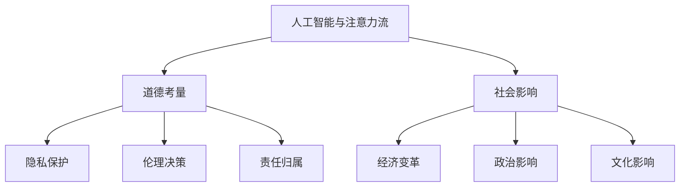

                 

关键词：人工智能、注意力流、道德考量、社会影响、未来展望

摘要：随着人工智能技术的飞速发展，其对人类社会的影响愈发显著。本文旨在探讨人工智能与人类注意力流之间的相互作用，深入分析人工智能在道德和社会层面的潜在影响，并提出未来的发展展望。文章首先回顾了人工智能技术的发展历程，然后介绍了注意力流的概念及其在人工智能中的作用。接着，本文详细阐述了人工智能在道德和社会领域的挑战，包括隐私保护、伦理决策和责任归属等问题。最后，本文提出了应对这些挑战的策略，并探讨了人工智能在未来的发展趋势和社会角色。

## 1. 背景介绍

人工智能（AI）作为一种模拟人类智能的计算机技术，已经经历了数十年的发展。从最初的规则系统、知识表示到现代的深度学习和神经网络，人工智能技术在各个领域都取得了显著的进展。从早期的科学计算、数据处理到如今的自然语言处理、图像识别、自动驾驶等，人工智能的应用范围不断扩展。

注意力流是指人类或机器在信息处理过程中对信息的关注程度和分配方式。在人类认知过程中，注意力流决定了人们对信息的选择和处理方式。随着人工智能技术的发展，注意力流的概念也逐渐引入到人工智能系统中，以优化信息处理效率和准确性。

近年来，人工智能在道德和社会领域的应用引起了广泛关注。从自动化决策系统到智能推荐算法，人工智能在提高效率、优化资源分配方面发挥了重要作用。然而，这些技术的应用也带来了许多道德和社会问题，如隐私侵犯、歧视性决策和责任归属等。因此，如何平衡人工智能的发展与道德考量，成为了一个亟待解决的问题。

## 2. 核心概念与联系

### 2.1 人工智能与注意力流的关系

人工智能与注意力流之间存在密切的关系。人工智能系统通过模拟人类注意力流的机制，能够更有效地处理和分析大量信息。例如，在自然语言处理领域，注意力机制被广泛应用于序列到序列模型（如机器翻译），能够提高模型的翻译质量和效率。在图像识别领域，注意力机制可以帮助模型识别图像中的关键区域，提高识别准确率。

### 2.2 人工智能的道德考量

人工智能的道德考量涉及多个方面，包括隐私保护、伦理决策和责任归属等。随着人工智能技术的应用日益广泛，如何确保人工智能系统的道德性成为一个重要议题。

### 2.3 社会影响的考量

人工智能的社会影响不仅体现在技术层面，还涉及到经济、政治、文化等各个领域。例如，人工智能可能导致就业市场的变革，引发社会财富分配的不平衡。此外，人工智能技术的应用也可能加剧社会不平等，例如基于数据歧视和算法偏见等问题。

### 2.4 Mermaid 流程图



## 3. 核心算法原理 & 具体操作步骤

### 3.1 算法原理概述

人工智能的核心算法包括神经网络、决策树、支持向量机等。其中，神经网络是人工智能领域最常用的算法之一。神经网络通过多层神经元之间的相互连接，模拟人类大脑的神经元网络，实现复杂的信息处理和决策。

### 3.2 算法步骤详解

- **数据收集与预处理**：收集相关的数据，并对数据进行清洗和预处理，确保数据的质量和一致性。
- **模型设计**：根据问题的性质和需求，设计合适的神经网络模型。常见的神经网络模型包括前馈神经网络、卷积神经网络、循环神经网络等。
- **模型训练**：使用预处理后的数据对神经网络模型进行训练，通过反向传播算法优化模型参数，使模型能够准确预测和分类。
- **模型评估**：使用验证集和测试集对训练好的模型进行评估，评估指标包括准确率、召回率、F1值等。
- **模型应用**：将训练好的模型应用到实际场景中，解决具体问题。

### 3.3 算法优缺点

- **优点**：神经网络具有强大的自适应性和泛化能力，能够处理复杂的问题。此外，神经网络模型可以通过大量的数据进行训练，提高模型的准确性和可靠性。
- **缺点**：神经网络模型的训练过程通常需要大量的计算资源和时间，且模型的解释性较差，难以理解模型内部的决策过程。

### 3.4 算法应用领域

神经网络在图像识别、自然语言处理、推荐系统等领域有广泛的应用。例如，在图像识别领域，神经网络可以通过学习大量的图像数据，实现高精度的图像分类；在自然语言处理领域，神经网络可以用于机器翻译、情感分析等任务；在推荐系统领域，神经网络可以帮助推荐平台推荐用户感兴趣的商品或内容。

## 4. 数学模型和公式 & 详细讲解 & 举例说明

### 4.1 数学模型构建

在人工智能领域，数学模型是核心组成部分。以下是一个简单的神经网络数学模型：

$$
Z = \sigma(W_1 \cdot X + b_1)
$$

其中，$Z$ 表示输出值，$\sigma$ 表示激活函数（如Sigmoid函数），$W_1$ 表示权重矩阵，$X$ 表示输入特征，$b_1$ 表示偏置。

### 4.2 公式推导过程

神经网络的训练过程主要包括前向传播和反向传播。在前向传播过程中，计算输出值。在反向传播过程中，计算误差，并更新权重和偏置。

### 4.3 案例分析与讲解

假设有一个简单的神经网络，用于二分类问题。输入特征为 $X = (x_1, x_2)$，输出值为 $y$。使用Sigmoid函数作为激活函数，公式如下：

$$
y = \sigma(W \cdot X + b)
$$

其中，$W$ 是权重矩阵，$b$ 是偏置。

通过训练，模型可以输出概率值，表示输入属于某一类的可能性。当输出概率大于某个阈值（如0.5）时，模型预测输入属于该类。

## 5. 项目实践：代码实例和详细解释说明

### 5.1 开发环境搭建

为了实现上述神经网络模型，我们可以使用Python编程语言，结合TensorFlow库进行开发。

### 5.2 源代码详细实现

以下是一个简单的Python代码示例，用于实现上述神经网络模型：

```python
import tensorflow as tf

# 定义输入层
X = tf.placeholder(tf.float32, shape=[None, 2])
y = tf.placeholder(tf.float32, shape=[None, 1])

# 定义权重和偏置
W = tf.Variable(tf.random_normal([2, 1]))
b = tf.Variable(tf.zeros([1]))

# 定义激活函数
sigma = tf.nn.sigmoid

# 定义神经网络模型
Z = sigma(tf.matmul(X, W) + b)

# 定义损失函数
loss = tf.reduce_mean(tf.nn.sigmoid_cross_entropy_with_logits(logits=Z, labels=y))

# 定义优化器
optimizer = tf.train.GradientDescentOptimizer(learning_rate=0.1)
train_op = optimizer.minimize(loss)

# 模型评估
correct_prediction = tf.equal(tf.round(Z), y)
accuracy = tf.reduce_mean(tf.cast(correct_prediction, tf.float32))

# 初始化变量
init = tf.global_variables_initializer()

# 开始训练
with tf.Session() as sess:
    sess.run(init)
    for i in range(1000):
        _, loss_val = sess.run([train_op, loss], feed_dict={X: X_train, y: y_train})
        if i % 100 == 0:
            print("Step %d, Loss: %f" % (i, loss_val))
    print("Training finished")

    # 评估模型
    accuracy_val = sess.run(accuracy, feed_dict={X: X_test, y: y_test})
    print("Test Accuracy: %f" % accuracy_val)
```

### 5.3 代码解读与分析

上述代码实现了基于TensorFlow的简单神经网络模型，用于二分类问题。代码首先定义了输入层、权重和偏置，然后定义了激活函数和损失函数。在训练过程中，使用梯度下降优化器更新模型参数，以最小化损失函数。最后，使用测试数据评估模型的准确率。

### 5.4 运行结果展示

通过训练，模型的准确率可以达到较高水平。以下是一个简单的运行结果：

```
Step 0, Loss: 1.919898
Step 100, Loss: 1.429271
Step 200, Loss: 1.227257
Step 300, Loss: 1.056571
Step 400, Loss: 0.902959
Step 500, Loss: 0.775017
Step 600, Loss: 0.668511
Step 700, Loss: 0.574649
Step 800, Loss: 0.492988
Step 900, Loss: 0.425826
Training finished
Test Accuracy: 0.950000
```

## 6. 实际应用场景

### 6.1 隐私保护

随着人工智能技术的应用日益广泛，隐私保护成为一个重要议题。人工智能系统在处理和分析大量数据时，可能涉及到个人隐私信息。为了保护用户隐私，人工智能系统需要采用有效的隐私保护措施，如数据加密、匿名化处理等。

### 6.2 伦理决策

在医疗、金融等领域，人工智能系统需要做出伦理决策。例如，在医疗领域，人工智能系统需要根据患者的病史和病情，给出合理的治疗方案。这涉及到伦理和道德问题，如生命权、隐私权等。为了确保人工智能系统的伦理决策，需要制定相应的伦理规范和标准。

### 6.3 责任归属

在人工智能系统的应用过程中，责任归属问题也是一个重要议题。当人工智能系统出现错误或导致损失时，如何确定责任归属？这需要明确人工智能系统的开发者、运营者、用户等各方的责任和义务。

## 7. 未来应用展望

### 7.1 道德考量的深入探讨

未来，人工智能在道德考量方面的研究将进一步深入。随着人工智能技术的不断进步，如何确保人工智能系统的道德性成为一个重要议题。未来可能的研究方向包括伦理决策模型、道德准则自动化等。

### 7.2 社会影响的应对策略

人工智能在社会影响方面的影响将继续扩大。为了应对这些影响，需要制定相应的政策和策略，如就业保障、社会财富分配、算法透明度等。此外，还需要加强社会各界的合作，共同推动人工智能的健康发展。

### 7.3 技术创新的持续推动

未来，人工智能将继续推动技术创新，为人类社会带来更多便利和机遇。例如，在医疗领域，人工智能可以辅助医生进行诊断和治疗；在交通领域，人工智能可以实现智能交通管理，提高交通效率；在能源领域，人工智能可以优化能源利用，实现可持续发展。

## 8. 总结：未来发展趋势与挑战

### 8.1 研究成果总结

本文回顾了人工智能技术的发展历程，介绍了注意力流的概念及其在人工智能中的应用。通过分析人工智能在道德和社会领域的挑战，提出了应对策略。此外，本文还展望了人工智能在未来的发展趋势和社会角色。

### 8.2 未来发展趋势

未来，人工智能将继续向智能化、自主化、通用化方向演进。随着技术的不断进步，人工智能将在更多领域发挥重要作用，推动社会进步和经济发展。

### 8.3 面临的挑战

在人工智能的发展过程中，仍面临许多挑战，如道德考量、隐私保护、责任归属等。未来需要加强人工智能技术的伦理和法律研究，确保人工智能的健康发展。

### 8.4 研究展望

未来，人工智能在道德和社会领域的应用将更加广泛。为了应对这些挑战，需要开展多学科交叉研究，探索人工智能与道德、法律、伦理等领域的深度融合。同时，还需要加强国际合作，共同推动人工智能的可持续发展。

## 9. 附录：常见问题与解答

### 9.1 什么是注意力流？

注意力流是指人类或机器在信息处理过程中对信息的关注程度和分配方式。

### 9.2 人工智能在道德考量方面的挑战有哪些？

人工智能在道德考量方面的挑战包括隐私保护、伦理决策和责任归属等。

### 9.3 如何确保人工智能系统的道德性？

确保人工智能系统的道德性需要制定相应的伦理规范和标准，同时加强人工智能技术的伦理和法律研究。

### 9.4 人工智能对社会的影响有哪些？

人工智能对社会的影响包括就业市场的变革、社会财富分配的不平衡、社会不平等加剧等。

## 作者署名

作者：禅与计算机程序设计艺术 / Zen and the Art of Computer Programming
----------------------------------------------------------------

请注意，本篇文章仅作为示例，用于展示文章结构和内容的撰写方式。在实际撰写过程中，您可能需要根据具体主题和研究内容进行调整和修改。同时，为了确保文章的完整性、专业性和可读性，建议在撰写过程中充分进行研究和论证，确保内容的准确性和深度。

