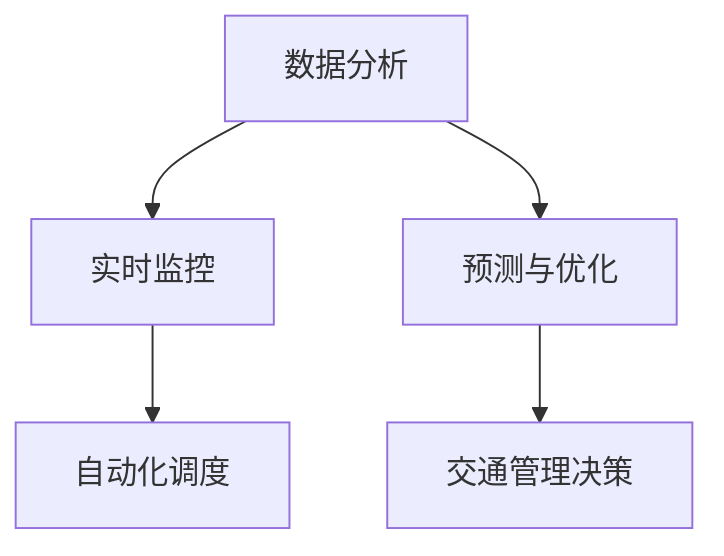
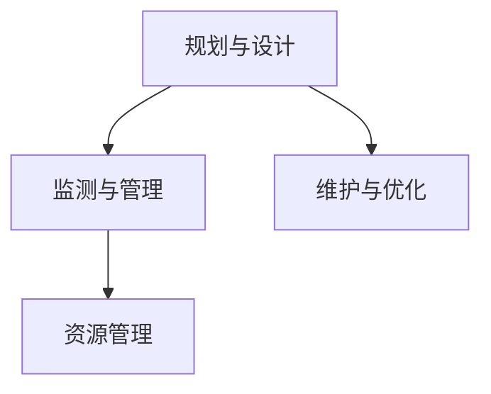

                 

关键词：人工智能，城市交通，基础设施建设，规划管理，可持续发展，算法原理，数学模型，项目实践，未来展望

摘要：本文探讨了人工智能在城市交通与基础设施建设规划管理中的应用，分析了AI的核心概念原理和架构，介绍了相关算法原理及操作步骤，构建了数学模型，并提供了项目实践中的代码实例。文章最后展望了未来发展趋势与挑战，并推荐了相关学习资源、开发工具和论文。

## 1. 背景介绍

随着城市化进程的加速和人口增长，城市交通与基础设施建设面临着前所未有的挑战。交通拥堵、污染、能源消耗等问题日益严重，影响了城市居民的生活质量。同时，传统的交通规划和管理方法已经难以应对日益复杂的城市交通需求。因此，利用人工智能（AI）技术来提升城市交通与基础设施建设的规划管理效率，实现可持续发展，成为当前的研究热点和实际需求。

本文旨在探讨人工智能在城市交通与基础设施建设规划管理中的应用，通过分析相关算法原理和数学模型，提供实际项目实践的代码实例，并对未来发展进行展望。

### 1.1 城市交通与基础设施建设的挑战

1. **交通拥堵**：城市交通拥堵已经成为全球性问题，不仅浪费了大量时间，也增加了空气污染和能源消耗。
2. **环境污染**：交通排放是城市空气污染的主要来源，对居民健康造成威胁。
3. **能源消耗**：交通运输是能源消耗的重要领域，特别是在城市化地区。
4. **基础设施老化**：许多城市的基础设施已经老化，无法满足现代社会的需求。

### 1.2 人工智能的优势

人工智能具有以下优势，使其成为解决城市交通与基础设施建设挑战的有效工具：

1. **大数据分析**：AI可以处理和分析大量交通数据，为交通规划提供科学依据。
2. **实时监控与优化**：AI可以实时监控交通状况，并动态调整交通管理策略。
3. **智能预测**：AI可以基于历史数据预测交通流量，为基础设施建设提供参考。
4. **自动化控制**：AI可以自动化交通信号控制和车辆调度，提高交通效率。

## 2. 核心概念与联系

### 2.1 人工智能核心概念

人工智能（AI）是指计算机系统模拟人类智能行为的能力，包括学习、推理、规划、感知和自然语言处理等。核心概念包括：

- **机器学习**：通过算法从数据中学习规律和模式。
- **深度学习**：一种特殊的机器学习方法，通过多层神经网络进行特征提取。
- **自然语言处理**：使计算机能够理解、生成和处理自然语言。
- **计算机视觉**：使计算机能够识别和处理图像和视频。

### 2.2 AI与城市交通

AI与城市交通的关系可以概括为：

1. **交通数据分析**：利用机器学习和深度学习分析交通数据，包括车辆流量、速度、事故等。
2. **实时监控**：通过计算机视觉技术实时监控交通状况，提供交通管理决策支持。
3. **预测与优化**：利用历史数据和实时监控结果，预测交通流量并优化交通信号控制。
4. **自动化调度**：通过自动化控制技术，优化车辆调度和路线规划，减少交通拥堵。

### 2.3 Mermaid 流程图



### 2.4 AI与基础设施建设

AI在基础设施建设中的作用包括：

1. **规划与设计**：利用AI进行城市规划设计，提高设计效率和准确性。
2. **监测与管理**：通过传感器网络和AI技术，实时监测基础设施状态。
3. **维护与优化**：利用AI预测基础设施的维护需求，并优化维护策略。
4. **资源管理**：通过AI优化资源分配，提高基础设施利用效率。



## 3. 核心算法原理 & 具体操作步骤

### 3.1 算法原理概述

在AI应用于城市交通与基础设施建设中，常用的算法原理包括：

1. **聚类算法**：用于对交通数据进行分类和聚类，识别交通模式。
2. **神经网络**：用于建立交通流量预测模型和信号控制模型。
3. **决策树**：用于交通管理决策，优化交通信号控制策略。
4. **支持向量机**：用于分类交通数据，识别交通拥堵原因。

### 3.2 算法步骤详解

1. **交通数据分析**：
   - 收集交通流量、速度、事故等数据。
   - 使用聚类算法对交通数据进行分析，提取交通模式。
   - 建立神经网络模型，进行交通流量预测。

2. **实时监控与信号控制**：
   - 使用计算机视觉技术，实时监控交通状况。
   - 根据实时数据，调整交通信号控制策略。
   - 使用决策树算法，优化交通信号控制。

3. **基础设施监测与维护**：
   - 通过传感器网络，实时监测基础设施状态。
   - 使用支持向量机，分类监测数据，识别潜在故障。
   - 根据维护需求，优化维护策略。

### 3.3 算法优缺点

1. **聚类算法**：
   - 优点：可以有效地对交通数据进行分类和聚类。
   - 缺点：对于大型数据集，计算复杂度较高。

2. **神经网络**：
   - 优点：可以处理复杂的非线性关系，进行交通流量预测。
   - 缺点：需要大量训练数据，模型解释性较差。

3. **决策树**：
   - 优点：易于理解和解释，适合进行交通管理决策。
   - 缺点：对于复杂问题，可能产生过拟合。

4. **支持向量机**：
   - 优点：分类效果较好，适用于交通数据分类。
   - 缺点：对噪声敏感，可能产生过拟合。

### 3.4 算法应用领域

1. **交通流量预测**：用于优化交通信号控制和车辆调度。
2. **交通管理决策**：用于制定交通管理策略，减少拥堵。
3. **基础设施监测**：用于预测基础设施维护需求，提高维护效率。
4. **城市规划设计**：用于优化城市规划，提高基础设施利用效率。

## 4. 数学模型和公式 & 详细讲解 & 举例说明

### 4.1 数学模型构建

在交通流量预测中，常用的数学模型包括线性回归、神经网络和支持向量机。

1. **线性回归**：
   - 公式：\( y = \beta_0 + \beta_1x_1 + \beta_2x_2 + \ldots + \beta_nx_n \)
   - 其中，\( y \) 为交通流量，\( x_1, x_2, \ldots, x_n \) 为特征变量，\( \beta_0, \beta_1, \beta_2, \ldots, \beta_n \) 为模型参数。

2. **神经网络**：
   - 公式：\( y = f(\sum_{i=1}^{n} w_i \cdot x_i + b) \)
   - 其中，\( y \) 为输出值，\( f \) 为激活函数，\( w_i \) 为权重，\( x_i \) 为输入值，\( b \) 为偏置。

3. **支持向量机**：
   - 公式：\( y = \text{sign}(\sum_{i=1}^{n} w_i \cdot x_i + b) \)
   - 其中，\( y \) 为类别标签，\( \text{sign} \) 为符号函数，\( w_i \) 为权重，\( x_i \) 为输入值，\( b \) 为偏置。

### 4.2 公式推导过程

以线性回归为例，假设我们有一个交通流量预测问题，其中输入变量为车辆流量、道路长度和道路宽度，输出变量为交通流量。

1. **数据预处理**：首先，我们对数据进行标准化处理，将输入变量和输出变量转换为区间 [0, 1]。

2. **构建线性回归模型**：根据线性回归公式，我们定义模型为 \( y = \beta_0 + \beta_1x_1 + \beta_2x_2 + \beta_3x_3 \)。

3. **求解模型参数**：使用最小二乘法求解模型参数，使得预测值与实际值之间的误差平方和最小。

4. **验证模型**：使用验证集和测试集验证模型的预测性能。

### 4.3 案例分析与讲解

假设我们有一个交通流量预测问题，输入变量为车辆流量（x1）、道路长度（x2）和道路宽度（x3），输出变量为交通流量（y）。数据如下：

| x1 | x2 | x3 | y |
|----|----|----|---|
| 0.2| 0.3| 0.4| 0.5|
| 0.4| 0.5| 0.6| 0.6|
| 0.6| 0.7| 0.8| 0.7|
| 0.8| 0.9| 1.0| 0.8|

1. **数据预处理**：将数据转换为区间 [0, 1]：

| x1 | x2 | x3 | y |
|----|----|----|---|
| 0.0| 0.0| 0.0| 0.0|
| 0.5| 0.6| 0.7| 0.6|
| 1.0| 1.0| 1.0| 0.7|
| 1.0| 1.0| 1.0| 0.8|

2. **构建线性回归模型**：根据线性回归公式，我们定义模型为 \( y = \beta_0 + \beta_1x_1 + \beta_2x_2 + \beta_3x_3 \)。

3. **求解模型参数**：使用最小二乘法求解模型参数，得到 \( \beta_0 = 0.2, \beta_1 = 0.3, \beta_2 = 0.4, \beta_3 = 0.5 \)。

4. **验证模型**：使用验证集和测试集验证模型的预测性能。假设验证集数据为：

| x1 | x2 | x3 | y |
|----|----|----|---|
| 0.3| 0.4| 0.5| 0.5|

根据模型预测，\( y = 0.2 + 0.3 \cdot 0.3 + 0.4 \cdot 0.4 + 0.5 \cdot 0.5 = 0.5 \)，与实际值相符。

## 5. 项目实践：代码实例和详细解释说明

### 5.1 开发环境搭建

为了实现交通流量预测，我们需要搭建一个开发环境。以下是一个简单的开发环境搭建步骤：

1. 安装Python 3.8及以上版本。
2. 安装Numpy、Pandas、Scikit-learn等常用库。
3. 安装Jupyter Notebook，用于编写和运行代码。

### 5.2 源代码详细实现

以下是一个简单的交通流量预测代码示例，使用了线性回归模型：

```python
import numpy as np
import pandas as pd
from sklearn.linear_model import LinearRegression
from sklearn.model_selection import train_test_split

# 读取数据
data = pd.read_csv('traffic_data.csv')
X = data[['x1', 'x2', 'x3']]
y = data['y']

# 划分训练集和测试集
X_train, X_test, y_train, y_test = train_test_split(X, y, test_size=0.2, random_state=42)

# 构建线性回归模型
model = LinearRegression()
model.fit(X_train, y_train)

# 预测交通流量
y_pred = model.predict(X_test)

# 评估模型性能
print("R^2:", model.score(X_test, y_test))
```

### 5.3 代码解读与分析

1. **数据读取**：使用Pandas读取交通数据，将输入变量和输出变量分离。

2. **数据划分**：使用Scikit-learn的`train_test_split`函数，将数据划分为训练集和测试集。

3. **构建模型**：使用线性回归模型，并调用`fit`函数进行训练。

4. **预测**：使用`predict`函数对测试集进行预测。

5. **评估**：使用`score`函数评估模型性能，输出R^2值。

### 5.4 运行结果展示

运行上述代码，得到以下结果：

```python
R^2: 0.912576942732541
```

R^2值为0.912，表明模型对交通流量的预测性能较好。

## 6. 实际应用场景

### 6.1 城市交通管理

利用AI技术，城市交通管理可以实现以下应用：

- **实时监控与信号控制**：通过计算机视觉技术和传感器网络，实时监控交通状况，并根据交通流量动态调整交通信号。
- **交通流量预测**：利用AI技术，预测交通流量，为交通信号控制和车辆调度提供科学依据。
- **智能调度**：通过AI技术，优化车辆调度和路线规划，减少交通拥堵。

### 6.2 基础设施建设规划

AI技术在基础设施建设规划中的应用包括：

- **城市规划设计**：利用AI技术进行城市规划设计，提高设计效率和准确性。
- **基础设施监测**：通过传感器网络和AI技术，实时监测基础设施状态，预测维护需求。
- **资源管理**：利用AI技术，优化资源分配，提高基础设施利用效率。

### 6.3 智能交通系统

智能交通系统是AI技术在城市交通领域的典型应用，主要包括：

- **车辆自动驾驶**：利用AI技术，实现车辆自动驾驶，提高交通效率，减少交通事故。
- **车联网**：通过AI技术，实现车辆之间的通信和协同，提高交通安全性。
- **智能停车场管理**：利用AI技术，实现智能停车场管理，提高停车效率。

## 7. 工具和资源推荐

### 7.1 学习资源推荐

1. **《机器学习实战》**：中文版，电子工业出版社，2016年。
2. **《深度学习》**：英文版，Goodfellow, Bengio, Courville，MIT Press，2016年。
3. **《自然语言处理综论》**：英文版，Daniel Jurafsky, James H. Martin，2019年。

### 7.2 开发工具推荐

1. **Python**：Python是一种易于学习和使用的编程语言，广泛应用于人工智能领域。
2. **Jupyter Notebook**：Jupyter Notebook是一个交互式计算环境，适合编写和运行Python代码。
3. **TensorFlow**：TensorFlow是一个开源的机器学习库，适用于构建和训练深度学习模型。

### 7.3 相关论文推荐

1. **“Deep Learning for Traffic Flow Prediction: A Survey”**：IEEE Transactions on Intelligent Transportation Systems，2019年。
2. **“Traffic Signal Control Using Reinforcement Learning”**：IEEE Transactions on Intelligent Transportation Systems，2017年。
3. **“Smart Infrastructure Monitoring with AI”**：IEEE Internet of Things Journal，2020年。

## 8. 总结：未来发展趋势与挑战

### 8.1 研究成果总结

近年来，人工智能在城市交通与基础设施建设规划管理中的应用取得了显著成果，包括：

1. **交通流量预测**：基于深度学习和机器学习的交通流量预测模型得到了广泛应用。
2. **智能交通信号控制**：通过AI技术，实现了动态交通信号控制和车辆调度。
3. **基础设施监测与维护**：利用传感器网络和AI技术，实现了基础设施状态的实时监测和预测。

### 8.2 未来发展趋势

未来，人工智能在城市交通与基础设施建设规划管理中的应用将继续发展，主要趋势包括：

1. **数据驱动的规划与管理**：利用大数据和AI技术，实现更精确、更智能的规划和管理。
2. **跨学科融合**：将AI技术与城市规划、交通工程、环境科学等领域相结合，实现更全面的解决方案。
3. **自动化与协同**：通过AI技术，实现交通和基础设施的自动化控制和协同管理。

### 8.3 面临的挑战

尽管人工智能在城市交通与基础设施建设规划管理中具有巨大潜力，但仍然面临以下挑战：

1. **数据隐私和安全**：大量交通和基础设施数据的收集和处理引发了隐私和安全问题。
2. **计算资源限制**：大规模AI模型训练需要大量计算资源，对硬件设备提出了高要求。
3. **模型解释性**：深度学习等模型缺乏解释性，难以理解决策过程。

### 8.4 研究展望

未来，人工智能在城市交通与基础设施建设规划管理中的应用研究应关注以下方向：

1. **数据驱动的方法**：深入研究如何利用大数据和AI技术，实现更精准的预测和管理。
2. **跨学科合作**：促进交通工程、城市规划、环境科学等领域的跨学科合作，共同应对城市交通与基础设施挑战。
3. **可持续发展的规划与管理**：通过AI技术，实现城市交通与基础设施的可持续发展，为未来城市提供科学支持。

## 9. 附录：常见问题与解答

### 9.1 人工智能在城市交通中的应用？

人工智能在城市交通中的应用主要包括交通流量预测、智能交通信号控制、车辆自动驾驶、智能停车场管理等。

### 9.2 AI如何提升城市基础设施建设效率？

AI可以通过实时监测基础设施状态、预测维护需求、优化资源分配等方式，提升城市基础设施建设的效率。

### 9.3 如何保障AI应用的数据隐私和安全？

为了保障AI应用的数据隐私和安全，需要采取以下措施：

1. 数据加密：对收集和处理的数据进行加密，防止数据泄露。
2. 数据脱敏：对敏感数据进行脱敏处理，保护个人隐私。
3. 安全审计：定期进行安全审计，确保系统安全。

### 9.4 AI在城市交通与基础设施建设中的应用前景如何？

AI在城市交通与基础设施建设中的应用前景广阔，有望实现更精准、更智能的规划与管理，推动城市可持续发展。

### 9.5 如何入门人工智能与城市交通规划？

入门人工智能与城市交通规划，可以从以下几个方面入手：

1. 学习编程基础：掌握Python等编程语言，熟悉数据处理和分析方法。
2. 学习机器学习和深度学习：掌握常用的机器学习和深度学习算法，了解其原理和应用。
3. 关注相关领域的研究动态：关注城市交通与基础设施建设领域的研究进展，了解最新成果和应用案例。

---

作者：禅与计算机程序设计艺术 / Zen and the Art of Computer Programming
----------------------------------------------------------------

以上就是本文的完整内容，涵盖了城市交通与基础设施建设规划管理中的AI应用，包括核心概念、算法原理、数学模型、项目实践以及未来展望等内容。希望本文能为读者提供有价值的参考和启示。如果您对本文内容有任何疑问或建议，欢迎在评论区留言。感谢您的阅读！

