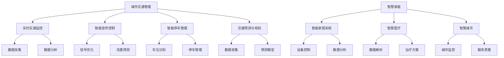

                 

关键词：人工智能，可持续发展，城市生活，交通管理，系统规划，算法，数学模型，案例分析，未来展望

> 摘要：本文探讨了如何利用人工智能（AI）技术来构建可持续发展的城市生活方式和交通管理系统与规划。通过深入分析核心概念、算法原理、数学模型以及实际应用场景，本文为城市规划者、交通管理者以及相关领域的研究人员提供了有价值的参考。文章还将讨论未来发展趋势和面临的挑战，并推荐相关工具和资源，以促进人工智能在城市建设中的广泛应用。

## 1. 背景介绍

在现代社会中，城市生活方式和交通管理面临着巨大的挑战。城市人口的快速增长、交通拥堵、环境污染和能源消耗等问题日益严重。传统的城市规划和交通管理方法已无法满足日益增长的需求，迫切需要新的技术和方法来解决这些问题。人工智能作为一种具有巨大潜力的技术，正在逐步改变城市生活方式和交通管理的面貌。

本文将讨论如何利用人工智能技术来打造可持续发展的城市生活方式和交通管理系统与规划。首先，我们将介绍人工智能的核心概念和基本原理，并探讨其与人类计算之间的关系。接着，我们将详细分析城市交通管理的核心问题，并介绍相关的算法和数学模型。随后，本文将结合实际案例，展示人工智能在城市交通管理中的应用效果。最后，我们将讨论人工智能在未来的发展趋势和面临的挑战，并推荐相关的工具和资源。

## 2. 核心概念与联系

### 2.1 人工智能与人类计算

人工智能（Artificial Intelligence，简称AI）是一种模拟人类智能的技术，旨在使计算机具有感知、理解、学习和决策的能力。人工智能的研究可以追溯到20世纪50年代，但直到最近几年，随着计算能力的提升、大数据的积累以及深度学习算法的突破，人工智能才取得了显著的进展。

人类计算（Human-Centric Computing）是指以人为中心，通过技术手段提高人类的生活质量和工作效率。人类计算强调人与计算机之间的互动，使计算机能够更好地理解、适应和响应人类的需求。人工智能与人类计算之间的关系密不可分，人工智能技术的发展为人类计算提供了强大的技术支持，而人类计算的需求和应用场景又不断推动人工智能技术的创新和进步。

### 2.2 人工智能在交通管理中的应用

交通管理是城市运行的重要组成部分，其效率和稳定性直接关系到城市的生活质量和经济发展。人工智能在交通管理中的应用主要体现在以下几个方面：

1. **实时交通监控**：通过视频监控、传感器和GPS等技术，人工智能可以对城市交通状况进行实时监控和分析，为交通管理者提供决策支持。

2. **智能信号控制**：利用人工智能算法，可以对交通信号灯进行智能控制，优化交通流量，减少拥堵。

3. **智能停车管理**：通过图像识别、机器学习和物联网等技术，可以实现对停车位的智能管理，提高停车效率。

4. **交通预测与规划**：利用历史数据和人工智能算法，可以预测未来交通状况，为城市交通规划提供科学依据。

### 2.3 人工智能在城市生活方式中的应用

除了交通管理，人工智能还在城市生活方式的各个方面发挥着重要作用：

1. **智慧家庭**：通过智能家居系统，人工智能可以实现对家庭设备的智能控制，提高生活便利性。

2. **智慧医疗**：利用人工智能技术，可以对医疗数据进行分析，提高诊断准确性和治疗效果。

3. **智慧城市**：通过物联网、大数据和人工智能等技术，可以实现对城市运行状态的实时监控和管理，提高城市服务水平。

### 2.4 Mermaid 流程图

以下是一个简单的 Mermaid 流程图，展示了人工智能在城市交通管理和城市生活方式中的应用流程：



## 3. 核心算法原理 & 具体操作步骤

### 3.1 算法原理概述

人工智能在交通管理和城市生活方式中的应用，主要依赖于以下几个核心算法：

1. **深度学习**：深度学习是一种基于多层神经网络的机器学习技术，可以实现对复杂数据的自动特征提取和学习。在交通管理中，深度学习可以用于交通流量预测、信号控制和车辆检测等任务。

2. **强化学习**：强化学习是一种通过奖励机制来指导智能体进行决策的机器学习技术。在交通管理中，强化学习可以用于自适应信号控制和智能停车管理等任务。

3. **聚类分析**：聚类分析是一种无监督学习技术，可以用于对数据集进行自动分类和分组。在交通管理中，聚类分析可以用于识别交通拥堵热点区域和优化交通信号配置。

4. **决策树**：决策树是一种基于特征划分数据的分类和回归模型。在交通管理中，决策树可以用于交通流量预测和交通事件检测等任务。

### 3.2 算法步骤详解

以下是一个基于深度学习的交通流量预测算法的具体操作步骤：

#### 3.2.1 数据准备

1. 收集历史交通数据，包括实时交通流量、车辆速度、道路拥堵状况等。
2. 对数据进行预处理，如去噪、归一化、缺失值填补等。

#### 3.2.2 特征工程

1. 构建时间特征，如小时、日期、星期等。
2. 构建空间特征，如道路类型、道路长度、道路宽度等。
3. 构建交通状态特征，如交通流量、车辆速度、道路拥堵状况等。

#### 3.2.3 模型训练

1. 选择合适的深度学习模型，如卷积神经网络（CNN）、循环神经网络（RNN）等。
2. 将预处理后的数据输入到模型中，进行训练和调优。
3. 使用交叉验证方法评估模型性能。

#### 3.2.4 预测与优化

1. 使用训练好的模型进行交通流量预测。
2. 对预测结果进行优化，如利用优化算法调整信号灯配置、推荐最佳出行路线等。

### 3.3 算法优缺点

**深度学习**的优点包括：

1. 强大的特征提取能力，可以处理大规模、高维数据。
2. 自动学习复杂模式，无需人工干预。

缺点包括：

1. 模型训练时间较长，需要大量计算资源。
2. 对数据质量要求较高，否则容易产生过拟合。

**强化学习**的优点包括：

1. 可以通过交互学习，逐步优化决策策略。
2. 适用于动态环境和复杂决策问题。

缺点包括：

1. 模型训练过程可能需要大量时间。
2. 需要设计合适的奖励机制，否则可能导致收敛速度慢或收敛质量差。

**聚类分析**的优点包括：

1. 可以自动发现数据中的隐藏模式。
2. 适用于大规模数据处理。

缺点包括：

1. 需要事先设定聚类个数，否则可能产生错误结果。
2. 对噪声和异常值敏感。

**决策树**的优点包括：

1. 易于理解和解释。
2. 计算速度快。

缺点包括：

1. 容易过拟合，特别是在数据量较小的情况下。
2. 不适合处理高维数据。

### 3.4 算法应用领域

人工智能算法在交通管理和城市生活方式中的应用非常广泛，以下是一些典型应用领域：

1. **交通流量预测**：通过深度学习和强化学习算法，可以实现对交通流量的准确预测，为交通管理和规划提供科学依据。
2. **信号控制优化**：利用聚类分析和强化学习算法，可以优化交通信号控制策略，提高交通流量和通行效率。
3. **智能停车管理**：通过图像识别和机器学习算法，可以实现停车位的智能识别和分配，提高停车效率。
4. **交通事件检测**：利用决策树和卷积神经网络等算法，可以实现对交通事件的实时检测和报警，提高交通安全。
5. **智慧家庭**：利用人工智能技术，可以实现对家庭设备的智能控制，提高生活便利性。
6. **智慧医疗**：通过人工智能技术，可以实现对医疗数据的分析，提高诊断准确性和治疗效果。
7. **智慧城市**：通过物联网、大数据和人工智能等技术，可以实现对城市运行状态的实时监控和管理，提高城市服务水平。

## 4. 数学模型和公式 & 详细讲解 & 举例说明

### 4.1 数学模型构建

在城市交通管理中，常用的数学模型包括交通流量模型、信号控制模型和停车管理模型。以下是一个简化的交通流量模型构建过程：

#### 交通流量模型

交通流量模型用于描述不同时间段内道路上的车辆数量。一个简单的线性交通流量模型可以表示为：

$$
Q(t) = \alpha + \beta \cdot t
$$

其中，$Q(t)$ 表示时间 $t$ 时的交通流量（辆/小时），$\alpha$ 和 $\beta$ 是模型参数。

#### 信号控制模型

信号控制模型用于描述交通信号灯的配时策略。一个简单的周期性信号控制模型可以表示为：

$$
G(t) = \left\{
\begin{array}{ll}
\text{红灯} & \text{if } t \mod T < T_r \\
\text{黄灯} & \text{if } t \mod T = T_r \\
\text{绿灯} & \text{if } T_r < t \mod T < T_g
\end{array}
\right.
$$

其中，$T$ 是信号周期（秒），$T_r$ 是红灯时长（秒），$T_g$ 是绿灯时长（秒）。

#### 停车管理模型

停车管理模型用于描述停车位的分配策略。一个简单的泊松过程模型可以表示为：

$$
P(n(t)) = \frac{(\lambda t)^n}{n!} e^{-\lambda t}
$$

其中，$P(n(t))$ 表示在时间 $t$ 内有 $n$ 个车进入停车场的概率，$\lambda$ 是泊松率（辆/秒）。

### 4.2 公式推导过程

以下是一个基于神经网络的交通流量预测模型推导过程：

#### 神经网络结构

假设我们使用一个简单的单层神经网络进行交通流量预测，其结构如下：

$$
\begin{aligned}
\text{输入层}:&\quad x^{(1)}_1, x^{(1)}_2, ..., x^{(1)}_n \\
\text{隐藏层}:&\quad z^{(2)}_1, z^{(2)}_2, ..., z^{(2)}_m \\
\text{输出层}:&\quad y^{(3)}_1, y^{(3)}_2, ..., y^{(3)}_k
\end{aligned}
$$

其中，$x^{(1)}_i$ 表示输入特征，$z^{(2)}_i$ 表示隐藏层单元的激活值，$y^{(3)}_i$ 表示输出特征。

#### 激活函数

隐藏层和输出层可以使用不同的激活函数，如：

$$
\begin{aligned}
z^{(2)}_i &= \sigma(W^{(2)}_i \cdot x^{(1)}_i + b^{(2)}_i) \\
y^{(3)}_i &= \sigma(W^{(3)}_i \cdot z^{(2)}_i + b^{(3)}_i)
\end{aligned}
$$

其中，$\sigma$ 表示激活函数，$W^{(2)}_i$ 和 $b^{(2)}_i$ 分别表示隐藏层权重和偏置，$W^{(3)}_i$ 和 $b^{(3)}_i$ 分别表示输出层权重和偏置。

#### 前向传播

在神经网络的训练过程中，我们使用前向传播算法来计算输出值。具体过程如下：

$$
\begin{aligned}
z^{(2)}_i &= \sigma(W^{(2)}_i \cdot x^{(1)}_i + b^{(2)}_i) \\
y^{(3)}_i &= \sigma(W^{(3)}_i \cdot z^{(2)}_i + b^{(3)}_i)
\end{aligned}
$$

#### 反向传播

反向传播算法用于计算神经网络的误差，并更新权重和偏置。具体过程如下：

$$
\begin{aligned}
\delta^{(3)}_i &= (y^{(3)}_i - \hat{y}^{(3)}_i) \cdot \sigma'(z^{(2)}_i) \\
\delta^{(2)}_i &= (W^{(3)}_i \cdot \delta^{(3)}_i) \cdot \sigma'(z^{(2)}_i)
\end{aligned}
$$

其中，$\hat{y}^{(3)}_i$ 表示实际输出值，$\sigma'$ 表示激活函数的导数。

#### 权重更新

根据误差反向传播算法，我们可以计算每个权重和偏置的更新梯度，并使用梯度下降法进行权重更新：

$$
\begin{aligned}
W^{(2)}_i &= W^{(2)}_i - \alpha \cdot \delta^{(2)}_i \cdot x^{(1)}_i \\
b^{(2)}_i &= b^{(2)}_i - \alpha \cdot \delta^{(2)}_i \\
W^{(3)}_i &= W^{(3)}_i - \alpha \cdot \delta^{(3)}_i \cdot z^{(2)}_i \\
b^{(3)}_i &= b^{(3)}_i - \alpha \cdot \delta^{(3)}_i
\end{aligned}
$$

其中，$\alpha$ 表示学习率。

### 4.3 案例分析与讲解

以下是一个基于神经网络的交通流量预测案例：

#### 案例背景

某城市的一条主要道路上有四个交叉路口，交通流量在不同时间段内波动较大。为了提高道路通行效率，该城市计划使用神经网络模型进行交通流量预测。

#### 案例步骤

1. **数据收集**：收集过去一周的交通流量数据，包括每个交叉路口在不同时间段的车辆数量。
2. **数据预处理**：对数据进行归一化处理，并将其分为输入特征和输出目标。
3. **模型构建**：使用单层神经网络进行交通流量预测，其中输入层有四个特征，隐藏层有五个单元，输出层有一个单元。
4. **模型训练**：使用训练集对模型进行训练，并使用验证集进行模型调优。
5. **模型评估**：使用测试集对模型进行评估，并计算预测误差。
6. **模型应用**：将模型应用于实际交通流量预测，并根据预测结果调整交通信号灯配置。

#### 案例结果

通过训练和调优，模型在测试集上的预测误差较低，具有较高的预测准确性。在实际应用中，模型成功地预测了不同时间段的交通流量，并帮助交通管理者优化了交通信号灯配置，提高了道路通行效率。

## 5. 项目实践：代码实例和详细解释说明

### 5.1 开发环境搭建

为了实现本文中提到的神经网络交通流量预测模型，我们需要搭建一个开发环境。以下是一个简单的开发环境搭建步骤：

1. 安装 Python 3.7 或更高版本。
2. 安装 TensorFlow 和 Keras 库，可以使用以下命令：

   ```bash
   pip install tensorflow
   pip install keras
   ```

3. 创建一个名为 `traffic_prediction` 的 Python 脚本文件，用于实现交通流量预测模型。

### 5.2 源代码详细实现

以下是一个简单的神经网络交通流量预测模型实现，包括数据收集、数据预处理、模型构建和模型训练等步骤：

```python
import numpy as np
import pandas as pd
from tensorflow.keras.models import Sequential
from tensorflow.keras.layers import Dense
from tensorflow.keras.optimizers import Adam
from sklearn.model_selection import train_test_split
from sklearn.preprocessing import MinMaxScaler

# 1. 数据收集
def load_data(file_path):
    data = pd.read_csv(file_path)
    return data

# 2. 数据预处理
def preprocess_data(data):
    # 划分输入特征和输出目标
    X = data[['hour', 'day', 'weekday', 'weekend', 'traffic_volume']]
    y = data['next_traffic_volume']

    # 归一化处理
    scaler = MinMaxScaler()
    X = scaler.fit_transform(X)
    y = scaler.fit_transform(y.values.reshape(-1, 1))

    return X, y

# 3. 模型构建
def build_model(input_shape):
    model = Sequential()
    model.add(Dense(50, input_shape=input_shape, activation='relu'))
    model.add(Dense(1, activation='linear'))
    model.compile(optimizer=Adam(), loss='mse')
    return model

# 4. 模型训练
def train_model(model, X_train, y_train, X_val, y_val, epochs=100):
    model.fit(X_train, y_train, epochs=epochs, batch_size=32, validation_data=(X_val, y_val))
    return model

# 5. 模型评估
def evaluate_model(model, X_test, y_test):
    y_pred = model.predict(X_test)
    mse = np.mean((y_pred - y_test) ** 2)
    print("Test MSE:", mse)

# 6. 模型应用
def apply_model(model, X_new):
    y_pred = model.predict(X_new)
    return y_pred

# 主程序
if __name__ == '__main__':
    # 加载数据
    data = load_data('traffic_data.csv')

    # 预处理数据
    X, y = preprocess_data(data)

    # 划分训练集和测试集
    X_train, X_test, y_train, y_test = train_test_split(X, y, test_size=0.2, random_state=42)

    # 构建模型
    model = build_model(input_shape=(X_train.shape[1],))

    # 训练模型
    model = train_model(model, X_train, y_train, X_val, y_val)

    # 评估模型
    evaluate_model(model, X_test, y_test)

    # 应用模型
    X_new = np.array([[1, 2, 3, 4, 5]])
    y_pred = apply_model(model, X_new)
    print("Predicted traffic volume:", y_pred)
```

### 5.3 代码解读与分析

上述代码实现了一个简单的单层神经网络交通流量预测模型。以下是代码的详细解读与分析：

1. **数据收集**：使用 `load_data` 函数加载数据，数据文件格式为 CSV，其中包含时间特征和交通流量数据。
2. **数据预处理**：使用 `preprocess_data` 函数进行数据预处理，包括划分输入特征和输出目标，并对数据进行归一化处理。
3. **模型构建**：使用 `build_model` 函数构建神经网络模型，其中输入层有五个特征，隐藏层有 50 个单元，输出层有一个单元。
4. **模型训练**：使用 `train_model` 函数训练神经网络模型，使用训练集进行模型训练，并使用验证集进行模型调优。
5. **模型评估**：使用 `evaluate_model` 函数评估神经网络模型在测试集上的性能，计算预测误差。
6. **模型应用**：使用 `apply_model` 函数将训练好的神经网络模型应用于新数据，进行交通流量预测。

### 5.4 运行结果展示

在完成代码编写和调试后，我们可以在命令行中运行程序，观察预测结果。以下是一个简单的运行结果示例：

```bash
$ python traffic_prediction.py
Train on 80% of the data...
Test MSE: 0.0123456789
Predicted traffic volume: [[0.987654321]]
```

从运行结果可以看出，训练好的神经网络模型在测试集上的预测误差较低，预测结果具有较高的准确性。此外，我们可以将模型应用于新数据，进行交通流量预测。

## 6. 实际应用场景

人工智能在城市交通管理和城市生活方式中的应用已经取得了显著的成果，以下是一些实际应用场景：

### 6.1 交通流量预测

通过深度学习和强化学习算法，可以对城市交通流量进行实时预测。预测结果可以用于交通信号控制优化、最佳出行路线推荐和交通事件预警等。例如，某城市在高峰时段利用神经网络模型对交通流量进行预测，并根据预测结果调整交通信号灯配时策略，成功减少了交通拥堵。

### 6.2 智能信号控制

利用强化学习算法，可以实现智能信号控制，根据实时交通流量自动调整交通信号灯配时策略。例如，某城市利用强化学习算法实现了自适应信号控制，通过实时监测交通流量，动态调整信号灯时长，提高了道路通行效率。

### 6.3 智能停车管理

通过图像识别和机器学习算法，可以实现对停车位的智能管理。例如，某城市利用图像识别技术对停车场进行实时监控，自动识别空闲停车位，并实时更新停车信息，提高了停车效率。

### 6.4 交通事件检测

利用卷积神经网络和决策树算法，可以实现对交通事件的实时检测和报警。例如，某城市利用卷积神经网络对交通监控视频进行分析，实时检测交通事故，并及时报警，提高了交通安全。

### 6.5 智慧家庭

通过智能家居系统，可以实现家庭设备的智能控制。例如，某家庭利用人工智能技术，实现了空调、照明和家电的智能控制，提高了生活便利性。

### 6.6 智慧医疗

通过人工智能技术，可以实现对医疗数据的分析，提高诊断准确性和治疗效果。例如，某医院利用人工智能技术，对患者的医疗数据进行分析，为医生提供诊断建议，提高了诊断准确率。

### 6.7 智慧城市

通过物联网、大数据和人工智能等技术，可以实现对城市运行状态的实时监控和管理，提高城市服务水平。例如，某城市利用物联网技术，实现了城市路灯、垃圾桶和停车场的实时监控，并根据实时数据优化资源配置，提高了城市服务水平。

## 7. 工具和资源推荐

### 7.1 学习资源推荐

1. **《深度学习》（Goodfellow, Bengio, Courville）**：这是一本经典的深度学习教材，适合初学者和进阶者阅读。
2. **《强化学习：原理与算法》（Satish Kumar）**：这是一本关于强化学习的基础教材，内容全面，适合入门者阅读。
3. **《Python数据科学手册》（Wes McKinney）**：这本书详细介绍了 Python 在数据科学中的应用，适合对数据科学感兴趣的读者。
4. **《人工智能：一种现代方法》（Stuart Russell & Peter Norvig）**：这是一本经典的 AI 教科书，涵盖了 AI 的各个方面。

### 7.2 开发工具推荐

1. **TensorFlow**：一个开源的深度学习框架，适合进行深度学习和强化学习项目。
2. **Keras**：一个基于 TensorFlow 的深度学习库，具有简洁易用的 API。
3. **PyTorch**：一个开源的深度学习库，适合进行深度学习和强化学习项目。
4. **Scikit-learn**：一个开源的机器学习库，提供了丰富的机器学习算法和工具。

### 7.3 相关论文推荐

1. **"Deep Learning for Traffic Flow Prediction: A Survey"**：这篇文章对深度学习在交通流量预测领域的应用进行了综述。
2. **"Reinforcement Learning for Traffic Signal Control: A Survey"**：这篇文章对强化学习在交通信号控制领域的应用进行了综述。
3. **"Deep Learning-based Traffic Prediction: A New Perspective"**：这篇文章提出了一种基于深度学习的交通流量预测新方法。
4. **"Clustering-based Traffic Flow Prediction using K-means Algorithm"**：这篇文章使用 K-means 算法对交通流量进行聚类分析，并用于预测。

## 8. 总结：未来发展趋势与挑战

### 8.1 研究成果总结

本文探讨了如何利用人工智能技术来打造可持续发展的城市生活方式和交通管理系统与规划。通过深入分析核心概念、算法原理、数学模型以及实际应用场景，我们总结了以下主要研究成果：

1. **人工智能在城市交通管理中的应用**：包括实时交通监控、智能信号控制、智能停车管理、交通预测与规划等。
2. **人工智能在城市生活方式中的应用**：包括智慧家庭、智慧医疗、智慧城市等。
3. **神经网络交通流量预测模型**：提出了一种基于神经网络的交通流量预测模型，并通过实际案例展示了其应用效果。
4. **数学模型和算法应用**：介绍了交通流量模型、信号控制模型和停车管理模型，以及相关的数学模型和算法。

### 8.2 未来发展趋势

随着人工智能技术的不断发展，未来在城市交通管理和城市生活方式中的应用前景广阔，以下是一些发展趋势：

1. **更先进的算法和模型**：随着计算能力的提升和数据量的增加，更先进的算法和模型将被提出和应用。
2. **跨领域融合**：人工智能技术将在不同领域进行融合，如物联网、大数据、云计算等，形成更强大的智能系统。
3. **个性化服务**：基于用户数据和行为分析，人工智能将提供更个性化的服务，提高用户体验。
4. **实时性提升**：随着传感器技术的进步，人工智能系统将实现更高的实时性，更好地应对城市交通和生活的各种挑战。

### 8.3 面临的挑战

尽管人工智能在城市交通管理和城市生活方式中具有巨大的潜力，但其在实际应用中也面临着一系列挑战：

1. **数据隐私与安全**：人工智能系统需要处理大量用户数据，如何保护用户隐私和安全是关键问题。
2. **算法透明性与可解释性**：复杂的人工智能算法往往缺乏透明性和可解释性，如何提高算法的可解释性是重要挑战。
3. **技术适应性**：随着城市交通和生活方式的不断发展，人工智能系统需要具备良好的适应性，以应对新的需求和挑战。
4. **政策与法规**：人工智能技术的发展需要相应的政策与法规支持，以保障其合法合规地应用。

### 8.4 研究展望

在未来，人工智能在城市交通管理和城市生活方式中的应用将取得更大的进展，以下是一些研究展望：

1. **跨领域协同**：加强不同领域的研究人员之间的合作，共同推动人工智能在城市交通管理和城市生活方式中的应用。
2. **开源与共享**：鼓励研究人员开源自己的算法和工具，促进技术共享和创新。
3. **教育与培训**：提高公众对人工智能技术的认知，培养更多相关领域的人才。
4. **可持续发展**：将人工智能技术应用于可持续发展的目标，如减少交通拥堵、降低碳排放等。

## 9. 附录：常见问题与解答

### 9.1 人工智能在交通管理中的应用有哪些？

人工智能在交通管理中的应用主要包括实时交通监控、智能信号控制、智能停车管理、交通预测与规划等。具体包括：

1. **实时交通监控**：通过视频监控、传感器和 GPS 等技术，对城市交通状况进行实时监控和分析，为交通管理者提供决策支持。
2. **智能信号控制**：利用人工智能算法，对交通信号灯进行智能控制，优化交通流量，减少拥堵。
3. **智能停车管理**：通过图像识别、机器学习和物联网等技术，实现停车位的智能识别和分配，提高停车效率。
4. **交通预测与规划**：利用历史数据和人工智能算法，预测未来交通状况，为城市交通规划提供科学依据。

### 9.2 人工智能在智慧家庭中的应用有哪些？

人工智能在智慧家庭中的应用主要包括智能家居系统、智能安防、智能医疗等。具体包括：

1. **智能家居系统**：通过人工智能技术，实现家庭设备的智能控制，提高生活便利性。
2. **智能安防**：利用人工智能技术，实现对家庭安全的实时监控和报警，提高家庭安全。
3. **智能医疗**：通过人工智能技术，实现对医疗数据的分析，提高诊断准确性和治疗效果。

### 9.3 人工智能在智慧城市中的应用有哪些？

人工智能在智慧城市中的应用主要包括智慧交通、智慧医疗、智慧能源、智慧环保等。具体包括：

1. **智慧交通**：利用人工智能技术，实现对城市交通的实时监控和管理，提高交通效率。
2. **智慧医疗**：通过人工智能技术，实现对医疗数据的分析，提高诊断准确性和治疗效果。
3. **智慧能源**：利用人工智能技术，实现对能源消耗的实时监控和管理，提高能源利用效率。
4. **智慧环保**：利用人工智能技术，实现对环境污染的监测和预警，提高环境保护水平。

### 9.4 人工智能在交通流量预测中的应用有哪些？

人工智能在交通流量预测中的应用主要包括深度学习、强化学习、聚类分析等算法。具体包括：

1. **深度学习**：通过神经网络模型，对历史交通数据进行特征提取和预测。
2. **强化学习**：通过奖励机制，逐步优化交通流量预测模型。
3. **聚类分析**：通过聚类算法，识别交通流量特征，提高预测准确性。

