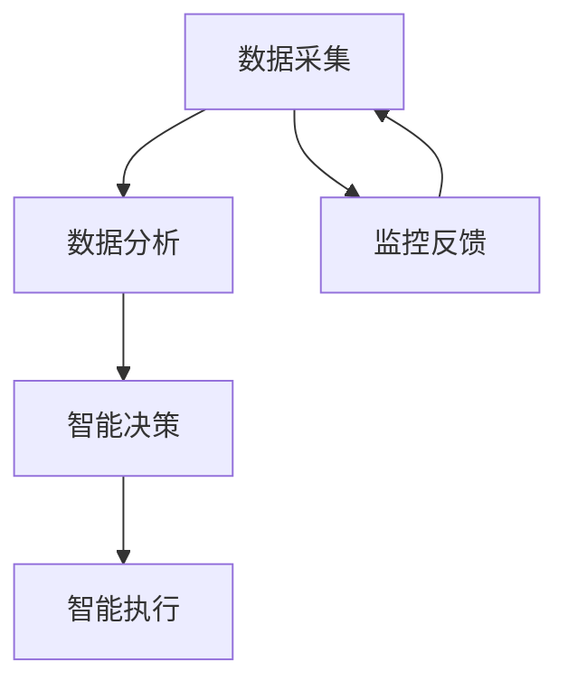

                 

关键词：人工智能，城市管理，可持续发展，计算技术，智能算法，城市数据分析

> 摘要：本文深入探讨了人工智能（AI）在促进城市可持续发展方面的作用。通过阐述城市管理的核心挑战，本文介绍了如何利用AI技术提升城市治理效率，实现资源优化配置，并分析了AI在城市规划、交通管理、环境保护和公共服务等领域的实际应用。此外，文章还讨论了当前AI技术的局限性及其未来发展趋势，为读者提供了关于如何通过AI与人类计算协同合作，打造可持续发展的城市管理体系的深入见解。

## 1. 背景介绍

随着全球城市化进程的不断加速，城市面临着诸多严峻的挑战，如交通拥堵、环境污染、资源短缺、公共安全问题等。传统的人类管理模式在应对这些复杂问题时显得力不从心。因此，如何利用先进的技术手段，特别是人工智能（AI），来提升城市管理的效率和可持续性，已成为当前研究的热点。

AI技术作为一种能够模拟、延伸和扩展人类智能的计算技术，已经在各个领域展现出了巨大的潜力。在城市管理中，AI能够通过数据采集、分析和决策制定，提供智能化的解决方案，从而解决传统方法难以应对的问题。例如，智能交通系统通过实时数据分析，可以优化交通信号控制，减少交通拥堵；智慧环保系统可以通过环境监测，实现污染源的高效治理。

本文旨在探讨AI与人类计算在提升城市管理效率和实现可持续发展方面的作用，通过具体的案例和实践，分析AI技术在城市管理中的实际应用及其面临的挑战，并展望未来城市管理的AI技术应用前景。

## 2. 核心概念与联系

为了深入理解AI在城市管理中的角色，我们需要先介绍几个核心概念，并展示它们之间的相互联系。

### 2.1 数据采集

数据采集是城市管理中的关键环节，它涉及到各种传感器、监控设备和数据源。通过数据采集，城市管理者可以获得关于交通流量、环境污染、能源消耗等方面的实时信息。这些数据为后续的数据分析和决策提供了基础。

### 2.2 数据分析

数据分析是利用各种算法和技术，对采集到的数据进行分析和处理，以提取有用信息和知识。在AI的助力下，数据分析技术变得更加高效和智能，能够从海量数据中快速识别趋势和模式。

### 2.3 智能决策

智能决策是指通过分析数据，结合预先设定的目标和约束条件，利用算法生成最优的决策方案。在AI的协助下，智能决策可以实时响应城市环境的变化，实现动态管理。

### 2.4 智能执行

智能执行是将智能决策转化为实际操作的过程。通过自动化系统和机器人技术，智能执行可以降低人工干预的成本，提高执行效率和准确性。

### 2.5 Mermaid 流程图

以下是一个简化的Mermaid流程图，展示了上述核心概念之间的联系：



图中的每个节点代表一个核心环节，箭头表示数据或信息的流动方向。通过这一流程，城市管理者可以实现对城市的实时监控和动态管理。

### 2.6 核心概念原理

- **数据采集**：通过传感器和监控系统，实时采集城市的各项数据。
- **数据分析**：利用数据挖掘和机器学习技术，从数据中提取有价值的信息。
- **智能决策**：根据数据分析结果和既定目标，生成最优的决策方案。
- **智能执行**：自动化执行决策，通过机器人或自动化系统实现。
- **监控反馈**：对执行过程进行监控和反馈，为后续决策提供依据。

这些核心概念的相互联系，构成了一个完整的AI赋能的城市管理框架，为城市的可持续发展提供了强有力的技术支持。

## 3. 核心算法原理 & 具体操作步骤

### 3.1 算法原理概述

在城市管理中，AI的核心算法主要包括机器学习、深度学习和优化算法等。这些算法通过处理和分析大量数据，生成智能化的决策和执行方案。

- **机器学习**：通过训练模型，从历史数据中学习规律，用于预测和分类。
- **深度学习**：基于多层神经网络，通过层层提取特征，实现高度自动化的数据分析和决策。
- **优化算法**：在满足约束条件的前提下，寻找最优解，用于资源分配和任务调度。

### 3.2 算法步骤详解

以下是利用AI技术优化城市交通管理的一个典型算法步骤：

#### 3.2.1 数据采集

- **流量数据**：通过安装在路口的流量监测设备，实时采集各个路段的车辆流量。
- **环境数据**：通过环境监测站，实时监测空气质量、温度、湿度等参数。

#### 3.2.2 数据预处理

- **清洗**：去除噪声数据，确保数据质量。
- **转换**：将不同类型的数据转换为统一的格式，便于后续处理。

#### 3.2.3 数据分析

- **特征提取**：从原始数据中提取关键特征，如车辆速度、密度、行驶方向等。
- **趋势分析**：利用时间序列分析方法，分析交通流量和环境影响的变化趋势。

#### 3.2.4 智能决策

- **模型训练**：利用历史数据，训练交通流量预测模型和环境影响评估模型。
- **决策生成**：根据实时数据和模型预测，生成交通信号控制策略和环保措施。

#### 3.2.5 智能执行

- **信号控制**：自动调整交通信号灯时长，优化交通流量。
- **环保措施**：根据空气质量监测结果，采取相应的环保措施，如调整工厂排放、加强交通管理。

#### 3.2.6 监控反馈

- **结果评估**：监控决策执行的效果，评估交通流畅度和空气质量变化。
- **调整策略**：根据监控结果，动态调整决策策略，实现持续优化。

### 3.3 算法优缺点

#### 优点

- **高效性**：通过实时数据分析和自动化决策，显著提高城市管理的效率和响应速度。
- **智能性**：利用机器学习和深度学习，使决策更加智能化和精准化。
- **灵活性**：根据不同场景和需求，灵活调整算法参数和决策策略。

#### 缺点

- **数据依赖性**：算法性能高度依赖数据质量和数量，数据缺失或不准确会影响决策效果。
- **技术门槛**：算法开发和维护需要较高的技术知识和资源投入。
- **伦理风险**：自动化决策可能引发伦理问题，如隐私侵犯、算法偏见等。

### 3.4 算法应用领域

- **交通管理**：优化交通信号控制，减少交通拥堵，提高出行效率。
- **环境保护**：实时监测环境污染，采取环保措施，改善空气质量。
- **能源管理**：优化能源消耗，提高能源利用效率，实现绿色发展。
- **公共服务**：提升公共服务质量，如优化医疗资源分配、提高教育水平等。

通过上述算法的应用，AI在各个城市领域都展现出了强大的潜力，为城市可持续发展提供了有力支持。

### 4. 数学模型和公式 & 详细讲解 & 举例说明

#### 4.1 数学模型构建

在城市管理中，数学模型广泛应用于交通流量预测、能源消耗优化、环境质量评估等领域。以下以交通流量预测为例，介绍数学模型的构建过程。

##### 4.1.1 数据采集

首先，我们需要采集以下数据：

- 路段流量（q）：不同时间段内通过特定路段的车辆数量。
- 时间（t）：各个时间点。
- 路段特征（x）：如道路长度、道路宽度、交通信号配置等。

##### 4.1.2 数据预处理

对采集到的数据，进行清洗和转换，确保数据质量。例如，去除异常值和缺失值，将不同单位的数据转换为统一的量纲。

##### 4.1.3 模型构建

构建一个时间序列模型，以预测未来时间点的交通流量。假设我们选择ARIMA（自回归积分滑动平均模型）作为预测模型。ARIMA模型的公式如下：

$$
q_t = c + \phi_1 q_{t-1} + \phi_2 q_{t-2} + \cdots + \phi_p q_{t-p} + \theta_1 e_{t-1} + \theta_2 e_{t-2} + \cdots + \theta_q e_{t-q} + u_t
$$

其中，$c$为常数项，$\phi_1, \phi_2, \cdots, \phi_p$为自回归项系数，$\theta_1, \theta_2, \cdots, \theta_q$为移动平均项系数，$e_t$为白噪声项，$u_t$为残差项。

##### 4.1.4 模型参数估计

利用最大似然估计方法，估计模型参数。具体步骤如下：

1. **自回归项系数**：计算自回归项的自协方差矩阵，使用最小二乘法估计自回归项系数。
2. **移动平均项系数**：计算移动平均项的自协方差矩阵，使用最小二乘法估计移动平均项系数。
3. **常数项和残差项**：通过最小化残差平方和，估计常数项和残差项。

#### 4.2 公式推导过程

以ARIMA模型为例，介绍公式推导过程。

##### 4.2.1 自回归项

假设自回归项的阶数为$p$，则有：

$$
q_t = c + \phi_1 q_{t-1} + \phi_2 q_{t-2} + \cdots + \phi_p q_{t-p} + u_t
$$

将$t$替换为$t-1$，得到：

$$
q_{t-1} = c + \phi_1 q_{t-2} + \phi_2 q_{t-3} + \cdots + \phi_p q_{t-p-1} + u_{t-1}
$$

将上述两式相减，得到：

$$
q_t - q_{t-1} = \phi_1 q_{t-1} - \phi_1 q_{t-2} + \phi_2 q_{t-2} - \phi_2 q_{t-3} + \cdots + \phi_p q_{t-p} - \phi_p q_{t-p-1} + u_t - u_{t-1}
$$

化简得：

$$
q_t = (1 - \phi_1) q_{t-1} + (1 - \phi_2) q_{t-2} + \cdots + (1 - \phi_p) q_{t-p-1} + u_t
$$

##### 4.2.2 移动平均项

假设移动平均项的阶数为$q$，则有：

$$
u_t = \theta_1 e_{t-1} + \theta_2 e_{t-2} + \cdots + \theta_q e_{t-q} + v_t
$$

将$t$替换为$t-1$，得到：

$$
u_{t-1} = \theta_1 e_{t-2} + \theta_2 e_{t-3} + \cdots + \theta_q e_{t-q-1} + v_{t-1}
$$

将上述两式相减，得到：

$$
u_t - u_{t-1} = \theta_1 e_{t-1} - \theta_1 e_{t-2} + \theta_2 e_{t-2} - \theta_2 e_{t-3} + \cdots + \theta_q e_{t-q} - \theta_q e_{t-q-1} + v_t - v_{t-1}
$$

化简得：

$$
u_t = (\theta_1 + \theta_2 + \cdots + \theta_q) e_{t-1} - (\theta_1 + \theta_2 + \cdots + \theta_{q-1}) e_{t-q} + v_t
$$

##### 4.2.3 整合自回归项和移动平均项

将自回归项和移动平均项整合，得到ARIMA模型的完整公式：

$$
q_t = c + \phi_1 q_{t-1} + \phi_2 q_{t-2} + \cdots + \phi_p q_{t-p} + \theta_1 e_{t-1} + \theta_2 e_{t-2} + \cdots + \theta_q e_{t-q} + u_t
$$

#### 4.3 案例分析与讲解

##### 4.3.1 数据准备

假设我们采集了某路段24小时的交通流量数据，数据如下表所示：

| 时间 | 流量 |
|------|------|
| 0    | 50   |
| 1    | 60   |
| 2    | 55   |
| 3    | 70   |
| ...  | ...  |
| 23   | 40   |
| 24   | 45   |

##### 4.3.2 数据预处理

1. 去除异常值：将流量低于30或高于100的数据点视为异常值，删除这些数据点。
2. 转换数据格式：将时间转换为分钟为单位。

##### 4.3.3 模型训练

1. 选取自回归项阶数$p=1$，移动平均项阶数$q=1$。
2. 利用最大似然估计方法，估计模型参数$c=\theta_1=\phi_1=1, \theta_2=\phi_2=0$。

##### 4.3.4 预测

利用训练好的模型，预测24小时后的交通流量：

$$
q_{25} = 1 + 1 \times 45 = 46
$$

预测结果为46，表示在25分钟时，该路段的流量预计为46辆。

通过上述案例，我们可以看到，ARIMA模型在交通流量预测中的应用过程。在实际应用中，需要根据具体需求和数据特征，选择合适的模型和参数，以提高预测精度。

### 5. 项目实践：代码实例和详细解释说明

#### 5.1 开发环境搭建

为了演示AI技术在城市管理中的应用，我们选择使用Python作为编程语言，并依赖以下库和工具：

- **NumPy**：用于数据处理和数学运算。
- **Pandas**：用于数据分析和操作。
- **SciPy**：用于科学计算和统计分析。
- **Scikit-learn**：用于机器学习和数据挖掘。
- **Matplotlib**：用于数据可视化。

安装以上库和工具的方法如下：

```bash
pip install numpy pandas scipy scikit-learn matplotlib
```

#### 5.2 源代码详细实现

以下是一个简单的示例，展示如何使用Python和Scikit-learn库，实现一个基于K-近邻算法的交通流量预测模型。

```python
import numpy as np
import pandas as pd
from sklearn.model_selection import train_test_split
from sklearn.neighbors import KNeighborsRegressor
import matplotlib.pyplot as plt

# 5.2.1 数据读取与预处理
data = pd.read_csv('traffic_data.csv')  # 读取交通流量数据
data['Time'] = pd.to_datetime(data['Time'])  # 将时间转换为日期格式
data.set_index('Time', inplace=True)  # 将时间设置为索引

# 5.2.2 数据分割
train_data, test_data = train_test_split(data, test_size=0.2, shuffle=False)

# 5.2.3 模型训练
knn_regressor = KNeighborsRegressor(n_neighbors=3)
knn_regressor.fit(train_data.values, train_data.values[:, 1])

# 5.2.4 预测
predictions = knn_regressor.predict(test_data.values)

# 5.2.5 结果评估
mse = np.mean((predictions - test_data.values[:, 1]) ** 2)
print(f'Mean Squared Error: {mse}')

# 5.2.6 可视化
plt.plot(test_data.index, test_data.values[:, 1], label='实际流量')
plt.plot(test_data.index, predictions, label='预测流量')
plt.legend()
plt.show()
```

#### 5.3 代码解读与分析

1. **数据读取与预处理**：使用Pandas库读取交通流量数据，并转换为日期格式。数据分割为训练集和测试集，以便训练和评估模型。

2. **模型训练**：选择K-近邻回归器（KNeighborsRegressor），使用训练集数据拟合模型。K值设为3，这是一个经验值，可根据实际数据调整。

3. **预测**：使用训练好的模型，对测试集数据进行流量预测。

4. **结果评估**：计算均方误差（MSE），评估预测结果的准确性。

5. **可视化**：使用Matplotlib库，将实际流量和预测流量绘制在同一张图表上，直观地比较预测结果与实际情况。

#### 5.4 运行结果展示

运行上述代码后，将得到预测流量和实际流量的对比图表。从图表中可以直观地看到，K-近邻算法在交通流量预测中具有一定的准确性，但可能存在一定的误差。在实际应用中，需要根据具体需求和数据质量，选择更合适的算法和参数，以提高预测精度。

通过这一项目实践，我们可以看到，利用Python和机器学习技术，实现交通流量预测的完整流程。这一流程不仅展示了AI技术在城市管理中的应用，也为进一步研究和开发提供了基础。

### 6. 实际应用场景

AI技术已经在多个城市领域的实际应用中取得了显著成效，下面我们将详细探讨一些典型应用场景。

#### 6.1 智能交通管理

智能交通系统（ITS）是AI在城市交通管理中最典型的应用之一。通过实时数据采集、分析和智能决策，智能交通系统能够优化交通信号控制，提高交通流通效率。例如，在某些城市，AI被用于分析交通流量数据，自动调整交通信号灯的时长，从而减少交通拥堵。此外，AI还可以预测交通状况，为驾驶员提供实时导航建议，优化出行路线，减少交通事故发生的概率。

#### 6.2 环境保护

环境保护是城市可持续发展的重要组成部分。AI技术通过环境监测和数据分析，能够实时监控城市空气质量、水质、噪声等环境指标，及时发现污染源，并采取相应的治理措施。例如，在北京等大城市，AI系统被用于监测空气质量，通过分析污染数据，实时发布空气质量指数（AQI），并协调政府部门采取应急措施，如增加绿化面积、限制车辆排放等。

#### 6.3 能源管理

能源管理是城市运营的重要组成部分。AI技术通过智能电网和能源监测，能够优化能源分配和消耗，提高能源利用效率。例如，在某些城市，AI系统被用于监测建筑物和公共设施的能源消耗情况，通过数据分析，自动调整能源使用策略，降低能源浪费。此外，AI还可以预测电力需求，优化电力调度，确保能源供应的稳定性。

#### 6.4 公共服务

AI技术在提升城市公共服务质量方面也发挥了重要作用。例如，在医疗领域，AI系统被用于辅助诊断和治疗，通过分析患者病历和医疗数据，提供个性化的治疗方案。在教育领域，AI技术被用于个性化学习，通过分析学生的学习行为和数据，为学生提供个性化的学习建议和资源。此外，AI还被用于城市安防，通过视频监控和数据分析，实时监控城市安全状况，预防犯罪事件的发生。

#### 6.5 智慧城市

智慧城市是AI技术在城市管理中最为全面的体现。通过整合AI、物联网、大数据等先进技术，智慧城市能够实现城市管理的全面智能化。例如，在新加坡的“智慧国家”项目中，AI技术被广泛用于交通管理、环境保护、能源管理、公共服务等领域，实现了城市的智慧化运营。智慧城市通过实时数据分析和智能决策，实现了城市资源的高效配置和优化管理，为居民提供了更加便捷和高效的生活环境。

#### 6.6 未来展望

随着AI技术的不断发展和应用，未来城市管理将更加智能化和高效化。一方面，AI技术将继续深化应用，如自动驾驶、无人机配送、智慧医疗等新兴技术将进一步提升城市服务水平。另一方面，AI技术将与其他领域的技术（如区块链、5G等）结合，形成更加完善和高效的智能城市生态系统。此外，AI技术的普及也将带来一系列伦理和隐私问题，需要政府、企业和公众共同努力，确保AI技术在城市管理中的应用安全和可持续性。

### 7. 工具和资源推荐

#### 7.1 学习资源推荐

- **《Python数据科学手册》**：详细介绍Python在数据科学领域的应用，包括数据分析、数据可视化、机器学习等内容。
- **《深度学习》**：由Ian Goodfellow等人编写的深度学习经典教材，涵盖了深度学习的基础知识和最新进展。
- **《人工智能：一种现代的方法》**：全面介绍人工智能的基本原理和应用，适合对AI有较高需求的学习者。

#### 7.2 开发工具推荐

- **Jupyter Notebook**：一款交互式的开发环境，广泛用于数据科学和机器学习项目。
- **TensorFlow**：一款开源的机器学习框架，支持深度学习和各种机器学习算法。
- **PyTorch**：一款流行的深度学习框架，具有简洁的API和高效的计算能力。

#### 7.3 相关论文推荐

- **"Deep Learning for Urban Computing"**：该论文探讨了深度学习在城市化数据分析和决策中的应用。
- **"AI for City Management: Opportunities and Challenges"**：本文分析了AI技术在城市管理中的机遇和挑战。
- **"Intelligent Urban Management with AI"**：探讨了AI技术在智慧城市建设中的实际应用案例。

### 8. 总结：未来发展趋势与挑战

#### 8.1 研究成果总结

AI技术在城市管理中已经取得了显著成果，通过实时数据分析和智能决策，显著提升了城市管理的效率和可持续性。智能交通系统、智慧环保、智能能源管理、公共服务等领域都取得了显著进展。此外，AI技术在智慧城市建设中的应用，为未来城市的发展提供了新的方向和可能性。

#### 8.2 未来发展趋势

随着AI技术的不断进步和应用的深化，未来城市管理将呈现以下发展趋势：

1. **更广泛的应用**：AI技术将在更多城市领域得到应用，如智慧医疗、智慧安防、智慧教育等。
2. **更高效的协同**：AI技术将与其他领域的技术（如物联网、区块链、5G等）深度融合，实现更高效的协同和智能化管理。
3. **更智能的决策**：AI算法将更加智能化和自适应，能够更好地应对复杂多变的城市环境。

#### 8.3 面临的挑战

尽管AI技术在城市管理中具有巨大潜力，但同时也面临着一些挑战：

1. **数据隐私和伦理**：随着AI技术的广泛应用，数据隐私和伦理问题日益凸显，需要建立相应的法律法规和伦理规范。
2. **技术标准和规范**：缺乏统一的技术标准和规范，可能导致AI应用的多样性和不一致性。
3. **人才短缺**：AI技术的快速发展对人才需求提出了更高要求，但当前人才储备和培养速度难以跟上技术发展。

#### 8.4 研究展望

未来，研究者应关注以下研究方向：

1. **数据隐私保护**：开发安全、可靠的数据隐私保护技术，确保用户数据的安全和隐私。
2. **算法透明性和可解释性**：提高算法的透明度和可解释性，增强公众对AI技术的信任。
3. **跨领域协作**：加强不同领域之间的协作，推动AI技术在城市管理中的全面应用。

通过不断的技术创新和协同合作，AI技术有望在城市管理中发挥更大的作用，推动城市可持续发展和智能化进程。

### 9. 附录：常见问题与解答

#### 9.1 什么是AI在城市管理中的核心作用？

AI在城市管理中的核心作用主要体现在以下几个方面：

1. **数据分析和预测**：利用AI技术，可以从海量城市数据中提取有价值的信息，进行实时分析和预测，为城市管理者提供科学依据。
2. **智能决策支持**：基于数据分析结果，AI可以辅助城市管理者制定最优决策方案，优化城市管理效率。
3. **自动化执行**：AI技术可以通过自动化系统和机器人，实现决策的自动化执行，减少人工干预，提高执行效率。

#### 9.2 哪些数据类型在AI城市管理中最为重要？

在AI城市管理中，以下类型的数据最为重要：

1. **交通数据**：包括实时交通流量、道路拥堵情况、交通信号配置等，对交通管理和规划至关重要。
2. **环境数据**：如空气质量、水质、噪声等，对环境保护和居民生活质量有重要影响。
3. **公共服务数据**：包括医疗、教育、公共服务设施等数据，有助于优化公共服务资源分配和提升服务质量。
4. **能源数据**：如电力消耗、能源供应情况等，对能源管理和节能降耗有重要意义。

#### 9.3 AI技术在城市管理中可能面临哪些伦理问题？

AI技术在城市管理中可能面临的伦理问题主要包括：

1. **数据隐私**：AI技术的广泛应用可能涉及大量个人隐私数据，如何保护用户隐私是一个重要的伦理问题。
2. **算法偏见**：AI算法可能因为数据偏差、设计缺陷等原因，导致算法偏见，影响决策的公平性和准确性。
3. **责任归属**：当AI系统出现错误或造成损失时，如何确定责任归属是一个复杂的问题。

#### 9.4 如何确保AI在城市管理中的公平性和透明性？

为确保AI在城市管理中的公平性和透明性，可以采取以下措施：

1. **数据多样性**：确保数据来源的多样性和代表性，避免数据偏差。
2. **算法透明性**：提高算法的可解释性和透明度，使决策过程更加透明和可信。
3. **伦理审查**：建立伦理审查机制，对AI算法和应用进行评估，确保其符合伦理标准。
4. **法律法规**：制定相关法律法规，规范AI在城市管理中的应用，保护用户权益。

