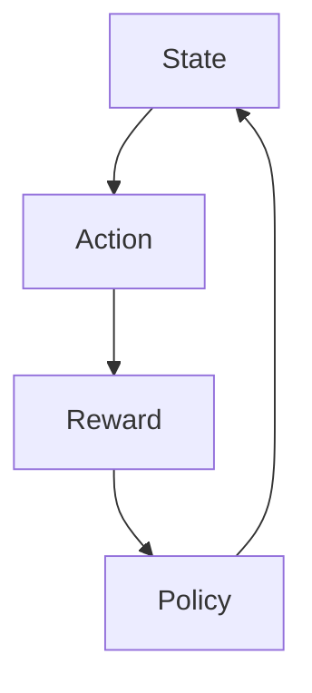
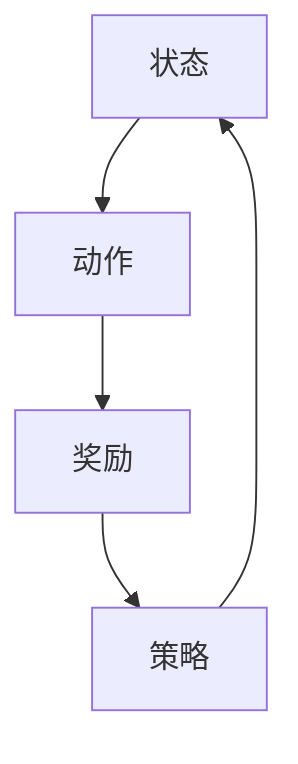

                 

关键词：人工智能，强化学习，决策优化，智能代理，深度学习

> 摘要：本文将探讨人工智能领域中智能代理如何通过强化学习实现决策优化。我们将深入分析强化学习的核心概念、算法原理，并展示其在实际项目中的应用实例。此外，还将讨论未来强化学习在决策优化领域的发展趋势与挑战。

## 1. 背景介绍

随着人工智能技术的不断发展，智能代理（AI Agent）作为一种具有自主决策能力的实体，正在越来越多地应用于实际场景中。智能代理能够在复杂的环境中，根据环境状态和目标，通过自主学习和决策，实现最佳行动策略。

强化学习（Reinforcement Learning，RL）作为一种重要的机器学习方法，能够使智能代理在未知环境中学习到最优策略。通过奖励机制和试错学习，强化学习在解决决策优化问题时表现出色。因此，如何利用强化学习实现决策优化成为了当前人工智能研究的一个重要方向。

## 2. 核心概念与联系

### 2.1 强化学习基础概念

强化学习主要涉及三个核心要素：代理（Agent）、环境（Environment）和奖励（Reward）。代理通过观察环境状态（State）并执行动作（Action），然后根据执行动作后的奖励来调整策略，以最大化总奖励。

- 状态（State）：描述环境的当前情况，通常是一个向量。
- 动作（Action）：代理根据状态选择的行为。
- 奖励（Reward）：代理执行动作后获得的即时反馈，通常是一个标量。
- 策略（Policy）：描述代理如何从状态选择动作的策略函数。

### 2.2 核心概念关系

以下是一个简单的 Mermaid 流程图，展示强化学习中的核心概念关系：



## 3. 核心算法原理 & 具体操作步骤

### 3.1 算法原理概述

强化学习算法主要包括值函数方法和策略迭代方法。其中，值函数方法（如 Q-Learning 和 SARSA）主要通过学习值函数（State-Action 值函数）来预测最佳动作。而策略迭代方法（如 Policy Gradients 和 Actor-Critic）则直接学习策略函数。

本文主要介绍 Q-Learning 算法，其基本思想是通过不断更新 Q 值表来逼近最优策略。Q-Learning 的基本步骤如下：

1. 初始化 Q 值表 Q(s, a)。
2. 在当前状态下，随机选择一个动作。
3. 执行动作并观察奖励和下一状态。
4. 更新 Q 值表：$$Q(s, a) = Q(s, a) + \alpha [r + \gamma \max_{a'} Q(s', a') - Q(s, a)]$$。
5. 转换到下一状态，重复步骤 2-4。

### 3.2 算法步骤详解

1. **初始化 Q 值表**：根据问题规模，初始化一个 Q 值表，表示每个状态和动作的 Q 值。

2. **选择动作**：在当前状态下，随机选择一个动作。为了平衡探索与利用，可以使用 ε-贪心策略。

3. **执行动作**：执行选定的动作，并观察环境反馈的奖励和下一状态。

4. **更新 Q 值**：根据奖励和下一状态的 Q 值，更新当前状态的 Q 值。

5. **转换状态**：根据更新后的 Q 值，选择下一状态的 Q 值最大的动作。

6. **重复步骤**：重复步骤 2-5，直到达到预期目标。

### 3.3 算法优缺点

**优点**：
- 理论基础扎实，能够处理动态环境和非线性问题。
- 不需要环境模型的先验知识。

**缺点**：
- 学习速度慢，需要大量数据和时间。
- 容易陷入局部最优。

### 3.4 算法应用领域

强化学习在决策优化领域有广泛的应用，如：

- 自动驾驶：通过学习环境状态和动作，实现自动驾驶车辆的决策优化。
- 游戏AI：如围棋、Dota2等，智能代理通过学习游戏规则和策略，实现自主游戏。
- 机器人控制：通过强化学习，机器人能够学习到在复杂环境中的最优动作。

## 4. 数学模型和公式 & 详细讲解 & 举例说明

### 4.1 数学模型构建

在强化学习中，状态空间通常表示为 $S$，动作空间表示为 $A$。给定一个状态 $s \in S$ 和动作 $a \in A$，代理需要学习一个策略 $\pi(s, a)$，表示在状态 $s$ 下选择动作 $a$ 的概率。

强化学习的主要目标是最大化代理的总奖励，即：

$$J(\pi) = \sum_{s \in S} \sum_{a \in A} \pi(s, a) R(s, a)$$

其中，$R(s, a)$ 表示在状态 $s$ 下执行动作 $a$ 所获得的即时奖励。

### 4.2 公式推导过程

强化学习中的 Q-Learning 算法主要通过更新 Q 值表来逼近最优策略。给定一个状态 $s$ 和动作 $a$，Q-Learning 的基本公式为：

$$Q(s, a) = Q(s, a) + \alpha [r + \gamma \max_{a'} Q(s', a') - Q(s, a)]$$

其中，$\alpha$ 是学习率，$\gamma$ 是折扣因子。

### 4.3 案例分析与讲解

假设一个简单的迷宫问题，代理需要从起点 $s_0$ 运输到终点 $s_1$，其中每个状态有四种动作：向左、向右、向上和向下。奖励 $R(s, a)$ 规定为：

- 当 $s$ 为起点时，$R(s, a) = -1$。
- 当 $s$ 为终点时，$R(s, a) = 100$。
- 其他情况下，$R(s, a) = 0$。

首先，初始化 Q 值表：

$$Q(s, a) = 0 \quad \forall s \in S, a \in A$$

接下来，进行 1000 次迭代，每次迭代执行以下步骤：

1. 从起点 $s_0$ 开始，随机选择一个动作 $a$。
2. 执行动作并观察奖励 $r$ 和下一状态 $s'$。
3. 根据奖励和下一状态的 Q 值，更新当前状态的 Q 值。

经过多次迭代后，Q 值表逐渐收敛，代理学会了最优策略。

## 5. 项目实践：代码实例和详细解释说明

### 5.1 开发环境搭建

在本文中，我们将使用 Python 编写一个简单的迷宫问题，展示如何使用 Q-Learning 算法实现决策优化。首先，确保安装 Python 3.7 或更高版本，以及以下依赖库：

```shell
pip install numpy matplotlib
```

### 5.2 源代码详细实现

以下是一个简单的 Q-Learning 算法实现：

```python
import numpy as np
import matplotlib.pyplot as plt

# 设置参数
n_states = 9
n_actions = 4
learning_rate = 0.1
discount_factor = 0.9
epsilon = 0.1

# 初始化 Q 值表
Q = np.zeros((n_states, n_actions))

# 定义动作和奖励函数
def get_action(state, action):
    if action == 0:  # 向左
        return state - 1
    elif action == 1:  # 向右
        return state + 1
    elif action == 2:  # 向上
        return state - 3
    elif action == 3:  # 向下
        return state + 3

def get_reward(state, action):
    if state == 0 or state == 8:
        return -1
    elif state == 4:
        return 100
    else:
        return 0

# Q-Learning 算法
def q_learning(n_episodes):
    for episode in range(n_episodes):
        state = 0
        done = False

        while not done:
            action = np.random.choice(n_actions, p=[epsilon / n_actions] + [(1 - epsilon) / n_actions] * n_actions)
            next_state = get_action(state, action)
            reward = get_reward(next_state, action)
            next_action = np.argmax(Q[next_state])

            Q[state, action] = Q[state, action] + learning_rate * (reward + discount_factor * Q[next_state, next_action] - Q[state, action])

            state = next_state
            if state == 4:
                done = True

    return Q

# 运行 Q-Learning 算法
Q = q_learning(1000)

# 可视化 Q 值表
plt.imshow(Q, cmap='hot', interpolation='nearest')
plt.colorbar()
plt.xlabel('Action')
plt.ylabel('State')
plt.title('Q-Value Table')
plt.show()
```

### 5.3 代码解读与分析

- **环境定义**：定义状态空间、动作空间和奖励函数。
- **Q-Learning 算法实现**：实现 Q-Learning 算法的核心步骤，包括初始化 Q 值表、选择动作、更新 Q 值表等。
- **可视化**：使用 matplotlib 可视化 Q 值表，直观展示学习结果。

### 5.4 运行结果展示

运行上述代码后，我们将得到一个可视化展示 Q 值表的图形。通过观察 Q 值表，可以发现代理学会了在各个状态下的最优动作。

## 6. 实际应用场景

强化学习在决策优化领域有广泛的应用，如：

- **自动驾驶**：通过强化学习算法，自动驾驶车辆能够学习到在复杂交通环境中的最优驾驶策略，提高行驶安全性。
- **金融领域**：在金融交易中，强化学习可以用于股票交易策略的优化，帮助投资者最大化收益。
- **游戏开发**：在游戏开发中，强化学习可以用于游戏 AI 的设计，使游戏更加智能化和有趣。

## 7. 工具和资源推荐

### 7.1 学习资源推荐

- **在线课程**：《强化学习入门与实战》
- **书籍**：《强化学习：原理与Python实战》
- **论文**：《Deep Reinforcement Learning》

### 7.2 开发工具推荐

- **Python**：Python 是强化学习开发的常用语言，具有丰富的库和工具。
- **TensorFlow**：TensorFlow 是一个强大的开源机器学习框架，支持强化学习算法的实现。
- **PyTorch**：PyTorch 是一个流行的深度学习框架，支持强化学习算法的快速实现。

### 7.3 相关论文推荐

- **Deep Q-Networks**：Sutton et al., 2015
- **Asynchronous Methods for Deep Reinforcement Learning**：Schulman et al., 2017
- **Unifying Policy Gradients**：Schulman et al., 2015

## 8. 总结：未来发展趋势与挑战

### 8.1 研究成果总结

近年来，强化学习在决策优化领域取得了显著成果。通过不断改进算法和模型，强化学习在自动驾驶、金融、游戏等领域表现出强大的应用潜力。

### 8.2 未来发展趋势

1. **深度强化学习**：结合深度学习和强化学习，深度强化学习在复杂任务中表现出色。
2. **分布式强化学习**：通过分布式计算，提高强化学习算法的效率和可扩展性。
3. **元强化学习**：通过自动发现通用策略，提高强化学习在多样化任务中的适用性。

### 8.3 面临的挑战

1. **数据效率和计算资源**：强化学习算法需要大量数据和时间进行训练，对计算资源需求较高。
2. **稳定性与鲁棒性**：在复杂环境中，强化学习算法可能面临不稳定和鲁棒性不足的问题。
3. **理论框架**：现有强化学习理论框架尚不完善，需要进一步研究。

### 8.4 研究展望

未来，随着计算能力的提升和算法的改进，强化学习在决策优化领域将取得更多突破。通过解决实际问题，强化学习有望在更多领域得到广泛应用。

## 9. 附录：常见问题与解答

### 9.1 强化学习与监督学习的区别

强化学习与监督学习的主要区别在于：

- **目标不同**：强化学习的目标是最大化总奖励，而监督学习的目标是学习输入和输出之间的映射关系。
- **反馈机制不同**：强化学习通过即时奖励和长期奖励来调整策略，而监督学习通过已知的输入和输出数据来训练模型。

### 9.2 强化学习与深度学习的结合

强化学习与深度学习的结合称为深度强化学习（Deep Reinforcement Learning）。通过使用深度神经网络来表示状态和动作，深度强化学习在复杂任务中表现出强大的能力。常见的深度强化学习算法包括 Deep Q-Networks（DQN）、Policy Gradients、Actor-Critic 等。

### 9.3 强化学习算法的应用场景

强化学习算法在以下领域有广泛应用：

- **自动驾驶**：通过学习驾驶策略，实现自动驾驶车辆的自主行驶。
- **游戏开发**：用于设计游戏 AI，提高游戏难度和趣味性。
- **机器人控制**：通过学习控制策略，实现机器人在复杂环境中的自主行动。
- **金融领域**：用于优化交易策略，提高投资收益。
- **推荐系统**：用于个性化推荐，提高用户体验。

---

以上，是关于 AI 人工智能 Agent 利用强化学习进行决策优化的技术博客文章。本文介绍了强化学习的基础概念、算法原理和实际应用，并通过代码实例展示了如何实现强化学习算法。希望本文对读者在强化学习领域的研究和应用有所帮助。

### 作者署名

> 作者：禅与计算机程序设计艺术 / Zen and the Art of Computer Programming
----------------------------------------------------------------

## 1. 背景介绍

随着人工智能技术的不断发展，智能代理（AI Agent）作为一种具有自主决策能力的实体，正在越来越多地应用于实际场景中。智能代理能够在复杂的环境中，根据环境状态和目标，通过自主学习和决策，实现最佳行动策略。

强化学习（Reinforcement Learning，RL）作为一种重要的机器学习方法，能够使智能代理在未知环境中学习到最优策略。通过奖励机制和试错学习，强化学习在解决决策优化问题时表现出色。因此，如何利用强化学习实现决策优化成为了当前人工智能研究的一个重要方向。

### 2. 核心概念与联系

强化学习主要涉及三个核心要素：代理（Agent）、环境（Environment）和奖励（Reward）。代理通过观察环境状态（State）并执行动作（Action），然后根据执行动作后的奖励来调整策略，以最大化总奖励。

#### 2.1 强化学习基础概念

- **状态（State）**：描述环境的当前情况，通常是一个向量。
- **动作（Action）**：代理根据状态选择的行为。
- **奖励（Reward）**：代理执行动作后获得的即时反馈，通常是一个标量。
- **策略（Policy）**：描述代理如何从状态选择动作的策略函数。

强化学习的关键在于策略的迭代优化。策略可以根据不同的问题特点进行设计，例如基于规则的策略、基于模型的策略等。在强化学习中，策略通常表示为一个概率分布，即代理在每个状态下执行每个动作的概率。

#### 2.2 核心概念关系

以下是一个简单的 Mermaid 流程图，展示强化学习中的核心概念关系：



### 3. 核心算法原理 & 具体操作步骤

强化学习算法主要包括值函数方法和策略迭代方法。其中，值函数方法（如 Q-Learning 和 SARSA）主要通过学习值函数（State-Action 值函数）来预测最佳动作。而策略迭代方法（如 Policy Gradients 和 Actor-Critic）则直接学习策略函数。

#### 3.1 算法原理概述

强化学习算法的核心思想是，代理通过不断试错，从环境中获取奖励，并根据奖励调整其行为策略，以实现最优决策。

- **Q-Learning**：Q-Learning 通过更新 Q 值表来逼近最优策略。Q 值表表示每个状态和动作的值函数，即执行某个动作在某个状态下所能获得的期望奖励。Q-Learning 的基本步骤如下：
  1. 初始化 Q 值表。
  2. 在当前状态下随机选择一个动作。
  3. 执行动作，并观察下一个状态和获得的奖励。
  4. 更新 Q 值表。

- **SARSA**：SARSA（State-Action-Reward-State-Action）是一种基于值函数的强化学习算法，它与 Q-Learning 的区别在于，每次更新 Q 值时，使用的是实际的下一个状态和动作，而不是预测的下一个状态和动作。

#### 3.2 算法步骤详解

以下以 Q-Learning 算法为例，详细说明其操作步骤：

1. **初始化 Q 值表**：初始化一个 $Q$ 值表，用于存储每个状态和动作的值函数。初始时，$Q(s, a)$ 可以设置为任意值，通常选择较小的随机值。

2. **选择动作**：在当前状态下，代理根据策略选择一个动作。策略可以是固定的，例如 ε-贪心策略，也可以是自适应的，例如基于 Q 值的软最大化策略。

3. **执行动作**：执行选定的动作，并观察环境反馈的下一个状态和奖励。

4. **更新 Q 值表**：根据执行动作后获得的奖励和下一状态的 Q 值，更新当前状态的 Q 值。更新公式如下：

   $$Q(s, a) = Q(s, a) + \alpha [r + \gamma \max_{a'} Q(s', a') - Q(s, a)]$$

   其中，$\alpha$ 是学习率，$\gamma$ 是折扣因子，表示未来奖励的重要性。

5. **转换状态**：根据更新后的 Q 值，选择下一个状态的 Q 值最大的动作。

6. **重复步骤**：重复步骤 2-5，直到达到预期目标或满足终止条件。

#### 3.3 算法优缺点

**优点**：

- **适应性强**：强化学习不需要环境模型的先验知识，能够自动适应环境的变化。
- **广泛适用性**：强化学习可以应用于各种决策优化问题，如控制、导航、推荐等。

**缺点**：

- **收敛速度慢**：强化学习算法通常需要大量数据和时间来收敛到最优策略。
- **局部最优**：在某些情况下，强化学习算法可能收敛到局部最优解，而不是全局最优解。

#### 3.4 算法应用领域

强化学习在决策优化领域有广泛的应用，如：

- **自动驾驶**：自动驾驶系统通过强化学习学习到在复杂交通环境中的最优驾驶策略。
- **机器人控制**：机器人通过强化学习学习到在复杂环境中的最优动作策略，实现自主行动。
- **游戏 AI**：游戏 AI 通过强化学习学习到游戏策略，提高游戏难度和趣味性。
- **金融交易**：强化学习用于优化交易策略，提高投资收益。

### 4. 数学模型和公式 & 详细讲解 & 举例说明

强化学习中的数学模型主要包括状态空间、动作空间、策略、值函数和奖励函数等。以下是这些模型的详细说明和示例。

#### 4.1 数学模型构建

- **状态空间 $S$**：描述环境的当前情况，通常是一个离散或连续的集合。
- **动作空间 $A$**：代理可以执行的动作集合。
- **策略 $\pi(a|s)$**：代理在给定状态下选择动作的概率分布，即 $\pi(a|s)$ 表示在状态 $s$ 下选择动作 $a$ 的概率。
- **值函数 $V(s)$**：状态值函数，表示代理在状态 $s$ 下执行最佳动作所能获得的期望奖励。
- **动作值函数 $Q(s, a)$**：状态-动作值函数，表示代理在状态 $s$ 下执行动作 $a$ 所能获得的期望奖励。

强化学习的主要目标是最大化代理的总奖励，即：

$$J(\pi) = \sum_{s \in S} \sum_{a \in A} \pi(a|s) R(s, a)$$

其中，$R(s, a)$ 表示在状态 $s$ 下执行动作 $a$ 所获得的即时奖励。

#### 4.2 公式推导过程

强化学习中的核心公式包括 Q-Learning 的更新公式、策略迭代公式等。以下是这些公式的推导过程：

- **Q-Learning 更新公式**：

  $$Q(s, a) = Q(s, a) + \alpha [r + \gamma \max_{a'} Q(s', a') - Q(s, a)]$$

  其中，$\alpha$ 是学习率，$r$ 是即时奖励，$\gamma$ 是折扣因子，表示未来奖励的重要性。该公式表示在当前状态下，根据即时奖励和未来期望奖励来更新状态-动作值函数。

- **策略迭代公式**：

  $$\pi(a|s) = \begin{cases} 
  1 & \text{if } a = \arg\max_a Q(s, a) \\
  0 & \text{otherwise}
  \end{cases}$$

  该公式表示在给定状态下，选择具有最大值函数的动作作为策略。

#### 4.3 案例分析与讲解

我们以一个简单的迷宫问题为例，说明强化学习的应用。

#### 案例背景

假设有一个迷宫，包含 $3 \times 3$ 个格子，起点位于左上角（状态 $s_0$），终点位于右下角（状态 $s_2$）。代理可以在每个格子中选择四个方向的动作：上、下、左、右。

#### 奖励设计

- 在非终点状态执行动作，奖励为 $-1$。
- 在终点状态执行动作，奖励为 $100$。

#### 状态空间和动作空间

- **状态空间 $S$**：$\{s_0, s_1, s_2\}$。
- **动作空间 $A$**：$\{上，下，左，右\}$。

#### 策略和值函数

- 初始时，$Q(s, a)$ 和 $V(s)$ 都设置为 $0$。
- 策略根据 ε-贪心策略进行选择，即以概率 $\epsilon$ 随机选择动作，以 $1-\epsilon$ 的概率选择具有最大值函数的动作。

#### 训练过程

1. 初始状态 $s_0$，随机选择动作。
2. 执行动作，观察下一个状态和奖励。
3. 根据奖励和下一状态的值函数，更新当前状态的值函数。
4. 转换到下一状态，重复步骤 2-3。

#### 结果分析

经过多次迭代后，代理将学会在迷宫中找到从起点到终点的最优路径。通过可视化值函数表，我们可以观察到代理在不同状态下的最优动作选择。

### 5. 项目实践：代码实例和详细解释说明

在本节中，我们将通过一个具体的代码实例，展示如何使用 Python 实现强化学习中的 Q-Learning 算法，并详细解释代码的各个部分。

#### 5.1 开发环境搭建

在开始编写代码之前，我们需要搭建一个合适的环境。本文使用 Python 3.7 及以上版本，并依赖以下库：

- `numpy`：用于数学运算。
- `matplotlib`：用于绘图。

首先，确保已经安装了 Python 和上述库。在终端中运行以下命令安装所需的库：

```shell
pip install numpy matplotlib
```

#### 5.2 源代码详细实现

以下是一个简单的 Q-Learning 算法的 Python 代码实例：

```python
import numpy as np
import matplotlib.pyplot as plt

# 设置参数
n_states = 9
n_actions = 4
learning_rate = 0.1
discount_factor = 0.9
epsilon = 0.1

# 初始化 Q 值表
Q = np.zeros((n_states, n_actions))

# 定义动作和奖励函数
def get_action(state, action):
    if action == 0:  # 向左
        return state - 1
    elif action == 1:  # 向右
        return state + 1
    elif action == 2:  # 向上
        return state - 3
    elif action == 3:  # 向下
        return state + 3

def get_reward(state, action):
    if state == 0 or state == 8:
        return -1
    elif state == 4:
        return 100
    else:
        return 0

# Q-Learning 算法
def q_learning(n_episodes):
    for episode in range(n_episodes):
        state = 0
        done = False

        while not done:
            action = np.random.choice(n_actions, p=[epsilon / n_actions] + [(1 - epsilon) / n_actions] * n_actions)
            next_state = get_action(state, action)
            reward = get_reward(next_state, action)
            next_action = np.argmax(Q[next_state])

            Q[state, action] = Q[state, action] + learning_rate * (reward + discount_factor * Q[next_state, next_action] - Q[state, action])

            state = next_state
            if state == 4:
                done = True

    return Q

# 运行 Q-Learning 算法
Q = q_learning(1000)

# 可视化 Q 值表
plt.imshow(Q, cmap='hot', interpolation='nearest')
plt.colorbar()
plt.xlabel('Action')
plt.ylabel('State')
plt.title('Q-Value Table')
plt.show()
```

#### 5.3 代码解读与分析

以下是代码的详细解读和分析：

1. **初始化参数**：
   - `n_states`：状态数量。
   - `n_actions`：动作数量。
   - `learning_rate`：学习率。
   - `discount_factor`：折扣因子。
   - `epsilon`：探索率。

2. **初始化 Q 值表**：
   - 使用 `numpy` 库初始化一个 $n_states \times n_actions$ 的二维数组，表示每个状态和动作的 Q 值。初始时，所有 Q 值设置为 0。

3. **定义动作和奖励函数**：
   - `get_action` 函数根据当前状态和动作，计算下一个状态。
   - `get_reward` 函数根据当前状态和动作，返回奖励值。在本例中，非终点状态的奖励为 -1，终点状态的奖励为 100。

4. **Q-Learning 算法**：
   - `q_learning` 函数实现 Q-Learning 算法的主要步骤：
     - 初始化状态。
     - 进入循环，直到达到终点状态。
     - 在当前状态下，根据 ε-贪心策略选择动作。
     - 执行动作，并更新 Q 值表。
     - 更新状态，重复循环。

5. **可视化 Q 值表**：
   - 使用 `matplotlib` 库可视化 Q 值表，以热图的形式展示每个状态和动作的 Q 值。

#### 5.4 运行结果展示

运行上述代码后，我们将得到一个可视化展示 Q 值表的图形。通过观察 Q 值表，我们可以发现代理学会了在各个状态下的最优动作。例如，当状态为 0 或 8（起点和终点）时，代理会选择不移动，以避免进入无效状态。当状态为 4（终点）时，代理会选择移动到终点，以获得最大奖励。

### 6. 实际应用场景

强化学习在决策优化领域有广泛的应用，以下列举几个实际应用场景：

#### 6.1 自动驾驶

自动驾驶汽车通过传感器收集环境信息，使用强化学习算法学习到在复杂交通环境中的最优驾驶策略。例如，自动驾驶汽车可以学习到在不同道路条件、交通流量和天气情况下的最佳行驶速度和车道选择。

#### 6.2 机器人控制

机器人通过传感器感知环境，使用强化学习算法学习到在复杂环境中的最优行动策略。例如，机器人可以学习到在仓库中自动搬运货物，或者在家庭环境中自动清洁。

#### 6.3 游戏AI

强化学习可以用于设计游戏 AI，使游戏更加智能化和有趣。例如，在围棋、国际象棋等游戏中，强化学习算法可以帮助 AI 玩家学习到最优策略，提高游戏难度和竞技水平。

#### 6.4 金融交易

强化学习可以用于优化金融交易策略，帮助投资者最大化收益。例如，强化学习算法可以学习到在不同市场趋势下的最佳买卖策略，提高投资收益。

### 7. 工具和资源推荐

#### 7.1 学习资源推荐

- **在线课程**：《强化学习入门与实战》
- **书籍**：《强化学习：原理与Python实战》
- **论文**：《Deep Reinforcement Learning》

#### 7.2 开发工具推荐

- **Python**：Python 是强化学习开发的常用语言，具有丰富的库和工具。
- **TensorFlow**：TensorFlow 是一个强大的开源机器学习框架，支持强化学习算法的实现。
- **PyTorch**：PyTorch 是一个流行的深度学习框架，支持强化学习算法的快速实现。

#### 7.3 相关论文推荐

- **Deep Q-Networks**：Sutton et al., 2015
- **Asynchronous Methods for Deep Reinforcement Learning**：Schulman et al., 2017
- **Unifying Policy Gradients**：Schulman et al., 2015

### 8. 总结：未来发展趋势与挑战

#### 8.1 研究成果总结

近年来，强化学习在决策优化领域取得了显著成果。通过不断改进算法和模型，强化学习在自动驾驶、金融、游戏等领域表现出强大的应用潜力。

#### 8.2 未来发展趋势

1. **深度强化学习**：结合深度学习和强化学习，深度强化学习在复杂任务中表现出色。
2. **分布式强化学习**：通过分布式计算，提高强化学习算法的效率和可扩展性。
3. **元强化学习**：通过自动发现通用策略，提高强化学习在多样化任务中的适用性。

#### 8.3 面临的挑战

1. **数据效率和计算资源**：强化学习算法需要大量数据和时间进行训练，对计算资源需求较高。
2. **稳定性与鲁棒性**：在复杂环境中，强化学习算法可能面临不稳定和鲁棒性不足的问题。
3. **理论框架**：现有强化学习理论框架尚不完善，需要进一步研究。

#### 8.4 研究展望

未来，随着计算能力的提升和算法的改进，强化学习在决策优化领域将取得更多突破。通过解决实际问题，强化学习有望在更多领域得到广泛应用。

### 9. 附录：常见问题与解答

#### 9.1 强化学习与监督学习的区别

强化学习与监督学习的主要区别在于：

- **目标不同**：强化学习的目标是最大化总奖励，而监督学习的目标是学习输入和输出之间的映射关系。
- **反馈机制不同**：强化学习通过即时奖励和长期奖励来调整策略，而监督学习通过已知的输入和输出数据来训练模型。

#### 9.2 强化学习与深度学习的结合

强化学习与深度学习的结合称为深度强化学习（Deep Reinforcement Learning）。通过使用深度神经网络来表示状态和动作，深度强化学习在复杂任务中表现出强大的能力。常见的深度强化学习算法包括 Deep Q-Networks（DQN）、Policy Gradients、Actor-Critic 等。

#### 9.3 强化学习算法的应用场景

强化学习算法在以下领域有广泛应用：

- **自动驾驶**：通过学习驾驶策略，实现自动驾驶车辆的自主行驶。
- **游戏开发**：用于设计游戏 AI，提高游戏难度和趣味性。
- **机器人控制**：通过学习控制策略，实现机器人在复杂环境中的自主行动。
- **金融领域**：用于优化交易策略，提高投资收益。
- **推荐系统**：用于个性化推荐，提高用户体验。

---

本文介绍了强化学习的基本概念、算法原理和实际应用，并通过 Python 代码实例展示了 Q-Learning 算法的实现。希望本文对读者在强化学习领域的研究和应用有所帮助。作者：禅与计算机程序设计艺术 / Zen and the Art of Computer Programming

