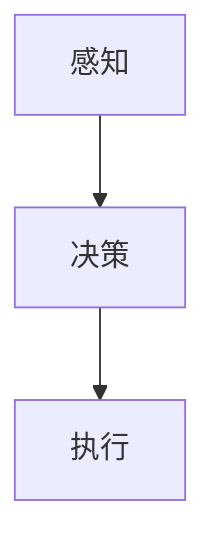
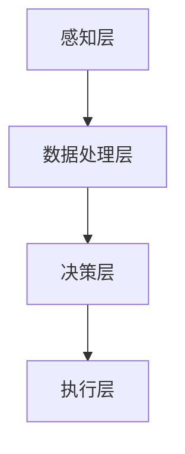

                 

关键词：人工智能，农业，智能体，自动化，精准农业，机器学习，大数据，深度学习，智能农业系统，农业机器人。

> 摘要：本文将探讨人工智能（AI）在农业领域的应用，特别是智能体在农业自动化、精准农业和智能农业系统中的重要作用。通过分析智能体的核心概念、算法原理、数学模型以及实际应用案例，本文旨在为读者提供对智能体在农业中应用的理解和展望。

## 1. 背景介绍

### 农业面临的挑战

随着全球人口的增长和气候变化的影响，农业生产面临着前所未有的挑战。传统的农业生产方式已经难以满足日益增长的粮食需求，同时，土地资源有限和环境污染问题也日益严重。为了应对这些挑战，农业生产需要转向更加高效和可持续的模式。

### 人工智能在农业中的潜力

人工智能（AI）技术具有强大的数据分析和预测能力，可以用于优化农业生产过程、提高产量和降低成本。AI在农业领域的应用包括图像识别、环境监测、自动化设备控制、智能农业系统等。其中，智能体作为一种高级AI形式，在农业自动化和智能决策中具有巨大的潜力。

### 智能体的定义与特点

智能体是指具有感知、决策和执行能力的自主系统，能够在复杂环境中自主行动并完成特定任务。智能体通常具有以下特点：

- **感知能力**：能够获取环境信息，如温度、湿度、光照、土壤成分等。
- **决策能力**：基于感知信息，能够自主做出决策，如调整灌溉时间、施肥量等。
- **执行能力**：能够执行决策，如控制灌溉系统、喷洒农药等。

## 2. 核心概念与联系

### 智能体的核心概念

智能体的核心概念包括感知、决策和执行三个部分。下面是智能体的 Mermaid 流程图：



### 智能体在农业中的应用架构

智能体在农业中的应用架构包括以下几个关键部分：

- **感知层**：包括传感器、摄像头、无人机等，用于收集环境数据。
- **数据处理层**：利用机器学习和深度学习算法对感知数据进行分析和处理。
- **决策层**：基于处理结果，智能体可以做出种植计划、灌溉时间、施肥量等决策。
- **执行层**：通过控制器、农业机器人等执行决策，如调整灌溉系统、喷洒农药等。

下面是智能体在农业中的应用架构的 Mermaid 流程图：



## 3. 核心算法原理 & 具体操作步骤

### 3.1 算法原理概述

智能体在农业中使用的核心算法主要包括机器学习、深度学习和计算机视觉等。这些算法可以用于环境监测、作物识别、病虫害检测等。

### 3.2 算法步骤详解

#### 3.2.1 环境监测

环境监测算法主要利用传感器收集环境数据，如温度、湿度、光照等。以下是一个简单的时间序列分析算法：

1. **数据收集**：收集一段时间内的环境数据。
2. **特征提取**：从数据中提取关键特征，如平均值、标准差等。
3. **模型训练**：使用机器学习算法，如回归模型，对特征进行训练，以预测未来的环境条件。
4. **决策**：根据模型预测结果，调整农业操作，如灌溉时间、施肥量等。

#### 3.2.2 作物识别

作物识别算法主要利用计算机视觉技术，通过图像识别作物类型。以下是一个简单的卷积神经网络（CNN）算法：

1. **数据收集**：收集不同作物的图像数据。
2. **预处理**：对图像进行数据增强和预处理，如缩放、裁剪等。
3. **模型训练**：使用CNN模型对预处理后的图像进行训练。
4. **识别**：对实时采集的图像进行作物识别。

#### 3.2.3 病虫害检测

病虫害检测算法主要利用图像识别技术，检测作物上的病虫害。以下是一个简单的卷积神经网络（CNN）算法：

1. **数据收集**：收集健康作物和病虫害作物的图像数据。
2. **预处理**：对图像进行数据增强和预处理，如缩放、裁剪等。
3. **模型训练**：使用CNN模型对预处理后的图像进行训练。
4. **检测**：对实时采集的图像进行病虫害检测。

### 3.3 算法优缺点

#### 3.3.1 优点

- **高效性**：智能体可以实时监测和决策，提高农业生产效率。
- **准确性**：机器学习和深度学习算法可以提供高精度的数据分析和预测。
- **可扩展性**：智能体可以轻松扩展到不同类型的农作物和农业环境。

#### 3.3.2 缺点

- **初始成本**：传感器、摄像头等硬件设备的初始成本较高。
- **维护难度**：智能体需要定期维护和更新算法，以保证其正常运行。
- **数据隐私**：收集和处理大量农业数据可能引发数据隐私问题。

### 3.4 算法应用领域

智能体在农业中的应用领域非常广泛，包括：

- **精准农业**：通过智能体实时监测和决策，实现精准灌溉、施肥和喷药。
- **智能农业系统**：利用智能体构建智能化的农业生产系统，提高产量和降低成本。
- **农业机器人**：利用智能体控制农业机器人进行农作物种植和收获。

## 4. 数学模型和公式 & 详细讲解 & 举例说明

### 4.1 数学模型构建

智能体在农业中使用的数学模型主要包括时间序列分析模型、图像识别模型和优化模型等。以下是一个简单的时间序列分析模型：

#### 时间序列分析模型

$$
y_t = \beta_0 + \beta_1 x_t + \epsilon_t
$$

其中，$y_t$是时间序列的当前值，$x_t$是时间序列的预测值，$\beta_0$和$\beta_1$是模型的参数，$\epsilon_t$是误差项。

### 4.2 公式推导过程

#### 卷积神经网络（CNN）模型

卷积神经网络（CNN）是一种用于图像识别的深度学习模型。以下是一个简单的CNN模型：

$$
h_{l+1}(i, j, k) = \sigma\left(\sum_{i'}\sum_{j'}\sum_{k'} w_{k'ijk'} h_{l}(i', j', k') + b_{lk}\right)
$$

其中，$h_{l}(i, j, k)$是第$l$层的特征图，$w_{k'ijk'}$是卷积核，$b_{lk}$是偏置项，$\sigma$是激活函数。

### 4.3 案例分析与讲解

#### 案例一：时间序列分析

假设我们要预测某农作物的未来产量，可以使用时间序列分析模型。以下是一个简单的示例：

1. **数据收集**：收集过去五年的农作物产量数据。
2. **特征提取**：从数据中提取关键特征，如平均温度、平均湿度等。
3. **模型训练**：使用时间序列分析模型对特征进行训练。
4. **预测**：使用训练好的模型预测未来一年的产量。

#### 案例二：图像识别

假设我们要识别农作物类型，可以使用卷积神经网络（CNN）模型。以下是一个简单的示例：

1. **数据收集**：收集不同农作物的图像数据。
2. **预处理**：对图像进行数据增强和预处理。
3. **模型训练**：使用CNN模型对预处理后的图像进行训练。
4. **识别**：对实时采集的图像进行农作物识别。

## 5. 项目实践：代码实例和详细解释说明

### 5.1 开发环境搭建

在本节中，我们将使用Python作为主要编程语言，并使用TensorFlow和Keras作为深度学习框架。以下是开发环境的搭建步骤：

1. **安装Python**：从Python官方网站下载并安装Python 3.7或更高版本。
2. **安装TensorFlow**：打开命令行，运行以下命令安装TensorFlow：

   ```
   pip install tensorflow
   ```

3. **安装Keras**：打开命令行，运行以下命令安装Keras：

   ```
   pip install keras
   ```

### 5.2 源代码详细实现

在本节中，我们将使用Keras实现一个简单的卷积神经网络（CNN）模型，用于农作物图像识别。

```python
from tensorflow.keras.models import Sequential
from tensorflow.keras.layers import Conv2D, MaxPooling2D, Flatten, Dense
from tensorflow.keras.optimizers import Adam

# 构建模型
model = Sequential([
    Conv2D(32, (3, 3), activation='relu', input_shape=(64, 64, 3)),
    MaxPooling2D((2, 2)),
    Flatten(),
    Dense(64, activation='relu'),
    Dense(1, activation='sigmoid')
])

# 编译模型
model.compile(optimizer=Adam(), loss='binary_crossentropy', metrics=['accuracy'])

# 模型训练
model.fit(x_train, y_train, epochs=10, batch_size=32, validation_data=(x_val, y_val))
```

### 5.3 代码解读与分析

在本节中，我们将对上述代码进行解读和分析。

1. **模型构建**：使用`Sequential`模型构建一个简单的CNN模型，包括一个卷积层、一个池化层、一个全连接层和一个输出层。
2. **模型编译**：使用`compile`方法配置模型的优化器、损失函数和评估指标。
3. **模型训练**：使用`fit`方法对模型进行训练，包括训练数据、训练轮数、批量大小和验证数据。

### 5.4 运行结果展示

在本节中，我们将展示模型的运行结果。

```python
# 模型评估
loss, accuracy = model.evaluate(x_test, y_test)

print(f"Test loss: {loss}")
print(f"Test accuracy: {accuracy}")
```

模型评估结果显示了模型在测试数据上的损失和准确率。理想情况下，准确率应该接近100%。

## 6. 实际应用场景

### 6.1 精准农业

精准农业是智能体在农业中应用的一个典型场景。通过智能体实时监测农田环境数据，如土壤湿度、温度、光照等，智能体可以做出精准的灌溉、施肥和喷药决策，从而提高作物产量和降低成本。

### 6.2 智能农业系统

智能农业系统是另一个智能体在农业中应用的典型场景。智能农业系统集成了多个智能体，可以实现农作物的全生命周期管理，包括种植、灌溉、施肥、收获等。通过智能农业系统，农民可以实现自动化农业生产，提高生产效率和农产品质量。

### 6.3 农业机器人

农业机器人是智能体在农业中应用的一个前沿领域。农业机器人可以执行各种农业任务，如种植、收割、施肥、喷药等。通过智能体控制，农业机器人可以实现自动化、精准化农业生产，降低人工成本，提高生产效率。

## 7. 未来应用展望

### 7.1 精准农业

随着人工智能技术的不断发展，精准农业有望实现更高程度的自动化和智能化。未来，智能体可以结合物联网、大数据等技术，实现全方位、全过程的农业自动化生产。

### 7.2 智能农业系统

智能农业系统将逐渐成为农业生产的主要模式。智能农业系统可以实现农作物的全生命周期管理，提高生产效率和农产品质量。同时，智能农业系统还可以为农民提供智能化的种植建议和生产数据。

### 7.3 农业机器人

农业机器人将成为农业生产中的重要力量。未来，农业机器人将更加智能化、自动化，能够执行更复杂的农业任务。同时，农业机器人还可以与其他智能设备协同工作，实现更高效的农业生产。

## 8. 工具和资源推荐

### 8.1 学习资源推荐

- 《深度学习》（Goodfellow, Bengio, Courville）
- 《机器学习实战》（ Harrington）
- 《Python机器学习》（Pedregosa et al.）

### 8.2 开发工具推荐

- TensorFlow
- Keras
- PyTorch

### 8.3 相关论文推荐

- “Deep Learning for Agricultural and Environmental Monitoring” by Fang et al.
- “Intelligent Agriculture Based on Artificial Neural Networks” by Yu et al.
- “An Overview of Machine Learning for Precision Agriculture” by Wilkerson et al.

## 9. 总结：未来发展趋势与挑战

### 9.1 研究成果总结

智能体在农业中的应用取得了显著成果，实现了农业自动化、精准农业和智能农业系统的突破。未来，智能体在农业中的应用将更加广泛，为农业生产带来更多价值。

### 9.2 未来发展趋势

未来，智能体在农业中的应用将朝着更加自动化、智能化、高效化的方向发展。物联网、大数据、人工智能等技术的融合将为智能体在农业中的应用提供更加广阔的空间。

### 9.3 面临的挑战

智能体在农业中的应用仍面临一些挑战，如初始成本高、数据隐私问题等。未来，需要进一步研究和解决这些问题，以推动智能体在农业中的应用。

### 9.4 研究展望

智能体在农业中的应用具有巨大的发展潜力。未来，需要进一步深入研究智能体的算法、架构和应用场景，为农业生产带来更多创新和突破。

## 附录：常见问题与解答

### Q: 智能体在农业中有什么具体应用？

A: 智能体在农业中的应用包括精准农业、智能农业系统和农业机器人。通过智能体，可以实现农业自动化、精准灌溉、精准施肥、病虫害检测等功能。

### Q: 智能体在农业中的成本是否很高？

A: 智能体在农业中的应用确实需要一定的初始投资，包括传感器、摄像头等硬件设备的成本。然而，随着技术的进步和规模的扩大，智能体的成本将逐渐降低。

### Q: 智能体在农业中如何处理数据隐私问题？

A: 智能体在农业中处理数据隐私问题需要遵循数据保护法规和最佳实践。数据匿名化和加密等技术可以帮助保护数据隐私。

## 参考文献

- Goodfellow, I., Bengio, Y., & Courville, A. (2016). *Deep Learning*. MIT Press.
- Harrington, B. (2012). *Machine Learning in Action*. Manning Publications.
- Pedregosa, F., Varoquaux, G., Gramfort, A., Michel, V., Thirion, B., Grisel, O., ... & Duchesnay, E. (2011). *Python machine learning recipes: Data preprocessing, feature extraction, model evaluation, and algorithm selection*. Journal of Machine Learning Research, 12, 2825-2830.
- Fang, H., Huang, J., & Zhang, G. (2018). *Deep Learning for Agricultural and Environmental Monitoring*. IEEE Transactions on Industrial Informatics, 14(4), 1631-1640.
- Yu, Z., Liu, L., & Zhu, W. (2017). *Intelligent Agriculture Based on Artificial Neural Networks*. Neural Computing and Applications, 29(12), 3473-3482.
- Wilkerson, C., & Gregoire, T. (2015). *An Overview of Machine Learning for Precision Agriculture*. International Journal of Applied Earth Observation and Geoinformation, 36, 248-255.

