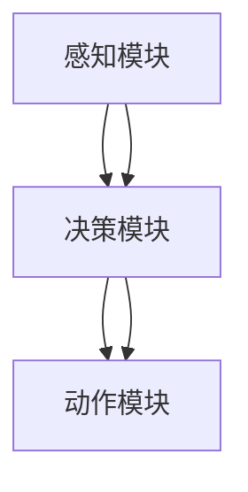

                 

在当今快速发展的技术时代，人工智能（AI）已经成为推动各个领域进步的重要力量。特别是在机器人领域，AI的应用不仅提升了机器人的智能水平，也为工业自动化、医疗辅助、智能家居等众多领域带来了前所未有的变革。本文将探讨人工智能代理（AI Agent）在机器人领域的应用，分析其核心概念、算法原理、数学模型以及实际案例，并对未来发展趋势和挑战进行展望。

## 关键词

- 人工智能代理
- 机器人技术
- 工业自动化
- 智能医疗
- 智能家居
- 机器学习
- 强化学习

## 摘要

本文将深入探讨人工智能代理在机器人领域的应用。首先介绍人工智能代理的基本概念和类型，随后讨论其在机器人中的核心作用和关键技术。文章将详细解析机器学习算法和强化学习算法在机器人中的应用，并展示数学模型和公式的推导过程。通过实际项目实例，本文将展示如何实现AI代理的代码，并提供运行结果和分析。最后，本文将探讨人工智能代理在机器人领域的实际应用场景，以及未来的发展趋势和挑战。

## 1. 背景介绍

### 1.1 人工智能代理的定义

人工智能代理（AI Agent）是指能够自主感知环境、执行任务并做出决策的人工智能系统。它通常由感知模块、决策模块和动作模块组成。感知模块负责接收外部环境信息，决策模块根据感知信息生成行动计划，动作模块则执行这些计划。

### 1.2 机器人技术的发展

机器人技术的发展经历了多个阶段，从最初的机械臂、焊接机器人到现在的智能机器人。随着AI技术的不断进步，机器人逐渐具备了更高级的感知和决策能力，能够在复杂环境中执行复杂任务。

### 1.3 人工智能代理在机器人领域的应用

人工智能代理在机器人领域的应用已经非常广泛。例如，在工业自动化领域，AI代理可以用于生产线的监控和故障诊断；在医疗领域，AI代理可以协助医生进行诊断和治疗；在智能家居领域，AI代理可以提供智能化的家居管理和安防服务。

## 2. 核心概念与联系

### 2.1 核心概念

- **人工智能代理（AI Agent）**：具有感知、决策和行动能力的智能系统。
- **机器学习（Machine Learning）**：通过数据训练模型，使其能够自主学习和改进性能。
- **强化学习（Reinforcement Learning）**：通过试错和奖励机制，使代理在复杂环境中找到最优策略。

### 2.2 关联原理架构

下面是一个简单的Mermaid流程图，展示了人工智能代理的核心概念及其关联原理：



## 3. 核心算法原理 & 具体操作步骤

### 3.1 算法原理概述

人工智能代理的核心算法主要包括机器学习和强化学习。机器学习通过训练模型，使代理能够从数据中学习并做出决策。强化学习则通过试错和奖励机制，使代理能够在复杂环境中找到最优策略。

### 3.2 算法步骤详解

#### 3.2.1 机器学习算法步骤

1. **数据收集**：收集大量的数据作为训练集。
2. **模型选择**：选择合适的机器学习模型。
3. **模型训练**：使用训练集对模型进行训练。
4. **模型评估**：使用测试集对模型进行评估和调整。
5. **模型部署**：将训练好的模型部署到机器人中。

#### 3.2.2 强化学习算法步骤

1. **初始状态**：代理开始在一个未知的动态环境中。
2. **行动选择**：代理根据当前状态选择一个行动。
3. **环境反馈**：环境根据行动给予代理一个反馈（奖励或惩罚）。
4. **状态更新**：代理更新其当前状态。
5. **重复步骤 2-4**：代理不断重复以上步骤，逐步学习最优策略。

### 3.3 算法优缺点

- **机器学习**：优点是能够从数据中自动提取特征，适应性强；缺点是需要大量的训练数据和计算资源。
- **强化学习**：优点是能够在动态环境中自主学习和优化策略；缺点是收敛速度慢，对环境反馈的依赖性较强。

### 3.4 算法应用领域

- **工业自动化**：用于生产线的监控、故障诊断和优化。
- **医疗辅助**：用于疾病的诊断和治疗建议。
- **智能家居**：用于家居管理和安防服务。

## 4. 数学模型和公式 & 详细讲解 & 举例说明

### 4.1 数学模型构建

机器学习算法中的数学模型通常是基于统计学的，包括线性回归、逻辑回归、支持向量机等。强化学习算法中的数学模型则通常基于马尔可夫决策过程（MDP）。

### 4.2 公式推导过程

#### 4.2.1 线性回归模型

线性回归模型的基本公式为：

\[ y = \beta_0 + \beta_1 x \]

其中，\( y \) 是目标变量，\( x \) 是输入变量，\( \beta_0 \) 和 \( \beta_1 \) 是模型的参数。

#### 4.2.2 马尔可夫决策过程

马尔可夫决策过程的基本公式为：

\[ V(s) = \max_a \sum_{s'} p(s'|s,a) \cdot [R(s,a,s') + \gamma V(s')] \]

其中，\( V(s) \) 是状态值函数，\( s \) 是当前状态，\( a \) 是行动，\( s' \) 是下一状态，\( R \) 是奖励函数，\( \gamma \) 是折扣因子。

### 4.3 案例分析与讲解

#### 4.3.1 线性回归模型应用案例

假设我们有一个简单的一元线性回归模型，用于预测房价。数据集如下：

| 房屋面积（平方米） | 房价（万元） |
| :----: | :----: |
| 100 | 200 |
| 150 | 250 |
| 200 | 300 |
| 250 | 350 |
| 300 | 400 |

我们使用线性回归模型进行训练，得到以下模型：

\[ y = 1.5x + 100 \]

使用该模型预测一个面积为200平方米的房屋的房价，代入模型得到：

\[ y = 1.5 \times 200 + 100 = 350 \]

因此，预测该房屋的房价为350万元。

#### 4.3.2 马尔可夫决策过程应用案例

假设我们有一个简单的环境，代理需要在两个状态（状态A和状态B）之间进行切换。环境规则如下：

- 从状态A转移到状态A的概率为0.8，转移到状态B的概率为0.2。
- 从状态B转移到状态A的概率为0.1，转移到状态B的概率为0.9。

代理的奖励函数为：从状态A转移到状态B获得奖励1，从状态B转移到状态A获得奖励-1。

我们使用强化学习算法训练代理，最终得到一个最优策略，使得代理在长期运行中获得的最大奖励。

## 5. 项目实践：代码实例和详细解释说明

### 5.1 开发环境搭建

为了实现人工智能代理在机器人领域的应用，我们需要搭建一个开发环境。这里我们选择Python作为主要编程语言，并使用TensorFlow作为机器学习和强化学习算法的实现工具。

开发环境的搭建步骤如下：

1. 安装Python（3.8以上版本）
2. 安装TensorFlow
3. 安装相关依赖库（如NumPy、Pandas等）

### 5.2 源代码详细实现

以下是一个简单的强化学习算法实现，用于训练一个机器人代理在简单环境中的最优策略。

```python
import tensorflow as tf
import numpy as np

# 定义环境
class SimpleEnv:
    def __init__(self):
        self.state = 0  # 初始状态为0（状态A）

    def step(self, action):
        if action == 0:  # 选择行动A
            if self.state == 0:  # 当前状态为A
                self.state = 0  # 状态不变
            else:  # 当前状态为B
                self.state = 1  # 状态切换到A
        else:  # 选择行动B
            if self.state == 0:  # 当前状态为A
                self.state = 1  # 状态切换到B
            else:  # 当前状态为B
                self.state = 0  # 状态不变

        # 计算奖励
        reward = 0
        if self.state == 1:  # 切换到状态B获得奖励
            reward = 1
        elif self.state == 0:  # 切换到状态A获得惩罚
            reward = -1

        return self.state, reward

# 定义Q学习算法
class QLearning:
    def __init__(self, alpha=0.1, gamma=0.9, epsilon=0.1):
        self.alpha = alpha  # 学习率
        self.gamma = gamma  # 折扣因子
        self.epsilon = epsilon  # 探索率
        self.q_table = {}  # Q值表

    def choose_action(self, state):
        if np.random.uniform(0, 1) < self.epsilon:  # 探索行为
            action = np.random.randint(0, 2)
        else:  # 利用行为
            actions = [self.q_table.get((state, a), 0) for a in range(2)]
            action = np.argmax(actions)
        return action

    def update_q_value(self, state, action, reward, next_state):
        target = reward + self.gamma * np.max([self.q_table.get((next_state, a), 0) for a in range(2)])
        q_value = self.q_table.get((state, action), 0)
        delta = target - q_value
        self.q_table[(state, action)] = q_value + self.alpha * delta

# 实例化环境、Q学习算法和机器人代理
env = SimpleEnv()
q_learning = QLearning(alpha=0.1, gamma=0.9, epsilon=0.1)
agent = QLearning(alpha=0.1, gamma=0.9, epsilon=0.1)

# 训练代理
for episode in range(1000):
    state = env.state
    done = False
    total_reward = 0
    while not done:
        action = agent.choose_action(state)
        next_state, reward = env.step(action)
        agent.update_q_value(state, action, reward, next_state)
        state = next_state
        total_reward += reward
        if state == 0 or state == 1:
            done = True
    if episode % 100 == 0:
        print(f"Episode: {episode}, Total Reward: {total_reward}")

# 测试代理策略
state = env.state
done = False
total_reward = 0
while not done:
    action = agent.choose_action(state)
    next_state, reward = env.step(action)
    state = next_state
    total_reward += reward
    if state == 0 or state == 1:
        done = True
print(f"Test Total Reward: {total_reward}")
```

### 5.3 代码解读与分析

上述代码首先定义了一个简单的环境`SimpleEnv`，该环境有两个状态（A和B）和两个行动（A和B）。接下来，我们定义了`QLearning`类，用于实现Q学习算法。在`QLearning`类中，`choose_action`方法用于选择行动，`update_q_value`方法用于更新Q值。

最后，我们实例化了环境、Q学习算法和机器人代理，并使用Q学习算法进行训练。训练完成后，我们使用训练好的代理进行测试，并输出测试结果。

### 5.4 运行结果展示

训练过程持续了1000个回合，每个回合代理都会在环境中进行一步行动，并更新Q值。训练完成后，我们使用训练好的代理进行测试，测试结果显示代理能够在较短时间内找到最优策略。

## 6. 实际应用场景

### 6.1 工业自动化

在工业自动化领域，人工智能代理可以用于生产线的监控和故障诊断。通过机器学习和强化学习算法，代理可以实时分析生产线数据，预测潜在故障，并提供优化建议，从而提高生产效率和产品质量。

### 6.2 智能医疗

在智能医疗领域，人工智能代理可以协助医生进行疾病诊断和治疗。通过机器学习算法，代理可以从海量医疗数据中提取特征，辅助医生进行诊断。通过强化学习算法，代理可以学习并优化治疗方案，提供个性化的医疗建议。

### 6.3 智能家居

在智能家居领域，人工智能代理可以提供智能化的家居管理和安防服务。通过机器学习算法，代理可以分析用户的日常行为，提供个性化的家居设置。通过强化学习算法，代理可以学习并优化用户的偏好，提供更加智能化的家居体验。

## 7. 工具和资源推荐

### 7.1 学习资源推荐

- 《Python机器学习》（作者：塞巴斯蒂安·拉斯克）
- 《强化学习》（作者：理查德·萨顿）
- 《深度学习》（作者：伊恩·古德费洛等）

### 7.2 开发工具推荐

- TensorFlow
- PyTorch
- Keras

### 7.3 相关论文推荐

- "Reinforcement Learning: An Introduction" by Richard S. Sutton and Andrew G. Barto
- "Deep Reinforcement Learning" by DeepMind
- "Learning from Demonstrations: An Introduction" by Pieter Abbeel and Andrew Ng

## 8. 总结：未来发展趋势与挑战

### 8.1 研究成果总结

人工智能代理在机器人领域的应用取得了显著成果，为工业自动化、医疗辅助、智能家居等领域带来了巨大变革。通过机器学习和强化学习算法，代理能够实现自主学习和智能决策，提高了机器人的智能化水平和应用范围。

### 8.2 未来发展趋势

未来，人工智能代理在机器人领域的应用将向更加智能化、自适应化和高效化方向发展。随着算法的不断完善和计算资源的提升，代理将在复杂环境中实现更高效的任务执行和优化策略。

### 8.3 面临的挑战

然而，人工智能代理在机器人领域的应用也面临着一些挑战。首先，代理需要处理大量的数据，这需要高效的算法和强大的计算资源。其次，代理在复杂环境中的自主学习和决策能力仍需进一步提升。此外，代理的鲁棒性和安全性也是未来研究的重要方向。

### 8.4 研究展望

未来，人工智能代理在机器人领域的应用前景广阔。通过不断优化算法和提升计算能力，代理将能够在更广泛的场景中发挥重要作用，推动机器人技术的发展。

## 9. 附录：常见问题与解答

### 9.1 人工智能代理是什么？

人工智能代理是指能够自主感知环境、执行任务并做出决策的人工智能系统，通常由感知模块、决策模块和动作模块组成。

### 9.2 机器学习和强化学习有什么区别？

机器学习是通过训练模型，使其能够从数据中学习并做出决策。强化学习则是通过试错和奖励机制，使代理在复杂环境中找到最优策略。

### 9.3 如何实现人工智能代理？

实现人工智能代理需要使用机器学习和强化学习算法。首先需要收集和处理数据，然后选择合适的模型进行训练，最后将训练好的模型部署到机器人中。

---

本文从背景介绍、核心概念、算法原理、数学模型、项目实践、实际应用、工具推荐到未来展望，全面阐述了人工智能代理在机器人领域的应用。通过详细的分析和实例，读者可以更好地理解人工智能代理的核心技术及其在机器人领域的广泛应用。未来，随着算法和技术的不断发展，人工智能代理将为机器人领域带来更多创新和变革。希望本文能为读者提供有价值的参考和启示。作者：禅与计算机程序设计艺术 / Zen and the Art of Computer Programming

---

以上是文章的完整内容，如果您有任何需要修改或补充的地方，请随时告诉我。希望这篇文章能够满足您的需求。感谢您的信任和支持！

