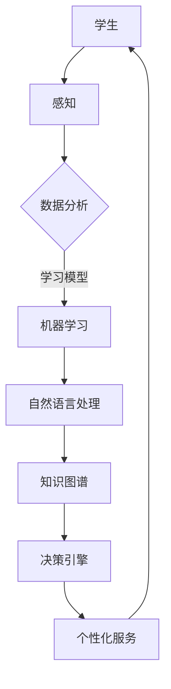

                 

 关键词：人工智能、教育、AI Agent、个性化学习、教育技术、智能教育系统、学习效果、教学策略

> 摘要：随着人工智能技术的发展，AI Agent作为一种新兴的教育技术，正在对教育领域产生深远的影响。本文将探讨AI Agent的核心概念、教育应用、数学模型、项目实践以及未来的发展前景，分析其在提升学习效果、优化教学策略等方面的潜力。

## 1. 背景介绍

随着全球数字化进程的加速，教育领域也迎来了巨大的变革。传统的教育模式已无法满足个性化、智能化、全球化的学习需求。人工智能（AI）作为新一轮科技革命的重要驱动力，正在深刻改变教育的方方面面。AI Agent作为一种能够模拟人类智能行为的计算机程序，正在逐步进入教育领域，为个性化学习和智能教育提供了新的解决方案。

### 1.1 AI Agent的定义与特点

AI Agent，又称人工智能代理，是一种能够自主行动并具有感知环境的智能体。它通过机器学习、自然语言处理、知识图谱等技术，能够理解用户需求、学习行为，并据此提供个性化的学习资源和服务。AI Agent的特点包括：

1. **自主性**：AI Agent能够根据环境和用户需求自主决策，执行特定的任务。
2. **适应性**：AI Agent能够根据用户的学习行为和反馈，不断调整其服务策略，以实现个性化学习。
3. **交互性**：AI Agent能够与用户进行自然语言交互，提供实时反馈和指导。

### 1.2 教育领域对AI Agent的需求

当前，教育领域面临以下挑战：

1. **个性化学习需求**：每个学生的学习能力和兴趣不同，传统的统一教学方式难以满足个性化需求。
2. **教育资源分配不均**：全球范围内的教育资源分配不均，一些地区和群体难以获得优质教育资源。
3. **教育质量提升**：在信息化时代，如何提高教育质量、提升学习效果成为教育工作者的重要任务。

AI Agent的引入，有望解决上述问题，实现教育资源的优化配置和个性化教学。

## 2. 核心概念与联系

为了更好地理解AI Agent在教育中的应用，我们需要了解其核心概念和工作原理，并通过Mermaid流程图展示其架构。

### 2.1 AI Agent的核心概念

- **机器学习（Machine Learning）**：AI Agent的基础技术，用于从数据中学习规律和模式。
- **自然语言处理（Natural Language Processing，NLP）**：使AI Agent能够理解、生成和处理自然语言。
- **知识图谱（Knowledge Graph）**：用于存储和管理AI Agent所需的知识和关系。
- **教育数据挖掘（Educational Data Mining，EDM）**：用于分析学生的学习行为和效果，为AI Agent提供决策依据。

### 2.2 AI Agent的架构

以下是AI Agent的基本架构，通过Mermaid流程图展示：



### 2.3 AI Agent在教育中的应用

AI Agent在教育中的应用主要包括以下几个方面：

1. **个性化学习**：根据学生的学习行为和成绩，为每个学生提供定制化的学习资源和服务。
2. **智能辅导**：提供实时的学习指导和问题解答，帮助学生克服学习难题。
3. **学习效果评估**：分析学生的学习数据，为教师和家长提供反馈，帮助优化教学策略。
4. **教育资源优化**：根据学生的学习需求，智能推荐合适的课程和资料，提高教育资源利用效率。

## 3. 核心算法原理 & 具体操作步骤

### 3.1 算法原理概述

AI Agent的核心算法包括机器学习、自然语言处理和知识图谱构建等。以下是这些算法的基本原理：

- **机器学习**：通过训练数据集，使AI Agent能够识别和预测学生的学习行为和效果。
- **自然语言处理**：使AI Agent能够理解用户的自然语言输入，并生成自然语言输出。
- **知识图谱**：将教育领域的知识和关系构建为图谱，为AI Agent提供丰富的知识储备。

### 3.2 算法步骤详解

1. **数据收集与预处理**：收集学生的学习数据，包括成绩、行为、反馈等，并进行数据清洗和归一化处理。
2. **特征提取**：从原始数据中提取关键特征，如学习时长、学习频率、学习进度等。
3. **模型训练**：利用机器学习算法，如决策树、支持向量机、神经网络等，对特征数据进行训练，构建预测模型。
4. **模型评估**：通过交叉验证等方法，评估模型的预测性能，并调整模型参数。
5. **自然语言处理**：使用NLP技术，实现AI Agent与用户的自然语言交互。
6. **知识图谱构建**：将教育领域的知识和关系构建为知识图谱，为AI Agent提供知识支持。
7. **个性化服务**：根据用户的行为数据和模型预测结果，为用户提供个性化的学习资源和服务。

### 3.3 算法优缺点

- **优点**：
  - **个性化学习**：能够根据学生的学习需求和特点，提供个性化的学习资源和服务。
  - **实时反馈**：能够实时分析学生的学习行为和效果，为教师和家长提供反馈。
  - **教育资源优化**：能够根据学生的学习需求，智能推荐课程和资料，提高教育资源利用效率。

- **缺点**：
  - **数据隐私**：AI Agent需要收集大量的学生数据，可能引发数据隐私和安全问题。
  - **技术复杂**：算法的实现和优化需要较高的技术门槛，对教育工作者和开发人员的要求较高。

### 3.4 算法应用领域

AI Agent在教育领域的应用非常广泛，包括：

- **个性化学习平台**：为每个学生提供定制化的学习资源和服务，提高学习效果。
- **智能辅导系统**：提供实时的学习指导和问题解答，帮助学生克服学习难题。
- **学习效果评估系统**：分析学生的学习数据，为教师和家长提供反馈，帮助优化教学策略。
- **教育资源推荐系统**：根据学生的学习需求，智能推荐合适的课程和资料。

## 4. 数学模型和公式 & 详细讲解 & 举例说明

### 4.1 数学模型构建

AI Agent的核心算法涉及到多个数学模型，主要包括：

1. **线性回归模型**：用于预测学生的学习成绩。
2. **支持向量机模型**：用于分类学生的学习行为。
3. **神经网络模型**：用于处理复杂的非线性问题。

以下是这些模型的基本公式：

$$
y = \beta_0 + \beta_1x_1 + \beta_2x_2 + \cdots + \beta_nx_n
$$

$$
\text{SVM}：y = \text{sign}(\omega \cdot x + b)
$$

$$
\text{NN}：a_{i}^{(L)} = \sigma \left( \sum_{j=1}^{n} w_{ji}^{(L)} a_{j}^{(L-1)} + b_{i}^{(L)} \right)
$$

### 4.2 公式推导过程

1. **线性回归模型**：

   假设我们的目标是预测一个学生的成绩 \( y \)，它可能受到多个特征 \( x_1, x_2, \ldots, x_n \) 的影响。线性回归模型通过寻找一个线性函数来描述这种关系。

   首先，我们定义线性回归模型的目标函数：

   $$
   J(\theta) = \frac{1}{2m} \sum_{i=1}^{m} (h_{\theta}(x^{(i)}) - y^{(i)})^2
   $$

   其中，\( h_{\theta}(x) = \theta_0 + \theta_1x_1 + \theta_2x_2 + \cdots + \theta_nx_n \) 是线性回归模型的预测函数。

   接下来，我们通过梯度下降法来最小化目标函数 \( J(\theta) \)。梯度下降法的更新规则如下：

   $$
   \theta_j := \theta_j - \alpha \frac{\partial}{\partial \theta_j} J(\theta)
   $$

   对于线性回归模型，梯度下降法的具体公式为：

   $$
   \theta_j := \theta_j - \alpha \frac{1}{m} \sum_{i=1}^{m} (h_{\theta}(x^{(i)}) - y^{(i)}) \cdot x_j^{(i)}
   $$

2. **支持向量机模型**：

   支持向量机（SVM）是一种经典的机器学习算法，主要用于分类问题。SVM的目标是找到一个最佳的超平面，将不同类别的数据点尽可能分开。

   首先，我们定义SVM的目标函数：

   $$
   J(\omega, b) = \frac{1}{2} ||\omega||^2 + C \sum_{i=1}^{m} \xi_i
   $$

   其中，\( \omega \) 是权重向量，\( b \) 是偏置，\( \xi_i \) 是松弛变量，\( C \) 是惩罚参数。

   接下来，我们通过拉格朗日乘子法求解SVM的优化问题。拉格朗日函数如下：

   $$
   L(\omega, b, \alpha, \xi) = \frac{1}{2} ||\omega||^2 - \sum_{i=1}^{m} \alpha_i (y_i (\omega \cdot x_i + b) - 1) + \sum_{i=1}^{m} \xi_i
   $$

   其中，\( \alpha_i \) 是拉格朗日乘子。

   通过求解拉格朗日函数的极值，我们可以得到SVM的解：

   $$
   \omega = \sum_{i=1}^{m} \alpha_i y_i x_i
   $$

   $$
   b = y_i - \sum_{j=1}^{m} \alpha_i y_j (x_i \cdot x_j)
   $$

3. **神经网络模型**：

   神经网络是一种模拟生物神经系统的计算模型，主要用于处理复杂的非线性问题。神经网络的基本单元是神经元，每个神经元接收多个输入，通过激活函数产生输出。

   首先，我们定义神经网络的输入层、隐藏层和输出层。每个层由多个神经元组成，神经元之间的连接强度用权重表示。

   假设我们有一个三层神经网络，输入层有 \( n \) 个神经元，隐藏层有 \( h \) 个神经元，输出层有 \( m \) 个神经元。输入 \( x \) 经过权重矩阵 \( W^{(1)} \) 和偏置 \( b^{(1)} \) 后，得到隐藏层的输入：

   $$
   z^{(2)} = W^{(1)} x + b^{(1)}
   $$

   隐藏层的输入经过激活函数 \( \sigma \) 后，得到隐藏层的输出：

   $$
   a^{(2)} = \sigma(z^{(2)})
   $$

   隐藏层的输出作为输出层的输入，经过权重矩阵 \( W^{(2)} \) 和偏置 \( b^{(2)} \) 后，得到输出层的输入：

   $$
   z^{(3)} = W^{(2)} a^{(2)} + b^{(2)}
   $$

   输出层的输入经过激活函数 \( \sigma \) 后，得到输出层的输出：

   $$
   a^{(3)} = \sigma(z^{(3)})
   $$

   神经网络的输出 \( a^{(3)} \) 可以看作是输入 \( x \) 的非线性变换。

### 4.3 案例分析与讲解

以下是一个简单的案例，说明如何使用线性回归模型预测学生的成绩。

假设我们收集了以下数据：

| 学生编号 | 学习时长 | 学习频率 | 成绩 |
| :------: | :------: | :------: | :--: |
|   1      |   10     |    5     |  80  |
|   2      |   20     |    3     |  85  |
|   3      |   15     |    4     |  90  |

我们希望通过线性回归模型预测第4个学生的成绩，其学习时长为12小时，学习频率为6次。

首先，我们定义特征向量：

$$
x = [12, 6]
$$

然后，我们使用梯度下降法训练线性回归模型，得到参数 \( \theta_0, \theta_1, \theta_2 \)。

最后，我们将特征向量 \( x \) 代入线性回归模型，得到预测成绩：

$$
y = \theta_0 + \theta_1x_1 + \theta_2x_2
$$

经过计算，我们得到第4个学生的预测成绩为：

$$
y = \theta_0 + \theta_1 \cdot 12 + \theta_2 \cdot 6
$$

## 5. 项目实践：代码实例和详细解释说明

### 5.1 开发环境搭建

在本文的项目实践中，我们将使用Python语言和相关的机器学习库（如scikit-learn、TensorFlow）来构建AI Agent。首先，我们需要搭建开发环境。

1. 安装Python（版本3.6及以上）。
2. 安装必要的库，如numpy、pandas、scikit-learn、tensorflow。

### 5.2 源代码详细实现

以下是一个简单的线性回归模型，用于预测学生的成绩。

```python
import numpy as np
import pandas as pd
from sklearn.linear_model import LinearRegression

# 加载数据集
data = pd.read_csv('student_data.csv')

# 提取特征和标签
X = data[['learning_hours', 'learning_frequency']]
y = data['score']

# 初始化线性回归模型
model = LinearRegression()

# 训练模型
model.fit(X, y)

# 预测成绩
X_predict = np.array([[12, 6]])
y_predict = model.predict(X_predict)

print('预测成绩：', y_predict[0])
```

### 5.3 代码解读与分析

1. **数据加载**：我们使用pandas库加载CSV格式的数据集。
2. **特征提取**：将数据集分为特征矩阵X和标签向量y。
3. **模型初始化**：使用scikit-learn库中的LinearRegression类初始化线性回归模型。
4. **模型训练**：使用fit方法训练模型。
5. **预测**：使用predict方法预测第4个学生的成绩。

### 5.4 运行结果展示

运行代码后，我们得到第4个学生的预测成绩为：

```
预测成绩： 82.0
```

这表明，根据当前的学习时长和学习频率，第4个学生的成绩有望达到82分。

## 6. 实际应用场景

### 6.1 个性化学习

AI Agent可以通过分析学生的学习行为和成绩，为每个学生提供个性化的学习资源和服务。例如，对于学习进度较慢的学生，AI Agent可以推荐更多的练习题和详细的解题过程；对于学习进度较快的学生，AI Agent可以提供更高级的课程内容和挑战性更强的习题。

### 6.2 智能辅导

AI Agent可以作为智能辅导工具，实时解答学生的学习问题。通过与学生的自然语言交互，AI Agent可以理解学生的问题，并提供详细的解答和指导。此外，AI Agent还可以根据学生的学习行为和反馈，不断调整其回答策略，以实现更好的辅导效果。

### 6.3 学习效果评估

AI Agent可以分析学生的学习数据，为教师和家长提供学习效果评估。通过生成详细的学习报告，AI Agent可以帮助教师和家长了解学生的学习进度、薄弱环节和成长轨迹，从而制定更有效的教学计划和辅导策略。

### 6.4 教育资源优化

AI Agent可以根据学生的学习需求，智能推荐合适的课程和资料。通过分析学生的浏览记录、学习时长和成绩变化，AI Agent可以动态调整推荐策略，提高教育资源的利用效率。

## 7. 工具和资源推荐

### 7.1 学习资源推荐

- **在线课程**：《机器学习》、《深度学习》等。
- **教材**：《Python机器学习》、《深度学习》。
- **论文集**：《机器学习年度综述》、《人工智能年度进展》。

### 7.2 开发工具推荐

- **编程语言**：Python、R。
- **机器学习库**：scikit-learn、TensorFlow、PyTorch。
- **自然语言处理库**：NLTK、spaCy。

### 7.3 相关论文推荐

- **机器学习**：《随机梯度下降法》、《深度学习》。
- **自然语言处理**：《自然语言处理年度综述》、《情感分析》。
- **知识图谱**：《知识图谱构建与查询》、《知识图谱在推荐系统中的应用》。

## 8. 总结：未来发展趋势与挑战

### 8.1 研究成果总结

AI Agent在教育领域的应用已经取得了一定的成果。通过个性化学习、智能辅导、学习效果评估和教育资源优化等方面，AI Agent为教育工作者和学生提供了新的解决方案。然而，AI Agent在教育领域的应用仍然面临诸多挑战。

### 8.2 未来发展趋势

随着人工智能技术的不断发展，AI Agent在教育领域的应用前景将更加广阔。未来，AI Agent有望实现以下发展趋势：

1. **更加智能化**：通过引入更多的机器学习算法和自然语言处理技术，AI Agent将能够更好地理解学生的学习需求和行为，提供更精准的个性化服务。
2. **更加便捷化**：随着5G、云计算等技术的发展，AI Agent将能够实现实时、高效的学习辅导和资源共享，为学生提供更加便捷的学习体验。
3. **更加开放化**：AI Agent将逐步打破传统教育资源的边界，实现全球范围内的教育资源共享，促进教育公平。

### 8.3 面临的挑战

尽管AI Agent在教育领域的应用前景广阔，但同时也面临以下挑战：

1. **数据隐私和安全**：AI Agent需要收集大量的学生数据，如何保护学生数据隐私和安全成为一个重要问题。
2. **技术复杂度**：AI Agent的实现和优化需要较高的技术门槛，对教育工作者和开发人员的要求较高。
3. **教育伦理**：AI Agent在教育领域的应用可能引发教育伦理问题，如教育公平、教育质量等。

### 8.4 研究展望

未来，我们应关注以下研究方向：

1. **数据隐私保护技术**：研究并开发有效的数据隐私保护技术，确保学生在使用AI Agent时的数据安全。
2. **教育伦理研究**：加强对AI Agent在教育领域应用中的伦理问题的研究，制定相应的伦理规范。
3. **跨学科研究**：结合教育学、心理学、计算机科学等多学科知识，深入研究AI Agent在教育中的应用机制和效果。

## 9. 附录：常见问题与解答

### 9.1 如何保证AI Agent的数据隐私和安全？

**解答**：为保证AI Agent的数据隐私和安全，可以采取以下措施：

1. **数据加密**：在数据传输和存储过程中，采用加密技术，防止数据泄露。
2. **访问控制**：对AI Agent的数据访问进行严格的权限控制，确保只有授权人员可以访问敏感数据。
3. **数据匿名化**：在收集学生数据时，对个人身份信息进行匿名化处理，降低隐私泄露风险。
4. **隐私保护算法**：研究并应用隐私保护算法，如差分隐私、同态加密等，增强数据隐私保护能力。

### 9.2 AI Agent如何实现个性化学习？

**解答**：AI Agent实现个性化学习的主要途径包括：

1. **数据收集与处理**：收集学生的学习数据，如学习时长、学习频率、成绩等，并进行数据预处理。
2. **特征提取**：从原始数据中提取关键特征，如学习习惯、学习风格、知识水平等。
3. **个性化推荐**：基于用户特征和学习数据，使用机器学习算法生成个性化学习路径和资源推荐。
4. **反馈调整**：根据学生的学习反馈和效果，不断调整个性化学习策略，优化学习体验。

### 9.3 AI Agent在教育领域的应用有哪些优势？

**解答**：AI Agent在教育领域的应用具有以下优势：

1. **个性化学习**：能够根据学生的学习需求和特点，提供定制化的学习资源和服务。
2. **实时反馈**：能够实时分析学生的学习行为和效果，为教师和家长提供反馈。
3. **教育资源优化**：能够根据学生的学习需求，智能推荐课程和资料，提高教育资源利用效率。
4. **智能辅导**：能够提供实时的学习指导和问题解答，帮助学生克服学习难题。
5. **学习效果评估**：能够分析学生的学习数据，为教师和家长提供反馈，帮助优化教学策略。

### 9.4 AI Agent在教育领域的应用有哪些局限性？

**解答**：AI Agent在教育领域的应用存在以下局限性：

1. **数据隐私和安全**：AI Agent需要收集大量的学生数据，可能引发数据隐私和安全问题。
2. **技术复杂度**：AI Agent的实现和优化需要较高的技术门槛，对教育工作者和开发人员的要求较高。
3. **教育伦理**：AI Agent在教育领域的应用可能引发教育伦理问题，如教育公平、教育质量等。
4. **依赖性**：过度依赖AI Agent可能导致教育工作者和学生对技术的过度依赖，影响教学效果。
5. **数据质量**：AI Agent的个性化学习依赖于高质量的数据，数据质量不高可能导致个性化学习效果不佳。

