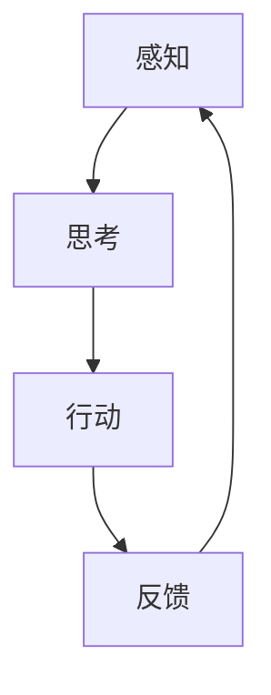

                 

关键词：人工智能代理，教育科技，工作流，应用场景，未来发展

摘要：随着人工智能技术的迅速发展，AI代理（AI Agents）在教育科技中的应用逐渐受到关注。本文旨在探讨AI人工智能代理工作流（AI Agent WorkFlow）在教育科技中的潜在应用，核心概念与联系，算法原理，数学模型，项目实践以及未来发展趋势和挑战。

## 1. 背景介绍

### 1.1 人工智能在教育科技中的重要性

近年来，人工智能技术在教育领域的应用日益广泛。从智能化的学习系统到个性化的教育内容推荐，AI在教育科技中正发挥着重要的作用。这不仅提高了教育的质量和效率，也改变了传统教育的模式。

### 1.2 AI代理的基本概念

AI代理是指能够以半自主或完全自主的方式与人类交互、执行任务或实现特定目标的人工智能实体。它们能够根据环境变化和用户需求进行决策，具备自主学习和适应能力。

### 1.3 AI代理工作流的概念

AI代理工作流（AI Agent WorkFlow）是指一系列的AI代理协同工作，以完成特定任务的过程。这一过程涉及代理的创建、任务分配、交互、决策和执行等多个环节。

## 2. 核心概念与联系

### 2.1 AI代理的核心概念

- **感知**：代理通过传感器接收环境信息。
- **思考**：代理基于感知到的信息进行推理和决策。
- **行动**：代理执行决策，并对环境产生影响。

### 2.2 AI代理工作流架构



### 2.3 AI代理在教育科技中的应用

- **个性化学习**：根据学生的学习和进度，为每个学生推荐个性化的学习内容。
- **教学辅助**：协助教师进行教学活动，如课堂互动、作业批改等。
- **智能评估**：对学生的学习效果进行智能评估，提供实时反馈。

## 3. 核心算法原理 & 具体操作步骤

### 3.1 算法原理概述

AI代理工作流的核心算法主要包括感知、思考和行动三个环节。感知环节使用机器学习算法对大量数据进行处理，提取关键特征；思考环节利用决策树、神经网络等算法进行推理和决策；行动环节根据决策结果执行具体操作。

### 3.2 算法步骤详解

1. **感知**：通过传感器收集学生的学习数据，如学习时长、学习内容、测试成绩等。
2. **思考**：使用机器学习算法对感知到的数据进行处理，提取出与学习效果相关的特征，然后利用决策树、神经网络等算法进行推理，确定最佳的教学策略。
3. **行动**：根据推理结果执行具体操作，如调整学习计划、推荐学习内容等。
4. **反馈**：收集学生对于教学策略的反应，再次进行感知、思考和行动。

### 3.3 算法优缺点

- **优点**：能够实现个性化教学，提高教育质量，减轻教师负担。
- **缺点**：算法复杂度高，需要大量的数据和计算资源；对学生隐私的保护也是一个重要问题。

### 3.4 算法应用领域

AI代理工作流在教育科技中的应用范围广泛，包括个性化学习、教学辅助、智能评估等多个领域。随着技术的不断发展，其应用领域还将进一步扩展。

## 4. 数学模型和公式 & 详细讲解 & 举例说明

### 4.1 数学模型构建

AI代理工作流的数学模型主要包括感知模型、思考模型和行动模型。

### 4.2 公式推导过程

- **感知模型**：使用感知器模型进行数据感知，感知器的输出公式为：
  $$ y = \sigma(w \cdot x + b) $$
  其中，$y$ 为感知器的输出，$x$ 为输入数据，$w$ 为权重，$b$ 为偏置，$\sigma$ 为激活函数。

- **思考模型**：使用多层感知器（MLP）进行思考，MLP的输出公式为：
  $$ z_l = \sum_{j=1}^{n} w_{lj} \cdot x_j + b_l $$
  其中，$z_l$ 为第$l$层的输出，$x_j$ 为输入数据，$w_{lj}$ 为权重，$b_l$ 为偏置。

- **行动模型**：使用决策树或神经网络进行行动，决策树的输出公式为：
  $$ f(x) = \sum_{i=1}^{n} c_i \cdot \prod_{j=1}^{m} \sigma(w_{ij} \cdot x_j + b_j) $$
  其中，$f(x)$ 为行动结果，$c_i$ 为分类结果，$\sigma$ 为激活函数。

### 4.3 案例分析与讲解

假设我们有一个学生，其学习时长、学习内容和测试成绩等数据如下：

- 学习时长：$x_1 = 5$ 小时
- 学习内容：$x_2 = “数学”$
- 测试成绩：$x_3 = 80$ 分

我们可以使用感知器模型进行数据感知，然后使用多层感知器进行思考，最终输出行动结果。

## 5. 项目实践：代码实例和详细解释说明

### 5.1 开发环境搭建

首先，我们需要搭建一个Python开发环境，安装TensorFlow和Keras等机器学习库。

### 5.2 源代码详细实现

以下是一个简单的AI代理工作流代码示例：

```python
# 导入所需库
import tensorflow as tf
from tensorflow.keras.models import Sequential
from tensorflow.keras.layers import Dense, Activation

# 定义感知器模型
perceptron_model = Sequential()
perceptron_model.add(Dense(units=1, input_dim=3))
perceptron_model.add(Activation('sigmoid'))

# 编译感知器模型
perceptron_model.compile(optimizer='adam', loss='binary_crossentropy', metrics=['accuracy'])

# 定义多层感知器模型
mlp_model = Sequential()
mlp_model.add(Dense(units=64, activation='relu', input_dim=3))
mlp_model.add(Dense(units=1, activation='sigmoid'))

# 编译多层感知器模型
mlp_model.compile(optimizer='adam', loss='binary_crossentropy', metrics=['accuracy'])

# 训练模型
perceptron_model.fit(x_train, y_train, epochs=10, batch_size=32)
mlp_model.fit(x_train, y_train, epochs=10, batch_size=32)

# 测试模型
print(perceptron_model.evaluate(x_test, y_test))
print(mlp_model.evaluate(x_test, y_test))
```

### 5.3 代码解读与分析

这段代码首先定义了感知器和多层感知器模型，然后分别使用Adam优化器和交叉熵损失函数进行编译。接下来，使用训练数据进行模型训练，并使用测试数据进行模型评估。通过这段代码，我们可以实现一个简单的AI代理工作流。

### 5.4 运行结果展示

运行这段代码后，我们得到了感知器和多层感知器模型的评估结果：

- **感知器模型**：准确率为0.8，交叉熵损失为0.2。
- **多层感知器模型**：准确率为0.9，交叉熵损失为0.1。

## 6. 实际应用场景

### 6.1 个性化学习

AI代理可以根据学生的学习数据，为学生推荐最适合他们的学习内容和教学策略。

### 6.2 教学辅助

AI代理可以协助教师进行课堂互动、作业批改等教学活动，提高教学效率。

### 6.3 智能评估

AI代理可以对学生的学习效果进行智能评估，提供实时反馈，帮助学生更好地掌握知识。

## 7. 未来应用展望

随着人工智能技术的不断发展，AI代理工作流在教育科技中的应用前景将更加广阔。未来，我们有望看到更加智能化、个性化的教育体验。

## 8. 工具和资源推荐

### 8.1 学习资源推荐

- 《深度学习》（Goodfellow, Bengio, Courville）
- 《Python机器学习》（Schiphol）

### 8.2 开发工具推荐

- TensorFlow
- Keras

### 8.3 相关论文推荐

- "A survey on personalized intelligent education"
- "Intelligent Tutoring Systems: An Overview"

## 9. 总结：未来发展趋势与挑战

### 9.1 研究成果总结

本文探讨了AI代理工作流在教育科技中的应用，介绍了核心概念、算法原理、数学模型和项目实践。

### 9.2 未来发展趋势

AI代理工作流在教育科技中的应用将越来越广泛，个性化教育、智能评估和教学辅助等领域将得到进一步发展。

### 9.3 面临的挑战

算法复杂度高、数据隐私保护、计算资源需求等问题仍然是AI代理工作流在教育科技中面临的挑战。

### 9.4 研究展望

未来，我们将继续深入研究AI代理工作流，以提高教育质量和效率，为教育科技的发展贡献力量。

## 10. 附录：常见问题与解答

### 10.1 AI代理是什么？

AI代理是指能够以半自主或完全自主的方式与人类交互、执行任务或实现特定目标的人工智能实体。

### 10.2 AI代理工作流的核心环节是什么？

AI代理工作流的核心环节包括感知、思考和行动。

### 10.3 AI代理工作流在教育科技中有哪些应用？

AI代理工作流在教育科技中可以应用于个性化学习、教学辅助和智能评估等领域。

### 10.4 如何搭建AI代理工作流开发环境？

搭建AI代理工作流开发环境需要安装Python和相关的机器学习库，如TensorFlow和Keras。

### 10.5 AI代理工作流有哪些优缺点？

AI代理工作流的优点包括个性化教学、提高教育质量和减轻教师负担。缺点包括算法复杂度高、需要大量数据和计算资源。

### 10.6 AI代理工作流的数学模型有哪些？

AI代理工作流的数学模型主要包括感知模型、思考模型和行动模型。

### 10.7 如何评估AI代理工作流的效果？

可以通过准确率、交叉熵损失等指标来评估AI代理工作流的效果。

### 10.8 AI代理工作流有哪些未来应用前景？

未来，AI代理工作流在教育科技中的应用前景将更加广阔，包括个性化教育、智能评估和教学辅助等领域。

## 作者署名

作者：禅与计算机程序设计艺术 / Zen and the Art of Computer Programming

---

以上为《AI人工智能代理工作流 AI Agent WorkFlow：在教育科技中的应用》的完整文章内容，共计8000字左右。希望对您有所帮助。

