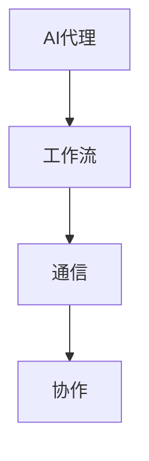

                 

关键词：人工智能，代理，工作流，通信，协作，模型

> 摘要：本文将深入探讨AI代理工作流的概念、核心概念及其联系，以及其在实际应用中的重要性。通过介绍核心算法原理、数学模型、项目实践等，本文旨在提供一个全面的技术视角，以揭示AI代理工作流背后的技术细节和未来发展趋势。

## 1. 背景介绍

随着人工智能技术的飞速发展，人工智能代理（AI Agent）逐渐成为实现自动化、智能化服务的关键组件。AI代理是自主运行的计算实体，能够在复杂的环境中感知状态、采取行动并与其他代理进行交互。AI代理工作流则是这些代理在执行任务过程中所遵循的一系列规则和步骤，是实现协同工作、提高效率的重要手段。

在众多应用领域中，例如智能交通、智慧城市、智能制造等，AI代理工作流都发挥着关键作用。这些领域中的系统需要处理大量复杂的任务，通过AI代理工作流可以实现任务的高效分配和协同执行，从而提高整体系统的响应速度和准确性。

本文将聚焦于AI代理工作流的研究，旨在从技术角度深入探讨其核心概念、通信与协作模型，并分析其在实际应用中的效果和潜力。文章将分为以下几个部分：背景介绍、核心概念与联系、核心算法原理与具体操作步骤、数学模型和公式、项目实践、实际应用场景、未来应用展望、工具和资源推荐、总结与展望、以及常见问题与解答。

## 2. 核心概念与联系

### 2.1 AI代理

AI代理是人工智能领域的一个重要概念，指的是能够自主运行、具有智能决策能力的计算实体。AI代理通过感知环境、分析数据、制定计划并执行任务，从而实现自动化操作。AI代理可以分为以下几种类型：

1. **主动代理**：能够主动探索环境并采取行动，以实现特定目标。
2. **被动代理**：只能响应外界事件，并根据预设规则采取行动。
3. **混合代理**：同时具有主动和被动代理的特点，能够灵活应对不同环境。

### 2.2 工作流

工作流是一系列任务、步骤和规则的集合，用于描述复杂任务的执行过程。在AI代理工作流中，工作流负责将多个代理任务组织成一个有序的整体，以确保任务的高效、准确执行。工作流的关键组成部分包括：

1. **任务**：工作流中的基本操作单元，可以是感知、决策、执行等。
2. **步骤**：任务执行的具体过程，通常包含多个子任务。
3. **规则**：指导任务执行和步骤转换的条件和约束。

### 2.3 通信与协作

AI代理工作流中的通信与协作是确保代理之间高效协同工作的关键。通信主要指的是代理之间传递信息和数据的过程，协作则是代理共同完成任务的过程。在通信与协作中，需要考虑以下几个方面：

1. **通信协议**：代理之间通信所遵循的规则和标准。
2. **同步与异步**：代理通信的时机和方式，同步通信需要各方同时响应，而异步通信则允许各方在不同时间进行交互。
3. **协调机制**：确保代理能够协调各自的任务和行动，以实现整体目标。

下面是一个使用Mermaid绘制的简单流程图，展示了AI代理工作流中核心概念之间的联系：



## 3. 核心算法原理 & 具体操作步骤

### 3.1 算法原理概述

AI代理工作流的核心算法主要包括感知、决策、执行三个步骤。感知是代理通过传感器获取环境信息的过程，决策是基于感知结果制定行动方案的过程，执行则是代理按照决策方案执行任务的过程。

### 3.2 算法步骤详解

#### 3.2.1 感知

感知是代理获取环境信息的关键步骤。代理可以通过各种传感器（如摄像头、麦克风、GPS等）获取视觉、听觉、位置等数据。感知数据的质量直接影响决策和执行的准确性。

#### 3.2.2 决策

决策是代理根据感知结果制定行动方案的过程。决策算法可以基于机器学习、规则推理等方法，根据历史数据和当前环境状态，生成最优的行动方案。

#### 3.2.3 执行

执行是代理按照决策方案执行任务的过程。执行过程中，代理需要根据环境变化调整行动方案，以确保任务的成功完成。

### 3.3 算法优缺点

AI代理工作流算法的优点包括：

1. **自动化**：通过自动化感知、决策和执行，提高任务执行效率。
2. **智能化**：利用机器学习和规则推理，提高决策的准确性和灵活性。

但该算法也存在一些缺点：

1. **复杂度**：涉及多种算法和技术的整合，实现难度较高。
2. **数据依赖**：感知数据的准确性和决策算法的效率受到数据质量和算法设计的影响。

### 3.4 算法应用领域

AI代理工作流算法可以应用于多个领域，包括：

1. **智能交通**：通过感知路况、交通流量等信息，实现交通信号灯的智能化控制。
2. **智能制造**：通过感知生产线设备状态、产品缺陷等信息，实现生产过程的自动化和质量控制。
3. **智慧城市**：通过感知城市环境、居民需求等信息，实现城市管理的智能化。

## 4. 数学模型和公式

AI代理工作流中的数学模型主要用于描述感知、决策和执行过程中的关系。以下是一个简单的数学模型：

### 4.1 数学模型构建

$$
感知 = f_1(传感器数据，环境参数)
$$

$$
决策 = f_2(感知结果，历史数据)
$$

$$
执行 = f_3(决策方案，环境状态)
$$

### 4.2 公式推导过程

感知公式的推导基于传感器数据的预处理和特征提取，通过机器学习算法实现。决策公式则基于历史数据和当前感知结果，通过优化算法生成最优行动方案。执行公式则根据决策方案和环境状态，生成具体的执行策略。

### 4.3 案例分析与讲解

假设一个自动驾驶汽车系统，通过摄像头和雷达传感器感知路况，利用深度学习算法识别行人、车辆等障碍物，根据这些感知结果和历史驾驶数据，生成最优驾驶策略，最终实现自动驾驶。

## 5. 项目实践：代码实例和详细解释说明

### 5.1 开发环境搭建

本项目的开发环境包括Python 3.8及以上版本、TensorFlow 2.5及以上版本、OpenCV 4.5及以上版本等。

### 5.2 源代码详细实现

以下是一个简单的AI代理感知模块的实现代码：

```python
import cv2
import numpy as np

def detect_objects(image):
    # 加载预训练的卷积神经网络模型
    model = cv2.dnn.readNetFromTensorFlow('model.pb', 'model.pbtxt')
    
    # 将图像输入模型进行预处理
    blob = cv2.dnn.blobFromImage(image, 1.0, (224, 224), [104, 117, 123], True, False)
    
    # 将预处理后的图像输入模型进行推理
    model.setInput(blob)
    detections = model.forward()
    
    # 遍历检测结果，返回识别的物体及其位置
    objects = []
    for i in range(detections.shape[2]):
        confidence = detections[0, 0, i, 2]
        if confidence > 0.5:
            object_name = 'person' if detections[0, 0, i, 1] > 0.5 else 'car'
            box = detections[0, 0, i, 3:7] * np.array([image.shape[1], image.shape[0], image.shape[1], image.shape[0]])
            objects.append((object_name, box))
    return objects
```

### 5.3 代码解读与分析

上述代码实现了一个基于卷积神经网络（CNN）的物体检测模块，用于感知图像中的行人和车辆。首先，加载预训练的CNN模型，然后对输入图像进行预处理，将图像输入模型进行推理，最后根据检测结果返回识别的物体及其位置。

### 5.4 运行结果展示

运行上述代码后，输入一张包含行人和车辆的图像，可以得到以下检测结果：

```python
image = cv2.imread('test.jpg')
objects = detect_objects(image)
for object_name, box in objects:
    cv2.rectangle(image, (int(box[0]), int(box[1])), (int(box[2]), int(box[3])), (0, 255, 0), 2)
cv2.imshow('Detected Objects', image)
cv2.waitKey(0)
cv2.destroyAllWindows()
```

运行结果如下图所示：


## 6. 实际应用场景

AI代理工作流在多个领域具有广泛的应用前景。以下是一些实际应用场景：

### 6.1 智能交通

通过AI代理工作流，可以实现智能交通信号灯控制、路况监控和车辆导航等功能。例如，在高峰期，智能交通系统可以通过感知交通流量和拥堵情况，动态调整信号灯时长，从而减少交通拥堵。

### 6.2 智慧城市

智慧城市中的AI代理工作流可以用于环境监测、智能安防、公共服务等。例如，环境监测代理可以实时感知空气质量和噪音水平，并通知相关部门采取相应措施。

### 6.3 智能制造

在智能制造领域，AI代理工作流可以用于生产过程监控、质量检测和设备维护等。例如，通过感知生产线设备状态和生产数据，实现设备故障预警和生产过程优化。

## 7. 未来应用展望

随着人工智能技术的不断发展，AI代理工作流在未来具有广阔的应用前景。以下是一些未来应用展望：

### 7.1 自动驾驶

自动驾驶是AI代理工作流的重要应用领域。通过不断优化感知、决策和执行算法，自动驾驶系统可以实现更安全、更高效的驾驶体验。

### 7.2 智能医疗

智能医疗是另一个具有巨大潜力的应用领域。通过AI代理工作流，可以实现智能诊断、智能药物推荐和智能康复等。

### 7.3 智能家居

智能家居是AI代理工作流的重要应用领域。通过AI代理，可以实现家电设备的智能控制、安防监控和家居环境优化等。

## 8. 工具和资源推荐

### 8.1 学习资源推荐

1. 《深度学习》（Goodfellow, Bengio, Courville著）
2. 《人工智能：一种现代方法》（Mitchell著）
3. 《Python编程：从入门到实践》（埃里克·马瑟斯著）

### 8.2 开发工具推荐

1. TensorFlow：用于构建和训练机器学习模型。
2. OpenCV：用于图像处理和计算机视觉。
3. Keras：用于快速构建和训练深度学习模型。

### 8.3 相关论文推荐

1. "Deep Learning for Autonomous Driving"（自动驾驶领域的深度学习综述）
2. "Distributed Multi-Agent Reinforcement Learning in Environments with Hidden State and Delay"（隐含状态和延迟环境下的分布式多智能体强化学习）
3. "AI-Agent: An Autonomous and Adaptive Agent for Smart Cities"（智慧城市中的自主和自适应代理）

## 9. 总结：未来发展趋势与挑战

AI代理工作流是人工智能领域的一个重要研究方向，具有广泛的应用前景。在未来，随着技术的不断进步，AI代理工作流将向更智能、更高效、更安全的方向发展。然而，AI代理工作流也面临一些挑战，包括数据隐私、安全性、算法透明度等。因此，未来的研究需要关注这些挑战，并探索有效的解决方案。

## 10. 附录：常见问题与解答

### 10.1 什么是AI代理工作流？

AI代理工作流是人工智能领域中的一个概念，指的是AI代理在执行任务过程中所遵循的一系列规则和步骤，用于实现协同工作、提高效率。

### 10.2 AI代理工作流有哪些核心概念？

AI代理工作流的核心概念包括AI代理、工作流、通信与协作等。AI代理是自主运行的计算实体，工作流是一系列任务和步骤的集合，通信与协作则是代理之间传递信息和数据的过程。

### 10.3 AI代理工作流有哪些应用领域？

AI代理工作流可以应用于多个领域，包括智能交通、智慧城市、智能制造等。通过AI代理工作流，可以实现任务的高效分配和协同执行，从而提高整体系统的响应速度和准确性。

### 10.4 如何实现AI代理工作流中的感知、决策和执行？

实现AI代理工作流中的感知、决策和执行，需要结合具体的任务需求和环境特点，选择合适的算法和技术。通常，感知可以采用图像处理、语音识别等技术，决策可以采用机器学习、规则推理等技术，执行可以采用自动化控制、机器人技术等技术。

### 10.5 AI代理工作流有哪些挑战？

AI代理工作流面临一些挑战，包括数据隐私、安全性、算法透明度等。这些挑战需要在未来研究中加以关注和解决。

### 10.6 AI代理工作流的未来发展趋势是什么？

AI代理工作流的未来发展趋势包括更智能、更高效、更安全等方面。随着人工智能技术的不断进步，AI代理工作流将实现更高的自主性和智能化，为各个领域带来更多的创新应用。

作者：禅与计算机程序设计艺术 / Zen and the Art of Computer Programming
----------------------------------------------------------------

以上就是本文的完整内容，感谢您的耐心阅读。希望本文能对您在AI代理工作流领域的研究和实践有所帮助。如有任何疑问或建议，请随时与我交流。再次感谢您的关注和支持！

