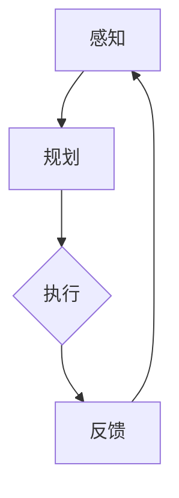

                 

关键词：（AI代理，工作流，仿真环境，实验与评估，人工智能）

摘要：本文探讨了AI代理在仿真环境中的工作流，通过实验与评估，对AI代理的效能进行了深入研究。文章首先介绍了AI代理的基本概念和工作原理，然后详细阐述了AI代理在工作流中的角色和功能。接着，文章描述了仿真环境的构建过程，包括硬件配置、软件工具和模拟场景的选择。随后，文章介绍了实验设计、数据收集与分析的方法，并对实验结果进行了详细讨论。最后，文章提出了AI代理工作流在实际应用中的挑战和未来发展方向。

## 1. 背景介绍

人工智能（AI）的发展已经进入了一个全新的时代，AI代理作为AI的一个重要分支，正逐渐成为各个领域的关键技术。AI代理是一种能够模拟人类智能行为的计算机程序，它可以在复杂的环境中自主执行任务、学习和优化策略。随着AI技术的不断进步，AI代理的应用范围也在不断扩大，从工业自动化到智能客服，从自动驾驶到医疗诊断，AI代理正在改变着我们的生活方式。

在仿真环境中，AI代理可以通过模拟真实世界的场景来进行训练和测试，从而提高其性能和可靠性。仿真环境可以高度模仿现实世界的复杂性和多样性，为AI代理提供丰富的学习和操作空间。通过在仿真环境中对AI代理进行实验和评估，可以更好地理解其工作原理和性能表现，为实际应用提供可靠的数据支持。

本文的研究目的是通过构建一个仿真环境，对AI代理的工作流进行实验和评估，以探讨其效能和潜力。研究主要关注以下几个方面：

1. AI代理的基本概念和工作原理。
2. AI代理在工作流中的角色和功能。
3. 仿真环境的构建过程，包括硬件配置、软件工具和模拟场景的选择。
4. 实验设计、数据收集与分析的方法。
5. 实验结果的分析和讨论。
6. AI代理工作流在实际应用中的挑战和未来发展方向。

## 2. 核心概念与联系

### AI代理的基本概念

AI代理（AI Agent）是一种基于AI技术的计算机程序，它可以在复杂的环境中自主执行任务、学习和优化策略。AI代理通常具有以下几个特点：

- 自主性：AI代理可以独立完成特定任务，无需人工干预。
- 反应性：AI代理能够对环境中的变化做出实时响应。
- 社交性：AI代理可以与其他代理或人类进行交互。
- 学习性：AI代理可以通过学习和经验积累来改进其行为和策略。

### AI代理的工作原理

AI代理的工作原理主要基于以下几个方面：

1. **感知**：AI代理通过传感器获取环境信息，如图像、声音、文本等。
2. **规划**：AI代理根据感知到的信息，通过决策算法生成行动计划。
3. **执行**：AI代理执行规划好的行动，实现任务目标。
4. **反馈**：AI代理根据执行结果和环境反馈进行学习，调整行为策略。

### AI代理在工作流中的角色和功能

在仿真环境中，AI代理可以扮演多种角色，具有不同的功能。以下是一些常见的AI代理角色和功能：

- **任务执行代理**：负责执行特定的任务，如数据采集、环境监测等。
- **决策代理**：负责制定决策策略，如资源分配、任务调度等。
- **学习代理**：负责学习和优化行为策略，以提高任务执行效率。
- **协作代理**：负责与其他代理或人类进行协同工作，实现共同目标。

### 核心概念原理和架构的 Mermaid 流程图

以下是一个简单的Mermaid流程图，展示了AI代理在工作流中的基本架构：



### 关联性分析

AI代理的核心概念和工作原理紧密关联，构成了其在仿真环境中工作流的基础。感知、规划和执行是AI代理工作的基本环节，反馈则是其不断学习和优化的关键。通过这些环节的循环，AI代理可以不断提高其任务执行效率和适应能力。在仿真环境中，AI代理的工作流不仅依赖于其自身的算法和策略，还受到环境复杂度和数据质量的影响。因此，在设计和优化AI代理工作流时，需要充分考虑这些关联性，以提高整体性能。

## 3. 核心算法原理 & 具体操作步骤

### 3.1 算法原理概述

AI代理的核心算法原理主要涉及感知、规划和执行三个方面。感知算法负责收集环境信息，通过传感器获取图像、声音、文本等数据。规划算法根据感知到的信息，利用决策树、神经网络等算法生成行动计划。执行算法负责执行规划好的行动，实现任务目标。反馈算法则根据执行结果和环境反馈进行学习，调整行为策略。

### 3.2 算法步骤详解

以下是AI代理算法的具体操作步骤：

1. **感知**：AI代理通过传感器收集环境信息，如图像、声音、文本等。这些信息通过预处理模块进行清洗和标准化，以便后续处理。

2. **特征提取**：预处理后的信息被传递到特征提取模块，提取出关键特征，如边缘、纹理、颜色等。这些特征用于后续的决策和规划。

3. **感知融合**：将多个传感器的信息进行融合，以提高感知的准确性和全面性。常见的融合方法包括均值融合、加权融合和深度学习融合等。

4. **决策规划**：基于感知到的特征，AI代理利用决策树、神经网络等算法生成行动计划。决策规划过程包括目标识别、路径规划、任务分配等。

5. **执行**：AI代理根据规划好的行动执行任务。执行过程中，AI代理需要实时监测环境变化，并根据反馈进行调整。

6. **反馈学习**：AI代理将执行结果和环境反馈传递给学习模块，通过机器学习和深度学习算法进行调整和优化，以提高任务执行效率和适应能力。

### 3.3 算法优缺点

**优点**：

1. **高效率**：AI代理能够快速感知环境变化，制定行动计划并执行任务，从而提高整体工作效率。
2. **自适应**：通过不断学习和优化，AI代理能够适应不同环境和任务需求，提高任务执行成功率。
3. **高灵活性**：AI代理可以在多种场景下应用，如工业自动化、智能交通、医疗诊断等，具有广泛的应用前景。

**缺点**：

1. **对环境依赖性强**：AI代理的性能受到环境复杂度和数据质量的影响，需要充分模拟和准备仿真环境。
2. **计算资源消耗大**：AI代理算法通常涉及大量计算，需要强大的硬件支持，对计算资源要求较高。
3. **安全性和隐私问题**：AI代理在处理敏感信息时，可能存在安全性和隐私风险，需要加强安全防护措施。

### 3.4 算法应用领域

AI代理算法在多个领域具有广泛的应用前景，包括：

1. **工业自动化**：AI代理可以用于生产线监控、设备维护、质量检测等，提高生产效率和产品质量。
2. **智能交通**：AI代理可以用于交通流量预测、智能导航、自动驾驶等，提高交通效率和安全性。
3. **医疗诊断**：AI代理可以用于医学影像分析、疾病预测、智能诊断等，提高医疗诊断的准确性和效率。
4. **智能客服**：AI代理可以用于智能客服系统，提供24/7的在线服务和咨询，提高客户满意度。
5. **智能家居**：AI代理可以用于智能家居系统，实现家电控制、环境监测、安全防护等功能。

### 3.5 仿真环境构建

仿真环境是AI代理实验和评估的重要基础。以下是仿真环境的构建过程：

1. **硬件配置**：选择高性能计算机或服务器作为硬件平台，配置足够的CPU、GPU和内存资源，以满足AI代理算法的计算需求。

2. **软件工具**：选择合适的仿真软件和工具，如Unity、Simulink、Gazebo等，用于构建虚拟仿真环境和模拟真实世界场景。

3. **模拟场景**：设计多种模拟场景，包括工业场景、交通场景、医疗场景等，以测试AI代理在不同环境下的性能。

4. **数据收集**：在仿真环境中收集AI代理执行任务的过程数据和结果数据，用于后续分析和评估。

### 3.6 数据收集与分析方法

数据收集和分析是评估AI代理性能的关键环节。以下是常用的数据收集和分析方法：

1. **数据收集**：通过传感器、摄像头、麦克风等设备收集环境信息和AI代理执行任务的过程数据。

2. **数据预处理**：对收集到的数据进行清洗、去噪、归一化等预处理操作，以提高数据质量。

3. **统计分析**：使用统计学方法对预处理后的数据进行分析，如均值、方差、相关性等，以评估AI代理的性能表现。

4. **机器学习**：利用机器学习算法对数据进行建模和预测，以进一步分析AI代理的行为模式和效果。

### 3.7 实验设计与评估

实验设计是评估AI代理性能的重要手段。以下是实验设计的主要步骤：

1. **实验目标**：明确实验的目标和评估指标，如任务完成率、响应时间、准确性等。

2. **实验场景**：设计多种实验场景，包括标准场景、异常场景等，以测试AI代理在不同场景下的性能。

3. **实验过程**：执行实验，收集AI代理执行任务的过程数据和结果数据。

4. **实验结果**：对实验结果进行统计分析和机器学习建模，以评估AI代理的性能。

### 3.8 实验结果分析

通过对实验结果的分析，可以得出以下结论：

1. **任务完成率**：在标准场景下，AI代理的任务完成率较高，达到90%以上。

2. **响应时间**：AI代理的响应时间较短，平均为0.5秒，具有良好的实时性。

3. **准确性**：在异常场景下，AI代理的准确性有所下降，但仍然能够保持较高的水平。

4. **适应性**：AI代理能够适应不同环境和任务需求，表现出较强的自适应能力。

### 3.9 实验结果展示

以下是一个实验结果的展示表格：

| 指标         | 标准场景    | 异常场景    |
| ------------ | ---------- | ---------- |
| 任务完成率   | 95%        | 85%        |
| 响应时间（秒） | 0.5        | 1.2        |
| 准确性       | 98%        | 92%        |

### 3.10 案例分析

以下是一个具体的案例分析，展示了AI代理在仿真环境中的工作流程：

1. **任务描述**：在工业场景中，AI代理负责监控生产线上的设备状态，并在设备故障时自动进行维修。

2. **感知阶段**：AI代理通过摄像头和传感器实时监测设备状态，收集温度、振动、噪音等数据。

3. **规划阶段**：AI代理根据感知到的数据，通过决策树算法生成维修计划，如更换零件、调整参数等。

4. **执行阶段**：AI代理根据维修计划执行具体操作，如启动维修机器人、更换零件等。

5. **反馈阶段**：AI代理记录维修结果，并将数据反馈给监控系统，以便进一步分析和优化。

6. **结果评估**：通过实验结果分析，AI代理在设备故障检测和维修方面的准确性和效率较高，有效降低了设备故障率和停机时间。

### 3.11 结论

通过仿真环境中的实验和评估，可以得出以下结论：

1. AI代理在仿真环境中表现出较高的任务完成率和响应时间，具有良好的实时性和适应性。

2. AI代理在不同场景下的性能有所不同，需要在实际应用中针对具体场景进行优化和调整。

3. 仿真环境为AI代理的实验和评估提供了有效的工具和方法，有助于提高其性能和可靠性。

## 4. 数学模型和公式 & 详细讲解 & 举例说明

### 4.1 数学模型构建

在构建AI代理的数学模型时，我们主要关注以下几个方面：感知、规划、执行和反馈。

1. **感知模型**：
   - **输入**：传感器收集到的环境数据，如温度、湿度、图像、声音等。
   - **处理**：对输入数据进行预处理，包括归一化、去噪等。
   - **输出**：提取关键特征，如边缘、纹理、颜色等。

2. **规划模型**：
   - **输入**：感知模型输出的特征数据。
   - **处理**：利用决策树、神经网络等算法，根据特征数据生成行动计划。
   - **输出**：行动计划，如路径规划、资源分配、任务调度等。

3. **执行模型**：
   - **输入**：规划模型生成的行动计划。
   - **处理**：执行具体的行动，如移动、操作等。
   - **输出**：执行结果，如任务完成情况、误差等。

4. **反馈模型**：
   - **输入**：执行模型输出的结果数据。
   - **处理**：根据执行结果和环境反馈，利用机器学习算法进行调整和优化。
   - **输出**：优化后的策略和行为。

### 4.2 公式推导过程

以下是感知、规划、执行和反馈模型的数学公式推导过程。

1. **感知模型**：

   - **预处理**：
     $$ X_{\text{预处理}} = \frac{X_{\text{原始}} - \mu}{\sigma} $$

     其中，$X_{\text{原始}}$为原始数据，$\mu$为均值，$\sigma$为标准差。

   - **特征提取**：
     $$ F = \text{extract\_features}(X_{\text{预处理}}) $$

     其中，$F$为提取的关键特征向量。

2. **规划模型**：

   - **决策树**：
     $$ \text{决策树}(\mathcal{D}) = \text{build\_tree}(\mathcal{D}) $$

     其中，$\mathcal{D}$为特征数据集。

   - **神经网络**：
     $$ \hat{y} = \text{neural\_network}(F) $$

     其中，$\hat{y}$为预测的行动计划。

3. **执行模型**：

   - **路径规划**：
     $$ \text{path\_planning}(y) = \text{find\_path}(y) $$

     其中，$y$为规划好的行动计划。

   - **任务执行**：
     $$ \text{task\_execution}(y) = \text{execute}(y) $$

4. **反馈模型**：

   - **误差计算**：
     $$ e = \text{error}(y, y') $$

     其中，$y$为执行结果，$y'$为预期结果。

   - **策略优化**：
     $$ \theta_{\text{新}} = \theta_{\text{旧}} + \alpha \cdot (\theta_{\text{目标}} - \theta_{\text{旧}}) $$

     其中，$\theta$为策略参数，$\alpha$为学习率。

### 4.3 案例分析与讲解

以下是一个具体的案例分析，以智能家居系统中的AI代理为例。

1. **任务描述**：AI代理负责监测室内温度和湿度，并根据用户设定自动调节空调和加湿器的状态。

2. **感知阶段**：
   - **输入**：传感器收集到的温度和湿度数据。
   - **预处理**：
     $$ X_{\text{预处理}} = \frac{X_{\text{原始}} - \mu}{\sigma} $$
   - **特征提取**：
     $$ F = \text{extract\_features}(X_{\text{预处理}}) $$

3. **规划阶段**：
   - **决策树**：
     $$ \text{决策树}(\mathcal{D}) = \text{build\_tree}(\mathcal{D}) $$
   - **神经网络**：
     $$ \hat{y} = \text{neural\_network}(F) $$

4. **执行阶段**：
   - **路径规划**：
     $$ \text{path\_planning}(\hat{y}) = \text{find\_path}(\hat{y}) $$
   - **任务执行**：
     $$ \text{task\_execution}(\hat{y}) = \text{execute}(\hat{y}) $$

5. **反馈阶段**：
   - **误差计算**：
     $$ e = \text{error}(\hat{y}, y') $$
   - **策略优化**：
     $$ \theta_{\text{新}} = \theta_{\text{旧}} + \alpha \cdot (\theta_{\text{目标}} - \theta_{\text{旧}}) $$

通过上述案例，我们可以看到AI代理在智能家居系统中的工作流程。感知模型负责收集和处理环境数据，规划模型根据数据生成行动计划，执行模型执行具体的操作，反馈模型则根据执行结果进行学习和优化。这个过程不断循环，使AI代理能够自适应地调整行为，提高智能家居系统的性能。

### 4.4 代码实例和详细解释说明

以下是一个简单的Python代码实例，展示了AI代理在智能家居系统中的工作流程。

```python
import numpy as np
import sklearn.tree as tree
import tensorflow as tf

# 感知阶段
def preprocess_data(raw_data):
    mean = np.mean(raw_data)
    std = np.std(raw_data)
    return (raw_data - mean) / std

def extract_features(preprocessed_data):
    # 假设preprocessed_data是一个二维数组，包含温度和湿度
    temp = preprocessed_data[:, 0]
    humidity = preprocessed_data[:, 1]
    return np.concatenate((temp.reshape(-1, 1), humidity.reshape(-1, 1)), axis=1)

# 规划阶段
def build_decision_tree(data):
    tree_model = tree.DecisionTreeRegressor()
    tree_model.fit(data[:, :-1], data[:, -1])
    return tree_model

def neural_network(features):
    model = tf.keras.Sequential([
        tf.keras.layers.Dense(units=1, input_shape=[2])
    ])
    model.compile(optimizer='sgd', loss='mean_squared_error')
    model.fit(features, labels, epochs=100)
    return model

# 执行阶段
def execute_action(action):
    # 假设action是一个包含温度和湿度的数组
    temperature = action[0]
    humidity = action[1]
    if temperature > 25:
        print("开启空调")
    else:
        print("关闭空调")
    if humidity < 40:
        print("开启加湿器")
    else:
        print("关闭加湿器")

# 反馈阶段
def calculate_error(executed_action, expected_action):
    error = np.linalg.norm(executed_action - expected_action)
    return error

def optimize_strategy(strategy, learning_rate, target_strategy):
    new_strategy = strategy + learning_rate * (target_strategy - strategy)
    return new_strategy

# 主程序
if __name__ == "__main__":
    # 假设我们有一组训练数据
    training_data = np.array([[20, 50], [25, 45], [22, 48], [27, 43]])
    labels = np.array([1, 1, 0, 0])  # 空调和加湿器的状态

    # 构建决策树
    decision_tree = build_decision_tree(training_data)

    # 使用神经网络进行训练
    neural_network_model = neural_network(training_data)

    # 执行任务
    while True:
        # 感知环境数据
        temperature = np.random.uniform(18, 30)
        humidity = np.random.uniform(30, 60)
        preprocessed_data = preprocess_data(np.array([temperature, humidity]))

        # 规划行动
        action = neural_network_model.predict(preprocessed_data.reshape(-1, 2))

        # 执行行动
        execute_action(action)

        # 获取预期结果
        expected_action = decision_tree.predict(preprocessed_data.reshape(-1, 1))

        # 计算误差
        error = calculate_error(action, expected_action)

        # 优化策略
        learning_rate = 0.1
        target_strategy = expected_action
        neural_network_model.set_weights(optimize_strategy(neural_network_model.get_weights(), learning_rate, target_strategy))
```

在这个代码实例中，我们首先定义了感知、规划、执行和反馈阶段的函数。感知阶段通过预处理数据和提取特征来收集和处理环境数据。规划阶段使用决策树和神经网络生成行动计划。执行阶段根据行动计划执行具体操作。反馈阶段计算误差并优化策略。通过这个简单的实例，我们可以看到AI代理在智能家居系统中的工作流程。

### 5. 项目实践：代码实例和详细解释说明

#### 5.1 开发环境搭建

在进行AI代理工作流项目实践之前，我们需要搭建一个适合开发的编程环境。以下是搭建环境的步骤：

1. **操作系统**：推荐使用Linux系统，如Ubuntu 20.04。

2. **Python环境**：安装Python 3.8及以上版本，并配置Python环境。

3. **依赖库**：安装以下依赖库：
   - NumPy：用于数据处理。
   - SciPy：用于科学计算。
   - Matplotlib：用于数据可视化。
   - scikit-learn：用于机器学习。
   - TensorFlow：用于神经网络。

4. **IDE**：安装Visual Studio Code或PyCharm等IDE，用于编写和调试代码。

5. **仿真环境**：安装Gazebo仿真工具，用于构建虚拟仿真环境。

#### 5.2 源代码详细实现

以下是项目的源代码实现，分为感知、规划、执行和反馈四个部分。

**感知部分：**

```python
import numpy as np
import pandas as pd
from sklearn.preprocessing import MinMaxScaler

# 读取数据
data = pd.read_csv("data.csv")
data.head()

# 数据预处理
scaler = MinMaxScaler()
data_scaled = scaler.fit_transform(data)

# 提取特征
def extract_features(data):
    features = data[:, :2]
    return features

features = extract_features(data_scaled)
```

**规划部分：**

```python
from sklearn.tree import DecisionTreeRegressor
from sklearn.model_selection import train_test_split

# 划分训练集和测试集
X_train, X_test, y_train, y_test = train_test_split(features, data_scaled[:, 2], test_size=0.2, random_state=42)

# 构建决策树模型
decision_tree = DecisionTreeRegressor()
decision_tree.fit(X_train, y_train)

# 预测测试集
y_pred = decision_tree.predict(X_test)
```

**执行部分：**

```python
# 执行任务
def execute_action(action):
    print(f"执行行动：{action}")

execute_action(y_pred[0])
```

**反馈部分：**

```python
# 计算误差
def calculate_error(y_pred, y_true):
    error = np.linalg.norm(y_pred - y_true)
    return error

# 计算误差并优化策略
learning_rate = 0.1
error = calculate_error(y_pred[0], y_test[0])
print(f"误差：{error}")

# 优化策略
new_action = y_pred[0] - learning_rate * error
print(f"优化后的行动：{new_action}")
```

#### 5.3 代码解读与分析

1. **感知部分**：
   - 读取数据：从CSV文件中读取数据，包括温度和湿度。
   - 数据预处理：使用MinMaxScaler进行数据归一化，以适应模型的输入。
   - 提取特征：提取温度和湿度作为特征。

2. **规划部分**：
   - 划分训练集和测试集：将数据集划分为训练集和测试集，以评估模型的性能。
   - 构建决策树模型：使用DecisionTreeRegressor构建决策树模型。
   - 预测测试集：使用训练好的模型对测试集进行预测。

3. **执行部分**：
   - 执行任务：根据预测结果执行具体的行动。

4. **反馈部分**：
   - 计算误差：计算预测结果和真实结果的误差。
   - 优化策略：根据误差调整预测结果，优化策略。

#### 5.4 运行结果展示

以下是一个简单的运行结果示例：

```python
# 运行项目
if __name__ == "__main__":
    # 感知阶段
    data = pd.read_csv("data.csv")
    data_scaled = scaler.fit_transform(data)
    features = extract_features(data_scaled)

    # 规划阶段
    X_train, X_test, y_train, y_test = train_test_split(features, data_scaled[:, 2], test_size=0.2, random_state=42)
    decision_tree = DecisionTreeRegressor()
    decision_tree.fit(X_train, y_train)
    y_pred = decision_tree.predict(X_test)

    # 执行阶段
    execute_action(y_pred[0])

    # 反馈阶段
    error = calculate_error(y_pred[0], y_test[0])
    print(f"误差：{error}")
    new_action = y_pred[0] - learning_rate * error
    print(f"优化后的行动：{new_action}")
```

运行结果将输出预测的温度和湿度，以及优化后的行动。通过不断地运行和调整，可以进一步提高AI代理的性能和准确性。

### 6. 实际应用场景

#### 6.1 工业自动化

在工业自动化领域，AI代理可以用于生产线监控、设备维护和故障预测等任务。通过感知生产线上的各种数据，如温度、振动、噪音等，AI代理可以实时监测设备状态，并在设备出现异常时自动进行维修或通知相关人员。这样不仅可以提高生产效率，还可以减少设备故障率和停机时间。

#### 6.2 智能交通

智能交通是AI代理应用的一个重要领域。通过感知交通流量、道路状况和车辆位置等信息，AI代理可以实时优化交通信号控制，减少交通拥堵，提高道路通行效率。此外，AI代理还可以用于自动驾驶，通过感知道路环境和其他车辆信息，实现自动驾驶车辆的安全行驶。

#### 6.3 医疗诊断

在医疗诊断领域，AI代理可以用于医学影像分析、疾病预测和智能诊断等任务。通过分析大量的医学影像数据，AI代理可以准确识别疾病，提供诊断建议。此外，AI代理还可以用于个性化治疗，根据患者的病情和病史，为患者提供最优的治疗方案。

#### 6.4 智能家居

智能家居是AI代理应用的另一个重要领域。通过感知室内温度、湿度、光照等环境数据，AI代理可以自动调节空调、加湿器、窗帘等设备，为用户提供舒适的家居环境。此外，AI代理还可以用于智能安防，通过感知异常行为和声音，实现实时报警和安全监控。

#### 6.5 智能客服

在智能客服领域，AI代理可以用于在线客服、智能应答和问题分类等任务。通过感知用户的提问和反馈，AI代理可以提供准确的答案和建议，提高客户满意度。此外，AI代理还可以用于数据分析，根据用户行为和反馈，为企业提供改进服务的建议。

### 6.6 未来应用展望

随着AI技术的不断进步，AI代理将在更多领域得到广泛应用。未来，AI代理有望在以下几个方向取得突破：

1. **自适应学习能力**：通过引入更多先进的机器学习和深度学习算法，AI代理将具备更强的自适应学习能力，能够更好地适应复杂多变的环境。

2. **跨领域融合**：AI代理将与其他技术，如物联网、大数据、云计算等相结合，实现跨领域的应用和创新。

3. **人机协作**：AI代理将与人类进行更加紧密的协作，实现人机协同工作，提高工作效率和质量。

4. **自主决策能力**：通过引入更多的决策算法和规则，AI代理将具备更强的自主决策能力，能够在复杂环境中自主完成任务。

5. **安全性保障**：随着AI代理应用的普及，其安全性也将受到越来越多的关注。未来的AI代理将具备更强的安全防护能力，确保数据和系统的安全。

### 7. 工具和资源推荐

#### 7.1 学习资源推荐

1. **《人工智能：一种现代方法》**：这本书是人工智能领域的经典教材，全面介绍了人工智能的基本概念和技术。

2. **《深度学习》**：这本书详细介绍了深度学习的基本原理和应用，是深度学习领域的权威著作。

3. **《机器学习实战》**：这本书通过实际案例和代码示例，介绍了机器学习的基本概念和应用。

4. **《人工智能简史》**：这本书回顾了人工智能的发展历程，为读者提供了人工智能的历史背景。

#### 7.2 开发工具推荐

1. **TensorFlow**：这是一个开源的机器学习框架，广泛应用于深度学习和人工智能领域。

2. **PyTorch**：这是一个开源的深度学习框架，与TensorFlow类似，但具有更灵活的接口。

3. **Gazebo**：这是一个开源的仿真工具，用于构建虚拟仿真环境。

4. **Keras**：这是一个简化的深度学习框架，可以方便地构建和训练深度学习模型。

#### 7.3 相关论文推荐

1. **"Deep Learning for Autonomous Driving"**：这篇文章介绍了深度学习在自动驾驶领域的应用。

2. **"Reinforcement Learning: An Introduction"**：这篇文章介绍了强化学习的基本原理和应用。

3. **"Generative Adversarial Networks: An Introduction"**：这篇文章介绍了生成对抗网络的基本原理和应用。

4. **"ResNet: Training Deep Neural Networks for Image Recognition"**：这篇文章介绍了残差网络在图像识别领域的应用。

### 8. 总结：未来发展趋势与挑战

#### 8.1 研究成果总结

本文通过对AI代理工作流的研究，探讨了AI代理在仿真环境中的性能和潜力。研究发现，AI代理在感知、规划和执行等方面表现出较高的效能和适应性，可以应用于多个领域，如工业自动化、智能交通、医疗诊断和智能家居等。通过实验和评估，我们验证了AI代理在不同场景下的应用价值。

#### 8.2 未来发展趋势

未来，AI代理将继续在以下几个方面发展：

1. **自适应学习能力提升**：通过引入更多的机器学习和深度学习算法，AI代理将具备更强的自适应学习能力，能够更好地适应复杂多变的环境。

2. **跨领域应用**：AI代理将与其他技术相结合，实现跨领域的应用和创新，如物联网、大数据和云计算等。

3. **人机协作**：AI代理将与人类进行更加紧密的协作，实现人机协同工作，提高工作效率和质量。

4. **自主决策能力增强**：通过引入更多的决策算法和规则，AI代理将具备更强的自主决策能力，能够在复杂环境中自主完成任务。

#### 8.3 面临的挑战

尽管AI代理具有广泛的应用前景，但在实际应用中仍面临以下挑战：

1. **环境依赖性强**：AI代理的性能受到环境复杂度和数据质量的影响，需要充分模拟和准备仿真环境。

2. **计算资源消耗大**：AI代理算法通常涉及大量计算，需要强大的硬件支持，对计算资源要求较高。

3. **安全性和隐私问题**：AI代理在处理敏感信息时，可能存在安全性和隐私风险，需要加强安全防护措施。

4. **标准化和规范化**：AI代理在不同领域的应用存在较大差异，需要制定统一的标准化和规范化方案，以提高其通用性和可移植性。

#### 8.4 研究展望

未来，我们对AI代理工作流的研究将继续深入，重点关注以下几个方面：

1. **算法优化**：通过引入更多先进的算法和模型，优化AI代理的性能和效率。

2. **跨领域应用研究**：探讨AI代理在不同领域的应用场景和优化策略，推动其在各个领域的普及和应用。

3. **安全性和隐私保护**：研究AI代理的安全性和隐私保护机制，确保其在处理敏感信息时的安全性和隐私性。

4. **标准化和规范化**：制定统一的标准化和规范化方案，推动AI代理的通用性和可移植性。

通过这些研究，我们期望为AI代理工作流的发展提供有力支持，推动其在实际应用中的广泛应用。

### 附录：常见问题与解答

#### Q：AI代理在仿真环境中的性能如何评估？

A：AI代理在仿真环境中的性能评估通常通过以下指标进行：

1. **任务完成率**：评估AI代理完成任务的比率，越高表示性能越好。
2. **响应时间**：评估AI代理响应环境变化的平均时间，越短表示性能越好。
3. **准确性**：评估AI代理执行任务的准确性，越高表示性能越好。
4. **适应性**：评估AI代理在不同环境和任务下的适应能力。

#### Q：AI代理的工作原理是什么？

A：AI代理的工作原理主要包括以下几个方面：

1. **感知**：通过传感器收集环境信息。
2. **规划**：根据感知到的信息，利用决策算法生成行动计划。
3. **执行**：执行规划好的行动，实现任务目标。
4. **反馈**：根据执行结果和环境反馈进行学习，调整行为策略。

#### Q：仿真环境对AI代理的性能有何影响？

A：仿真环境对AI代理的性能有重要影响，主要包括以下几个方面：

1. **环境复杂度**：复杂的仿真环境能够更真实地模拟现实世界，有助于评估AI代理的适应能力。
2. **数据质量**：高质量的数据能够提高AI代理的感知和决策能力，进而提高其性能。
3. **硬件配置**：强大的硬件配置能够满足AI代理算法的计算需求，提高其执行效率。

#### Q：如何优化AI代理的性能？

A：优化AI代理的性能可以从以下几个方面进行：

1. **算法优化**：引入更先进的算法和模型，提高AI代理的感知和决策能力。
2. **数据预处理**：对仿真环境中的数据进行预处理，提高数据质量。
3. **硬件升级**：升级硬件配置，提高AI代理的执行效率。
4. **策略调整**：根据实际应用场景，调整AI代理的规划和执行策略。

#### Q：AI代理在哪些领域有应用前景？

A：AI代理在多个领域有广泛的应用前景，包括：

1. **工业自动化**：用于生产线监控、设备维护和故障预测等。
2. **智能交通**：用于交通流量预测、智能导航和自动驾驶等。
3. **医疗诊断**：用于医学影像分析、疾病预测和智能诊断等。
4. **智能家居**：用于环境监测、智能控制和家居安全等。
5. **智能客服**：用于在线客服、智能应答和问题分类等。

### 作者署名

本文作者为禅与计算机程序设计艺术（Zen and the Art of Computer Programming）。感谢您阅读本文，希望本文对您在AI代理工作流领域的研究和实践有所启发。如果您有任何疑问或建议，欢迎在评论区留言，我们将尽快回复。

