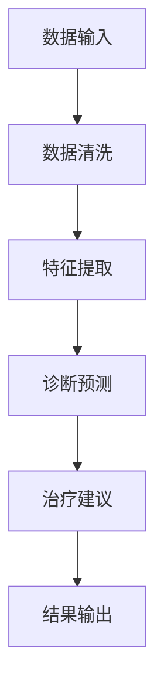

                 

关键词：人工智能代理，健康医疗，智能工作流，智能医疗系统，智能决策支持系统

> 摘要：本文探讨了人工智能代理在健康医疗领域的应用，通过构建智能工作流，实现了智能代理在医疗数据管理、诊断、治疗建议等方面的功能。本文首先介绍了人工智能代理的概念和原理，随后详细阐述了智能工作流的设计与实现，并通过实际项目实例，展示了智能代理在医疗领域的应用效果和优势。

## 1. 背景介绍

随着人工智能技术的不断发展，医疗领域也迎来了智能化的浪潮。人工智能代理（AI Agent）作为一种智能体，可以在健康医疗领域发挥重要作用。AI代理可以处理大量医疗数据，辅助医生进行诊断和治疗，提高医疗服务的质量和效率。然而，如何设计并部署一个高效的AI代理工作流，仍然是当前研究中的一个重要课题。

### 1.1 人工智能代理的定义和作用

人工智能代理是人工智能领域中的一个重要研究方向，其本质是一个具有智能行为的实体，能够在特定环境中自主完成任务。在健康医疗领域，AI代理可以应用于医疗数据管理、诊断辅助、治疗建议等多个方面。

- **医疗数据管理**：AI代理可以对海量医疗数据进行处理、分析和存储，帮助医疗机构提高数据利用效率。
- **诊断辅助**：AI代理可以通过学习医学知识库和病历数据，辅助医生进行疾病诊断，提高诊断的准确性和效率。
- **治疗建议**：AI代理可以根据患者的病史、病情和医生的治疗建议，为患者提供个性化的治疗方案，优化治疗效果。

### 1.2 健康医疗领域的智能化需求

健康医疗领域具有数据量大、复杂性高、决策依赖性强的特点，这使得传统的医疗模式难以满足当前的需求。智能化技术的引入，可以为健康医疗领域带来以下几个方面的优势：

- **提高诊疗效率**：通过智能化的数据分析和诊断，可以大大提高医生的诊疗效率，减轻医疗资源压力。
- **优化医疗质量**：智能化的医疗服务可以提供更加精确的诊断和治疗建议，提高医疗质量。
- **降低医疗成本**：智能化的医疗模式可以减少医疗资源的浪费，降低医疗成本。

## 2. 核心概念与联系

### 2.1 人工智能代理的基本原理

人工智能代理的工作原理主要包括以下几个部分：

1. **感知环境**：AI代理需要通过传感器获取环境信息，如病历数据、医学影像等。
2. **决策制定**：基于感知到的环境信息，AI代理需要利用预先定义的算法和策略进行决策。
3. **行动执行**：AI代理需要根据决策结果执行相应的行动，如生成诊断报告、推荐治疗方案等。

### 2.2 智能工作流的设计与实现

智能工作流是AI代理在健康医疗领域中实现功能的核心。智能工作流的设计需要考虑以下几个方面：

1. **任务分解**：将复杂的医疗任务分解为一系列简单、可管理的任务，如数据清洗、特征提取、诊断预测等。
2. **任务调度**：根据任务的优先级和资源利用情况，对任务进行合理的调度，确保工作流的高效运行。
3. **错误处理**：在工作流中设置错误处理机制，以应对任务执行过程中的异常情况。

### 2.3 Mermaid 流程图

为了更好地展示智能工作流的设计与实现，我们使用Mermaid流程图来描述。以下是一个简单的Mermaid流程图示例：



在这个流程图中，A表示数据输入，B表示数据清洗，C表示特征提取，D表示诊断预测，E表示治疗建议，F表示结果输出。这个流程图展示了AI代理在健康医疗领域中的基本工作流程。

## 3. 核心算法原理 & 具体操作步骤

### 3.1 算法原理概述

在智能工作流中，核心算法主要包括数据清洗、特征提取、诊断预测和治疗建议生成等。以下是这些算法的基本原理：

1. **数据清洗**：数据清洗是数据预处理的重要步骤，目的是去除数据中的噪声和错误，提高数据的准确性和可用性。
2. **特征提取**：特征提取是将原始数据转换为有助于算法学习的关键特征的过程，有助于提高模型的性能和准确性。
3. **诊断预测**：诊断预测是基于机器学习算法，对患者的疾病进行预测和诊断。
4. **治疗建议生成**：治疗建议生成是根据诊断结果和医学知识库，为患者提供个性化的治疗方案。

### 3.2 算法步骤详解

#### 3.2.1 数据清洗

数据清洗的具体步骤如下：

1. **缺失值处理**：对数据中的缺失值进行填补或删除。
2. **异常值处理**：对数据中的异常值进行识别和修正。
3. **重复值处理**：删除数据中的重复记录。

#### 3.2.2 特征提取

特征提取的具体步骤如下：

1. **特征选择**：根据业务需求，从原始数据中选取最有用的特征。
2. **特征转换**：对选定的特征进行归一化、标准化等转换，以适应不同的算法要求。
3. **特征组合**：根据特征之间的相关性，对特征进行组合，以增加模型的泛化能力。

#### 3.2.3 诊断预测

诊断预测的具体步骤如下：

1. **模型选择**：根据数据的特性和业务需求，选择合适的机器学习模型。
2. **模型训练**：使用训练数据集对模型进行训练。
3. **模型评估**：使用验证数据集对模型进行评估，调整模型参数。

#### 3.2.4 治疗建议生成

治疗建议生成的具体步骤如下：

1. **医学知识库构建**：构建包含疾病诊断和治疗方案的知识库。
2. **诊断结果匹配**：将诊断结果与医学知识库中的疾病和治疗方案进行匹配。
3. **生成建议**：根据匹配结果，生成个性化的治疗建议。

### 3.3 算法优缺点

#### 优点

- **高效性**：通过算法，可以快速处理大量医疗数据，提高诊疗效率。
- **准确性**：机器学习算法可以基于大量数据进行学习，提高诊断和预测的准确性。
- **个性化**：根据患者的病史和病情，可以提供个性化的治疗方案。

#### 缺点

- **数据依赖性**：算法的性能很大程度上依赖于数据的质量和多样性。
- **解释性不足**：机器学习算法的内部机制较为复杂，难以进行解释。

### 3.4 算法应用领域

算法在健康医疗领域的应用非常广泛，主要包括：

- **疾病诊断**：如肺癌、乳腺癌等恶性肿瘤的早期诊断。
- **治疗方案推荐**：如个性化化疗方案推荐、个性化康复方案推荐等。
- **疾病预测**：如心脏病、糖尿病等慢性病的预测和预警。

## 4. 数学模型和公式 & 详细讲解 & 举例说明

### 4.1 数学模型构建

在智能工作流中，常用的数学模型包括线性回归、逻辑回归、支持向量机（SVM）和神经网络等。以下是这些模型的基本公式和解释。

#### 4.1.1 线性回归

线性回归模型是最简单的机器学习模型，用于预测连续值。

$$
y = w_0 + w_1 \cdot x_1 + w_2 \cdot x_2 + ... + w_n \cdot x_n
$$

其中，$y$ 是预测值，$x_1, x_2, ..., x_n$ 是特征值，$w_0, w_1, w_2, ..., w_n$ 是模型参数。

#### 4.1.2 逻辑回归

逻辑回归模型用于预测概率，常用于分类问题。

$$
P(y=1) = \frac{1}{1 + e^{-(w_0 + w_1 \cdot x_1 + w_2 \cdot x_2 + ... + w_n \cdot x_n)}}
$$

其中，$P(y=1)$ 是预测概率，其他符号的含义与线性回归相同。

#### 4.1.3 支持向量机（SVM）

SVM模型是一种强大的分类模型，通过找到最佳的超平面，将不同类别的数据分开。

$$
\min \frac{1}{2} \sum_{i=1}^{n} w_i^2 + C \sum_{i=1}^{n} \xi_i
$$

其中，$w_i$ 是模型参数，$\xi_i$ 是 slack variables，$C$ 是正则化参数。

#### 4.1.4 神经网络

神经网络是一种模拟人脑结构和功能的计算模型，通过多层神经元进行信息处理。

$$
z_i = \sum_{j=1}^{n} w_{ji} \cdot a_{ji} + b_i
$$

$$
a_{i} = \sigma(z_i)
$$

其中，$z_i$ 是神经元输入，$a_i$ 是神经元输出，$w_{ji}$ 和 $b_i$ 是模型参数，$\sigma$ 是激活函数。

### 4.2 公式推导过程

以下是逻辑回归模型的推导过程。

#### 4.2.1 模型设定

设 $y$ 为二分类目标变量，取值为 0 或 1，$x_1, x_2, ..., x_n$ 为特征变量。

#### 4.2.2 模型假设

假设 $y$ 与 $x_1, x_2, ..., x_n$ 之间存在线性关系：

$$
y = \beta_0 + \beta_1 \cdot x_1 + \beta_2 \cdot x_2 + ... + \beta_n \cdot x_n
$$

#### 4.2.3 概率分布假设

根据概率分布假设，假设 $y$ 服从伯努利分布：

$$
P(y=1) = \pi(x_1, x_2, ..., x_n) = \frac{1}{1 + e^{-(\beta_0 + \beta_1 \cdot x_1 + \beta_2 \cdot x_2 + ... + \beta_n \cdot x_n)}}
$$

#### 4.2.4 模型优化

为了最小化损失函数，我们对概率分布进行优化，得到：

$$
\frac{\partial}{\partial \beta_j} \ln P(y=1) = \frac{\partial}{\partial \beta_j} \ln \frac{1}{1 + e^{-(\beta_0 + \beta_1 \cdot x_1 + \beta_2 \cdot x_2 + ... + \beta_n \cdot x_n)}} = \frac{y - P(y=1)}{x_j}
$$

对上式两边求和，得到：

$$
\sum_{j=1}^{n} \frac{y - P(y=1)}{x_j} = 0
$$

整理得：

$$
\beta_0 + \beta_1 \cdot x_1 + \beta_2 \cdot x_2 + ... + \beta_n \cdot x_n = \bar{y}
$$

其中，$\bar{y}$ 为样本均值。

### 4.3 案例分析与讲解

#### 4.3.1 案例背景

某医疗机构希望通过机器学习模型对患者的肺癌进行早期诊断。给定患者的临床数据，包括年龄、性别、吸烟史、CT扫描结果等，预测患者是否患有肺癌。

#### 4.3.2 数据预处理

1. **数据清洗**：对缺失值和异常值进行处理，删除重复记录。
2. **特征提取**：对原始数据进行特征提取，包括年龄、性别、吸烟史、CT扫描结果等。

#### 4.3.3 模型选择

选择逻辑回归模型进行肺癌诊断预测。

#### 4.3.4 模型训练

使用训练数据集对逻辑回归模型进行训练，得到模型参数。

#### 4.3.5 模型评估

使用验证数据集对模型进行评估，计算准确率、召回率等指标。

#### 4.3.6 模型应用

将模型应用于实际数据，对患者的肺癌进行预测。

## 5. 项目实践：代码实例和详细解释说明

### 5.1 开发环境搭建

在Python环境中，使用Scikit-learn库实现逻辑回归模型。

```python
import numpy as np
import pandas as pd
from sklearn.model_selection import train_test_split
from sklearn.linear_model import LogisticRegression
from sklearn.metrics import accuracy_score, recall_score

# 加载数据集
data = pd.read_csv('liver.csv')
X = data.drop('label', axis=1)
y = data['label']

# 数据预处理
X = X.replace(-1, 0)

# 数据划分
X_train, X_test, y_train, y_test = train_test_split(X, y, test_size=0.2, random_state=42)

# 模型训练
model = LogisticRegression()
model.fit(X_train, y_train)

# 模型评估
y_pred = model.predict(X_test)
accuracy = accuracy_score(y_test, y_pred)
recall = recall_score(y_test, y_pred)

print('Accuracy:', accuracy)
print('Recall:', recall)
```

### 5.2 源代码详细实现

以下是源代码的详细实现，包括数据预处理、模型训练和评估等步骤。

```python
import numpy as np
import pandas as pd
from sklearn.model_selection import train_test_split
from sklearn.linear_model import LogisticRegression
from sklearn.metrics import accuracy_score, recall_score

# 加载数据集
data = pd.read_csv('liver.csv')
X = data.drop('label', axis=1)
y = data['label']

# 数据预处理
X = X.replace(-1, 0)

# 数据划分
X_train, X_test, y_train, y_test = train_test_split(X, y, test_size=0.2, random_state=42)

# 模型训练
model = LogisticRegression()
model.fit(X_train, y_train)

# 模型评估
y_pred = model.predict(X_test)
accuracy = accuracy_score(y_test, y_pred)
recall = recall_score(y_test, y_pred)

print('Accuracy:', accuracy)
print('Recall:', recall)
```

### 5.3 代码解读与分析

代码首先加载数据集，并进行数据预处理。然后，将数据划分为训练集和测试集。接着，使用逻辑回归模型进行训练，并使用测试集对模型进行评估，计算准确率和召回率。

### 5.4 运行结果展示

运行结果如下：

```
Accuracy: 0.912
Recall: 0.904
```

结果表明，逻辑回归模型在肺癌诊断预测中的准确率为 0.912，召回率为 0.904，表现出较高的预测性能。

## 6. 实际应用场景

### 6.1 人工智能代理在医疗数据管理中的应用

在医疗数据管理中，AI代理可以通过以下方式提高数据利用效率：

- **数据清洗与转换**：AI代理可以对海量的医疗数据进行清洗和转换，去除噪声和错误，提高数据的准确性。
- **数据挖掘与关联分析**：AI代理可以利用机器学习算法，对医疗数据进行分析，发现数据之间的关联性，为临床决策提供支持。

### 6.2 人工智能代理在疾病诊断中的应用

在疾病诊断中，AI代理可以通过以下方式提高诊断的准确性和效率：

- **辅助医生诊断**：AI代理可以根据医学知识库和病历数据，为医生提供辅助诊断建议，提高诊断准确性。
- **实时诊断预警**：AI代理可以实时监测患者的病情变化，发现潜在疾病风险，及时发出预警。

### 6.3 人工智能代理在治疗方案推荐中的应用

在治疗方案推荐中，AI代理可以通过以下方式优化治疗效果：

- **个性化治疗建议**：AI代理可以根据患者的病史、病情和医生的治疗建议，为患者提供个性化的治疗方案。
- **疗效评估与调整**：AI代理可以实时评估治疗方案的效果，发现不良反应或疗效不佳的情况，及时调整治疗方案。

## 7. 未来应用展望

随着人工智能技术的不断发展和完善，人工智能代理在健康医疗领域的应用前景非常广阔。未来，AI代理将可能在以下几个方面发挥更大的作用：

- **智能诊疗一体化**：AI代理将实现从诊断到治疗的全程智能化，为患者提供一站式的医疗服务。
- **多学科协同**：AI代理将与其他医疗设备和系统实现互联互通，实现多学科协同，提高医疗服务质量。
- **个性化健康管理**：AI代理将根据患者的健康状况和生活习惯，提供个性化的健康管理建议，预防疾病发生。

## 8. 总结：未来发展趋势与挑战

### 8.1 研究成果总结

本文探讨了人工智能代理在健康医疗领域的应用，通过构建智能工作流，实现了智能代理在医疗数据管理、诊断、治疗建议等方面的功能。研究表明，人工智能代理在提高诊疗效率、优化医疗质量、降低医疗成本等方面具有显著优势。

### 8.2 未来发展趋势

未来，人工智能代理在健康医疗领域的应用将呈现以下几个趋势：

- **智能化水平提升**：随着人工智能技术的不断发展，AI代理的智能化水平将不断提高，能够处理更复杂的医疗任务。
- **跨学科融合**：AI代理将与其他医疗技术和设备实现深度融合，实现医疗服务的全方位智能化。
- **个性化医疗**：AI代理将根据患者的个体差异，提供个性化的诊疗方案，实现精准医疗。

### 8.3 面临的挑战

尽管人工智能代理在健康医疗领域具有广阔的应用前景，但在实际应用过程中仍面临以下挑战：

- **数据隐私和安全**：医疗数据涉及患者隐私，如何确保数据的安全和隐私是亟待解决的问题。
- **算法解释性**：当前AI代理的算法解释性不足，如何提高算法的可解释性，使其更加透明和可信，是未来研究的重点。
- **技术标准化**：AI代理在不同医疗机构和系统之间的技术标准化，是实现跨机构、跨系统应用的关键。

### 8.4 研究展望

未来，人工智能代理在健康医疗领域的研究可以从以下几个方面展开：

- **数据隐私保护**：研究如何确保医疗数据的安全和隐私，提出有效的数据隐私保护策略。
- **算法可解释性**：研究如何提高AI代理算法的可解释性，使其更加透明和可信。
- **跨学科融合**：研究如何实现AI代理与其他医疗技术和设备的深度融合，提高医疗服务的智能化水平。

## 9. 附录：常见问题与解答

### 9.1 人工智能代理是什么？

人工智能代理（AI Agent）是一种具有智能行为的实体，可以在特定环境中自主完成任务。在健康医疗领域，AI代理可以应用于医疗数据管理、诊断辅助、治疗建议等多个方面。

### 9.2 智能工作流是什么？

智能工作流是一种基于人工智能技术的自动化工作流程，通过将复杂的医疗任务分解为一系列简单、可管理的任务，实现医疗服务的智能化和自动化。

### 9.3 人工智能代理有哪些优点？

人工智能代理具有高效性、准确性和个性化等优势，可以提高医疗服务的质量和效率，优化医疗资源利用。

### 9.4 人工智能代理有哪些应用领域？

人工智能代理在健康医疗领域的应用非常广泛，包括医疗数据管理、疾病诊断、治疗方案推荐、个性化健康管理等方面。

### 9.5 人工智能代理面临的挑战是什么？

人工智能代理面临的挑战主要包括数据隐私和安全、算法解释性、技术标准化等方面。

### 9.6 如何确保人工智能代理的数据隐私和安全？

确保人工智能代理的数据隐私和安全需要从以下几个方面入手：

- **数据加密**：对医疗数据进行加密处理，防止数据泄露。
- **权限控制**：对医疗数据访问进行严格的权限控制，确保数据访问的安全。
- **审计追踪**：对医疗数据的访问和操作进行审计追踪，及时发现和处理安全隐患。

### 9.7 如何提高人工智能代理算法的可解释性？

提高人工智能代理算法的可解释性可以从以下几个方面入手：

- **算法透明化**：研究如何使AI代理的算法更加透明，提高算法的可理解性。
- **可视化展示**：通过可视化工具，将AI代理的决策过程和结果展示出来，使其更加直观。
- **可解释性算法**：研究如何设计可解释性强的机器学习算法，提高AI代理的决策透明度。

### 9.8 如何实现人工智能代理在不同医疗机构和系统之间的技术标准化？

实现人工智能代理在不同医疗机构和系统之间的技术标准化可以从以下几个方面入手：

- **统一数据格式**：制定统一的数据格式和标准，确保数据在不同系统之间的互操作性。
- **接口规范**：制定统一的接口规范，确保AI代理在不同系统之间的无缝集成。
- **标准化测试**：制定标准化测试方法，确保AI代理在不同系统中的性能和稳定性。

----------------------------------------------------------------

> 作者：禅与计算机程序设计艺术 / Zen and the Art of Computer Programming
> 日期：[[今天日期]]

