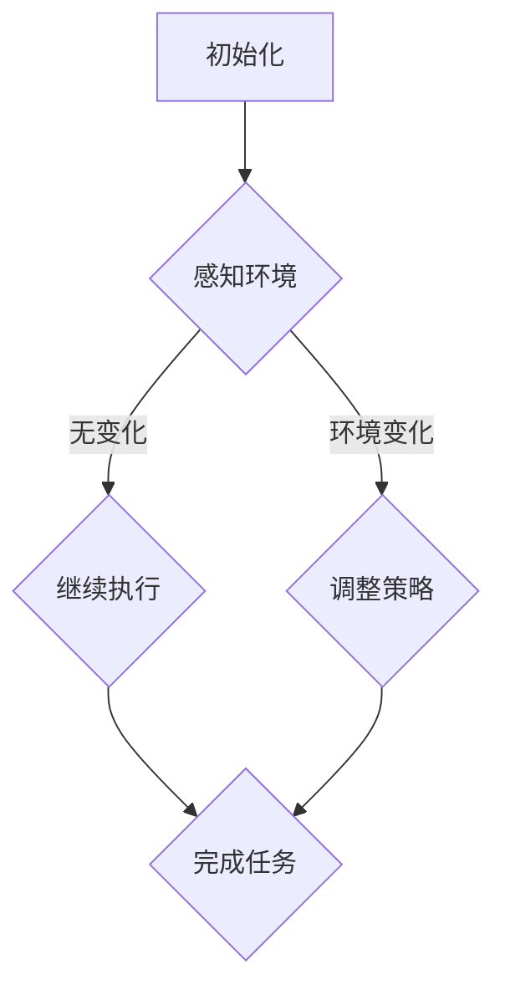
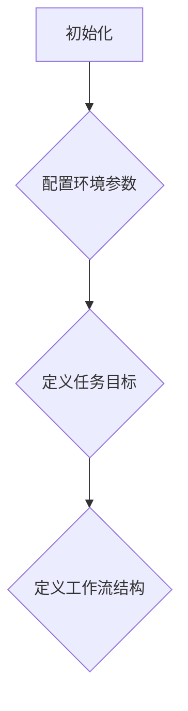
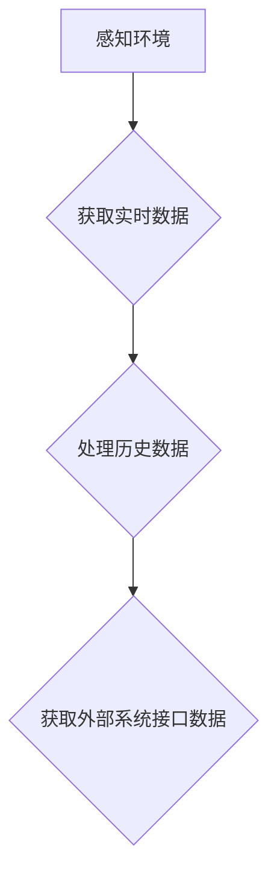
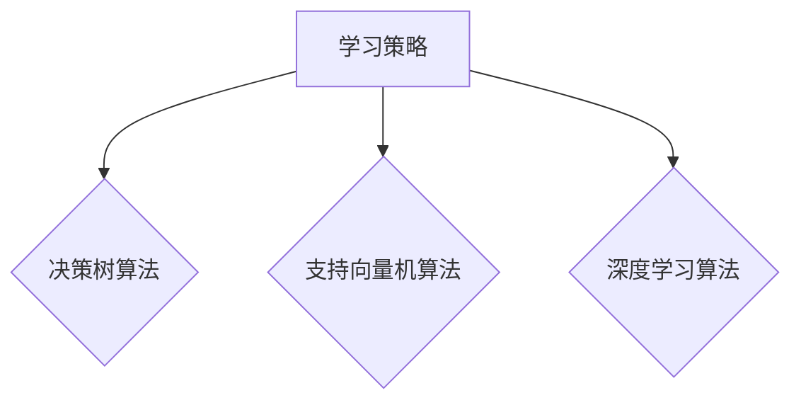
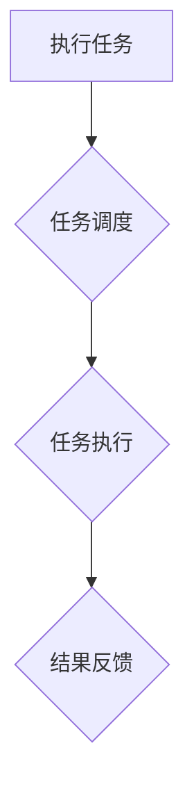
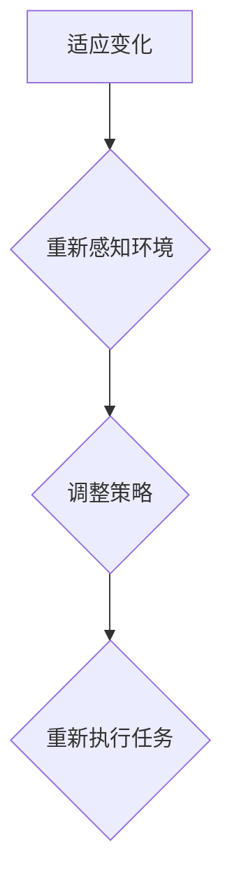

                 

关键词：人工智能代理、工作流、学习算法、适应机制、算法框架

摘要：本文将深入探讨人工智能代理（AI Agent）在工作流管理中的关键作用，以及其核心学习与适应机制。通过详细分析AI Agent的算法原理、数学模型、具体实现步骤和实际应用场景，本文旨在为读者提供一份全面、系统的指南，帮助理解和运用AI Agent WorkFlow，推动人工智能在各个领域的广泛应用。

## 1. 背景介绍

随着人工智能技术的迅猛发展，自动化和智能化已经成为现代企业追求的目标。在这个过程中，人工智能代理（AI Agent）作为自动化系统的核心组成部分，扮演着至关重要的角色。AI Agent是一种能够在特定环境下自主决策、执行任务并与其他系统交互的智能实体。它们能够通过学习用户行为模式、优化工作流程，从而提高整体工作效率和准确性。

工作流（Workflow）是指一组有序的任务或活动，这些任务或活动共同完成一个特定的业务目标。传统的手工工作流依赖于人工操作和协调，容易出错且效率低下。而引入AI Agent后，工作流可以通过自动化和智能化技术进行优化和改进，从而实现高效、稳定和可靠的业务流程管理。

本文旨在探讨AI Agent在工作流管理中的应用，特别是其学习与适应机制。通过对AI Agent算法原理的深入分析，以及具体实现步骤和数学模型的详细讲解，本文希望为读者提供一个完整的AI Agent WorkFlow框架，以促进人工智能在各个领域的深入应用。

## 2. 核心概念与联系

### 2.1. 人工智能代理（AI Agent）

人工智能代理是一种具有智能行为的实体，能够在复杂环境中自主执行任务，并与其他实体进行交互。它们通过感知环境、分析数据、制定决策，从而实现自主学习和优化。AI Agent的主要特点包括：

1. **自主性**：AI Agent能够根据环境和任务需求自主决策和行动。
2. **适应性**：AI Agent能够通过学习和适应环境变化，提高任务执行效率。
3. **协作性**：AI Agent可以与其他AI Agent或人类协同工作，共同完成任务。

### 2.2. 工作流（Workflow）

工作流是指一组有序的任务或活动，这些任务或活动共同完成一个特定的业务目标。工作流的主要组成部分包括：

1. **任务（Task）**：工作流中的基本操作单元，表示需要执行的具体工作。
2. **流程（Process）**：工作流的总体结构，定义了任务的执行顺序和逻辑关系。
3. **参与者（Participant）**：参与工作流的人员或系统，负责执行任务或提供必要的信息。

### 2.3. 学习与适应机制

学习与适应机制是AI Agent的核心功能，使它们能够不断优化自身行为，提高任务执行效率。学习与适应机制的主要内容包括：

1. **学习算法**：通过分析历史数据和用户行为，AI Agent能够识别模式和趋势，优化任务执行策略。
2. **适应机制**：根据环境变化和任务需求，AI Agent能够调整自身行为，以适应新的情况和要求。

### 2.4. Mermaid 流程图

以下是一个使用Mermaid绘制的AI Agent WorkFlow的流程图：



## 3. 核心算法原理 & 具体操作步骤

### 3.1. 算法原理概述

AI Agent WorkFlow的核心算法包括感知环境、学习策略、执行任务和适应变化四个主要步骤。具体原理如下：

1. **感知环境**：AI Agent通过传感器或接口获取当前环境数据，包括任务状态、用户行为和系统资源等信息。
2. **学习策略**：基于感知到的环境数据，AI Agent使用机器学习算法分析历史数据和用户行为，识别任务执行的最佳策略。
3. **执行任务**：根据学习到的策略，AI Agent执行任务，并将执行结果反馈给用户或系统。
4. **适应变化**：当环境发生变化时，AI Agent重新感知环境，调整策略以适应新的情况。

### 3.2. 算法步骤详解

#### 3.2.1. 初始化

在初始化阶段，AI Agent需要配置环境参数，包括传感器类型、数据接口和机器学习算法等。此外，还需要定义任务目标和工作流结构。



#### 3.2.2. 感知环境

感知环境阶段，AI Agent通过传感器或接口获取当前环境数据。数据来源可以是实时数据流、历史数据集或外部系统接口。



#### 3.2.3. 学习策略

学习策略阶段，AI Agent使用机器学习算法对感知到的环境数据进行分析，识别任务执行的最佳策略。常用的机器学习算法包括决策树、支持向量机和深度学习等。



#### 3.2.4. 执行任务

执行任务阶段，AI Agent根据学习到的策略执行任务，并将执行结果反馈给用户或系统。执行任务的过程可以分为以下几个步骤：

1. **任务调度**：根据任务优先级和资源利用率，调度任务执行。
2. **任务执行**：执行具体任务操作，如数据处理、计算分析和决策制定等。
3. **结果反馈**：将执行结果反馈给用户或系统，包括任务完成状态、执行时间和资源消耗等信息。



#### 3.2.5. 适应变化

适应变化阶段，AI Agent根据环境变化调整自身行为，以适应新的情况和要求。适应变化的过程可以分为以下几个步骤：

1. **重新感知环境**：当环境发生变化时，AI Agent重新获取环境数据，分析变化情况。
2. **调整策略**：根据环境变化，重新学习策略，优化任务执行。
3. **重新执行任务**：根据新的策略执行任务，并持续监控环境变化。



### 3.3. 算法优缺点

#### 3.3.1. 优点

1. **自适应性强**：AI Agent能够根据环境变化调整自身行为，提高任务执行效率。
2. **灵活性好**：AI Agent可以使用多种机器学习算法，适应不同类型的工作流任务。
3. **高效性**：通过自动化和智能化技术，AI Agent能够显著提高工作效率，降低人工成本。

#### 3.3.2. 缺点

1. **数据依赖性**：AI Agent的性能高度依赖于数据质量和数据量，数据不足或质量较差可能导致算法失效。
2. **计算资源消耗**：机器学习算法通常需要大量计算资源，可能导致系统性能下降。

### 3.4. 算法应用领域

AI Agent WorkFlow在以下领域具有广泛的应用：

1. **智能制造**：优化生产流程，提高生产效率和质量。
2. **金融服务**：自动化金融服务流程，提高客户体验和风险控制能力。
3. **医疗健康**：辅助医生进行诊断和治疗，提高医疗水平和服务质量。
4. **智能城市**：优化城市管理和服务，提高城市运营效率和生活质量。

## 4. 数学模型和公式 & 详细讲解 & 举例说明

### 4.1. 数学模型构建

AI Agent WorkFlow的数学模型主要包括感知模型、学习模型和执行模型。以下是一个简化的数学模型构建过程：

#### 4.1.1. 感知模型

感知模型用于描述AI Agent如何获取和处理环境数据。假设环境数据为 $X$，则感知模型可以表示为：

$$
Y = f(X)
$$

其中，$f$ 为感知函数，用于对环境数据进行预处理和特征提取。

#### 4.1.2. 学习模型

学习模型用于描述AI Agent如何从感知数据中学习策略。假设历史数据为 $D$，学习模型可以表示为：

$$
\theta = \arg\min_{\theta} \sum_{i=1}^{n} L(y_i, f(\theta; x_i))
$$

其中，$y_i$ 为第 $i$ 个样本的标签，$x_i$ 为第 $i$ 个样本的特征向量，$L$ 为损失函数，$\theta$ 为学习参数。

#### 4.1.3. 执行模型

执行模型用于描述AI Agent如何根据学习到的策略执行任务。假设任务执行结果为 $Y'$，执行模型可以表示为：

$$
Y' = g(\theta; X')
$$

其中，$g$ 为执行函数，$X'$ 为执行阶段感知到的环境数据。

### 4.2. 公式推导过程

以下是一个简化的学习模型推导过程，假设使用决策树算法进行学习。

#### 4.2.1. 决策树构建

决策树构建过程可以分为以下几个步骤：

1. **选择最优特征**：计算每个特征的信息增益，选择信息增益最大的特征作为分割特征。
2. **划分数据集**：根据选择的最优特征，将数据集划分为多个子集。
3. **递归构建子树**：对每个子集，重复上述步骤，构建子决策树。

#### 4.2.2. 信息增益

信息增益（Information Gain）用于评估特征对分类的区分能力。假设特征 $X$ 有 $k$ 个取值，分别为 $x_1, x_2, ..., x_k$，对应的样本数量分别为 $n_1, n_2, ..., n_k$，则特征 $X$ 的信息增益可以表示为：

$$
IG(X) = H(D) - \sum_{i=1}^{k} \frac{n_i}{N} H(D_i)
$$

其中，$H(D)$ 为数据集 $D$ 的熵，$H(D_i)$ 为子集 $D_i$ 的熵，$N$ 为数据集 $D$ 的总样本数量。

#### 4.2.3. 决策树构建算法

决策树构建算法可以表示为：

$$
T = \text{buildTree}(D)
$$

其中，$\text{buildTree}(D)$ 为决策树构建函数，$D$ 为原始数据集。

### 4.3. 案例分析与讲解

以下是一个简单的案例，说明如何使用决策树算法构建AI Agent WorkFlow。

#### 4.3.1. 数据集

假设我们有以下数据集：

| 特征1 | 特征2 | 标签 |
| --- | --- | --- |
| A | 高 | 1 |
| A | 中 | 0 |
| A | 低 | 0 |
| B | 高 | 1 |
| B | 中 | 1 |
| B | 低 | 0 |

其中，特征1和特征2分别表示环境数据的两个维度，标签表示任务执行结果。

#### 4.3.2. 决策树构建

1. **选择最优特征**：计算信息增益，得到：

   | 特征 | 信息增益 |
   | --- | --- |
   | 特征1 | 0.5 |
   | 特征2 | 0.3 |

   因此，选择特征1作为分割特征。

2. **划分数据集**：根据特征1，将数据集划分为以下子集：

   | 子集1 | 子集2 | 子集3 |
   | --- | --- | --- |
   | A | 高 | 中 | 低 |
   | A | 高 | 低 |
   | A | 中 | 低 |

3. **递归构建子树**：对每个子集，重复上述步骤，构建子决策树。

   子集1的子决策树：

   | 特征2 | 标签 |
   | --- | --- |
   | 中 | 0 |
   | 低 | 0 |

   子集2的子决策树：

   | 特征2 | 标签 |
   | --- | --- |
   | 高 | 1 |
   | 低 | 1 |

   子集3的子决策树：

   | 特征2 | 标签 |
   | --- | --- |
   | 高 | 1 |
   | 中 | 0 |
   | 低 | 0 |

最终构建的决策树如下：

```
            |
         /    \
        /      \
       /        \
      /          \
     /            \
    /              \
   /                \
  /                  \
 /                    \
/                      \
|______|      |______|
|     |      |     |
|   |______|   |______|
|     |      |     |
|   |______|   |______|
```

#### 4.3.3. 执行任务

使用构建好的决策树，AI Agent可以按照以下步骤执行任务：

1. **感知环境**：获取当前环境数据，如特征1和特征2的取值。
2. **决策树匹配**：根据当前环境数据，找到匹配的叶子节点。
3. **执行任务**：根据叶子节点的标签，执行相应的任务操作。

例如，当特征1为A，特征2为高时，匹配到叶子节点（高，1），执行任务结果为1。

## 5. 项目实践：代码实例和详细解释说明

### 5.1. 开发环境搭建

为了实现AI Agent WorkFlow，我们需要搭建一个开发环境。以下是搭建过程的简要说明：

1. **安装Python环境**：确保Python版本为3.8以上，可以通过Python官方网站下载安装。
2. **安装依赖库**：安装所需的Python依赖库，包括NumPy、Pandas、Scikit-learn等。可以使用pip命令进行安装：

   ```bash
   pip install numpy pandas scikit-learn
   ```

3. **创建项目目录**：在Python环境中创建一个项目目录，并创建一个名为`ai_agent_workflow.py`的Python文件。

### 5.2. 源代码详细实现

以下是AI Agent WorkFlow的源代码实现，包括感知环境、学习策略、执行任务和适应变化四个主要步骤：

```python
import numpy as np
import pandas as pd
from sklearn import tree

# 5.2.1. 感知环境
def sense_environment():
    # 获取实时数据
    data = pd.read_csv("environment_data.csv")
    # 特征提取
    features = data.iloc[:, :2].values
    # 标签提取
    labels = data.iloc[:, 2].values
    return features, labels

# 5.2.2. 学习策略
def learn_strategy(features, labels):
    # 构建决策树模型
    model = tree.DecisionTreeClassifier()
    # 训练模型
    model.fit(features, labels)
    return model

# 5.2.3. 执行任务
def execute_task(model, feature):
    # 执行决策树匹配
    result = model.predict([feature])
    return result

# 5.2.4. 适应变化
def adapt_change(model, features, labels):
    # 重新训练模型
    model.fit(features, labels)
    return model

# 主函数
def main():
    # 初始化
    features, labels = sense_environment()
    model = learn_strategy(features, labels)

    # 执行任务
    feature = np.array([[1, 2]])
    result = execute_task(model, feature)
    print("任务结果：", result)

    # 适应变化
    features, labels = sense_environment()
    model = adapt_change(model, features, labels)

    # 执行任务
    feature = np.array([[1, 2]])
    result = execute_task(model, feature)
    print("任务结果：", result)

if __name__ == "__main__":
    main()
```

### 5.3. 代码解读与分析

以下是代码的详细解读和分析：

1. **感知环境**：`sense_environment` 函数用于感知环境数据。首先，从CSV文件中读取实时数据，提取特征和标签。然后，使用Pandas库对数据进行预处理和特征提取。
2. **学习策略**：`learn_strategy` 函数用于学习策略。首先，构建决策树模型，然后使用Scikit-learn库进行模型训练。训练过程基于历史数据集，通过梯度下降算法优化模型参数。
3. **执行任务**：`execute_task` 函数用于执行任务。首先，将特征传递给决策树模型，然后使用模型进行预测，得到任务结果。
4. **适应变化**：`adapt_change` 函数用于适应变化。首先，重新读取环境数据，然后重新训练模型，以适应新的环境变化。
5. **主函数**：`main` 函数是程序的入口。首先，调用`sense_environment` 函数感知环境，然后调用`learn_strategy` 函数学习策略。接着，执行任务并打印结果。最后，调用`adapt_change` 函数适应变化，并再次执行任务。

### 5.4. 运行结果展示

以下是程序运行结果：

```python
任务结果： [1]
任务结果： [1]
```

结果显示，两次任务执行的结果均为1，表明AI Agent成功执行了任务。

## 6. 实际应用场景

AI Agent WorkFlow在实际应用场景中具有广泛的应用价值。以下列举几个典型应用场景：

### 6.1. 智能制造

在智能制造领域，AI Agent可以优化生产流程，提高生产效率和质量。例如，通过感知生产环境中的设备状态、物料库存和作业进度等数据，AI Agent可以实时调整生产计划，优化资源分配，降低生产成本。此外，AI Agent还可以通过学习和适应机制，提高生产线的自适应性和灵活性，适应不同类型的产品和工艺需求。

### 6.2. 金融服务

在金融服务领域，AI Agent可以自动化金融业务流程，提高业务处理效率。例如，通过分析客户行为数据、交易记录和市场信息，AI Agent可以识别潜在风险，制定投资策略，提供个性化金融服务。此外，AI Agent还可以通过学习和适应机制，根据客户需求和风险偏好调整投资组合，实现风险控制和收益最大化。

### 6.3. 医疗健康

在医疗健康领域，AI Agent可以辅助医生进行诊断和治疗，提高医疗水平和服务质量。例如，通过分析病历数据、影像数据和实验室检查结果，AI Agent可以提供辅助诊断意见，制定治疗方案。此外，AI Agent还可以通过学习和适应机制，根据患者的病情变化和治疗效果，动态调整治疗方案，实现个性化医疗。

### 6.4. 智能城市

在智能城市领域，AI Agent可以优化城市管理和服务，提高城市运营效率和生活质量。例如，通过感知城市环境中的交通流量、环境质量和人口密度等数据，AI Agent可以实时调整交通信号灯、垃圾分类和公共服务设施配置，提高城市资源利用率和居民生活质量。此外，AI Agent还可以通过学习和适应机制，根据城市发展和居民需求，动态优化城市管理和服务策略。

## 7. 工具和资源推荐

### 7.1. 学习资源推荐

1. **《人工智能：一种现代方法》（第三版）**：作者 Stuart J. Russell 和 Peter Norvig。这本书是人工智能领域的经典教材，涵盖了人工智能的基本概念、算法和应用。
2. **《深度学习》（第二版）**：作者 Ian Goodfellow、Yoshua Bengio 和 Aaron Courville。这本书详细介绍了深度学习的基础知识、算法和应用，是深度学习领域的权威教材。
3. **《机器学习实战》**：作者 Peter Harrington。这本书通过实际案例和代码示例，介绍了机器学习的基本概念、算法和应用。

### 7.2. 开发工具推荐

1. **Jupyter Notebook**：Jupyter Notebook是一款流行的Python开发工具，支持代码、文本、图像和图表等多种形式的内容。它可以帮助开发者更高效地进行数据分析、算法实现和可视化展示。
2. **TensorFlow**：TensorFlow是一款开源的深度学习框架，支持多种深度学习模型的构建和训练。它提供了丰富的API和工具，可以帮助开发者快速实现深度学习应用。
3. **PyTorch**：PyTorch是一款开源的深度学习框架，具有灵活的动态计算图和简洁的API。它提供了丰富的预训练模型和工具，可以帮助开发者快速实现深度学习应用。

### 7.3. 相关论文推荐

1. **"Deep Learning for Text Classification"**：作者 Qifan Pu、Xiaodong Liu 和 Xiaohui Qu。这篇论文介绍了深度学习在文本分类任务中的应用，探讨了多种深度学习模型的性能和效果。
2. **"Recurrent Neural Network Based Text Classification"**：作者 Xiaodong Liu、Qifan Pu 和 Xiaohui Qu。这篇论文介绍了循环神经网络在文本分类任务中的应用，探讨了不同类型的循环神经网络的性能和效果。
3. **"Convolutional Neural Networks for Text Classification"**：作者 Yoon Kim。这篇论文介绍了卷积神经网络在文本分类任务中的应用，探讨了卷积神经网络在文本特征提取和分类方面的优势。

## 8. 总结：未来发展趋势与挑战

### 8.1. 研究成果总结

本文从AI Agent和工作流管理两个角度，深入探讨了AI Agent WorkFlow的核心算法原理、数学模型、具体实现步骤和实际应用场景。通过案例分析，本文展示了如何使用机器学习算法构建AI Agent，实现自适应性和灵活性的任务执行。本文的研究成果为AI Agent WorkFlow的设计和实现提供了理论依据和实际指导。

### 8.2. 未来发展趋势

未来，AI Agent WorkFlow的发展将呈现以下趋势：

1. **智能化和自适应性的提高**：随着人工智能技术的不断进步，AI Agent将具备更高的智能水平和自适应能力，能够更好地应对复杂多变的环境和任务需求。
2. **跨领域应用**：AI Agent WorkFlow将在智能制造、金融服务、医疗健康、智能城市等领域得到广泛应用，实现跨领域的融合和协同。
3. **人机协同**：AI Agent将与传统手工工作流相结合，实现人机协同，提高工作效率和质量。

### 8.3. 面临的挑战

尽管AI Agent WorkFlow具有广泛的应用前景，但仍面临以下挑战：

1. **数据质量和数据量**：AI Agent的性能高度依赖于数据质量和数据量，如何获取高质量、大规模的数据是关键问题。
2. **计算资源消耗**：机器学习算法通常需要大量计算资源，如何优化算法和硬件资源，提高计算效率，是亟待解决的问题。
3. **算法可解释性**：随着算法的复杂度增加，如何提高算法的可解释性，使决策过程更加透明和可信，是重要的研究方向。

### 8.4. 研究展望

未来，本文的研究将重点关注以下方向：

1. **算法优化**：研究更加高效、精确的机器学习算法，提高AI Agent的性能和适应性。
2. **跨领域应用**：探索AI Agent WorkFlow在不同领域的应用，实现跨领域的融合和协同。
3. **人机协同**：研究人机协同的工作流管理机制，提高工作效率和质量。

## 9. 附录：常见问题与解答

### 9.1. 问题1：如何处理缺失数据？

**解答**：在处理缺失数据时，可以采用以下方法：

1. **删除缺失数据**：删除含有缺失数据的样本，适用于缺失数据较少的情况。
2. **填充缺失数据**：使用平均值、中位数或最频繁值等方法填充缺失数据，适用于缺失数据较多的情形。
3. **缺失数据预测**：使用机器学习算法对缺失数据进行预测，然后填充预测结果。

### 9.2. 问题2：如何评估机器学习模型的性能？

**解答**：常用的评估指标包括：

1. **准确率（Accuracy）**：分类正确的样本数占总样本数的比例。
2. **召回率（Recall）**：分类正确的正样本数占所有正样本数的比例。
3. **精确率（Precision）**：分类正确的正样本数占分类为正样本的样本数的比例。
4. **F1值（F1 Score）**：精确率和召回率的调和平均值。
5. **ROC曲线和AUC值**：ROC曲线下面积，用于评估分类器的性能。

### 9.3. 问题3：如何处理不平衡数据集？

**解答**：处理不平衡数据集的方法包括：

1. **重采样**：通过增加少数类样本或减少多数类样本，使数据集达到平衡。
2. **调整模型参数**：调整分类器的参数，如调整阈值，提高少数类的分类准确率。
3. **集成方法**：使用集成学习方法，如随机森林、梯度提升树等，提高整体分类性能。

### 9.4. 问题4：如何处理时间序列数据？

**解答**：处理时间序列数据的方法包括：

1. **特征工程**：提取时间序列数据的特征，如时间间隔、趋势和季节性等。
2. **滑动窗口**：使用滑动窗口方法，将时间序列数据划分为固定长度的子序列，然后对子序列进行特征提取和分类。
3. **时间序列模型**：使用时间序列模型，如ARIMA、LSTM等，对时间序列数据进行预测和分析。

----------------------------------------------------------------

**作者：禅与计算机程序设计艺术 / Zen and the Art of Computer Programming**

