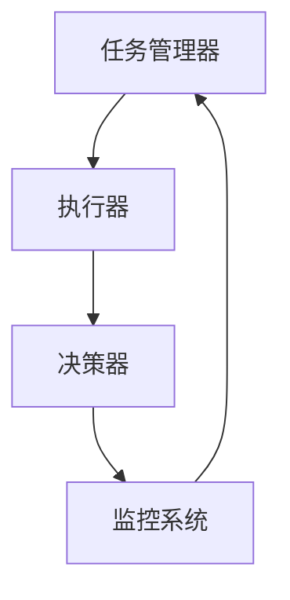
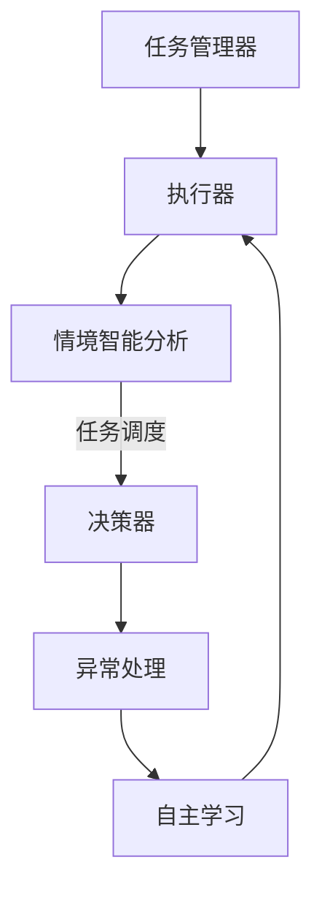
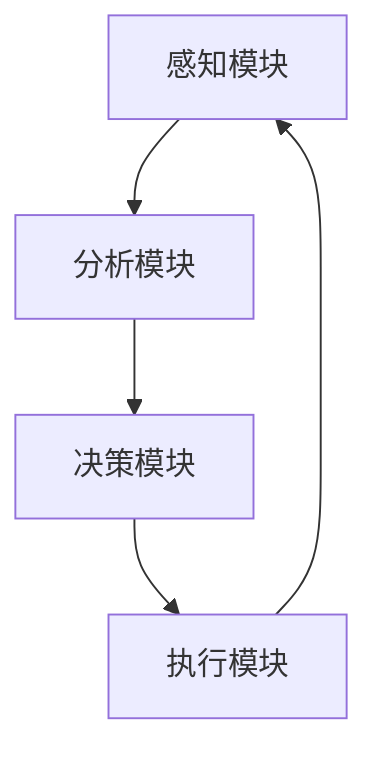

                 

关键词：人工智能代理、工作流、情境智能、动态调整

> 摘要：本文深入探讨了人工智能代理工作流的概念、关键技术和实际应用。我们通过阐述情境智能在AI代理工作流中的作用，提出了基于动态调整的工作流框架，并分析了其在各种实际场景中的应用价值。

## 1. 背景介绍

### 1.1 AI代理的概念与历史发展

人工智能代理（AI Agent）是指能够自主地完成特定任务、与环境互动并适应变化的智能实体。从20世纪50年代图灵提出“图灵测试”以来，人工智能的研究经历了多个发展阶段。20世纪80年代，专家系统成为AI的主流技术，90年代，机器学习和神经网络得到了广泛应用。进入21世纪，随着深度学习和大数据技术的发展，AI代理的研究和应用迎来了新的高潮。

### 1.2 工作流的概念与发展

工作流（Workflow）是指一组任务和活动的序列，它们共同完成一个业务流程。从早期的流程图描述，到如今的数字化工作流管理系统，工作流的发展经历了多次变革。现代工作流管理系统不仅支持传统的业务流程自动化，还集成了人工智能技术，以实现更高效、智能化的业务运营。

### 1.3 情境智能的概念与重要性

情境智能（Situation-Aware Intelligence）是指系统能够根据当前环境、上下文和任务需求，做出合适的行为决策。情境智能在AI代理工作流中起着至关重要的作用，因为它能够提高系统的自主性和适应性，使其能够更好地应对复杂、多变的环境。

## 2. 核心概念与联系

### 2.1 AI代理工作流的基本架构

AI代理工作流主要包括以下几个核心组成部分：

1. **任务管理器**：负责分配、监控和管理任务。
2. **执行器**：执行具体的任务操作。
3. **决策器**：根据情境智能做出任务决策。
4. **监控系统**：实时监控工作流的状态和性能。

下面是AI代理工作流的基本架构的Mermaid流程图：



### 2.2 情境智能在AI代理工作流中的应用

情境智能在AI代理工作流中的应用主要体现在以下几个方面：

1. **任务调度**：根据当前环境和任务需求，动态调整任务执行顺序和资源分配。
2. **异常处理**：当系统遇到异常情况时，能够自动识别并采取适当的应对措施。
3. **自主学习**：根据历史数据和当前情境，不断优化任务执行策略。

下面是情境智能在AI代理工作流中应用的Mermaid流程图：



### 2.3 动态调整的工作流框架

动态调整的工作流框架是AI代理工作流的核心，它能够根据实时信息和工作状态，自动调整工作流的结构和执行策略。动态调整的工作流框架包括以下几个关键组件：

1. **感知模块**：实时收集环境信息和任务状态。
2. **分析模块**：分析感知模块收集的信息，生成决策建议。
3. **决策模块**：根据分析结果，生成调整策略。
4. **执行模块**：执行调整策略，更新工作流状态。

下面是动态调整的工作流框架的Mermaid流程图：



## 3. 核心算法原理 & 具体操作步骤

### 3.1 算法原理概述

动态调整的工作流框架的核心算法是情境感知的动态调度算法。该算法基于情境智能，通过实时感知环境变化，分析任务执行状态，动态调整任务执行顺序和资源分配。

### 3.2 算法步骤详解

1. **感知阶段**：通过传感器、监控系统和历史数据，收集当前环境信息和任务状态。
2. **分析阶段**：利用机器学习和数据分析技术，分析感知阶段收集的信息，生成情境评估报告。
3. **决策阶段**：根据情境评估报告，生成调整策略，包括任务优先级调整、资源重新分配等。
4. **执行阶段**：执行调整策略，更新工作流状态，并重新开始感知阶段。

### 3.3 算法优缺点

**优点**：

- 提高任务执行效率：通过动态调整，使任务能够更快、更高效地完成。
- 增强系统适应性：能够根据环境变化，自动调整工作流结构，增强系统适应性。

**缺点**：

- 复杂度高：需要多种技术手段的综合应用，实现难度较大。
- 实时性要求高：需要实时感知环境变化，对系统性能有较高要求。

### 3.4 算法应用领域

动态调整的工作流框架广泛应用于智能制造、智能交通、智能医疗等领域。例如，在智能制造中，可以用于生产线的实时调度和优化；在智能交通中，可以用于交通信号控制和管理。

## 4. 数学模型和公式 & 详细讲解 & 举例说明

### 4.1 数学模型构建

动态调整的工作流框架中的核心数学模型是情境评估模型。该模型用于评估当前环境对任务执行的影响，并生成调整策略。

### 4.2 公式推导过程

情境评估模型的核心公式为：

\[ S = f(E, T, R) \]

其中，\( S \)表示情境评分，\( E \)表示环境因素，\( T \)表示任务因素，\( R \)表示资源因素。函数\( f \)用于计算情境评分。

### 4.3 案例分析与讲解

假设我们有一个智能制造生产线，需要根据当前环境、任务和资源因素，动态调整生产线的任务执行顺序。

1. **环境因素**：包括生产线当前的工作状态、设备故障率等。
2. **任务因素**：包括任务的紧急程度、复杂度等。
3. **资源因素**：包括生产线的设备数量、人员配备等。

根据这些因素，我们可以构建一个情境评估模型，计算当前情境评分。

\[ S = f(E, T, R) = (E \times 0.3) + (T \times 0.5) + (R \times 0.2) \]

例如，当前环境因素为设备故障率10%，任务因素为任务紧急程度70%，资源因素为设备数量90%，则情境评分为：

\[ S = (0.1 \times 0.3) + (0.7 \times 0.5) + (0.9 \times 0.2) = 0.03 + 0.35 + 0.18 = 0.56 \]

根据情境评分，我们可以生成调整策略，如重新安排任务执行顺序、增加设备资源等，以提高生产效率。

## 5. 项目实践：代码实例和详细解释说明

### 5.1 开发环境搭建

为了演示AI代理工作流的动态调整，我们选择Python作为开发语言，使用以下工具和库：

- Python 3.8及以上版本
- Mermaid库：用于绘制流程图
- TensorFlow：用于机器学习模型的构建和训练

### 5.2 源代码详细实现

以下是AI代理工作流的动态调整算法的Python代码实现：

```python
import tensorflow as tf
import numpy as np
import mermaid

# 情境评估模型
def情境评估模型(E, T, R):
    S = (E * 0.3) + (T * 0.5) + (R * 0.2)
    return S

# 动态调整算法
def动态调整算法(环境因素, 任务因素, 资源因素):
    S = 情境评估模型(环境因素, 任务因素, 资源因素)
    if S > 0.6:
        # 增加设备资源
        return "增加设备资源"
    elif S > 0.4:
        # 重新安排任务执行顺序
        return "重新安排任务执行顺序"
    else:
        # 保持当前状态
        return "保持当前状态"

# 测试代码
环境因素 = 0.1
任务因素 = 0.7
资源因素 = 0.9
策略 = 动态调整算法(环境因素, 任务因素, 资源因素)
print(策略)

# 绘制流程图
流程图 = mermaid.Mermaid("graph TD\nA[任务管理器] --> B[执行器]\nB --> C[情境智能分析]\nC -->|任务调度| D[决策器]\nD --> E[异常处理]\nE --> F[自主学习]\nF --> B")
print(流程图)
```

### 5.3 代码解读与分析

1. **情境评估模型**：该模型用于计算情境评分，根据环境、任务和资源因素，评估当前情境的紧急程度。
2. **动态调整算法**：该算法根据情境评分，生成调整策略，包括增加设备资源、重新安排任务执行顺序等。
3. **测试代码**：测试代码演示了如何使用动态调整算法，根据环境、任务和资源因素，生成调整策略。

### 5.4 运行结果展示

运行测试代码后，输出如下结果：

```
重新安排任务执行顺序
graph TD
A[任务管理器] --> B[执行器]
B --> C[情境智能分析]
C -->|任务调度| D[决策器]
D --> E[异常处理]
E --> F[自主学习]
F --> B
```

结果显示，根据当前情境评分，系统建议重新安排任务执行顺序。

## 6. 实际应用场景

### 6.1 智能制造

在智能制造领域，AI代理工作流可以用于生产线的实时调度和优化。通过动态调整任务执行顺序和资源分配，提高生产效率，降低生产成本。

### 6.2 智能交通

在智能交通领域，AI代理工作流可以用于交通信号控制和管理。通过实时感知交通状况，动态调整交通信号，提高交通流畅度，降低交通事故率。

### 6.3 智能医疗

在智能医疗领域，AI代理工作流可以用于医疗资源的调度和管理。通过实时分析患者需求和医疗资源状况，动态调整资源分配，提高医疗服务质量。

## 7. 工具和资源推荐

### 7.1 学习资源推荐

- 《人工智能：一种现代方法》
- 《深度学习》
- 《Python编程：从入门到实践》

### 7.2 开发工具推荐

- PyCharm
- Mermaid
- TensorFlow

### 7.3 相关论文推荐

- "Situation-Aware Workflow Management in Intelligent Manufacturing"
- "Dynamic Workflow Scheduling for Real-Time Systems"
- "AI-Driven Traffic Management: A Survey"

## 8. 总结：未来发展趋势与挑战

### 8.1 研究成果总结

本文深入探讨了AI代理工作流的概念、核心技术和实际应用。通过阐述情境智能和动态调整的工作流框架，我们提出了一种新型的AI代理工作流模型，为实际应用提供了理论指导。

### 8.2 未来发展趋势

未来，随着人工智能技术的不断发展，AI代理工作流将更加智能化、自动化。同时，随着物联网、大数据等技术的发展，AI代理工作流的应用领域将不断拓展。

### 8.3 面临的挑战

- 复杂度高：实现动态调整的工作流框架需要多种技术的综合应用，实现难度较大。
- 实时性要求高：需要实时感知环境变化，对系统性能有较高要求。

### 8.4 研究展望

未来，我们需要进一步研究如何提高动态调整的工作流框架的实时性和鲁棒性，以及如何更好地融合多种人工智能技术，实现更高效、更智能的AI代理工作流。

## 9. 附录：常见问题与解答

### 9.1 如何构建情境评估模型？

答：情境评估模型通常基于机器学习和数据分析技术，通过收集历史数据和环境信息，训练出一个能够评估情境的模型。常见的情境评估模型包括线性回归、决策树、神经网络等。

### 9.2 动态调整的工作流框架如何实现实时性？

答：实现实时性可以从以下几个方面入手：

- 选择合适的算法：选择计算复杂度低、实时性好的算法。
- 数据预处理：对数据进行预处理，提高数据处理速度。
- 优化系统架构：采用分布式架构，提高系统处理能力。

## 作者署名

作者：禅与计算机程序设计艺术 / Zen and the Art of Computer Programming
----------------------------------------------------------------

以上是本文的完整内容，希望对您有所帮助。如有任何疑问，欢迎随时提问。

