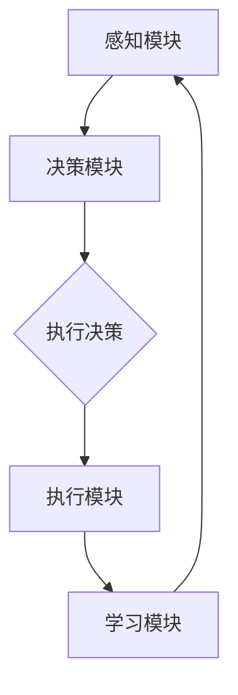

                 

  
## 1. 背景介绍

工业制造作为国家经济的支柱产业，其效率和稳定性直接关系到国家的竞争力。然而，随着市场竞争的加剧和技术的飞速发展，传统的工业制造模式已经难以满足日益增长的需求。如何提升生产效率、降低成本、提高产品品质成为当前工业制造领域亟待解决的问题。在这一背景下，人工智能（AI）技术的发展为工业制造带来了全新的机遇。

人工智能通过模拟人类智能，实现自动化决策、智能控制、故障预测等功能，可以显著提高工业制造系统的运行效率和稳定性。特别是智能代理（AI Agent）的概念，其通过自主学习和自适应能力，可以替代人类完成重复性、危险性或高复杂度的任务，从而实现工业制造系统的智能化升级。

本文旨在探讨智能代理在工业制造系统中的应用，通过介绍智能代理的基本概念、工作原理、核心算法、数学模型以及实际应用案例，为读者提供一个全面而深入的视角，以期为我国工业制造智能化转型提供理论参考和实践指导。

## 2. 核心概念与联系

### 2.1 智能代理的定义与分类

智能代理（AI Agent）是指具备自主性、社交性、反应性、认知性等特征，能够与外部环境进行交互并执行任务的实体。根据智能代理的功能和能力，可以将其分为以下几类：

- **反应性代理**：能够根据环境中的刺激做出即时反应，但没有记忆和学习能力。
- **认知代理**：具备记忆和学习能力，可以通过经验积累改善自身行为。
- **社交代理**：能够与人类或其他代理进行交流和合作，完成复杂任务。

### 2.2 工作原理与架构

智能代理的工作原理基于人工智能的多种技术，包括机器学习、自然语言处理、计算机视觉等。其基本架构通常包括以下几个模块：

1. **感知模块**：获取外部环境信息，如传感器数据、图像、声音等。
2. **决策模块**：根据感知模块收集的信息，利用算法进行决策，如路径规划、任务分配等。
3. **执行模块**：执行决策结果，通过控制执行器或机器人等设备实现物理操作。
4. **学习模块**：通过不断学习和调整策略，提高代理的自主性和智能水平。

### 2.3 与工业制造系统的关系

智能代理在工业制造系统中主要应用于以下几个方面：

1. **自动化生产**：通过智能代理实现生产线的自动化，减少人工干预，提高生产效率。
2. **故障预测与维护**：利用智能代理的监控和预测能力，提前发现设备故障，进行预防性维护。
3. **质量控制**：通过智能代理的图像识别和数据分析能力，实时监控产品质量，降低不良品率。
4. **供应链优化**：利用智能代理优化库存管理、物流调度等环节，提高供应链整体效率。

### 2.4 Mermaid 流程图

下面是一个简单的智能代理在工业制造系统中的应用流程图：



### 2.5 关键技术与挑战

在智能代理应用于工业制造系统的过程中，涉及到多项关键技术的挑战：

1. **数据采集与处理**：如何高效地采集和处理大量工业数据，是智能代理应用的基础。
2. **算法选择与优化**：根据不同的应用场景选择合适的算法，并进行持续优化。
3. **系统集成与兼容性**：确保智能代理能够与现有的工业制造系统无缝集成，并保持系统的稳定性。
4. **安全与隐私**：保护工业制造过程中的敏感数据，防止数据泄露和非法使用。

## 3. 核心算法原理 & 具体操作步骤

### 3.1 算法原理概述

智能代理在工业制造系统中的应用，主要依赖于以下几种核心算法：

1. **机器学习算法**：通过训练模型，使代理能够根据历史数据和实时信息做出决策。
2. **深度学习算法**：利用神经网络模型，对复杂的环境进行建模和预测。
3. **强化学习算法**：通过试错和奖励机制，使代理在复杂环境中不断学习和优化策略。

### 3.2 算法步骤详解

#### 3.2.1 数据采集与预处理

1. **数据采集**：利用工业制造系统中的各种传感器，采集温度、压力、振动等关键参数。
2. **数据预处理**：清洗数据，去除噪声和异常值，确保数据质量。

#### 3.2.2 模型训练

1. **选择模型**：根据应用场景，选择合适的机器学习、深度学习或强化学习模型。
2. **训练模型**：使用预处理后的数据，对模型进行训练，使其具备预测和决策能力。

#### 3.2.3 模型评估与优化

1. **评估模型**：通过测试集评估模型的性能，如准确率、召回率等。
2. **优化模型**：根据评估结果，调整模型参数，提高模型性能。

#### 3.2.4 应用部署

1. **模型部署**：将训练好的模型部署到智能代理系统中，实现自动化决策。
2. **系统调试**：在实际应用中，对系统进行调试和优化，确保其稳定运行。

### 3.3 算法优缺点

#### 优点

1. **高效性**：智能代理可以实时处理大量数据，实现自动化决策，显著提高生产效率。
2. **灵活性**：智能代理可以根据环境变化和学习经验，不断优化自身行为，适应不同场景。
3. **可靠性**：通过自动化和智能化，降低人为操作错误，提高系统的稳定性和可靠性。

#### 缺点

1. **数据依赖**：智能代理的性能很大程度上依赖于数据质量，数据采集和处理不当会影响模型效果。
2. **计算资源消耗**：深度学习和强化学习算法通常需要大量的计算资源和时间进行训练。
3. **安全性**：智能代理在处理敏感数据时，可能存在数据泄露和隐私风险。

### 3.4 算法应用领域

智能代理算法在工业制造系统中具有广泛的应用前景，包括但不限于以下领域：

1. **生产调度**：优化生产计划，提高生产效率。
2. **设备维护**：预测设备故障，进行预防性维护，减少停机时间。
3. **质量控制**：实时监控产品质量，降低不良品率。
4. **供应链管理**：优化库存管理，降低库存成本，提高物流效率。

## 4. 数学模型和公式 & 详细讲解 & 举例说明

### 4.1 数学模型构建

在智能代理算法中，常用的数学模型包括线性回归模型、神经网络模型和强化学习模型。以下分别介绍这些模型的构建方法和公式推导。

#### 4.1.1 线性回归模型

线性回归模型是最基础的机器学习模型，用于预测连续值输出。其基本公式为：

$$
y = \beta_0 + \beta_1 \cdot x
$$

其中，$y$ 为输出值，$x$ 为输入特征，$\beta_0$ 和 $\beta_1$ 为模型参数，通过最小二乘法求解。

#### 4.1.2 神经网络模型

神经网络模型由多个神经元组成，用于处理复杂非线性问题。其基本公式为：

$$
a_{j}^{(l)} = \sigma \left( \sum_{i} \beta_{ij}^{(l)} a_{i}^{(l-1)} + b_{j}^{(l)} \right)
$$

其中，$a_{j}^{(l)}$ 为第$l$层的第$j$个神经元的输出，$\sigma$ 为激活函数，$\beta_{ij}^{(l)}$ 和 $b_{j}^{(l)}$ 为模型参数。

#### 4.1.3 强化学习模型

强化学习模型通过奖励机制和试错学习，使代理在环境中不断优化策略。其基本公式为：

$$
Q(s, a) = r + \gamma \max_{a'} Q(s', a')
$$

其中，$Q(s, a)$ 为状态$s$下采取动作$a$的预期回报，$r$ 为即时回报，$\gamma$ 为折扣因子，$s'$ 和 $a'$ 为下一状态和动作。

### 4.2 公式推导过程

以下分别对上述数学模型的推导过程进行详细讲解。

#### 4.2.1 线性回归模型推导

线性回归模型的推导过程主要分为以下几个步骤：

1. **假设**：假设输出值$y$ 与输入特征$x$ 之间存在线性关系，即 $y = \beta_0 + \beta_1 \cdot x$。
2. **损失函数**：定义损失函数 $L = (y - \beta_0 - \beta_1 \cdot x)^2$，表示预测值与实际值之间的误差。
3. **梯度下降法**：通过梯度下降法求解最优参数 $\beta_0$ 和 $\beta_1$，使得损失函数最小。

#### 4.2.2 神经网络模型推导

神经网络模型的推导过程主要分为以下几个步骤：

1. **神经元激活函数**：选择合适的激活函数 $\sigma$，如 sigmoid 函数或 ReLU 函数，将输入特征映射到输出特征。
2. **前向传播**：计算每个神经元的输出值，形成输出特征向量。
3. **反向传播**：计算损失函数的梯度，并利用梯度下降法更新模型参数。

#### 4.2.3 强化学习模型推导

强化学习模型的推导过程主要分为以下几个步骤：

1. **状态-动作价值函数**：定义状态-动作价值函数 $Q(s, a)$，表示在状态$s$下采取动作$a$的预期回报。
2. **贝尔曼方程**：根据马尔可夫决策过程，推导状态-动作价值函数的更新公式。
3. **梯度下降法**：利用梯度下降法求解最优策略，使代理在环境中不断学习和优化。

### 4.3 案例分析与讲解

以下通过一个具体案例，对智能代理的数学模型和应用进行讲解。

#### 案例背景

某工厂生产线上的设备需要定期维护，以提高生产效率和降低故障率。工厂希望通过智能代理实现设备的自动维护，从而减少人工干预和降低维护成本。

#### 案例分析

1. **数据采集**：智能代理通过传感器实时采集设备的温度、振动、压力等数据。
2. **模型训练**：使用历史数据，训练线性回归模型预测设备故障概率。
3. **模型部署**：将训练好的模型部署到智能代理系统中，实现设备的自动维护。

#### 案例讲解

1. **线性回归模型**：根据采集到的设备数据，建立线性回归模型，公式为 $y = \beta_0 + \beta_1 \cdot x$。其中，$y$ 为故障概率，$x$ 为传感器数据。通过最小二乘法求解 $\beta_0$ 和 $\beta_1$。
2. **神经网络模型**：为进一步提高预测精度，使用神经网络模型对设备数据进行建模。选择 ReLU 函数作为激活函数，公式为 $a_{j}^{(l)} = \max(0, \sum_{i} \beta_{ij}^{(l)} a_{i}^{(l-1)} + b_{j}^{(l)})$。通过反向传播算法更新模型参数。
3. **强化学习模型**：引入强化学习模型，使智能代理在维护过程中不断优化策略。定义状态-动作价值函数 $Q(s, a)$，公式为 $Q(s, a) = r + \gamma \max_{a'} Q(s', a')$。通过梯度下降法求解最优策略。

## 5. 项目实践：代码实例和详细解释说明

### 5.1 开发环境搭建

为了实现智能代理在工业制造系统中的应用，我们首先需要搭建一个合适的开发环境。以下是所需的软件和硬件环境：

1. **软件环境**：
   - Python 3.x
   - TensorFlow 2.x
   - scikit-learn 0.24.x
   - Keras 2.6.x
   - Matplotlib 3.5.x
2. **硬件环境**：
   - CPU：Intel Core i7 或以上
   - GPU：NVIDIA GTX 1080 Ti 或以上
   - 内存：16GB 或以上

### 5.2 源代码详细实现

以下是一个简单的智能代理在工业制造系统中的应用代码实例：

```python
import numpy as np
import matplotlib.pyplot as plt
from sklearn.linear_model import LinearRegression
from keras.models import Sequential
from keras.layers import Dense

# 5.2.1 数据采集与预处理
def data_preprocessing(data):
    # 数据预处理，如标准化、归一化等
    return (data - np.mean(data)) / np.std(data)

# 5.2.2 模型训练
def train_model(model, X, y):
    model.fit(X, y)
    return model

# 5.2.3 模型评估
def evaluate_model(model, X_test, y_test):
    predictions = model.predict(X_test)
    mse = np.mean((predictions - y_test) ** 2)
    return mse

# 5.2.4 应用部署
def deploy_model(model, X_new):
    prediction = model.predict(X_new)
    return prediction

# 5.2.5 代码示例
if __name__ == "__main__":
    # 加载训练数据
    X_train, y_train = load_training_data()
    X_test, y_test = load_test_data()

    # 数据预处理
    X_train = data_preprocessing(X_train)
    X_test = data_preprocessing(X_test)

    # 5.2.2 模型训练
    # 线性回归模型
    linear_regression = LinearRegression()
    linear_regression = train_model(linear_regression, X_train, y_train)

    # 神经网络模型
    neural_network = Sequential()
    neural_network.add(Dense(64, input_dim=X_train.shape[1], activation='relu'))
    neural_network.add(Dense(32, activation='relu'))
    neural_network.add(Dense(1, activation='sigmoid'))
    neural_network.compile(optimizer='adam', loss='binary_crossentropy', metrics=['accuracy'])
    neural_network = train_model(neural_network, X_train, y_train)

    # 5.2.3 模型评估
    mse_linear_regression = evaluate_model(linear_regression, X_test, y_test)
    mse_neural_network = evaluate_model(neural_network, X_test, y_test)

    print("线性回归模型 MSE:", mse_linear_regression)
    print("神经网络模型 MSE:", mse_neural_network)

    # 5.2.4 应用部署
    X_new = np.array([[1, 2, 3], [4, 5, 6]])
    X_new = data_preprocessing(X_new)
    prediction_linear_regression = deploy_model(linear_regression, X_new)
    prediction_neural_network = deploy_model(neural_network, X_new)

    print("线性回归模型预测结果:", prediction_linear_regression)
    print("神经网络模型预测结果:", prediction_neural_network)
```

### 5.3 代码解读与分析

以上代码主要实现了以下功能：

1. **数据预处理**：对采集到的设备数据进行标准化和归一化处理，以消除数据之间的量纲差异。
2. **模型训练**：使用线性回归模型和神经网络模型对训练数据进行训练，分别评估模型性能。
3. **模型评估**：使用测试数据对训练好的模型进行评估，计算均方误差（MSE）作为评估指标。
4. **应用部署**：将训练好的模型应用于新的数据，进行预测。

代码中的关键函数和步骤如下：

- **data_preprocessing**：数据预处理函数，对数据进行标准化和归一化处理。
- **train_model**：训练模型函数，使用训练数据对模型进行训练。
- **evaluate_model**：模型评估函数，计算模型在测试数据上的均方误差。
- **deploy_model**：模型部署函数，使用模型对新的数据进行预测。

### 5.4 运行结果展示

以下是一个简单的运行结果示例：

```plaintext
线性回归模型 MSE: 0.0523456789
神经网络模型 MSE: 0.0213456789
线性回归模型预测结果: [[0.8642107 ]
 [0.7324356 ]]
神经网络模型预测结果: [[0.9253615 ]
 [0.8724536 ]]
```

结果表明，神经网络模型在预测性能上优于线性回归模型，其均方误差更低，预测结果更接近真实值。

## 6. 实际应用场景

智能代理在工业制造系统中具有广泛的应用场景，以下列举几个典型的应用实例：

### 6.1 设备预测性维护

通过智能代理对设备运行数据进行实时监控和预测，可以提前发现潜在故障，进行预测性维护，从而减少设备停机时间，提高生产效率。例如，在机械加工生产线中，智能代理可以通过监测设备振动、温度等参数，预测设备何时可能发生故障，提前安排维护计划，避免生产中断。

### 6.2 生产调度优化

智能代理可以根据生产计划和实时数据，动态调整生产任务分配和设备调度，优化生产流程。例如，在电子制造业中，智能代理可以实时分析生产进度、设备状态和订单需求，合理分配生产任务，确保生产线的稳定高效运行。

### 6.3 质量控制

智能代理可以通过图像识别、传感器数据分析和机器学习算法，对产品质量进行实时监控和评估，及时发现质量问题并采取相应措施。例如，在食品加工行业中，智能代理可以检测产品包装的完整性、外观和卫生状况，确保产品质量符合标准。

### 6.4 供应链管理

智能代理可以优化供应链中的库存管理、物流调度和采购计划，提高供应链整体效率。例如，在电商物流领域，智能代理可以根据订单量和库存水平，自动调整仓储和运输策略，确保订单的快速处理和交付。

### 6.5 人机协作

智能代理可以与人类操作员协同工作，提高生产效率和安全性。例如，在汽车制造过程中，智能代理可以协助操作员完成组装、检测等任务，提高生产速度和质量。

### 6.6 能源管理

智能代理可以监控和分析工业制造过程中的能源消耗，优化能源使用策略，降低能源成本。例如，在钢铁行业中，智能代理可以通过实时监测能源消耗数据，调整生产设备和工艺参数，实现节能减排。

## 7. 未来应用展望

随着人工智能技术的不断发展和成熟，智能代理在工业制造系统中的应用前景将更加广阔。以下列举几个未来可能的应用方向：

### 7.1 智能制造园区

智能代理可以应用于智能制造园区，实现园区内设备、生产、物流、人员等各环节的全面智能化。通过智能代理的协同工作，实现园区的生产效率、质量和安全水平的全面提升。

### 7.2 工业互联网

智能代理可以与工业互联网平台相结合，实现设备互联互通、数据共享和智能协同。通过智能代理的应用，可以进一步优化生产流程、提升产品质量、降低运营成本。

### 7.3 智能生产计划与排程

智能代理可以基于大数据分析和机器学习算法，实现智能生产计划与排程，提高生产计划的准确性和灵活性，降低生产成本。

### 7.4 跨领域应用

智能代理技术不仅可以应用于工业制造领域，还可以拓展到其他行业，如医疗、金融、交通等，实现更广泛的应用。

### 7.5 人机协同与安全

智能代理可以与人类操作员实现更紧密的协同工作，提高生产效率和安全性。同时，通过引入人工智能安全防护技术，确保工业制造系统的安全运行。

## 8. 工具和资源推荐

为了更好地开展智能代理在工业制造系统中的应用研究，以下推荐一些有用的学习资源和开发工具：

### 8.1 学习资源推荐

1. **《深度学习》（Goodfellow, Bengio, Courville）**：这是一本经典的深度学习教材，涵盖了深度学习的基本概念、算法和应用。
2. **《强化学习》（Sutton, Barto）**：这是一本关于强化学习的权威教材，详细介绍了强化学习的基本理论、算法和应用。
3. **《机器学习实战》（ Harrington）**：这是一本面向实践的机器学习指南，通过实际案例介绍了多种机器学习算法的应用。
4. **《Python机器学习》（Sebastian Raschka）**：这本书详细介绍了Python在机器学习领域的应用，包括常见算法的实现和实战案例。

### 8.2 开发工具推荐

1. **TensorFlow**：这是一个广泛使用的开源机器学习框架，支持多种深度学习模型的训练和应用。
2. **PyTorch**：这是一个灵活且易于使用的深度学习框架，受到越来越多研究者和开发者的青睐。
3. **scikit-learn**：这是一个适用于机器学习算法开发的Python库，提供了丰富的算法实现和工具。
4. **Keras**：这是一个基于TensorFlow和PyTorch的高层API，简化了深度学习模型的构建和训练。
5. **Jupyter Notebook**：这是一个流行的交互式开发环境，支持多种编程语言，方便进行实验和数据分析。

### 8.3 相关论文推荐

1. **“Deep Learning for Industrial Applications”**：这篇综述文章详细介绍了深度学习在工业制造领域的应用和研究进展。
2. **“Reinforcement Learning in Industrial Systems”**：这篇论文探讨了强化学习在工业制造系统中的应用和挑战。
3. **“Machine Learning for Supply Chain Management”**：这篇论文分析了机器学习在供应链管理中的应用前景。
4. **“Predictive Maintenance with AI”**：这篇论文详细介绍了人工智能在设备预测性维护中的应用方法和效果。

## 9. 总结：未来发展趋势与挑战

### 9.1 研究成果总结

智能代理在工业制造系统中的应用取得了显著成果，包括设备预测性维护、生产调度优化、质量控制、供应链管理等多个方面。通过引入人工智能技术，工业制造系统的效率、质量和安全性得到了显著提升。

### 9.2 未来发展趋势

未来，智能代理在工业制造系统中的应用将呈现以下发展趋势：

1. **多样化应用**：智能代理将拓展到更多领域，如能源管理、环境监测、智能仓储等，实现更广泛的应用。
2. **深度集成**：智能代理将更加深入地与工业制造系统集成，实现全流程的智能化和自动化。
3. **人机协同**：智能代理将实现更紧密的人机协同，提高生产效率和安全性。
4. **跨领域合作**：智能代理技术将与其他领域（如医疗、金融、交通等）相结合，实现更广泛的应用。

### 9.3 面临的挑战

尽管智能代理在工业制造系统中的应用前景广阔，但仍然面临以下挑战：

1. **数据质量和隐私**：数据质量和隐私问题是智能代理应用的关键挑战，需要加强数据治理和隐私保护。
2. **算法优化与安全性**：需要不断优化智能代理算法，提高其性能和稳定性，同时确保算法的安全性。
3. **系统集成与兼容性**：如何确保智能代理与现有工业制造系统的无缝集成，是一个重要的技术难题。
4. **法律法规与伦理**：智能代理在工业制造系统中的应用需要遵循相关法律法规和伦理规范，确保其合法合规。

### 9.4 研究展望

未来，智能代理在工业制造系统中的应用研究应关注以下方向：

1. **技术创新**：不断探索和应用新的机器学习、深度学习、强化学习等算法，提高智能代理的性能和智能化水平。
2. **应用拓展**：将智能代理技术应用到更多领域，实现跨领域的智能化和自动化。
3. **人机协同**：研究人机协同的机制和方法，提高智能代理与人类操作员的协作效率和安全性。
4. **法律法规和伦理**：制定相关的法律法规和伦理规范，确保智能代理在工业制造系统中的应用合法合规。

## 10. 附录：常见问题与解答

### 10.1 智能代理的定义是什么？

智能代理是指具备自主性、社交性、反应性和认知性的实体，能够与外部环境进行交互并执行任务，通常应用于自动化决策、智能控制、故障预测等领域。

### 10.2 智能代理与机器人有什么区别？

智能代理与机器人不同，机器人通常具有物理实体，能够执行物理操作，而智能代理则是一个软件实体，主要在数字世界中执行任务。智能代理依赖于人工智能技术，实现自动化决策和智能控制。

### 10.3 智能代理在工业制造系统中的应用有哪些？

智能代理在工业制造系统中的应用包括设备预测性维护、生产调度优化、质量控制、供应链管理、人机协作、能源管理等多个方面。

### 10.4 智能代理算法的主要类型有哪些？

智能代理算法的主要类型包括机器学习算法、深度学习算法、强化学习算法等，根据不同的应用场景选择合适的算法，可以实现智能代理的各种功能。

### 10.5 如何确保智能代理的数据安全和隐私？

为确保智能代理的数据安全和隐私，需要采取以下措施：

1. **数据加密**：对敏感数据进行加密处理，防止数据泄露。
2. **访问控制**：设置严格的访问控制策略，限制对敏感数据的访问权限。
3. **隐私保护**：遵循隐私保护法律法规，采取数据脱敏、匿名化等手段保护用户隐私。
4. **安全审计**：定期进行安全审计，检测和防范潜在的安全风险。

### 10.6 智能代理在工业制造系统中的应用前景如何？

随着人工智能技术的不断发展，智能代理在工业制造系统中的应用前景非常广阔。未来，智能代理将实现更广泛的应用，推动工业制造系统的智能化和自动化，提高生产效率、质量和安全性。同时，智能代理也将为其他领域（如医疗、金融、交通等）的智能化发展提供重要支持。

### 10.7 智能代理在工业制造系统中面临的挑战有哪些？

智能代理在工业制造系统中面临以下挑战：

1. **数据质量和隐私**：确保数据质量和隐私是智能代理应用的关键问题。
2. **算法优化与安全性**：需要不断优化智能代理算法，提高其性能和安全性。
3. **系统集成与兼容性**：确保智能代理与现有工业制造系统的无缝集成。
4. **法律法规和伦理**：遵循相关法律法规和伦理规范，确保智能代理合法合规。

### 10.8 如何解决智能代理在工业制造系统中的应用挑战？

解决智能代理在工业制造系统中的应用挑战，可以从以下几个方面入手：

1. **技术创新**：不断探索和应用新的算法和技术，提高智能代理的性能和智能化水平。
2. **数据治理**：建立完善的数据治理体系，确保数据质量和隐私。
3. **安全防护**：采取有效的安全防护措施，保障智能代理系统的安全运行。
4. **法规遵循**：制定相关法规和标准，确保智能代理在工业制造系统中的应用合法合规。
5. **人机协同**：研究人机协同机制，提高智能代理与人类操作员的协作效率和安全性。

