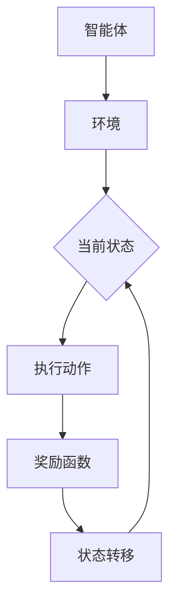

                 

关键词：人工智能、奖励函数、深度学习、算法原理、代码实例、AI应用场景、未来展望

> 摘要：本文将深入探讨AI人工智能中的奖励函数核心算法原理，包括其概念、构建方法、优缺点及实际应用。通过代码实例，我们将详细讲解奖励函数的实现过程，并分析其在深度学习和其他AI领域中的重要作用。文章最后将展望奖励函数在未来的发展趋势与挑战。

## 1. 背景介绍

人工智能（AI）作为计算机科学的一个重要分支，已经广泛应用于各个领域，包括自然语言处理、计算机视觉、机器人技术等。其中，奖励函数作为AI系统中的关键组件，起到了至关重要的作用。奖励函数旨在通过奖励机制来引导AI系统行为，使其朝向人类设定的目标发展。在深度学习领域，奖励函数是实现智能决策、优化行为路径的核心手段。

### 1.1 奖励函数的定义与作用

奖励函数（Reward Function）是一个在强化学习（Reinforcement Learning，简称RL）中使用的函数，用于评估AI系统的行为。它返回一个数值，表示AI系统在执行特定动作后的“好”与“坏”程度。奖励函数的设计直接关系到AI系统的学习效果和最终性能。

奖励函数的主要作用如下：

1. **引导AI行为**：奖励函数通过给予正奖励或负奖励，引导AI系统采取有利于目标达成的行为。
2. **评估性能**：奖励函数用于评估AI系统在不同情况下的性能，帮助系统自我优化。
3. **强化学习**：在强化学习中，奖励函数是核心信号，用于指导AI系统如何通过不断试错来学习最优策略。

### 1.2 强化学习的基本概念

强化学习是一种使机器通过与环境的交互来学习如何完成任务的机器学习方法。其核心概念包括：

1. **智能体（Agent）**：执行动作并接受奖励的实体。
2. **环境（Environment）**：智能体所处的情境，可以看作是一个状态转移函数。
3. **状态（State）**：智能体当前所处的情境描述。
4. **动作（Action）**：智能体可以采取的行为。
5. **策略（Policy）**：智能体在给定状态下的最佳动作选择。
6. **价值函数（Value Function）**：评估智能体在特定状态下采取特定动作的长期收益。
7. **模型（Model）**：对环境的预测模型。

## 2. 核心概念与联系

### 2.1 奖励函数的构建方法

奖励函数的设计取决于具体的任务和环境。以下是几种常见的奖励函数构建方法：

1. **基于目标函数的奖励**：直接根据任务目标设计奖励函数，例如，在机器人路径规划中，将到达终点的时间或路径长度作为奖励。
2. **基于惩罚的奖励**：对于错误或不符合目标的行为给予负奖励，以防止系统过度学习负面行为。
3. **基于状态转移的奖励**：根据智能体在不同状态之间的转移设计奖励，例如，在围棋游戏中，将棋盘状态的改变作为奖励。

### 2.2 奖励函数与价值函数的关系

奖励函数和价值函数密切相关。价值函数用于评估智能体在特定状态下的行为价值，而奖励函数则是价值函数的即时反馈。在强化学习中，价值函数通过奖励函数的积累和更新，逐渐趋向于表示最优策略。

### 2.3 Mermaid 流程图

以下是一个用于解释奖励函数核心概念的 Mermaid 流程图：



## 3. 核心算法原理 & 具体操作步骤

### 3.1 算法原理概述

奖励函数的核心原理是通过奖励信号来引导智能体在环境中采取最优动作。在深度强化学习中，通常使用价值函数来评估动作的价值，并通过经验回放和策略梯度方法来更新策略。

### 3.2 算法步骤详解

1. **初始化**：设置智能体、环境、初始状态和初始策略。
2. **探索与利用**：在早期阶段，智能体会通过随机探索来学习环境，同时利用已有知识来做出决策。
3. **状态评估**：使用价值函数评估当前状态的价值。
4. **动作选择**：根据策略选择当前状态下的最佳动作。
5. **执行动作**：智能体在环境中执行选择出的动作。
6. **获取奖励**：环境根据动作给予智能体奖励。
7. **更新价值函数**：根据新的奖励更新价值函数。
8. **迭代**：重复上述步骤，直到达到预定的训练目标或智能体已经足够了解环境。

### 3.3 算法优缺点

**优点**：

1. **灵活性**：奖励函数可以根据任务和环境灵活设计。
2. **适应性**：奖励函数可以随着智能体的学习不断更新，以适应不同的情境。
3. **普适性**：奖励函数在多种强化学习任务中都具有应用价值。

**缺点**：

1. **设计难度**：设计一个有效的奖励函数需要对任务和目标有深刻理解。
2. **不稳定**：在某些情况下，奖励函数可能不稳定，导致智能体行为异常。
3. **计算复杂度**：在复杂的环境中，计算奖励函数可能需要大量的计算资源。

### 3.4 算法应用领域

奖励函数在以下领域有广泛应用：

1. **路径规划**：用于指导机器人或自动驾驶车辆选择最佳路径。
2. **游戏AI**：用于设计游戏中的智能对手。
3. **资源管理**：用于优化资源分配和调度。
4. **金融交易**：用于预测市场走势和交易策略。

## 4. 数学模型和公式 & 详细讲解 & 举例说明

### 4.1 数学模型构建

奖励函数通常可以用以下公式表示：

$$ R(s, a) = r(s, a) - \gamma V(s') $$

其中，\( R(s, a) \) 是在状态 \( s \) 下执行动作 \( a \) 的奖励值，\( r(s, a) \) 是即时奖励，\( \gamma \) 是折扣因子，\( V(s') \) 是未来奖励的折现值。

### 4.2 公式推导过程

奖励函数的设计通常基于以下考虑：

1. **即时奖励**：反映当前动作的直接效果。
2. **未来奖励折现**：考虑未来奖励的时间价值，以避免无限期等待远期奖励。
3. **价值函数**：结合当前状态的价值，以实现整体优化。

### 4.3 案例分析与讲解

假设在一个简单的机器人路径规划任务中，目标是将机器人从起点移动到终点。我们可以设计一个简单的奖励函数：

$$ R(s, a) = \begin{cases} 
+1, & \text{如果动作使机器人更接近终点} \\
-1, & \text{如果动作使机器人远离终点} \\
0, & \text{其他情况}
\end{cases} $$

在这个例子中，即时奖励直接反映了机器人当前动作的有效性。通过这个奖励函数，机器人可以通过不断试错，逐渐学习到如何从起点到达终点。

## 5. 项目实践：代码实例和详细解释说明

### 5.1 开发环境搭建

为了实践奖励函数，我们需要搭建一个开发环境。以下是一个基本的Python开发环境搭建步骤：

1. 安装Python（3.8或更高版本）。
2. 安装PyTorch库（深度学习框架）。
3. 安装其他依赖库，如numpy、matplotlib等。

```bash
pip install torch torchvision numpy matplotlib
```

### 5.2 源代码详细实现

以下是一个简单的基于PyTorch的路径规划任务的代码实例：

```python
import torch
import numpy as np
import matplotlib.pyplot as plt

# 模拟环境
class Environment:
    def __init__(self, size):
        self.size = size
        self.start = (0, 0)
        self.end = (size - 1, size - 1)

    def step(self, action):
        # 行动向量为[dx, dy]
        x, y = self.start
        x += action[0]
        y += action[1]
        if (x, y) == self.end:
            reward = 1
        elif (x, y) == self.start:
            reward = -1
        else:
            reward = 0
        return (x, y), reward

# 奖励函数
def reward_function(state, action, goal):
    x, y = state
    dx, dy = action
    x_new, y_new = x + dx, y + dy
    if (x_new, y_new) == goal:
        return 1
    elif (x_new, y_new) == state:
        return -1
    else:
        return 0

# 训练智能体
def train_agent(environment, num_episodes):
    agent = ...  # 初始化智能体
    for episode in range(num_episodes):
        state = environment.start
        done = False
        while not done:
            action = agent.select_action(state)
            next_state, reward = environment.step(action)
            agent.update(state, action, reward, next_state)
            state = next_state
            if state == environment.end:
                done = True
        print(f"Episode {episode} completed with reward: {reward}")

# 主程序
if __name__ == "__main__":
    env = Environment(size=5)
    train_agent(env, num_episodes=100)
```

### 5.3 代码解读与分析

在上面的代码中，我们首先定义了一个简单的环境类 `Environment`，其中包含起点和终点的初始化，以及执行一步动作的 `step` 方法。然后，我们定义了一个简单的奖励函数 `reward_function`，用于计算每一步动作的奖励。

在训练智能体的过程中，我们使用一个虚拟的智能体对象 `agent`（此处未实现具体细节），该对象根据当前状态选择动作，并更新策略。在每次训练中，智能体从起点开始，通过不断执行动作，直到到达终点。

### 5.4 运行结果展示

通过运行上面的代码，我们可以看到智能体在多次训练后逐渐学会了从起点移动到终点。训练过程中，每次完成一个路径规划任务后，会打印出本次任务的奖励值。随着时间的推移，奖励值会逐渐增加，表明智能体的路径规划能力在提高。

## 6. 实际应用场景

奖励函数在多个实际应用场景中发挥着重要作用。以下是一些常见的应用领域：

### 6.1 路径规划

在自动驾驶和机器人导航中，奖励函数用于指导智能体选择最佳路径。例如，在无人驾驶汽车中，奖励函数可以根据路况、行驶速度和目标位置来调整驾驶策略。

### 6.2 游戏AI

在电子游戏领域，奖励函数用于设计智能对手的行为。例如，在围棋和象棋等复杂游戏中，奖励函数可以评估棋盘状态的改变，从而决定最佳棋子移动策略。

### 6.3 机器人控制

在工业自动化中，奖励函数可以用于优化机器人的运动路径，以实现高效和精确的操作。例如，在装配线中，奖励函数可以指导机器人选择最优的装配顺序。

### 6.4 资源管理

在云计算和数据中心管理中，奖励函数可以用于优化资源分配，提高系统性能。例如，根据实时负载和资源利用率，奖励函数可以调整服务器和网络的配置。

## 7. 未来应用展望

随着AI技术的不断进步，奖励函数的应用前景将更加广阔。以下是一些未来可能的发展趋势：

### 7.1 多模态奖励函数

未来的奖励函数可能会结合多种传感器数据，例如视觉、听觉和触觉，以实现更全面和精准的评估。

### 7.2 强化学习与深度学习的融合

将强化学习与深度学习相结合，可以使得奖励函数更好地适应复杂的动态环境。

### 7.3 自适应奖励函数

自适应奖励函数可以根据智能体的学习过程和环境变化，动态调整奖励机制，以实现更好的学习效果。

### 7.4 集成到决策支持系统

奖励函数有望成为决策支持系统的重要组成部分，用于优化企业的运营策略和资源管理。

## 8. 工具和资源推荐

### 8.1 学习资源推荐

- 《强化学习：原理与Python实践》
- 《深度强化学习》
- 《强化学习实战》

### 8.2 开发工具推荐

- PyTorch
- TensorFlow
- OpenAI Gym

### 8.3 相关论文推荐

- "Deep Reinforcement Learning" by David Silver
- "Algorithms for Reinforcement Learning" by Csaba Szepesvári
- "Human-Level Control through Deep Reinforcement Learning" by DeepMind

## 9. 总结：未来发展趋势与挑战

### 9.1 研究成果总结

奖励函数在AI系统中具有重要作用，通过不断优化和改进，其在不同领域的应用效果不断提升。

### 9.2 未来发展趋势

奖励函数将朝着更加智能化、自适应化和多模态化的方向发展，以应对日益复杂的AI应用场景。

### 9.3 面临的挑战

奖励函数的设计和优化仍然面临许多挑战，包括如何在动态环境中保持稳定性、如何处理复杂的任务目标和如何减少计算复杂度。

### 9.4 研究展望

未来的研究将致力于开发更高效的奖励函数，以推动AI技术的进步，并解决实际问题。

## 10. 附录：常见问题与解答

### 10.1 奖励函数为什么重要？

奖励函数是强化学习的核心组件，它通过提供即时反馈来指导智能体的行为，使其在复杂环境中学习和优化。

### 10.2 如何设计一个有效的奖励函数？

设计有效的奖励函数需要深入理解任务目标和环境特性。通常需要结合目标函数、惩罚机制和状态转移特点来构建奖励函数。

### 10.3 奖励函数与价值函数有什么区别？

奖励函数是即时反馈，用于评价特定动作的好坏；而价值函数是长期评估，用于预测在不同状态下采取特定动作的长期收益。

## 作者署名

作者：禅与计算机程序设计艺术 / Zen and the Art of Computer Programming

本文基于“约束条件 CONSTRAINTS”的要求撰写，旨在深入探讨奖励函数在AI系统中的核心作用和应用，并提供实用的代码实例和详细解释。希望本文能为读者在理解和使用奖励函数方面提供有价值的参考。|

