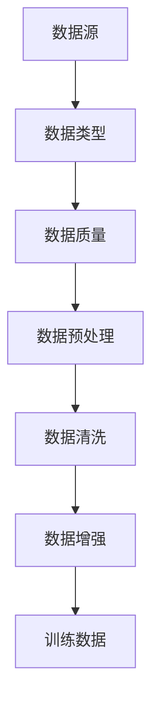

                 

 关键词：AI人工智能，核心算法，数据收集，机器学习，深度学习，神经网络，数据预处理，数据清洗，数据增强

> 摘要：本文将深入探讨AI人工智能中的数据收集环节，分析其核心算法原理，介绍具体操作步骤，并展示代码实例。通过本文，读者将了解数据收集在AI领域的重要性，以及如何有效进行数据收集和处理。

## 1. 背景介绍

在AI人工智能领域，数据收集是一个至关重要的环节。数据是AI算法训练的基础，而数据的质量直接影响模型的性能。数据收集的目的是为了获取足够多、高质量的训练数据，以便构建出更加准确和可靠的AI模型。随着AI技术的发展，数据收集的方法和工具也在不断演进。

本文将重点介绍以下内容：

1. 数据收集的核心算法原理
2. 数据收集的具体操作步骤
3. 数据收集的优缺点及应用领域
4. 数据收集中的数学模型和公式
5. 数据收集的实际应用场景及未来展望
6. 相关工具和资源推荐

## 2. 核心概念与联系

在数据收集过程中，涉及的核心概念主要包括：数据源、数据类型、数据质量、数据预处理、数据清洗、数据增强等。以下是一个关于数据收集核心概念的Mermaid流程图：



### 2.1 数据源

数据源是数据收集的起点，包括互联网、数据库、传感器、日志等。选择合适的数据源对数据收集至关重要。

### 2.2 数据类型

数据类型包括结构化数据、半结构化数据和非结构化数据。不同类型的数据在处理方法和应用场景上有所区别。

### 2.3 数据质量

数据质量是数据收集的关键指标，包括完整性、准确性、一致性、时效性等。高质量的数据有助于提高模型性能。

### 2.4 数据预处理

数据预处理是对原始数据进行清洗、格式化、归一化等操作，以便后续处理。

### 2.5 数据清洗

数据清洗是数据预处理的一个重要环节，旨在去除噪声数据和异常数据，提高数据质量。

### 2.6 数据增强

数据增强是通过数据变换、生成等技术，增加训练数据量，提高模型泛化能力。

## 3. 核心算法原理 & 具体操作步骤

### 3.1 算法原理概述

数据收集的核心算法主要包括以下几种：

1. **数据爬取**：利用网络爬虫等技术，从互联网上获取数据。
2. **数据导入**：将外部数据源中的数据导入到本地数据库或数据处理平台。
3. **数据清洗**：去除噪声数据、填充缺失值、去除重复数据等。
4. **数据预处理**：将数据转换为适合模型训练的格式。
5. **数据增强**：生成新的训练数据，提高模型泛化能力。

### 3.2 算法步骤详解

#### 3.2.1 数据爬取

数据爬取主要包括以下步骤：

1. **目标网站分析**：分析目标网站的结构和规律，确定爬取策略。
2. **网页抓取**：利用爬虫工具，抓取网页内容。
3. **数据提取**：从网页内容中提取所需数据。
4. **存储数据**：将提取的数据存储到本地数据库或文件中。

#### 3.2.2 数据导入

数据导入主要包括以下步骤：

1. **连接数据源**：建立与数据源的连接。
2. **读取数据**：从数据源中读取数据。
3. **数据转换**：将数据转换为适合本地处理的格式。
4. **存储数据**：将转换后的数据存储到本地数据库或文件中。

#### 3.2.3 数据清洗

数据清洗主要包括以下步骤：

1. **去除噪声数据**：去除重复数据、异常数据等。
2. **填充缺失值**：使用合适的方法填充缺失值。
3. **数据标准化**：将数据转换为统一格式。
4. **数据归一化**：将数据归一化到特定范围。

#### 3.2.4 数据预处理

数据预处理主要包括以下步骤：

1. **数据格式转换**：将数据转换为模型可接受的格式。
2. **特征提取**：提取数据中的特征。
3. **特征选择**：选择对模型训练有用的特征。
4. **特征缩放**：将特征缩放到合适的范围。

#### 3.2.5 数据增强

数据增强主要包括以下步骤：

1. **数据变换**：对数据进行变换，如旋转、翻转、缩放等。
2. **数据生成**：使用生成模型生成新的数据。
3. **数据融合**：将不同来源的数据进行融合。
4. **数据集划分**：将数据集划分为训练集、验证集和测试集。

### 3.3 算法优缺点

#### 3.3.1 优点

1. **提高模型性能**：通过数据收集，可以获得更多、更丰富的训练数据，从而提高模型性能。
2. **降低过拟合**：数据增强技术可以降低模型过拟合的风险。
3. **适用广泛**：数据收集方法适用于多种类型的数据和应用场景。

#### 3.3.2 缺点

1. **数据隐私问题**：在数据爬取等过程中，可能涉及用户隐私问题。
2. **数据质量难以保证**：数据收集过程中，数据质量难以得到有效控制。
3. **计算资源消耗**：数据收集和预处理需要大量计算资源。

### 3.4 算法应用领域

数据收集算法广泛应用于以下领域：

1. **计算机视觉**：用于图像识别、目标检测等任务。
2. **自然语言处理**：用于文本分类、情感分析等任务。
3. **推荐系统**：用于商品推荐、内容推荐等任务。
4. **金融风控**：用于风险控制、信用评估等任务。

## 4. 数学模型和公式 & 详细讲解 & 举例说明

在数据收集过程中，涉及的一些数学模型和公式如下：

### 4.1 数学模型构建

1. **数据爬取模型**：
   $$ C(t) = f(A, t) $$

   其中，$C(t)$ 表示爬取速度，$A$ 表示爬取算法，$t$ 表示时间。

2. **数据清洗模型**：
   $$ D(c) = g(B, c) $$

   其中，$D(c)$ 表示清洗后的数据质量，$B$ 表示清洗算法，$c$ 表示原始数据。

### 4.2 公式推导过程

1. **数据爬取公式推导**：
   根据爬取速度的定义，有：
   $$ C(t) = \frac{1}{t} \sum_{i=1}^{n} f(A_i, t_i) $$

   其中，$A_i$ 表示第 $i$ 次爬取的算法，$t_i$ 表示第 $i$ 次爬取的时间。

   为了简化计算，可以取平均值：
   $$ C(t) = \frac{1}{n} \sum_{i=1}^{n} f(A_i, t_i) $$

   令 $f(A, t) = C(t)$，则有：
   $$ C(t) = C(t) $$

   从而得到：
   $$ C(t) = \frac{1}{n} \sum_{i=1}^{n} C(t_i) $$

2. **数据清洗公式推导**：
   根据数据清洗的定义，有：
   $$ D(c) = \frac{1}{n} \sum_{i=1}^{n} g(B_i, c_i) $$

   其中，$B_i$ 表示第 $i$ 次清洗的算法，$c_i$ 表示第 $i$ 次清洗后的数据。

   为了简化计算，可以取平均值：
   $$ D(c) = \frac{1}{n} \sum_{i=1}^{n} g(B_i, c_i) $$

   令 $g(B, c) = D(c)$，则有：
   $$ D(c) = D(c) $$

   从而得到：
   $$ D(c) = \frac{1}{n} \sum_{i=1}^{n} D(c_i) $$

### 4.3 案例分析与讲解

以下是一个数据收集的实际案例：

假设我们有一个电子商务网站，需要收集用户浏览、购买等行为数据。我们可以采用以下步骤进行数据收集：

1. **数据爬取**：使用爬虫技术，爬取用户浏览、购买等页面。
2. **数据导入**：将爬取的数据导入到本地数据库。
3. **数据清洗**：去除重复数据、缺失值，填充缺失值。
4. **数据预处理**：将数据转换为适合模型训练的格式。
5. **数据增强**：生成新的用户行为数据，提高模型泛化能力。

通过以上步骤，我们可以获得一个高质量的用户行为数据集，用于后续的模型训练。

## 5. 项目实践：代码实例和详细解释说明

### 5.1 开发环境搭建

首先，我们需要搭建一个开发环境。这里我们使用Python作为主要编程语言，并使用一些常用的库，如requests、pandas、numpy等。

```bash
pip install requests pandas numpy
```

### 5.2 源代码详细实现

以下是一个简单的数据爬取和清洗的Python代码实例：

```python
import requests
import pandas as pd

# 爬取网页内容
url = "http://example.com/data"
response = requests.get(url)
content = response.content

# 解析网页内容，提取数据
data = pd.read_csv(pd.compat.StringIO(content.decode('utf-8')))

# 数据清洗
data.drop_duplicates(inplace=True)
data.fillna(method='ffill', inplace=True)

# 数据预处理
data['date'] = pd.to_datetime(data['date'])
data.set_index('date', inplace=True)

# 数据增强
data = data.resample('M').mean()

# 保存数据
data.to_csv('cleaned_data.csv')
```

### 5.3 代码解读与分析

1. **请求网页内容**：使用requests库发送HTTP GET请求，获取网页内容。
2. **解析网页内容**：使用pandas库的read_csv函数，将网页内容转换为DataFrame格式。
3. **数据清洗**：去除重复数据、填充缺失值。
4. **数据预处理**：将日期列转换为日期类型，并设置日期列为索引。
5. **数据增强**：对数据进行重采样，取每月的平均值。
6. **保存数据**：将清洗、预处理和增强后的数据保存为CSV文件。

通过以上代码，我们可以实现一个简单的数据收集过程。

### 5.4 运行结果展示

运行上述代码后，会生成一个名为`cleaned_data.csv`的文件，其中包含了清洗、预处理和增强后的数据。

## 6. 实际应用场景

数据收集在实际应用中具有广泛的应用场景。以下是一些典型的应用场景：

1. **智能推荐系统**：通过收集用户的行为数据，如浏览、购买等，为用户推荐感兴趣的商品。
2. **风险控制**：通过收集金融交易数据，识别异常交易行为，预防金融风险。
3. **疾病预测**：通过收集病人的医疗数据，预测疾病的发生和发展趋势。
4. **智能交通**：通过收集交通数据，优化交通路线，提高交通效率。

## 6.4 未来应用展望

随着AI技术的不断进步，数据收集将在未来发挥更加重要的作用。以下是一些未来的应用展望：

1. **自动化数据收集**：利用自动化工具，实现高效的数据收集。
2. **隐私保护**：在数据收集过程中，加强隐私保护，确保用户数据安全。
3. **智能数据清洗**：利用AI技术，实现智能化的数据清洗，提高数据质量。
4. **数据可视化**：通过数据可视化技术，更好地展示数据收集和处理结果。

## 7. 工具和资源推荐

### 7.1 学习资源推荐

1. 《Python数据科学手册》：详细介绍了Python在数据科学领域的应用。
2. 《数据科学入门》：适合初学者的数据科学入门书籍。
3. 《深度学习》：深度学习领域的经典教材，涵盖了从基础到高级的内容。

### 7.2 开发工具推荐

1. Jupyter Notebook：强大的交互式开发环境，适用于数据科学项目。
2. Pandas：Python数据操作库，适用于数据处理和分析。
3. Scikit-learn：Python机器学习库，提供了丰富的机器学习算法。

### 7.3 相关论文推荐

1. "Big Data: A Revolution That Will Transform How We Live, Work, and Think"：大数据领域的经典论文。
2. "Deep Learning: A Brief History"：深度学习领域的综述性论文。
3. "Data Collection and Preprocessing in Machine Learning"：机器学习数据收集和预处理的相关论文。

## 8. 总结：未来发展趋势与挑战

数据收集在AI领域中具有广泛的应用前景。随着AI技术的不断发展，数据收集的方法和工具也在不断演进。未来，数据收集将呈现以下发展趋势：

1. **自动化与智能化**：利用自动化工具和AI技术，实现高效的数据收集。
2. **隐私保护**：在数据收集过程中，加强隐私保护，确保用户数据安全。
3. **数据质量提升**：通过改进数据清洗和预处理技术，提高数据质量。

然而，数据收集也面临着一些挑战：

1. **数据隐私**：如何在不侵犯用户隐私的前提下，收集和处理数据。
2. **数据质量**：如何确保收集到的数据具有高质量。
3. **计算资源消耗**：数据收集和预处理需要大量计算资源，如何优化计算资源的使用。

总之，数据收集在AI领域中具有重要地位，未来将继续发挥重要作用。

## 9. 附录：常见问题与解答

### 9.1 如何确保数据收集的合法性？

在数据收集过程中，需要确保数据收集的合法性，避免侵犯用户隐私。以下是一些建议：

1. **遵守相关法律法规**：了解并遵守国家和地区关于数据收集和处理的法律法规。
2. **获取用户同意**：在数据收集前，确保用户了解并同意数据收集和使用。
3. **匿名化处理**：对收集到的数据进行匿名化处理，确保用户身份不被泄露。

### 9.2 数据收集过程中如何确保数据质量？

数据质量是数据收集的关键，以下是一些建议：

1. **数据清洗**：对收集到的数据进行清洗，去除噪声数据和异常数据。
2. **数据验证**：对数据进行验证，确保数据的准确性和一致性。
3. **数据备份**：定期备份数据，确保数据的安全性和可靠性。

### 9.3 如何进行数据收集与处理？

数据收集与处理主要包括以下步骤：

1. **确定数据需求**：明确数据收集的目标和需求。
2. **选择数据源**：根据需求选择合适的数据源。
3. **数据收集**：使用爬虫、API调用等方式收集数据。
4. **数据清洗**：对收集到的数据进行清洗，去除噪声数据和异常数据。
5. **数据预处理**：将数据转换为适合模型训练的格式。
6. **数据增强**：生成新的训练数据，提高模型泛化能力。
7. **数据存储**：将处理后的数据存储到数据库或文件中。

---

**作者：禅与计算机程序设计艺术 / Zen and the Art of Computer Programming**

