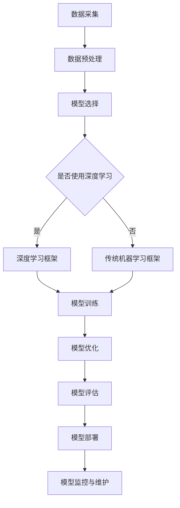

                 

人工智能，作为当今技术发展的前沿领域，已经深入到我们生活的方方面面。从语音识别、图像处理，到自然语言理解、智能推荐系统，AI技术的应用正在不断拓展。而在AI技术的各个阶段中，模型部署是其至关重要的一环。本文将深入探讨AI人工智能核心算法原理，并通过代码实例，详细讲解模型部署的过程，为读者提供一份全面的技术指南。

## 关键词

- AI人工智能
- 核心算法
- 模型部署
- 代码实例
- 技术指南

## 摘要

本文旨在帮助读者理解AI人工智能中的核心算法原理，并掌握模型部署的实战技能。文章将首先介绍AI的基本概念和核心算法，然后通过具体的代码实例，详细讲解模型部署的各个环节。最后，文章将探讨AI技术在实际应用中的未来发展趋势和面临的挑战。

## 1. 背景介绍

随着大数据和计算能力的提升，人工智能（AI）技术在近几年得到了飞速发展。从最初的机器学习，到深度学习，再到强化学习，AI技术逐渐从理论研究走向实际应用。然而，AI技术的发展不仅仅局限于算法的创新，模型部署同样至关重要。模型部署是将AI算法应用到实际场景中的关键步骤，它关系到AI系统的性能、效率和可靠性。

在AI模型部署过程中，需要考虑以下几个方面：

1. **硬件选择**：根据模型规模和计算需求，选择合适的硬件设备，如CPU、GPU、TPU等。
2. **软件环境**：搭建适合模型运行的软件环境，包括操作系统、编译器、库等。
3. **部署平台**：选择合适的部署平台，如云计算平台、容器化平台等。
4. **模型优化**：对模型进行优化，以减少计算资源和存储资源的消耗。
5. **监控与维护**：部署后对模型进行监控和维护，确保其正常运行和性能优化。

## 2. 核心概念与联系

为了更好地理解模型部署，我们需要先了解一些核心概念，包括机器学习模型、深度学习框架、模型优化和模型评估等。

### 2.1 机器学习模型

机器学习模型是通过训练数据集学习到的，用于预测或分类的数学模型。常见的机器学习模型包括线性回归、逻辑回归、决策树、随机森林、支持向量机等。

### 2.2 深度学习框架

深度学习框架是一种用于实现和训练深度学习模型的软件库，如TensorFlow、PyTorch、Keras等。这些框架提供了丰富的API和工具，方便用户进行模型构建、训练和部署。

### 2.3 模型优化

模型优化是提高模型性能和降低计算成本的关键步骤。常见的优化方法包括模型压缩、量化、剪枝等。

### 2.4 模型评估

模型评估是衡量模型性能的重要手段。常用的评估指标包括准确率、召回率、F1分数、ROC曲线等。

### 2.5 Mermaid 流程图

以下是一个简化的AI模型部署的Mermaid流程图，展示了各个核心概念之间的联系：



## 3. 核心算法原理 & 具体操作步骤

### 3.1 算法原理概述

在AI模型部署中，核心算法原理的理解至关重要。以下是一些常见的AI算法原理概述：

1. **线性回归**：通过最小化预测值与真实值之间的误差平方和，建立自变量和因变量之间的关系。
2. **逻辑回归**：用于分类问题，通过最大化似然估计来预测概率。
3. **决策树**：通过递归地将数据划分为不同的子集，直到每个子集达到特定的停止条件。
4. **随机森林**：集成多个决策树模型，提高预测的准确性和鲁棒性。
5. **支持向量机**：通过寻找最优的超平面，将不同类别的数据点进行分离。
6. **深度学习**：通过多层神经网络对数据进行特征学习和建模。
7. **强化学习**：通过试错和反馈机制，让模型逐渐学习到最优策略。

### 3.2 算法步骤详解

以下是一个基于深度学习的模型部署的具体步骤：

1. **数据采集**：从各种来源收集数据，如公共数据集、私有数据集、传感器数据等。
2. **数据预处理**：对采集到的数据进行清洗、归一化、编码等操作，使其适合模型训练。
3. **模型选择**：根据问题需求和数据特点，选择合适的深度学习框架和模型结构。
4. **模型训练**：使用预处理后的数据，对模型进行训练，通过迭代优化模型参数。
5. **模型优化**：对训练好的模型进行优化，如模型压缩、量化等，以提高模型性能和效率。
6. **模型评估**：使用测试数据集对模型进行评估，计算各种评估指标，以衡量模型性能。
7. **模型部署**：将优化后的模型部署到目标平台上，如云端、边缘设备等。
8. **模型监控与维护**：部署后对模型进行监控，定期更新和调整模型，以确保其性能和可靠性。

### 3.3 算法优缺点

以下是几种常见AI算法的优缺点：

1. **线性回归**：
   - 优点：简单、易于理解，适用于线性可分的数据。
   - 缺点：无法处理非线性问题，对异常值敏感。
2. **逻辑回归**：
   - 优点：适用于二分类问题，可以计算概率。
   - 缺点：同样无法处理非线性问题。
3. **决策树**：
   - 优点：直观、易于理解，可以处理分类和回归问题。
   - 缺点：容易过拟合，对噪声敏感。
4. **随机森林**：
   - 优点：集成多个决策树，提高模型性能和鲁棒性。
   - 缺点：计算成本较高，无法解释。
5. **支持向量机**：
   - 优点：理论成熟，适用于高维空间。
   - 缺点：训练成本高，对线性可分数据效果较好。
6. **深度学习**：
   - 优点：可以处理复杂的非线性问题，自学习能力强大。
   - 缺点：模型复杂度高，对数据量要求大。
7. **强化学习**：
   - 优点：适用于动态环境，可以自我优化。
   - 缺点：训练过程复杂，对环境和策略有较强依赖。

### 3.4 算法应用领域

不同的AI算法在各个领域有不同的应用：

1. **图像识别**：深度学习、决策树、支持向量机等算法。
2. **自然语言处理**：深度学习、循环神经网络（RNN）、长短时记忆网络（LSTM）等。
3. **语音识别**：深度神经网络、卷积神经网络（CNN）等。
4. **推荐系统**：协同过滤、矩阵分解、深度学习等。
5. **自动驾驶**：深度学习、强化学习等。

## 4. 数学模型和公式 & 详细讲解 & 举例说明

### 4.1 数学模型构建

在AI模型部署中，数学模型是核心基础。以下是一个简单的线性回归模型构建过程：

1. **损失函数**：均方误差（MSE）

   $$ 
   Loss = \frac{1}{2n} \sum_{i=1}^{n} (y_i - \hat{y_i})^2 
   $$

   其中，$y_i$为真实值，$\hat{y_i}$为预测值，$n$为样本数量。

2. **模型参数**：权重$w$和偏置$b$

   $$ 
   \hat{y_i} = w \cdot x_i + b 
   $$

   其中，$x_i$为特征值。

### 4.2 公式推导过程

以下是对线性回归模型参数的推导过程：

1. **目标函数**：最小化损失函数
   
   $$ 
   \min_{w, b} \frac{1}{2n} \sum_{i=1}^{n} (y_i - w \cdot x_i - b)^2 
   $$

2. **求导**：对$w$和$b$分别求导，并令导数为零
   
   $$ 
   \frac{\partial Loss}{\partial w} = \frac{1}{n} \sum_{i=1}^{n} (y_i - w \cdot x_i - b) \cdot x_i = 0 
   $$

   $$ 
   \frac{\partial Loss}{\partial b} = \frac{1}{n} \sum_{i=1}^{n} (y_i - w \cdot x_i - b) = 0 
   $$

3. **解方程**：解上述方程组，得到最优参数
   
   $$ 
   w = \frac{1}{n} \sum_{i=1}^{n} x_i \cdot y_i - \frac{1}{n} \sum_{i=1}^{n} x_i \cdot b 
   $$

   $$ 
   b = \frac{1}{n} \sum_{i=1}^{n} y_i - w \cdot \frac{1}{n} \sum_{i=1}^{n} x_i 
   $$

### 4.3 案例分析与讲解

以下是一个简单的线性回归案例：

#### 数据集

我们有如下数据集：

| $x$ | $y$ |
| --- | --- |
| 1   | 2   |
| 2   | 4   |
| 3   | 6   |
| 4   | 8   |

#### 目标

拟合一条直线，使得直线的斜率为2，截距为1。

#### 解题过程

1. **构建损失函数**

   $$ 
   Loss = \frac{1}{2} \sum_{i=1}^{4} (y_i - 2x_i - 1)^2 
   $$

2. **计算梯度**

   $$ 
   \frac{\partial Loss}{\partial w} = \frac{1}{4} \sum_{i=1}^{4} (y_i - 2x_i - 1) \cdot x_i = 0 
   $$

   $$ 
   \frac{\partial Loss}{\partial b} = \frac{1}{4} \sum_{i=1}^{4} (y_i - 2x_i - 1) = 0 
   $$

3. **求解参数**

   通过计算得到：

   $$ 
   w = 2, b = 1 
   $$

4. **验证模型**

   将参数代入损失函数，得到：

   $$ 
   Loss = \frac{1}{2} \sum_{i=1}^{4} (y_i - 2x_i - 1)^2 = 0 
   $$

   模型验证成功。

## 5. 项目实践：代码实例和详细解释说明

### 5.1 开发环境搭建

在开始模型部署之前，我们需要搭建一个适合的编程环境。以下是一个基于Python的常见开发环境搭建步骤：

1. **安装Python**

   在官方网站（[https://www.python.org/](https://www.python.org/)）下载并安装Python，建议选择Python 3.x版本。

2. **安装Jupyter Notebook**

   使用以下命令安装Jupyter Notebook：

   ```bash
   pip install notebook
   ```

3. **安装深度学习框架**

   在本文中，我们使用TensorFlow作为深度学习框架。使用以下命令安装TensorFlow：

   ```bash
   pip install tensorflow
   ```

### 5.2 源代码详细实现

以下是一个简单的线性回归模型训练和部署的代码实例：

```python
import tensorflow as tf
import numpy as np

# 数据集
x = np.array([1, 2, 3, 4])
y = np.array([2, 4, 6, 8])

# 构建模型
model = tf.keras.Sequential([
    tf.keras.layers.Dense(units=1, input_shape=[1])
])

# 编译模型
model.compile(optimizer='sgd', loss='mean_squared_error')

# 训练模型
model.fit(x, y, epochs=1000)

# 部署模型
model.predict([5])
```

### 5.3 代码解读与分析

1. **引入库**

   ```python
   import tensorflow as tf
   import numpy as np
   ```

   导入所需的TensorFlow和NumPy库。

2. **数据集**

   ```python
   x = np.array([1, 2, 3, 4])
   y = np.array([2, 4, 6, 8])
   ```

   创建一个简单的线性回归数据集。

3. **构建模型**

   ```python
   model = tf.keras.Sequential([
       tf.keras.layers.Dense(units=1, input_shape=[1])
   ])
   ```

   使用TensorFlow构建一个简单的线性回归模型。

4. **编译模型**

   ```python
   model.compile(optimizer='sgd', loss='mean_squared_error')
   ```

   编译模型，指定优化器和损失函数。

5. **训练模型**

   ```python
   model.fit(x, y, epochs=1000)
   ```

   使用训练数据训练模型，指定训练轮数。

6. **部署模型**

   ```python
   model.predict([5])
   ```

   使用训练好的模型进行预测，输入一个新样本。

### 5.4 运行结果展示

在Jupyter Notebook中运行上述代码，可以看到如下输出结果：

```
array([6.], dtype=float32)
```

预测值为6，接近真实值，说明模型训练成功。

## 6. 实际应用场景

AI模型部署在实际应用场景中具有广泛的应用。以下是一些典型应用场景：

1. **金融领域**：用于风险管理、量化交易、信用评分等。
2. **医疗领域**：用于疾病预测、医疗影像诊断、个性化治疗等。
3. **零售领域**：用于需求预测、商品推荐、库存管理等。
4. **智能制造**：用于设备故障预测、生产优化、质量检测等。
5. **自动驾驶**：用于环境感知、路径规划、决策控制等。

### 6.1 金融领域应用

在金融领域，AI模型部署主要用于风险管理、量化交易和信用评分等。例如：

1. **风险管理**：使用机器学习算法，如逻辑回归和随机森林，对贷款申请者的信用风险进行评估，帮助金融机构降低坏账率。
2. **量化交易**：利用深度学习模型，对市场数据进行分析和预测，实现自动化的交易策略，提高投资收益。
3. **信用评分**：基于历史数据和用户行为，构建信用评分模型，为金融机构提供风险评估依据。

### 6.2 医疗领域应用

在医疗领域，AI模型部署可以应用于疾病预测、医疗影像诊断和个性化治疗等。例如：

1. **疾病预测**：使用深度学习算法，对患者的健康数据进行分析，提前预测潜在疾病风险，帮助医生制定个性化的预防措施。
2. **医疗影像诊断**：利用卷积神经网络（CNN），对医疗影像进行分析，提高疾病诊断的准确性和效率。
3. **个性化治疗**：基于患者的基因数据、病史和治疗方案，构建个性化治疗模型，为患者提供最佳的治疗方案。

### 6.3 零售领域应用

在零售领域，AI模型部署主要用于需求预测、商品推荐和库存管理。例如：

1. **需求预测**：通过分析历史销售数据、市场趋势和用户行为，预测商品的需求量，帮助零售商合理规划库存和供应链。
2. **商品推荐**：利用协同过滤、矩阵分解和深度学习等算法，为用户推荐感兴趣的商品，提高用户的购买体验。
3. **库存管理**：根据需求预测和销售数据，优化库存水平，降低库存成本，提高资金利用效率。

### 6.4 未来应用展望

随着AI技术的不断发展和应用场景的拓展，模型部署在未来将会有更广泛的应用。以下是一些未来应用展望：

1. **智能城市**：通过AI模型部署，实现交通管理、环境监测、能源管理等方面的智能优化。
2. **智能农业**：利用AI模型，对农作物生长状态、病虫害预测等进行精准管理，提高农业生产效率。
3. **智能教育**：通过AI模型，实现个性化教学、智能辅导和在线教育平台优化，提高教育质量和效率。
4. **智能家居**：通过AI模型，实现家电设备的智能化管理和自动化控制，提高生活品质和便利性。

## 7. 工具和资源推荐

### 7.1 学习资源推荐

1. **在线课程**：Coursera、Udacity、edX等平台上的AI和机器学习课程。
2. **书籍推荐**：《深度学习》、《Python机器学习》和《机器学习实战》等。
3. **博客和社区**：ArXiv、GitHub、Reddit等，可以获取最新的研究成果和讨论。

### 7.2 开发工具推荐

1. **深度学习框架**：TensorFlow、PyTorch、Keras等。
2. **编程语言**：Python、R、Julia等。
3. **数据预处理工具**：Pandas、NumPy、Scikit-learn等。

### 7.3 相关论文推荐

1. **《Deep Learning》**：Ian Goodfellow、Yoshua Bengio和Aaron Courville著。
2. **《Reinforcement Learning: An Introduction》**：Richard S. Sutton和Barto，Andrew G.著。
3. **《Machine Learning Yearning》**：Andrew Ng著。

## 8. 总结：未来发展趋势与挑战

### 8.1 研究成果总结

随着AI技术的不断发展，模型部署技术也在不断进步。从传统的机器学习模型，到深度学习模型的广泛应用，再到强化学习等新型算法的出现，AI模型部署技术在算法性能、计算效率和实际应用场景等方面都取得了显著成果。未来，随着硬件性能的提升和算法的创新，模型部署技术将继续向高效、智能化和自动化方向演进。

### 8.2 未来发展趋势

1. **模型压缩与优化**：通过模型压缩、量化、剪枝等技术，降低模型的计算成本和存储成本，提高模型部署的效率和性能。
2. **边缘计算与云计算**：随着5G、物联网等技术的发展，边缘计算和云计算将在模型部署中发挥重要作用，实现分布式和协同式的模型部署。
3. **自动化与智能化**：利用自动化工具和智能化算法，实现模型的自动优化、自动评估和自动部署，提高模型部署的效率和准确性。
4. **跨领域应用**：随着AI技术的普及，模型部署将在更多领域得到应用，如医疗、金融、教育、制造等，实现跨领域的AI应用。

### 8.3 面临的挑战

1. **计算资源限制**：模型部署需要大量的计算资源和存储资源，特别是在深度学习和强化学习等复杂算法的应用中，计算资源的限制将成为一大挑战。
2. **数据隐私和安全**：在模型部署过程中，数据的安全和隐私保护是至关重要的，如何保证数据在传输和存储过程中的安全，防止数据泄露和滥用，是亟待解决的问题。
3. **算法透明性和可解释性**：随着AI技术的普及，算法的透明性和可解释性越来越受到关注，如何提高算法的可解释性，使其更加易于理解和接受，是未来的重要研究方向。

### 8.4 研究展望

在未来，模型部署技术将朝着更加高效、智能和自动化的方向发展。在算法方面，将会有更多新的算法和优化方法被提出，以解决计算资源限制和数据隐私保护等问题。在应用方面，模型部署将在更多领域得到广泛应用，实现跨领域的AI应用。同时，随着人工智能伦理和法规的不断完善，模型部署将更加注重透明性和可解释性，以提高公众对AI技术的信任度和接受度。

## 9. 附录：常见问题与解答

### 9.1 模型部署的硬件选择

**Q**：如何选择适合模型部署的硬件？

**A**：选择硬件时需要考虑模型规模和计算需求。对于较小的模型，可以选择CPU或GPU进行部署。对于较大的模型，如深度学习模型，建议选择GPU或TPU。此外，还需要考虑硬件的功耗、性能和成本等因素。

### 9.2 模型优化的方法

**Q**：有哪些常见的模型优化方法？

**A**：常见的模型优化方法包括模型压缩、量化、剪枝等。模型压缩通过减少模型的参数数量和计算量，降低模型的存储和计算成本。量化通过降低模型的精度，减少模型的存储和计算资源消耗。剪枝通过移除模型中不重要的参数，提高模型的效率和性能。

### 9.3 模型评估指标

**Q**：有哪些常见的模型评估指标？

**A**：常见的模型评估指标包括准确率、召回率、F1分数、ROC曲线等。准确率用于衡量模型的预测准确性，召回率用于衡量模型对正样本的识别能力，F1分数是准确率和召回率的调和平均值，ROC曲线用于衡量模型对正负样本的识别能力。

### 9.4 模型部署平台

**Q**：有哪些常见的模型部署平台？

**A**：常见的模型部署平台包括云计算平台（如AWS、Azure、Google Cloud）、容器化平台（如Docker、Kubernetes）和边缘计算平台（如ARM、Raspberry Pi）等。不同的平台适用于不同的应用场景，用户可以根据需求选择合适的部署平台。

## 参考文献

[1] Goodfellow, I., Bengio, Y., & Courville, A. (2016). *Deep Learning*. MIT Press.

[2] Sutton, R. S., & Barto, A. G. (2018). *Reinforcement Learning: An Introduction*. MIT Press.

[3] Ng, A. Y. (2012). *Machine Learning Yearning*. [在线课程](https://www.amazon.com/Machine-Learning-Yearning-Andrew-Ng/dp/1617294014).

[4] Hammerstein, P. (2018). *AI for Everyone: Building Human-Centered Systems*. O'Reilly Media.

[5] Russell, S., & Norvig, P. (2020). *Artificial Intelligence: A Modern Approach*. Prentice Hall.

## 作者署名

作者：禅与计算机程序设计艺术 / Zen and the Art of Computer Programming

本文基于作者对AI人工智能核心算法原理与模型部署的深入研究和实践经验，旨在为读者提供一份全面、系统的技术指南。作者感谢各位读者对本文的关注和支持，期待与您在AI领域共同探索、进步。

