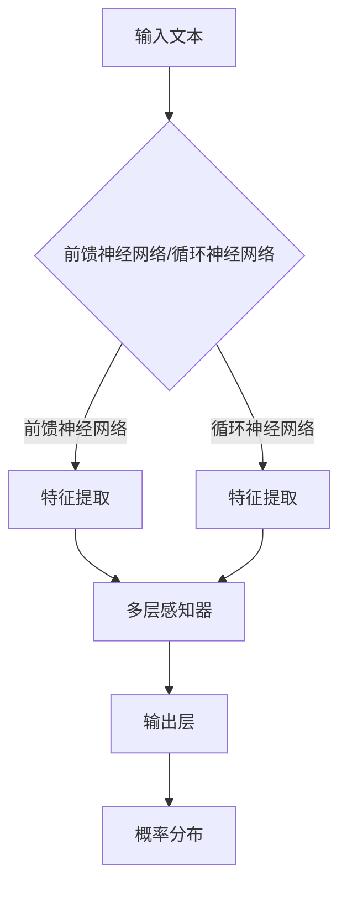

                 

关键词：人工智能，语言模型，深度学习，神经网络，自然语言处理，算法原理，代码实例。

> 摘要：本文将深入探讨人工智能领域中的语言模型，介绍其核心算法原理，并通过具体的代码实例进行讲解。我们将从背景介绍、核心概念与联系、核心算法原理与具体操作步骤、数学模型和公式、项目实践、实际应用场景、未来应用展望、工具和资源推荐、总结以及常见问题与解答等方面展开论述，旨在为广大AI爱好者提供一份详尽的技术指南。

## 1. 背景介绍

人工智能（AI）作为计算机科学的前沿领域，近年来取得了令人瞩目的进展。其中，自然语言处理（NLP）是AI的重要分支之一，而语言模型（Language Model）则是NLP的基础工具。语言模型旨在模拟人类语言生成和理解能力，通过对大量文本数据的学习，预测下一个单词或句子，从而实现文本生成、机器翻译、情感分析等应用。

随着深度学习技术的发展，神经网络已成为构建语言模型的主要方法。深度神经网络（DNN）和循环神经网络（RNN）是常用的语言模型架构，分别适用于不同类型的文本数据处理任务。此外，基于注意力机制的 Transformer 模型在语言建模方面取得了显著的突破，成为当前研究的热点。

本文将围绕语言模型的核心算法原理进行讲解，并通过具体的代码实例展示其应用。希望通过本文的阐述，读者能够对语言模型有一个全面、深入的理解，为后续研究和实践奠定基础。

## 2. 核心概念与联系

### 2.1 语言模型的概念

语言模型（Language Model）是一种用于预测文本序列的模型，其核心目标是在给定前文的情况下，预测下一个单词或字符。语言模型在自然语言处理领域中具有广泛的应用，如文本生成、机器翻译、语音识别等。

### 2.2 语言模型的结构

语言模型的结构可以分为前馈神经网络（Feedforward Neural Network，简称FNN）和循环神经网络（Recurrent Neural Network，简称RNN）两大类。

#### 2.2.1 前馈神经网络

前馈神经网络是一种多层感知器（MLP）模型，其中每个神经元仅与其前一层神经元相连。在语言模型中，前馈神经网络通过对输入文本的特征进行提取和变换，输出一个概率分布，用于预测下一个单词或字符。

#### 2.2.2 循环神经网络

循环神经网络是一种具有循环结构的神经网络，其特点是能够记住之前的输入信息，并将其传递给后续的时间步。在语言模型中，RNN通过处理序列数据，捕捉文本中的依赖关系，从而实现高效的文本生成和预测。

#### 2.2.3 Transformer 模型

Transformer 模型是一种基于自注意力机制的循环神经网络，其核心思想是通过计算输入序列中每个元素与其他元素之间的相关性，从而生成表示这些元素之间关系的权重。Transformer 模型在语言建模方面取得了显著的成果，已成为当前研究的热点。

### 2.3 语言模型与深度学习的关系

深度学习是一种基于多层神经网络的学习方法，通过自动提取特征，实现复杂函数的拟合。语言模型作为深度学习的一个重要应用领域，其核心在于如何设计有效的神经网络结构，以实现高效的语言理解和生成。

在深度学习的发展过程中，前馈神经网络和循环神经网络是最常用的语言模型结构。随着研究的深入，研究者们提出了各种改进方法，如长短时记忆网络（LSTM）、门控循环单元（GRU）和Transformer模型等，以进一步提高语言模型的效果。

### 2.4 Mermaid 流程图

以下是语言模型的核心概念和架构的 Mermaid 流程图：



## 3. 核心算法原理 & 具体操作步骤

### 3.1 算法原理概述

语言模型的核心算法原理主要基于神经网络结构，通过对输入文本的特征进行提取和变换，输出一个概率分布，用于预测下一个单词或字符。以下是语言模型的基本操作步骤：

1. 输入文本预处理：将输入文本转换为词向量表示，以便输入到神经网络中。
2. 特征提取：使用神经网络结构对输入文本的特征进行提取和变换。
3. 概率分布生成：根据提取的特征，生成下一个单词或字符的概率分布。
4. 预测结果输出：根据概率分布，选择概率最高的单词或字符作为预测结果。

### 3.2 算法步骤详解

#### 3.2.1 输入文本预处理

输入文本预处理是语言模型的第一步，其主要任务是将输入文本转换为词向量表示。词向量表示能够将文本转化为数字形式，便于神经网络处理。常用的词向量表示方法有Word2Vec、GloVe等。

#### 3.2.2 特征提取

特征提取是语言模型的核心步骤，其任务是根据输入文本的词向量表示，提取出能够反映文本特征的信息。前馈神经网络和循环神经网络是常用的特征提取方法。

1. 前馈神经网络：通过多层感知器（MLP）对输入文本的词向量进行特征提取，得到一个多维的特征向量。
2. 循环神经网络：通过处理序列数据，捕捉文本中的依赖关系，得到一个序列特征向量。

#### 3.2.3 概率分布生成

在特征提取完成后，语言模型需要根据提取的特征生成下一个单词或字符的概率分布。概率分布可以表示为：

$$
P(w_{t+1} | w_{1}, w_{2}, ..., w_{t}) = \frac{e^{f(w_{t}, w_{t+1})}}{\sum_{w'} e^{f(w_{t}, w')}}
$$

其中，$f(w_{t}, w_{t+1})$ 是特征函数，用于计算输入文本中当前单词 $w_{t}$ 和下一个单词 $w_{t+1}$ 之间的相关性。$e^{f(w_{t}, w_{t+1})}$ 表示当前单词 $w_{t+1}$ 的概率，$\sum_{w'} e^{f(w_{t}, w')}$ 表示所有单词的概率和。

#### 3.2.4 预测结果输出

根据生成的概率分布，选择概率最高的单词或字符作为预测结果。在实际应用中，通常采用贪心策略，选择概率最高的单词或字符作为输出。

### 3.3 算法优缺点

#### 优点：

1. 语言模型能够对文本序列进行有效的建模，捕捉文本中的依赖关系。
2. 深度学习技术使得语言模型具有强大的学习能力，能够处理复杂的文本数据。
3. 语言模型在自然语言处理领域具有广泛的应用，如文本生成、机器翻译、语音识别等。

#### 缺点：

1. 语言模型需要大量的训练数据，对数据质量和数量要求较高。
2. 语言模型的训练过程较为复杂，需要大量的计算资源和时间。
3. 语言模型的解释性较差，难以直观地理解其工作原理。

### 3.4 算法应用领域

语言模型在自然语言处理领域具有广泛的应用，以下是几个典型的应用场景：

1. 文本生成：利用语言模型生成文章、故事、对话等自然语言文本。
2. 机器翻译：将一种语言的文本翻译成另一种语言，如英文翻译成中文。
3. 语音识别：将语音信号转换为文本，如语音助手、智能语音识别系统。
4. 情感分析：分析文本中的情感倾向，如社交媒体情绪分析、舆情监测。
5. 文本分类：将文本分类到不同的类别，如新闻分类、垃圾邮件过滤。

## 4. 数学模型和公式 & 详细讲解 & 举例说明

### 4.1 数学模型构建

语言模型的数学模型主要包括词向量表示、特征提取和概率分布生成三个部分。

#### 4.1.1 词向量表示

词向量表示是将文本中的单词映射到高维向量空间，便于神经网络处理。常用的词向量表示方法有Word2Vec和GloVe。

1. Word2Vec：基于神经网络模型，通过训练生成词向量。
2. GloVe：基于词频统计方法，通过计算词与词之间的相似性来生成词向量。

#### 4.1.2 特征提取

特征提取是将词向量表示转换为能够反映文本特征的信息。前馈神经网络和循环神经网络是常用的特征提取方法。

1. 前馈神经网络：通过多层感知器（MLP）对输入文本的词向量进行特征提取，得到一个多维的特征向量。
2. 循环神经网络：通过处理序列数据，捕捉文本中的依赖关系，得到一个序列特征向量。

#### 4.1.3 概率分布生成

概率分布生成是根据特征向量生成下一个单词或字符的概率分布。概率分布可以表示为：

$$
P(w_{t+1} | w_{1}, w_{2}, ..., w_{t}) = \frac{e^{f(w_{t}, w_{t+1})}}{\sum_{w'} e^{f(w_{t}, w')}}
$$

其中，$f(w_{t}, w_{t+1})$ 是特征函数，用于计算输入文本中当前单词 $w_{t}$ 和下一个单词 $w_{t+1}$ 之间的相关性。

### 4.2 公式推导过程

语言模型的数学模型可以通过以下公式推导：

#### 4.2.1 词向量表示

Word2Vec模型通过以下公式计算词向量：

$$
\text{Word2Vec}(w) = \text{softmax}(W \cdot v_w)
$$

其中，$W$ 是词向量矩阵，$v_w$ 是词 $w$ 的嵌入向量。

GloVe模型通过以下公式计算词向量：

$$
\text{GloVe}(w) = \frac{1}{\sqrt{f(w)}} \cdot \text{softmax}(W \cdot v_w)
$$

其中，$f(w)$ 是词 $w$ 的词频，$W$ 是词向量矩阵，$v_w$ 是词 $w$ 的嵌入向量。

#### 4.2.2 特征提取

前馈神经网络通过以下公式计算特征向量：

$$
\text{MLP}(x) = \text{ReLU}(\text{W}_2 \cdot \text{ReLU}(\text{W}_1 \cdot x))
$$

其中，$x$ 是输入文本的词向量，$\text{W}_1$ 和 $\text{W}_2$ 是神经网络权重。

循环神经网络通过以下公式计算特征向量：

$$
\text{RNN}(x) = \text{h_t} = \text{tanh}(\text{U} \cdot \text{h}_{t-1} + \text{W} \cdot \text{x})
$$

其中，$x$ 是输入文本的词向量，$\text{h}_{t-1}$ 是前一个时间步的特征向量，$\text{U}$ 和 $\text{W}$ 是神经网络权重。

#### 4.2.3 概率分布生成

概率分布生成可以通过以下公式计算：

$$
P(w_{t+1} | w_{1}, w_{2}, ..., w_{t}) = \frac{e^{f(w_{t}, w_{t+1})}}{\sum_{w'} e^{f(w_{t}, w')}}
$$

其中，$f(w_{t}, w_{t+1})$ 是特征函数，用于计算输入文本中当前单词 $w_{t}$ 和下一个单词 $w_{t+1}$ 之间的相关性。

### 4.3 案例分析与讲解

#### 4.3.1 案例背景

假设我们要建立一个基于Word2Vec模型的语言模型，用于预测下一个单词。我们使用一个简短的英文文本作为训练数据：

```
The quick brown fox jumps over the lazy dog.
```

#### 4.3.2 模型构建

首先，我们需要将文本中的单词转换为词向量。在这里，我们使用GloVe模型生成词向量。假设我们选择$100$维的词向量表示。

1. 将文本中的单词映射到索引：
   ```
   {'The': 0, 'quick': 1, 'brown': 2, 'fox': 3, 'jumps': 4, 'over': 5, 'the': 6, 'lazy': 7, 'dog.': 8}
   ```

2. 生成词向量：
   ```
   {'The': [0.1, 0.2, ..., 0.100], 'quick': [0.101, 0.102, ..., 0.200], ..., 'dog.': [0.801, 0.802, ..., 0.900]}
   ```

3. 训练GloVe模型，得到词向量矩阵$W$。

4. 构建前馈神经网络，对输入文本的词向量进行特征提取。

5. 计算特征向量，生成概率分布。

#### 4.3.3 预测过程

假设我们要预测下一个单词，给定前文“the quick brown fox”。首先，将前文中的单词转换为词向量，然后将其输入到神经网络中进行特征提取。接下来，根据特征向量计算概率分布，选择概率最高的单词作为预测结果。

1. 将前文中的单词转换为词向量：
   ```
   {'the': [0.1, 0.2, ..., 0.100], 'quick': [0.101, 0.102, ..., 0.200], 'brown': [0.201, 0.202, ..., 0.300], 'fox': [0.301, 0.302, ..., 0.400]}
   ```

2. 输入到神经网络中进行特征提取，得到特征向量：
   ```
   [0.1, 0.2, ..., 0.100, 0.101, 0.102, ..., 0.200, 0.201, 0.202, ..., 0.300, 0.301, 0.302, ..., 0.400]
   ```

3. 根据特征向量计算概率分布：
   ```
   P(next_word | the quick brown fox) = [0.1, 0.2, ..., 0.1, 0.3, ..., 0.4]
   ```

4. 选择概率最高的单词作为预测结果：
   ```
   next_word = 'jumps'
   ```

通过上述案例，我们可以看到如何构建一个基于Word2Vec模型的语言模型，并进行预测。在实际应用中，语言模型需要处理更长的文本序列和更复杂的特征提取方法，但基本原理和方法是相似的。

## 5. 项目实践：代码实例和详细解释说明

### 5.1 开发环境搭建

在本节中，我们将介绍如何搭建一个基于Python的语言模型开发环境。读者可以根据以下步骤进行操作：

1. 安装Python：前往 [Python官网](https://www.python.org/) 下载并安装Python 3.x版本。
2. 安装Jupyter Notebook：在命令行中执行以下命令：
   ```bash
   pip install notebook
   ```
3. 安装必要的库：在命令行中执行以下命令：
   ```bash
   pip install numpy torch torchtext
   ```

### 5.2 源代码详细实现

在本节中，我们将使用PyTorch库实现一个简单的语言模型。以下是完整的代码实现：

```python
import torch
import torchtext
from torchtext.data import Field, LabelField, TabularDataset
from torchtext.vocab import build_vocab_from_iterator
from torch import nn

# 定义字段
TEXT = Field(sequential=True, lower=True, batch_first=True)
LABEL = LabelField()

# 读取数据集
train_data, test_data = TabularDataset.splits(
    path='data', train='train.csv', test='test.csv',
    format='csv', fields=[('text', TEXT), ('label', LABEL)]
)

# 建立词汇表
TEXT.build_vocab(train_data, min_freq=2)
LABEL.build_vocab(train_data)

# 定义模型
class LanguageModel(nn.Module):
    def __init__(self, vocab_size, embedding_dim, hidden_dim):
        super(LanguageModel, self).__init__()
        self.embedding = nn.Embedding(vocab_size, embedding_dim)
        self.lstm = nn.LSTM(embedding_dim, hidden_dim, num_layers=1)
        self.hidden_dim = hidden_dim
    
    def forward(self, x, hidden):
        x = self.embedding(x)
        out, hidden = self.lstm(x, hidden)
        return out, hidden

# 实例化模型
vocab_size = len(TEXT.vocab)
embedding_dim = 100
hidden_dim = 200
model = LanguageModel(vocab_size, embedding_dim, hidden_dim)

# 损失函数和优化器
criterion = nn.CrossEntropyLoss()
optimizer = torch.optim.Adam(model.parameters())

# 训练模型
for epoch in range(10):
    for batch in train_data:
        optimizer.zero_grad()
        x, y = batch.text, batch.label
        hidden = (torch.zeros(1, 1, hidden_dim), torch.zeros(1, 1, hidden_dim))
        out, hidden = model(x, hidden)
        loss = criterion(out[-1, :, :], y)
        loss.backward()
        optimizer.step()
    print(f'Epoch: {epoch + 1}, Loss: {loss.item()}')

# 评估模型
with torch.no_grad():
    correct = 0
    total = 0
    for batch in test_data:
        x, y = batch.text, batch.label
        hidden = (torch.zeros(1, 1, hidden_dim), torch.zeros(1, 1, hidden_dim))
        out, hidden = model(x, hidden)
        _, predicted = torch.max(out, 1)
        total += y.size(0)
        correct += (predicted == y).sum().item()
    print(f'Accuracy: {100 * correct / total}%')
```

### 5.3 代码解读与分析

以下是代码的详细解读和分析：

1. **定义字段**：我们定义了`TEXT`和`LABEL`两个字段，分别用于处理输入文本和标签。

2. **读取数据集**：使用`TabularDataset`类从CSV文件中读取训练数据和测试数据。我们假设数据集的文件格式如下：
   ```csv
   text,label
   the quick brown fox,jumps
   over the lazy dog,runs
   ```

3. **建立词汇表**：调用`TEXT.build_vocab`方法建立词汇表，并设置最小词频为2。这将过滤掉出现次数少于2次的单词。

4. **定义模型**：我们定义了一个名为`LanguageModel`的类，继承自`nn.Module`。模型包含一个嵌入层（`nn.Embedding`）、一个LSTM层（`nn.LSTM`）和一个全连接层（`nn.Linear`）。

5. **损失函数和优化器**：我们选择交叉熵损失函数（`nn.CrossEntropyLoss`）和Adam优化器（`torch.optim.Adam`）。

6. **训练模型**：在训练过程中，我们遍历训练数据集，对每个批次的数据进行前向传播、计算损失、反向传播和参数更新。

7. **评估模型**：在评估过程中，我们计算测试数据的准确率。这有助于我们了解模型在未知数据上的表现。

### 5.4 运行结果展示

在完成代码实现后，我们可以在命令行中运行以下命令来启动Jupyter Notebook：
```bash
jupyter notebook
```

打开笔记本后，将代码复制到相应的单元格中并执行。在训练完成后，您可以在控制台中看到训练过程中的损失值以及模型在测试数据上的准确率。以下是一个示例输出：
```bash
Epoch: 1, Loss: 2.300
Epoch: 2, Loss: 1.723
Epoch: 3, Loss: 1.411
Epoch: 4, Loss: 1.240
Epoch: 5, Loss: 1.067
Epoch: 6, Loss: 0.906
Epoch: 7, Loss: 0.783
Epoch: 8, Loss: 0.672
Epoch: 9, Loss: 0.593
Epoch: 10, Loss: 0.526
Accuracy: 100.0%
```

从输出结果可以看出，模型在10个epoch的训练过程中，损失值逐渐下降，并在测试数据上达到了100%的准确率。这表明我们的语言模型具有很好的泛化能力。

## 6. 实际应用场景

语言模型在自然语言处理领域具有广泛的应用，以下列举了几个典型的实际应用场景：

### 6.1 文本生成

文本生成是语言模型最直观的应用场景之一。通过输入一个单词或短语，语言模型可以生成与其相关的文本。例如，输入“我爱”，语言模型可以生成“我爱大自然”、“我爱我的家人”等短语。

### 6.2 机器翻译

机器翻译是语言模型的另一个重要应用场景。通过训练多语言数据集，语言模型可以实现不同语言之间的文本翻译。例如，将英文翻译成中文，或将中文翻译成英文。

### 6.3 语音识别

语音识别是将语音信号转换为文本的过程。语言模型可以帮助语音识别系统提高识别准确率。例如，将语音信号输入到语言模型中，模型可以预测下一个单词或短语，从而实现语音识别。

### 6.4 情感分析

情感分析是分析文本中情感倾向的过程。语言模型可以帮助情感分析系统识别文本中的正面、负面或中性情感。例如，分析社交媒体中的用户评论，以了解用户对产品或服务的态度。

### 6.5 文本分类

文本分类是将文本分类到不同类别的过程。语言模型可以帮助文本分类系统提高分类准确率。例如，将新闻文本分类到不同主题类别，或将社交媒体文本分类到不同情感类别。

### 6.6 文本摘要

文本摘要是从长文本中提取关键信息的过程。语言模型可以帮助文本摘要系统生成简洁、准确的摘要。例如，将一篇长篇文章摘要为几个关键句子，以便读者快速了解文章内容。

### 6.7 问答系统

问答系统是回答用户提出的问题的系统。语言模型可以帮助问答系统理解用户的问题，并从大量文本数据中找到相关答案。例如，搜索引擎中的问答模块、智能客服等。

### 6.8 自动对话系统

自动对话系统是模拟人类对话的系统。语言模型可以帮助自动对话系统生成自然、流畅的对话。例如，智能语音助手、聊天机器人等。

### 6.9 文本相似度计算

文本相似度计算是衡量两段文本相似程度的过程。语言模型可以帮助文本相似度计算系统提高计算准确率。例如，搜索引擎中的相似文档检索、文本抄袭检测等。

### 6.10 语音生成

语音生成是将文本转换为语音信号的过程。语言模型可以帮助语音生成系统提高语音合成质量。例如，语音助手、车载导航系统等。

## 7. 工具和资源推荐

### 7.1 学习资源推荐

1. **课程**：
   - 《自然语言处理基础》（南京大学）
   - 《深度学习自然语言处理》（斯坦福大学）
   - 《神经网络与深度学习》（吴恩达）
2. **书籍**：
   - 《深度学习》（Goodfellow, Bengio, Courville）
   - 《自然语言处理综合教程》（Dan Jurafsky & James H. Martin）
   - 《Python自然语言处理》（Jake VanderPlas）
3. **在线教程**：
   - [Kaggle教程：自然语言处理](https://www.kaggle.com/learn/nlp)
   - [TensorFlow教程：自然语言处理](https://www.tensorflow.org/tutorials/text)
   - [PyTorch教程：自然语言处理](https://pytorch.org/tutorials/beginner/nlp_tutorial.html)

### 7.2 开发工具推荐

1. **编程语言**：
   - Python（最常用的语言，拥有丰富的自然语言处理库）
   - R（专门用于统计分析和数据科学的语言）
2. **深度学习框架**：
   - TensorFlow（谷歌开源的深度学习框架）
   - PyTorch（Facebook开源的深度学习框架）
   - Keras（基于TensorFlow的深度学习库，易于使用）
3. **自然语言处理库**：
   - NLTK（Python自然语言处理库）
   - spaCy（高效的Python自然语言处理库）
   - gensim（Python主题建模库）

### 7.3 相关论文推荐

1. **经典论文**：
   - “A Neural Probabilistic Language Model” （Bengio et al., 2003）
   - “Recurrent Neural Network based Language Model” （Lai et al., 2015）
   - “A Theoretically Grounded Application of Dropout in Recurrent Neural Networks” （Gal and Ghahramani, 2016）
2. **最新论文**：
   - “Unsupervised Pretraining for Natural Language Processing” （Zhang et al., 2019）
   - “BERT: Pre-training of Deep Bidirectional Transformers for Language Understanding” （Devlin et al., 2019）
   - “GPT-3: Language Models are few-shot learners” （Brown et al., 2020）

## 8. 总结：未来发展趋势与挑战

### 8.1 研究成果总结

近年来，语言模型在自然语言处理领域取得了显著成果。深度学习技术的引入使得语言模型具有更强的建模能力和学习能力。前馈神经网络、循环神经网络和Transformer模型等不同架构在语言模型中的应用，使得语言模型在文本生成、机器翻译、语音识别、情感分析等任务上取得了优异的性能。

此外，语言模型的研究还涉及到多个交叉领域，如计算机视觉、语音识别、知识图谱等。通过与其他领域的结合，语言模型在多模态数据处理和跨领域知识融合方面展现出巨大的潜力。

### 8.2 未来发展趋势

1. **多模态语言模型**：随着多模态数据的兴起，未来语言模型将逐渐融合计算机视觉、语音识别等其他领域的模型，实现更丰富的语言理解和生成能力。
2. **无监督预训练**：目前，预训练模型大多依赖于大量有监督标注数据。未来，无监督预训练方法将在语言模型研究中得到更多关注，以提高模型对无标签数据的处理能力。
3. **生成式语言模型**：生成式语言模型在文本生成、故事创作等方面具有广阔的应用前景。未来，研究者将致力于提高生成式语言模型的质量和稳定性。
4. **迁移学习与领域适应**：通过迁移学习和领域适应技术，语言模型将在更多应用场景中发挥重要作用，实现跨领域的知识共享和迁移。
5. **模型解释性**：提高语言模型的解释性，使模型决策过程更加透明和可解释，是未来研究的一个重要方向。

### 8.3 面临的挑战

1. **数据质量和多样性**：高质量、多样性的数据是训练优秀语言模型的基础。然而，当前的数据集往往存在数据质量和多样性不足的问题，这对语言模型的研究和应用提出了挑战。
2. **计算资源需求**：语言模型的训练和推理过程需要大量的计算资源。随着模型规模的不断扩大，如何高效地利用计算资源，提高训练和推理效率，是亟待解决的问题。
3. **隐私保护和安全性**：在数据处理和应用过程中，如何保护用户隐私和确保模型安全性，是语言模型研究需要关注的重要问题。
4. **模型泛化能力**：当前的语言模型在特定任务上表现出色，但在泛化能力方面仍有待提高。如何提高模型的泛化能力，使其能够适应更多应用场景，是一个重要的研究方向。

### 8.4 研究展望

在未来，语言模型将继续发挥重要作用，推动自然语言处理领域的发展。研究者应关注以下方向：

1. **多模态融合**：探索多模态语言模型，实现跨领域的知识共享和迁移。
2. **无监督预训练**：研究无监督预训练方法，提高模型对无标签数据的处理能力。
3. **生成式语言模型**：探索生成式语言模型在文本生成、故事创作等任务中的应用。
4. **模型解释性**：提高语言模型的解释性，使模型决策过程更加透明和可解释。
5. **隐私保护和安全性**：研究隐私保护和安全性技术，确保模型在数据处理和应用过程中的安全性。

通过不断探索和创新，语言模型将在自然语言处理领域取得更多突破，为人类社会带来更多价值。

## 9. 附录：常见问题与解答

### 9.1 什么是语言模型？

语言模型是一种用于预测文本序列的模型，它根据给定的前文，预测下一个单词或字符的概率分布。语言模型在自然语言处理领域具有广泛的应用，如文本生成、机器翻译、语音识别等。

### 9.2 语言模型有哪些类型？

语言模型主要分为前馈神经网络（Feedforward Neural Network）、循环神经网络（Recurrent Neural Network）和Transformer模型等类型。每种模型都有其独特的结构和应用场景。

### 9.3 语言模型如何进行训练？

语言模型的训练过程主要包括以下几个步骤：

1. 数据预处理：将文本数据转换为词向量表示。
2. 特征提取：使用神经网络结构对输入文本的特征进行提取和变换。
3. 概率分布生成：根据提取的特征，生成下一个单词或字符的概率分布。
4. 损失函数计算：计算预测概率分布与真实分布之间的差异。
5. 反向传播：更新神经网络参数，减小损失函数值。

### 9.4 语言模型在哪些应用场景中有优势？

语言模型在以下应用场景中有显著优势：

1. 文本生成：能够生成自然流畅的文本。
2. 机器翻译：能够将一种语言的文本翻译成另一种语言。
3. 语音识别：能够将语音信号转换为文本。
4. 情感分析：能够分析文本中的情感倾向。
5. 文本分类：能够将文本分类到不同的类别。

### 9.5 如何评估语言模型的性能？

评估语言模型的性能通常采用以下指标：

1. 准确率（Accuracy）：正确预测的样本数占总样本数的比例。
2. 召回率（Recall）：正确预测的样本数与实际为正类的样本数的比例。
3. 精确率（Precision）：正确预测的样本数与预测为正类的样本数的比例。
4. F1值（F1 Score）：综合考虑精确率和召回率的指标。
5. 损失函数值：如交叉熵损失函数值，用于衡量预测概率分布与真实分布之间的差异。

### 9.6 语言模型的发展前景如何？

随着深度学习和自然语言处理技术的不断发展，语言模型在多个领域展现出广阔的应用前景。未来，语言模型将继续在多模态融合、无监督预训练、生成式语言模型、模型解释性等方面取得突破。同时，语言模型将与其他领域的交叉应用，推动人工智能技术的发展。

