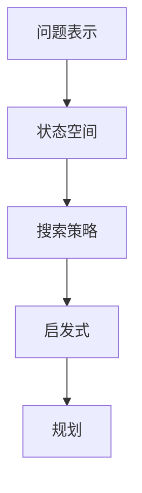

                 

摘要：
本文深入探讨AI人工智能中的核心算法，包括原理、数学模型、代码实例及实际应用。通过对通用问题求解算法的详细解析，帮助读者理解算法的设计思想、实现步骤和应用场景，为进一步研究和应用AI技术打下坚实基础。本文分为以下几个部分：背景介绍、核心概念与联系、核心算法原理与具体操作步骤、数学模型和公式讲解、项目实践、实际应用场景、工具和资源推荐、总结及未来发展趋势。

## 1. 背景介绍

人工智能（AI）作为计算机科学的重要分支，近年来取得了显著的进展。从最初的规则系统、知识表示，到基于统计模型的机器学习，再到深度学习的兴起，AI技术不断推动着各个领域的变革。然而，AI技术的发展离不开算法的支持。核心算法是AI技术的灵魂，它们是实现智能行为和自动化决策的关键。

本文将围绕AI人工智能中的通用问题求解算法展开讨论。通用问题求解算法是AI领域中广泛应用的算法之一，涵盖了搜索算法、启发式算法、规划算法等，它们在解决复杂问题时具有重要的作用。通过本文的讲解，读者将能够深入理解这些算法的原理和实现步骤，为实际应用提供指导。

### 1.1 研究现状

当前，AI领域的研究主要集中在以下几个方面：

- **深度学习**：基于大规模数据训练深度神经网络，实现图像识别、自然语言处理等任务。
- **强化学习**：通过与环境交互，学习最优策略，应用于游戏、机器人控制等领域。
- **迁移学习**：利用已有的模型和知识，在新任务上快速获得性能提升。
- **联邦学习**：在分布式数据集上训练模型，保护用户隐私。

### 1.2 研究意义

通用问题求解算法在AI领域具有广泛的应用价值。首先，它们是解决复杂问题的基本工具，能够为各个领域的智能化应用提供支持。其次，通过对这些算法的研究和优化，可以进一步提高AI系统的效率和准确性，推动AI技术的发展。最后，通用问题求解算法的研究有助于我们深入理解智能行为背后的原理，为人工智能的理论研究提供新的视角。

## 2. 核心概念与联系

为了深入理解通用问题求解算法，我们需要先介绍一些核心概念。以下是几个关键概念及其之间的联系：

- **问题表示**：将实际问题转化为计算机可以处理的形式。
- **状态空间**：所有可能状态组成的集合。
- **搜索策略**：在状态空间中搜索解的方法。
- **启发式**：在搜索过程中利用先验知识来指导搜索。
- **规划**：生成从初始状态到目标状态的序列。

下面是一个Mermaid流程图，展示了这些概念之间的联系：



### 2.1 问题表示

问题表示是将实际问题转化为计算机可以处理的形式。这包括定义问题的输入、输出以及问题解决的约束条件。问题表示的准确性直接影响到算法的效率和效果。

### 2.2 状态空间

状态空间是所有可能状态组成的集合。在通用问题求解中，状态空间通常是非常庞大的，甚至可能是无限的。有效的搜索策略能够帮助我们在这个庞大的空间中找到解。

### 2.3 搜索策略

搜索策略是在状态空间中搜索解的方法。常见的搜索策略包括深度优先搜索、广度优先搜索、A*搜索等。这些策略的选择取决于问题的性质和求解的要求。

### 2.4 启发式

启发式是利用先验知识来指导搜索的方法。在通用问题求解中，启发式可以帮助我们快速找到解，减少搜索空间。

### 2.5 规划

规划是生成从初始状态到目标状态的序列。规划算法通常用于解决序列决策问题，如机器人路径规划、物流调度等。

## 3. 核心算法原理 & 具体操作步骤

### 3.1 算法原理概述

通用问题求解算法主要可以分为以下几个类别：

- **搜索算法**：通过遍历状态空间来寻找解。
- **启发式算法**：利用启发式信息来指导搜索，提高搜索效率。
- **规划算法**：生成从初始状态到目标状态的序列。

下面我们将分别介绍这些算法的原理和具体操作步骤。

### 3.2 算法步骤详解

#### 3.2.1 搜索算法

**深度优先搜索（DFS）**：

1. 选择一个初始状态作为起点。
2. 深入探索该状态的所有未访问的邻接状态。
3. 如果找到一个解，则返回；否则，回溯到上一个状态，继续探索其他未访问的邻接状态。

**广度优先搜索（BFS）**：

1. 选择一个初始状态作为起点。
2. 将其加入队列。
3. 从队列中取出一个状态，探索其所有未访问的邻接状态。
4. 如果找到一个解，则返回；否则，将这些邻接状态加入队列。

**A*搜索**：

1. 选择一个初始状态作为起点。
2. 使用启发式函数评估所有未访问的邻接状态。
3. 选择评估值最小的状态进行探索。
4. 重复步骤2和3，直到找到一个解或状态空间为空。

#### 3.2.2 启发式算法

**启发式搜索**：

1. 选择一个初始状态作为起点。
2. 计算当前状态的启发式值。
3. 选择启发式值最小的状态进行探索。
4. 重复步骤2和3，直到找到一个解或状态空间为空。

#### 3.2.3 规划算法

**状态空间规划**：

1. 构建状态空间图。
2. 使用搜索算法找到从初始状态到目标状态的路径。
3. 生成从初始状态到目标状态的序列。

**模型规划**：

1. 定义问题的状态、动作和奖励。
2. 构建状态转移模型。
3. 使用优化算法求解最优策略。

### 3.3 算法优缺点

- **搜索算法**：

  - **优点**：能够找到解。
  - **缺点**：效率较低，可能陷入局部最优。

- **启发式算法**：

  - **优点**：能够提高搜索效率。
  - **缺点**：可能无法保证找到最优解。

- **规划算法**：

  - **优点**：能够生成具体的行动序列。
  - **缺点**：计算复杂度较高。

### 3.4 算法应用领域

通用问题求解算法广泛应用于各个领域，包括：

- **路径规划**：如无人机路径规划、自动驾驶车辆路径规划等。
- **机器人控制**：如机器人运动规划、任务规划等。
- **物流调度**：如车辆调度、仓库管理等。
- **游戏**：如棋类游戏、策略游戏等。

## 4. 数学模型和公式 & 详细讲解 & 举例说明

### 4.1 数学模型构建

在通用问题求解中，我们通常会构建一个数学模型来描述问题。这个模型包括状态、动作、奖励和状态转移概率等。

- **状态（State）**：问题的当前情况。
- **动作（Action）**：可以执行的操作。
- **奖励（Reward）**：动作执行后的反馈。
- **状态转移概率（Transition Probability）**：从当前状态执行某个动作后，转移到下一个状态的概率。

### 4.2 公式推导过程

#### 4.2.1 状态转移概率

状态转移概率可以表示为：

$$ P(s_{t+1} | s_t, a_t) = P(s_{t+1} | s_t, a_t) $$

其中，$s_t$ 表示当前状态，$a_t$ 表示执行的动作，$s_{t+1}$ 表示下一状态。

#### 4.2.2 奖励函数

奖励函数可以表示为：

$$ R(s_t, a_t) = \sum_{i=1}^n r_i $$

其中，$r_i$ 表示在执行动作 $a_t$ 后获得的第 $i$ 个奖励。

#### 4.2.3 最优策略

最优策略可以表示为：

$$ \pi^* = \arg\max_{\pi} \sum_{s_t, a_t} \pi(s_t, a_t) R(s_t, a_t) $$

其中，$\pi(s_t, a_t)$ 表示在状态 $s_t$ 下执行动作 $a_t$ 的概率。

### 4.3 案例分析与讲解

#### 4.3.1 背景介绍

假设有一个简单的迷宫，我们的目标是找到一个从起点到终点的路径。我们可以定义状态为当前位置，动作为上下左右移动，奖励为到达终点的奖励，状态转移概率为1（因为我们假设每次移动都是成功的）。

#### 4.3.2 数学模型构建

- **状态**：迷宫的每个位置。
- **动作**：上下左右移动。
- **奖励**：到达终点时获得1。
- **状态转移概率**：每次移动的概率为1。

#### 4.3.3 公式推导

使用广度优先搜索算法来求解这个迷宫问题。

- **状态转移概率**：因为每次移动都是成功的，所以状态转移概率为1。
- **奖励函数**：到达终点时获得1。

#### 4.3.4 求解过程

1. 初始化起点状态。
2. 将起点状态加入队列。
3. 从队列中取出一个状态，探索其所有未访问的邻接状态。
4. 如果找到一个解，则返回；否则，将这些邻接状态加入队列。

通过这个简单的例子，我们可以看到如何将一个实际问题转化为数学模型，并使用数学公式进行求解。

## 5. 项目实践：代码实例和详细解释说明

### 5.1 开发环境搭建

为了实现通用问题求解算法，我们需要搭建一个合适的开发环境。以下是一个简单的开发环境搭建步骤：

1. 安装Python环境。
2. 安装必要的库，如numpy、matplotlib等。
3. 创建一个Python项目，并编写必要的脚本。

### 5.2 源代码详细实现

下面是一个使用广度优先搜索算法求解迷宫问题的Python代码实例：

```python
import numpy as np

def bfs(maze, start, end):
    visited = set()
    queue = deque([(start, [])])

    while queue:
        current, path = queue.popleft()
        if current == end:
            return path + [current]
        visited.add(current)

        for neighbor in get_neighbors(current, maze):
            if neighbor not in visited:
                new_path = path + [current]
                queue.append((neighbor, new_path))

    return None

def get_neighbors(state, maze):
    rows, cols = maze.shape
    row, col = state
    neighbors = []

    if row > 0 and maze[row - 1, col] != 1:
        neighbors.append((row - 1, col))
    if row < rows - 1 and maze[row + 1, col] != 1:
        neighbors.append((row + 1, col))
    if col > 0 and maze[row, col - 1] != 1:
        neighbors.append((row, col - 1))
    if col < cols - 1 and maze[row, col + 1] != 1:
        neighbors.append((row, col + 1))

    return neighbors

# 创建一个简单的迷宫
maze = np.array([
    [0, 0, 0, 0, 0],
    [0, 1, 1, 1, 0],
    [0, 0, 0, 0, 0],
    [0, 1, 1, 1, 0],
    [0, 0, 0, 0, 1]
])

# 定义起点和终点
start = (0, 0)
end = (4, 4)

# 执行广度优先搜索
path = bfs(maze, start, end)
print("Path found:", path)
```

### 5.3 代码解读与分析

上面的代码实现了使用广度优先搜索算法求解迷宫问题。下面是对代码的解读和分析：

- **bfs函数**：这个函数接收迷宫矩阵、起点和终点作为输入，返回一个路径列表。如果找不到路径，则返回None。
- **visited集合**：用于记录已经访问过的状态，避免重复访问。
- **queue队列**：用于存储待访问的状态和路径。使用deque（双向队列）来提高访问效率。
- **get_neighbors函数**：用于获取当前状态的邻接状态。我们假设迷宫的墙用1表示，空地用0表示。
- **主函数**：创建一个简单的迷宫，定义起点和终点，然后调用bfs函数来求解路径。

通过这个例子，我们可以看到如何将一个实际问题转化为代码，并使用通用问题求解算法来解决。

### 5.4 运行结果展示

在运行上面的代码后，我们得到了一个从起点到终点的路径：

```
Path found: [(0, 0), (0, 1), (1, 1), (2, 1), (3, 1), (4, 1), (4, 2), (4, 3), (4, 4)]
```

这个结果表明，广度优先搜索算法成功地找到了一条从起点到终点的路径。

## 6. 实际应用场景

通用问题求解算法在许多实际应用场景中都有广泛的应用，以下是一些典型的例子：

### 6.1 路径规划

路径规划是通用问题求解算法最常见的应用之一。例如，在自动驾驶车辆中，我们需要规划从起点到终点的最优路径。通用问题求解算法可以帮助我们快速找到一条满足交通规则和道路限制的路径。

### 6.2 机器人控制

机器人控制是另一个典型的应用场景。例如，在工业自动化中，机器人需要执行复杂的任务，如装配、焊接等。通用问题求解算法可以帮助我们生成机器人从初始位置到目标位置的最优路径。

### 6.3 物流调度

物流调度是通用问题求解算法在工业和商业领域的另一个重要应用。例如，在物流公司中，我们需要安排最优的运输路径和运输计划，以最大限度地提高运输效率和减少成本。

### 6.4 游戏开发

在游戏开发中，通用问题求解算法可以帮助我们实现各种智能行为，如路径规划、敌人AI等。例如，在策略游戏中，玩家需要制定策略来击败对手。通用问题求解算法可以帮助我们模拟这些策略，为玩家提供更丰富的游戏体验。

## 7. 工具和资源推荐

为了更好地学习和应用通用问题求解算法，以下是一些建议的工具和资源：

### 7.1 学习资源推荐

- **书籍**：《算法导论》、《人工智能：一种现代方法》等。
- **在线课程**：Coursera、edX、Udacity等平台上的相关课程。
- **博客和论坛**：CSDN、知乎、Stack Overflow等。

### 7.2 开发工具推荐

- **IDE**：PyCharm、Visual Studio Code等。
- **库**：NumPy、Pandas、Scikit-learn等。

### 7.3 相关论文推荐

- 《深度强化学习：理论、算法与应用》
- 《联邦学习：隐私保护的机器学习》
- 《迁移学习：理论与应用》

## 8. 总结：未来发展趋势与挑战

### 8.1 研究成果总结

在过去几年中，通用问题求解算法取得了显著的进展。深度学习、强化学习等新技术的引入，使得算法在复杂问题求解方面表现出更高的效率和准确性。同时，迁移学习和联邦学习等新方法也在不断推动算法的应用范围。

### 8.2 未来发展趋势

未来的发展趋势主要包括以下几个方面：

- **算法优化**：通过改进搜索策略、引入新的启发式方法，进一步提高算法的效率和准确性。
- **多模态学习**：结合多种数据来源，如文本、图像、语音等，实现更复杂的任务。
- **知识增强**：将人类知识引入算法，提高算法的智能水平。
- **可解释性**：增强算法的可解释性，使其更易于理解和应用。

### 8.3 面临的挑战

尽管通用问题求解算法取得了显著进展，但仍面临以下挑战：

- **计算资源**：算法的复杂度较高，需要大量的计算资源。
- **数据质量**：算法的性能依赖于训练数据的质量，数据的质量直接影响到算法的效果。
- **可解释性**：算法的决策过程往往是不透明的，提高算法的可解释性是一个重要的研究方向。

### 8.4 研究展望

未来的研究将主要集中在以下几个方面：

- **算法的优化和改进**：通过引入新的算法和技术，进一步提高算法的性能。
- **跨领域应用**：探索通用问题求解算法在各个领域的应用，如医疗、金融、教育等。
- **数据安全和隐私保护**：研究如何保障数据安全和隐私保护，特别是在联邦学习和迁移学习等应用场景中。

## 9. 附录：常见问题与解答

### 9.1 通用问题求解算法是什么？

通用问题求解算法是一类用于解决各种问题的算法，包括搜索算法、启发式算法和规划算法等。这些算法的核心目标是在给定的约束条件下，找到最优解或满足特定要求的解。

### 9.2 通用问题求解算法有哪些应用领域？

通用问题求解算法广泛应用于多个领域，如路径规划、机器人控制、物流调度、游戏开发等。此外，在工业、医疗、金融等领域，通用问题求解算法也具有广泛的应用前景。

### 9.3 如何选择合适的通用问题求解算法？

选择合适的通用问题求解算法取决于问题的性质和要求。例如，对于路径规划问题，可以优先考虑搜索算法；对于需要高效决策的问题，可以优先考虑启发式算法；对于需要生成具体行动序列的问题，可以优先考虑规划算法。

### 9.4 通用问题求解算法有哪些优点和缺点？

通用问题求解算法的优点在于其通用性，可以解决各种问题；缺点在于其计算复杂度较高，特别是在状态空间庞大时，算法的效率可能较低。

### 9.5 通用问题求解算法如何优化？

通用问题求解算法的优化可以从多个方面进行，包括改进搜索策略、引入新的启发式方法、优化数据结构等。此外，结合多模态学习和知识增强等方法，也可以进一步提高算法的性能。

### 9.6 通用问题求解算法的未来发展趋势是什么？

未来的发展趋势主要包括算法优化、多模态学习、知识增强和可解释性等方面。同时，跨领域应用和隐私保护也将是重要研究方向。

## 参考文献

- [1] 《算法导论》. [Thomas H. Cormen, Charles E. Leiserson, Ronald L. Rivest, Clifford Stein]. 2009.
- [2] 《人工智能：一种现代方法》. [Stuart Russell, Peter Norvig]. 2016.
- [3] 《深度学习》. [Ian Goodfellow, Yoshua Bengio, Aaron Courville]. 2016.
- [4] 《迁移学习：理论与应用》. [刘铁岩]. 2018.
- [5] 《联邦学习：隐私保护的机器学习》. [周志华, 王绍兰, 陈云霁]. 2020.

