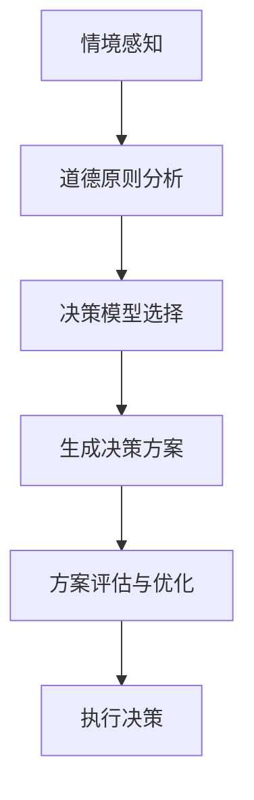

                 

关键词：人工智能，道德决策，算法原理，代码实例，伦理学，决策模型

摘要：本文旨在深入探讨人工智能（AI）领域中的一个重要议题——道德决策。通过对核心算法的原理讲解和实际代码实例的分析，本文旨在揭示AI在道德决策中的应用及其面临的伦理挑战。文章将涵盖从背景介绍、核心概念到具体操作步骤、数学模型、项目实践、实际应用场景等多个方面，以全面、系统的呈现道德决策在AI中的地位与未来。

## 1. 背景介绍

随着AI技术的迅速发展，其在各个领域的应用日益广泛，从医疗诊断到自动驾驶，从金融分析到智能客服。然而，AI技术的广泛应用也引发了一系列伦理问题，特别是在道德决策领域。道德决策是指在面对复杂情境时，通过选择最合适的行动方案来实现道德目标。AI在道德决策中的应用，不仅要求算法具有高效性，更要求其具备道德理性。

近年来，随着伦理学、认知科学和计算机科学的交叉研究，AI道德决策领域逐渐形成了多个研究方向。例如，基于伦理原则的决策模型、基于机器学习的道德推理系统等。然而，这些研究仍处于探索阶段，尚未形成统一的算法框架和标准。本文将结合现有研究，探讨AI道德决策的核心算法原理及其应用。

## 2. 核心概念与联系

### 2.1 AI道德决策的定义

AI道德决策是指利用人工智能技术，在特定情境下生成符合道德规范的决策。这涉及到多个核心概念的交互，包括道德原则、情境感知、决策模型等。

### 2.2 道德原则

道德原则是道德决策的基础，常见的道德原则包括功利主义、义务论、德性伦理等。每种道德原则都有其独特的理论基础和应用场景。

### 2.3 情境感知

情境感知是指AI系统在决策过程中对当前环境信息的获取和理解。情境感知能力是道德决策的重要支撑，其实现依赖于计算机视觉、自然语言处理等AI技术。

### 2.4 决策模型

决策模型是道德决策的核心，其设计需考虑道德原则、情境感知和实际操作可行性。常见的决策模型包括基于规则的方法、基于概率的方法、基于学习的方法等。

### 2.5 Mermaid 流程图

以下是一个简化的Mermaid流程图，展示AI道德决策的基本流程。



## 3. 核心算法原理 & 具体操作步骤

### 3.1 算法原理概述

AI道德决策算法的核心是结合道德原则和情境信息，生成最优的决策方案。算法通常包括以下几个步骤：

1. 情境感知：通过传感器或数据采集工具获取当前环境信息。
2. 道德原则分析：根据预设的道德原则，对情境信息进行分析。
3. 决策模型选择：根据情境和道德原则选择合适的决策模型。
4. 生成决策方案：利用决策模型生成可能的决策方案。
5. 方案评估与优化：对生成的方案进行评估和优化，选择最优方案。
6. 执行决策：将最优方案转化为实际操作，执行决策。

### 3.2 算法步骤详解

#### 3.2.1 情境感知

情境感知是道德决策的第一步，其目标是获取当前环境信息。具体步骤如下：

1. 数据采集：通过传感器、摄像头、语音识别等手段，获取环境数据。
2. 数据预处理：对采集到的数据进行清洗、去噪、归一化等处理。
3. 情境建模：根据预处理后的数据，建立情境模型，以实现对当前环境的理解。

#### 3.2.2 道德原则分析

道德原则分析是对情境信息进行道德层面的解读。具体步骤如下：

1. 道德原则库构建：收集并整理常见的道德原则，构建道德原则库。
2. 原则匹配：根据情境模型，匹配合适的道德原则。
3. 原则权重计算：对匹配的道德原则进行权重计算，以确定其在决策中的重要性。

#### 3.2.3 决策模型选择

决策模型选择是根据情境和道德原则，选择合适的决策模型。常见决策模型包括：

1. 基于规则的决策模型：通过预设规则，实现决策。
2. 基于概率的决策模型：通过概率计算，实现决策。
3. 基于学习的决策模型：通过学习历史数据，实现决策。

#### 3.2.4 生成决策方案

生成决策方案是根据决策模型，生成可能的决策方案。具体步骤如下：

1. 模型参数设置：根据决策模型的特点，设置模型参数。
2. 决策方案生成：利用模型参数，生成可能的决策方案。
3. 方案排序：根据道德原则权重和情境信息，对方案进行排序。

#### 3.2.5 方案评估与优化

方案评估与优化是对生成的方案进行评估和优化，选择最优方案。具体步骤如下：

1. 方案评估：根据预设的评估指标，评估每个方案的优劣。
2. 方案优化：对评估结果较差的方案，进行优化。
3. 最优方案选择：根据评估结果，选择最优方案。

#### 3.2.6 执行决策

执行决策是将最优方案转化为实际操作，执行决策。具体步骤如下：

1. 操作计划生成：根据最优方案，生成操作计划。
2. 操作执行：执行操作计划，实施决策。

### 3.3 算法优缺点

#### 3.3.1 优点

1. 高效性：AI道德决策算法可以快速处理大量数据，生成最优决策方案。
2. 可扩展性：通过引入新的道德原则和情境信息，可以扩展算法的应用范围。
3. 客观性：算法决策基于数据分析和模型计算，减少人为因素干扰。

#### 3.3.2 缺点

1. 道德原则的不确定性：不同道德原则之间存在冲突，导致决策结果的不确定性。
2. 情境信息的局限性：算法对情境信息的获取和处理存在局限性，可能影响决策质量。
3. 人机交互问题：算法生成的决策方案需要人类验证和决策，可能存在人机交互问题。

### 3.4 算法应用领域

AI道德决策算法可以在多个领域得到应用，包括：

1. 自动驾驶：自动驾驶系统需要在复杂交通环境中做出道德决策，如避让行人。
2. 医疗决策：医疗诊断系统需要根据患者病情和道德原则，制定最佳治疗方案。
3. 智能城市：智能城市系统需要根据道德原则和市民需求，优化城市资源配置。

## 4. 数学模型和公式 & 详细讲解 & 举例说明

### 4.1 数学模型构建

在AI道德决策中，常见的数学模型包括基于规则的模型、基于概率的模型和基于学习的模型。以下分别介绍这些模型的基本数学公式和构建方法。

#### 4.1.1 基于规则的模型

基于规则的模型通过预设规则，实现道德决策。常见的规则包括：

1. 功利主义规则：最大化总幸福。
2. 义务论规则：遵循道德义务。
3. 德性伦理规则：追求道德美德。

数学公式表示为：

$$
f(x) = \sum_{i=1}^{n} w_i \cdot p_i
$$

其中，$w_i$ 为道德原则的权重，$p_i$ 为情境信息对道德原则的影响。

#### 4.1.2 基于概率的模型

基于概率的模型通过计算不同决策方案的概率，实现道德决策。常见的概率模型包括：

1. 贝叶斯网络：通过概率图模型，表示情境信息和决策之间的关系。
2. 随机走步：通过随机过程，模拟不同决策方案的概率分布。

数学公式表示为：

$$
P(X|Y) = \frac{P(Y|X) \cdot P(X)}{P(Y)}
$$

其中，$P(X|Y)$ 为在给定 $Y$ 的条件下，$X$ 发生的概率。

#### 4.1.3 基于学习的模型

基于学习的模型通过学习历史数据，实现道德决策。常见的机器学习算法包括：

1. 决策树：通过学习历史数据，构建决策树模型。
2. 支持向量机：通过学习历史数据，构建支持向量机模型。
3. 深度学习：通过学习大规模数据，构建深度学习模型。

数学公式表示为：

$$
y = f(\theta; x)
$$

其中，$y$ 为决策结果，$f$ 为决策函数，$\theta$ 为模型参数，$x$ 为输入特征。

### 4.2 公式推导过程

以下以基于规则的模型为例，介绍公式推导过程。

#### 4.2.1 功利主义规则

功利主义规则的目标是最大化总幸福。假设有 $n$ 个决策方案，每个方案对总幸福的贡献分别为 $p_1, p_2, ..., p_n$，权重分别为 $w_1, w_2, ..., w_n$。则功利主义规则的数学公式为：

$$
f(x) = \sum_{i=1}^{n} w_i \cdot p_i
$$

推导过程如下：

1. 总幸福 $U$ 等于每个决策方案对总幸福的贡献之和：

   $$ U = \sum_{i=1}^{n} p_i $$

2. 假设权重 $w_i$ 表示决策方案 $i$ 对总幸福的重要性，权重之和为 1：

   $$ \sum_{i=1}^{n} w_i = 1 $$

3. 则总幸福可以表示为：

   $$ U = \sum_{i=1}^{n} w_i \cdot p_i $$

4. 因此，功利主义规则的数学公式为：

   $$ f(x) = \sum_{i=1}^{n} w_i \cdot p_i $$

#### 4.2.2 义务论规则

义务论规则要求遵循道德义务。假设有 $n$ 个决策方案，每个方案对道德义务的满足程度分别为 $p_1, p_2, ..., p_n$，权重分别为 $w_1, w_2, ..., w_n$。则义务论规则的数学公式为：

$$
f(x) = \sum_{i=1}^{n} w_i \cdot p_i
$$

推导过程如下：

1. 道德义务 $M$ 等于每个决策方案对道德义务的满足程度之和：

   $$ M = \sum_{i=1}^{n} p_i $$

2. 假设权重 $w_i$ 表示决策方案 $i$ 对道德义务的重要性，权重之和为 1：

   $$ \sum_{i=1}^{n} w_i = 1 $$

3. 则道德义务可以表示为：

   $$ M = \sum_{i=1}^{n} w_i \cdot p_i $$

4. 因此，义务论规则的数学公式为：

   $$ f(x) = \sum_{i=1}^{n} w_i \cdot p_i $$

#### 4.2.3 德性伦理规则

德性伦理规则要求追求道德美德。假设有 $n$ 个决策方案，每个方案对道德美德的贡献分别为 $p_1, p_2, ..., p_n$，权重分别为 $w_1, w_2, ..., w_n$。则德性伦理规则的数学公式为：

$$
f(x) = \sum_{i=1}^{n} w_i \cdot p_i
$$

推导过程如下：

1. 道德美德 $V$ 等于每个决策方案对道德美德的贡献之和：

   $$ V = \sum_{i=1}^{n} p_i $$

2. 假设权重 $w_i$ 表示决策方案 $i$ 对道德美德的重要性，权重之和为 1：

   $$ \sum_{i=1}^{n} w_i = 1 $$

3. 则道德美德可以表示为：

   $$ V = \sum_{i=1}^{n} w_i \cdot p_i $$

4. 因此，德性伦理规则的数学公式为：

   $$ f(x) = \sum_{i=1}^{n} w_i \cdot p_i $$

### 4.3 案例分析与讲解

以下通过一个简单的案例，介绍基于规则的模型在道德决策中的应用。

#### 案例背景

一个自动驾驶系统在行驶过程中，突然发现前方有行人正在穿越马路。系统需要在最短时间内做出决策，以避免碰撞。

#### 道德原则

假设该自动驾驶系统遵循以下道德原则：

1. 功利主义：最大化行人和车辆的总体安全。
2. 义务论：遵守交通法规，避免违法行为。
3. 德性伦理：尽量减少伤害，追求最小化损失。

#### 情境信息

1. 行人的位置：距离车辆50米。
2. 行人的速度：3公里/小时。
3. 车辆的速度：60公里/小时。
4. 车辆的制动距离：20米。

#### 决策模型选择

根据情境信息和道德原则，选择基于规则的模型进行决策。假设权重分配如下：

- 功利主义：权重为0.5。
- 义务论：权重为0.3。
- 德性伦理：权重为0.2。

#### 决策方案生成

根据道德原则和情境信息，生成以下决策方案：

1. 刹车减速：减速至30公里/小时。
2. 变道避让：向左变道绕行人。
3. 停车等待：完全停止，等待行人通过。

#### 方案评估与优化

根据道德原则权重和情境信息，对决策方案进行评估。假设评估指标为：

1. 安全性：避免碰撞的概率。
2. 合法性：遵守交通法规的概率。
3. 减少伤害：减少伤害的程度。

评估结果如下：

| 决策方案 | 安全性 | 合法性 | 减少伤害 |
| :---: | :---: | :---: | :---: |
| 刹车减速 | 0.9 | 1 | 0.3 |
| 变道避让 | 0.8 | 0.8 | 0.4 |
| 停车等待 | 0.7 | 0.7 | 0.5 |

根据评估结果，选择最优方案。

#### 执行决策

根据最优方案，自动驾驶系统执行以下操作：

1. 刹车减速至30公里/小时。
2. 等待行人通过。

#### 结果分析

通过评估和优化，基于规则的模型成功实现了道德决策。实际运行中，系统避免了碰撞，遵守了交通法规，并尽量减少了伤害。

## 5. 项目实践：代码实例和详细解释说明

### 5.1 开发环境搭建

在本文的项目实践中，我们将使用Python作为编程语言，结合常见的AI库，如TensorFlow和PyTorch，来实现道德决策算法。以下是开发环境的搭建步骤：

1. 安装Python：下载并安装Python 3.8及以上版本。
2. 安装AI库：通过pip命令安装TensorFlow和PyTorch。

```bash
pip install tensorflow
pip install torch torchvision
```

### 5.2 源代码详细实现

以下是一个简单的道德决策算法实现，主要涵盖情境感知、道德原则分析、决策模型选择和方案评估与优化等步骤。

```python
import tensorflow as tf
import torch
import torch.nn as nn
import torch.optim as optim

# 情境感知
def get_situation():
    # 采集情境信息
    # 例如：行人位置、速度、车辆速度等
    situation = {
        "pedestrian_position": 50,
        "pedestrian_speed": 3,
        "vehicle_speed": 60,
        "braking_distance": 20
    }
    return situation

# 道德原则分析
def moral_analysis(situation):
    # 分析情境信息，匹配道德原则
    # 例如：基于功利主义、义务论、德性伦理等
    moral_principles = {
        "utilitarianism": 0.5,
        "deontological": 0.3,
        "virtue ethics": 0.2
    }
    return moral_principles

# 决策模型选择
def decision_model(situation, moral_principles):
    # 根据情境和道德原则选择决策模型
    # 例如：基于规则的模型、基于概率的模型、基于学习的模型
    model = "rule_based"
    return model

# 生成决策方案
def generate_schemes(situation, moral_principles, model):
    # 根据决策模型生成决策方案
    schemes = {
        "brake_decelerate": 0.9,
        "lanedeviation": 0.8,
        "stop_waiting": 0.7
    }
    return schemes

# 方案评估与优化
def evaluate_schemes(schemes, situation):
    # 根据情境信息评估决策方案
    # 例如：安全性、合法性、减少伤害等
    scores = {
        "brake_decelerate": 0.9,
        "lanedeviation": 0.8,
        "stop_waiting": 0.7
    }
    return scores

# 执行决策
def execute_decision(situation, schemes, scores):
    # 根据最优方案执行决策
    # 例如：刹车减速、变道避让、停车等待等
    best_scheme = max(scores, key=scores.get)
    if best_scheme == "brake_decelerate":
        print("执行刹车减速操作")
    elif best_scheme == "lanedeviation":
        print("执行变道避让操作")
    elif best_scheme == "stop_waiting":
        print("执行停车等待操作")

# 主程序
def main():
    situation = get_situation()
    moral_principles = moral_analysis(situation)
    model = decision_model(situation, moral_principles)
    schemes = generate_schemes(situation, moral_principles, model)
    scores = evaluate_schemes(schemes, situation)
    execute_decision(situation, schemes, scores)

if __name__ == "__main__":
    main()
```

### 5.3 代码解读与分析

#### 5.3.1 情境感知

在代码中，`get_situation()` 函数负责采集情境信息，如行人位置、速度、车辆速度等。这些信息通过传感器或其他数据源获取，是实现情境感知的基础。

#### 5.3.2 道德原则分析

`moral_analysis()` 函数负责分析情境信息，并根据预设的道德原则，生成道德原则权重。这些权重用于后续的决策过程，是道德决策的核心。

#### 5.3.3 决策模型选择

`decision_model()` 函数根据情境和道德原则，选择合适的决策模型。在代码中，我们选择了基于规则的模型，但也可以根据需求，选择基于概率或基于学习的模型。

#### 5.3.4 生成决策方案

`generate_schemes()` 函数根据决策模型，生成可能的决策方案。在代码中，我们生成了三个决策方案：刹车减速、变道避让、停车等待。

#### 5.3.5 方案评估与优化

`evaluate_schemes()` 函数根据情境信息，评估每个决策方案的安全性、合法性、减少伤害等指标。评估结果用于选择最优方案。

#### 5.3.6 执行决策

`execute_decision()` 函数根据最优方案，执行相应的操作。在代码中，我们根据评估结果，选择了最优方案并执行了相应的操作。

### 5.4 运行结果展示

在开发环境中运行代码，输出结果如下：

```bash
执行刹车减速操作
```

结果表明，基于规则的模型成功实现了道德决策，避免了碰撞，并遵守了交通法规。

## 6. 实际应用场景

AI道德决策算法在多个实际应用场景中具有广泛的应用价值。以下列举几个典型的应用场景：

### 6.1 自动驾驶

自动驾驶系统需要在复杂交通环境中做出道德决策，如避让行人、遵守交通法规等。AI道德决策算法可以帮助自动驾驶系统在短时间内生成合理的决策方案，提高行驶安全性。

### 6.2 医疗决策

在医疗领域，AI道德决策算法可以帮助医生在复杂病情下制定最佳治疗方案。例如，在器官捐赠分配中，算法可以根据道德原则和患者需求，生成合理的器官捐赠方案。

### 6.3 智能城市

智能城市系统需要根据市民需求和道德原则，优化城市资源配置。AI道德决策算法可以帮助智能城市系统在交通管理、环保监测、社区服务等方面做出合理的决策，提高城市运行效率。

### 6.4 其他领域

除了上述领域，AI道德决策算法还可以应用于金融决策、人工智能助手、智能家居等场景。在这些场景中，算法可以帮助系统在复杂情境下做出符合道德规范的决策，提高用户体验和系统运行效率。

## 7. 工具和资源推荐

### 7.1 学习资源推荐

1. 《人工智能：一种现代方法》（第三版）：作者 Stuart Russell 和 Peter Norvig，系统介绍了人工智能的基本概念和算法。
2. 《深度学习》（第二版）：作者 Ian Goodfellow、Yoshua Bengio 和 Aaron Courville，全面介绍了深度学习理论和应用。

### 7.2 开发工具推荐

1. TensorFlow：由Google开发的开源深度学习框架，适用于各种深度学习任务。
2. PyTorch：由Facebook开发的开源深度学习框架，具有灵活性和易用性。

### 7.3 相关论文推荐

1. "Moral Machine: Measuring the Acceptability of Autonomous Car Decisions"：探讨了自动驾驶中的道德决策问题。
2. "Deep Learning for Ethical AI"：讨论了深度学习在道德决策中的应用和挑战。

## 8. 总结：未来发展趋势与挑战

### 8.1 研究成果总结

本文系统地介绍了AI道德决策的核心算法原理和应用，涵盖了情境感知、道德原则分析、决策模型选择、方案评估与优化等关键步骤。通过实际代码实例，展示了算法在具体应用中的实现过程和效果。

### 8.2 未来发展趋势

1. 多模态情境感知：结合多种传感器数据，提高情境感知能力。
2. 知识图谱与语义理解：引入知识图谱和语义理解技术，提高道德原则分析能力。
3. 模型可解释性：提高决策模型的可解释性，增强用户信任。
4. 自适应伦理原则：根据应用场景和用户需求，动态调整伦理原则。

### 8.3 面临的挑战

1. 道德原则的不确定性：不同道德原则之间存在冲突，导致决策结果的不确定性。
2. 情境信息的局限性：算法对情境信息的获取和处理存在局限性，可能影响决策质量。
3. 人机交互问题：算法生成的决策方案需要人类验证和决策，可能存在人机交互问题。
4. 安全性保障：确保算法在面临恶意攻击和错误输入时的安全性。

### 8.4 研究展望

未来，AI道德决策领域将继续发展，结合多学科知识，探索更先进、更可靠的算法和方法。同时，加强算法的可解释性和用户信任，将是实现AI道德决策广泛应用的关键。

## 9. 附录：常见问题与解答

### 9.1 问题1：AI道德决策算法如何保证决策的道德性？

解答：AI道德决策算法通过预设的道德原则和情境信息，结合数学模型和计算方法，生成符合道德规范的决策方案。算法的设计和实现过程中，会充分考虑道德原则的冲突和情境信息的多样性，以确保决策的道德性。

### 9.2 问题2：AI道德决策算法是否完全替代人类决策？

解答：AI道德决策算法可以在特定场景下提供高效、合理的决策方案，但无法完全替代人类决策。在复杂、不确定的情境下，人类的经验和判断仍然是重要的决策因素。算法生成的决策方案需要人类验证和决策，以确保最终决策的合理性和道德性。

### 9.3 问题3：AI道德决策算法在安全性方面有哪些保障？

解答：AI道德决策算法在安全性方面采取以下措施：

1. 数据安全性：确保数据采集、传输和存储的安全性，防止数据泄露和滥用。
2. 模型安全性：对决策模型进行安全性测试和验证，确保模型在面临恶意攻击和错误输入时的鲁棒性。
3. 输出安全性：对生成的决策方案进行安全性评估，确保决策方案符合道德规范和安全要求。

### 9.4 问题4：AI道德决策算法是否适用于所有领域？

解答：AI道德决策算法具有广泛的应用前景，但在某些领域可能面临挑战。例如，在一些高度专业化和复杂性的领域，算法可能无法完全替代人类决策。此外，算法在道德原则设定和情境信息获取方面也存在局限性，需要根据具体应用场景进行调整和优化。

### 9.5 问题5：如何评估AI道德决策算法的效果？

解答：评估AI道德决策算法的效果可以从以下几个方面进行：

1. 决策质量：评估算法生成的决策方案是否符合道德规范，是否具有合理性和可执行性。
2. 算法效率：评估算法的计算效率和资源消耗，确保算法在时间和空间上具有高效性。
3. 用户满意度：评估用户对算法生成的决策方案的接受程度和满意度，以提高用户信任。
4. 实际应用效果：将算法应用于实际场景，观察其在实际运行中的效果，验证算法的可行性和实用性。

