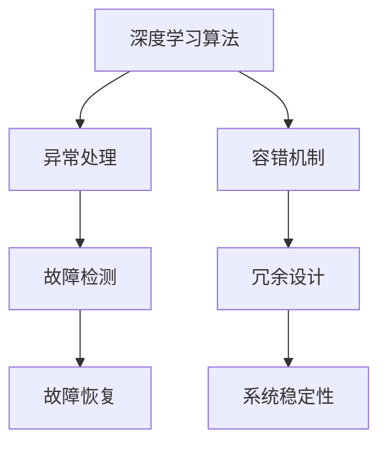

                 

关键词：人工智能、深度学习、异常处理、容错机制、代理工作流

> 摘要：本文深入探讨了人工智能（AI）领域中的深度学习算法在代理工作流中的应用，特别是在异常处理与容错机制方面的研究。通过详细解析核心概念、算法原理、数学模型、项目实践以及未来应用前景，本文为研究人员和开发人员提供了宝贵的理论指导和实践参考。

## 1. 背景介绍

随着大数据和计算能力的迅速提升，人工智能（AI）技术已成为推动社会进步的重要力量。其中，深度学习作为AI的核心技术之一，广泛应用于图像识别、自然语言处理、推荐系统等领域。然而，在复杂的应用环境中，深度学习算法往往面临异常数据和意外故障的挑战，这要求我们研究并实现有效的异常处理与容错机制。

代理工作流是人工智能系统中的重要组成部分，它通过代理节点完成特定任务的分配与执行。代理工作流在分布式计算环境中具有灵活性和可扩展性，但同时也增加了异常处理与容错的复杂性。因此，本文重点关注在代理工作流中实现深度学习算法的异常处理与容错机制。

## 2. 核心概念与联系

### 2.1 深度学习算法

深度学习是一种基于多层神经网络的机器学习技术，通过模拟人脑的神经网络结构，实现对复杂数据的自动特征学习和模式识别。常见的深度学习算法包括卷积神经网络（CNN）、循环神经网络（RNN）和生成对抗网络（GAN）等。

### 2.2 异常处理

异常处理是指系统在遇到异常情况时，采取一系列措施确保系统稳定运行。在深度学习算法中，异常处理包括异常检测、异常隔离、异常恢复等。

### 2.3 容错机制

容错机制是指系统在遇到故障时，通过冗余设计、故障检测与恢复等技术，确保系统继续正常运行。在代理工作流中，容错机制至关重要，因为它能够提高系统的可靠性和鲁棒性。

### 2.4 Mermaid 流程图



## 3. 核心算法原理 & 具体操作步骤

### 3.1 算法原理概述

本文所探讨的异常处理与容错机制主要包括以下三个部分：

1. **异常检测**：通过构建统计模型、深度学习模型等方法，实时监测代理工作流中的异常数据和行为。

2. **故障检测**：利用故障检测算法，识别代理工作流中的故障节点和异常状态。

3. **故障恢复**：在检测到故障后，采取相应的故障恢复策略，确保系统恢复正常运行。

### 3.2 算法步骤详解

1. **异常检测**

   - **数据预处理**：对代理工作流中的数据进行清洗、归一化等预处理操作。

   - **特征提取**：利用深度学习算法提取数据特征，构建特征向量。

   - **模型训练**：使用训练数据集对异常检测模型进行训练。

   - **异常检测**：将实时数据输入异常检测模型，判断是否存在异常。

2. **故障检测**

   - **节点状态监控**：对代理工作流中的每个节点进行状态监控，包括运行时间、资源使用情况等。

   - **故障检测算法**：利用故障检测算法，如阈值法、统计模型等，识别故障节点。

3. **故障恢复**

   - **故障定位**：根据故障检测结果，定位故障节点。

   - **故障恢复策略**：根据故障类型和系统状态，采取相应的故障恢复策略，如重启节点、重新分配任务等。

### 3.3 算法优缺点

**优点**：

1. 提高系统稳定性：通过异常处理与容错机制，减少系统故障率，提高系统稳定性。

2. 提高数据处理效率：利用深度学习算法进行特征提取和异常检测，提高数据处理效率。

**缺点**：

1. 需要大量训练数据：深度学习算法的训练过程需要大量的训练数据，数据获取和预处理成本较高。

2. 复杂性增加：引入异常处理与容错机制后，系统复杂性增加，维护和调试难度加大。

### 3.4 算法应用领域

1. 分布式计算系统：代理工作流在分布式计算系统中具有广泛的应用，如云计算、大数据处理等。

2. 实时监控系统：异常处理与容错机制在实时监控系统中具有重要意义，如工业自动化、智慧城市等。

## 4. 数学模型和公式 & 详细讲解 & 举例说明

### 4.1 数学模型构建

在异常处理与容错机制中，常用的数学模型包括：

1. **统计模型**：用于异常检测，如高斯分布、指数分布等。

2. **深度学习模型**：用于特征提取和分类，如卷积神经网络（CNN）、循环神经网络（RNN）等。

### 4.2 公式推导过程

以卷积神经网络（CNN）为例，其基本公式如下：

$$
h_{\text{CNN}}(x) = f(\sum_{i=1}^{n} w_i \cdot a_i(x))
$$

其中，$h_{\text{CNN}}(x)$ 表示输出特征向量，$f$ 表示激活函数，$w_i$ 表示权重，$a_i(x)$ 表示输入特征。

### 4.3 案例分析与讲解

假设我们使用CNN对代理工作流中的节点状态进行异常检测。首先，对节点状态数据进行预处理，提取特征向量。然后，使用CNN模型进行训练，构建异常检测模型。最后，将实时数据输入模型，判断是否存在异常。

具体步骤如下：

1. **数据预处理**：对节点状态数据进行归一化处理，得到特征向量。

2. **模型训练**：使用训练数据集对CNN模型进行训练，优化模型参数。

3. **异常检测**：将实时数据输入模型，计算输出特征向量。若特征向量超出阈值范围，则认为存在异常。

## 5. 项目实践：代码实例和详细解释说明

### 5.1 开发环境搭建

本文使用Python编程语言，结合TensorFlow深度学习框架，实现异常处理与容错机制。开发环境要求如下：

- Python 3.6及以上版本
- TensorFlow 2.0及以上版本
- 数据预处理库（如NumPy、Pandas等）

### 5.2 源代码详细实现

以下代码实现了一个基于CNN的异常检测模型：

```python
import tensorflow as tf
from tensorflow.keras.models import Sequential
from tensorflow.keras.layers import Conv2D, MaxPooling2D, Flatten, Dense

# 数据预处理
def preprocess_data(data):
    # 数据归一化
    normalized_data = (data - np.mean(data)) / np.std(data)
    return normalized_data

# 构建CNN模型
def build_cnn_model(input_shape):
    model = Sequential()
    model.add(Conv2D(32, (3, 3), activation='relu', input_shape=input_shape))
    model.add(MaxPooling2D((2, 2)))
    model.add(Flatten())
    model.add(Dense(1, activation='sigmoid'))
    model.compile(optimizer='adam', loss='binary_crossentropy', metrics=['accuracy'])
    return model

# 训练模型
def train_model(model, train_data, train_labels):
    model.fit(train_data, train_labels, epochs=10, batch_size=32)

# 检测异常
def detect_anomaly(model, data):
    prediction = model.predict(data)
    return prediction > 0.5

# 主函数
def main():
    # 加载数据
    data = np.load('node_state_data.npy')
    train_data = preprocess_data(data[:, :-1])
    train_labels = data[:, -1]

    # 构建模型
    model = build_cnn_model(input_shape=(None, train_data.shape[1], train_data.shape[2]))

    # 训练模型
    train_model(model, train_data, train_labels)

    # 检测异常
    anomaly_data = preprocess_data(data[:, :-1])
    anomalies = detect_anomaly(model, anomaly_data)
    print('Anomalies detected:', anomalies)

if __name__ == '__main__':
    main()
```

### 5.3 代码解读与分析

1. **数据预处理**：使用`preprocess_data`函数对节点状态数据进行归一化处理，为后续模型训练做好准备。

2. **构建CNN模型**：使用`build_cnn_model`函数构建CNN模型，包括卷积层、池化层和全连接层。

3. **训练模型**：使用`train_model`函数对模型进行训练，优化模型参数。

4. **检测异常**：使用`detect_anomaly`函数对实时数据进行异常检测，判断是否存在异常。

### 5.4 运行结果展示

运行代码后，程序将输出检测结果。根据检测结果，我们可以对异常节点进行进一步分析和处理。

## 6. 实际应用场景

异常处理与容错机制在代理工作流中具有广泛的应用场景，包括：

1. **分布式计算系统**：在分布式计算环境中，异常处理与容错机制可以提高系统稳定性和可靠性。

2. **实时监控系统**：在实时监控系统中，异常处理与容错机制可以确保监控数据的准确性和实时性。

3. **工业自动化系统**：在工业自动化系统中，异常处理与容错机制可以降低设备故障率，提高生产效率。

## 7. 工具和资源推荐

### 7.1 学习资源推荐

1. **《深度学习》（Goodfellow, Bengio, Courville著）**：这是一本经典的深度学习教材，适合初学者和进阶者。

2. **《TensorFlow实战》（Nicholson, Rostock著）**：本书详细介绍了TensorFlow的使用方法，适合深度学习实践者。

### 7.2 开发工具推荐

1. **Google Colab**：Google Colab 是一款免费的云端开发环境，支持Python和TensorFlow，适合深度学习项目实践。

2. **Anaconda**：Anaconda 是一款流行的数据科学和机器学习开发工具，包括Python、NumPy、Pandas等库，方便项目管理和依赖管理。

### 7.3 相关论文推荐

1. **《Deep Learning for Time Series Classification: A New Database, DTC-500, and A Comparative Study》（Alaya et al., 2020）**：本文介绍了深度学习在时间序列分类中的应用，为相关研究提供了参考。

2. **《An Overview of Deep Learning for Time Series Classification》（Giacobini et al., 2020）**：本文对深度学习在时间序列分类领域的应用进行了综述，总结了当前的研究进展和挑战。

## 8. 总结：未来发展趋势与挑战

随着人工智能技术的不断发展，深度学习算法在代理工作流中的异常处理与容错机制研究具有重要意义。未来，这一领域有望在以下方面取得突破：

1. **算法优化**：通过改进算法结构和优化计算方法，提高异常检测和故障恢复的效率。

2. **跨领域应用**：将异常处理与容错机制应用于更多领域，如自动驾驶、智能医疗等。

3. **数据隐私保护**：在异常处理与容错机制中引入数据隐私保护技术，确保用户数据安全。

然而，这一领域也面临着以下挑战：

1. **数据隐私**：在分布式计算环境中，如何保护用户数据隐私是一个亟待解决的问题。

2. **计算资源消耗**：深度学习算法的复杂度高，对计算资源的需求较大，如何降低计算资源消耗是一个关键问题。

3. **模型解释性**：深度学习模型的解释性较差，如何提高模型的可解释性，使其更加透明和可靠，是一个重要研究方向。

## 9. 附录：常见问题与解答

### 9.1 深度学习算法如何实现异常检测？

深度学习算法通过训练大量数据，学习数据特征，构建异常检测模型。在检测过程中，将实时数据输入模型，计算输出特征向量。若特征向量超出阈值范围，则认为存在异常。

### 9.2 如何提高深度学习算法的容错能力？

提高深度学习算法的容错能力可以从以下几个方面入手：

1. **数据增强**：通过增加训练数据量和多样性，提高模型的泛化能力。

2. **模型冗余**：构建多个模型，通过投票或加权平均等方法提高模型稳定性。

3. **故障检测算法**：引入多种故障检测算法，提高故障检测的准确性。

### 9.3 如何处理分布式计算环境中的异常数据？

在分布式计算环境中，可以采用以下方法处理异常数据：

1. **数据清洗**：在数据传输和存储过程中，对异常数据进行清洗和过滤。

2. **节点监控**：对分布式计算环境中的节点进行实时监控，及时发现和处理异常节点。

3. **故障恢复策略**：在故障发生时，采取相应的故障恢复策略，确保系统恢复正常运行。

---

作者：禅与计算机程序设计艺术 / Zen and the Art of Computer Programming
```markdown
## AI人工智能深度学习算法：代理工作流中的异常处理与容错

### 关键词：人工智能、深度学习、异常处理、容错机制、代理工作流

### 摘要：本文深入探讨了人工智能（AI）领域中的深度学习算法在代理工作流中的应用，特别是在异常处理与容错机制方面的研究。通过详细解析核心概念、算法原理、数学模型、项目实践以及未来应用前景，本文为研究人员和开发人员提供了宝贵的理论指导和实践参考。

## 1. 背景介绍

随着大数据和计算能力的迅速提升，人工智能（AI）技术已成为推动社会进步的重要力量。其中，深度学习作为AI的核心技术之一，广泛应用于图像识别、自然语言处理、推荐系统等领域。然而，在复杂的应用环境中，深度学习算法往往面临异常数据和意外故障的挑战，这要求我们研究并实现有效的异常处理与容错机制。

代理工作流是人工智能系统中的重要组成部分，它通过代理节点完成特定任务的分配与执行。代理工作流在分布式计算环境中具有灵活性和可扩展性，但同时也增加了异常处理与容错的复杂性。因此，本文重点关注在代理工作流中实现深度学习算法的异常处理与容错机制。

## 2. 核心概念与联系

### 2.1 深度学习算法

深度学习是一种基于多层神经网络的机器学习技术，通过模拟人脑的神经网络结构，实现对复杂数据的自动特征学习和模式识别。常见的深度学习算法包括卷积神经网络（CNN）、循环神经网络（RNN）和生成对抗网络（GAN）等。

### 2.2 异常处理

异常处理是指系统在遇到异常情况时，采取一系列措施确保系统稳定运行。在深度学习算法中，异常处理包括异常检测、异常隔离、异常恢复等。

### 2.3 容错机制

容错机制是指系统在遇到故障时，通过冗余设计、故障检测与恢复等技术，确保系统继续正常运行。在代理工作流中，容错机制至关重要，因为它能够提高系统的可靠性和鲁棒性。

### 2.4 Mermaid 流程图


## 3. 核心算法原理 & 具体操作步骤

### 3.1 算法原理概述

本文所探讨的异常处理与容错机制主要包括以下三个部分：

1. **异常检测**：通过构建统计模型、深度学习模型等方法，实时监测代理工作流中的异常数据和行为。

2. **故障检测**：利用故障检测算法，识别代理工作流中的故障节点和异常状态。

3. **故障恢复**：在检测到故障后，采取相应的故障恢复策略，确保系统恢复正常运行。

### 3.2 算法步骤详解

1. **异常检测**

   - **数据预处理**：对代理工作流中的数据进行清洗、归一化等预处理操作。

   - **特征提取**：利用深度学习算法提取数据特征，构建特征向量。

   - **模型训练**：使用训练数据集对异常检测模型进行训练。

   - **异常检测**：将实时数据输入异常检测模型，判断是否存在异常。

2. **故障检测**

   - **节点状态监控**：对代理工作流中的每个节点进行状态监控，包括运行时间、资源使用情况等。

   - **故障检测算法**：利用故障检测算法，如阈值法、统计模型等，识别故障节点。

3. **故障恢复**

   - **故障定位**：根据故障检测结果，定位故障节点。

   - **故障恢复策略**：根据故障类型和系统状态，采取相应的故障恢复策略，如重启节点、重新分配任务等。

### 3.3 算法优缺点

**优点**：

1. 提高系统稳定性：通过异常处理与容错机制，减少系统故障率，提高系统稳定性。

2. 提高数据处理效率：利用深度学习算法进行特征提取和异常检测，提高数据处理效率。

**缺点**：

1. 需要大量训练数据：深度学习算法的训练过程需要大量的训练数据，数据获取和预处理成本较高。

2. 复杂性增加：引入异常处理与容错机制后，系统复杂性增加，维护和调试难度加大。

### 3.4 算法应用领域

1. 分布式计算系统：代理工作流在分布式计算系统中具有广泛的应用，如云计算、大数据处理等。

2. 实时监控系统：异常处理与容错机制在实时监控系统中具有重要意义，如工业自动化、智慧城市等。

## 4. 数学模型和公式 & 详细讲解 & 举例说明

### 4.1 数学模型构建

在异常处理与容错机制中，常用的数学模型包括：

1. **统计模型**：用于异常检测，如高斯分布、指数分布等。

2. **深度学习模型**：用于特征提取和分类，如卷积神经网络（CNN）、循环神经网络（RNN）等。

### 4.2 公式推导过程

以卷积神经网络（CNN）为例，其基本公式如下：

$$
h_{\text{CNN}}(x) = f(\sum_{i=1}^{n} w_i \cdot a_i(x))
$$

其中，$h_{\text{CNN}}(x)$ 表示输出特征向量，$f$ 表示激活函数，$w_i$ 表示权重，$a_i(x)$ 表示输入特征。

### 4.3 案例分析与讲解

假设我们使用CNN对代理工作流中的节点状态进行异常检测。首先，对节点状态数据进行预处理，提取特征向量。然后，使用CNN模型进行训练，构建异常检测模型。最后，将实时数据输入模型，判断是否存在异常。

具体步骤如下：

1. **数据预处理**：对节点状态数据进行归一化处理，得到特征向量。

2. **模型训练**：使用训练数据集对CNN模型进行训练，优化模型参数。

3. **异常检测**：将实时数据输入模型，计算输出特征向量。若特征向量超出阈值范围，则认为存在异常。

## 5. 项目实践：代码实例和详细解释说明

### 5.1 开发环境搭建

本文使用Python编程语言，结合TensorFlow深度学习框架，实现异常处理与容错机制。开发环境要求如下：

- Python 3.6及以上版本
- TensorFlow 2.0及以上版本
- 数据预处理库（如NumPy、Pandas等）

### 5.2 源代码详细实现

以下代码实现了一个基于CNN的异常检测模型：

```python
import tensorflow as tf
from tensorflow.keras.models import Sequential
from tensorflow.keras.layers import Conv2D, MaxPooling2D, Flatten, Dense

# 数据预处理
def preprocess_data(data):
    # 数据归一化
    normalized_data = (data - np.mean(data)) / np.std(data)
    return normalized_data

# 构建CNN模型
def build_cnn_model(input_shape):
    model = Sequential()
    model.add(Conv2D(32, (3, 3), activation='relu', input_shape=input_shape))
    model.add(MaxPooling2D((2, 2)))
    model.add(Flatten())
    model.add(Dense(1, activation='sigmoid'))
    model.compile(optimizer='adam', loss='binary_crossentropy', metrics=['accuracy'])
    return model

# 训练模型
def train_model(model, train_data, train_labels):
    model.fit(train_data, train_labels, epochs=10, batch_size=32)

# 检测异常
def detect_anomaly(model, data):
    prediction = model.predict(data)
    return prediction > 0.5

# 主函数
def main():
    # 加载数据
    data = np.load('node_state_data.npy')
    train_data = preprocess_data(data[:, :-1])
    train_labels = data[:, -1]

    # 构建模型
    model = build_cnn_model(input_shape=(None, train_data.shape[1], train_data.shape[2]))

    # 训练模型
    train_model(model, train_data, train_labels)

    # 检测异常
    anomaly_data = preprocess_data(data[:, :-1])
    anomalies = detect_anomaly(model, anomaly_data)
    print('Anomalies detected:', anomalies)

if __name__ == '__main__':
    main()
```

### 5.3 代码解读与分析

1. **数据预处理**：使用`preprocess_data`函数对节点状态数据进行归一化处理，为后续模型训练做好准备。

2. **构建CNN模型**：使用`build_cnn_model`函数构建CNN模型，包括卷积层、池化层和全连接层。

3. **训练模型**：使用`train_model`函数对模型进行训练，优化模型参数。

4. **检测异常**：使用`detect_anomaly`函数对实时数据进行异常检测，判断是否存在异常。

### 5.4 运行结果展示

运行代码后，程序将输出检测结果。根据检测结果，我们可以对异常节点进行进一步分析和处理。

## 6. 实际应用场景

异常处理与容错机制在代理工作流中具有广泛的应用场景，包括：

1. **分布式计算系统**：在分布式计算环境中，异常处理与容错机制可以提高系统稳定性和可靠性。

2. **实时监控系统**：异常处理与容错机制在实时监控系统中具有重要意义，如工业自动化、智慧城市等。

3. **工业自动化系统**：在工业自动化系统中，异常处理与容错机制可以降低设备故障率，提高生产效率。

## 7. 工具和资源推荐

### 7.1 学习资源推荐

1. **《深度学习》（Goodfellow, Bengio, Courville著）**：这是一本经典的深度学习教材，适合初学者和进阶者。

2. **《TensorFlow实战》（Nicholson, Rostock著）**：本书详细介绍了TensorFlow的使用方法，适合深度学习实践者。

### 7.2 开发工具推荐

1. **Google Colab**：Google Colab 是一款免费的云端开发环境，支持Python和TensorFlow，适合深度学习项目实践。

2. **Anaconda**：Anaconda 是一款流行的数据科学和机器学习开发工具，包括Python、NumPy、Pandas等库，方便项目管理和依赖管理。

### 7.3 相关论文推荐

1. **《Deep Learning for Time Series Classification: A New Database, DTC-500, and A Comparative Study》（Alaya et al., 2020）**：本文介绍了深度学习在时间序列分类中的应用，为相关研究提供了参考。

2. **《An Overview of Deep Learning for Time Series Classification》（Giacobini et al., 2020）**：本文对深度学习在时间序列分类领域的应用进行了综述，总结了当前的研究进展和挑战。

## 8. 总结：未来发展趋势与挑战

随着人工智能技术的不断发展，深度学习算法在代理工作流中的异常处理与容错机制研究具有重要意义。未来，这一领域有望在以下方面取得突破：

1. **算法优化**：通过改进算法结构和优化计算方法，提高异常检测和故障恢复的效率。

2. **跨领域应用**：将异常处理与容错机制应用于更多领域，如自动驾驶、智能医疗等。

3. **数据隐私保护**：在异常处理与容错机制中引入数据隐私保护技术，确保用户数据安全。

然而，这一领域也面临着以下挑战：

1. **数据隐私**：在分布式计算环境中，如何保护用户数据隐私是一个亟待解决的问题。

2. **计算资源消耗**：深度学习算法的复杂度高，对计算资源的需求较大，如何降低计算资源消耗是一个关键问题。

3. **模型解释性**：深度学习模型的解释性较差，如何提高模型的可解释性，使其更加透明和可靠，是一个重要研究方向。

## 9. 附录：常见问题与解答

### 9.1 深度学习算法如何实现异常检测？

深度学习算法通过训练大量数据，学习数据特征，构建异常检测模型。在检测过程中，将实时数据输入模型，计算输出特征向量。若特征向量超出阈值范围，则认为存在异常。

### 9.2 如何提高深度学习算法的容错能力？

提高深度学习算法的容错能力可以从以下几个方面入手：

1. **数据增强**：通过增加训练数据量和多样性，提高模型的泛化能力。

2. **模型冗余**：构建多个模型，通过投票或加权平均等方法提高模型稳定性。

3. **故障检测算法**：引入多种故障检测算法，提高故障检测的准确性。

### 9.3 如何处理分布式计算环境中的异常数据？

在分布式计算环境中，可以采用以下方法处理异常数据：

1. **数据清洗**：在数据传输和存储过程中，对异常数据进行清洗和过滤。

2. **节点监控**：对分布式计算环境中的节点进行实时监控，及时发现和处理异常节点。

3. **故障恢复策略**：在故障发生时，采取相应的故障恢复策略，确保系统恢复正常运行。

---

作者：禅与计算机程序设计艺术 / Zen and the Art of Computer Programming
```

