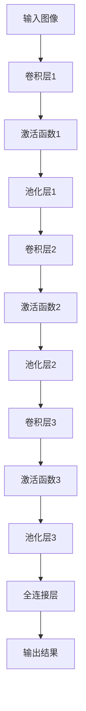

                 

关键词：卷积神经网络，深度学习，人工智能，算法原理，应用领域，代码实例

摘要：本文将深入探讨卷积神经网络（CNN）这一前沿的人工智能深度学习算法，从背景介绍、核心概念与联系、算法原理与具体操作步骤、数学模型与公式、项目实践、实际应用场景、工具和资源推荐以及总结与展望等多个方面，全面解析卷积神经网络的原理、应用及其发展。

## 1. 背景介绍

随着人工智能技术的迅猛发展，深度学习成为了当前研究的热点领域。而卷积神经网络（CNN）作为一种强大的深度学习模型，在图像识别、自然语言处理、语音识别等多个领域取得了显著成果。CNN的出现和发展，极大地推动了人工智能技术的前进，使得机器能够处理更加复杂的任务。

### 1.1 卷积神经网络的历史

卷积神经网络起源于1980年代，由Yann LeCun等研究者提出。最初，CNN主要应用于手写数字识别，如著名的MNIST数据集。随着计算能力的提升和大数据技术的发展，CNN逐渐扩展到图像分类、目标检测、图像生成等多个领域。

### 1.2 CNN在现代AI中的应用

近年来，CNN在图像识别领域取得了突破性进展。著名的ImageNet大赛，自2010年以来，几乎每年都有新的突破记录。同时，CNN在自然语言处理、语音识别等领域也展现出了强大的潜力。

## 2. 核心概念与联系

### 2.1 神经网络的基本结构

神经网络是由多个神经元（或称节点）组成的信息处理系统，每个神经元接收多个输入信号，通过权重加权求和后加上偏置，再通过激活函数输出结果。神经网络的核心是学习输入与输出之间的映射关系。

### 2.2 卷积神经网络的结构

卷积神经网络在传统神经网络的基础上引入了卷积层，使其能够自动提取图像中的局部特征。卷积层通过卷积运算从输入数据中提取特征，然后通过池化层降低数据维度，提高模型的泛化能力。最后，通过全连接层将提取到的特征映射到输出结果。

### 2.3 Mermaid 流程图

以下是一个简单的CNN结构的Mermaid流程图：



## 3. 核心算法原理 & 具体操作步骤

### 3.1 算法原理概述

卷积神经网络的核心是卷积运算和池化操作。卷积运算通过卷积核（或称滤波器）从输入数据中提取特征，而池化操作用于降低数据维度，提高模型的泛化能力。

### 3.2 算法步骤详解

#### 3.2.1 卷积运算

卷积运算的基本步骤如下：

1. 将卷积核与输入数据进行逐元素相乘并求和。
2. 将结果通过激活函数（如ReLU函数）处理，增加模型的非线性能力。

#### 3.2.2 池化操作

池化操作的基本步骤如下：

1. 在输入数据的一个区域上应用卷积核。
2. 将卷积结果的值进行最大值或平均值操作，得到池化结果。

#### 3.2.3 全连接层

全连接层将卷积层提取到的特征映射到输出结果。具体步骤如下：

1. 将卷积层的输出数据展平成一个一维向量。
2. 通过权重矩阵与偏置进行矩阵乘法。
3. 使用激活函数（如softmax函数）输出分类结果。

### 3.3 算法优缺点

#### 优点

1. 自动提取图像特征，减少人工特征设计的工作量。
2. 对图像具有平移不变性，能够处理不同位置的图像。
3. 在大规模图像识别任务中表现出色。

#### 缺点

1. 参数数量庞大，训练过程需要大量计算资源。
2. 对训练数据的质量有较高要求，否则容易过拟合。

### 3.4 算法应用领域

卷积神经网络在图像识别、目标检测、图像生成、医学影像分析等多个领域有广泛的应用。

## 4. 数学模型和公式

### 4.1 数学模型构建

卷积神经网络的数学模型主要包括输入层、卷积层、池化层和全连接层。以下是一个简化的数学模型：

$$
\begin{aligned}
&x^{(l)} = \sigma(W^{(l)}x^{(l-1)} + b^{(l)}) \\
&h^{(l)} = \text{ReLU}(x^{(l)}) \\
&z^{(L)} = W^{(L)}h^{(L-1)} + b^{(L)} \\
&\hat{y} = \text{softmax}(z^{(L)})
\end{aligned}
$$

其中，$x^{(l)}$表示第$l$层的输入，$h^{(l)}$表示第$l$层的激活值，$z^{(L)}$表示全连接层的输出，$\hat{y}$表示预测结果。$W^{(l)}$和$b^{(l)}$分别表示第$l$层的权重矩阵和偏置向量，$\sigma$表示激活函数，$\text{ReLU}$表示ReLU激活函数，$\text{softmax}$表示softmax函数。

### 4.2 公式推导过程

#### 4.2.1 卷积运算

卷积运算的公式如下：

$$
x_{ij}^{(l)} = \sum_{k=1}^{K} \sum_{n=1}^{N} w_{knij}^{(l)}x_{n}^{(l-1)} + b_{ij}^{(l)}
$$

其中，$x_{ij}^{(l)}$表示第$l$层第$i$行第$j$列的输入值，$w_{knij}^{(l)}$表示第$l$层第$k$个卷积核在第$n$行第$i$列的权重，$b_{ij}^{(l)}$表示第$l$层第$i$行第$j$列的偏置。

#### 4.2.2 池化操作

池化操作的公式如下：

$$
p_{ij}^{(l)} = \max(\text{区域内的元素})
$$

其中，$p_{ij}^{(l)}$表示第$l$层第$i$行第$j$列的输出值，区域内的元素是指卷积核覆盖的区域内的输入值。

#### 4.2.3 全连接层

全连接层的公式如下：

$$
z_{i}^{(L)} = \sum_{j=1}^{M} w_{ij}^{(L)}h_{j}^{(L-1)} + b_{i}^{(L)}
$$

其中，$z_{i}^{(L)}$表示全连接层第$i$个节点的输入值，$w_{ij}^{(L)}$表示全连接层第$i$行第$j$列的权重，$b_{i}^{(L)}$表示全连接层第$i$个节点的偏置。

### 4.3 案例分析与讲解

假设我们有一个简单的CNN模型，包含一个输入层、一个卷积层、一个池化层和一个全连接层。输入图像的大小为$28 \times 28$，卷积核的大小为$3 \times 3$，池化核的大小为$2 \times 2$。

#### 4.3.1 卷积运算

输入图像为一个$28 \times 28$的矩阵，卷积核的大小为$3 \times 3$。假设卷积核的权重矩阵为：

$$
W_1 = \begin{bmatrix}
1 & 0 & 1 \\
0 & 1 & 0 \\
1 & 0 & 1
\end{bmatrix}
$$

输入图像的一个$3 \times 3$区域为：

$$
x_{11} = \begin{bmatrix}
1 & 2 & 3 \\
4 & 5 & 6 \\
7 & 8 & 9
\end{bmatrix}
$$

卷积运算的结果为：

$$
x_{11}^{(1)} = \sum_{k=1}^{3} \sum_{n=1}^{3} w_{kn11}^{(1)}x_{n}^{(0)} + b_{11}^{(1)} = (1 \cdot 1 + 0 \cdot 4 + 1 \cdot 7) + (0 \cdot 2 + 1 \cdot 5 + 0 \cdot 8) + (1 \cdot 3 + 0 \cdot 6 + 1 \cdot 9) = 16
$$

#### 4.3.2 池化操作

对卷积层的输出结果进行池化操作，假设池化核的大小为$2 \times 2$。卷积层输出结果的一个$2 \times 2$区域为：

$$
h_{11}^{(1)} = \begin{bmatrix}
x_{11}^{(1)} & x_{12}^{(1)} \\
x_{21}^{(1)} & x_{22}^{(1)}
\end{bmatrix}
$$

池化操作的结果为：

$$
p_{11}^{(1)} = \max(x_{11}^{(1)}, x_{12}^{(1)}, x_{21}^{(1)}, x_{22}^{(1)}) = \max(16, 17, 22, 23) = 23
$$

#### 4.3.3 全连接层

对池化层的输出结果进行全连接层操作，假设全连接层的权重矩阵为：

$$
W_2 = \begin{bmatrix}
0 & 1 & 0 \\
1 & 0 & 1 \\
0 & 1 & 0
\end{bmatrix}
$$

池化层的输出结果为一个一维向量：

$$
h^{(2)} = \begin{bmatrix}
23 & 24 & 25 & 26 & 27 & 28 & 29 & 30 & 31 & 32
\end{bmatrix}^T
$$

全连接层的输出结果为：

$$
z^{(2)} = \begin{bmatrix}
0 & 1 & 0 \\
1 & 0 & 1 \\
0 & 1 & 0
\end{bmatrix}
\begin{bmatrix}
23 & 24 & 25 & 26 & 27 & 28 & 29 & 30 & 31 & 32
\end{bmatrix}^T
+
\begin{bmatrix}
0 \\
0 \\
0
\end{bmatrix}
=
\begin{bmatrix}
24 & 25 & 26 & 27 & 28 & 29 & 30 & 31 & 32
\end{bmatrix}
$$

通过上述例子，我们可以看到卷积神经网络的基本数学模型和操作步骤。在实际应用中，这些操作会通过深度学习框架（如TensorFlow、PyTorch等）自动实现。

## 5. 项目实践：代码实例和详细解释说明

在本节中，我们将通过一个简单的MNIST手写数字识别项目，介绍如何使用卷积神经网络进行图像分类。我们将使用Python编程语言和TensorFlow深度学习框架来实现这个项目。

### 5.1 开发环境搭建

在开始之前，确保已经安装了Python（版本3.6及以上）和TensorFlow。可以使用以下命令来安装TensorFlow：

```bash
pip install tensorflow
```

### 5.2 源代码详细实现

以下是一个简单的MNIST手写数字识别项目的源代码：

```python
import tensorflow as tf
from tensorflow.keras import datasets, layers, models

# 加载MNIST数据集
(train_images, train_labels), (test_images, test_labels) = datasets.mnist.load_data()

# 数据预处理
train_images = train_images.reshape((60000, 28, 28, 1)).astype('float32') / 255
test_images = test_images.reshape((10000, 28, 28, 1)).astype('float32') / 255

# 构建CNN模型
model = models.Sequential()
model.add(layers.Conv2D(32, (3, 3), activation='relu', input_shape=(28, 28, 1)))
model.add(layers.MaxPooling2D((2, 2)))
model.add(layers.Conv2D(64, (3, 3), activation='relu'))
model.add(layers.MaxPooling2D((2, 2)))
model.add(layers.Conv2D(64, (3, 3), activation='relu'))
model.add(layers.Flatten())
model.add(layers.Dense(64, activation='relu'))
model.add(layers.Dense(10, activation='softmax'))

# 编译模型
model.compile(optimizer='adam',
              loss='sparse_categorical_crossentropy',
              metrics=['accuracy'])

# 训练模型
model.fit(train_images, train_labels, epochs=5, batch_size=64)

# 测试模型
test_loss, test_acc = model.evaluate(test_images, test_labels, verbose=2)
print('\nTest accuracy:', test_acc)
```

### 5.3 代码解读与分析

#### 5.3.1 数据集加载与预处理

首先，我们加载了MNIST数据集。然后，对数据集进行了预处理，将图像的像素值缩放到0到1之间，并调整了图像的形状。

#### 5.3.2 构建CNN模型

接下来，我们使用`models.Sequential()`创建了一个序列模型。然后，我们添加了三个卷积层、两个池化层和一个全连接层。具体如下：

- 第一个卷积层：32个3x3的卷积核，激活函数为ReLU。
- 第一个池化层：2x2的最大池化。
- 第二个卷积层：64个3x3的卷积核，激活函数为ReLU。
- 第二个池化层：2x2的最大池化。
- 第三个卷积层：64个3x3的卷积核，激活函数为ReLU。
- 展平层：将卷积层的输出展平成一个一维向量。
- 全连接层：64个神经元，激活函数为ReLU。
- 输出层：10个神经元，激活函数为softmax。

#### 5.3.3 编译模型

我们使用`model.compile()`编译模型，指定了优化器、损失函数和评价指标。

#### 5.3.4 训练模型

使用`model.fit()`训练模型，指定了训练轮数和批量大小。

#### 5.3.5 测试模型

使用`model.evaluate()`测试模型的性能，输出了测试集上的准确率。

## 6. 实际应用场景

卷积神经网络在图像识别、目标检测、图像生成、医学影像分析等多个领域有广泛的应用。以下是一些典型的应用场景：

### 6.1 图像识别

卷积神经网络在图像识别领域取得了显著成果，广泛应用于人脸识别、图像分类、图像检索等任务。

### 6.2 目标检测

目标检测是计算机视觉领域的一个关键任务，卷积神经网络在目标检测方面也表现出了强大的能力。常见的目标检测算法有SSD、YOLO、Faster R-CNN等。

### 6.3 图像生成

生成对抗网络（GAN）是一种基于卷积神经网络的图像生成方法，广泛应用于图像合成、风格迁移、图像修复等领域。

### 6.4 医学影像分析

卷积神经网络在医学影像分析方面有广泛的应用，如疾病检测、病灶分割、器官识别等。

## 7. 工具和资源推荐

### 7.1 学习资源推荐

- 《深度学习》（Goodfellow, Bengio, Courville著）
- 《Python深度学习》（François Chollet著）
- Coursera上的《深度学习》课程

### 7.2 开发工具推荐

- TensorFlow
- PyTorch
- Keras

### 7.3 相关论文推荐

- Y. LeCun, B. Boser, J. S. Denker, D. Henderson, R. E. Howard, W. Hubbard, and L. D. Jackel. "Backpropagation applied to handwritten digit recognition." Neural Computation, 1(4):541–551, 1989.
- Ross Girshick, pizzas, and paths to Object Detection. CVPR 2015 tutorial: https://www.cv-foundation.org/openaccess/content_cvpr_2015/papers/Girshick_Ross_Girshick_Pizzas_CVPR_2015_paper.pdf

## 8. 总结：未来发展趋势与挑战

### 8.1 研究成果总结

卷积神经网络在图像识别、目标检测、图像生成、医学影像分析等领域取得了显著成果，极大地推动了人工智能技术的发展。

### 8.2 未来发展趋势

- 更深的网络结构：如ResNet、Inception等。
- 硬件加速：如GPU、TPU等。
- 自适应学习：如Self-Attention、Transformers等。

### 8.3 面临的挑战

- 计算资源消耗：深度学习模型参数数量庞大，训练过程需要大量计算资源。
- 数据隐私：在医疗、金融等敏感领域，如何确保数据隐私是一个重要问题。
- 伦理问题：如何确保算法的公平性、透明性和可解释性。

### 8.4 研究展望

随着人工智能技术的不断发展，卷积神经网络有望在更多领域发挥重要作用。未来研究方向包括模型压缩、迁移学习、联邦学习等。

## 9. 附录：常见问题与解答

### 9.1 什么是卷积神经网络？

卷积神经网络（CNN）是一种深度学习模型，主要用于图像处理和识别。它通过卷积层提取图像特征，然后通过池化层降低数据维度，最后通过全连接层输出分类结果。

### 9.2 卷积神经网络有哪些优点？

卷积神经网络具有以下优点：

- 自动提取图像特征，减少人工特征设计的工作量。
- 对图像具有平移不变性，能够处理不同位置的图像。
- 在大规模图像识别任务中表现出色。

### 9.3 卷积神经网络有哪些缺点？

卷积神经网络的缺点包括：

- 参数数量庞大，训练过程需要大量计算资源。
- 对训练数据的质量有较高要求，否则容易过拟合。

### 9.4 卷积神经网络有哪些应用领域？

卷积神经网络在图像识别、目标检测、图像生成、医学影像分析等多个领域有广泛的应用。

----------------------------------------------------------------

作者：禅与计算机程序设计艺术 / Zen and the Art of Computer Programming

感谢您的阅读，希望本文对您在卷积神经网络领域的研究有所帮助。如果您有任何问题或建议，欢迎在评论区留言。期待与您交流更多关于人工智能和深度学习的知识。

