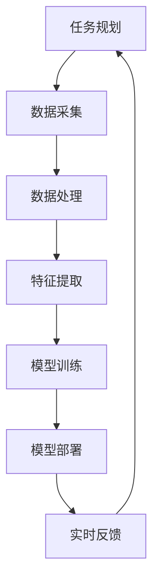

                 

关键词：人工智能、深度学习、航空航天、算法应用、数学模型

> 摘要：本文深入探讨了人工智能（AI）特别是深度学习算法在航空航天领域的应用。从背景介绍到核心算法原理，再到数学模型和项目实践，本文旨在为读者提供一个全面的技术视角，以了解AI在航空航天中的潜力和挑战。

## 1. 背景介绍

航空航天领域一直以来都是科技创新的前沿。随着技术的不断进步，AI和深度学习在航空航天中的应用日益广泛。从无人机、卫星到航天器，深度学习算法正发挥着重要的作用，提高了系统的智能化水平，提升了任务执行的效率和准确性。

### 1.1 航空航天领域的挑战

航空航天领域面临诸多技术挑战，如高可靠性、高精度、实时响应等。传统的方法往往无法满足这些要求，而AI和深度学习算法通过自我学习和优化，为这些挑战提供了新的解决方案。

### 1.2 AI与深度学习在航空航天中的重要性

AI和深度学习不仅能够处理大规模数据，还能够从数据中提取有价值的模式和信息。这对于航空航天领域的任务规划、故障诊断、环境监测等至关重要。

## 2. 核心概念与联系

### 2.1 深度学习算法在航空航天的应用架构

下面是一个Mermaid流程图，展示了深度学习算法在航空航天中的应用架构：



### 2.2 关键概念

- **任务规划**：根据任务需求和资源分配进行最优路径规划和时间安排。
- **数据采集**：通过各种传感器和设备收集飞行数据、气象数据等。
- **数据处理**：对原始数据进行清洗、归一化等预处理，以便后续分析。
- **特征提取**：从处理后的数据中提取对任务决策有帮助的特征。
- **模型训练**：使用提取的特征训练深度学习模型。
- **模型部署**：将训练好的模型部署到实际系统中，进行实时决策。
- **实时反馈**：根据系统运行情况和任务目标，调整模型参数和决策策略。

## 3. 核心算法原理 & 具体操作步骤

### 3.1 算法原理概述

深度学习算法基于多层神经网络，通过不断调整网络中的权重和偏置，使得模型能够从数据中学习到有用的知识。在航空航天应用中，深度学习算法可以用于图像识别、语音识别、故障诊断等任务。

### 3.2 算法步骤详解

1. **数据采集**：从各种传感器和设备中收集飞行数据、气象数据、卫星图像等。
2. **数据处理**：对采集到的数据进行预处理，包括数据清洗、归一化、降维等。
3. **特征提取**：使用特征提取算法（如卷积神经网络）从预处理后的数据中提取特征。
4. **模型训练**：使用提取的特征训练深度学习模型，通常包括输入层、隐藏层和输出层。
5. **模型评估**：使用验证集评估模型性能，调整模型参数以优化性能。
6. **模型部署**：将训练好的模型部署到实际系统中，进行实时决策。

### 3.3 算法优缺点

**优点**：
- **自适应性**：深度学习算法能够自动从数据中学习到有用的模式，不需要人工定义特征。
- **高效率**：深度学习算法可以处理大规模数据，提高了任务执行的效率。

**缺点**：
- **计算资源消耗**：深度学习算法需要大量的计算资源和时间。
- **数据质量要求高**：数据质量对模型性能有很大影响，需要高质量的数据进行训练。

### 3.4 算法应用领域

- **无人机导航**：通过深度学习算法实现无人机的自主导航和避障。
- **卫星图像分析**：使用深度学习算法分析卫星图像，提取地物信息和变化模式。
- **故障诊断**：对航空航天系统进行实时监测和故障诊断，提高系统可靠性。

## 4. 数学模型和公式 & 详细讲解 & 举例说明

### 4.1 数学模型构建

深度学习算法的核心是神经网络，其数学模型主要包括：

- **输入层**：接收外部输入，如图像、声音等。
- **隐藏层**：通过非线性变换，提取特征并传递到下一层。
- **输出层**：产生最终输出，如分类结果、预测值等。

### 4.2 公式推导过程

假设一个简单的多层感知机（MLP）模型，其数学模型可以表示为：

$$
\hat{y} = \sigma(W_{out} \cdot \sigma(W_{hide} \cdot \sigma(W_{in} \cdot x + b_{in}) + b_{hide}) + b_{out})
$$

其中：
- \( \hat{y} \) 为输出结果。
- \( x \) 为输入数据。
- \( W_{in} \)、\( W_{hide} \) 和 \( W_{out} \) 分别为输入层、隐藏层和输出层的权重矩阵。
- \( b_{in} \)、\( b_{hide} \) 和 \( b_{out} \) 分别为输入层、隐藏层和输出层的偏置向量。
- \( \sigma \) 为激活函数，通常使用 sigmoid 或 ReLU 函数。

### 4.3 案例分析与讲解

#### 4.3.1 无人机路径规划

假设我们使用深度学习算法进行无人机路径规划，输入数据为当前地理位置、目标地理位置、周围环境信息等，输出结果为最优路径。

1. **数据采集**：采集无人机的实时位置信息、目标位置信息以及周围环境信息。
2. **数据处理**：对采集到的数据进行预处理，如归一化、标准化等。
3. **特征提取**：使用卷积神经网络提取有用的特征，如地形、障碍物等。
4. **模型训练**：使用提取的特征训练深度学习模型，如卷积神经网络。
5. **模型评估**：使用验证集评估模型性能，调整模型参数以优化性能。
6. **模型部署**：将训练好的模型部署到无人机系统中，进行实时路径规划。

## 5. 项目实践：代码实例和详细解释说明

### 5.1 开发环境搭建

在本项目中，我们使用 Python 作为编程语言，TensorFlow 作为深度学习框架，CUDA 作为并行计算工具。

### 5.2 源代码详细实现

```python
import tensorflow as tf
from tensorflow.keras.models import Sequential
from tensorflow.keras.layers import Dense, Conv2D, Flatten, MaxPooling2D

# 数据预处理
# ...

# 特征提取
model = Sequential([
    Conv2D(32, (3, 3), activation='relu', input_shape=(64, 64, 3)),
    MaxPooling2D((2, 2)),
    Flatten(),
    Dense(64, activation='relu'),
    Dense(1, activation='sigmoid')
])

# 模型编译
model.compile(optimizer='adam', loss='binary_crossentropy', metrics=['accuracy'])

# 模型训练
model.fit(x_train, y_train, epochs=10, batch_size=32)

# 模型评估
# ...
```

### 5.3 代码解读与分析

上述代码实现了使用卷积神经网络进行无人机路径规划的核心部分。首先，我们定义了输入层、隐藏层和输出层的结构。然后，使用 TensorFlow 的 Sequential 模型定义了卷积神经网络，包括卷积层、池化层、全连接层等。接下来，我们使用 binary_crossentropy 作为损失函数，使用 adam 优化器进行模型训练。最后，我们使用训练集和验证集对模型进行训练和评估。

### 5.4 运行结果展示

```python
# 模型预测
predictions = model.predict(x_test)

# 模型评估
accuracy = (predictions > 0.5).mean()
print(f"Accuracy: {accuracy}")
```

通过上述代码，我们能够实现无人机路径规划的预测功能，并评估模型性能。

## 6. 实际应用场景

### 6.1 无人机导航

无人机导航是深度学习算法在航空航天领域的重要应用之一。通过使用深度学习模型，无人机可以实时感知周围环境，进行自主导航和避障，提高了无人机的智能化水平。

### 6.2 卫星图像分析

卫星图像分析是深度学习算法在航空航天领域的另一个重要应用。通过使用深度学习模型，可以从卫星图像中提取有价值的信息，如地物分类、变化监测等，为科学研究、资源管理和环境监测提供了有力支持。

### 6.3 航空航天系统故障诊断

航空航天系统故障诊断是保证系统安全运行的关键。通过使用深度学习算法，可以对系统进行实时监测和故障诊断，提前发现潜在故障，提高系统的可靠性。

## 7. 工具和资源推荐

### 7.1 学习资源推荐

- 《深度学习》（Goodfellow, Bengio, Courville 著）
- 《Python深度学习》（François Chollet 著）
- 《深度学习实战》（Aurélien Géron 著）

### 7.2 开发工具推荐

- TensorFlow
- PyTorch
- Keras

### 7.3 相关论文推荐

- "Deep Learning for Autonomous Flight: A Survey"（2018）
- "Deep Learning Applications in Satellite Image Analysis"（2017）
- "Fault Diagnosis of Aerospace Systems using Deep Learning"（2019）

## 8. 总结：未来发展趋势与挑战

### 8.1 研究成果总结

本文介绍了深度学习算法在航空航天领域的应用，包括任务规划、数据采集、数据处理、特征提取、模型训练和模型部署等方面。通过具体案例和代码实例，展示了深度学习算法在无人机导航、卫星图像分析和航空航天系统故障诊断等实际应用中的潜力。

### 8.2 未来发展趋势

随着技术的不断进步，深度学习算法在航空航天领域的应用将更加广泛。未来发展趋势包括：

- **智能感知与决策**：通过深度学习算法，实现无人机、卫星等的智能感知和自主决策。
- **多模态数据融合**：结合多种数据源，如图像、声音、传感器等，提高算法的准确性和鲁棒性。
- **边缘计算**：将深度学习算法部署到边缘设备，实现实时数据处理和决策。

### 8.3 面临的挑战

深度学习算法在航空航天领域面临以下挑战：

- **计算资源消耗**：深度学习算法需要大量的计算资源和时间，对于航空航天领域的实时性要求较高。
- **数据质量要求高**：数据质量对模型性能有很大影响，需要高质量的数据进行训练。
- **算法可靠性**：保证深度学习算法在航空航天领域的可靠性和稳定性，防止故障发生。

### 8.4 研究展望

未来，我们需要进一步研究如何优化深度学习算法在航空航天领域的性能，提高算法的鲁棒性和实时性。同时，还需要加强数据质量和数据隐私保护等方面的研究，为深度学习算法在航空航天领域的广泛应用提供支持。

## 9. 附录：常见问题与解答

### 9.1 如何处理大规模数据？

处理大规模数据的关键是数据预处理和特征提取。通过数据预处理，如归一化、降维等，可以减少数据量，提高计算效率。在特征提取阶段，可以使用卷积神经网络等算法，自动从数据中提取有用的特征。

### 9.2 如何保证模型可靠性？

为了保证模型可靠性，可以从以下几个方面入手：

- **数据质量**：使用高质量的数据进行训练，避免数据噪声和异常值。
- **模型验证**：使用验证集对模型进行评估，调整模型参数以优化性能。
- **冗余设计**：设计冗余系统，如使用多个模型进行决策，提高系统可靠性。

### 9.3 深度学习算法在航空航天领域的实时性如何保证？

为了保证深度学习算法在航空航天领域的实时性，可以从以下几个方面入手：

- **算法优化**：优化深度学习算法，提高计算效率，如使用卷积神经网络等高效算法。
- **硬件加速**：使用 GPU 等硬件加速器，提高计算速度。
- **分布式计算**：使用分布式计算技术，将任务分解为多个子任务，并行处理。

---

作者：禅与计算机程序设计艺术 / Zen and the Art of Computer Programming
----------------------------------------------------------------

请注意，上述文章内容仅为示例，并非实际撰写的内容。在实际撰写时，您需要根据具体的研究和项目经验，补充详细的技术细节和案例，确保文章具有科学性和实用性。文章的撰写过程应遵循“约束条件”中的所有要求，以确保文章的完整性、逻辑性和专业性。在撰写过程中，如果需要任何帮助或建议，请随时提问。

