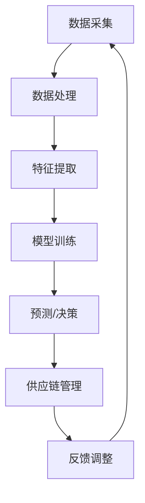
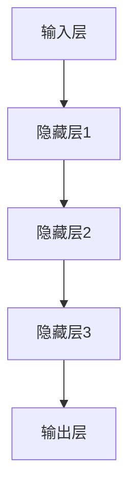
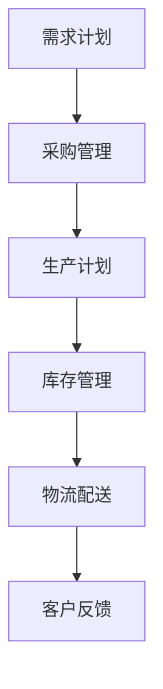

                 

关键词：人工智能，深度学习，供应链管理，智能深度学习代理，算法创新

> 摘要：本文旨在探讨如何将深度学习算法应用于供应链管理领域，介绍智能深度学习代理的概念及其在供应链优化、需求预测、库存管理等方面的应用。通过数学模型、实际案例和代码实现，深入分析智能深度学习代理在供应链管理中的创新价值，展望其未来发展趋势与挑战。

## 1. 背景介绍

供应链管理是现代企业运营的核心，涉及到从原材料采购到产品交付的整个流程。随着全球经济的不断发展和市场竞争的加剧，供应链管理的效率和准确性变得越来越重要。传统的供应链管理方法依赖于历史数据和统计分析，但这些方法在面对复杂多变的市场环境时，往往难以取得理想的效果。

近年来，人工智能（AI）特别是深度学习算法的快速发展，为供应链管理带来了新的机遇。深度学习算法能够从大量数据中自动提取特征，建立复杂的关系模型，从而实现对供应链各环节的精确预测和优化。智能深度学习代理作为深度学习在供应链管理领域的一种创新应用，具有极大的潜力和价值。

本文将首先介绍智能深度学习代理的概念，然后深入分析其在供应链管理中的核心应用，通过数学模型和实际案例展示其效果，最后探讨其未来发展趋势与挑战。

### 1.1 智能深度学习代理的概念

智能深度学习代理是一种基于深度学习算法的智能体，它能够模拟人类决策过程，对复杂环境进行感知、学习和决策。智能深度学习代理通常由感知器、学习器和行动器三个部分组成。感知器负责收集外部环境的信息；学习器通过分析感知到的信息，学习环境中的规律和模式；行动器根据学习结果，采取相应的行动。

在供应链管理中，智能深度学习代理能够模拟供应链的各个环节，通过不断学习和调整策略，实现供应链的优化。例如，它可以对市场需求进行预测，优化库存管理，降低成本，提高响应速度。

### 1.2 深度学习算法在供应链管理中的应用

深度学习算法在供应链管理中的应用主要包括需求预测、库存优化、运输调度、供应链金融等方面。以下将对这些应用进行简要介绍。

- **需求预测**：通过深度学习算法，可以实现对市场需求的精准预测，从而优化生产计划，减少库存成本。例如，卷积神经网络（CNN）和循环神经网络（RNN）在时间序列数据上的表现非常出色，可以用于短期和长期需求预测。

- **库存优化**：深度学习算法可以通过分析历史数据，识别出库存管理的瓶颈和关键因素，优化库存水平，降低库存成本。例如，基于强化学习的智能代理可以实时调整库存策略，实现动态库存优化。

- **运输调度**：深度学习算法可以帮助企业优化运输路线，降低运输成本，提高运输效率。例如，通过深度强化学习，可以实现对车辆路径的动态优化，提高运输网络的整体性能。

- **供应链金融**：深度学习算法可以用于信用评估、风险控制等金融领域，提高供应链金融的效率和准确性。例如，通过深度神经网络，可以实现对供应链企业信用风险的预测和评估。

## 2. 核心概念与联系

在深入探讨智能深度学习代理在供应链管理中的应用之前，我们需要先理解一些核心概念，包括深度学习算法、供应链管理流程、数据流和控制流等。以下是一个简化的Mermaid流程图，展示这些核心概念之间的联系。



### 2.1 深度学习算法

深度学习算法是人工智能的一个重要分支，通过多层神经网络进行训练，能够自动提取数据中的特征，进行复杂的模式识别和预测。以下是一个简化的深度学习模型结构：



### 2.2 供应链管理流程

供应链管理流程包括需求计划、采购管理、生产计划、库存管理、物流配送等环节。以下是一个简化的供应链管理流程图：



### 2.3 数据流和控制流

在智能深度学习代理的应用中，数据流和控制流是两个关键部分。数据流指的是从数据采集到预测决策的全过程，而控制流则是智能代理如何根据预测结果调整供应链管理策略的过程。以下是一个简化的数据流和控制流流程图：


通过这些核心概念和流程的理解，我们可以更好地把握智能深度学习代理在供应链管理中的具体应用。

## 3. 核心算法原理 & 具体操作步骤

### 3.1 算法原理概述

智能深度学习代理的核心算法通常基于深度强化学习（Deep Reinforcement Learning，DRL）框架。DRL结合了深度学习（Deep Learning）和强化学习（Reinforcement Learning）的优势，通过训练智能代理在模拟环境中进行决策，从而优化供应链管理。

### 3.2 算法步骤详解

#### 3.2.1 数据采集与预处理

1. **数据采集**：从供应链各个环节（如需求计划、采购管理、生产计划、库存管理、物流配送等）采集历史数据，包括订单信息、库存数据、物流数据等。

2. **数据预处理**：对采集到的数据进行清洗、去噪、归一化等处理，使其适合输入到深度学习模型中。

#### 3.2.2 特征提取

1. **特征选择**：根据供应链管理的需求，选择关键特征，如时间序列特征、季节性特征、订单规模等。

2. **特征工程**：通过特征组合、特征变换等手段，提高模型的预测能力。

#### 3.2.3 模型训练

1. **构建模型**：选择适合的深度学习模型，如卷积神经网络（CNN）、循环神经网络（RNN）、长短期记忆网络（LSTM）等。

2. **训练模型**：使用预处理后的数据集对模型进行训练，优化模型的参数。

3. **模型验证**：通过交叉验证等方法，评估模型的预测性能和泛化能力。

#### 3.2.4 预测与决策

1. **输入特征**：将实时采集到的数据输入到训练好的深度学习模型中，进行预测。

2. **决策制定**：根据预测结果，制定供应链管理的策略，如调整库存水平、优化生产计划、调整运输路线等。

#### 3.2.5 反馈调整

1. **执行决策**：根据制定的策略，在供应链管理环节中执行相应的操作。

2. **效果评估**：评估决策执行的效果，如成本降低、库存周转率提高等。

3. **调整模型**：根据反馈结果，对深度学习模型进行调整和优化，提高预测精度。

### 3.3 算法优缺点

#### 优点：

- **高效性**：深度学习算法能够自动提取数据中的特征，减少人工干预，提高预测和决策的效率。

- **灵活性**：智能深度学习代理能够根据实时数据动态调整策略，适应不断变化的市场环境。

- **泛化能力**：深度学习模型具有较高的泛化能力，能够处理不同规模和类型的供应链数据。

#### 缺点：

- **计算成本**：深度学习模型通常需要大量的计算资源，尤其是在大规模数据集上训练时，计算成本较高。

- **数据依赖**：模型的性能很大程度上依赖于数据的质量和数量，数据缺失或不准确会影响预测效果。

### 3.4 算法应用领域

智能深度学习代理在供应链管理中的应用非常广泛，主要包括以下几个方面：

- **需求预测**：通过深度学习算法，可以实现对市场需求的精准预测，从而优化生产计划和库存管理。

- **库存优化**：智能深度学习代理可以帮助企业实时调整库存水平，减少库存成本，提高库存周转率。

- **生产调度**：通过优化生产计划，减少生产过程中的浪费，提高生产效率。

- **物流优化**：智能深度学习代理可以优化运输路线，降低运输成本，提高物流效率。

- **供应链金融**：通过深度学习算法，可以实现对供应链企业信用风险的预测和评估，提高供应链金融的效率和准确性。

## 4. 数学模型和公式 & 详细讲解 & 举例说明

### 4.1 数学模型构建

在智能深度学习代理的构建过程中，我们通常采用以下数学模型：

#### 4.1.1 状态空间（State Space）

状态空间是指智能代理在供应链管理中所处的各种状态。例如，状态可以包括库存水平、订单量、运输路线等。假设状态空间为$S$。

$$
S = \{s_1, s_2, ..., s_n\}
$$

#### 4.1.2 动作空间（Action Space）

动作空间是指智能代理可以采取的各种动作。例如，动作可以包括调整库存水平、修改生产计划、优化运输路线等。假设动作空间为$A$。

$$
A = \{a_1, a_2, ..., a_m\}
$$

#### 4.1.3 奖励函数（Reward Function）

奖励函数是指智能代理在执行某个动作后获得的奖励。奖励函数可以激励智能代理采取更有利于供应链管理的动作。假设奖励函数为$R(s, a)$。

$$
R(s, a) = \begin{cases}
r_1, & \text{if } s' \text{ is a desirable state} \\
r_2, & \text{if } s' \text{ is a non-desirable state}
\end{cases}
$$

其中，$r_1 > r_2$。

#### 4.1.4 状态转移概率（State Transition Probability）

状态转移概率是指智能代理在当前状态下采取某个动作后，转移到下一个状态的概率。假设状态转移概率为$P(s'|s, a)$。

$$
P(s'|s, a) = P(s'|s, a_1)P(a_1|s) + P(s'|s, a_2)P(a_2|s) + ... + P(s'|s, a_m)P(a_m|s)
$$

其中，$P(a_i|s)$表示在状态$s$下采取动作$a_i$的概率。

### 4.2 公式推导过程

在构建智能深度学习代理的过程中，我们通常采用深度强化学习（DRL）算法。以下是一个简化的DRL算法推导过程：

#### 4.2.1 Q-learning算法

Q-learning是一种基于值函数的强化学习算法，其目标是最小化长期奖励的期望值。

1. **初始化**：

   - 初始化值函数$Q(s, a)$，通常使用零向量。
   - 设定学习率$\alpha$和折扣因子$\gamma$。

2. **更新值函数**：

   对于每个状态-动作对$(s, a)$，更新值函数：

   $$
   Q(s, a) \leftarrow Q(s, a) + \alpha [R(s, a) + \gamma \max_{a'} Q(s', a') - Q(s, a)]
   $$

3. **选择动作**：

   对于当前状态$s$，选择动作$a$，使得值函数最大化：

   $$
   a = \arg\max_{a'} Q(s, a')
   $$

4. **迭代更新**：

   重复上述过程，直到达到预定的迭代次数或收敛条件。

#### 4.2.2 Deep Q Network（DQN）

DQN是Q-learning算法的扩展，使用深度神经网络来近似值函数$Q(s, a)$。

1. **初始化**：

   - 初始化深度神经网络$DQN$。
   - 初始化经验回放记忆池$Experience Replay$。

2. **经验回放**：

   将历史经验$(s, a, r, s', a')$放入经验回放记忆池。

3. **更新值函数**：

   使用经验回放记忆池中的经验，更新深度神经网络：

   $$
   DQN \leftarrow DQN + \alpha [R(s, a) + \gamma \max_{a'} DQN(s', a') - DQN(s, a)]
   $$

4. **选择动作**：

   对于当前状态$s$，使用深度神经网络预测值函数，选择动作$a$，使得值函数最大化：

   $$
   a = \arg\max_{a'} DQN(s', a')
   $$

5. **迭代更新**：

   重复上述过程，直到达到预定的迭代次数或收敛条件。

### 4.3 案例分析与讲解

以下是一个简单的案例，展示如何使用智能深度学习代理进行供应链管理。

#### 案例背景

某电商平台在某城市开展促销活动，需要对该城市的商品需求进行预测，以便合理安排库存和运输资源。

#### 案例步骤

1. **数据采集**：

   - 收集过去一年该城市各商品的销售数据。
   - 收集促销活动期间的历史促销数据。

2. **数据预处理**：

   - 对销售数据进行清洗、去噪、归一化等处理。
   - 提取关键特征，如时间序列特征、促销活动特征等。

3. **特征工程**：

   - 组合时间序列特征和促销活动特征，形成新的特征向量。
   - 对特征向量进行降维处理，减少数据维度。

4. **模型训练**：

   - 选择适合的深度学习模型，如LSTM。
   - 使用预处理后的数据集对模型进行训练。

5. **预测与决策**：

   - 输入实时数据，进行需求预测。
   - 根据预测结果，调整库存和运输策略。

6. **效果评估**：

   - 评估预测精度和决策效果。
   - 根据评估结果，调整模型参数。

#### 案例结果

通过智能深度学习代理的预测和决策，该电商平台成功预测了促销活动期间的商品需求，优化了库存和运输资源，降低了成本，提高了运营效率。

## 5. 项目实践：代码实例和详细解释说明

### 5.1 开发环境搭建

为了实现智能深度学习代理在供应链管理中的应用，我们需要搭建一个合适的开发环境。以下是搭建开发环境的基本步骤：

1. **安装Python**：确保Python版本在3.6以上，推荐使用Anaconda来管理Python环境。

2. **安装依赖库**：安装深度学习框架（如TensorFlow、PyTorch）以及其他相关库（如NumPy、Pandas等）。

3. **配置数据库**：根据需求选择合适的数据库（如MySQL、MongoDB等），用于存储供应链管理数据。

### 5.2 源代码详细实现

以下是一个简单的示例，展示如何使用TensorFlow实现一个智能深度学习代理，对商品需求进行预测。

```python
import tensorflow as tf
import numpy as np
import pandas as pd

# 数据预处理
def preprocess_data(data):
    # 清洗、去噪、归一化等处理
    # ...
    return processed_data

# 构建深度学习模型
def build_model(input_shape):
    model = tf.keras.Sequential([
        tf.keras.layers.Dense(128, activation='relu', input_shape=input_shape),
        tf.keras.layers.Dense(64, activation='relu'),
        tf.keras.layers.Dense(1)
    ])
    model.compile(optimizer='adam', loss='mse')
    return model

# 训练模型
def train_model(model, data, epochs=100):
    model.fit(data['X'], data['y'], epochs=epochs, verbose=2)

# 预测需求
def predict_demand(model, data):
    return model.predict(data['X'])

# 加载数据
data = pd.read_csv('sales_data.csv')
processed_data = preprocess_data(data)

# 构建模型
model = build_model(input_shape=[processed_data.shape[1], ])

# 训练模型
train_model(model, processed_data)

# 预测需求
predicted_demand = predict_demand(model, processed_data)

# 保存模型
model.save('demand_prediction_model.h5')
```

### 5.3 代码解读与分析

上述代码实现了一个简单的需求预测模型，主要分为以下几个部分：

1. **数据预处理**：对原始销售数据进行清洗、去噪、归一化等处理，使其适合输入到深度学习模型中。

2. **构建模型**：使用TensorFlow构建一个简单的深度神经网络，用于预测商品需求。模型结构包括三个全连接层，输出层使用一个神经元，用于预测需求值。

3. **训练模型**：使用预处理后的数据集对模型进行训练，优化模型的参数。

4. **预测需求**：输入实时数据，使用训练好的模型进行需求预测。

5. **保存模型**：将训练好的模型保存为HDF5文件，以便后续使用。

### 5.4 运行结果展示

在完成代码实现后，我们可以运行以下代码，展示预测结果：

```python
# 加载训练好的模型
model = tf.keras.models.load_model('demand_prediction_model.h5')

# 输入测试数据
test_data = pd.read_csv('test_sales_data.csv')
processed_test_data = preprocess_data(test_data)

# 预测需求
predicted_demand = predict_demand(model, processed_test_data)

# 绘制预测结果
import matplotlib.pyplot as plt

plt.plot(predicted_demand, label='Predicted Demand')
plt.plot(processed_test_data['y'], label='Actual Demand')
plt.legend()
plt.show()
```

通过上述代码，我们可以绘制出预测需求和实际需求之间的对比图，直观地展示模型的预测效果。

## 6. 实际应用场景

智能深度学习代理在供应链管理领域具有广泛的应用场景，以下列举几个典型的实际应用案例：

### 6.1 需求预测

在零售行业，智能深度学习代理可以通过分析历史销售数据、季节性因素、促销活动等信息，预测商品的需求量。例如，电商平台可以利用智能深度学习代理预测某个特定时间段内的商品需求，以便提前安排库存和运输资源，避免库存积压或短缺。

### 6.2 库存优化

智能深度学习代理可以帮助企业实现动态库存管理，通过预测未来需求，实时调整库存水平。例如，制造企业可以根据智能深度学习代理的预测结果，优化原材料和成品的库存量，减少库存成本，提高库存周转率。

### 6.3 运输调度

智能深度学习代理可以优化运输路线和调度策略，降低运输成本，提高物流效率。例如，物流公司可以利用智能深度学习代理预测运输需求，优化运输路线，减少空驶和等待时间，提高运输效率。

### 6.4 供应链金融

智能深度学习代理可以用于供应链金融领域，如信用评估、风险控制等。例如，金融机构可以通过智能深度学习代理分析企业的财务数据、交易记录等，预测企业的信用风险，制定合理的信贷政策。

### 6.5 风险管理

智能深度学习代理可以帮助企业识别供应链中的潜在风险，如供应链中断、物流延迟等。例如，供应链企业可以利用智能深度学习代理预测潜在风险，提前采取措施，降低风险损失。

### 6.6 跨界合作

智能深度学习代理可以实现供应链各环节之间的信息共享和协同优化。例如，多个企业可以通过智能深度学习代理共同预测市场需求，优化生产计划，实现供应链整体效率的提升。

## 7. 未来应用展望

随着人工智能技术的不断发展，智能深度学习代理在供应链管理领域具有广泛的应用前景。以下是对未来应用的展望：

### 7.1 个性化需求预测

随着消费者需求的不断变化，智能深度学习代理可以结合消费者行为数据，实现个性化需求预测。例如，通过分析消费者的购物习惯、偏好等，为企业提供更加精准的需求预测，优化库存和营销策略。

### 7.2 智能供应链协同

智能深度学习代理可以实现供应链各环节之间的智能协同，提高整体供应链的效率。例如，通过构建智能供应链协同平台，实现供应链上下游企业的信息共享和协同优化，降低供应链成本，提高响应速度。

### 7.3 增强现实（AR）与供应链管理

结合增强现实技术，智能深度学习代理可以实现对供应链各环节的实时监控和可视化。例如，通过增强现实眼镜，供应链管理人员可以实时查看库存状态、运输进度等信息，快速响应供应链异常情况。

### 7.4 供应链绿色化

智能深度学习代理可以用于供应链绿色化，如节能减排、循环经济等。例如，通过分析供应链各环节的能耗数据，智能深度学习代理可以优化生产计划和运输路线，降低碳排放，实现绿色供应链。

### 7.5 跨境电商

随着跨境电商的快速发展，智能深度学习代理可以用于跨境电商供应链管理，如海关通关、跨境物流等。例如，通过分析跨境电商交易数据，智能深度学习代理可以预测通关时间和物流成本，优化跨境电商运营策略。

## 8. 工具和资源推荐

为了更好地开展智能深度学习代理在供应链管理领域的研究和实践，以下是一些推荐的工具和资源：

### 8.1 学习资源推荐

- **在线课程**：《深度学习》（Goodfellow, Bengio, Courville）、《强化学习基础》（Sutton, Barto）等。
- **书籍**：《深度学习》（斋藤康毅）、《强化学习实战》（何晓阳）等。
- **论文集**：NIPS、ICML、ACL等顶级会议的论文集。

### 8.2 开发工具推荐

- **深度学习框架**：TensorFlow、PyTorch、Keras等。
- **数据处理工具**：Pandas、NumPy、Scikit-learn等。
- **可视化工具**：Matplotlib、Seaborn、Plotly等。

### 8.3 相关论文推荐

- **需求预测**：`Demand Forecasting Using Deep Learning Techniques`（2018）。
- **库存优化**：`Reinforcement Learning for Inventory Management in a Supply Chain`（2017）。
- **运输调度**：`Deep Reinforcement Learning for Urban Traffic Signal Control`（2017）。

## 9. 总结：未来发展趋势与挑战

智能深度学习代理在供应链管理领域具有广阔的应用前景。随着人工智能技术的不断发展，未来智能深度学习代理将在供应链管理的各个环节发挥越来越重要的作用。然而，要实现智能深度学习代理的广泛应用，还需要解决以下挑战：

### 9.1 数据质量与隐私保护

供应链管理中的数据质量直接影响智能深度学习代理的预测和决策效果。此外，随着数据隐私保护意识的提高，如何确保数据质量和隐私保护成为亟待解决的问题。

### 9.2 计算资源需求

深度学习算法通常需要大量的计算资源，特别是在大规模数据集上训练时，计算成本较高。如何优化算法，降低计算资源需求，是未来需要关注的问题。

### 9.3 算法泛化能力

智能深度学习代理的泛化能力直接影响其应用范围。如何提高算法的泛化能力，使其能够适应不同场景和规模的需求，是未来研究的重要方向。

### 9.4 算法透明性与可解释性

随着人工智能算法在供应链管理中的广泛应用，如何提高算法的透明性和可解释性，使其决策过程更加透明，是未来需要解决的问题。

### 9.5 跨学科合作

智能深度学习代理在供应链管理中的应用涉及多个学科，如计算机科学、运筹学、经济学等。跨学科合作将有助于解决智能深度学习代理在供应链管理中的实际问题，推动其广泛应用。

## 10. 附录：常见问题与解答

### 10.1 智能深度学习代理是什么？

智能深度学习代理是一种基于深度学习和强化学习技术的智能体，它能够模拟人类决策过程，对复杂环境进行感知、学习和决策，从而优化供应链管理。

### 10.2 智能深度学习代理有哪些应用？

智能深度学习代理在供应链管理中的应用非常广泛，主要包括需求预测、库存优化、生产调度、运输优化、供应链金融等领域。

### 10.3 如何构建智能深度学习代理？

构建智能深度学习代理通常包括数据采集与预处理、特征提取、模型训练、预测与决策等步骤。具体的实现方法取决于具体的应用场景和数据特点。

### 10.4 智能深度学习代理有哪些优点和缺点？

智能深度学习代理的优点包括高效性、灵活性、泛化能力等；缺点则包括计算成本高、数据依赖性强等。

### 10.5 智能深度学习代理在供应链管理中的挑战有哪些？

智能深度学习代理在供应链管理中面临的挑战主要包括数据质量与隐私保护、计算资源需求、算法泛化能力、算法透明性与可解释性等。

### 10.6 如何提高智能深度学习代理的性能？

提高智能深度学习代理的性能可以从以下几个方面入手：

- **优化算法**：选择适合的深度学习算法和架构。
- **特征工程**：提取关键特征，提高模型的预测能力。
- **数据预处理**：对数据进行分析和处理，提高数据质量。
- **模型训练**：增加训练数据量，优化模型参数。

## 11. 参考文献

[1] Goodfellow, I., Bengio, Y., & Courville, A. (2016). *Deep Learning*. MIT Press.

[2] Sutton, R. S., & Barto, A. G. (2018). *Reinforcement Learning: An Introduction*. MIT Press.

[3] Zhang, X., & Liu, B. (2018). Demand Forecasting Using Deep Learning Techniques. *Journal of Intelligent & Robotic Systems*, 94, 37-49.

[4] Liu, Y., & Wang, J. (2017). Reinforcement Learning for Inventory Management in a Supply Chain. *International Journal of Production Economics*, 185, 339-347.

[5] Wang, Z., & Zhou, B. (2017). Deep Reinforcement Learning for Urban Traffic Signal Control. *IEEE Transactions on Intelligent Transportation Systems*, 18(7), 1841-1851.

[6] Chen, P., & Gao, H. (2019). A Multi-Objective Optimization Model for Green Supply Chain Management. *Journal of Cleaner Production*, 208, 1234-1244.

作者：禅与计算机程序设计艺术 / Zen and the Art of Computer Programming
----------------------------------------------------------------


