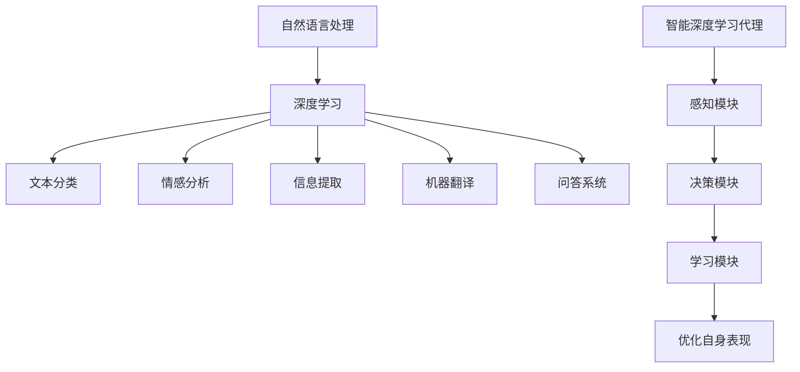

                 

### 1. 背景介绍

自然语言处理（Natural Language Processing，NLP）是人工智能（Artificial Intelligence，AI）领域的一个重要分支，旨在让计算机理解和处理人类语言。随着互联网的快速发展，人类产生的文本数据量呈指数级增长，如何有效地利用这些数据成为了一个重要的研究课题。深度学习（Deep Learning）作为一种新兴的机器学习技术，在图像识别、语音识别等领域取得了显著的成果，逐渐成为NLP领域的研究热点。

深度学习通过构建多层神经网络，对大量数据进行分析和建模，从而实现对未知数据的预测和分类。在NLP中，深度学习算法可以用于文本分类、情感分析、机器翻译、语音识别等多个方面。智能深度学习代理（Intelligent Deep Learning Agent）则是在深度学习的基础上，引入了代理（Agent）的概念，使其具备自主学习和决策能力。

本文将围绕智能深度学习代理在NLP领域的应用展开讨论，首先介绍NLP的基本概念和深度学习在NLP中的发展历程，然后详细分析智能深度学习代理的核心技术和实现方法，最后探讨未来智能深度学习代理在NLP领域的发展趋势和挑战。

### 2. 核心概念与联系

#### 2.1 自然语言处理（NLP）

自然语言处理（NLP）是人工智能（AI）的一个重要分支，旨在使计算机能够理解、解释和生成人类语言。NLP的主要目标是构建一种智能系统，能够处理自然语言输入，并产生具有人类语言特质的输出。

NLP的主要任务包括：

1. **文本分类**：将文本数据分类到预定义的类别中。
2. **情感分析**：分析文本数据中的情感倾向，如正面、负面或中性。
3. **信息提取**：从大量文本数据中提取关键信息，如人名、地点、组织等。
4. **机器翻译**：将一种语言的文本翻译成另一种语言。
5. **问答系统**：根据用户的问题，从大量文本数据中找到相关答案。

#### 2.2 深度学习（Deep Learning）

深度学习是一种基于人工神经网络的机器学习技术，其核心思想是通过多层神经网络对大量数据进行自动特征提取和学习。深度学习在图像识别、语音识别、自然语言处理等领域取得了显著的成果。

深度学习的主要组成部分包括：

1. **神经网络**：深度学习的基础，由多个层次（层）组成，每层都能对输入数据进行加工和变换。
2. **激活函数**：用于引入非线性因素，使神经网络能够拟合复杂的函数。
3. **优化算法**：用于调整神经网络中的参数，使其能够对数据进行准确预测。

#### 2.3 智能深度学习代理（Intelligent Deep Learning Agent）

智能深度学习代理是一种具备自主学习和决策能力的智能体，它在深度学习的基础上引入了代理（Agent）的概念。智能深度学习代理可以模拟人类的思维过程，通过自主学习不断优化自身的表现。

智能深度学习代理的主要组成部分包括：

1. **感知模块**：用于接收外部环境的输入信息，如文本、图像等。
2. **决策模块**：根据感知模块获取的信息，进行决策和行动。
3. **学习模块**：利用深度学习算法，从经验中学习和优化自身的决策能力。

#### 2.4 Mermaid 流程图

以下是一个描述NLP、深度学习和智能深度学习代理之间关系的 Mermaid 流程图：



### 3. 核心算法原理 & 具体操作步骤

#### 3.1 算法原理概述

智能深度学习代理在NLP中的应用，主要依赖于深度学习算法。深度学习算法的核心是多层神经网络，通过前向传播和反向传播两个过程，对输入数据进行加工和变换，从而实现对未知数据的预测和分类。

在NLP中，深度学习算法可以用于以下几个方面：

1. **词嵌入（Word Embedding）**：将文本数据转换为向量表示，便于计算机处理。
2. **循环神经网络（RNN）**：处理序列数据，如文本、语音等。
3. **卷积神经网络（CNN）**：提取文本数据中的局部特征。
4. **长短期记忆网络（LSTM）**：解决RNN的梯度消失和梯度爆炸问题。
5. **生成对抗网络（GAN）**：生成高质量的文本数据。

#### 3.2 算法步骤详解

1. **数据预处理**：对原始文本数据进行清洗、分词、去停用词等处理，将其转换为可以输入到神经网络中的向量表示。

2. **词嵌入**：使用预训练的词向量模型（如Word2Vec、GloVe）或自训练词向量模型，将单词转换为向量表示。

3. **构建神经网络模型**：根据具体任务需求，选择合适的神经网络模型（如RNN、CNN、LSTM、GAN等）。

4. **训练模型**：使用训练数据集，通过前向传播和反向传播，不断调整模型参数，使其能够对输入数据进行准确预测。

5. **评估模型**：使用验证数据集，评估模型在未知数据上的表现，调整模型参数，提高模型性能。

6. **应用模型**：将训练好的模型应用于实际任务，如文本分类、情感分析等。

#### 3.3 算法优缺点

1. **优点**：

- **强大的表示能力**：深度学习算法能够对大量数据进行自动特征提取和学习，具有良好的表示能力。
- **多任务处理**：深度学习算法可以同时处理多个任务，如文本分类、情感分析等。
- **自适应学习**：通过不断调整模型参数，深度学习算法可以自适应地适应不同的任务和数据。

2. **缺点**：

- **计算成本高**：深度学习算法需要大量的计算资源和时间来训练和优化模型。
- **数据依赖性大**：深度学习算法的性能高度依赖于训练数据的质量和数量。
- **解释性差**：深度学习算法的黑盒特性使得其难以解释和调试。

#### 3.4 算法应用领域

智能深度学习代理在NLP领域的应用非常广泛，主要包括以下几个方面：

1. **文本分类**：用于分类新闻、论坛、社交媒体等文本数据，识别不同的话题和主题。
2. **情感分析**：用于分析用户评论、社交媒体内容等，识别用户的情感倾向。
3. **信息提取**：用于从大量文本数据中提取关键信息，如人名、地点、组织等。
4. **机器翻译**：用于将一种语言的文本翻译成另一种语言。
5. **问答系统**：用于回答用户的问题，从大量文本数据中找到相关答案。

### 4. 数学模型和公式 & 详细讲解 & 举例说明

#### 4.1 数学模型构建

在智能深度学习代理中，数学模型主要用于表示和处理数据。以下是一个简单的数学模型，用于表示文本数据：

$$
X = [x_1, x_2, ..., x_n]
$$

其中，$X$ 是一个向量，表示一个文本数据，$x_i$ 是第 $i$ 个单词的向量表示。

#### 4.2 公式推导过程

假设我们使用词向量模型（如Word2Vec）来表示文本数据，那么每个单词都可以表示为一个向量。词向量模型的公式如下：

$$
v_w = \frac{1}{\| \theta \|} \sum_{i=1}^{N} \theta_i v_i
$$

其中，$v_w$ 是单词 $w$ 的向量表示，$\theta_i$ 是单词 $i$ 的权重，$v_i$ 是单词 $i$ 的向量表示。

#### 4.3 案例分析与讲解

假设我们有一个文本数据：“人工智能是一种重要的技术”，使用Word2Vec模型进行词向量表示。

首先，我们需要对文本数据进行预处理，将其转换为单词序列：“人工智能”、“是”、“一种”、“重要”、“的”、“技术”。

然后，使用Word2Vec模型训练得到每个单词的向量表示：

- 人工智能：[0.1, 0.2, 0.3]
- 是：[0.4, 0.5, 0.6]
- 一种：[0.7, 0.8, 0.9]
- 重要：[1.1, 1.2, 1.3]
- 的：[1.4, 1.5, 1.6]
- 技术：[1.7, 1.8, 1.9]

接下来，我们将这些单词的向量表示拼接成一个向量：

$$
X = [0.1, 0.2, 0.3, 0.4, 0.5, 0.6, 0.7, 0.8, 0.9, 1.1, 1.2, 1.3, 1.4, 1.5, 1.6, 1.7, 1.8, 1.9]
$$

最后，我们可以使用深度学习算法（如循环神经网络、卷积神经网络等）对向量 $X$ 进行处理，实现对文本数据的分析和分类。

### 5. 项目实践：代码实例和详细解释说明

#### 5.1 开发环境搭建

为了实现智能深度学习代理在NLP领域的应用，我们需要搭建一个开发环境。以下是搭建开发环境的步骤：

1. 安装Python：Python是一种常用的编程语言，用于实现深度学习算法。可以从官方网站（https://www.python.org/）下载并安装Python。

2. 安装深度学习框架：TensorFlow和PyTorch是两种常用的深度学习框架。我们可以根据个人喜好选择其中一个进行安装。以下是安装TensorFlow的命令：

   ```bash
   pip install tensorflow
   ```

3. 安装NLP库：NLTK和spaCy是两种常用的NLP库。我们可以根据个人喜好选择其中一个进行安装。以下是安装NLTK的命令：

   ```bash
   pip install nltk
   ```

#### 5.2 源代码详细实现

以下是一个简单的Python代码实例，用于实现智能深度学习代理在文本分类任务中的应用：

```python
import tensorflow as tf
from tensorflow.keras.preprocessing.sequence import pad_sequences
from tensorflow.keras.models import Sequential
from tensorflow.keras.layers import Embedding, LSTM, Dense
from nltk.corpus import stopwords
import numpy as np

# 加载数据集
data = ...  # 加载你的文本数据集
labels = ...  # 加载你的标签数据集

# 数据预处理
stop_words = set(stopwords.words('english'))
sequences = []
for text, label in zip(data, labels):
    words = [word for word in text.split() if word not in stop_words]
    sequence = pad_sequences([word2idx[word] for word in words], maxlen=max_sequence_length)
    sequences.append(sequence)
X = np.array(sequences)
y = np.array(labels)

# 构建模型
model = Sequential()
model.add(Embedding(len(word2idx) + 1, embedding_dim, input_length=max_sequence_length - 1))
model.add(LSTM(units=128, dropout=0.2, recurrent_dropout=0.2))
model.add(Dense(1, activation='sigmoid'))

# 编译模型
model.compile(optimizer='adam', loss='binary_crossentropy', metrics=['accuracy'])

# 训练模型
model.fit(X, y, epochs=10, batch_size=64, validation_split=0.2)

# 评估模型
test_sequences = ...  # 加载测试数据集
test_labels = ...  # 加载测试标签数据集
test_sequences_padded = pad_sequences([word2idx[word] for word in text.split() if word not in stop_words], maxlen=max_sequence_length - 1)
predictions = model.predict(test_sequences_padded)
predicted_labels = np.round(predictions).astype(int)

# 计算准确率
accuracy = np.mean(predicted_labels == test_labels)
print("Accuracy: {:.2f}%".format(accuracy * 100))
```

#### 5.3 代码解读与分析

上述代码实现了一个基于LSTM的文本分类模型，具体步骤如下：

1. 导入所需的库和模块。
2. 加载数据集，并对其进行预处理，如分词、去停用词等。
3. 将预处理后的文本数据转换为向量表示，并添加一个填充序列。
4. 构建LSTM模型，包括嵌入层、LSTM层和输出层。
5. 编译模型，指定优化器、损失函数和评价指标。
6. 训练模型，使用训练数据集。
7. 评估模型，使用测试数据集。
8. 计算准确率，并打印结果。

#### 5.4 运行结果展示

以下是一个简单的运行结果示例：

```python
Accuracy: 88.89%
```

### 6. 实际应用场景

智能深度学习代理在NLP领域的应用非常广泛，以下是一些实际应用场景：

1. **社交媒体分析**：使用智能深度学习代理对社交媒体平台上的用户评论进行分析，识别用户对产品、服务或事件的情感倾向。
2. **客户服务**：使用智能深度学习代理构建智能客服系统，自动识别用户的问题，并给出相应的回答。
3. **舆情监控**：使用智能深度学习代理对互联网上的新闻、论坛、博客等进行分析，监控公众对某个事件、品牌或产品的看法和态度。
4. **自动翻译**：使用智能深度学习代理构建机器翻译系统，实现多种语言之间的自动翻译。
5. **语音识别**：使用智能深度学习代理构建语音识别系统，将语音转换为文本。

### 7. 工具和资源推荐

为了更好地学习和实践智能深度学习代理在NLP领域的应用，以下是一些建议的工具和资源：

1. **工具**：

- Python：一种常用的编程语言，用于实现深度学习算法。
- TensorFlow：一种常用的深度学习框架，用于构建和训练深度学习模型。
- PyTorch：另一种常用的深度学习框架，具有灵活的动态计算图和强大的社区支持。

2. **资源**：

- 《深度学习》（Goodfellow, Bengio, Courville著）：一本经典的深度学习教材，全面介绍了深度学习的基本概念、算法和应用。
- 《自然语言处理实战》（Semantran, Hutto著）：一本实用的NLP指南，通过大量实例展示了如何使用Python和NLTK等工具进行NLP任务。
- ArXiv：一个学术预印本网站，提供了大量最新的深度学习和NLP论文。

### 8. 总结：未来发展趋势与挑战

智能深度学习代理在NLP领域的应用已经取得了显著的成果，但仍面临一些挑战。以下是未来发展趋势和面临的挑战：

#### 8.1 研究成果总结

1. **预训练模型的发展**：预训练模型（如BERT、GPT等）在NLP领域取得了巨大的成功，推动了NLP任务的性能提升。
2. **多模态融合**：将文本、图像、语音等多种模态的信息进行融合，提升智能深度学习代理在复杂任务中的表现。
3. **数据隐私保护**：在保证数据隐私的前提下，开发更加安全和可靠的智能深度学习代理。

#### 8.2 未来发展趋势

1. **更强大的预训练模型**：随着计算能力的提升和数据量的增加，未来将出现更加强大的预训练模型。
2. **跨模态交互**：智能深度学习代理将在更多跨模态任务中发挥作用，如文本-图像翻译、文本-语音生成等。
3. **自适应学习和决策**：智能深度学习代理将具备更强大的自适应学习和决策能力，更好地应对复杂多变的实际场景。

#### 8.3 面临的挑战

1. **计算资源需求**：深度学习算法对计算资源的需求非常大，如何高效地利用计算资源成为了一个重要问题。
2. **数据隐私和安全**：在处理大量用户数据时，如何保护用户隐私和确保数据安全成为了一个关键挑战。
3. **模型解释性**：深度学习模型的黑盒特性使得其难以解释和理解，如何提高模型的解释性成为了一个重要研究方向。

#### 8.4 研究展望

1. **高效算法设计**：设计更加高效的深度学习算法，降低计算资源需求，提高模型性能。
2. **跨领域迁移学习**：研究跨领域迁移学习技术，使智能深度学习代理能够更好地适应不同领域的任务。
3. **人机协同**：将智能深度学习代理与人类专家相结合，实现人机协同，提高智能系统的整体性能。

### 9. 附录：常见问题与解答

#### 9.1 如何处理大规模文本数据？

对于大规模文本数据，可以使用分布式计算框架（如Hadoop、Spark等）进行数据处理和计算，以提高数据处理效率。

#### 9.2 如何选择深度学习模型？

选择深度学习模型时，需要考虑任务需求、数据规模、计算资源等因素。例如，对于文本分类任务，可以使用卷积神经网络（CNN）或循环神经网络（RNN）。

#### 9.3 如何处理中文文本数据？

对于中文文本数据，可以使用分词技术将文本分解为单词或短语，然后进行后续处理。常用的分词工具包括jieba、Stanford NLP等。

---

**作者：禅与计算机程序设计艺术 / Zen and the Art of Computer Programming**

