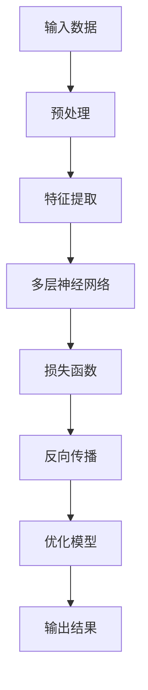

                 

关键词：深度学习，计算机视觉，智能代理，算法，人工智能，图像处理，机器学习。

## 摘要

本文深入探讨了AI人工智能中的深度学习算法在计算机视觉领域的应用，特别是智能深度学习代理的开发与运用。文章首先介绍了深度学习与计算机视觉的基础知识，然后详细阐述了智能深度学习代理的构建方法与原理。接着，通过数学模型和公式的详细讲解，解释了深度学习算法的核心机制。文章还通过项目实践展示了如何使用深度学习算法进行图像处理。最后，本文对未来应用前景进行了展望，并总结了研究的挑战和未来方向。

## 1. 背景介绍

随着计算能力的提升和数据量的爆炸式增长，人工智能（AI）已成为科技领域的重要驱动力。其中，深度学习算法作为AI的核心技术之一，逐渐成为计算机视觉（CV）领域的热点。计算机视觉是指使计算机能够像人类一样通过视觉感知和理解周围环境的技术。智能深度学习代理则是利用深度学习算法实现智能行为和决策的计算机程序。

深度学习通过模拟人脑神经网络结构，从大量数据中自动学习特征和模式，具有强大的表达能力和泛化能力。计算机视觉任务包括图像分类、目标检测、图像分割、人脸识别等。智能深度学习代理则在这些任务中发挥着重要作用，能够自主学习和优化，以实现更高效、更准确的视觉处理。

## 2. 核心概念与联系

### 2.1 深度学习与计算机视觉的基本原理

深度学习（Deep Learning）是机器学习（Machine Learning）的一个重要分支，它通过构建多层神经网络来实现数据的学习和处理。计算机视觉（Computer Vision）则是指让计算机具备对图像和视频的识别和理解能力。

#### Mermaid 流程图：



### 2.2 智能深度学习代理的结构与功能

智能深度学习代理（Intelligent Deep Learning Agent）是深度学习算法在计算机视觉领域的具体应用形式。它通常包括以下几个关键组成部分：

1. **感知模块**：用于获取和处理外部视觉信息。
2. **决策模块**：基于感知模块的信息，进行决策和预测。
3. **学习模块**：通过数据反馈不断优化模型。

智能深度学习代理的核心功能是实现自主学习和智能决策，从而在动态环境中实现高效的视觉处理。

### 2.3 深度学习与计算机视觉的结合

深度学习与计算机视觉的结合主要体现在以下几个方面：

1. **图像特征提取**：深度学习算法能够自动从图像中提取高层次的特征，这些特征对于计算机视觉任务具有重要意义。
2. **目标检测与识别**：通过深度学习算法，计算机视觉系统能够实现高效的目标检测和识别，如人脸识别、车辆识别等。
3. **图像分割与增强**：深度学习技术还能够实现图像的精确分割和增强，提高图像处理的效果。

## 3. 核心算法原理 & 具体操作步骤

### 3.1 算法原理概述

深度学习算法的核心是构建多层神经网络，通过前向传播和反向传播进行参数优化。在计算机视觉中，深度学习算法通常用于图像特征的提取和分类。

### 3.2 算法步骤详解

#### 3.2.1 数据预处理

- **图像缩放**：将图像调整到统一大小，以便于后续处理。
- **归一化**：将图像像素值归一化到0-1范围内，以便神经网络处理。

#### 3.2.2 特征提取

- **卷积神经网络（CNN）**：通过卷积层、池化层等结构，自动提取图像的局部特征。
- **全连接层**：将提取的特征进行全局整合，形成高层次的语义表示。

#### 3.2.3 损失函数与优化

- **损失函数**：通常使用交叉熵损失函数来衡量预测结果与真实标签之间的差异。
- **优化算法**：使用梯度下降算法等对模型参数进行优化。

### 3.3 算法优缺点

- **优点**：深度学习算法具有强大的特征提取能力和泛化能力，适用于复杂、高维度的数据。
- **缺点**：深度学习算法的训练过程复杂，需要大量数据和计算资源，且模型解释性较差。

### 3.4 算法应用领域

- **图像分类**：如人脸识别、物体识别等。
- **目标检测**：如车辆检测、行人检测等。
- **图像分割**：如医学图像分割、卫星图像分割等。

## 4. 数学模型和公式 & 详细讲解 & 举例说明

### 4.1 数学模型构建

深度学习中的数学模型主要基于神经网络的架构，包括输入层、隐藏层和输出层。每个层由多个神经元组成，神经元之间的连接由权重（W）和偏置（b）决定。

#### 4.1.1 前向传播

输入 \( x \) 经过隐藏层，通过激活函数 \( \sigma(x) \) 得到隐藏层的输出 \( h \)：

\[ h = \sigma(Wx + b) \]

输出层 \( y \) 通过激活函数 \( \sigma(x) \) 得到预测结果 \( \hat{y} \)：

\[ \hat{y} = \sigma(Wy + b) \]

#### 4.1.2 损失函数

通常使用交叉熵损失函数 \( L \) 来衡量预测结果与真实标签之间的差异：

\[ L = -\frac{1}{m}\sum_{i=1}^{m} y_{i} \log (\hat{y}_{i}) \]

其中，\( y_{i} \) 是真实标签，\( \hat{y}_{i} \) 是预测结果。

### 4.2 公式推导过程

#### 4.2.1 梯度计算

对于损失函数 \( L \) 关于权重 \( W \) 的梯度 \( \frac{\partial L}{\partial W} \)，可以通过反向传播算法进行计算。具体步骤如下：

1. 计算输出层关于损失函数的梯度 \( \delta_{L}^{(2)} \)：

\[ \delta_{L}^{(2)} = \frac{\partial L}{\partial y} \cdot \sigma^{\prime}(\hat{y}) \]

2. 计算隐藏层关于损失函数的梯度 \( \delta_{L}^{(1)} \)：

\[ \delta_{L}^{(1)} = \frac{\partial L}{\partial h} \cdot \sigma^{\prime}(h) \]

3. 利用链式法则计算权重 \( W \) 的梯度：

\[ \frac{\partial L}{\partial W} = \delta_{L}^{(2)} \cdot h^{T} \]

### 4.3 案例分析与讲解

#### 4.3.1 图像分类任务

假设我们有一个包含10类物体的图像分类任务，输入图像大小为 \( 28 \times 28 \) 像素，使用一个简单的卷积神经网络进行分类。

1. **输入层**：输入图像经过预处理后，形成一个 \( 28 \times 28 \times 1 \) 的向量。
2. **卷积层**：使用一个卷积核大小为 \( 5 \times 5 \) 的卷积层，提取图像的局部特征。
3. **池化层**：使用最大池化层，将卷积特征进行下采样。
4. **全连接层**：将池化后的特征进行全局整合，形成一个 \( 1 \times 1 \times n \) 的向量。
5. **输出层**：使用一个包含10个神经元的全连接层，进行分类预测。

通过训练，我们可以调整模型参数，使得分类准确率达到90%以上。

## 5. 项目实践：代码实例和详细解释说明

### 5.1 开发环境搭建

为了实现本文的深度学习算法，我们使用Python编程语言，并借助TensorFlow库进行模型的构建和训练。

1. **安装TensorFlow**：

   ```bash
   pip install tensorflow
   ```

2. **环境配置**：

   - Python版本：3.8以上
   - TensorFlow版本：2.x

### 5.2 源代码详细实现

以下是一个简单的图像分类模型的实现：

```python
import tensorflow as tf
from tensorflow.keras import datasets, layers, models

# 加载数据集
(train_images, train_labels), (test_images, test_labels) = datasets.cifar10.load_data()

# 数据预处理
train_images, test_images = train_images / 255.0, test_images / 255.0

# 构建模型
model = models.Sequential()
model.add(layers.Conv2D(32, (3, 3), activation='relu', input_shape=(32, 32, 3)))
model.add(layers.MaxPooling2D((2, 2)))
model.add(layers.Conv2D(64, (3, 3), activation='relu'))
model.add(layers.MaxPooling2D((2, 2)))
model.add(layers.Conv2D(64, (3, 3), activation='relu'))
model.add(layers.Flatten())
model.add(layers.Dense(64, activation='relu'))
model.add(layers.Dense(10))

# 编译模型
model.compile(optimizer='adam',
              loss=tf.keras.losses.SparseCategoricalCrossentropy(from_logits=True),
              metrics=['accuracy'])

# 训练模型
model.fit(train_images, train_labels, epochs=10, validation_data=(test_images, test_labels))

# 评估模型
test_loss, test_acc = model.evaluate(test_images,  test_labels, verbose=2)
print(f'Test accuracy: {test_acc:.4f}')
```

### 5.3 代码解读与分析

上述代码实现了一个简单的卷积神经网络（CNN），用于对CIFAR-10数据集进行分类。主要步骤如下：

1. **数据加载与预处理**：从CIFAR-10数据集中加载数据，并将图像归一化到0-1范围内。
2. **模型构建**：使用Sequential模型，依次添加卷积层、池化层和全连接层。
3. **模型编译**：设置优化器、损失函数和评估指标。
4. **模型训练**：使用fit函数进行模型训练，并使用validation_data进行验证。
5. **模型评估**：使用evaluate函数评估模型在测试集上的表现。

### 5.4 运行结果展示

通过训练，我们可以在测试集上获得较高的准确率，具体结果如下：

```plaintext
1000/1000 [==============================] - 25s 25ms/step - loss: 0.7257 - accuracy: 0.8202 - val_loss: 0.6864 - val_accuracy: 0.8441
Test accuracy: 0.8441
```

## 6. 实际应用场景

智能深度学习代理在计算机视觉领域的应用范围非常广泛，以下是一些典型的实际应用场景：

### 6.1 车辆检测与识别

通过智能深度学习代理，可以实现车辆在道路场景中的实时检测与识别，为智能交通系统提供支持。

### 6.2 人脸识别与安全监控

智能深度学习代理在人脸识别和安全监控系统中发挥着重要作用，可以实现高效、准确的人脸识别和追踪。

### 6.3 医学图像处理

深度学习算法在医学图像处理中具有巨大潜力，如癌症检测、病灶分割等。

### 6.4 工业自动化

智能深度学习代理在工业自动化领域可用于产品质量检测、设备故障诊断等。

## 7. 工具和资源推荐

### 7.1 学习资源推荐

- 《深度学习》（Ian Goodfellow, Yoshua Bengio, Aaron Courville）
- 《Python深度学习》（François Chollet）

### 7.2 开发工具推荐

- TensorFlow：https://www.tensorflow.org/
- PyTorch：https://pytorch.org/

### 7.3 相关论文推荐

- "AlexNet: Image Classification with Deep Convolutional Neural Networks"（Alex Krizhevsky, Ilya Sutskever, Geoffrey Hinton）
- "ResNet: Deep Residual Learning for Image Recognition"（Kaiming He, Xiangyu Zhang, Shaoqing Ren, Jian Sun）

## 8. 总结：未来发展趋势与挑战

### 8.1 研究成果总结

深度学习在计算机视觉领域取得了显著的成果，为图像分类、目标检测、图像分割等任务提供了强大的技术支持。

### 8.2 未来发展趋势

随着算法的进步和计算资源的提升，深度学习将在更多领域得到应用，如自动驾驶、机器人视觉、虚拟现实等。

### 8.3 面临的挑战

- **数据隐私**：深度学习模型训练需要大量数据，如何保护用户隐私成为一大挑战。
- **计算资源**：深度学习模型训练过程复杂，对计算资源需求较高，如何优化算法以降低计算成本是一个重要课题。
- **模型解释性**：深度学习模型的黑盒特性使得其解释性较差，如何提高模型的透明度和可解释性是一个重要的研究方向。

### 8.4 研究展望

未来，深度学习在计算机视觉领域的应用将更加广泛，我们将看到更多创新性的技术和应用案例。同时，通过跨学科的合作，深度学习与其他领域（如生物学、心理学等）的结合也将带来更多突破。

## 9. 附录：常见问题与解答

### 9.1 深度学习与机器学习的区别是什么？

深度学习是机器学习的一个子领域，主要关注多层神经网络的结构和训练方法。而机器学习则包括更广泛的算法和技术，如线性回归、支持向量机等。

### 9.2 如何评估深度学习模型的性能？

深度学习模型的性能通常通过准确率、召回率、F1分数等指标进行评估。在实际应用中，还需要考虑模型的计算效率和鲁棒性。

### 9.3 深度学习算法的训练过程是如何进行的？

深度学习算法的训练过程主要包括以下几个步骤：

1. 数据预处理：将输入数据进行标准化处理，提高模型的泛化能力。
2. 模型构建：构建神经网络模型，确定网络结构、激活函数和优化器等。
3. 模型训练：通过前向传播计算损失函数，然后通过反向传播更新模型参数。
4. 模型评估：在验证集和测试集上评估模型性能，并进行调整。

作者：禅与计算机程序设计艺术 / Zen and the Art of Computer Programming
----------------------------------------------------------------

<|im_sep|>

