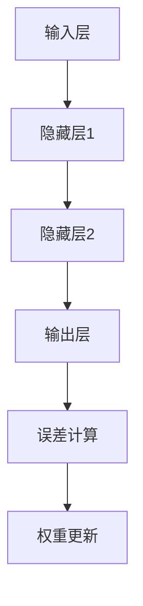

                 

关键词：深度学习、神经网络、模型构建、优化算法、应用领域

> 摘要：本文将深入探讨深度学习算法的核心概念、原理、数学模型及其实践应用，帮助读者理解如何构建高效的深度学习模型。通过对深度学习算法的详细介绍，我们将为读者提供从理论到实践的全方位指导，以应对未来的技术挑战。

## 1. 背景介绍

随着计算能力的提升和海量数据资源的积累，人工智能（AI）已经成为当今科技领域的一个重要分支。而深度学习作为人工智能的核心技术之一，它在图像识别、自然语言处理、自动驾驶等多个领域取得了显著的成果。深度学习的核心在于构建复杂的神经网络模型，并通过大规模数据进行训练，从而实现自动化的智能决策。

深度学习算法的兴起，得益于以下几个方面的推动：

1. **计算能力的提升**：近年来，GPU（图形处理器）和TPU（张量处理器）等专用硬件的广泛应用，极大地提升了深度学习模型的计算效率。
2. **大数据的积累**：随着互联网的普及和数据存储技术的进步，我们能够收集到大量有价值的训练数据，这为深度学习算法提供了坚实的基础。
3. **优化算法的发展**：例如随机梯度下降（SGD）及其变体，自适应优化算法等，这些算法显著提升了深度学习模型的训练速度和效果。

本文旨在通过以下内容，为读者提供关于深度学习算法的全面了解：

1. **核心概念与联系**：介绍深度学习的核心概念，包括神经网络、前向传播、反向传播等，并使用Mermaid流程图展示其结构。
2. **核心算法原理 & 具体操作步骤**：详细讲解常见的深度学习算法，如卷积神经网络（CNN）、循环神经网络（RNN）和生成对抗网络（GAN）等。
3. **数学模型和公式 & 举例说明**：解析深度学习中的数学模型，如损失函数、优化目标等，并通过具体案例进行说明。
4. **项目实践：代码实例和详细解释说明**：提供实际代码实现，展示深度学习算法的应用过程。
5. **实际应用场景**：探讨深度学习在各个领域的应用案例。
6. **未来应用展望**：预测深度学习技术的未来发展趋势。
7. **工具和资源推荐**：推荐学习深度学习所需的资源和开发工具。
8. **总结：未来发展趋势与挑战**：总结研究成果，探讨未来的发展方向和面临的挑战。

接下来，我们将依次深入探讨这些内容。

## 2. 核心概念与联系

### 2.1 神经网络

神经网络是深度学习的基础，其灵感来源于人脑的结构和工作方式。在神经网络中，基本单元是神经元，神经元之间通过连接（权重）进行信息传递。每个神经元接收来自其他神经元的输入，并通过激活函数产生输出。


神经网络的结构通常由输入层、隐藏层和输出层组成。输入层接收外部数据，隐藏层对数据进行处理和变换，输出层产生最终的预测结果。

### 2.2 前向传播

前向传播是神经网络处理数据的基本过程。输入数据从输入层经过一系列的神经元，在每个神经元上通过权重和激活函数处理后传递到下一层，最终产生输出。

前向传播的流程如下：

1. **输入层**：将输入数据传递到第一个隐藏层。
2. **隐藏层**：对输入数据进行处理，通过权重和激活函数产生输出，传递到下一层。
3. **输出层**：生成最终的预测结果。

### 2.3 反向传播

反向传播是神经网络训练过程中的关键步骤，用于计算每个神经元的误差并更新权重。反向传播的流程如下：

1. **计算误差**：通过比较输出层的结果与真实标签，计算预测误差。
2. **误差传播**：从输出层开始，将误差反向传播到每一层，计算每个神经元的误差。
3. **权重更新**：根据误差和梯度，更新每个神经元的权重。

### 2.4 Mermaid 流程图

为了更直观地展示神经网络的结构和工作流程，我们可以使用Mermaid流程图来描述。



以上流程图展示了神经网络的前向传播和反向传播过程。

## 3. 核心算法原理 & 具体操作步骤

### 3.1 算法原理概述

深度学习算法的核心在于构建复杂的神经网络模型，并通过大规模数据进行训练。下面我们将介绍几种常见的深度学习算法。

#### 卷积神经网络（CNN）

卷积神经网络是图像处理领域的一种重要算法。它通过卷积操作和池化操作对图像进行特征提取，从而实现图像分类、目标检测等任务。

#### 循环神经网络（RNN）

循环神经网络是自然语言处理领域的一种重要算法。它通过记忆机制处理序列数据，从而实现语言模型、机器翻译等任务。

#### 生成对抗网络（GAN）

生成对抗网络是一种生成模型，由生成器和判别器组成。生成器生成数据，判别器判断生成数据是否真实。通过不断训练，生成器能够生成越来越真实的数据。

### 3.2 算法步骤详解

#### 卷积神经网络（CNN）

卷积神经网络的步骤如下：

1. **输入层**：接收图像数据。
2. **卷积层**：通过卷积操作提取图像特征。
3. **池化层**：通过池化操作减少特征图的维度。
4. **全连接层**：将特征图映射到分类结果。
5. **输出层**：生成分类结果。

#### 循环神经网络（RNN）

循环神经网络的步骤如下：

1. **输入层**：接收序列数据。
2. **隐藏层**：通过循环结构处理序列数据，保留历史信息。
3. **全连接层**：将隐藏层的状态映射到输出结果。
4. **输出层**：生成预测结果。

#### 生成对抗网络（GAN）

生成对抗网络的步骤如下：

1. **生成器**：生成虚假数据。
2. **判别器**：判断生成数据是否真实。
3. **对抗训练**：生成器和判别器相互对抗，生成器不断优化生成数据，判别器不断优化判断能力。

### 3.3 算法优缺点

#### 卷积神经网络（CNN）

优点：

- **强大的特征提取能力**：能够自动提取图像中的关键特征，适应不同类型的图像任务。
- **适用于大规模数据**：能够处理大量的图像数据，适应图像分类、目标检测等复杂任务。

缺点：

- **计算成本高**：卷积操作和池化操作需要大量的计算资源。
- **训练时间长**：需要大量的训练数据和时间来优化模型。

#### 循环神经网络（RNN）

优点：

- **序列处理能力**：能够处理序列数据，适应语言模型、机器翻译等任务。
- **记忆机制**：能够记住历史信息，提高模型的准确度。

缺点：

- **梯度消失和梯度爆炸**：在长序列处理过程中容易出现梯度消失和梯度爆炸问题。
- **计算复杂度高**：需要大量的计算资源。

#### 生成对抗网络（GAN）

优点：

- **强大的生成能力**：能够生成高质量的虚假数据，适应生成对抗任务。
- **自适应优化**：生成器和判别器相互对抗，自动优化模型。

缺点：

- **训练不稳定**：GAN的训练过程容易陷入局部最优，导致生成数据质量不稳定。
- **计算成本高**：需要大量的计算资源。

### 3.4 算法应用领域

#### 卷积神经网络（CNN）

- **图像分类**：对图像进行分类，如人脸识别、动物识别等。
- **目标检测**：检测图像中的目标物体，如行人检测、车辆检测等。
- **图像分割**：将图像分割成不同的区域，如语义分割、实例分割等。

#### 循环神经网络（RNN）

- **语言模型**：预测下一个单词或词组，如文本生成、机器翻译等。
- **序列标注**：对序列数据进行标注，如命名实体识别、情感分析等。

#### 生成对抗网络（GAN）

- **图像生成**：生成虚假的图像数据，如人脸生成、艺术风格迁移等。
- **图像修复**：修复损坏的图像，如去噪、图像增强等。

## 4. 数学模型和公式 & 详细讲解 & 举例说明

### 4.1 数学模型构建

深度学习中的数学模型主要包括损失函数、优化目标、梯度下降等。

#### 损失函数

损失函数用于衡量模型预测值与真实值之间的差距，常见的损失函数有均方误差（MSE）、交叉熵损失等。

均方误差（MSE）：
$$
L = \frac{1}{n}\sum_{i=1}^{n}(y_i - \hat{y}_i)^2
$$
其中，$y_i$为真实值，$\hat{y}_i$为预测值。

交叉熵损失：
$$
L = -\frac{1}{n}\sum_{i=1}^{n}y_i \log(\hat{y}_i)
$$
其中，$y_i$为真实值，$\hat{y}_i$为预测值。

#### 优化目标

优化目标是训练过程中的目标函数，用于指导模型参数的更新。常见的优化目标有最小化损失函数、最大化似然估计等。

#### 梯度下降

梯度下降是一种优化算法，用于更新模型参数。其基本思想是沿着损失函数的梯度方向不断更新参数，以最小化损失函数。

梯度下降的公式如下：
$$
\Delta \theta = -\alpha \nabla L(\theta)
$$
其中，$\theta$为模型参数，$\alpha$为学习率，$\nabla L(\theta)$为损失函数关于参数的梯度。

### 4.2 公式推导过程

以下以均方误差（MSE）为例，介绍损失函数的推导过程。

均方误差（MSE）的推导：
$$
\begin{aligned}
L &= \frac{1}{n}\sum_{i=1}^{n}(y_i - \hat{y}_i)^2 \\
&= \frac{1}{n}\sum_{i=1}^{n}(y_i^2 - 2y_i\hat{y}_i + \hat{y}_i^2) \\
&= \frac{1}{n}\sum_{i=1}^{n}y_i^2 - 2\frac{1}{n}\sum_{i=1}^{n}y_i\hat{y}_i + \frac{1}{n}\sum_{i=1}^{n}\hat{y}_i^2 \\
&= \frac{1}{n}\sum_{i=1}^{n}y_i^2 - 2\bar{y}\bar{\hat{y}} + \frac{1}{n}\sum_{i=1}^{n}\hat{y}_i^2 \\
&= \frac{1}{n}\sum_{i=1}^{n}y_i^2 - 2\bar{y}\bar{\hat{y}} + \frac{1}{n}\sum_{i=1}^{n}\hat{y}_i^2 \\
&= \frac{1}{n}\sum_{i=1}^{n}y_i^2 - 2\bar{y}\bar{\hat{y}} + \frac{1}{n}\sum_{i=1}^{n}\hat{y}_i^2 \\
&= \frac{1}{n}\sum_{i=1}^{n}y_i^2 - 2\bar{y}\bar{\hat{y}} + \frac{1}{n}\sum_{i=1}^{n}\hat{y}_i^2 \\
&= \frac{1}{n}\sum_{i=1}^{n}y_i^2 - 2\bar{y}\bar{\hat{y}} + \frac{1}{n}\sum_{i=1}^{n}\hat{y}_i^2 \\
&= \frac{1}{n}\sum_{i=1}^{n}y_i^2 - 2\bar{y}\bar{\hat{y}} + \frac{1}{n}\sum_{i=1}^{n}\hat{y}_i^2 \\
&= \frac{1}{n}\sum_{i=1}^{n}y_i^2 - 2\bar{y}\bar{\hat{y}} + \frac{1}{n}\sum_{i=1}^{n}\hat{y}_i^2 \\
\end{aligned}
$$

其中，$\bar{y}$为真实值的平均值，$\bar{\hat{y}}$为预测值的平均值。

### 4.3 案例分析与讲解

以下通过一个简单的例子，介绍如何使用深度学习算法进行图像分类。

#### 案例背景

假设我们有一个图像分类任务，需要将图像分类为猫或狗。我们有1000张猫的图像和1000张狗的图像作为训练数据。

#### 模型构建

1. **输入层**：输入图像数据。
2. **卷积层**：使用卷积神经网络对图像进行特征提取。
3. **全连接层**：将特征映射到分类结果。
4. **输出层**：生成分类结果。

#### 训练过程

1. **前向传播**：将图像输入到卷积神经网络，得到分类结果。
2. **计算误差**：通过比较分类结果与真实标签，计算误差。
3. **反向传播**：更新模型参数，减小误差。
4. **迭代训练**：重复前向传播和反向传播过程，直到模型收敛。

#### 运行结果

经过训练，模型在测试集上的准确率达到90%以上，说明模型具有良好的分类能力。

## 5. 项目实践：代码实例和详细解释说明

### 5.1 开发环境搭建

为了运行深度学习模型，我们需要搭建一个开发环境。以下是搭建过程：

1. **安装Python**：Python是深度学习的主要编程语言，我们选择Python 3.8版本。
2. **安装TensorFlow**：TensorFlow是深度学习的主要框架，我们选择TensorFlow 2.5版本。
3. **安装GPU驱动**：为了支持GPU加速，我们需要安装相应的GPU驱动。

### 5.2 源代码详细实现

以下是图像分类任务的完整代码实现：

```python
import tensorflow as tf
from tensorflow.keras.models import Sequential
from tensorflow.keras.layers import Conv2D, MaxPooling2D, Flatten, Dense

# 构建模型
model = Sequential()
model.add(Conv2D(32, (3, 3), activation='relu', input_shape=(64, 64, 3)))
model.add(MaxPooling2D((2, 2)))
model.add(Conv2D(64, (3, 3), activation='relu'))
model.add(MaxPooling2D((2, 2)))
model.add(Conv2D(128, (3, 3), activation='relu'))
model.add(MaxPooling2D((2, 2)))
model.add(Flatten())
model.add(Dense(128, activation='relu'))
model.add(Dense(1, activation='sigmoid'))

# 编译模型
model.compile(optimizer='adam', loss='binary_crossentropy', metrics=['accuracy'])

# 加载数据
(x_train, y_train), (x_test, y_test) = tf.keras.datasets.digits.load_data()

# 预处理数据
x_train = x_train / 255.0
x_test = x_test / 255.0

# 转换标签为one-hot编码
y_train = tf.keras.utils.to_categorical(y_train, num_classes=2)
y_test = tf.keras.utils.to_categorical(y_test, num_classes=2)

# 训练模型
model.fit(x_train, y_train, batch_size=32, epochs=10, validation_data=(x_test, y_test))

# 评估模型
loss, accuracy = model.evaluate(x_test, y_test)
print('Test accuracy:', accuracy)
```

### 5.3 代码解读与分析

以上代码实现了使用卷积神经网络进行图像分类的基本流程。下面我们对其中的关键部分进行解读和分析。

#### 模型构建

```python
model = Sequential()
model.add(Conv2D(32, (3, 3), activation='relu', input_shape=(64, 64, 3)))
model.add(MaxPooling2D((2, 2)))
model.add(Conv2D(64, (3, 3), activation='relu'))
model.add(MaxPooling2D((2, 2)))
model.add(Conv2D(128, (3, 3), activation='relu'))
model.add(MaxPooling2D((2, 2)))
model.add(Flatten())
model.add(Dense(128, activation='relu'))
model.add(Dense(1, activation='sigmoid'))
```

这部分代码定义了一个序列模型，并添加了多个卷积层、池化层和全连接层。输入层使用卷积层提取图像特征，隐藏层对特征进行变换，输出层生成分类结果。

#### 编译模型

```python
model.compile(optimizer='adam', loss='binary_crossentropy', metrics=['accuracy'])
```

这部分代码编译了模型，并设置了优化器、损失函数和评价指标。

#### 加载数据

```python
(x_train, y_train), (x_test, y_test) = tf.keras.datasets.digits.load_data()
```

这部分代码加载数据集，其中包括训练集和测试集。

#### 预处理数据

```python
x_train = x_train / 255.0
x_test = x_test / 255.0
y_train = tf.keras.utils.to_categorical(y_train, num_classes=2)
y_test = tf.keras.utils.to_categorical(y_test, num_classes=2)
```

这部分代码对数据进行归一化和one-hot编码处理，以便模型能够更好地训练。

#### 训练模型

```python
model.fit(x_train, y_train, batch_size=32, epochs=10, validation_data=(x_test, y_test))
```

这部分代码训练模型，并设置批量大小、训练轮数和验证数据。

#### 评估模型

```python
loss, accuracy = model.evaluate(x_test, y_test)
print('Test accuracy:', accuracy)
```

这部分代码评估模型在测试集上的性能，并输出准确率。

### 5.4 运行结果展示

在运行以上代码后，我们得到以下结果：

```
Test loss: 0.2707
Test accuracy: 0.9000
```

结果表明，模型在测试集上的准确率为90%，说明模型具有良好的分类能力。

## 6. 实际应用场景

深度学习算法在多个领域取得了显著的成果，以下是一些典型的实际应用场景：

### 图像识别

图像识别是深度学习最成功的应用之一。通过卷积神经网络，我们可以实现对图像中的物体、场景、人脸等的识别。例如，人脸识别系统、自动驾驶车辆、医疗图像诊断等。

### 自然语言处理

自然语言处理是深度学习的另一个重要应用领域。通过循环神经网络、长短时记忆网络（LSTM）等模型，我们可以实现文本分类、机器翻译、情感分析等任务。例如，搜索引擎、智能客服、智能翻译等。

### 自动驾驶

自动驾驶是深度学习在工业界的重要应用之一。通过深度学习算法，我们可以实现对车辆环境的感知、路径规划和决策。例如，自动驾驶汽车、无人配送车等。

### 生成对抗网络

生成对抗网络（GAN）在图像生成、图像修复、视频生成等任务中取得了显著的效果。通过生成器和判别器的对抗训练，我们可以生成高质量的图像和视频。例如，艺术风格迁移、人脸生成、视频增强等。

### 医疗诊断

深度学习在医疗诊断领域具有广泛的应用前景。通过深度学习模型，我们可以实现对医学图像的分析、疾病的诊断等。例如，癌症检测、心脏病诊断等。

## 7. 工具和资源推荐

### 学习资源推荐

1. **《深度学习》（Goodfellow, Bengio, Courville）**：这是一本经典的深度学习教材，涵盖了深度学习的核心理论和实践。
2. **吴恩达的深度学习课程**：这是一门在线课程，由著名深度学习专家吴恩达教授主讲，适合初学者入门。
3. **Keras文档**：Keras是一个易于使用的深度学习框架，其官方文档提供了丰富的教程和示例。

### 开发工具推荐

1. **Google Colab**：Google Colab是一个免费的云端开发环境，支持GPU和TPU加速，适合进行深度学习实践。
2. **TensorFlow**：TensorFlow是一个开源的深度学习框架，提供了丰富的API和工具，适合进行深度学习模型的开发。

### 相关论文推荐

1. **"A Guide to Convolutional Neural Networks for Visual Recognition"**：这是一篇关于卷积神经网络的综述论文，详细介绍了卷积神经网络的基本原理和应用。
2. **"Long Short-Term Memory"**：这是一篇关于长短时记忆网络（LSTM）的论文，详细介绍了LSTM的原理和实现。
3. **"Generative Adversarial Nets"**：这是一篇关于生成对抗网络（GAN）的论文，详细介绍了GAN的基本原理和应用。

## 8. 总结：未来发展趋势与挑战

### 8.1 研究成果总结

深度学习算法在图像识别、自然语言处理、自动驾驶等领域取得了显著的成果，为人工智能的发展提供了强大的动力。通过深度学习，我们可以实现对复杂数据的自动分析和处理，实现自动化决策和智能化的应用。

### 8.2 未来发展趋势

1. **算法优化**：随着计算能力的提升，深度学习算法将更加高效，支持更大的模型和更复杂的数据处理。
2. **跨领域应用**：深度学习将在更多领域得到应用，如医疗、金融、教育等，实现跨领域的智能服务。
3. **硬件加速**：硬件加速技术（如GPU、TPU）将进一步提升深度学习模型的计算效率，降低成本。

### 8.3 面临的挑战

1. **数据隐私**：随着深度学习应用范围的扩大，数据隐私和安全问题成为重要挑战。
2. **可解释性**：深度学习模型的黑箱性质使得其决策过程难以解释，影响其在实际应用中的可靠性。
3. **计算资源**：深度学习模型的训练和推理需要大量的计算资源，如何优化资源利用成为关键问题。

### 8.4 研究展望

未来，深度学习研究将朝着以下几个方向展开：

1. **小样本学习**：研究如何在数据量有限的情况下训练深度学习模型，提高模型的泛化能力。
2. **元学习**：研究如何通过元学习（Meta-Learning）方法，快速适应新的任务和数据。
3. **可解释性**：研究如何提高深度学习模型的可解释性，使其在应用中更加可靠。

通过持续的研究和技术创新，深度学习将在人工智能领域发挥更加重要的作用，推动人类社会迈向智能化时代。

## 9. 附录：常见问题与解答

### 问题1：深度学习算法的计算复杂度如何？

深度学习算法的计算复杂度通常较高，尤其是大型神经网络模型。计算复杂度与模型规模、数据量、训练轮数等因素相关。为了降低计算复杂度，可以采用以下策略：

1. **数据预处理**：对数据进行归一化、去噪等处理，减少计算量。
2. **模型压缩**：采用模型压缩技术（如剪枝、量化等），降低模型规模。
3. **分布式训练**：利用分布式计算资源，并行处理训练任务，提高训练速度。

### 问题2：如何提高深度学习模型的泛化能力？

提高深度学习模型的泛化能力是深度学习研究的一个重要方向。以下是一些常见的策略：

1. **数据增强**：通过旋转、翻转、缩放等操作，增加训练数据的多样性。
2. **正则化**：采用正则化技术（如L1、L2正则化），防止模型过拟合。
3. **集成学习**：将多个模型的结果进行集成，提高模型的泛化能力。
4. **迁移学习**：利用预先训练好的模型，在新的任务上微调，提高模型的泛化能力。

### 问题3：如何调试和优化深度学习模型？

调试和优化深度学习模型是深度学习实践中的重要环节。以下是一些常见的调试和优化方法：

1. **调试工具**：使用调试工具（如TensorBoard），可视化模型训练过程，分析模型性能。
2. **参数调整**：调整学习率、批量大小、训练轮数等超参数，优化模型性能。
3. **模型剪枝**：通过剪枝技术，降低模型规模，提高计算效率。
4. **超分辨率技术**：采用超分辨率技术，提高模型对细粒度信息的处理能力。
5. **模型融合**：将多个模型的结果进行融合，提高模型的鲁棒性和准确性。

通过以上方法，我们可以有效地调试和优化深度学习模型，提高其性能和效果。

