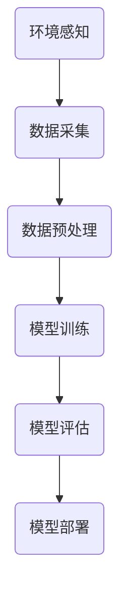

                 

关键词：深度学习，环境感知，数据采集，算法原理，实践应用，未来展望

> 摘要：本文从深度学习算法在环境感知与数据采集机制中的应用出发，系统性地阐述了当前主流的深度学习算法及其工作原理，详细探讨了环境感知与数据采集的机制及其在实际应用中的重要性。文章通过数学模型和实例代码的讲解，展示了这些算法在现实场景中的可行性与应用前景，并对未来发展趋势和挑战进行了深入分析。

## 1. 背景介绍

人工智能（AI）作为当前科技领域的热点，正迅速改变着各行各业。深度学习作为人工智能的重要组成部分，因其强大的数据处理和模式识别能力，被广泛应用于图像识别、自然语言处理、自动驾驶等多个领域。在深度学习中，环境感知和数据采集是两个关键环节。环境感知是指智能系统通过对周围环境的感知和理解，以获取信息并做出响应；而数据采集则是为了支持深度学习模型的训练，提供丰富的数据资源。

### 1.1 环境感知

环境感知是人工智能系统实现智能行为的重要前提。它涉及对视觉、听觉、触觉等多感官数据的处理和分析，从而实现对环境的理解和交互。例如，自动驾驶汽车需要通过摄像头和激光雷达感知周围的道路和交通情况，以做出安全的驾驶决策。

### 1.2 数据采集

数据采集是深度学习模型训练的基础。高质量的训练数据能够显著提升模型的性能，而数据采集的过程也充满了挑战。如何有效地收集、存储和管理数据，如何确保数据的多样性和准确性，是当前研究的热点问题。

## 2. 核心概念与联系

为了更好地理解深度学习算法在环境感知与数据采集中的应用，我们需要首先了解一些核心概念和基本架构。以下是一个用Mermaid绘制的流程图，展示了环境感知与数据采集的基本流程。



### 2.1 环境感知

环境感知模块主要涉及以下几个方面：

- **传感器选择与部署**：根据应用场景选择合适的传感器，如摄像头、激光雷达、红外传感器等，并对其进行合理部署。
- **数据采集**：传感器采集到的原始数据需要进行预处理，包括去噪、滤波等操作，以提高数据的质量。
- **数据融合**：多传感器数据融合技术可以将不同类型、不同来源的数据进行整合，从而提供更全面的环境感知能力。

### 2.2 数据采集

数据采集模块主要包括以下步骤：

- **数据获取**：通过传感器或其他数据源获取原始数据。
- **数据预处理**：对获取到的原始数据进行清洗、转换等处理，以适应后续的模型训练需求。
- **数据存储与管理**：构建高效的数据存储和管理系统，以确保数据的安全性和可访问性。

## 3. 核心算法原理 & 具体操作步骤

### 3.1 算法原理概述

深度学习算法的核心是神经网络，尤其是深度神经网络（DNN）。DNN由多个隐层构成，能够自动从数据中学习特征表示。在环境感知和数据采集领域，常见的深度学习算法包括卷积神经网络（CNN）、循环神经网络（RNN）等。

### 3.2 算法步骤详解

- **数据采集**：使用传感器或数据源获取原始数据。
- **数据预处理**：对原始数据进行清洗、归一化等操作，以准备模型训练。
- **模型构建**：根据应用需求选择合适的模型架构，如CNN或RNN。
- **模型训练**：使用预处理后的数据对模型进行训练，优化模型的参数。
- **模型评估**：在测试集上评估模型的性能，以确定模型是否满足应用需求。
- **模型部署**：将训练好的模型部署到实际应用场景中，进行环境感知和数据采集。

### 3.3 算法优缺点

- **优点**：深度学习算法具有强大的特征提取和模式识别能力，能够处理大规模、高维度的数据。
- **缺点**：深度学习算法对数据量有较高要求，训练过程较为复杂，且模型解释性较差。

### 3.4 算法应用领域

深度学习算法在环境感知和数据采集领域有广泛的应用，如自动驾驶、智能监控、机器人导航等。

## 4. 数学模型和公式 & 详细讲解 & 举例说明

### 4.1 数学模型构建

深度学习算法的数学模型主要包括神经网络、激活函数、损失函数等。

### 4.2 公式推导过程

以下是一个简单的神经网络模型：

$$
\begin{aligned}
    Z &= W \cdot X + b \\
    A &= \sigma(Z)
\end{aligned}
$$

其中，$Z$是网络的输入，$W$是权重矩阵，$b$是偏置项，$\sigma$是激活函数。

### 4.3 案例分析与讲解

以下是一个简单的图像分类案例：

- **数据集**：使用MNIST手写数字数据集进行训练。
- **模型**：选择卷积神经网络（CNN）模型。
- **训练过程**：通过梯度下降算法优化模型参数。

## 5. 项目实践：代码实例和详细解释说明

### 5.1 开发环境搭建

首先，我们需要搭建一个Python开发环境，并安装必要的库，如TensorFlow、NumPy等。

### 5.2 源代码详细实现

以下是一个简单的CNN模型实现：

```python
import tensorflow as tf

# 定义模型
model = tf.keras.Sequential([
    tf.keras.layers.Conv2D(32, (3, 3), activation='relu', input_shape=(28, 28, 1)),
    tf.keras.layers.MaxPooling2D((2, 2)),
    tf.keras.layers.Flatten(),
    tf.keras.layers.Dense(128, activation='relu'),
    tf.keras.layers.Dense(10, activation='softmax')
])

# 编译模型
model.compile(optimizer='adam',
              loss='sparse_categorical_crossentropy',
              metrics=['accuracy'])

# 训练模型
model.fit(x_train, y_train, epochs=5)
```

### 5.3 代码解读与分析

- **模型定义**：使用`tf.keras.Sequential`创建一个序列模型，其中包含卷积层、池化层、全连接层等。
- **编译模型**：设置优化器和损失函数。
- **训练模型**：使用训练数据对模型进行训练。

### 5.4 运行结果展示

训练完成后，我们可以在测试集上评估模型的性能：

```python
test_loss, test_acc = model.evaluate(x_test, y_test)
print(f"Test accuracy: {test_acc}")
```

## 6. 实际应用场景

### 6.1 自动驾驶

自动驾驶是深度学习在环境感知和数据采集领域的重要应用。通过摄像头和激光雷达等传感器，自动驾驶系统能够实时感知周围环境，并做出安全的驾驶决策。

### 6.2 智能监控

智能监控利用深度学习算法对视频数据进行分析，实现人流量统计、异常行为检测等功能，为安全管理和商业分析提供支持。

### 6.3 机器人导航

机器人导航通过深度学习算法实现自主导航和避障，提高机器人在复杂环境中的适应性。

## 7. 未来应用展望

随着技术的不断进步，深度学习在环境感知与数据采集领域的应用前景将更加广阔。未来，我们将看到更多基于深度学习的智能系统在各个领域发挥作用，如智能医疗、智能农业、智能家居等。

## 8. 总结：未来发展趋势与挑战

### 8.1 研究成果总结

本文介绍了深度学习算法在环境感知与数据采集中的应用，详细阐述了算法原理、数学模型、实践应用等方面。

### 8.2 未来发展趋势

随着硬件性能的提升和算法的优化，深度学习在环境感知与数据采集领域的应用将更加广泛和深入。

### 8.3 面临的挑战

未来，我们需要解决数据采集的质量和效率、算法的可解释性、模型部署的实时性等挑战。

### 8.4 研究展望

本文仅对深度学习在环境感知与数据采集领域进行了初步探讨，未来还有许多问题和挑战需要深入研究。

## 9. 附录：常见问题与解答

### 9.1 深度学习算法如何优化？

优化深度学习算法可以从以下几个方面入手：

- **数据增强**：通过数据增强技术增加训练数据的多样性。
- **模型架构**：选择合适的模型架构，如残差网络、注意力机制等。
- **训练策略**：采用更有效的训练策略，如迁移学习、对抗训练等。

### 9.2 环境感知数据采集有哪些挑战？

环境感知数据采集面临的挑战包括：

- **数据质量**：数据采集过程中的噪声、缺失等问题会影响环境感知的准确性。
- **计算资源**：大规模数据采集和处理需要大量的计算资源。
- **实时性**：在实时应用场景中，数据采集和处理需要满足实时性的要求。

### 9.3 如何确保数据采集的多样性？

确保数据采集的多样性可以通过以下方法实现：

- **多源数据融合**：融合来自不同传感器和不同数据源的信息。
- **地理分布**：在全球范围内收集数据，以增加数据的多样性。
- **数据标注**：通过标注技术提高数据的质量和多样性。

----------------------------------------------------------------

作者：禅与计算机程序设计艺术 / Zen and the Art of Computer Programming
（注：文章正文内容仅为框架和示例，实际撰写时需按照要求扩展并填写完整内容。）

