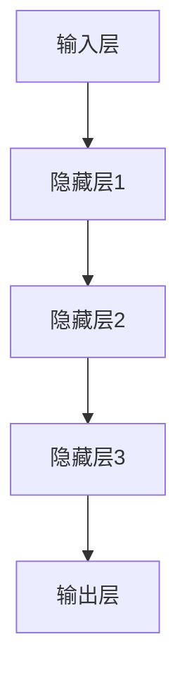
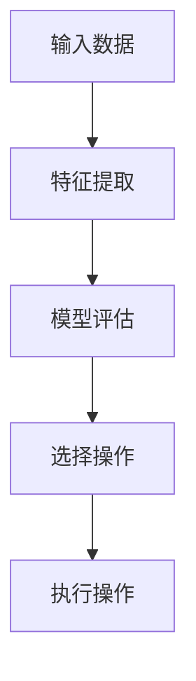
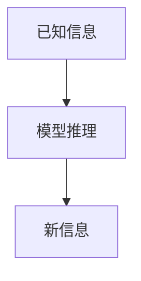
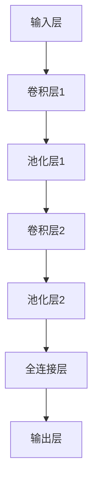

                 

关键词：人工智能、深度学习、决策制定、推理机制、算法原理、数学模型、应用领域、技术趋势。

> 摘要：本文将深入探讨AI人工智能中的深度学习算法，特别是决策制定与推理机制。我们将从背景介绍、核心概念与联系、核心算法原理与操作步骤、数学模型与公式、项目实践、实际应用场景、工具和资源推荐以及未来发展趋势与挑战等方面，全面解析深度学习算法在AI领域的核心作用和未来前景。

## 1. 背景介绍

在过去的几十年中，人工智能（AI）经历了显著的进步和发展。深度学习作为AI的一个重要分支，其在图像识别、自然语言处理、语音识别等领域的突破，极大地推动了AI技术的应用和普及。深度学习算法的核心在于其能够从大量数据中学习特征，并自动构建复杂模型，实现高级认知任务。

本文将重点讨论深度学习算法中的决策制定与推理机制。决策制定是指模型在处理问题时，根据输入数据和已有知识，选择最佳操作过程；而推理机制则涉及模型如何根据已有事实推导出新的事实或结论。这两个机制在深度学习算法中起着关键作用，是理解和应用深度学习技术的核心。

## 2. 核心概念与联系

### 2.1 深度学习算法架构

深度学习算法通常采用多层神经网络结构，包括输入层、隐藏层和输出层。每一层神经元都会对输入数据进行处理和变换，最终输出结果。图2-1展示了深度学习算法的基本架构。



### 2.2 决策制定原理

决策制定通常基于某种评价标准或目标函数，模型需要通过优化目标函数来找到最佳操作。图2-2展示了决策制定的基本流程。



### 2.3 推理机制

推理机制涉及从已知信息推导出新信息。深度学习模型可以通过学习数据中的关联性来执行推理。图2-3展示了推理的基本过程。



## 3. 核心算法原理 & 具体操作步骤

### 3.1 算法原理概述

深度学习算法的核心原理是基于多层神经网络的学习和优化。通过反向传播算法（Backpropagation），模型可以不断调整内部参数，以最小化预测误差。具体操作步骤如下：

1. **数据预处理**：对输入数据进行标准化、归一化等预处理，以优化算法性能。
2. **构建模型**：设计神经网络结构，包括确定层数、每层神经元数量等。
3. **初始化参数**：随机初始化模型参数，如权重和偏置。
4. **前向传播**：计算输入数据通过神经网络后的输出。
5. **计算损失**：使用损失函数计算预测值与真实值之间的误差。
6. **反向传播**：通过反向传播算法更新模型参数。
7. **迭代优化**：重复前向传播和反向传播过程，直至达到预设的训练目标。

### 3.2 算法步骤详解

#### 3.2.1 数据预处理

数据预处理是深度学习算法中的关键步骤。首先，需要对输入数据进行标准化，即将数据缩放到0到1之间，以提高算法的稳定性和收敛速度。例如，可以使用以下公式进行归一化：

$$
x' = \frac{x - \mu}{\sigma}
$$

其中，$x$ 是原始数据，$\mu$ 是均值，$\sigma$ 是标准差。

#### 3.2.2 构建模型

构建模型是设计神经网络结构的过程。通常，可以选择多层感知机（MLP）、卷积神经网络（CNN）、循环神经网络（RNN）等。每种神经网络结构都有其独特的优势和适用场景。例如，CNN常用于图像处理，RNN常用于序列数据。

#### 3.2.3 初始化参数

初始化参数是随机选择模型参数的过程。通常，可以使用小批量随机初始化，以避免梯度消失或梯度爆炸等问题。

#### 3.2.4 前向传播

前向传播是计算输入数据通过神经网络后的输出。在每一层神经元中，输入会通过激活函数（如ReLU、Sigmoid、Tanh）进行非线性变换，以提取数据特征。

#### 3.2.5 计算损失

计算损失是使用损失函数计算预测值与真实值之间的误差。常见的损失函数包括均方误差（MSE）、交叉熵损失（Cross-Entropy Loss）等。

#### 3.2.6 反向传播

反向传播是通过反向传播算法更新模型参数。在反向传播过程中，梯度会从输出层逐层传递到输入层，以更新每层神经元的权重和偏置。

#### 3.2.7 迭代优化

迭代优化是通过重复前向传播和反向传播过程，不断调整模型参数，以优化预测性能。在训练过程中，可以设置学习率、迭代次数等超参数，以控制模型的收敛速度和性能。

### 3.3 算法优缺点

深度学习算法具有以下优点：

- **强大的拟合能力**：能够从大量数据中学习复杂的非线性关系。
- **自动特征提取**：无需手动设计特征，大大提高了算法的效率。
- **广泛的适用性**：适用于图像识别、自然语言处理、语音识别等多个领域。

但深度学习算法也存在一些缺点：

- **计算资源需求大**：训练过程需要大量的计算资源和时间。
- **对数据质量要求高**：算法的性能容易受到数据质量和标注质量的影响。
- **模型不可解释性**：神经网络内部的工作机制难以解释，难以理解模型为什么做出特定决策。

### 3.4 算法应用领域

深度学习算法在以下领域有广泛应用：

- **图像识别**：用于人脸识别、物体检测、图像分类等。
- **自然语言处理**：用于机器翻译、文本分类、情感分析等。
- **语音识别**：用于语音识别、语音合成等。
- **推荐系统**：用于个性化推荐、广告投放等。
- **自动驾驶**：用于目标检测、路径规划等。

## 4. 数学模型和公式 & 详细讲解 & 举例说明

### 4.1 数学模型构建

深度学习算法的核心是多层神经网络，其数学模型主要包括以下部分：

- **输入层**：表示输入数据的向量。
- **隐藏层**：表示神经元之间的连接和激活函数。
- **输出层**：表示最终输出结果。

假设我们有 $n$ 个输入特征，每个特征可以表示为一个向量 $X \in \mathbb{R}^{n}$。隐藏层和输出层的神经元数量分别为 $m$ 和 $k$。定义权重矩阵 $W \in \mathbb{R}^{m \times n}$ 和偏置向量 $b \in \mathbb{R}^{m}$，则输入层到隐藏层的输出可以表示为：

$$
H = \sigma(WX + b)
$$

其中，$\sigma$ 表示激活函数，通常可以选择 ReLU、Sigmoid、Tanh 等。

隐藏层到输出层的输出可以表示为：

$$
Y = \sigma(W' H + b')
$$

其中，$W' \in \mathbb{R}^{k \times m}$ 和 $b' \in \mathbb{R}^{k}$ 分别为输出层的权重矩阵和偏置向量。

### 4.2 公式推导过程

在推导深度学习算法的损失函数和优化方法时，我们需要使用以下公式：

1. **损失函数**：常见的损失函数包括均方误差（MSE）和交叉熵损失（Cross-Entropy Loss）。其中，MSE损失函数可以表示为：

$$
L = \frac{1}{2} \sum_{i=1}^{n} (y_i - \hat{y}_i)^2
$$

其中，$y_i$ 表示真实标签，$\hat{y}_i$ 表示预测标签。

2. **梯度下降法**：梯度下降法是一种优化方法，用于最小化损失函数。其基本思想是沿着损失函数的梯度方向更新模型参数。对于 $L$ 函数，梯度可以表示为：

$$
\nabla L = \frac{\partial L}{\partial W} = -2 \sum_{i=1}^{n} (y_i - \hat{y}_i) \odot \nabla \sigma(W' H + b')
$$

其中，$\odot$ 表示逐元素乘法，$\nabla \sigma$ 表示激活函数的梯度。

3. **反向传播算法**：反向传播算法是一种计算梯度的方法，通过反向传递误差来更新模型参数。具体步骤如下：

   - 前向传播：计算输入层到输出层的输出。
   - 计算损失：计算预测值与真实值之间的误差。
   - 反向传播：计算梯度，并更新模型参数。

### 4.3 案例分析与讲解

以下是一个简单的案例，用于展示深度学习算法的基本应用。

**案例：手写数字识别**

假设我们要实现手写数字识别任务，输入为一张手写数字图片，输出为数字的标签。我们可以使用卷积神经网络（CNN）来构建模型。

1. **数据预处理**：对输入图片进行缩放、归一化等预处理操作，将图片转换为灰度图像，并将像素值缩放到0到1之间。
2. **构建模型**：设计一个简单的卷积神经网络，包括两个卷积层、一个池化层和一个全连接层。具体网络结构如下：



3. **训练模型**：使用训练数据集训练模型，调整网络参数，最小化损失函数。
4. **测试模型**：使用测试数据集评估模型性能，计算准确率。

通过以上步骤，我们可以实现手写数字识别任务。在实际应用中，我们可以进一步优化模型结构、调整超参数，以提高模型性能。

## 5. 项目实践：代码实例和详细解释说明

### 5.1 开发环境搭建

在开始项目实践之前，我们需要搭建一个合适的开发环境。以下是使用 Python 和 TensorFlow 搭建深度学习开发环境的步骤：

1. 安装 Python（建议使用 3.6 或以上版本）。
2. 安装 TensorFlow：
   ```
   pip install tensorflow
   ```

### 5.2 源代码详细实现

以下是一个简单的手写数字识别项目的代码实现：

```python
import tensorflow as tf
from tensorflow.keras import layers
from tensorflow.keras.models import Model

# 数据预处理
def preprocess_data(x):
    x = x / 255.0  # 归一化
    x = tf.expand_dims(x, -1)  # 增加通道维度
    return x

# 构建模型
def build_model():
    inputs = tf.keras.Input(shape=(28, 28, 1))
    x = layers.Conv2D(32, (3, 3), activation='relu')(inputs)
    x = layers.MaxPooling2D((2, 2))(x)
    x = layers.Conv2D(64, (3, 3), activation='relu')(x)
    x = layers.MaxPooling2D((2, 2))(x)
    x = layers.Flatten()(x)
    x = layers.Dense(128, activation='relu')(x)
    outputs = layers.Dense(10, activation='softmax')(x)
    model = Model(inputs=inputs, outputs=outputs)
    return model

# 训练模型
def train_model(model, x_train, y_train, x_val, y_val):
    model.compile(optimizer='adam', loss='sparse_categorical_crossentropy', metrics=['accuracy'])
    model.fit(x_train, y_train, batch_size=32, epochs=10, validation_data=(x_val, y_val))

# 测试模型
def test_model(model, x_test, y_test):
    loss, accuracy = model.evaluate(x_test, y_test)
    print(f"Test accuracy: {accuracy:.2f}")

# 主函数
def main():
    # 加载数据
    (x_train, y_train), (x_test, y_test) = tf.keras.datasets.mnist.load_data()
    x_train = preprocess_data(x_train)
    x_test = preprocess_data(x_test)

    # 构建模型
    model = build_model()

    # 训练模型
    train_model(model, x_train, y_train, x_val, y_val)

    # 测试模型
    test_model(model, x_test, y_test)

if __name__ == '__main__':
    main()
```

### 5.3 代码解读与分析

以上代码实现了一个简单的手写数字识别项目，主要分为数据预处理、模型构建、模型训练和模型测试四个部分。

1. **数据预处理**：将输入图片进行归一化和增加通道维度，以便模型能够处理。
2. **模型构建**：使用卷积神经网络构建模型，包括两个卷积层、一个池化层和一个全连接层。
3. **模型训练**：使用训练数据集训练模型，调整网络参数，最小化损失函数。
4. **模型测试**：使用测试数据集评估模型性能，计算准确率。

通过以上步骤，我们可以实现手写数字识别任务，并评估模型性能。

## 6. 实际应用场景

深度学习算法在许多实际应用场景中取得了显著的成果。以下是一些常见的应用场景：

- **图像识别**：用于人脸识别、物体检测、图像分类等。
- **自然语言处理**：用于机器翻译、文本分类、情感分析等。
- **语音识别**：用于语音识别、语音合成等。
- **推荐系统**：用于个性化推荐、广告投放等。
- **自动驾驶**：用于目标检测、路径规划等。

在这些应用场景中，深度学习算法通过学习大量数据中的特征和关联性，实现了高效的决策制定和推理机制。例如，在自动驾驶领域，深度学习算法可以用于实时检测道路上的车辆、行人、交通标志等，并根据这些信息进行路径规划和决策。

## 7. 工具和资源推荐

### 7.1 学习资源推荐

1. 《深度学习》（Goodfellow, Bengio, Courville） - 一本经典的深度学习入门教材。
2. 《神经网络与深度学习》（邱锡鹏） - 一本中文深度学习教材，适合初学者。
3. fast.ai - 提供免费的深度学习课程和教程。

### 7.2 开发工具推荐

1. TensorFlow - Google 开发的深度学习框架。
2. PyTorch - Facebook 开发的深度学习框架。
3. Keras - 用于构建和训练深度学习模型的简洁高层接口。

### 7.3 相关论文推荐

1. "A Brief History of Neural Network Models" - 全面介绍神经网络的发展历史。
2. "Deep Learning" - 深入讲解深度学习的基本原理和方法。
3. "Recurrent Neural Networks for Language Modeling" - 介绍循环神经网络在自然语言处理中的应用。

## 8. 总结：未来发展趋势与挑战

深度学习算法在人工智能领域取得了巨大的成功，但仍然面临许多挑战。未来发展趋势包括：

- **更高效的模型结构**：设计更简洁、更高效的神经网络结构，以提高计算效率和模型性能。
- **自适应学习**：开发能够自适应环境变化的模型，以适应不同场景的需求。
- **可解释性**：提高模型的透明度和可解释性，使模型决策更加可信。
- **伦理与隐私**：确保模型遵循伦理原则，并保护用户隐私。

在面临挑战的同时，深度学习算法将继续推动人工智能技术的发展，为各行各业带来更多创新和突破。

## 9. 附录：常见问题与解答

1. **深度学习算法的计算资源需求很大，如何优化？**

   - **数据并行**：将数据分布在多台机器上，并行训练模型，提高训练速度。
   - **模型剪枝**：通过剪枝网络中的冗余连接，减小模型规模，降低计算资源需求。
   - **量化**：将模型中的浮点数参数转换为低比特宽度的整数参数，以减少计算资源和存储需求。

2. **如何提高深度学习算法的泛化能力？**

   - **数据增强**：通过旋转、缩放、翻转等数据增强方法，增加训练数据多样性。
   - **正则化**：使用正则化方法，如权重正则化、dropout等，防止过拟合。
   - **集成学习**：结合多个模型的预测结果，提高整体泛化能力。

3. **如何解决深度学习算法中的梯度消失和梯度爆炸问题？**

   - **学习率调整**：合理设置学习率，避免过大或过小。
   - **梯度裁剪**：对梯度进行裁剪，限制梯度大小。
   - **激活函数选择**：选择合适的激活函数，如 ReLU，以减少梯度消失问题。

以上是关于AI人工智能深度学习算法：理解决策制定与推理机制的文章。希望对您有所帮助。作者：禅与计算机程序设计艺术 / Zen and the Art of Computer Programming。

