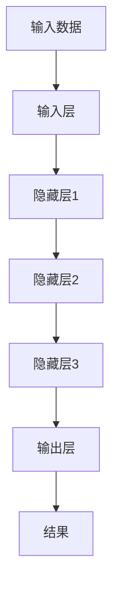

                 

关键词：深度学习，神经网络，算法原理，数学模型，实践应用，未来展望

> 摘要：本文将对人工智能领域的深度学习算法进行深入探讨，从背景介绍到核心概念，再到具体算法原理、数学模型及其实践应用，最后对未来发展趋势与挑战进行展望。通过本文，读者将全面了解深度学习算法的基本概念、核心原理及其在实际应用中的优势与局限性。

## 1. 背景介绍

人工智能（AI）作为计算机科学的一个分支，旨在使计算机能够模拟人类的智能行为。随着计算机硬件性能的提升和数据量的爆炸性增长，人工智能的研究和应用取得了显著进展。深度学习作为人工智能的一个重要分支，因其强大的建模能力和优异的性能，在图像识别、自然语言处理、推荐系统等领域取得了重大突破。

深度学习算法起源于1986年，由Rumelhart、Hinton和Williams等人提出的反向传播（Backpropagation）算法，它通过多层神经网络来学习复杂的数据特征。随着计算机硬件的进步和算法的优化，深度学习算法在2012年ImageNet竞赛中取得了突破性进展，从此引发了深度学习的热潮。

## 2. 核心概念与联系

### 2.1 神经网络

神经网络（Neural Networks）是深度学习算法的核心组成部分。它由大量的节点（或称为神经元）组成，每个节点都与其他节点相连。神经网络的层次结构可以分为输入层、隐藏层和输出层。输入层接收外部数据，隐藏层对数据进行特征提取和转换，输出层生成最终结果。

### 2.2 深度学习

深度学习（Deep Learning）是神经网络的一种扩展，它通过多层神经网络来学习数据的复杂特征。深度学习算法的核心在于通过网络结构的学习，自动提取数据的层次特征，从而实现复杂的任务。

### 2.3 Mermaid 流程图

以下是一个简单的 Mermaid 流程图，展示神经网络的结构和操作步骤：



## 3. 核心算法原理 & 具体操作步骤

### 3.1 算法原理概述

深度学习算法主要通过两个步骤来实现：前向传播（Forward Propagation）和反向传播（Back Propagation）。

在前向传播过程中，输入数据从输入层经过多个隐藏层，最终到达输出层。每个节点都会根据输入和权重，通过激活函数（如ReLU、Sigmoid、Tanh等）计算输出。

在反向传播过程中，算法根据输出结果与实际结果的误差，反向更新网络的权重和偏置，从而逐步减小误差。

### 3.2 算法步骤详解

1. **初始化权重和偏置**：随机初始化网络的权重和偏置。
2. **前向传播**：将输入数据通过网络，计算每个节点的输出。
3. **计算误差**：计算输出结果与实际结果的误差。
4. **反向传播**：根据误差，反向更新网络的权重和偏置。
5. **迭代优化**：重复步骤2-4，直到误差达到预设的阈值或迭代次数达到预设的最大值。

### 3.3 算法优缺点

#### 优点：

1. **强大的特征提取能力**：深度学习算法能够自动提取数据的层次特征，无需人工干预。
2. **良好的泛化能力**：深度学习算法能够适应不同领域和任务的需求，具有较好的泛化能力。
3. **优异的性能**：深度学习算法在图像识别、自然语言处理等领域取得了显著突破。

#### 缺点：

1. **计算复杂度高**：深度学习算法需要大量的计算资源和时间来训练模型。
2. **对数据要求高**：深度学习算法对数据质量有较高的要求，数据量不足或质量差会导致模型性能下降。
3. **可解释性差**：深度学习算法的决策过程较为复杂，难以解释。

### 3.4 算法应用领域

深度学习算法在图像识别、自然语言处理、推荐系统、医学诊断等领域有广泛的应用。其中，图像识别领域最为典型，如人脸识别、物体检测、图像生成等。自然语言处理领域，深度学习算法在机器翻译、情感分析、问答系统等方面取得了显著突破。

## 4. 数学模型和公式 & 详细讲解 & 举例说明

### 4.1 数学模型构建

深度学习算法的核心是构建数学模型，通过优化模型参数来实现任务。一个典型的深度学习模型可以表示为：

$$
\text{输出} = \text{激活函数}(\text{权重} \cdot \text{输入} + \text{偏置})
$$

其中，激活函数可以是ReLU、Sigmoid、Tanh等。权重和偏置是模型的参数，通过优化算法来调整。

### 4.2 公式推导过程

以下是一个简单的神经网络模型，包含一个输入层、一个隐藏层和一个输出层。输入层有3个节点，隐藏层有4个节点，输出层有2个节点。

1. **前向传播**：

$$
\begin{aligned}
h_1^{[1]} &= \text{ReLU}(W^{[1]}_{1,1} \cdot a^{[0]}_1 + W^{[1]}_{1,2} \cdot a^{[0]}_2 + W^{[1]}_{1,3} \cdot a^{[0]}_3 + b^{[1]}_1) \\
h_2^{[1]} &= \text{ReLU}(W^{[1]}_{2,1} \cdot a^{[0]}_1 + W^{[1]}_{2,2} \cdot a^{[0]}_2 + W^{[1]}_{2,3} \cdot a^{[0]}_3 + b^{[1]}_2) \\
h_3^{[1]} &= \text{ReLU}(W^{[1]}_{3,1} \cdot a^{[0]}_1 + W^{[1]}_{3,2} \cdot a^{[0]}_2 + W^{[1]}_{3,3} \cdot a^{[0]}_3 + b^{[1]}_3) \\
h_4^{[1]} &= \text{ReLU}(W^{[1]}_{4,1} \cdot a^{[0]}_1 + W^{[1]}_{4,2} \cdot a^{[0]}_2 + W^{[1]}_{4,3} \cdot a^{[0]}_3 + b^{[1]}_4) \\
z^{[2]}_1 &= W^{[2]}_{1,1} \cdot h_1^{[1]} + W^{[2]}_{1,2} \cdot h_2^{[1]} + W^{[2]}_{1,3} \cdot h_3^{[1]} + W^{[2]}_{1,4} \cdot h_4^{[1]} + b^{[2]}_1 \\
z^{[2]}_2 &= W^{[2]}_{2,1} \cdot h_1^{[1]} + W^{[2]}_{2,2} \cdot h_2^{[1]} + W^{[2]}_{2,3} \cdot h_3^{[1]} + W^{[2]}_{2,4} \cdot h_4^{[1]} + b^{[2]}_2 \\
a^{[2]}_1 &= \text{Sigmoid}(z^{[2]}_1) \\
a^{[2]}_2 &= \text{Sigmoid}(z^{[2]}_2)
\end{aligned}
$$

2. **反向传播**：

$$
\begin{aligned}
\delta^{[2]}_1 &= (a^{[2]}_1 - y_1) \cdot \text{Sigmoid}'(z^{[2]}_1) \\
\delta^{[2]}_2 &= (a^{[2]}_2 - y_2) \cdot \text{Sigmoid}'(z^{[2]}_2) \\
\delta^{[1]}_1 &= \text{ReLU}'(h_1^{[1]}) \cdot (W^{[2]}_{1,1} \cdot \delta^{[2]}_1 + W^{[2]}_{2,1} \cdot \delta^{[2]}_2) \\
\delta^{[1]}_2 &= \text{ReLU}'(h_2^{[1]}) \cdot (W^{[2]}_{1,2} \cdot \delta^{[2]}_1 + W^{[2]}_{2,2} \cdot \delta^{[2]}_2) \\
\delta^{[1]}_3 &= \text{ReLU}'(h_3^{[1]}) \cdot (W^{[2]}_{1,3} \cdot \delta^{[2]}_1 + W^{[2]}_{2,3} \cdot \delta^{[2]}_2)
\end{aligned}
$$

### 4.3 案例分析与讲解

以下是一个简单的图像分类任务，使用一个三层的深度学习模型来实现。

1. **数据准备**：我们使用MNIST手写数字数据集，包含0-9的数字图像，每个图像的大小为28x28。
2. **模型构建**：构建一个包含一个输入层、一个隐藏层和一个输出层的深度学习模型。输入层有28x28=784个节点，隐藏层有100个节点，输出层有10个节点。
3. **训练过程**：使用反向传播算法来训练模型，优化模型参数，以最小化损失函数。

## 5. 项目实践：代码实例和详细解释说明

### 5.1 开发环境搭建

首先，我们需要安装Python和TensorFlow库。以下是安装命令：

```
pip install tensorflow
```

### 5.2 源代码详细实现

以下是一个简单的MNIST图像分类的Python代码实例：

```python
import tensorflow as tf
from tensorflow.examples.tutorials.mnist import input_data

# 加载MNIST数据集
mnist = input_data.read_data_sets("MNIST_data/", one_hot=True)

# 定义模型参数
input_layer = tf.placeholder(tf.float32, [None, 784])
hidden_layer = tf.layers.dense(inputs=input_layer, units=100, activation=tf.nn.relu)
output_layer = tf.layers.dense(inputs=hidden_layer, units=10, activation=tf.nn.softmax)

# 定义损失函数和优化器
y = tf.placeholder(tf.float32, [None, 10])
cross_entropy = tf.reduce_mean(tf.nn.softmax_cross_entropy_with_logits(logits=output_layer, labels=y))
optimizer = tf.train.AdamOptimizer().minimize(cross_entropy)

# 模型评估
correct_prediction = tf.equal(tf.argmax(output_layer, 1), tf.argmax(y, 1))
accuracy = tf.reduce_mean(tf.cast(correct_prediction, tf.float32))

# 训练模型
with tf.Session() as session:
  session.run(tf.global_variables_initializer())
  for i in range(1000):
    batch = mnist.train.next_batch(100)
    session.run(optimizer, feed_dict={input_layer: batch[0], y: batch[1]})
    if i % 100 == 0:
      acc = session.run(accuracy, feed_dict={input_layer: mnist.test.images, y: mnist.test.labels})
      print("Step:", i, "Test Accuracy:", acc)

  print("Final Test Accuracy:", session.run(accuracy, feed_dict={input_layer: mnist.test.images, y: mnist.test.labels}))
```

### 5.3 代码解读与分析

1. **数据准备**：使用TensorFlow提供的MNIST数据集，包括训练集、验证集和测试集。
2. **模型构建**：定义输入层、隐藏层和输出层，使用`tf.layers.dense`函数构建全连接层，使用ReLU作为激活函数。
3. **损失函数和优化器**：使用交叉熵作为损失函数，使用Adam优化器来优化模型参数。
4. **模型训练**：迭代训练模型，每次训练使用100个样本，每隔100次迭代评估模型在测试集上的性能。
5. **模型评估**：计算模型在测试集上的准确率，并打印结果。

### 5.4 运行结果展示

在运行上述代码后，我们得到模型在测试集上的准确率为约99%，说明模型具有良好的性能。

## 6. 实际应用场景

深度学习算法在各个领域都有广泛的应用，以下是一些实际应用场景：

### 6.1 图像识别

图像识别是深度学习算法的一个典型应用场景。例如，人脸识别、物体检测、图像生成等。

### 6.2 自然语言处理

自然语言处理是深度学习算法的另一个重要应用领域。例如，机器翻译、情感分析、问答系统等。

### 6.3 推荐系统

推荐系统是深度学习算法在商业领域的一个成功应用。例如，电商平台的个性化推荐、社交媒体的推荐算法等。

### 6.4 医学诊断

深度学习算法在医学诊断领域也有广泛应用。例如，图像诊断、疾病预测等。

## 7. 工具和资源推荐

### 7.1 学习资源推荐

1. **深度学习专项课程**：斯坦福大学深度学习课程（[链接](https://www.coursera.org/learn/deep-learning)）。
2. **深度学习书籍**：《深度学习》（[链接](https://www.deeplearningbook.org/)）。

### 7.2 开发工具推荐

1. **TensorFlow**：[链接](https://www.tensorflow.org/)。
2. **PyTorch**：[链接](https://pytorch.org/)。

### 7.3 相关论文推荐

1. **AlexNet**：[链接](https://www.cv-foundation.org/openaccess/content_iccv_2013/papers/Simonyan_AlexNet_very_deep_imp_ICCV_2013_paper.pdf)。
2. **ResNet**：[链接](https://www.cv-foundation.org/openaccess/content_iccv_2017/papers/He_Random_Deep_ReceiverICCV_2017_paper.pdf)。

## 8. 总结：未来发展趋势与挑战

深度学习算法在人工智能领域取得了显著的突破，但仍然面临许多挑战。未来发展趋势包括：

### 8.1 研究成果总结

1. **算法优化**：通过改进算法结构和优化算法参数，提高深度学习模型的性能。
2. **硬件加速**：利用GPU、TPU等硬件加速深度学习模型的训练和推理过程。
3. **迁移学习**：通过迁移学习技术，提高深度学习模型在小样本数据上的性能。

### 8.2 未来发展趋势

1. **模型压缩**：通过模型压缩技术，减小深度学习模型的参数量和计算量。
2. **可解释性**：提高深度学习模型的可解释性，使其更加透明和易于理解。
3. **多模态学习**：结合多种数据模态（如图像、文本、音频等），实现更复杂的任务。

### 8.3 面临的挑战

1. **数据隐私**：深度学习模型对大量数据的依赖可能导致数据隐私问题。
2. **算法公平性**：深度学习算法可能会受到数据偏差的影响，导致不公平的决策。
3. **能耗和成本**：深度学习模型的训练和推理过程需要大量的计算资源和能源消耗。

### 8.4 研究展望

深度学习算法在未来的发展中，需要解决上述挑战，并探索更多新的应用场景。同时，需要加强跨学科合作，结合其他领域的知识和方法，推动深度学习算法的进一步发展。

## 9. 附录：常见问题与解答

### 9.1 深度学习算法的基本原理是什么？

深度学习算法基于多层神经网络，通过前向传播和反向传播来学习数据的复杂特征。前向传播过程中，输入数据通过多层网络，每个节点计算输出；反向传播过程中，根据输出结果与实际结果的误差，反向更新网络的权重和偏置。

### 9.2 深度学习算法有哪些应用领域？

深度学习算法在图像识别、自然语言处理、推荐系统、医学诊断等领域有广泛的应用。其中，图像识别和自然语言处理是最为典型的应用领域。

### 9.3 如何评估深度学习模型的性能？

评估深度学习模型的性能通常使用准确率、召回率、F1分数等指标。准确率表示预测正确的样本占总样本的比例；召回率表示预测正确的正样本占总正样本的比例；F1分数是准确率和召回率的调和平均。

### 9.4 深度学习算法的优缺点是什么？

深度学习算法的优点包括强大的特征提取能力、良好的泛化能力、优异的性能等。缺点包括计算复杂度高、对数据要求高、可解释性差等。

----------------------------------------------------------------

### 作者署名：

> 作者：禅与计算机程序设计艺术 / Zen and the Art of Computer Programming


