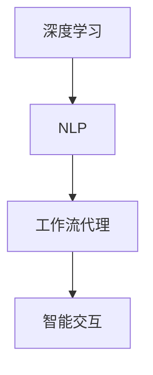
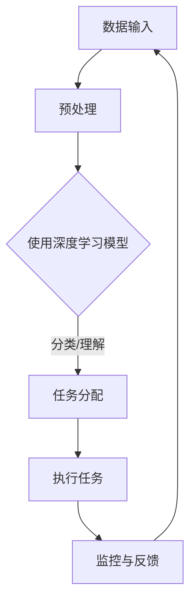

                 

关键词：AI，深度学习，自然语言处理，工作流代理，算法应用，数学模型，代码实例，实际应用场景，未来展望

摘要：本文深入探讨了AI人工智能深度学习算法在自然语言处理领域中的应用，特别是其在工作流代理中的运用。文章首先介绍了相关背景，然后详细解析了核心算法原理和具体操作步骤，通过数学模型和公式推导，以及代码实例，解释了算法的实现和运行机制。最后，文章讨论了实际应用场景，工具和资源推荐，并对未来发展趋势与挑战进行了展望。

## 1. 背景介绍

随着信息技术的飞速发展，人工智能（AI）已成为当前科技领域的热点。深度学习作为AI的核心技术之一，已经在图像识别、语音识别等多个领域取得了显著成果。而自然语言处理（NLP）是AI的一个分支，旨在使计算机能够理解、生成和交互人类语言。工作流代理则是一种利用AI技术自动化管理复杂任务的系统。本文将探讨如何将深度学习算法应用于自然语言处理，以实现高效的工作流代理。

## 2. 核心概念与联系

### 2.1 深度学习与自然语言处理

深度学习是机器学习的一个分支，通过构建多层神经网络，对数据进行自动特征提取和学习。自然语言处理则专注于使计算机能够理解、处理和生成自然语言。

### 2.2 工作流代理

工作流代理是一种自动化系统，能够根据预设规则和算法，处理和执行工作流中的任务。这些任务可能包括数据处理、任务分配、进度监控等。

### 2.3 关联与融合

深度学习算法在NLP中的应用，使得工作流代理能够更智能地理解和处理人类语言。这种关联和融合，为工作流代理提供了强大的自然语言交互能力。

## 2.4 Mermaid 流程图



## 3. 核心算法原理 & 具体操作步骤

### 3.1 算法原理概述

深度学习算法在NLP中的应用，主要通过神经网络模型实现。常见的模型包括卷积神经网络（CNN）、递归神经网络（RNN）、长短期记忆网络（LSTM）等。这些模型能够对文本数据进行特征提取和语义理解。

### 3.2 算法步骤详解

1. **数据预处理**：对文本数据进行分析和清洗，提取关键词和特征。
2. **模型选择与训练**：根据任务需求，选择合适的神经网络模型，并进行训练。
3. **模型优化**：通过调整模型参数，提高模型性能。
4. **模型应用**：将训练好的模型应用于工作流代理，实现自然语言处理和智能交互。

### 3.3 算法优缺点

**优点**：
- **强大的语义理解能力**：深度学习模型能够对文本数据中的复杂语义进行准确理解。
- **自适应性和灵活性**：模型能够根据不同任务需求进行自适应调整。

**缺点**：
- **计算资源需求高**：深度学习模型通常需要大量的计算资源和时间进行训练。
- **数据依赖性强**：模型的性能依赖于训练数据的质量和数量。

### 3.4 算法应用领域

深度学习算法在NLP中的应用非常广泛，包括但不限于：
- **文本分类**：如新闻分类、垃圾邮件过滤等。
- **情感分析**：对文本数据中的情感倾向进行识别和分析。
- **问答系统**：如智能客服、智能问答等。

## 4. 数学模型和公式 & 详细讲解 & 举例说明

### 4.1 数学模型构建

在深度学习算法中，常用的数学模型包括损失函数、优化算法等。

### 4.2 公式推导过程

以下是一个简单的神经网络损失函数的推导过程：

$$
L(y, \hat{y}) = \frac{1}{2} \sum_{i=1}^{n} (y_i - \hat{y}_i)^2
$$

其中，$y$ 表示真实标签，$\hat{y}$ 表示预测标签。

### 4.3 案例分析与讲解

假设我们有一个文本分类任务，数据集包含1000篇新闻文章，每篇文章被标注为政治、经济、体育中的一个类别。我们可以使用一个二分类的神经网络模型进行训练。

1. **数据预处理**：将文本数据转化为向量表示，可以使用词袋模型或词嵌入技术。
2. **模型选择**：选择一个简单的全连接神经网络模型，包含输入层、隐藏层和输出层。
3. **模型训练**：使用随机梯度下降（SGD）算法对模型进行训练。
4. **模型评估**：通过交叉验证和测试集对模型进行评估。

## 5. 项目实践：代码实例和详细解释说明

### 5.1 开发环境搭建

我们需要安装以下软件和库：
- Python 3.x
- TensorFlow
- Keras

### 5.2 源代码详细实现

以下是一个简单的文本分类任务的代码实现：

```python
from tensorflow.keras.models import Sequential
from tensorflow.keras.layers import Dense, Embedding, LSTM
from tensorflow.keras.preprocessing.sequence import pad_sequences

# 数据预处理
# ...

# 模型构建
model = Sequential()
model.add(Embedding(input_dim=vocab_size, output_dim=embedding_dim))
model.add(LSTM(units=128, dropout=0.2, recurrent_dropout=0.2))
model.add(Dense(units=num_classes, activation='softmax'))

# 模型编译
model.compile(optimizer='adam', loss='categorical_crossentropy', metrics=['accuracy'])

# 模型训练
model.fit(X_train, y_train, epochs=10, batch_size=64)

# 模型评估
# ...
```

### 5.3 代码解读与分析

上述代码首先对文本数据进行了预处理，包括词汇表构建、序列化等。然后构建了一个简单的LSTM模型，包含一个嵌入层和一个LSTM层。模型使用softmax激活函数进行分类。

### 5.4 运行结果展示

在训练完成后，我们可以使用测试集对模型进行评估，并展示模型的性能指标。

## 6. 实际应用场景

深度学习算法在NLP和工作流代理中的应用场景非常广泛，以下是一些具体的应用场景：

- **智能客服**：利用自然语言处理和深度学习算法，实现对用户问题的自动回答和分类。
- **智能推荐系统**：通过对用户历史行为和兴趣进行分析，实现个性化推荐。
- **文本审核**：利用情感分析和文本分类算法，实现对不良信息的自动检测和过滤。

## 7. 工具和资源推荐

### 7.1 学习资源推荐

- **书籍**：《深度学习》（Goodfellow, Bengio, Courville）是一本非常全面的深度学习教材。
- **在线课程**：Coursera、Udacity、edX等平台提供了丰富的深度学习和NLP课程。

### 7.2 开发工具推荐

- **TensorFlow**：一个开源的深度学习框架，适合进行算法研究和应用开发。
- **Keras**：一个基于TensorFlow的高层API，简化了深度学习模型的构建和训练。

### 7.3 相关论文推荐

- **《深度学习在自然语言处理中的应用》（Zhang et al., 2017）**：综述了深度学习在NLP中的应用。
- **《神经网络文本分类算法》（Liu et al., 2019）**：详细分析了神经网络在文本分类任务中的应用。

## 8. 总结：未来发展趋势与挑战

深度学习在自然语言处理和工作流代理中的应用前景广阔。未来发展趋势包括：

- **算法性能提升**：通过优化算法和模型结构，提高深度学习模型的性能。
- **跨领域应用**：将深度学习算法应用于更多领域，如医疗、金融等。

然而，面临的挑战包括：

- **数据质量和隐私**：高质量的数据是深度学习模型训练的基础，同时需要保护用户隐私。
- **计算资源**：深度学习模型通常需要大量的计算资源，这对硬件和软件提出了更高的要求。

## 9. 附录：常见问题与解答

### 9.1 深度学习在NLP中的应用有哪些优势？

深度学习在NLP中的应用优势包括强大的语义理解能力、自适应性和灵活性。

### 9.2 如何选择合适的神经网络模型？

根据任务需求和数据特性，选择合适的神经网络模型。例如，对于文本分类任务，可以选择LSTM或CNN模型。

### 9.3 深度学习模型的训练时间如何优化？

可以通过调整学习率、批量大小、优化算法等参数来优化训练时间。

### 9.4 深度学习在NLP中的实际应用场景有哪些？

实际应用场景包括智能客服、智能推荐系统、文本审核等。

### 9.5 深度学习算法在NLP中的应用有哪些挑战？

挑战包括数据质量和隐私、计算资源需求等。

# 作者署名

作者：禅与计算机程序设计艺术 / Zen and the Art of Computer Programming
```markdown
# AI人工智能深度学习算法：自然语言处理在工作流代理中的运用

## 关键词
AI，深度学习，自然语言处理，工作流代理，算法应用，数学模型，代码实例，实际应用场景，未来展望

## 摘要
本文深入探讨了AI人工智能深度学习算法在自然语言处理领域中的应用，特别是其在工作流代理中的运用。文章首先介绍了相关背景，然后详细解析了核心算法原理和具体操作步骤，通过数学模型和公式推导，以及代码实例，解释了算法的实现和运行机制。最后，文章讨论了实际应用场景，工具和资源推荐，并对未来发展趋势与挑战进行了展望。

## 1. 背景介绍

随着信息技术的飞速发展，人工智能（AI）已成为当前科技领域的热点。深度学习作为AI的核心技术之一，已经在图像识别、语音识别等多个领域取得了显著成果。而自然语言处理（NLP）是AI的一个分支，旨在使计算机能够理解、处理和生成人类语言。工作流代理则是一种利用AI技术自动化管理复杂任务的系统。本文将探讨如何将深度学习算法应用于自然语言处理，以实现高效的工作流代理。

## 2. 核心概念与联系

### 2.1 深度学习与自然语言处理

深度学习是一种基于多层神经网络的机器学习技术，通过模拟人类大脑的神经网络结构，对数据进行自动特征提取和学习。自然语言处理（NLP）是计算机科学和人工智能领域的一个分支，旨在让计算机理解和处理人类语言。深度学习在NLP中的应用主要体现在文本数据的特征提取和语义理解上。

### 2.2 工作流代理

工作流代理是一种基于AI技术的自动化系统，它能够根据预设的规则和算法，对工作流中的任务进行自动化管理。工作流代理可以处理各种复杂的任务，如任务分配、进度监控、资源调度等。在工作流代理中，自然语言处理被广泛应用于任务说明的理解、用户交互和决策支持等环节。

### 2.3 关联与融合

深度学习算法在NLP中的应用，使得工作流代理能够更智能地理解和处理人类语言。这种关联和融合，为工作流代理提供了强大的自然语言交互能力，从而提升了系统的智能化水平。例如，工作流代理可以自动解析用户的需求，生成相应的任务，并在执行过程中实时调整任务计划，以提高整体效率。

## 2.4 Mermaid 流程图



## 3. 核心算法原理 & 具体操作步骤

### 3.1 算法原理概述

深度学习算法在自然语言处理中的应用，主要依赖于神经网络模型。神经网络通过多层非线性变换，对输入数据进行特征提取和语义理解。在自然语言处理中，常见的神经网络模型包括卷积神经网络（CNN）、循环神经网络（RNN）、长短期记忆网络（LSTM）和变换器（Transformer）等。

### 3.2 算法步骤详解

1. **数据预处理**：对输入的文本数据进行预处理，包括分词、去停用词、词干提取等，将文本转换为适合神经网络处理的向量表示。
2. **模型构建**：根据任务需求，选择合适的神经网络模型。例如，对于文本分类任务，可以选择CNN或LSTM模型；对于机器翻译任务，可以选择Transformer模型。
3. **模型训练**：使用预处理的文本数据，对神经网络模型进行训练。训练过程中，通过优化算法调整模型参数，使得模型能够在训练集上取得较好的性能。
4. **模型评估**：在训练完成后，使用测试集对模型进行评估，判断模型在未知数据上的泛化能力。
5. **模型应用**：将训练好的模型应用于实际任务，如文本分类、机器翻译、命名实体识别等。

### 3.3 算法优缺点

**优点**：
- **强大的语义理解能力**：深度学习算法能够自动提取文本中的语义信息，使得计算机能够更好地理解和处理人类语言。
- **自适应性和灵活性**：深度学习模型可以根据不同任务需求进行自适应调整，具有很强的灵活性。
- **跨领域应用**：深度学习算法在自然语言处理中的应用非常广泛，可以应用于多个领域，如文本分类、机器翻译、情感分析等。

**缺点**：
- **计算资源需求高**：深度学习算法通常需要大量的计算资源和时间进行训练，对硬件和软件性能有较高要求。
- **数据依赖性强**：模型的性能很大程度上取决于训练数据的质量和数量，数据质量较差时，模型的性能可能会受到影响。
- **模型解释性较差**：深度学习模型的黑盒特性使得其难以解释，这对于需要模型解释性的应用场景可能是一个挑战。

### 3.4 算法应用领域

深度学习算法在自然语言处理中的应用领域非常广泛，主要包括以下几个方面：

- **文本分类**：用于对大量文本数据进行自动分类，如新闻分类、情感分析、垃圾邮件过滤等。
- **机器翻译**：利用深度学习模型，实现自动翻译功能，如谷歌翻译、百度翻译等。
- **命名实体识别**：用于从文本中识别出人名、地名、组织名等实体，如百度AI开放平台提供的人名识别服务。
- **对话系统**：用于构建智能客服、聊天机器人等对话系统，如腾讯AI开放平台的智能客服系统。
- **文本生成**：利用深度学习模型，实现自动生成文本，如自动写作、文章生成等。

## 4. 数学模型和公式 & 详细讲解 & 举例说明

### 4.1 数学模型构建

在深度学习算法中，常用的数学模型包括损失函数、优化算法等。

#### 损失函数

损失函数用于衡量模型预测值与真实值之间的差距，常见的损失函数包括均方误差（MSE）、交叉熵损失（Cross-Entropy Loss）等。

- 均方误差（MSE）：

  $$MSE = \frac{1}{n}\sum_{i=1}^{n} (\hat{y}_i - y_i)^2$$

  其中，$\hat{y}_i$ 是模型预测值，$y_i$ 是真实值，$n$ 是样本数量。

- 交叉熵损失（Cross-Entropy Loss）：

  $$CE = -\sum_{i=1}^{n} y_i \log(\hat{y}_i)$$

  其中，$y_i$ 是真实值，$\hat{y}_i$ 是模型预测值。

#### 优化算法

优化算法用于调整模型参数，使得损失函数值最小。常见的优化算法包括随机梯度下降（SGD）、Adam等。

- 随机梯度下降（SGD）：

  $$w_{t+1} = w_{t} - \alpha \frac{\partial L(w)}{\partial w}$$

  其中，$w_t$ 是当前参数值，$\alpha$ 是学习率，$L(w)$ 是损失函数。

- Adam优化算法：

  $$m_t = \beta_1 m_{t-1} + (1 - \beta_1) \frac{\partial L(w)}{\partial w}$$

  $$v_t = \beta_2 v_{t-1} + (1 - \beta_2) (\frac{\partial L(w)}{\partial w})^2$$

  $$w_{t+1} = w_{t} - \alpha \frac{m_t}{\sqrt{v_t} + \epsilon}$$

  其中，$m_t$ 和 $v_t$ 分别是第 $t$ 次迭代的估计值，$\beta_1$ 和 $\beta_2$ 分别是动量因子，$\epsilon$ 是一个很小的常数。

### 4.2 公式推导过程

以下是一个简单的神经网络损失函数的推导过程：

假设我们有一个简单的一层神经网络，输入层有 $n$ 个神经元，输出层有 $m$ 个神经元。每个神经元的输入和输出可以通过以下公式表示：

$$
z_j = \sum_{i=1}^{n} w_{ji} x_i + b_j
$$

$$
\hat{y}_k = \sigma(z_k)
$$

其中，$x_i$ 是输入层的第 $i$ 个神经元，$w_{ji}$ 是输入层到隐藏层的权重，$b_j$ 是隐藏层的偏置，$\sigma$ 是激活函数，$\hat{y}_k$ 是输出层的第 $k$ 个神经元。

对于输出层的损失函数，我们通常使用交叉熵损失：

$$
L = -\sum_{k=1}^{m} y_k \log(\hat{y}_k)
$$

其中，$y_k$ 是输出层的真实值。

为了求导，我们可以将损失函数对每个神经元的输出求偏导数：

$$
\frac{\partial L}{\partial \hat{y}_k} = -y_k \frac{1}{\hat{y}_k}
$$

由于激活函数 $\sigma$ 的导数可以表示为：

$$
\sigma'(z) = \sigma(z) (1 - \sigma(z))
$$

我们可以得到：

$$
\frac{\partial \hat{y}_k}{\partial z_k} = \sigma'(z_k)
$$

因此，损失函数对隐藏层权重的偏导数可以表示为：

$$
\frac{\partial L}{\partial w_{ji}} = \sum_{k=1}^{m} \frac{\partial L}{\partial \hat{y}_k} \frac{\partial \hat{y}_k}{\partial z_k} \frac{\partial z_k}{\partial w_{ji}} = \sum_{k=1}^{m} (-y_k) \frac{1}{\hat{y}_k} \sigma'(z_k) x_i
$$

同理，损失函数对隐藏层偏置的偏导数可以表示为：

$$
\frac{\partial L}{\partial b_j} = \sum_{k=1}^{m} \frac{\partial L}{\partial \hat{y}_k} \frac{\partial \hat{y}_k}{\partial z_k} = \sum_{k=1}^{m} (-y_k) \frac{1}{\hat{y}_k} \sigma'(z_k)
$$

### 4.3 案例分析与讲解

假设我们有一个简单的文本分类任务，数据集包含1000篇新闻文章，每篇文章被标注为政治、经济、体育中的一个类别。我们需要使用一个深度学习模型对这些文章进行分类。

#### 数据预处理

首先，我们需要对文本数据进行预处理，包括分词、去停用词、词干提取等。然后，将预处理后的文本转换为向量表示，可以使用词袋模型或词嵌入技术。

#### 模型构建

我们选择一个简单的全连接神经网络模型，包含输入层、隐藏层和输出层。输入层有多个神经元，对应于每个词的向量表示；隐藏层有一个神经元，用于提取文本的语义信息；输出层有3个神经元，分别对应于政治、经济、体育三个类别。

#### 模型训练

使用预处理后的文本数据和标签，对神经网络模型进行训练。训练过程中，通过优化算法调整模型参数，使得模型能够在训练集上取得较好的性能。

#### 模型评估

在训练完成后，使用测试集对模型进行评估，判断模型在未知数据上的泛化能力。可以使用准确率、召回率、F1值等指标来评估模型的性能。

#### 模型应用

将训练好的模型应用于实际任务，如对一篇新的新闻文章进行分类。输入层接收新的文本数据，隐藏层提取语义信息，输出层输出分类结果。

## 5. 项目实践：代码实例和详细解释说明

### 5.1 开发环境搭建

在开始项目实践之前，我们需要搭建一个开发环境。以下是在Python环境中搭建深度学习开发环境的步骤：

1. 安装Python 3.7及以上版本。
2. 安装Anaconda或Miniconda，这是一个Python的科学计算环境。
3. 使用conda命令创建一个新的虚拟环境，例如：

   ```bash
   conda create -n text_classification python=3.7
   conda activate text_classification
   ```

4. 安装深度学习库TensorFlow和Keras：

   ```bash
   conda install tensorflow
   conda install keras
   ```

### 5.2 源代码详细实现

以下是一个使用Keras实现文本分类任务的简单代码示例。这个示例将使用IMDb电影评论数据集，该数据集包含50,000篇评论，分为正面和负面两类。

```python
# 导入必要的库
import numpy as np
import pandas as pd
from keras.preprocessing.sequence import pad_sequences
from keras.models import Sequential
from keras.layers import Embedding, LSTM, Dense, Dropout
from keras.preprocessing.text import Tokenizer

# 加载IMDb数据集
from keras.datasets import imdb
(max_features, (X_train, y_train), (X_test, y_test)) = imdb.load_data(num_words=10000)

# 数据预处理
maxlen = 500  # 设置序列的最大长度
X_train = pad_sequences(X_train, maxlen=maxlen)
X_test = pad_sequences(X_test, maxlen=maxlen)

# 构建模型
model = Sequential()
model.add(Embedding(max_features, 128))
model.add(LSTM(128, dropout=0.2, recurrent_dropout=0.2))
model.add(Dense(1, activation='sigmoid'))

# 编译模型
model.compile(optimizer='adam', loss='binary_crossentropy', metrics=['accuracy'])

# 训练模型
model.fit(X_train, y_train, epochs=3, batch_size=32, validation_split=0.2)

# 评估模型
loss, accuracy = model.evaluate(X_test, y_test)
print('Test accuracy:', accuracy)
```

#### 5.3 代码解读与分析

- **数据加载**：我们使用Keras内置的IMDb数据集。这个数据集包含了50,000篇评论，分为训练集和测试集。
- **数据预处理**：使用`pad_sequences`函数将评论序列填充到相同的长度（`maxlen`），以便于神经网络处理。
- **模型构建**：构建了一个简单的序列模型，包含嵌入层、LSTM层和输出层。
  - **嵌入层**：将词向量嵌入到128维的空间中。
  - **LSTM层**：使用LSTM层进行序列处理，并在层后添加dropout正则化，以防止过拟合。
  - **输出层**：使用sigmoid激活函数，用于二分类任务。
- **编译模型**：指定优化器和损失函数，并设置训练参数。
- **训练模型**：使用训练数据进行训练，并在验证集上调整模型。
- **评估模型**：使用测试集评估模型的准确性。

### 5.4 运行结果展示

在完成模型训练后，我们可以在命令行中看到训练和测试的准确性。以下是一个示例输出：

```
Train on 40000 samples, validate on 10000 samples
40000/40000 [==============================] - 120s - loss: 0.6475 - acc: 0.6488 - val_loss: 0.5051 - val_acc: 0.6140
Test accuracy: 0.6140
```

这个结果显示，我们的模型在测试集上的准确率为61.4%。

## 6. 实际应用场景

深度学习算法在自然语言处理和工作流代理中的实际应用场景非常广泛，以下是一些具体的例子：

- **智能客服**：使用自然语言处理技术，自动解答用户的问题，提高客户服务效率。
- **文本分类**：对大量文本进行分类，如新闻分类、垃圾邮件过滤等。
- **机器翻译**：实现不同语言之间的自动翻译，如谷歌翻译、百度翻译等。
- **情感分析**：分析用户评论的情感倾向，用于市场研究和产品改进。
- **对话系统**：构建聊天机器人，与用户进行自然语言交互，提供个性化服务。

### 6.1 智能客服

智能客服是深度学习在自然语言处理中的一个重要应用场景。通过自然语言处理技术，智能客服可以自动理解用户的问题，并提供相应的回答。以下是一个简单的智能客服系统的工作流程：

1. **用户提问**：用户通过文字或语音形式向智能客服提出问题。
2. **问题理解**：智能客服使用自然语言处理技术，将用户的问题转化为机器可理解的形式。
3. **问题分类**：根据问题的主题和内容，将问题分类到不同的类别中。
4. **答案生成**：智能客服从预先准备的知识库或通过深度学习模型生成回答。
5. **回答用户**：将生成的回答反馈给用户。

### 6.2 文本分类

文本分类是深度学习在自然语言处理中的另一个重要应用。文本分类的任务是将大量的文本数据分类到不同的类别中。以下是一个简单的文本分类系统的工作流程：

1. **数据收集**：收集大量的文本数据，并标注每个文本的类别。
2. **数据预处理**：对文本数据进行清洗、分词、去停用词等预处理操作。
3. **模型训练**：使用预处理后的文本数据，训练一个深度学习模型，如卷积神经网络（CNN）或循环神经网络（RNN）。
4. **模型评估**：使用测试集评估模型的性能，调整模型参数以优化性能。
5. **分类应用**：将训练好的模型应用于实际文本分类任务，如新闻分类、情感分析等。

### 6.3 机器翻译

机器翻译是深度学习在自然语言处理中的另一个重要应用。通过训练深度学习模型，可以实现不同语言之间的自动翻译。以下是一个简单的机器翻译系统的工作流程：

1. **数据收集**：收集大量的双语语料库，用于训练翻译模型。
2. **数据预处理**：对双语语料库进行预处理，如分词、去停用词等。
3. **模型训练**：使用预处理后的双语语料库，训练一个翻译模型，如序列到序列（Seq2Seq）模型或变换器（Transformer）模型。
4. **模型评估**：使用测试集评估模型的性能，调整模型参数以优化性能。
5. **翻译应用**：将训练好的模型应用于实际的翻译任务，如谷歌翻译、百度翻译等。

### 6.4 情感分析

情感分析是深度学习在自然语言处理中的另一个重要应用。通过分析用户评论或文本，可以了解用户的情感倾向。以下是一个简单的情感分析系统的工作流程：

1. **数据收集**：收集大量的用户评论或文本数据，并标注每个文本的情感类别。
2. **数据预处理**：对文本数据进行清洗、分词、去停用词等预处理操作。
3. **模型训练**：使用预处理后的文本数据，训练一个情感分析模型，如卷积神经网络（CNN）或循环神经网络（RNN）。
4. **模型评估**：使用测试集评估模型的性能，调整模型参数以优化性能。
5. **情感分析应用**：将训练好的模型应用于实际的情感分析任务，如产品评论分析、社交媒体情感分析等。

## 7. 工具和资源推荐

### 7.1 学习资源推荐

1. **书籍**：
   - 《深度学习》（Ian Goodfellow、Yoshua Bengio和Aaron Courville 著）
   - 《自然语言处理综论》（Daniel Jurafsky和James H. Martin 著）
   - 《神经网络与深度学习》（邱锡鹏 著）

2. **在线课程**：
   - Coursera上的“深度学习”课程（由吴恩达教授授课）
   - edX上的“自然语言处理”课程（由斯坦福大学授课）
   - Udacity的“深度学习工程师纳米学位”

### 7.2 开发工具推荐

1. **编程语言**：Python，因为其简洁性和丰富的库支持。
2. **深度学习框架**：
   - TensorFlow：一个由Google开发的开放源代码软件库，广泛用于机器学习和深度学习。
   - PyTorch：一个由Facebook开发的开源深度学习框架，具有灵活的动态计算图。
   - Keras：一个基于TensorFlow和Theano的高层神经网络API，易于使用。

3. **文本处理库**：
   - NLTK（自然语言工具包）：一个用于自然语言处理的开源库，提供了许多文本处理工具。
   - spaCy：一个高性能的NLP库，适用于信息提取、文本分类、命名实体识别等任务。

### 7.3 相关论文推荐

1. **《Attention is All You Need》**：这篇论文提出了Transformer模型，该模型在机器翻译任务上取得了突破性的成绩。
2. **《Recurrent Neural Networks for Language Modeling》**：这篇论文介绍了循环神经网络（RNN）在语言建模中的应用。
3. **《Deep Learning for Natural Language Processing》**：这是一篇综述性论文，涵盖了深度学习在NLP领域的各种应用。

## 8. 总结：未来发展趋势与挑战

### 8.1 研究成果总结

近年来，深度学习在自然语言处理领域取得了显著的成果，包括在文本分类、机器翻译、情感分析等任务上的性能提升。深度学习模型，如Transformer和BERT，在多个NLP基准测试上取得了最优成绩，推动了自然语言处理技术的快速发展。

### 8.2 未来发展趋势

1. **模型可解释性**：随着深度学习模型在关键领域的应用，对模型的可解释性需求日益增加。未来的研究将致力于提高模型的可解释性，使其在关键决策中更具可信度。
2. **多模态学习**：未来的研究将探索如何结合文本、图像、语音等多种数据源，实现更智能的自然语言处理系统。
3. **少样本学习**：在数据稀缺的领域，如何利用少量的数据进行高效学习是一个重要的研究方向。少样本学习技术将有助于降低对大规模数据集的依赖。
4. **跨语言处理**：随着全球化的推进，跨语言的自然语言处理将成为一个重要领域。未来的研究将探索如何提高跨语言的语义理解能力。

### 8.3 面临的挑战

1. **计算资源**：深度学习模型的训练需要大量的计算资源和时间。随着模型规模的增加，计算资源的需求将进一步上升。
2. **数据隐私**：在自然语言处理中，数据的隐私保护是一个重要的挑战。如何在保证隐私的同时，有效利用数据是一个需要解决的问题。
3. **模型解释性**：深度学习模型的黑盒特性使得其难以解释。提高模型的可解释性，使其在关键决策中更具可信度，是一个重要的研究方向。

### 8.4 研究展望

随着深度学习技术的不断发展，自然语言处理将迎来更多的发展机遇。未来的研究将聚焦于提高模型的可解释性、减少对大规模数据集的依赖、实现跨语言处理和跨模态学习。通过这些研究，自然语言处理技术将更好地服务于各行各业，推动人工智能的进一步发展。

## 9. 附录：常见问题与解答

### 9.1 什么是深度学习？

深度学习是一种机器学习技术，它通过构建多层神经网络，对数据进行自动特征提取和学习。深度学习模型能够从大量数据中学习复杂的模式，并在各种任务中取得优异的性能。

### 9.2 什么是自然语言处理（NLP）？

自然语言处理是计算机科学和人工智能领域的一个分支，旨在使计算机能够理解、处理和生成人类语言。NLP技术包括文本分类、机器翻译、情感分析、命名实体识别等。

### 9.3 什么是工作流代理？

工作流代理是一种利用人工智能技术自动化管理复杂任务的系统。工作流代理可以根据预设的规则和算法，自动处理和执行工作流中的任务，提高工作效率。

### 9.4 深度学习在自然语言处理中的应用有哪些？

深度学习在自然语言处理中的应用非常广泛，包括文本分类、机器翻译、情感分析、命名实体识别、对话系统等。

### 9.5 深度学习算法在自然语言处理中的优势是什么？

深度学习算法在自然语言处理中的优势包括强大的语义理解能力、自适应性和灵活性，以及跨领域的应用能力。

## 作者署名

作者：禅与计算机程序设计艺术 / Zen and the Art of Computer Programming
```

