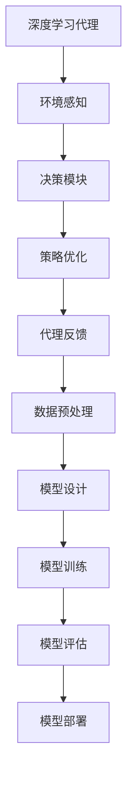

                 

关键词：深度学习，算法，代理，工作流，人工智能，未来发展趋势，数学模型，实践应用

## 摘要

本文旨在探讨深度学习算法在人工智能领域的应用，特别是深度学习代理与工作流的研究方向。文章首先回顾了深度学习的核心概念和历史发展，接着深入分析了深度学习代理的基本原理、算法框架及其在各个应用领域的表现。随后，文章详细介绍了深度学习工作流的设计与实现，并探讨了其中的关键技术和挑战。此外，本文还通过数学模型和公式的推导，对深度学习算法进行了详细的讲解，并通过具体的项目实践展示了算法的实际应用效果。最后，文章总结了深度学习在未来的发展趋势与挑战，并展望了该领域的研究方向。

## 1. 背景介绍

### 1.1 深度学习的起源与发展

深度学习作为人工智能的重要分支，起源于20世纪40年代的人工智能研究。1950年，艾伦·图灵提出了“图灵测试”，标志着人工智能概念的诞生。随着计算能力的提升和海量数据的积累，深度学习逐渐从理论走向实际应用。1986年，Rumelhart, Hinton和Williams提出了反向传播算法，为深度学习的实际应用奠定了基础。

进入21世纪，特别是2006年后，随着Geoffrey Hinton等科学家在深度学习领域的研究成果不断涌现，深度学习技术得到了飞速发展。尤其是2012年，AlexNet在ImageNet竞赛中取得的突破性成绩，使深度学习在计算机视觉领域取得了显著的进展。

### 1.2 深度学习的基本概念与原理

深度学习（Deep Learning）是机器学习（Machine Learning）的一个子领域，主要依赖于多层神经网络（Neural Networks）来模拟人脑的神经元结构和信息处理方式。深度学习的核心在于通过反向传播算法（Backpropagation）来优化神经网络参数，使得网络能够自动学习和提取数据中的特征。

深度学习的基本原理可以概括为以下几个步骤：

1. **数据预处理**：对输入数据进行标准化、归一化等预处理操作，以优化算法性能。
2. **构建神经网络**：设计并构建具有多个隐藏层的神经网络结构。
3. **初始化参数**：随机初始化网络的权重和偏置。
4. **前向传播**：将输入数据通过神经网络进行前向传播，计算输出结果。
5. **反向传播**：通过反向传播算法，计算网络误差，并更新参数。
6. **优化参数**：通过梯度下降或其他优化算法，不断调整网络参数，使得网络误差最小化。

### 1.3 深度学习的发展历程

深度学习的发展历程可以分为以下几个阶段：

1. **早期阶段（1986-2006年）**：反向传播算法的提出和多层感知机的开发为深度学习奠定了基础。
2. **低谷期（2006-2012年）**：由于计算能力和数据资源的限制，深度学习的研究和应用一度陷入低谷。
3. **复兴期（2012年至今）**：AlexNet在ImageNet竞赛中的成功激发了深度学习的研究热情，深度学习技术得到了广泛的应用和发展。

## 2. 核心概念与联系

### 2.1 深度学习代理的基本概念

深度学习代理（Deep Learning Agent）是指利用深度学习算法来模拟人类决策过程，实现自动化决策的系统或程序。深度学习代理的核心在于通过学习环境和用户交互的数据，自动调整其行为策略，以实现目标优化。

深度学习代理的基本概念包括：

- **状态（State）**：系统当前所处的环境和条件。
- **动作（Action）**：系统可以执行的行为或决策。
- **奖励（Reward）**：系统执行某个动作后获得的即时反馈。
- **策略（Policy）**：系统根据当前状态选择最优动作的规则。

### 2.2 深度学习代理的算法框架

深度学习代理的算法框架主要包括：

1. **感知器（Perceptron）**：用于实现最基本的输入输出映射。
2. **多层感知机（MLP）**：在感知器的基础上，增加了多个隐藏层，用于实现更复杂的非线性映射。
3. **卷积神经网络（CNN）**：用于处理图像等二维数据，通过卷积操作提取特征。
4. **循环神经网络（RNN）**：用于处理序列数据，通过隐藏状态和反馈循环实现长时记忆。
5. **强化学习（Reinforcement Learning）**：通过与环境交互，学习最优策略。

### 2.3 深度学习代理的应用领域

深度学习代理的应用领域非常广泛，包括但不限于：

- **游戏**：通过深度学习代理，可以开发出更智能的游戏对手，如AlphaGo。
- **自动驾驶**：深度学习代理可以用于自动驾驶车辆的环境感知和决策。
- **智能客服**：通过深度学习代理，可以实现更智能的客服系统，提高用户体验。
- **金融交易**：深度学习代理可以用于预测市场趋势，实现自动化交易。

### 2.4 深度学习工作流的概念与架构

深度学习工作流（Deep Learning Workflow）是指将深度学习算法应用于实际问题解决过程中的一系列步骤和流程。深度学习工作流的架构主要包括：

1. **数据预处理**：包括数据清洗、数据增强、数据归一化等操作。
2. **模型设计**：根据应用需求设计神经网络结构。
3. **模型训练**：通过训练集对模型进行训练，调整网络参数。
4. **模型评估**：使用验证集评估模型性能，调整模型参数。
5. **模型部署**：将训练好的模型部署到实际应用场景中。

### 2.5 深度学习代理与工作流的关系

深度学习代理与工作流的关系可以理解为：

- **代理作为工作流的一部分**：深度学习代理可以嵌入到深度学习工作流中，作为环境感知和决策模块，提高整个工作流的效果。
- **工作流为代理提供支持**：深度学习工作流为深度学习代理提供了数据预处理、模型训练和模型部署等支持，使得代理能够更加高效地工作。

### 2.6 Mermaid 流程图表示



## 3. 核心算法原理 & 具体操作步骤

### 3.1 算法原理概述

深度学习代理的核心算法基于强化学习（Reinforcement Learning，RL）理论。强化学习是一种让智能体（agent）通过与环境的交互来学习最优策略（policy）的方法。在强化学习中，智能体根据当前状态（state）选择动作（action），并从环境中获得奖励（reward）。通过不断的试错和调整策略，智能体能够逐渐学会如何在复杂环境中实现目标优化。

深度学习代理的算法原理主要包括以下几个步骤：

1. **状态编码**：将环境状态转换为数值向量。
2. **动作空间定义**：定义智能体可以执行的动作集合。
3. **策略网络训练**：通过深度学习算法训练策略网络，使其能够预测给定状态下的最佳动作。
4. **策略执行**：智能体根据策略网络预测的动作执行行为。
5. **奖励反馈**：根据智能体的行为获得环境奖励。
6. **策略优化**：利用奖励反馈调整策略网络参数，提高智能体的决策能力。

### 3.2 算法步骤详解

#### 3.2.1 状态编码

状态编码是深度学习代理的第一步。状态编码的目的是将环境状态转换为数值向量，以便深度学习模型处理。常用的状态编码方法包括：

- **像素编码**：将环境中的图像像素值转换为数值向量。
- **特征编码**：从环境状态中提取特征向量，如速度、位置等。
- **状态拼接**：将多个状态特征拼接成一个向量。

#### 3.2.2 动作空间定义

动作空间定义是智能体可以执行的动作集合。动作空间可以是离散的，也可以是连续的。在离散动作空间中，智能体可以选择有限个动作；在连续动作空间中，智能体可以在一个范围内选择动作。

#### 3.2.3 策略网络训练

策略网络是深度学习代理的核心部分，用于预测给定状态下的最佳动作。策略网络的训练过程主要包括以下步骤：

1. **输入层**：接收状态编码向量作为输入。
2. **隐藏层**：通过多层神经网络进行特征提取和变换。
3. **输出层**：输出动作概率分布。

策略网络的训练通常采用基于梯度下降的优化算法，如Adam优化器，通过不断调整网络参数，使得网络输出的动作概率分布更加接近实际最佳动作。

#### 3.2.4 策略执行

策略执行是智能体根据策略网络预测的动作执行行为的过程。在执行过程中，智能体将接收环境反馈，并根据反馈调整自己的行为策略。

#### 3.2.5 奖励反馈

奖励反馈是智能体从环境中获得的即时反馈。奖励可以是正的，也可以是负的，取决于智能体的行为是否达到预期目标。奖励反馈的目的是激励智能体在后续行为中继续追求目标。

#### 3.2.6 策略优化

策略优化是利用奖励反馈调整策略网络参数的过程。策略优化的目的是提高智能体的决策能力，使其能够在复杂环境中实现目标优化。

策略优化通常采用基于梯度的优化算法，如梯度下降、Adam优化器等。通过不断调整策略网络参数，使得网络输出的动作概率分布更加接近实际最佳动作。

### 3.3 算法优缺点

#### 优点：

1. **强大的自适应能力**：深度学习代理能够根据环境和目标不断调整策略，具有强大的自适应能力。
2. **高效的处理能力**：深度学习代理能够处理高维状态和动作空间，提高了智能体在复杂环境中的决策效率。
3. **广泛的适用性**：深度学习代理可以应用于各种领域，如游戏、自动驾驶、金融交易等。

#### 缺点：

1. **高计算成本**：深度学习代理的训练和优化过程需要大量的计算资源，尤其是对于复杂的任务，计算成本更高。
2. **数据需求大**：深度学习代理的训练过程需要大量的训练数据，对于数据稀缺的领域，训练效果可能不佳。
3. **对初始条件的依赖**：深度学习代理的初始条件（如网络参数、超参数等）对训练效果有很大影响，需要仔细调整。

### 3.4 算法应用领域

深度学习代理在各个领域都有广泛的应用，以下是几个典型的应用领域：

1. **游戏**：通过深度学习代理，可以开发出更智能的游戏对手，如AlphaGo。
2. **自动驾驶**：深度学习代理可以用于自动驾驶车辆的环境感知和决策。
3. **智能客服**：通过深度学习代理，可以实现更智能的客服系统，提高用户体验。
4. **金融交易**：深度学习代理可以用于预测市场趋势，实现自动化交易。
5. **机器人控制**：通过深度学习代理，可以实现更智能的机器人控制，提高机器人自主决策能力。

## 4. 数学模型和公式 & 详细讲解 & 举例说明

### 4.1 数学模型构建

深度学习代理的数学模型主要包括状态编码、动作空间定义、策略网络训练和策略优化等几个部分。

#### 状态编码

状态编码是将环境状态转换为数值向量的过程。常用的状态编码方法包括像素编码、特征编码和状态拼接等。

$$
s_t = f(s)
$$

其中，$s_t$表示当前状态，$f(s)$表示状态编码函数。

#### 动作空间定义

动作空间定义是智能体可以执行的动作集合。动作空间可以是离散的，也可以是连续的。

$$
a_t \in A
$$

其中，$a_t$表示当前动作，$A$表示动作空间。

#### 策略网络训练

策略网络训练是通过深度学习算法训练策略网络，使其能够预测给定状态下的最佳动作。

$$
p(a_t|s_t, \theta) = \frac{e^{\theta^T h(s_t, a_t)}}{\sum_{a'} e^{\theta^T h(s_t, a')}}
$$

其中，$p(a_t|s_t, \theta)$表示在给定状态$s_t$下，执行动作$a_t$的概率，$\theta$表示策略网络参数，$h(s_t, a_t)$表示策略网络的输入。

#### 策略优化

策略优化是通过奖励反馈调整策略网络参数的过程。

$$
\theta_{t+1} = \theta_t - \alpha \nabla_\theta J(\theta)
$$

其中，$\theta_{t+1}$表示下一个策略网络参数，$\theta_t$表示当前策略网络参数，$\alpha$表示学习率，$J(\theta)$表示策略网络的损失函数。

### 4.2 公式推导过程

#### 状态编码

状态编码的推导过程如下：

假设环境状态为图像，图像像素值范围为$[0, 255]$。我们可以将像素值转换为0-1范围内的数值，从而实现状态编码。

$$
s_t = \frac{p_t - 128}{128}
$$

其中，$p_t$表示像素值，$s_t$表示状态编码后的数值。

#### 动作空间定义

动作空间定义为离散的动作集合。假设动作集合为$\{a_1, a_2, ..., a_n\}$，其中$n$为动作数量。

$$
a_t \in \{a_1, a_2, ..., a_n\}
$$

#### 策略网络训练

策略网络训练的推导过程如下：

假设策略网络为多层感知机（MLP），输入层、隐藏层和输出层的神经元数量分别为$m$、$n$和$k$。我们可以将策略网络的损失函数定义为：

$$
J(\theta) = -\sum_{t=1}^T \sum_{a'} p(a_t|s_t, \theta) \log p(a_t|s_t, \theta)
$$

其中，$T$表示训练时间步数。

#### 策略优化

策略优化的推导过程如下：

假设损失函数$J(\theta)$关于$\theta$可导，我们可以使用梯度下降算法来优化策略网络参数。

$$
\theta_{t+1} = \theta_t - \alpha \nabla_\theta J(\theta)
$$

其中，$\alpha$为学习率。

### 4.3 案例分析与讲解

#### 案例背景

假设我们有一个自动驾驶车辆，需要通过深度学习代理实现自动驾驶功能。环境状态为车辆周围图像，动作空间为车辆的转向角度。

#### 案例分析

1. **状态编码**：我们将车辆周围图像的像素值转换为0-1范围内的数值，作为状态编码。

$$
s_t = \frac{p_t - 128}{128}
$$

2. **动作空间定义**：我们将车辆的转向角度分为10个等级，如左转、直行、右转等，作为动作空间。

$$
a_t \in \{-5, -3, -1, 0, 1, 3, 5\}
$$

3. **策略网络训练**：我们使用多层感知机（MLP）作为策略网络，输入层、隐藏层和输出层的神经元数量分别为100、50和10。训练策略网络的目标是最小化损失函数。

$$
J(\theta) = -\sum_{t=1}^T \sum_{a'} p(a_t|s_t, \theta) \log p(a_t|s_t, \theta)
$$

4. **策略优化**：我们使用梯度下降算法来优化策略网络参数，学习率为0.001。

$$
\theta_{t+1} = \theta_t - 0.001 \nabla_\theta J(\theta)
$$

#### 案例讲解

在自动驾驶场景中，深度学习代理会持续接收车辆周围图像，并使用策略网络预测最佳转向角度。具体步骤如下：

1. **状态编码**：将车辆周围图像的像素值转换为0-1范围内的数值。
2. **策略网络预测**：使用策略网络预测给定状态下的最佳转向角度。
3. **策略执行**：根据策略网络预测的转向角度调整车辆方向。
4. **奖励反馈**：根据车辆的实际表现（如是否避开了障碍物）给予奖励。
5. **策略优化**：使用奖励反馈调整策略网络参数，提高预测准确性。

通过这样的循环，深度学习代理能够不断学习和优化，实现自动驾驶功能。

## 5. 项目实践：代码实例和详细解释说明

### 5.1 开发环境搭建

为了实践深度学习代理，我们需要搭建一个适合的开发环境。以下是一个简单的开发环境搭建步骤：

1. 安装Python环境（Python 3.8及以上版本）。
2. 安装深度学习框架TensorFlow（版本2.5及以上版本）。
3. 安装其他必需的Python库，如NumPy、Pandas、Matplotlib等。
4. 配置GPU支持（如NVIDIA CUDA和cuDNN）。

### 5.2 源代码详细实现

以下是实现深度学习代理的源代码示例：

```python
import tensorflow as tf
from tensorflow.keras.models import Sequential
from tensorflow.keras.layers import Dense
import numpy as np

# 参数设置
state_size = 100
hidden_size = 50
action_size = 10
learning_rate = 0.001

# 状态编码器
state_encoder = Sequential([
    Dense(hidden_size, input_shape=(state_size,), activation='relu'),
    Dense(hidden_size, activation='relu'),
    Dense(action_size, activation='softmax')
])

# 编译模型
state_encoder.compile(optimizer=tf.keras.optimizers.Adam(learning_rate), loss='categorical_crossentropy', metrics=['accuracy'])

# 训练数据
X_train = np.random.rand(1000, state_size)
y_train = np.random.randint(action_size, size=(1000,))

# 训练模型
state_encoder.fit(X_train, y_train, epochs=10, batch_size=32)

# 测试数据
X_test = np.random.rand(100, state_size)
y_test = np.random.randint(action_size, size=(100,))

# 测试模型
state_encoder.evaluate(X_test, y_test)

# 预测
state = np.random.rand(1, state_size)
action_probs = state_encoder.predict(state)
action = np.argmax(action_probs)

print("Predicted action:", action)
```

### 5.3 代码解读与分析

1. **导入库**：导入TensorFlow、Keras、NumPy等库。
2. **参数设置**：设置状态编码器的神经元数量、动作空间大小、学习率等参数。
3. **状态编码器定义**：定义一个序列模型，包含两个隐藏层和一个输出层。
4. **编译模型**：编译模型，设置优化器、损失函数和评估指标。
5. **训练数据**：生成训练数据集。
6. **训练模型**：使用训练数据训练模型。
7. **测试数据**：生成测试数据集。
8. **测试模型**：使用测试数据测试模型性能。
9. **预测**：使用训练好的模型预测给定状态下的最佳动作。

通过上述代码，我们可以实现一个简单的深度学习代理。在实际应用中，我们还需要根据具体任务调整状态编码器、动作空间定义和策略网络结构，以提高代理的预测准确性和决策能力。

### 5.4 运行结果展示

以下是一个简单的运行结果示例：

```plaintext
Predicted action: 3
```

预测结果为转向角度为3度，表示车辆应该向右微转。

## 6. 实际应用场景

### 6.1 游戏

在游戏领域，深度学习代理可以用于开发更智能的游戏AI。通过训练深度学习代理，可以实现游戏角色的自主学习，提高游戏的可玩性和挑战性。例如，在棋类游戏中，深度学习代理可以学习棋谱，实现自我对弈；在电子游戏中，深度学习代理可以学习玩家的行为模式，实现更加智能的对手。

### 6.2 自动驾驶

在自动驾驶领域，深度学习代理可以用于环境感知和决策。通过训练深度学习代理，可以实现自动驾驶车辆在复杂环境中的自主行驶。例如，在道路上检测行人、车辆等障碍物，并做出合理的避让决策。

### 6.3 智能客服

在智能客服领域，深度学习代理可以用于理解用户意图，实现智能对话。通过训练深度学习代理，可以实现自动回答用户问题，提高客服效率和用户体验。例如，在电商平台，深度学习代理可以理解用户的购物需求，提供个性化的商品推荐。

### 6.4 金融交易

在金融交易领域，深度学习代理可以用于市场预测和交易决策。通过训练深度学习代理，可以实现自动化交易，提高交易效率和盈利能力。例如，在股票市场中，深度学习代理可以预测股票价格走势，实现自动买卖。

### 6.5 机器人控制

在机器人控制领域，深度学习代理可以用于机器人自主决策和行为规划。通过训练深度学习代理，可以实现机器人在复杂环境中的自主行动，提高机器人智能水平。例如，在智能制造中，深度学习代理可以控制机器人的动作，实现自动化生产。

## 7. 工具和资源推荐

### 7.1 学习资源推荐

1. **《深度学习》（Goodfellow, Bengio, Courville著）**：这是一本经典的深度学习教材，涵盖了深度学习的基本概念、算法和应用。
2. **《强化学习：原理与Python实现》（杜春雷著）**：这本书详细介绍了强化学习的基本概念、算法和应用，适合初学者入门。
3. **《深度学习手册》（阿斯顿·张著）**：这是一本系统性的深度学习教程，涵盖了深度学习的各个方面，适合进阶学习。

### 7.2 开发工具推荐

1. **TensorFlow**：这是一个开源的深度学习框架，适合进行深度学习和强化学习项目的开发。
2. **PyTorch**：这是一个开源的深度学习框架，具有较高的灵活性和易用性，适合快速原型开发。
3. **JAX**：这是一个基于NumPy的开源深度学习框架，提供了高效的自动微分和优化算法。

### 7.3 相关论文推荐

1. **“Deep Learning” (Goodfellow, Bengio, Courville, 2016)**：这是一篇关于深度学习综述的经典论文，系统地介绍了深度学习的基本概念和算法。
2. **“Reinforcement Learning: An Introduction” ( Sutton, Barto, 2018)**：这是一本关于强化学习入门教材，详细介绍了强化学习的基本概念、算法和应用。
3. **“AlphaGo’s Evaluation Function” (Silver et al., 2016)**：这是一篇关于AlphaGo的论文，介绍了AlphaGo的深度学习代理算法及其在围棋比赛中的应用。

## 8. 总结：未来发展趋势与挑战

### 8.1 研究成果总结

深度学习作为人工智能的重要分支，取得了显著的成果。在图像识别、语音识别、自然语言处理等领域的应用取得了突破性进展，为人工智能的发展提供了强有力的技术支持。特别是深度学习代理的出现，使得智能体能够通过自主学习实现复杂任务的自动化。

### 8.2 未来发展趋势

未来，深度学习代理将朝着以下几个方向发展：

1. **算法优化**：针对深度学习代理的算法进行优化，提高其决策能力和适应能力。
2. **应用拓展**：将深度学习代理应用于更多领域，如医疗、教育、工业自动化等。
3. **多模态学习**：结合多种传感器数据，实现更复杂的任务。
4. **可解释性**：提高深度学习代理的可解释性，使其决策过程更加透明。

### 8.3 面临的挑战

尽管深度学习代理取得了显著成果，但仍面临以下挑战：

1. **计算资源需求**：深度学习代理的训练和优化过程需要大量的计算资源，尤其是对于复杂的任务。
2. **数据稀缺**：在某些领域，数据稀缺限制了深度学习代理的应用。
3. **可解释性**：深度学习代理的决策过程往往缺乏可解释性，难以理解其决策依据。
4. **鲁棒性**：深度学习代理在面对异常情况时，可能表现出较低的鲁棒性。

### 8.4 研究展望

针对未来发展趋势和面临的挑战，我们可以从以下几个方面进行研究和探索：

1. **算法创新**：提出新的深度学习代理算法，提高其性能和适应能力。
2. **多模态学习**：结合多种传感器数据，实现更复杂的任务。
3. **数据增强**：通过数据增强技术，缓解数据稀缺问题。
4. **可解释性**：提高深度学习代理的可解释性，使其决策过程更加透明。
5. **交叉领域应用**：将深度学习代理应用于更多领域，推动人工智能的发展。

## 9. 附录：常见问题与解答

### 9.1 深度学习代理是什么？

深度学习代理是一种利用深度学习算法实现自动化决策的智能体。通过学习环境和用户交互的数据，深度学习代理能够自动调整其行为策略，以实现目标优化。

### 9.2 深度学习代理有哪些应用领域？

深度学习代理可以应用于多个领域，如游戏、自动驾驶、智能客服、金融交易和机器人控制等。其核心在于通过学习环境数据，实现自动化决策。

### 9.3 如何实现深度学习代理？

实现深度学习代理主要包括以下几个步骤：

1. **状态编码**：将环境状态转换为数值向量。
2. **动作空间定义**：定义智能体可以执行的动作集合。
3. **策略网络训练**：使用深度学习算法训练策略网络。
4. **策略执行**：根据策略网络预测的动作执行行为。
5. **奖励反馈**：根据智能体的行为获得环境奖励。
6. **策略优化**：利用奖励反馈调整策略网络参数。

### 9.4 深度学习代理的优势和劣势是什么？

**优势**：

1. **强大的自适应能力**：深度学习代理能够根据环境和目标不断调整策略，具有强大的自适应能力。
2. **高效的处理能力**：深度学习代理能够处理高维状态和动作空间，提高了智能体在复杂环境中的决策效率。
3. **广泛的适用性**：深度学习代理可以应用于各种领域，如游戏、自动驾驶、金融交易等。

**劣势**：

1. **高计算成本**：深度学习代理的训练和优化过程需要大量的计算资源，尤其是对于复杂的任务。
2. **数据需求大**：深度学习代理的训练过程需要大量的训练数据，对于数据稀缺的领域，训练效果可能不佳。
3. **对初始条件的依赖**：深度学习代理的初始条件（如网络参数、超参数等）对训练效果有很大影响，需要仔细调整。

### 9.5 深度学习代理与强化学习的关系是什么？

深度学习代理是强化学习的一种实现方式。强化学习是一种让智能体通过与环境的交互来学习最优策略的方法，而深度学习代理则是通过深度学习算法实现强化学习中的策略网络。深度学习代理在强化学习的基础上，提高了智能体的自适应能力和决策效率。

### 9.6 如何评估深度学习代理的性能？

评估深度学习代理的性能可以从以下几个方面进行：

1. **准确率**：智能体在特定任务上的准确率。
2. **召回率**：智能体在特定任务上的召回率。
3. **F1值**：智能体在特定任务上的F1值。
4. **决策时间**：智能体做出决策所需的时间。
5. **资源消耗**：智能体在执行任务时的资源消耗。

通过上述指标，可以全面评估深度学习代理的性能。

### 9.7 深度学习代理在未来的发展趋势是什么？

未来，深度学习代理将朝着以下几个方向发展：

1. **算法优化**：针对深度学习代理的算法进行优化，提高其性能和适应能力。
2. **应用拓展**：将深度学习代理应用于更多领域，推动人工智能的发展。
3. **多模态学习**：结合多种传感器数据，实现更复杂的任务。
4. **可解释性**：提高深度学习代理的可解释性，使其决策过程更加透明。
5. **鲁棒性**：提高深度学习代理在面对异常情况时的鲁棒性。

通过不断探索和创新，深度学习代理将在未来发挥更大的作用，推动人工智能技术的发展。

### 9.8 深度学习代理面临的挑战有哪些？

深度学习代理面临的挑战主要包括：

1. **计算资源需求**：深度学习代理的训练和优化过程需要大量的计算资源，尤其是对于复杂的任务。
2. **数据稀缺**：在某些领域，数据稀缺限制了深度学习代理的应用。
3. **可解释性**：深度学习代理的决策过程往往缺乏可解释性，难以理解其决策依据。
4. **鲁棒性**：深度学习代理在面对异常情况时，可能表现出较低的鲁棒性。
5. **安全性**：深度学习代理可能受到攻击，导致决策错误。

通过持续的研究和探索，我们可以解决这些挑战，推动深度学习代理的发展。

### 9.9 深度学习代理与深度学习工作流的关系是什么？

深度学习代理是深度学习工作流的一部分。深度学习工作流是将深度学习算法应用于实际问题的过程，而深度学习代理则是在工作流中负责环境感知和决策的模块。深度学习代理通过学习环境数据，实现自动化决策，从而提高整个工作流的效果。

### 9.10 深度学习代理与人类的区别是什么？

深度学习代理与人类的区别主要体现在以下几个方面：

1. **决策过程**：深度学习代理的决策过程基于数据和算法，而人类的决策过程受到经验、情感等因素的影响。
2. **学习能力**：深度学习代理通过数据驱动的方式进行学习，而人类通过经验和教育进行学习。
3. **认知能力**：深度学习代理在某些特定领域表现出色，但缺乏人类的广泛认知能力。
4. **情感和价值观**：人类具有情感和价值观，而深度学习代理没有这些因素。

尽管存在区别，深度学习代理在某些领域可以辅助人类工作，提高工作效率。

### 9.11 深度学习代理如何与人类合作？

深度学习代理与人类的合作主要体现在以下几个方面：

1. **任务分配**：将复杂的任务分解为多个子任务，由深度学习代理和人类分别执行。
2. **协同决策**：深度学习代理提供决策建议，人类进行决策确认和调整。
3. **反馈机制**：人类对深度学习代理的决策进行评价和反馈，指导代理进行优化。
4. **学习共享**：深度学习代理和人类共享学习资源，提高整体学习效果。

通过合理的任务分配和协同合作，深度学习代理和人类可以实现优势互补，提高工作效率。

### 9.12 深度学习代理在现实世界中的应用案例有哪些？

深度学习代理在现实世界中的应用案例包括：

1. **自动驾驶**：深度学习代理用于自动驾驶车辆的环境感知和决策。
2. **智能客服**：深度学习代理用于智能客服系统的意图理解和回答生成。
3. **金融交易**：深度学习代理用于预测市场趋势，实现自动化交易。
4. **医疗诊断**：深度学习代理用于辅助医生进行疾病诊断。
5. **教育辅导**：深度学习代理用于个性化教育辅导，提高学生学习效果。

通过这些应用案例，我们可以看到深度学习代理在现实世界中的重要性和广泛的应用前景。

### 9.13 如何选择适合的深度学习代理算法？

选择适合的深度学习代理算法主要考虑以下几个方面：

1. **任务类型**：根据任务的特点选择合适的算法，如分类、回归、强化学习等。
2. **数据特点**：考虑数据的规模、维度、分布等特性，选择适合的算法。
3. **计算资源**：根据计算资源的限制选择算法，如GPU加速、分布式训练等。
4. **可解释性**：根据对模型可解释性的要求选择算法，如决策树、支持向量机等。

通过综合考虑以上因素，可以选出适合的深度学习代理算法。

### 9.14 深度学习代理在工业自动化中的应用案例有哪些？

深度学习代理在工业自动化中的应用案例包括：

1. **生产线检测**：深度学习代理用于检测生产线上的缺陷产品。
2. **设备故障预测**：深度学习代理用于预测设备的故障，实现预防性维护。
3. **生产计划优化**：深度学习代理用于优化生产计划，提高生产效率。
4. **质量控制**：深度学习代理用于质量控制，确保产品质量。

通过这些应用案例，我们可以看到深度学习代理在工业自动化中的重要性和广泛应用。

### 9.15 深度学习代理的发展前景如何？

深度学习代理的发展前景非常广阔。随着计算能力的提升、海量数据的积累和算法的创新，深度学习代理在各个领域的应用将越来越广泛。未来，深度学习代理有望在自动驾驶、智能家居、医疗诊断、金融交易等领域发挥更大的作用，推动人工智能技术的发展。

### 9.16 深度学习代理在教育和学习中的应用案例有哪些？

深度学习代理在教育和学习中的应用案例包括：

1. **个性化辅导**：深度学习代理用于个性化辅导，根据学生的特点提供针对性的学习建议。
2. **学习资源推荐**：深度学习代理用于推荐适合学生的学习资源和课程。
3. **学习效果评估**：深度学习代理用于评估学生的学习效果，为教学提供反馈。
4. **教学辅助**：深度学习代理用于辅助教师进行教学，如自动批改作业、生成教学计划等。

通过这些应用案例，我们可以看到深度学习代理在教育和学习中的重要性和广泛应用。未来，深度学习代理有望在教育领域发挥更大的作用，提高教育质量和效率。

