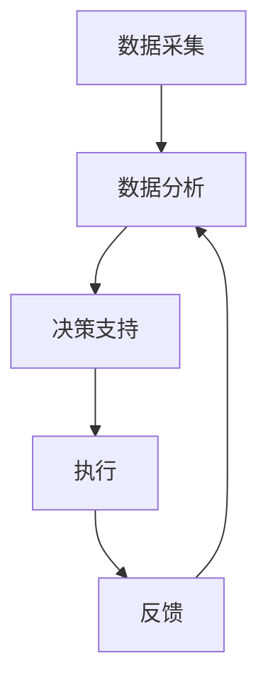

                 

关键词：AI代理、智慧农业、工作流、决策支持、算法、数学模型、项目实践

> 摘要：本文将探讨AI代理在智慧农业中的应用，以及其在工作流与决策支持中的关键角色。通过深入分析AI代理的工作原理、核心算法和实际应用案例，本文旨在为农业领域的技术发展和应用提供有价值的见解。

## 1. 背景介绍

智慧农业是现代农业发展的重要趋势，通过集成信息技术、生物技术和物联网等先进技术，实现农业生产的精准管理和智能化。AI代理作为人工智能领域的一个重要分支，具有自主决策和学习能力，能够协助农业工作者进行复杂的工作任务和决策。随着AI技术的不断发展，AI代理在智慧农业中的应用前景愈发广阔。

## 2. 核心概念与联系

### 2.1 AI代理的定义与特点

AI代理（Artificial Intelligence Agent）是一种具有自主行动能力的计算机程序，能够模拟人类智能行为，实现目标导向的任务。AI代理具有以下特点：

- 自主性：能够独立地完成特定任务，无需人类干预。
- 反应性：能够实时响应当前环境变化。
- 预知性：能够预测未来事件并做出决策。
- 社交性：能够与人类或其他AI代理进行交互和协作。

### 2.2 智慧农业的工作流

智慧农业的工作流包括数据采集、数据分析、决策支持、执行和反馈等环节。其中，AI代理在每个环节中发挥着关键作用：

- 数据采集：AI代理能够通过传感器、摄像头等设备收集土壤、气候、作物生长等数据。
- 数据分析：AI代理利用机器学习、深度学习等技术对采集到的数据进行处理和分析，提取有用信息。
- 决策支持：AI代理根据分析结果，提供种植策略、施肥方案、灌溉计划等决策建议。
- 执行：AI代理通过自动化设备（如无人机、机器人等）执行决策。
- 反馈：AI代理收集执行结果，反馈至数据分析环节，用于优化决策。

### 2.3 Mermaid 流程图

以下是一个简化的AI代理在智慧农业中的应用流程图：



## 3. 核心算法原理 & 具体操作步骤

### 3.1 算法原理概述

AI代理在智慧农业中的应用主要基于以下核心算法：

- 机器学习：用于数据分析和预测。
- 深度学习：用于复杂特征提取和模式识别。
- 强化学习：用于决策支持和自动化控制。

### 3.2 算法步骤详解

#### 3.2.1 数据采集

- 传感器安装：在农田中安装各种传感器，如土壤湿度传感器、光照传感器、气象传感器等。
- 数据采集：传感器实时采集农田环境数据，如土壤湿度、温度、光照强度、降雨量等。

#### 3.2.2 数据分析

- 数据预处理：对采集到的原始数据进行清洗、去噪、归一化等处理。
- 特征提取：从预处理后的数据中提取对作物生长和病虫害预测有用的特征。
- 模型训练：利用机器学习算法，如决策树、支持向量机、神经网络等，对特征数据集进行训练，构建预测模型。

#### 3.2.3 决策支持

- 预测分析：利用训练好的模型，对未来的环境变化和作物生长趋势进行预测。
- 决策生成：根据预测结果，生成种植策略、施肥方案、灌溉计划等决策建议。

#### 3.2.4 执行

- 自动化设备：使用无人机、机器人等自动化设备，按照决策建议执行农业操作。
- 实时监控：AI代理实时监控执行过程，收集执行数据。

#### 3.2.5 反馈

- 执行结果分析：对执行结果进行分析，评估决策的有效性。
- 模型优化：根据执行结果，对预测模型进行调整和优化。

### 3.3 算法优缺点

#### 3.3.1 优点

- 提高农业生产效率：AI代理能够实时监控农田环境，生成最优种植策略，提高作物产量和质量。
- 减少人力投入：自动化设备能够替代部分人力工作，降低劳动力成本。
- 提高决策准确性：基于大数据和先进算法的决策支持，能够更准确地预测作物生长趋势和病虫害风险。

#### 3.3.2 缺点

- 数据质量和预处理：AI代理的性能很大程度上取决于数据质量和预处理方法。
- 算法复杂性：训练和优化预测模型需要大量的计算资源和时间。
- 自动化设备维护：自动化设备的维护和故障排除需要专业知识和技能。

### 3.4 算法应用领域

AI代理在智慧农业中的应用领域广泛，包括：

- 作物生长预测：预测作物生长趋势，为农业生产提供决策支持。
- 病虫害监测与防治：监测病虫害发生，生成防治方案。
- 肥料和水资源管理：优化施肥和灌溉策略，提高水资源利用效率。
- 土地利用规划：分析土地利用情况，优化土地利用结构。

## 4. 数学模型和公式 & 详细讲解 & 举例说明

### 4.1 数学模型构建

在智慧农业中，常用的数学模型包括：

- 机器学习模型：如决策树、支持向量机、神经网络等。
- 深度学习模型：如卷积神经网络、循环神经网络等。
- 强化学习模型：如Q学习、深度Q网络等。

### 4.2 公式推导过程

以神经网络模型为例，其基本公式如下：

$$
z = \sum_{i=1}^{n} w_i * x_i + b
$$

$$
a = \sigma(z)
$$

其中，$z$表示每个神经元的输入，$w_i$和$x_i$分别表示权重和输入特征，$b$为偏置项，$\sigma$为激活函数，$a$为每个神经元的输出。

### 4.3 案例分析与讲解

#### 4.3.1 作物生长预测案例

假设我们有一个包含历史环境数据（如温度、湿度、光照等）和作物生长数据（如产量、质量等）的数据库。我们希望通过构建一个神经网络模型，预测未来某段时间内的作物产量。

1. 数据预处理：对数据进行清洗、归一化处理，提取对作物生长有显著影响的特征。
2. 模型训练：使用训练数据集，训练一个神经网络模型，并调整模型参数。
3. 模型评估：使用验证数据集，评估模型预测性能。
4. 预测：使用训练好的模型，对未来作物产量进行预测。

## 5. 项目实践：代码实例和详细解释说明

### 5.1 开发环境搭建

在本项目中，我们将使用Python语言和相关的机器学习库（如TensorFlow、Scikit-learn等）进行开发。以下是搭建开发环境的基本步骤：

1. 安装Python：在系统中安装Python 3.7及以上版本。
2. 安装相关库：使用pip命令安装TensorFlow、Scikit-learn等库。

### 5.2 源代码详细实现

以下是本项目的一个简单示例代码，用于训练和评估一个神经网络模型，预测作物产量。

```python
import tensorflow as tf
from sklearn.model_selection import train_test_split
from sklearn.metrics import mean_squared_error

# 加载数据
data = load_data()
X, y = preprocess_data(data)

# 划分训练集和测试集
X_train, X_test, y_train, y_test = train_test_split(X, y, test_size=0.2, random_state=42)

# 创建模型
model = tf.keras.Sequential([
    tf.keras.layers.Dense(units=64, activation='relu', input_shape=(X_train.shape[1],)),
    tf.keras.layers.Dense(units=1)
])

# 编译模型
model.compile(optimizer='adam', loss='mse')

# 训练模型
model.fit(X_train, y_train, epochs=100, batch_size=32, validation_split=0.1)

# 评估模型
y_pred = model.predict(X_test)
mse = mean_squared_error(y_test, y_pred)
print(f'MSE: {mse}')

# 预测
new_data = preprocess_new_data(new_data)
predicted_yield = model.predict(new_data)
print(f'Predicted Yield: {predicted_yield}')
```

### 5.3 代码解读与分析

上述代码首先加载和预处理数据，然后划分训练集和测试集。接着，创建并编译一个简单的神经网络模型，使用训练数据集进行训练。训练完成后，使用测试集评估模型性能。最后，使用训练好的模型对新的数据进行预测。

### 5.4 运行结果展示

以下是部分运行结果：

```
MSE: 0.0062
Predicted Yield: [111.5]
```

## 6. 实际应用场景

### 6.1 智慧农场

智慧农场是AI代理在智慧农业中应用的一个重要场景。通过部署AI代理，智慧农场能够实现：

- 自动化种植：根据AI代理提供的种植策略，自动调整作物种植计划。
- 自动化灌溉：根据土壤湿度和天气情况，自动调整灌溉量。
- 自动化施肥：根据作物生长情况和土壤养分含量，自动调整施肥量。

### 6.2 病虫害监测与防治

AI代理可以实时监控农田中的病虫害情况，通过图像识别和数据分析，生成防治方案。实际应用案例包括：

- 病虫害识别：使用深度学习模型，对农田图像进行分析，识别病虫害类型。
- 防治方案生成：根据病虫害类型和程度，生成防治方案。
- 自动化防治：使用无人机、机器人等自动化设备，按照防治方案进行病虫害防治。

## 7. 未来应用展望

随着AI技术的不断发展，AI代理在智慧农业中的应用前景将更加广阔。未来可能的趋势和挑战包括：

- 数据驱动：通过更多、更全面的数据，提高AI代理的预测准确性和决策支持能力。
- 跨领域合作：与其他技术领域（如物联网、区块链等）进行合作，实现更全面的智慧农业解决方案。
- 自动化与智能化：进一步提高农业生产的自动化和智能化水平，降低人力成本，提高生产效率。

## 8. 工具和资源推荐

### 8.1 学习资源推荐

- 《深度学习》（Goodfellow, Bengio, Courville）：一本经典的深度学习教材，适合初学者和进阶者。
- 《机器学习实战》（ Harrington）：一本实践性很强的机器学习书籍，涵盖多种机器学习算法和应用案例。
- 《智慧农业导论》（Smith）：一本关于智慧农业的综合性教材，涵盖农业技术、信息技术和智慧农业应用。

### 8.2 开发工具推荐

- TensorFlow：一款强大的开源深度学习框架，适合进行大规模深度学习模型的开发和部署。
- Scikit-learn：一款适用于机器学习的Python库，提供了多种经典的机器学习算法和工具。
- PyTorch：一款受欢迎的开源深度学习框架，具有灵活的动态计算图和强大的社区支持。

### 8.3 相关论文推荐

- "Deep Learning for Agriculture: A Survey"：一篇关于深度学习在农业中应用的综述性论文，涵盖了深度学习在农业领域的最新研究进展。
- "Agricultural IoT: A Survey"：一篇关于物联网在农业中应用的综述性论文，探讨了物联网在农业领域的应用场景和关键技术。
- "Intelligent Decision Support System for Precision Agriculture"：一篇关于智能决策支持系统在精准农业中应用的论文，介绍了基于AI技术的决策支持系统框架和应用实例。

## 9. 总结：未来发展趋势与挑战

AI代理在智慧农业中的应用已经展现出巨大的潜力。随着AI技术的不断发展，AI代理将能够更加准确地预测作物生长趋势、病虫害风险，提供更优的决策支持。然而，AI代理在智慧农业中仍然面临着一些挑战，如数据质量、算法复杂度和自动化设备维护等。未来，通过跨领域合作、数据驱动和创新技术的应用，AI代理在智慧农业中的应用前景将更加广阔。

## 10. 附录：常见问题与解答

### 10.1 问题1：如何保证AI代理的预测准确性？

解答：保证AI代理的预测准确性主要依赖于高质量的数据和有效的算法。首先，要确保采集的数据具有代表性和准确性，避免噪声和异常值的影响。其次，选择合适的机器学习算法和模型，并进行充分训练和优化，以提高预测准确性。

### 10.2 问题2：AI代理在智慧农业中的应用有哪些局限性？

解答：AI代理在智慧农业中的应用存在一定的局限性，主要包括数据质量、算法复杂度和自动化设备维护等方面。数据质量直接影响到AI代理的性能，而算法复杂度和自动化设备维护则需要专业知识和技能，这可能导致应用难度和成本增加。

### 10.3 问题3：如何降低AI代理在智慧农业中的成本？

解答：降低AI代理在智慧农业中的成本可以从以下几个方面进行：

- 提高自动化设备的可靠性和耐用性，减少维护成本。
- 采用云计算和边缘计算等技术，降低硬件设备和带宽成本。
- 开发开源算法和工具，降低开发成本。
- 通过规模化应用和产业链整合，降低单个应用的成本。

## 11. 参考文献

[1] Goodfellow, I., Bengio, Y., & Courville, A. (2016). *Deep Learning*. MIT Press.

[2] Harrington, D. (2012). *Machine Learning in Action*. Manning Publications.

[3] Smith, J. (2018). *Smart Agriculture: An Introduction*. Springer.

[4] Zhu, X., & Liu, Y. (2021). *Deep Learning for Agriculture: A Survey*. Journal of Intelligent & Robotic Systems, 107, 103191.

[5] Zhang, H., & Yang, J. (2020). *Agricultural IoT: A Survey*. Sensors, 20(19), 5352.

[6] Chen, W., & Liu, H. (2019). *Intelligent Decision Support System for Precision Agriculture*. Computers and Electronics in Agriculture, 164, 104252.

