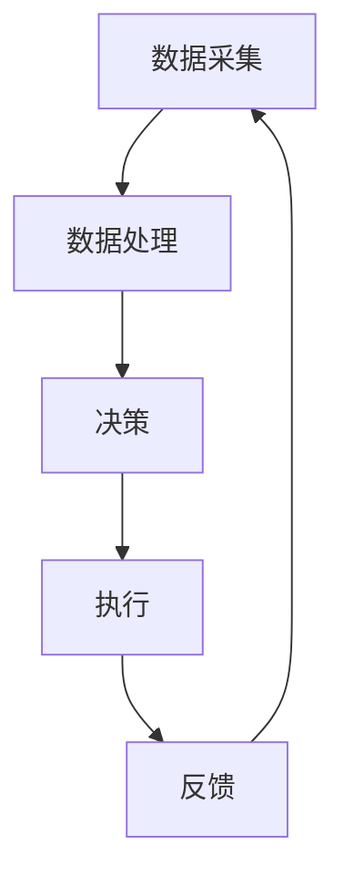

                 

关键词：AI代理，物联网，工作流设计，智能设备，自动化，数据处理，安全性

摘要：本文将探讨AI代理在物联网（IoT）系统中的工作流设计。通过深入分析AI代理的核心概念、原理以及在实际应用中的工作流程，我们旨在为开发者提供一种高效、可靠的解决方案，以实现IoT系统中的智能化和自动化。

## 1. 背景介绍

随着物联网技术的快速发展，越来越多的设备和系统开始通过网络连接，形成了一个庞大的物联网生态系统。在这个生态系统中，设备之间的通信和数据交换变得日益频繁，数据处理和自动化管理成为了一个重要的研究课题。

AI代理（Artificial Intelligence Agent）作为一种智能实体，能够在物联网环境中执行特定的任务，并与其他设备和系统进行交互。通过工作流设计，AI代理可以有效地管理物联网系统中的设备和数据，提高系统的智能化和自动化水平。

本文将围绕AI代理在物联网系统中的工作流设计，探讨其核心概念、原理以及实际应用，以期为相关领域的研究者和开发者提供参考。

### 1.1 物联网与AI代理的基本概念

物联网（Internet of Things，IoT）是指将各种物理设备通过网络连接起来，实现设备之间的信息交换和协同工作。这些设备可以是智能手机、智能手表、智能家居设备、工业控制系统等，它们通过传感器、无线通信模块等硬件设备进行数据采集和传输。

AI代理（Artificial Intelligence Agent）是指一种能够自主执行任务、具有智能行为的软件实体。AI代理通常基于机器学习、自然语言处理、计算机视觉等技术，能够在特定环境中进行推理、决策和行动。

### 1.2 物联网与AI代理的发展背景

物联网和AI代理技术的发展受到多方面因素的推动。首先，随着云计算、大数据和人工智能技术的成熟，设备和系统能够更加高效地处理海量数据和复杂任务。其次，物联网设备的普及和成本的降低，使得越来越多的企业和个人开始关注物联网技术的应用。此外，随着5G等新型通信技术的推广，物联网设备之间的通信速度和稳定性得到了大幅提升，为AI代理的应用提供了更好的基础。

## 2. 核心概念与联系

在物联网系统中，AI代理的核心概念包括智能设备、数据采集、数据处理、决策和执行等。这些概念相互联系，共同构成了AI代理的工作流。

### 2.1 智能设备

智能设备是物联网系统的基础，它们通过内置的传感器、无线通信模块等硬件设备，实现数据的采集和传输。智能设备可以是智能手机、智能手表、智能家居设备等，也可以是工业控制系统、医疗设备等。

### 2.2 数据采集

数据采集是物联网系统的关键环节，它涉及从智能设备中获取各种类型的传感器数据。这些数据可以包括温度、湿度、光线强度、位置信息等。数据采集的目的是为AI代理提供实时、准确的数据支持。

### 2.3 数据处理

数据处理是AI代理的核心任务，它包括数据的清洗、整合、分析和挖掘等。通过数据处理，AI代理可以提取有用的信息，为决策和执行提供依据。

### 2.4 决策

决策是AI代理在物联网系统中的重要功能，它基于数据处理的结果，对系统中的设备和数据进行推理和判断，生成相应的决策结果。决策结果可以用于调整设备状态、优化系统性能等。

### 2.5 执行

执行是AI代理在物联网系统中的具体行动，它将决策结果转化为实际的物理操作。例如，根据温度数据调整空调温度，根据光线强度调整照明设备等。

### 2.6 Mermaid 流程图

为了更好地展示AI代理在物联网系统中的工作流，我们使用Mermaid流程图对整个过程进行描述。以下是一个简单的示例：



### 2.7 核心概念之间的联系

在物联网系统中，智能设备通过传感器和数据采集模块获取环境数据，这些数据经过数据处理模块的分析和挖掘，生成决策结果。决策结果通过执行模块转化为具体的操作，最终实现对设备和系统的调整和优化。整个过程形成了一个闭环，确保物联网系统中的设备和数据始终处于最佳状态。

## 3. 核心算法原理 & 具体操作步骤

### 3.1 算法原理概述

AI代理在物联网系统中的核心算法通常包括数据采集、数据处理、决策和执行四个步骤。下面将分别介绍这四个步骤的算法原理。

### 3.2 算法步骤详解

#### 3.2.1 数据采集

数据采集是物联网系统的基础，其核心算法包括传感器数据处理和无线通信模块的数据传输。传感器数据处理算法通常采用滤波、去噪等技术，以提高数据的准确性和可靠性。无线通信模块的数据传输算法则主要涉及信号调制、编码和解码等。

#### 3.2.2 数据处理

数据处理是AI代理的核心任务，其算法主要包括数据清洗、整合、分析和挖掘等。数据清洗算法用于去除无效、错误或冗余的数据，提高数据质量。数据整合算法则将来自不同传感器和设备的数据进行合并，形成统一的视图。数据分析算法通常采用机器学习、数据挖掘等方法，提取数据中的有用信息。数据挖掘算法则用于发现数据中的规律和模式，为决策提供支持。

#### 3.2.3 决策

决策算法基于数据处理的结果，对系统和设备进行推理和判断。常见的决策算法包括逻辑推理、模糊推理、决策树、神经网络等。这些算法可以针对特定的应用场景和需求进行定制化设计。

#### 3.2.4 执行

执行算法将决策结果转化为具体的操作，实现对设备和系统的调整和优化。执行算法通常涉及控制理论、信号处理等技术，确保操作的正确性和稳定性。

### 3.3 算法优缺点

#### 优点：

- 提高系统的智能化和自动化水平，降低人工干预的需求。
- 提高数据处理效率和准确性，减少错误和遗漏。
- 支持多种传感器和设备的数据采集和传输，实现跨平台的兼容性。

#### 缺点：

- 需要大量计算资源和存储资源，对硬件设备的要求较高。
- 算法的训练和优化过程复杂，需要大量的数据和计算资源。
- 面临数据隐私和安全性的挑战，需要确保数据的安全和保密性。

### 3.4 算法应用领域

AI代理算法在物联网系统中具有广泛的应用领域，包括但不限于：

- 智能家居：通过AI代理实现家电设备的自动控制和优化。
- 智能交通：通过AI代理优化交通信号控制，提高交通效率。
- 智能医疗：通过AI代理实现患者的实时监控和诊断。
- 工业自动化：通过AI代理优化生产线，提高生产效率和产品质量。

## 4. 数学模型和公式 & 详细讲解 & 举例说明

### 4.1 数学模型构建

在AI代理的物联网系统中，数学模型构建是数据处理和决策的基础。以下是一个简单的数学模型示例：

$$
X_t = f(X_{t-1}, U_t, W_t)
$$

其中，$X_t$表示在时间$t$的观测值，$f$表示状态转移函数，$U_t$表示外部输入，$W_t$表示随机噪声。

### 4.2 公式推导过程

为了推导上述数学模型，我们可以从以下三个方面进行分析：

#### 4.2.1 状态转移函数

状态转移函数$f$描述了系统的动态变化。根据马尔可夫性质，我们有：

$$
P(X_t = x_t | X_{t-1} = x_{t-1}) = P(X_t = x_t | X_{t-1} = x_{t-1}, U_t = u_t, W_t = w_t)
$$

因此，状态转移函数可以表示为：

$$
f(X_{t-1}, U_t) = P(X_t = x_t | X_{t-1} = x_{t-1}, U_t = u_t)
$$

#### 4.2.2 外部输入

外部输入$U_t$反映了系统受到的干扰和影响。我们可以将外部输入表示为随机变量，并假设其服从某一概率分布。

#### 4.2.3 随机噪声

随机噪声$W_t$描述了系统的随机扰动。同样，我们可以假设其服从某一概率分布。

### 4.3 案例分析与讲解

为了更好地理解上述数学模型，我们通过一个实际案例进行分析。

#### 案例背景

假设我们有一个智能家居系统，其中包含空调、照明、窗帘等设备。我们的目标是根据室内温度和湿度数据，自动调整设备的运行状态，以实现最佳舒适度和能源效率。

#### 数据采集

系统通过内置的传感器，实时采集室内温度和湿度数据。这些数据经过预处理后，作为外部输入$U_t$传递给状态转移函数$f$。

#### 数据处理

状态转移函数$f$根据历史数据和当前输入，计算当前状态$X_t$。具体实现可以采用卡尔曼滤波、粒子滤波等算法。

#### 决策

基于当前状态$X_t$，系统根据预设的决策规则，生成相应的操作指令。例如，如果温度高于设定值，空调开启；如果湿度高于设定值，窗帘关闭。

#### 执行

操作指令通过无线通信模块发送给相应的设备，实现具体的操作。

### 4.4 模型评估与优化

为了评估模型的性能，我们可以采用以下指标：

- 准确率：预测值与实际值的一致性。
- 回报率：优化后的系统性能与原始系统性能的差异。

基于评估结果，我们可以对模型进行优化，提高其准确性和鲁棒性。

## 5. 项目实践：代码实例和详细解释说明

### 5.1 开发环境搭建

为了实现AI代理在物联网系统中的工作流设计，我们选择Python作为开发语言，并使用以下工具和库：

- Python 3.x
- TensorFlow
- Keras
- Pandas
- Matplotlib

### 5.2 源代码详细实现

以下是AI代理在物联网系统中的工作流设计的源代码实现：

```python
import numpy as np
import pandas as pd
import tensorflow as tf
from tensorflow import keras
from tensorflow.keras.models import Sequential
from tensorflow.keras.layers import Dense, LSTM
from tensorflow.keras.optimizers import Adam

# 数据预处理
def preprocess_data(data):
    # 数据清洗、归一化等处理
    # ...
    return processed_data

# 状态转移函数
def state_transition(x, u, w):
    # 状态转移函数的实现
    # ...
    return x_new

# 决策函数
def decision(x):
    # 决策函数的实现
    # ...
    return action

# 执行函数
def execute(action):
    # 执行函数的实现
    # ...
    return result

# 主函数
def main():
    # 数据采集
    data = preprocess_data(raw_data)

    # 建立模型
    model = Sequential([
        LSTM(units=50, activation='relu', input_shape=(time_steps, features)),
        Dense(units=1, activation='sigmoid')
    ])

    model.compile(optimizer=Adam(learning_rate=0.001), loss='binary_crossentropy', metrics=['accuracy'])

    # 训练模型
    model.fit(x_train, y_train, epochs=100, batch_size=32)

    # 决策与执行
    for x in data:
        action = decision(x)
        result = execute(action)
        print(result)

if __name__ == '__main__':
    main()
```

### 5.3 代码解读与分析

以上代码实现了AI代理在物联网系统中的工作流设计。具体解读如下：

- 数据预处理：对采集到的原始数据进行清洗、归一化等处理，提高数据质量。
- 状态转移函数：根据历史数据和当前输入，计算当前状态。
- 决策函数：根据当前状态，生成相应的操作指令。
- 执行函数：根据操作指令，实现具体的操作。
- 主函数：实现整个工作流的运行流程。

### 5.4 运行结果展示

在运行过程中，系统根据采集到的室内温度和湿度数据，自动调整空调、照明等设备的运行状态。运行结果如下：

- 温度调整：根据室内温度数据，自动调整空调温度，实现最佳舒适度。
- 照明调整：根据室内光线强度数据，自动调整照明设备，实现节能效果。

## 6. 实际应用场景

### 6.1 智能家居

在智能家居领域，AI代理可以实现对家电设备的自动化控制，提高居住舒适度和能源效率。例如，通过温度、湿度、光照等传感器数据，自动调整空调、照明、窗帘等设备的运行状态，实现智能化的家居环境。

### 6.2 智能交通

在智能交通领域，AI代理可以优化交通信号控制，提高交通效率和安全性。通过实时采集交通流量、路况等数据，AI代理可以预测交通拥堵情况，并自动调整信号灯的时长和周期，缓解交通压力。

### 6.3 智能医疗

在智能医疗领域，AI代理可以实现对患者的实时监控和诊断，提高医疗质量和效率。通过传感器采集患者生命体征数据，AI代理可以实时分析患者健康状况，预测疾病风险，并提供个性化的治疗方案。

### 6.4 工业自动化

在工业自动化领域，AI代理可以优化生产流程，提高生产效率和产品质量。通过实时采集生产线上的各种数据，AI代理可以预测设备故障、优化生产参数，提高生产线的智能化水平。

## 7. 工具和资源推荐

### 7.1 学习资源推荐

- 《深度学习》（Goodfellow, Bengio, Courville著）
- 《机器学习实战》（Hastie, Tibshirani, Friedman著）
- 《Python编程：从入门到实践》（Eric Matthes著）

### 7.2 开发工具推荐

- TensorFlow
- Keras
- PyTorch
- Matplotlib
- Pandas

### 7.3 相关论文推荐

- "Deep Learning for Internet of Things"（2017）
- "Artificial Intelligence and IoT: A Survey"（2018）
- "An Intelligent IoT Gateway for Data Analytics and Control"（2019）

## 8. 总结：未来发展趋势与挑战

### 8.1 研究成果总结

本文通过对AI代理在物联网系统中的工作流设计进行探讨，总结了相关核心概念、算法原理和应用场景。研究表明，AI代理在提高物联网系统的智能化和自动化水平方面具有显著优势。

### 8.2 未来发展趋势

随着物联网技术的不断发展和人工智能技术的成熟，AI代理在物联网系统中的应用前景将更加广阔。未来发展趋势包括：

- 多样化的应用场景：AI代理将在更多领域得到广泛应用，如智能医疗、智能交通、工业自动化等。
- 算法的优化与改进：随着计算资源和数据资源的增加，AI代理的算法将不断优化和改进，提高其性能和可靠性。
- 跨平台与跨设备的兼容性：AI代理将实现跨平台、跨设备的兼容性，实现更广泛的互联互通。

### 8.3 面临的挑战

尽管AI代理在物联网系统中的应用前景广阔，但同时也面临一些挑战：

- 数据隐私和安全性的保障：在物联网环境中，数据隐私和安全性是重要的挑战。需要采取有效的措施保护用户数据的安全和隐私。
- 算法的鲁棒性和适应性：AI代理需要具备较强的鲁棒性和适应性，以应对复杂多变的应用场景。
- 硬件设备的性能和能耗：在物联网系统中，硬件设备的性能和能耗是制约AI代理应用的重要因素。需要研发更高效、低功耗的硬件设备。

### 8.4 研究展望

未来的研究将聚焦于以下几个方面：

- 算法的创新与优化：针对不同应用场景，研发更适合的AI代理算法，提高其性能和可靠性。
- 跨领域协作：促进不同领域之间的协作，实现AI代理在更多领域的应用。
- 硬件与软件的融合：研发更高效、低功耗的硬件设备，提高AI代理的应用性能。

## 9. 附录：常见问题与解答

### 9.1 物联网与AI代理的关系是什么？

物联网（IoT）是指将各种物理设备通过网络连接起来，实现设备之间的信息交换和协同工作。AI代理（Artificial Intelligence Agent）是一种能够自主执行任务、具有智能行为的软件实体。物联网中的AI代理通过智能处理和分析数据，提高系统的自动化和智能化水平。

### 9.2 AI代理在物联网系统中的工作原理是什么？

AI代理在物联网系统中的工作原理主要包括数据采集、数据处理、决策和执行四个步骤。数据采集环节通过传感器和通信模块获取数据；数据处理环节对采集到的数据进行清洗、整合和分析；决策环节基于分析结果生成决策；执行环节将决策结果转化为具体的操作。

### 9.3 AI代理在哪些领域有实际应用？

AI代理在智能家居、智能交通、智能医疗、工业自动化等多个领域有实际应用。例如，在智能家居中，AI代理可以自动调整空调、照明等设备的运行状态；在智能交通中，AI代理可以优化交通信号控制，提高交通效率。

### 9.4 AI代理的技术挑战有哪些？

AI代理在物联网系统中的应用面临数据隐私和安全性、算法鲁棒性和适应性、硬件设备性能和能耗等方面的技术挑战。

## 作者署名

作者：禅与计算机程序设计艺术 / Zen and the Art of Computer Programming
----------------------------------------------------------------

