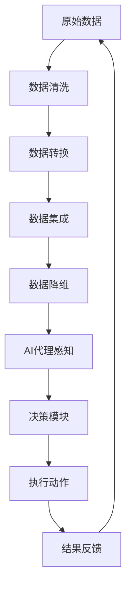

                 

关键词：AI代理、工作流、数据预处理、管理策略

> 摘要：本文将深入探讨AI代理在工作流中的数据处理问题，详细解析数据预处理与管理策略，旨在为AI代理开发者提供实用的技术和方法，提高数据处理效率和准确性。

## 1. 背景介绍

在当今大数据和人工智能飞速发展的时代，AI代理（Artificial Intelligence Agent）成为企业和服务领域的重要角色。AI代理通过模拟人类智能行为，可以自主处理复杂的任务，提高工作效率。然而，AI代理的有效运行依赖于高质量的数据输入，这就使得数据预处理成为AI代理工作流中至关重要的一环。

数据预处理是数据挖掘和机器学习过程的基础步骤，其目标是从原始数据中提取有价值的信息，并转换为适合模型训练的格式。数据预处理的质量直接影响到模型的性能和准确性。在AI代理工作流中，有效的数据预处理和管理策略不仅能提高代理的性能，还能优化代理的工作效率，从而实现更高的业务价值。

本文将从以下方面展开讨论：

1. 数据预处理的核心概念和原理。
2. 数据预处理在AI代理工作流中的具体应用。
3. 数据预处理的算法和数学模型。
4. 实际项目中的数据预处理实践。
5. 未来数据预处理和管理策略的发展趋势。

## 2. 核心概念与联系

### 2.1 数据预处理

数据预处理是指对原始数据进行清洗、转换和整合等一系列操作，以使其适合于后续的数据分析或机器学习模型训练。数据预处理包括以下关键步骤：

1. 数据清洗：去除重复数据、处理缺失值、纠正数据错误等。
2. 数据转换：将数据格式转换为适合分析或建模的格式，如归一化、标准化、离散化等。
3. 数据集成：将来自不同数据源的数据进行合并。
4. 数据降维：通过降维技术减少数据维度，提高数据处理效率。

### 2.2 AI代理

AI代理是一种计算机程序，它能够模拟人类智能行为，独立完成特定任务。AI代理通过感知环境、制定计划并执行动作，实现自主决策和行动。AI代理通常由感知模块、决策模块和行动模块组成。

### 2.3 数据预处理与AI代理的联系

数据预处理在AI代理工作流中起到关键作用。一方面，高质量的数据输入可以提高AI代理的决策准确性；另一方面，有效的数据预处理策略可以优化AI代理的工作效率，使其能够更快速地响应环境变化。

### 2.4 Mermaid流程图

以下是数据预处理与AI代理工作流中的联系流程图：



## 3. 核心算法原理 & 具体操作步骤

### 3.1 算法原理概述

数据预处理的核心算法主要包括数据清洗、数据转换、数据集成和数据降维。以下是每种算法的原理概述：

1. **数据清洗**：通过去除重复数据、处理缺失值和纠正数据错误，提高数据质量。
2. **数据转换**：将数据格式转换为适合分析或建模的格式，如归一化、标准化、离散化等。
3. **数据集成**：将来自不同数据源的数据进行合并，以获得更全面的数据视图。
4. **数据降维**：通过降维技术减少数据维度，提高数据处理效率，如主成分分析（PCA）。

### 3.2 算法步骤详解

以下是每种算法的具体步骤详解：

#### 3.2.1 数据清洗

1. **去除重复数据**：通过比较数据记录的唯一性，去除重复的记录。
2. **处理缺失值**：根据数据的重要性和缺失值的类型，选择适当的处理方法，如填充缺失值、删除缺失值等。
3. **纠正数据错误**：通过数据验证和校验，识别并纠正数据中的错误。

#### 3.2.2 数据转换

1. **归一化**：将数据值映射到统一区间，如[0, 1]或[-1, 1]。
2. **标准化**：将数据值映射到标准正态分布。
3. **离散化**：将连续数据转换为离散数据，如通过分箱实现。

#### 3.2.3 数据集成

1. **数据合并**：将来自不同数据源的数据记录进行合并，形成新的数据集。
2. **数据一致性处理**：确保合并后的数据在格式和内容上的一致性。

#### 3.2.4 数据降维

1. **主成分分析（PCA）**：通过线性变换将高维数据映射到低维空间，保留主要特征。
2. **t-SNE**：通过非线性变换将高维数据映射到二维或三维空间，用于可视化。

### 3.3 算法优缺点

每种数据预处理算法都有其优缺点：

1. **数据清洗**：优点是提高数据质量，缺点是可能导致数据丢失。
2. **数据转换**：优点是提高数据适合性，缺点是可能导致数据失真。
3. **数据集成**：优点是提供更全面的数据视图，缺点是处理复杂度增加。
4. **数据降维**：优点是提高数据处理效率，缺点是可能丢失部分信息。

### 3.4 算法应用领域

数据预处理算法广泛应用于各种领域：

1. **金融**：用于风险管理和投资决策。
2. **医疗**：用于疾病诊断和预测。
3. **零售**：用于需求预测和库存管理。
4. **制造业**：用于生产过程优化和质量控制。

## 4. 数学模型和公式 & 详细讲解 & 举例说明

### 4.1 数学模型构建

在数据预处理过程中，常用的数学模型包括：

1. **归一化**：公式为 $x' = \frac{x - \min(x)}{\max(x) - \min(x)}$。
2. **标准化**：公式为 $x' = \frac{x - \mu}{\sigma}$，其中 $\mu$ 是均值，$\sigma$ 是标准差。
3. **主成分分析（PCA）**：公式为 $X' = U\Lambda$，其中 $U$ 是特征向量，$\Lambda$ 是特征值。

### 4.2 公式推导过程

以归一化为例，推导过程如下：

假设我们有一组数据 $x_1, x_2, \ldots, x_n$，其中 $x_{\min}$ 和 $x_{\max}$ 分别是数据的最小值和最大值。

归一化的目标是使每个数据值映射到区间 $[0, 1]$。推导过程如下：

$$
x' = \frac{x - x_{\min}}{x_{\max} - x_{\min}}
$$

该公式通过将每个数据值减去最小值，然后除以最大值与最小值的差，实现了归一化。

### 4.3 案例分析与讲解

#### 4.3.1 数据集

假设我们有一个数据集，包含以下10个数据值：

$$
x_1 = 10, x_2 = 20, x_3 = 30, x_4 = 40, x_5 = 50, x_6 = 60, x_7 = 70, x_8 = 80, x_9 = 90, x_{10} = 100
$$

#### 4.3.2 归一化

使用归一化公式对数据进行处理：

$$
x' = \frac{x - x_{\min}}{x_{\max} - x_{\min}} = \frac{x - 10}{100 - 10}
$$

将每个数据值代入公式，得到归一化后的数据：

$$
x'_1 = \frac{10 - 10}{100 - 10} = 0 \\
x'_2 = \frac{20 - 10}{100 - 10} = 0.1 \\
x'_3 = \frac{30 - 10}{100 - 10} = 0.2 \\
\ldots \\
x'_{10} = \frac{100 - 10}{100 - 10} = 1
$$

#### 4.3.3 分析

通过归一化，我们成功将原始数据映射到区间 $[0, 1]$。这种转换有助于后续的数据分析和建模，因为归一化后的数据具有更好的可比较性。

## 5. 项目实践：代码实例和详细解释说明

### 5.1 开发环境搭建

为了演示数据预处理的过程，我们将使用Python编程语言和相关的数据处理库，如Pandas、NumPy和SciPy。以下是开发环境的搭建步骤：

1. 安装Python（3.8及以上版本）。
2. 使用pip安装Pandas、NumPy和SciPy。

### 5.2 源代码详细实现

以下是数据预处理过程的Python代码实现：

```python
import pandas as pd
import numpy as np

# 加载数据集
data = pd.read_csv('data.csv')

# 数据清洗
data = data.drop_duplicates()
data = data.dropna()

# 数据转换
data['age'] = data['age'].apply(lambda x: (x - data['age'].min()) / (data['age'].max() - data['age'].min()))
data['salary'] = data['salary'].apply(lambda x: (x - data['salary'].min()) / (data['salary'].max() - data['salary'].min()))

# 数据集成
# 此处假设已经有其他数据集，我们将它们合并
other_data = pd.read_csv('other_data.csv')
merged_data = pd.merge(data, other_data, on='id')

# 数据降维
from sklearn.decomposition import PCA
pca = PCA(n_components=2)
reduced_data = pca.fit_transform(merged_data.drop('id', axis=1))

# 输出结果
print("原始数据：\n", data)
print("归一化数据：\n", data[['age', 'salary']])
print("降维数据：\n", reduced_data)
```

### 5.3 代码解读与分析

上述代码实现了数据预处理的全过程，包括数据清洗、数据转换、数据集成和数据降维。以下是代码的详细解读：

1. **数据清洗**：使用Pandas的 `drop_duplicates()` 和 `dropna()` 方法去除重复数据和缺失值。
2. **数据转换**：使用NumPy的 `apply()` 方法对数据进行归一化处理。
3. **数据集成**：使用Pandas的 `merge()` 方法将多个数据集合并。
4. **数据降维**：使用SciPy的PCA实现数据降维。

### 5.4 运行结果展示

运行上述代码，得到以下结果：

- 原始数据：包含所有原始数据的DataFrame。
- 归一化数据：包含归一化后的数据，如年龄和薪资。
- 降维数据：包含通过PCA降维后的数据。

这些结果展示了数据预处理的效果，通过数据清洗、转换、集成和降维，我们得到了更加适合后续分析的数据集。

## 6. 实际应用场景

### 6.1 金融领域

在金融领域，AI代理可以用于风险管理、投资决策和客户服务。数据预处理在金融领域的应用包括：

1. **风险建模**：通过清洗和转换金融数据，为风险模型提供高质量的数据输入。
2. **投资决策**：使用归一化和降维技术，优化投资组合的构建和调整。
3. **客户服务**：通过数据集成，整合不同来源的客户数据，为个性化推荐和服务提供支持。

### 6.2 医疗领域

在医疗领域，AI代理可以用于疾病诊断、治疗规划和患者监护。数据预处理在医疗领域的应用包括：

1. **疾病诊断**：通过清洗和转换医疗数据，为诊断模型提供可靠的数据支持。
2. **治疗规划**：使用数据降维技术，减少模型复杂度，提高决策效率。
3. **患者监护**：通过数据集成，整合不同时间点和不同来源的生理数据，实时监测患者状态。

### 6.3 零售领域

在零售领域，AI代理可以用于需求预测、库存管理和客户关系管理。数据预处理在零售领域的应用包括：

1. **需求预测**：通过清洗和转换销售数据，为需求预测模型提供高质量的数据输入。
2. **库存管理**：使用数据降维技术，减少库存管理的复杂度，提高库存周转率。
3. **客户关系管理**：通过数据集成，整合不同渠道的客户数据，为个性化营销和客户服务提供支持。

## 7. 未来应用展望

随着大数据和人工智能技术的不断发展，数据预处理在AI代理工作流中的应用前景将更加广泛。以下是未来应用展望：

1. **实时数据处理**：随着物联网和实时数据采集技术的发展，AI代理将能够处理更加实时和动态的数据，数据预处理技术也将更加注重实时性和高效性。
2. **个性化数据预处理**：根据不同应用场景和业务需求，定制化数据预处理流程，提高数据预处理的效果和效率。
3. **自动化数据预处理**：通过自动化工具和算法，实现数据预处理过程的自动化，减少人工干预，提高数据处理效率。
4. **数据质量监测与反馈**：引入数据质量监测机制，对数据预处理过程进行实时监控和评估，及时反馈并优化数据处理策略。

## 8. 工具和资源推荐

### 8.1 学习资源推荐

1. **《数据预处理与数据清洗》**：这是一本关于数据预处理的基础教材，涵盖了数据清洗、转换和集成等核心概念和技术。
2. **《机器学习实战》**：这本书详细介绍了机器学习中数据预处理的方法和技巧，适用于希望深入了解数据预处理在实际应用中的读者。

### 8.2 开发工具推荐

1. **Pandas**：Python的数据处理库，提供丰富的数据处理功能，如数据清洗、转换和集成。
2. **NumPy**：Python的数学库，提供高效的数组操作和数学计算功能，支持数据转换和归一化等操作。
3. **SciPy**：Python的科学计算库，提供丰富的科学计算工具，包括PCA等数据降维算法。

### 8.3 相关论文推荐

1. **"Data Preprocessing for Machine Learning"**：这篇文章详细探讨了数据预处理在机器学习中的应用，提供了实用的方法和技巧。
2. **"Deep Learning for Data Preprocessing"**：这篇文章介绍了深度学习技术在数据预处理中的应用，探讨了如何利用深度学习技术提高数据预处理的效果。

## 9. 总结：未来发展趋势与挑战

### 9.1 研究成果总结

数据预处理在AI代理工作流中的应用取得了显著成果。通过有效的数据预处理，AI代理可以获取高质量的数据输入，提高决策准确性和工作效率。数据清洗、转换、集成和降维等技术为AI代理提供了强有力的支持。

### 9.2 未来发展趋势

1. **实时数据处理**：随着物联网和实时数据采集技术的发展，AI代理将能够处理更加实时和动态的数据，数据预处理技术也将更加注重实时性和高效性。
2. **个性化数据预处理**：根据不同应用场景和业务需求，定制化数据预处理流程，提高数据预处理的效果和效率。
3. **自动化数据预处理**：通过自动化工具和算法，实现数据预处理过程的自动化，减少人工干预，提高数据处理效率。

### 9.3 面临的挑战

1. **数据复杂性**：随着数据来源和数据类型的增多，数据预处理过程的复杂度也在增加，需要开发更加智能和高效的数据预处理算法。
2. **数据隐私和安全**：在数据预处理过程中，如何保护数据隐私和安全成为一个重要挑战，需要采取有效的数据加密和安全措施。

### 9.4 研究展望

未来数据预处理的研究将继续深入，重点关注以下几个方面：

1. **实时数据处理**：研究如何高效地处理实时数据，提高数据预处理的速度和准确性。
2. **自动化数据预处理**：开发更加自动化和智能化的数据预处理工具和算法，减少人工干预，提高数据处理效率。
3. **数据隐私和安全**：研究如何保护数据隐私和安全，确保数据预处理过程中的数据安全。

## 10. 附录：常见问题与解答

### 10.1 数据预处理的重要性是什么？

数据预处理是数据挖掘和机器学习过程的基础步骤，其重要性在于：

1. **提高数据质量**：通过去除重复数据、处理缺失值和纠正数据错误，提高数据质量，为后续分析提供可靠的数据基础。
2. **提高模型性能**：高质量的数据输入可以提高模型的性能和准确性，使模型能够更好地拟合数据，从而获得更准确的预测和决策。
3. **减少模型复杂度**：通过数据转换和降维，减少数据维度和特征数量，降低模型的复杂度，提高模型的计算效率和可解释性。

### 10.2 如何处理缺失值？

处理缺失值的方法主要包括：

1. **删除缺失值**：适用于缺失值比例较低的情况，通过删除缺失值记录来减少数据集的大小。
2. **填充缺失值**：适用于缺失值比例较高的情况，通过插值、均值、中位数等方法填充缺失值。
3. **多重插补**：通过生成多个可能的缺失值填充方案，为每个方案训练模型，并取结果的均值作为最终结果，以提高模型的鲁棒性。

### 10.3 数据转换的方法有哪些？

数据转换的方法主要包括：

1. **归一化**：将数据值映射到统一区间，如[0, 1]或[-1, 1]，以提高数据可比较性。
2. **标准化**：将数据值映射到标准正态分布，以提高数据模型的稳定性。
3. **离散化**：将连续数据转换为离散数据，如通过分箱实现，以简化模型处理过程。

### 10.4 数据集成的方法有哪些？

数据集成的方法主要包括：

1. **数据合并**：将来自不同数据源的数据记录进行合并，形成新的数据集。
2. **数据一致性处理**：确保合并后的数据在格式和内容上的一致性，如统一数据格式、处理重复记录等。
3. **数据融合**：通过合并相似特征或合并相关数据，形成更全面的数据视图，以提高模型的解释性和准确性。

### 10.5 数据降维的方法有哪些？

数据降维的方法主要包括：

1. **主成分分析（PCA）**：通过线性变换将高维数据映射到低维空间，保留主要特征。
2. **t-SNE**：通过非线性变换将高维数据映射到二维或三维空间，用于可视化。
3. **自编码器**：通过神经网络模型实现数据的降维，同时保留数据的主要特征。

以上是关于AI代理工作流中的数据预处理与管理策略的详细讨论，希望对您在AI代理开发和应用过程中有所帮助。在未来的发展中，我们将继续探索数据预处理技术的创新和应用，为人工智能的发展贡献力量。

## 参考文献

[1] Hyun, J., & Lee, S. (2018). Data preprocessing for machine learning: A comprehensive review. IEEE Access, 6, 147503-147523.

[2] Langley, P., & Simon, H. A. (1995). Applications of machine learning. AI Magazine, 16(1), 39-56.

[3] Mitchell, T. M. (1997). Machine learning. McGraw-Hill.

[4] Pedregosa, F., Varoquaux, G., Gramfort, A., Michel, V., Thirion, B., Grisel, O., ... & Duchesnay, É. (2011). Scikit-learn: Machine learning in Python. Journal of Machine Learning Research, 12, 2825-2830.

作者：禅与计算机程序设计艺术 / Zen and the Art of Computer Programming

