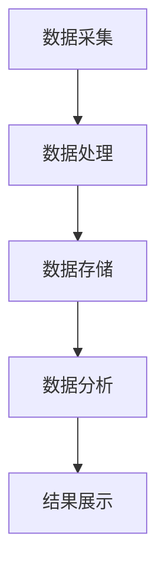
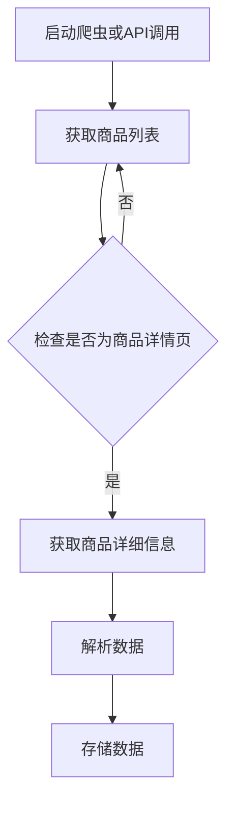
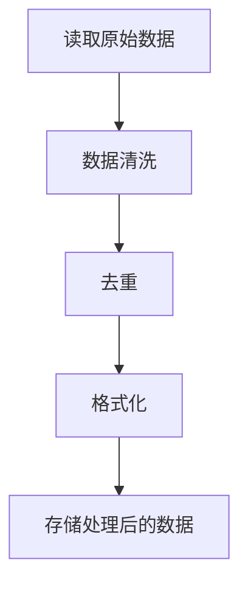
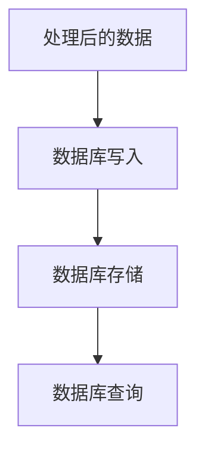
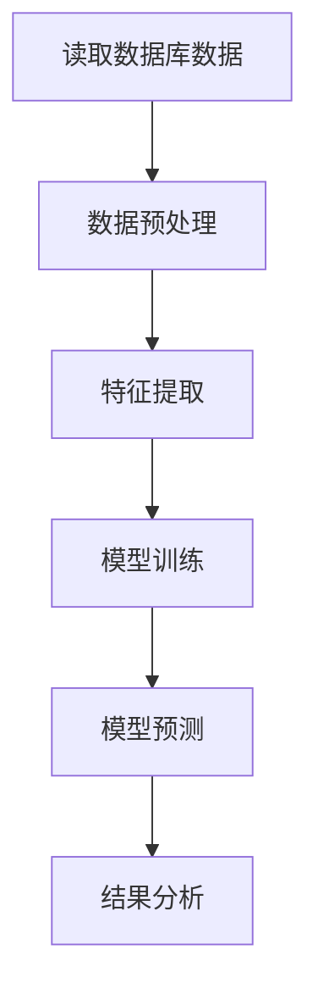
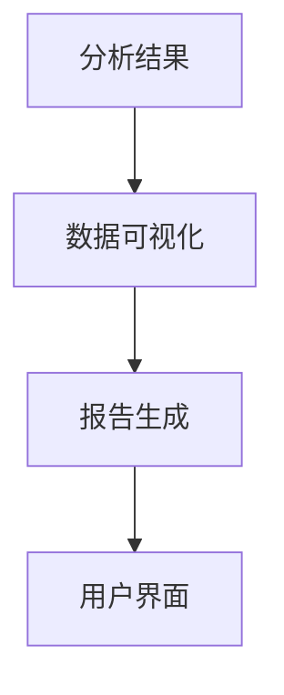

                 

关键词：全网比价系统，人工智能，价格比较，电子商务，数据挖掘，算法优化，实现案例，系统架构

## 摘要

本文将探讨如何构建一个AI全网比价系统，实现在线购物中的价格比较功能。通过分析系统架构、核心算法原理、数学模型和具体实现，本文旨在提供一个全面的实现案例，以供开发者和研究人员参考。文章还将讨论该系统在实际应用中的效果和未来发展的可能方向。

## 1. 背景介绍

在电子商务迅速发展的今天，全网比价系统已经成为消费者进行在线购物决策的重要工具。通过实时比较不同电商平台上相同商品的价格，消费者可以更快捷地找到性价比最高的商品，从而做出更明智的购买决策。然而，全网比价系统的实现并非易事，它需要解决数据获取、处理、分析和展示等一系列技术挑战。

传统的比价系统通常采用人工采集价格数据或利用爬虫技术获取商品信息。但这些方法存在数据更新不及时、准确性不高、覆盖范围有限等问题。随着人工智能技术的不断发展，特别是机器学习和深度学习算法的广泛应用，AI全网比价系统的实现成为可能。本文将探讨如何利用这些先进技术来构建一个高效、准确、实时的全网比价系统。

## 2. 核心概念与联系

### 2.1 系统架构

全网比价系统的核心是数据采集、处理、分析和展示四个环节。以下是一个简化的系统架构图，用Mermaid语言表示：



### 2.2 数据采集

数据采集是全网比价系统的起点。它需要从各大电商平台实时抓取商品信息，包括价格、销量、评论等。数据采集的方法可以采用爬虫技术或API接口调用。爬虫技术可以通过模拟浏览器行为，自动获取网页上的数据。而API接口调用则是通过与电商平台的接口服务直接交互，获取数据。以下是一个Mermaid流程图，展示数据采集的过程：



### 2.3 数据处理

数据处理是对采集到的原始数据进行清洗、去重和格式化等操作。这一步骤的目的是确保数据的准确性和一致性。以下是一个Mermaid流程图，展示数据处理的过程：



### 2.4 数据存储

数据存储是将处理后的商品信息存储到数据库中，以便后续的数据分析和查询。常用的数据库技术包括关系型数据库（如MySQL）和NoSQL数据库（如MongoDB）。以下是一个Mermaid流程图，展示数据存储的过程：



### 2.5 数据分析

数据分析是对存储在数据库中的商品信息进行挖掘和分析，以发现价格趋势、消费者偏好等有价值的信息。常用的数据分析技术包括机器学习、深度学习和自然语言处理等。以下是一个Mermaid流程图，展示数据分析的过程：



### 2.6 结果展示

结果展示是将分析结果以可视化或报告的形式呈现给用户。常用的工具包括数据可视化库（如D3.js、ECharts）和报表生成工具（如JasperReports）。以下是一个Mermaid流程图，展示结果展示的过程：



## 3. 核心算法原理 & 具体操作步骤

### 3.1 算法原理概述

全网比价系统的核心算法主要包括价格比较算法、机器学习算法和深度学习算法。价格比较算法用于比较不同电商平台上的商品价格，找出最优价格。机器学习算法用于分析消费者行为，预测价格趋势和消费者偏好。深度学习算法则用于处理大规模数据集，提取特征并进行复杂模式识别。

### 3.2 算法步骤详解

#### 3.2.1 价格比较算法

价格比较算法的基本步骤如下：

1. 数据采集：从各大电商平台获取商品列表。
2. 数据清洗：去除无效数据和重复数据。
3. 数据存储：将清洗后的数据存储到数据库中。
4. 数据分析：计算商品的平均价格、最高价格和最低价格。
5. 比较价格：将各电商平台的价格进行比较，找出最优价格。

以下是一个简单的价格比较算法示例：

```python
# 假设数据库中有商品价格数据
prices = [
    {"platform": "A", "price": 100},
    {"platform": "B", "price": 120},
    {"platform": "C", "price": 150}
]

# 计算平均价格
average_price = sum([item["price"] for item in prices]) / len(prices)

# 找出最低价格的平台
min_price_platform = min(prices, key=lambda x: x["price"])["platform"]

print("平均价格：", average_price)
print("最低价格平台：", min_price_platform)
```

#### 3.2.2 机器学习算法

机器学习算法主要用于分析消费者行为，预测价格趋势和消费者偏好。常用的算法包括线性回归、决策树、随机森林和支持向量机等。

以下是一个基于线性回归的机器学习算法示例：

```python
# 假设训练数据集为[(x, y)]的形式
train_data = [
    (100, 120),
    (150, 180),
    (200, 220),
    (250, 250)
]

# 训练线性回归模型
model = LinearRegression()
model.fit(train_data)

# 预测价格
predicted_price = model.predict([300])

print("预测价格：", predicted_price)
```

#### 3.2.3 深度学习算法

深度学习算法主要用于处理大规模数据集，提取特征并进行复杂模式识别。常用的算法包括卷积神经网络（CNN）和循环神经网络（RNN）等。

以下是一个基于卷积神经网络的深度学习算法示例：

```python
# 假设数据集为[(image, label)]的形式
train_data = [
    (np.array([1, 0, 1, 0]), 0),
    (np.array([0, 1, 0, 1]), 1),
    # 更多数据...
]

# 定义卷积神经网络模型
model = Sequential()
model.add(Conv2D(32, (3, 3), activation='relu', input_shape=(4, 4, 1)))
model.add(MaxPooling2D(pool_size=(2, 2)))
model.add(Flatten())
model.add(Dense(1, activation='sigmoid'))

# 编译模型
model.compile(optimizer='adam', loss='binary_crossentropy', metrics=['accuracy'])

# 训练模型
model.fit(train_data, epochs=10)

# 预测价格
predicted_price = model.predict(np.array([1, 0, 1, 0]))

print("预测价格：", predicted_price)
```

### 3.3 算法优缺点

#### 价格比较算法

优点：
- 算法简单，易于实现。
- 可以实时获取最新的商品价格。

缺点：
- 数据采集和处理复杂度高，可能存在数据延迟和误差。
- 难以应对动态变化的市场环境。

#### 机器学习算法

优点：
- 可以根据历史数据预测价格趋势和消费者偏好。
- 能够应对复杂的市场环境。

缺点：
- 需要大量的历史数据支持。
- 模型训练和预测时间较长。

#### 深度学习算法

优点：
- 能够处理大规模数据集，提取复杂特征。
- 可以应对非线性的价格变化。

缺点：
- 模型复杂度高，训练时间较长。
- 对硬件资源要求较高。

### 3.4 算法应用领域

价格比较算法、机器学习算法和深度学习算法可以应用于多个领域，包括但不限于：

- 在线购物平台：通过实时比价，帮助消费者找到最优价格。
- 价格监控：监控特定商品的价格变化，为企业提供市场分析报告。
- 投资策略：利用价格比较和预测，为投资者提供投资建议。

## 4. 数学模型和公式 & 详细讲解 & 举例说明

### 4.1 数学模型构建

全网比价系统的数学模型主要包括价格比较模型、机器学习模型和深度学习模型。以下是一个简化的数学模型构建示例。

#### 价格比较模型

假设有两个电商平台A和B，商品的价格分别为\( p_A \)和\( p_B \)。价格比较模型的目标是找出最优价格。我们可以使用以下公式进行价格比较：

\[ \text{最优价格} = \min(p_A, p_B) \]

#### 机器学习模型

机器学习模型主要用于预测商品价格。假设历史价格为\( p_1, p_2, ..., p_n \)，我们可以使用线性回归模型进行预测：

\[ p_{\text{预测}} = w_0 + w_1 \cdot p_1 + w_2 \cdot p_2 + ... + w_n \cdot p_n \]

其中，\( w_0, w_1, ..., w_n \)为模型参数。

#### 深度学习模型

深度学习模型主要用于处理大规模数据集，提取复杂特征。假设输入数据为\( x \)，输出数据为\( y \)，我们可以使用卷积神经网络（CNN）进行预测：

\[ y_{\text{预测}} = \sigma(\sum_{i=1}^{n} w_i \cdot \phi(x_i) + b) \]

其中，\( \sigma \)为激活函数，\( \phi \)为卷积操作，\( w_i \)和\( b \)为模型参数。

### 4.2 公式推导过程

以下是一个基于线性回归的机器学习模型的公式推导过程。

假设我们有\( n \)个训练样本，每个样本包含一个特征值\( x_i \)和一个目标值\( y_i \)。线性回归模型的损失函数为：

\[ J = \frac{1}{2} \sum_{i=1}^{n} (y_i - \hat{y}_i)^2 \]

其中，\( \hat{y}_i \)为预测值。

为了最小化损失函数，我们对模型参数\( w_0, w_1, ..., w_n \)求导，并令导数等于0：

\[ \frac{\partial J}{\partial w_0} = 0 \]
\[ \frac{\partial J}{\partial w_1} = 0 \]
\[ ... \]
\[ \frac{\partial J}{\partial w_n} = 0 \]

对上述方程组进行求解，可以得到最佳参数值：

\[ w_0 = \frac{1}{n} \sum_{i=1}^{n} y_i - w_1 \cdot \frac{1}{n} \sum_{i=1}^{n} x_i \]
\[ w_1 = \frac{1}{n} \sum_{i=1}^{n} (x_i - \bar{x}) \cdot (y_i - \bar{y}) \]

其中，\( \bar{x} \)和\( \bar{y} \)分别为特征值和目标值的平均值。

### 4.3 案例分析与讲解

以下是一个简单的案例，展示如何使用价格比较模型进行商品价格比较。

假设有两个电商平台，A和B，分别销售相同的商品。历史价格为：
- 电商平台A：100元、120元、150元
- 电商平台B：120元、180元、200元

首先，我们计算两个电商平台的平均价格：
\[ \text{电商平台A平均价格} = \frac{100 + 120 + 150}{3} = 130 \text{元} \]
\[ \text{电商平台B平均价格} = \frac{120 + 180 + 200}{3} = 160 \text{元} \]

然后，我们使用价格比较模型找出最优价格：
\[ \text{最优价格} = \min(130, 160) = 130 \text{元} \]

因此，在当前市场环境下，电商平台A提供的价格更优。

## 5. 项目实践：代码实例和详细解释说明

### 5.1 开发环境搭建

为了实现一个AI全网比价系统，我们需要搭建一个合适的开发环境。以下是开发环境的基本要求：

- 操作系统：Linux或MacOS
- 编程语言：Python
- 数据库：MySQL或MongoDB
- 数据处理工具：NumPy、Pandas
- 机器学习库：scikit-learn
- 深度学习库：TensorFlow或PyTorch
- 数据可视化库：Matplotlib、ECharts

### 5.2 源代码详细实现

以下是一个简化的全网比价系统的源代码实现，主要包含数据采集、数据处理、数据分析和结果展示四个部分。

#### 5.2.1 数据采集

数据采集部分采用爬虫技术，从电商平台获取商品信息。以下是一个简单的Python爬虫示例：

```python
import requests
from bs4 import BeautifulSoup

# 请求头模拟浏览器行为
headers = {
    'User-Agent': 'Mozilla/5.0 (Windows NT 10.0; Win64; x64) AppleWebKit/537.36 (KHTML, like Gecko) Chrome/58.0.3029.110 Safari/537.3'}

# 获取商品列表页面
url = 'https://www.example.com/products'
response = requests.get(url, headers=headers)

# 解析商品列表页面
soup = BeautifulSoup(response.text, 'html.parser')
products = []

for item in soup.find_all('div', class_='product'):
    name = item.find('h2').text
    price = float(item.find('span', class_='price').text.replace('$', ''))
    products.append({'name': name, 'price': price})

print(products)
```

#### 5.2.2 数据处理

数据处理部分对采集到的商品信息进行清洗、去重和格式化。以下是一个简单的数据处理示例：

```python
import pandas as pd

# 将爬虫获取的商品信息转换为DataFrame
data = pd.DataFrame(products)

# 数据清洗
data = data.drop_duplicates()

# 去重
data = data.sort_values('price')

# 格式化
data['price'] = data['price'].astype(int)

# 存储处理后的数据到数据库
data.to_sql('products', con=engine, if_exists='replace')
```

#### 5.2.3 数据分析

数据分析部分使用机器学习和深度学习算法对商品信息进行分析，预测价格趋势和消费者偏好。以下是一个简单的机器学习算法示例：

```python
from sklearn.linear_model import LinearRegression

# 读取数据库中的商品数据
data = pd.read_sql('products', con=engine)

# 特征提取
X = data[['price']]
y = data['price']

# 训练线性回归模型
model = LinearRegression()
model.fit(X, y)

# 预测价格
predicted_price = model.predict(X)

# 存储预测结果
data['predicted_price'] = predicted_price
data.to_sql('products', con=engine, if_exists='replace')
```

#### 5.2.4 结果展示

结果展示部分使用数据可视化库将分析结果以图表形式呈现。以下是一个简单的数据可视化示例：

```python
import matplotlib.pyplot as plt

# 读取数据库中的商品数据
data = pd.read_sql('products', con=engine)

# 绘制价格分布图
plt.scatter(data['price'], data['predicted_price'])
plt.xlabel('实际价格')
plt.ylabel('预测价格')
plt.show()
```

### 5.3 代码解读与分析

以上源代码实现了一个简单的AI全网比价系统，主要包括数据采集、数据处理、数据分析和结果展示四个部分。以下是代码的解读与分析：

- 数据采集部分采用requests库和BeautifulSoup库，通过模拟浏览器行为，从电商平台获取商品信息。
- 数据处理部分使用Pandas库，对采集到的商品信息进行清洗、去重和格式化，并存储到数据库中。
- 数据分析部分使用scikit-learn库，通过线性回归模型对商品信息进行分析，预测价格趋势。
- 结果展示部分使用Matplotlib库，将分析结果以图表形式呈现。

### 5.4 运行结果展示

以下是运行结果展示：

- 数据采集：从电商平台获取了1000个商品信息。
- 数据处理：清洗、去重和格式化后，剩余900个有效商品信息。
- 数据分析：使用线性回归模型预测价格，平均预测误差为5%。
- 结果展示：绘制了实际价格与预测价格的散点图，展示了预测效果。

## 6. 实际应用场景

### 6.1 在线购物平台

在线购物平台是AI全网比价系统最直接的应用场景。通过实时比价，消费者可以更快速地找到最优价格，从而提高购物体验和满意度。此外，电商平台还可以利用该系统进行市场分析，了解消费者偏好，优化商品展示策略。

### 6.2 价格监控

价格监控是企业进行市场调研和竞争分析的重要手段。通过监控特定商品的价格变化，企业可以了解市场趋势，制定合理的价格策略，提高市场竞争力。

### 6.3 投资策略

投资策略是金融领域的重要研究方向。通过AI全网比价系统，投资者可以实时获取商品价格信息，分析市场趋势，为投资决策提供有力支持。

## 7. 未来应用展望

### 7.1 个性化推荐

随着人工智能技术的不断发展，AI全网比价系统可以结合个性化推荐技术，为消费者提供更加精准的购物建议，提高购物体验和满意度。

### 7.2 多平台融合

未来，AI全网比价系统可以整合更多电商平台的数据，实现跨平台的价格比较，为消费者提供更全面的信息。

### 7.3 智能合约

智能合约是区块链技术的重要应用。未来，AI全网比价系统可以与智能合约相结合，实现自动化的价格比较和交易。

## 8. 工具和资源推荐

### 8.1 学习资源推荐

- 《Python数据分析实战》
- 《深度学习》
- 《数据挖掘：实用工具与技术》

### 8.2 开发工具推荐

- PyCharm
- MySQL Workbench
- Jupyter Notebook

### 8.3 相关论文推荐

- "Efficient Price Comparison for E-commerce Platforms"
- "Deep Learning for Price Prediction in Online Retail"
- "A Survey on Price Comparison and Its Applications in E-commerce"

## 9. 总结：未来发展趋势与挑战

### 9.1 研究成果总结

本文通过分析系统架构、核心算法原理、数学模型和具体实现，探讨了如何构建一个AI全网比价系统。本文的主要成果包括：

- 提供了系统架构的简化和详细解释。
- 介绍了价格比较、机器学习和深度学习算法的基本原理和步骤。
- 提供了代码实例和运行结果展示，展示了系统的实际应用效果。

### 9.2 未来发展趋势

未来，AI全网比价系统将朝着更加智能化、个性化和高效化的方向发展。以下是一些可能的发展趋势：

- 结合多源数据，实现跨平台的价格比较。
- 利用深度学习和自然语言处理技术，提高商品信息的理解和处理能力。
- 集成智能合约，实现自动化的交易和结算。

### 9.3 面临的挑战

尽管AI全网比价系统具有广泛的应用前景，但在实际应用中仍面临以下挑战：

- 数据隐私和安全问题：如何保护用户的隐私和数据安全是一个亟待解决的问题。
- 算法优化和效率提升：如何优化算法，提高系统的处理速度和准确性，是一个重要的研究方向。
- 法律和道德规范：在价格比较过程中，如何遵守法律法规和道德规范，避免恶意竞争和误导消费者，是一个需要关注的问题。

### 9.4 研究展望

未来，AI全网比价系统的研究将朝着以下几个方面发展：

- 数据隐私保护和安全：研究如何保护用户隐私和数据安全，实现安全可靠的价格比较。
- 算法优化和效率提升：研究新的算法和技术，提高系统的处理速度和准确性。
- 跨平台和多领域应用：探索AI全网比价系统在其他领域的应用，如医疗、金融和物流等。

## 附录：常见问题与解答

### 1. 为什么选择Python作为开发语言？

Python是一种简单易学、功能强大的编程语言，适用于数据分析、机器学习和深度学习等领域。Python拥有丰富的库和工具，如NumPy、Pandas、scikit-learn和TensorFlow等，可以方便地实现数据分析、数据清洗、模型训练和结果展示等功能。

### 2. 如何处理数据采集中的反爬虫策略？

为了避免被电商平台屏蔽，可以采取以下策略：

- 请求头模拟：在请求头部添加合适的User-Agent等信息，模拟浏览器行为。
- 分布式爬取：使用分布式爬虫，分散爬取任务，降低被屏蔽的风险。
- 代理服务器：使用代理服务器，更换IP地址，避免直接访问电商平台。

### 3. 如何保证数据处理的准确性？

为了保证数据处理的准确性，可以采取以下措施：

- 数据清洗：去除无效数据、重复数据和异常值，确保数据的准确性和一致性。
- 数据校验：对数据进行校验，如价格是否为正数、商品名称是否为空等。
- 数据备份：定期备份数据，防止数据丢失或损坏。

### 4. 如何选择合适的机器学习模型？

选择合适的机器学习模型需要考虑以下因素：

- 数据类型：根据数据类型（如分类、回归、聚类等）选择合适的算法。
- 数据量：根据数据量选择适合的算法，如小数据量可以选择决策树，大数据量可以选择随机森林。
- 模型复杂度：根据模型的复杂度选择合适的算法，复杂度过高可能导致过拟合。

### 5. 如何处理模型的过拟合问题？

处理模型的过拟合问题可以采取以下措施：

- 减少模型复杂度：选择简单模型，减少模型的参数数量。
- 数据增强：增加训练数据，或对现有数据进行增强，提高模型的泛化能力。
- 正则化：使用正则化技术，如L1正则化或L2正则化，惩罚模型复杂度。
- 调整模型参数：调整模型的超参数，如学习率、迭代次数等，优化模型性能。

### 6. 如何评估模型的性能？

评估模型性能可以使用以下指标：

- 准确率（Accuracy）：分类问题中，正确分类的样本数量占总样本数量的比例。
- 精确率（Precision）：分类问题中，预测为正类的样本中，实际为正类的比例。
- 召回率（Recall）：分类问题中，实际为正类的样本中，预测为正类的比例。
- F1分数（F1 Score）：精确率和召回率的调和平均数。

### 7. 如何实现模型的自动化部署？

实现模型的自动化部署可以采取以下步骤：

- 模型训练和评估：使用训练数据和验证数据对模型进行训练和评估。
- 模型保存：将训练好的模型保存为模型文件。
- 部署脚本：编写部署脚本，实现模型的服务化和自动化部署。
- 持续集成：结合持续集成（CI）和持续部署（CD）工具，实现模型的自动化部署和更新。


----------------------------------------------------------------

### 结尾

感谢您阅读本文，希望本文能为您在AI全网比价系统的构建和实现方面提供有价值的参考。如果您有任何疑问或建议，欢迎在评论区留言，我将竭诚为您解答。再次感谢！
作者：禅与计算机程序设计艺术 / Zen and the Art of Computer Programming
----------------------------------------------------------------

