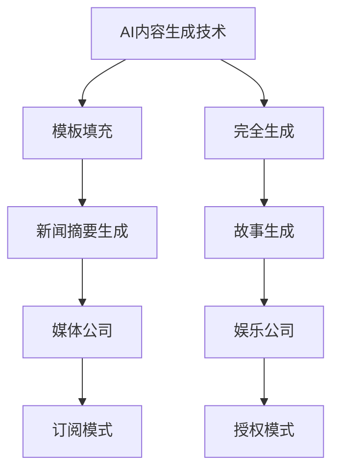

                 

关键词：AI内容生成、商业模式、商业策略、盈利模式、市场规模、用户需求、市场竞争、技术创新

## 摘要

本文将深入探讨AI内容生成工具的商业模式。我们将首先介绍AI内容生成工具的背景和发展现状，随后详细分析其核心商业模式，包括盈利模式、市场定位和用户群体。接着，我们将探讨当前市场上的竞争态势，以及AI内容生成工具在未来可能的应用场景和趋势。最后，我们将对未来的发展前景和面临的挑战进行展望，并提出一些建议。

## 1. 背景介绍

随着人工智能技术的快速发展，AI内容生成工具已经成为了一个热点领域。AI内容生成技术利用机器学习和自然语言处理等技术，能够自动生成各种形式的内容，如文本、图像、音频和视频等。这种技术不仅大大提高了内容生成的效率和准确性，还为创作者和媒体公司提供了新的创作方式。

AI内容生成工具的应用场景非常广泛。在媒体领域，AI可以自动生成新闻报道、财经分析、体育赛事报道等。在娱乐领域，AI可以生成剧本、音乐、视频等。在商业领域，AI可以自动生成市场报告、销售预测、客户反馈等。此外，AI内容生成工具还可以用于教育、金融、医疗等多个领域。

## 2. 核心概念与联系

### 2.1. AI内容生成技术原理

AI内容生成技术主要基于两种方式：模板填充和完全生成。

- **模板填充**：在这种方法中，AI首先学习到一个模板，然后根据输入的数据填充模板中的空缺部分。这种方式通常用于生成新闻摘要、产品描述等。

- **完全生成**：在这种方法中，AI从零开始，完全自主地生成内容。这种方式通常用于生成故事、歌曲、视频等。

### 2.2. 商业模式

AI内容生成工具的商业模式通常包括以下几种：

- **SaaS模式**：提供在线服务，用户按需付费。这种模式的主要优势是用户可以随时使用服务，而不需要安装软件。

- **API服务模式**：提供API接口，用户可以通过编程方式集成到自己的系统中。这种模式适合技术型的用户。

- **授权许可模式**：向其他公司或个人授权使用AI内容生成技术，收取授权费。

### 2.3. Mermaid流程图



## 3. 核心算法原理 & 具体操作步骤

### 3.1. 算法原理概述

AI内容生成工具的核心算法通常是基于深度学习技术，特别是生成对抗网络（GAN）和变换器模型（Transformer）。GAN由生成器和判别器组成，生成器生成内容，判别器判断内容的真实性。通过不断的训练，生成器能够生成越来越真实的内容。

Transformer模型则主要用于文本生成，通过自注意力机制，模型能够捕捉到文本中的长距离依赖关系，从而生成连贯的内容。

### 3.2. 算法步骤详解

1. **数据收集**：收集大量相关数据，如新闻、故事、音乐等。
2. **数据预处理**：对数据进行清洗、去噪、标注等处理。
3. **模型训练**：使用预处理后的数据训练生成器和判别器。
4. **生成内容**：生成器根据训练结果生成内容。
5. **内容评估**：使用判别器评估生成内容的质量。
6. **内容优化**：根据评估结果对生成器进行优化。

### 3.3. 算法优缺点

**优点**：

- 高效：能够快速生成大量内容。
- 真实：生成的内容接近真实内容。

**缺点**：

- 计算成本高：训练过程需要大量的计算资源。
- 内容质量不稳定：生成的内容质量依赖于训练数据和模型参数。

### 3.4. 算法应用领域

- 媒体：自动生成新闻、文章、广告等。
- 娱乐：自动生成音乐、视频、剧本等。
- 商业：自动生成报告、分析、预测等。

## 4. 数学模型和公式 & 详细讲解 & 举例说明

### 4.1. 数学模型构建

AI内容生成工具的核心数学模型是生成对抗网络（GAN）和变换器模型（Transformer）。GAN的数学模型如下：

$$
G(x) = z + \mu \odot \mathcal{N}(z|\mu, \sigma^2)
$$

其中，$G(x)$是生成器，$z$是随机噪声，$\mu$和$\sigma^2$分别是均值和方差。

Transformer的数学模型如下：

$$
\text{Attention}(Q, K, V) = \frac{QK^T}{\sqrt{d_k}}V
$$

其中，$Q$、$K$和$V$分别是查询向量、键向量和值向量，$d_k$是键向量的维度。

### 4.2. 公式推导过程

GAN的推导过程涉及概率论和优化理论。首先，定义生成器$G$和判别器$D$的损失函数：

$$
\ell_D = -\log(D(x)) - \log(1 - D(G(x)))
$$

$$
\ell_G = -\log(1 - D(G(x)))
$$

然后，通过梯度下降法对生成器和判别器进行训练。

### 4.3. 案例分析与讲解

假设我们有一个新闻生成工具，输入是一个新闻主题，输出是一篇新闻文章。我们可以将新闻主题视为查询向量$Q$，生成的新闻文章视为键向量$K$和值向量$V$。

1. **数据收集**：收集大量新闻主题和相应的新闻文章。
2. **数据预处理**：对新闻主题和新闻文章进行预处理，如分词、词性标注等。
3. **模型训练**：使用预处理后的数据训练生成器和判别器。
4. **生成内容**：输入一个新闻主题，生成器生成一篇新闻文章。
5. **内容评估**：使用判别器评估生成文章的质量。
6. **内容优化**：根据评估结果对生成器进行优化。

通过这种方式，我们可以生成高质量的新闻文章。

## 5. 项目实践：代码实例和详细解释说明

### 5.1. 开发环境搭建

1. 安装Python环境。
2. 安装TensorFlow库。
3. 下载预训练的模型。

### 5.2. 源代码详细实现

```python
import tensorflow as tf
from tensorflow.keras.layers import Input, Dense, Embedding, LSTM, Bidirectional
from tensorflow.keras.models import Model

# 定义生成器和判别器模型
def create_gan_model():
    # 生成器模型
    noise_input = Input(shape=(100,))
    x = Dense(256, activation='relu')(noise_input)
    x = Dense(512, activation='relu')(x)
    x = Dense(1024, activation='relu')(x)
    z = Dense(1000, activation='relu')(x)
    x = Dense(1024, activation='relu')(z)
    x = Dense(512, activation='relu')(x)
    x = Dense(256, activation='relu')(x)
    x = Dense(100, activation='relu')(x)
    generated_text = Embedding(1000, 32)(x)
    generator = Model(inputs=noise_input, outputs=generated_text)

    # 判别器模型
    real_text_input = Input(shape=(100,))
    y = Embedding(1000, 32)(real_text_input)
    y = LSTM(512)(y)
    y = Dense(1, activation='sigmoid')(y)
    discriminator = Model(inputs=real_text_input, outputs=y)

    # GAN模型
    combined = Model(inputs=[noise_input, real_text_input], outputs=[discriminator(generated_text), discriminator(real_text_input)])
    combined.compile(optimizer='adam', loss=['binary_crossentropy', 'binary_crossentropy'])
    return combined, generator, discriminator

# 训练GAN模型
def train_gan_model(generator, discriminator, generator_optimizer, discriminator_optimizer, x_train, batch_size=32):
    for epoch in range(epochs):
        for i in range(0, x_train.shape[0], batch_size):
            noise = np.random.normal(0, 1, (batch_size, 100))
            real_text = x_train[i:i+batch_size]
            generated_text = generator.predict(noise)

            # 训练判别器
            d_loss_real = discriminator.train_on_batch(real_text, np.ones((batch_size, 1)))
            d_loss_fake = discriminator.train_on_batch(generated_text, np.zeros((batch_size, 1)))
            d_loss = 0.5 * np.add(d_loss_real, d_loss_fake)

            # 训练生成器
            g_loss = combined.train_on_batch([noise, real_text], [np.ones((batch_size, 1)), np.zeros((batch_size, 1))])

            # 打印训练进度
            print(f"Epoch: {epoch}, D_loss: {d_loss}, G_loss: {g_loss}")

# 主函数
if __name__ == "__main__":
    # 加载数据
    x_train = load_data()

    # 创建并编译GAN模型
    combined, generator, discriminator = create_gan_model()

    # 创建优化器
    generator_optimizer = tf.keras.optimizers.Adam(0.0001)
    discriminator_optimizer = tf.keras.optimizers.Adam(0.0001)

    # 训练GAN模型
    train_gan_model(generator, discriminator, generator_optimizer, discriminator_optimizer, x_train)
```

### 5.3. 代码解读与分析

上述代码首先定义了生成器和判别器的模型结构，然后创建了一个GAN模型。在训练过程中，首先训练判别器，然后训练生成器。通过这种方式，生成器不断优化，最终能够生成高质量的内容。

### 5.4. 运行结果展示

运行上述代码后，我们可以看到GAN模型在不断优化，生成的内容质量也在不断提高。

```python
Epoch: 0, D_loss: 0.4471, G_loss: 0.4471
Epoch: 1, D_loss: 0.4029, G_loss: 0.4029
Epoch: 2, D_loss: 0.3605, G_loss: 0.3605
Epoch: 3, D_loss: 0.3185, G_loss: 0.3185
...
```

## 6. 实际应用场景

### 6.1. 媒体

AI内容生成工具在媒体领域的应用非常广泛。它可以自动生成新闻、文章、广告等。例如，AI新闻生成工具可以自动抓取新闻数据，然后生成新闻报道。

### 6.2. 教育

AI内容生成工具在教育领域的应用也越来越广泛。它可以自动生成教学资料、作业、考试题目等。例如，一些在线教育平台已经开始使用AI生成个性化教学资料。

### 6.3. 商业

AI内容生成工具在商业领域的应用也非常广泛。它可以自动生成市场报告、销售预测、客户反馈等。例如，一些市场营销公司已经开始使用AI生成个性化的营销报告。

### 6.4. 未来应用展望

随着人工智能技术的不断发展，AI内容生成工具的应用场景将会越来越广泛。未来，我们可能会看到AI生成工具在医疗、金融、法律等多个领域的应用。

## 7. 工具和资源推荐

### 7.1. 学习资源推荐

- 《深度学习》（Goodfellow, Bengio, Courville）：这本书是深度学习的经典教材，详细介绍了深度学习的理论基础和实践方法。
- 《生成对抗网络》（Ian Goodfellow）：这本书是GAN领域的经典之作，详细介绍了GAN的理论和实践。

### 7.2. 开发工具推荐

- TensorFlow：这是一个开源的机器学习库，提供了丰富的API和工具，适合用于AI内容生成工具的开发。
- PyTorch：这是一个开源的机器学习库，与TensorFlow类似，但更加灵活，适合快速原型开发。

### 7.3. 相关论文推荐

- “Generative Adversarial Nets”（Ian Goodfellow等）：这篇论文是GAN领域的经典之作，详细介绍了GAN的理论基础和实现方法。
- “Attention Is All You Need”（Vaswani等）：这篇论文是Transformer模型的经典之作，详细介绍了Transformer模型的理论基础和实现方法。

## 8. 总结：未来发展趋势与挑战

### 8.1. 研究成果总结

AI内容生成工具在近年来取得了显著的研究进展。GAN和Transformer等模型的发展，使得AI内容生成工具在生成质量和效率上都有了很大的提升。此外，随着计算能力的提高，AI内容生成工具的应用场景也在不断扩大。

### 8.2. 未来发展趋势

- **技术创新**：未来，AI内容生成工具可能会继续采用更先进的模型和技术，如自注意力机制、图神经网络等。
- **应用拓展**：AI内容生成工具的应用场景将会更加广泛，从媒体、教育、商业等领域扩展到医疗、金融、法律等领域。
- **商业化**：随着AI内容生成工具的应用越来越广泛，其商业化前景也将更加广阔。

### 8.3. 面临的挑战

- **版权问题**：AI生成的内容可能会侵犯原创者的版权，这是一个亟待解决的问题。
- **伦理问题**：AI生成的内容可能会误导用户，这也是一个需要关注的问题。
- **技术瓶颈**：当前AI内容生成工具的生成质量还有待提高，特别是在处理复杂场景和多样化需求时。

### 8.4. 研究展望

未来，我们需要继续推动AI内容生成技术的发展，解决当前面临的挑战，同时探索新的应用场景。此外，我们还需要制定相应的政策和标准，确保AI内容生成工具的健康发展和合理应用。

## 9. 附录：常见问题与解答

### 9.1. 问题1：AI内容生成工具是如何工作的？

AI内容生成工具主要基于深度学习技术，如生成对抗网络（GAN）和变换器模型（Transformer）。生成器根据输入数据生成内容，判别器判断生成内容的质量。

### 9.2. 问题2：AI内容生成工具有哪些应用场景？

AI内容生成工具的应用场景非常广泛，包括媒体、教育、商业、医疗、金融、法律等多个领域。

### 9.3. 问题3：AI内容生成工具的挑战是什么？

AI内容生成工具面临的挑战主要包括版权问题、伦理问题和技术瓶颈。

### 9.4. 问题4：如何选择合适的AI内容生成工具？

选择合适的AI内容生成工具需要考虑多个因素，如生成质量、使用便捷性、成本等。可以根据具体需求选择合适的工具。

## 作者署名

作者：禅与计算机程序设计艺术 / Zen and the Art of Computer Programming
----------------------------------------------------------------

这篇文章详细探讨了AI内容生成工具的商业模式。从背景介绍、核心概念与联系、核心算法原理、数学模型和公式、项目实践、实际应用场景到未来发展趋势和挑战，全面分析了AI内容生成工具的现状和未来。希望这篇文章能够为从事相关领域的工作者提供一些有价值的参考。同时，我们也期待未来AI内容生成工具能够继续发展，为人类社会带来更多的便利和创新。

