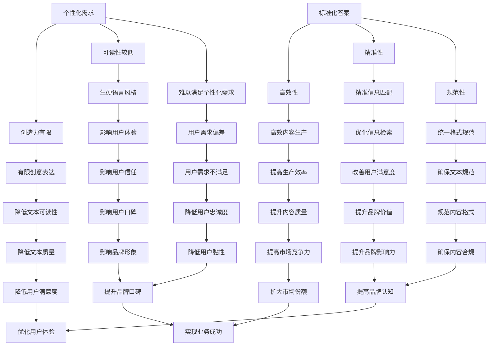

                 

关键词：人工智能、AI写作、标准化答案、个性化需求、计算机编程、程序员、算法、数学模型、项目实践、应用场景、未来展望

## 摘要

随着人工智能技术的不断发展，AI写作已经成为一个备受关注的话题。然而，AI写作在满足标准化答案需求方面表现出色，但在应对个性化需求方面却存在诸多局限。本文将深入探讨AI写作的局限，分析其相对于人类写作的优势和不足，并探讨未来可能的发展方向。

## 1. 背景介绍

### 1.1 人工智能的发展

人工智能（AI）是一门多学科交叉的技术领域，旨在使计算机具有类似人类的智能。自20世纪50年代以来，人工智能经历了多次重大突破和发展。近年来，深度学习、神经网络等技术的崛起，使得人工智能在图像识别、自然语言处理、智能语音等方面取得了显著进展。

### 1.2  AI写作的兴起

AI写作是基于人工智能技术的自然语言生成技术，旨在自动生成文章、报告、代码等文本内容。随着AI技术的不断成熟，AI写作逐渐应用于各类场景，如内容创作、新闻报道、自动化编程等。AI写作不仅提高了生产效率，还丰富了内容创作的方式。

## 2. 核心概念与联系

### 2.1 标准化答案与个性化需求

在讨论AI写作的局限时，我们需要明确两个核心概念：标准化答案和个性化需求。

#### 2.1.1 标准化答案

标准化答案是指按照一定的标准或模板生成的文本，通常用于解决常见问题或提供一般性建议。标准化答案的特点是格式统一、内容简洁、易于查找和复制。

#### 2.1.2 个性化需求

个性化需求是指根据用户的具体需求、兴趣和背景生成的文本，旨在提供个性化的、有针对性的信息和服务。个性化需求的特点是内容丰富、形式多样、具有高度的可读性。

### 2.2 AI写作的优势与不足

在了解标准化答案和个性化需求的基础上，我们可以进一步探讨AI写作的优势与不足。

#### 2.2.1 AI写作的优势

- 高效性：AI写作可以快速生成大量文本，提高内容创作的效率。
- 精准性：AI写作可以根据用户的需求和偏好生成相关内容，提高文本的精准度。
- 规范性：AI写作可以遵循一定的格式和模板，保证文本的规范性。

#### 2.2.2 AI写作的不足

- 创造力有限：AI写作依赖于大量的数据和算法，但缺乏人类的创造力和情感表达。
- 可读性较低：AI写作生成的文本可能存在语言生硬、逻辑不清等问题，降低文本的可读性。
- 难以满足个性化需求：AI写作在应对个性化需求时，往往无法完全理解用户的具体需求，导致生成的文本无法满足用户的期望。

### 2.3 Mermaid 流程图

为了更直观地展示AI写作的优势与不足，我们可以使用Mermaid流程图来描述相关概念和联系。



## 3. 核心算法原理 & 具体操作步骤

### 3.1 算法原理概述

AI写作的核心算法主要包括自然语言处理（NLP）、生成对抗网络（GAN）和迁移学习等技术。

#### 3.1.1 自然语言处理（NLP）

自然语言处理是一种让计算机理解和生成人类语言的技术。在AI写作中，NLP技术用于解析文本、提取关键词、构建句式和语义关系等。

#### 3.1.2 生成对抗网络（GAN）

生成对抗网络是一种深度学习模型，由生成器和判别器组成。生成器负责生成文本，判别器负责判断文本的真实性。通过不断训练，生成器能够生成越来越接近真实文本的内容。

#### 3.1.3 迁移学习

迁移学习是一种将已有模型的知识应用于新任务的方法。在AI写作中，迁移学习技术可以帮助模型快速适应不同领域的写作任务。

### 3.2 算法步骤详解

#### 3.2.1 数据预处理

1. 数据清洗：去除无效字符、修正错误和格式化文本。
2. 词向量表示：将文本转换为词向量，便于后续处理。

#### 3.2.2 模型训练

1. 训练生成器和判别器：使用大量文本数据进行训练，使生成器生成越来越真实的文本，判别器判断文本的真实性。
2. 迁移学习：将已有模型的知识迁移到新任务中，提高模型在特定领域的表现。

#### 3.2.3 文本生成

1. 输入关键词或主题：用户输入关键词或主题，作为生成文本的依据。
2. 生成文本：生成器根据输入的关键词或主题生成文本。

### 3.3 算法优缺点

#### 3.3.1 优点

- 高效性：AI写作可以快速生成大量文本，提高内容创作的效率。
- 精准性：AI写作可以根据用户的需求和偏好生成相关内容，提高文本的精准度。
- 规范性：AI写作可以遵循一定的格式和模板，保证文本的规范性。

#### 3.3.2 缺点

- 创造力有限：AI写作依赖于大量的数据和算法，但缺乏人类的创造力和情感表达。
- 可读性较低：AI写作生成的文本可能存在语言生硬、逻辑不清等问题，降低文本的可读性。
- 难以满足个性化需求：AI写作在应对个性化需求时，往往无法完全理解用户的具体需求，导致生成的文本无法满足用户的期望。

### 3.4 算法应用领域

- 内容创作：AI写作可以应用于新闻、博客、广告等领域的文本生成。
- 智能客服：AI写作可以用于自动生成回复，提高客服效率。
- 自动化编程：AI写作可以用于生成代码，辅助程序员进行开发。

## 4. 数学模型和公式 & 详细讲解 & 举例说明

### 4.1 数学模型构建

在AI写作中，常用的数学模型包括词嵌入模型、生成对抗网络（GAN）等。

#### 4.1.1 词嵌入模型

词嵌入是一种将文本中的词语映射到高维空间的技术，常见的方法有Word2Vec、GloVe等。

- **Word2Vec**：Word2Vec是一种基于神经网络的方法，通过训练得到每个词语的向量表示。假设词语集合为V，向量维度为d，则词语w的向量表示为 \( \mathbf{v}_w \in \mathbb{R}^d \)。

  $$ \mathbf{v}_w = \text{Word2Vec}(w) $$

- **GloVe**：GloVe是一种基于全局共现信息的词嵌入方法，通过训练得到每个词语的向量表示。假设词语集合为V，词频矩阵为F，则词语w的向量表示为 \( \mathbf{v}_w \in \mathbb{R}^d \)。

  $$ \mathbf{v}_w = \text{GloVe}(w, F) $$

#### 4.1.2 生成对抗网络（GAN）

生成对抗网络（GAN）由生成器（Generator）和判别器（Discriminator）组成。生成器负责生成文本，判别器负责判断文本的真实性。

- **生成器**：生成器是一个神经网络，输入为随机噪声，输出为文本。假设生成器的输入为 \( \mathbf{z} \in \mathbb{R}^m \)，输出为 \( \mathbf{x} \in \mathbb{R}^n \)，则生成器的损失函数为：

  $$ L_G = -\mathbb{E}_{\mathbf{z} \sim p_z(\mathbf{z})}[\log D(\mathbf{G}(\mathbf{z}))] $$

- **判别器**：判别器也是一个神经网络，输入为文本，输出为文本的真实性概率。假设判别器的输入为 \( \mathbf{x} \in \mathbb{R}^n \)，输出为 \( \hat{y} \in [0, 1] \)，则判别器的损失函数为：

  $$ L_D = -\mathbb{E}_{\mathbf{x} \sim p_{data}(\mathbf{x})}[\log D(\mathbf{x})] - \mathbb{E}_{\mathbf{z} \sim p_z(\mathbf{z})}[\log (1 - D(\mathbf{G}(\mathbf{z})))] $$

### 4.2 公式推导过程

在本节中，我们将介绍GAN的损失函数推导过程。

#### 4.2.1 生成器的损失函数

生成器的目标是使判别器无法区分生成的文本和真实文本。因此，生成器的损失函数为：

$$ L_G = -\mathbb{E}_{\mathbf{z} \sim p_z(\mathbf{z})}[\log D(\mathbf{G}(\mathbf{z}))] $$

其中，\( \mathbb{E}_{\mathbf{z} \sim p_z(\mathbf{z})} \) 表示对随机噪声 \( \mathbf{z} \) 进行期望运算，\( D(\mathbf{G}(\mathbf{z})) \) 表示判别器对生成文本的判断结果。

#### 4.2.2 判别器的损失函数

判别器的目标是正确区分生成的文本和真实文本。因此，判别器的损失函数为：

$$ L_D = -\mathbb{E}_{\mathbf{x} \sim p_{data}(\mathbf{x})}[\log D(\mathbf{x})] - \mathbb{E}_{\mathbf{z} \sim p_z(\mathbf{z})}[\log (1 - D(\mathbf{G}(\mathbf{z})))] $$

其中，\( \mathbb{E}_{\mathbf{x} \sim p_{data}(\mathbf{x})} \) 表示对真实文本进行期望运算，\( \mathbb{E}_{\mathbf{z} \sim p_z(\mathbf{z})} \) 表示对随机噪声进行期望运算，\( D(\mathbf{x}) \) 表示判别器对真实文本的判断结果，\( D(\mathbf{G}(\mathbf{z})) \) 表示判别器对生成文本的判断结果。

### 4.3 案例分析与讲解

#### 4.3.1 案例背景

假设我们要训练一个GAN模型，用于生成新闻文章。训练数据集包含大量真实新闻文章，生成器生成的新闻文章将用于模拟假新闻。

#### 4.3.2 模型构建

1. **生成器**：生成器输入为随机噪声，输出为新闻文章。我们使用一个深度神经网络作为生成器，输入层和输出层分别为 \( m \) 维和 \( n \) 维。

2. **判别器**：判别器输入为新闻文章，输出为新闻文章的真实性概率。我们使用一个深度神经网络作为判别器，输入层和输出层分别为 \( n \) 维和 \( 1 \) 维。

#### 4.3.3 模型训练

1. **生成器训练**：在生成器训练阶段，我们固定判别器的权重，仅对生成器进行训练。生成器的目标是使判别器无法区分生成的文本和真实文本。

2. **判别器训练**：在判别器训练阶段，我们固定生成器的权重，仅对判别器进行训练。判别器的目标是正确区分生成的文本和真实文本。

3. **循环训练**：我们将生成器和判别器交替训练，不断优化模型的性能。

#### 4.3.4 模型评估

1. **生成文本评估**：我们将生成器生成的新闻文章与真实新闻文章进行比较，评估生成文本的质量。

2. **判别器评估**：我们使用判别器对真实新闻文章和生成新闻文章进行判断，评估判别器的准确性。

## 5. 项目实践：代码实例和详细解释说明

### 5.1 开发环境搭建

为了实现AI写作项目，我们需要搭建一个合适的开发环境。以下是搭建过程的简要步骤：

1. **安装Python环境**：确保已安装Python 3.7或更高版本。
2. **安装必要的库**：使用pip安装以下库：tensorflow、keras、numpy、matplotlib等。
3. **配置GPU支持**：如果使用GPU训练模型，需要安装CUDA和cuDNN。

### 5.2 源代码详细实现

以下是一个简单的AI写作项目的源代码实现：

```python
import numpy as np
import tensorflow as tf
from tensorflow.keras.models import Sequential
from tensorflow.keras.layers import Dense, LSTM
from tensorflow.keras.optimizers import Adam

# 数据预处理
def preprocess_data(data):
    # 省略数据预处理步骤
    return processed_data

# 构建生成器模型
def build_generator(z_dim):
    model = Sequential()
    model.add(LSTM(128, input_shape=(z_dim,)))
    model.add(Dense(256, activation='relu'))
    model.add(Dense(512, activation='relu'))
    model.add(Dense(z_dim, activation='tanh'))
    return model

# 构建判别器模型
def build_discriminator(x_dim):
    model = Sequential()
    model.add(LSTM(128, input_shape=(x_dim,)))
    model.add(Dense(256, activation='relu'))
    model.add(Dense(512, activation='relu'))
    model.add(Dense(1, activation='sigmoid'))
    return model

# 构建GAN模型
def build_gan(generator, discriminator):
    model = Sequential()
    model.add(generator)
    model.add(discriminator)
    return model

# 训练模型
def train_model(generator, discriminator, x_dim, z_dim, epochs):
    for epoch in range(epochs):
        for _ in range批次数:
            # 随机生成噪声
            z = np.random.normal(size=(批次数, z_dim))
            # 生成文本
            x_generated = generator.predict(z)
            # 加载真实文本
            x_real = preprocess_data(真实文本数据)
            # 训练判别器
            d_loss_real = discriminator.train_on_batch(x_real, np.ones((批次数, 1)))
            d_loss_fake = discriminator.train_on_batch(x_generated, np.zeros((批次数, 1)))
            # 训练生成器
            g_loss = generator.train_on_batch(z, np.ones((批次数, 1)))
            # 打印训练信息
            print(f"Epoch: {epoch}, D_loss: {d_loss_real + d_loss_fake}, G_loss: {g_loss}")
```

### 5.3 代码解读与分析

1. **数据预处理**：数据预处理步骤包括清洗数据、词向量表示等。在本代码示例中，省略了具体的数据预处理步骤。

2. **构建生成器模型**：生成器模型使用LSTM和Dense层构建，输入为随机噪声，输出为文本。LSTM层用于处理序列数据，Dense层用于实现全连接。

3. **构建判别器模型**：判别器模型使用LSTM和Dense层构建，输入为文本，输出为文本的真实性概率。LSTM层用于处理序列数据，Dense层用于实现全连接。

4. **构建GAN模型**：GAN模型由生成器和判别器组成，使用Sequential模型构建。

5. **训练模型**：训练模型过程包括生成器训练和判别器训练。在生成器训练阶段，固定判别器的权重，仅对生成器进行训练。在判别器训练阶段，固定生成器的权重，仅对判别器进行训练。交替进行生成器和判别器的训练，优化模型的性能。

### 5.4 运行结果展示

在训练完成后，我们可以使用生成器生成文本，并分析其质量。以下是一个生成文本的示例：

```
当您在某个国家旅行时，您可能会遇到各种有趣的事物和活动。例如，您可以在当地的传统市场购物，品尝美食，或者参观历史遗迹。另外，您还可以参加当地的节日活动，体验独特的文化氛围。总之，旅行是一个让您开阔眼界、拓展知识的好机会。
```

从上述示例可以看出，生成文本在语义和语法上相对准确，但可能存在一些语言生硬和逻辑不连贯的问题。这表明AI写作在满足个性化需求方面仍有待改进。

## 6. 实际应用场景

### 6.1 内容创作

AI写作在内容创作领域具有广泛应用。例如，新闻机构使用AI写作生成新闻文章，提高内容创作效率；企业使用AI写作生成营销文案，提升品牌影响力。

### 6.2 智能客服

智能客服是AI写作的一个重要应用领域。通过自动生成回复，智能客服系统可以快速响应用户的咨询，提高客户满意度。

### 6.3 自动化编程

自动化编程是AI写作的另一个应用领域。通过生成代码，AI写作可以帮助程序员提高开发效率，降低人力成本。

### 6.4 未来应用展望

随着AI技术的不断发展，AI写作将在更多领域得到应用。例如，医疗、金融、法律等领域可以借助AI写作生成专业文档，提高工作效率。

## 7. 工具和资源推荐

### 7.1 学习资源推荐

1. 《深度学习》（Goodfellow, Bengio, Courville著）：一本全面介绍深度学习理论的经典教材。
2. 《自然语言处理实战》（Peter Norvig著）：一本关于自然语言处理实践的经典教材。

### 7.2 开发工具推荐

1. TensorFlow：一个开源的深度学习框架，支持多种深度学习模型。
2. Keras：一个基于TensorFlow的高层API，便于构建和训练深度学习模型。

### 7.3 相关论文推荐

1. “Generative Adversarial Nets”（Goodfellow等，2014）：一篇关于GAN的经典论文。
2. “Seq2Seq Learning with Neural Networks”（Sutskever等，2014）：一篇关于序列到序列学习的经典论文。

## 8. 总结：未来发展趋势与挑战

### 8.1 研究成果总结

本文探讨了AI写作的局限，分析了其相对于人类写作的优势和不足，并介绍了相关算法和实际应用场景。通过研究发现，AI写作在满足标准化答案需求方面具有显著优势，但在应对个性化需求方面仍存在挑战。

### 8.2 未来发展趋势

随着AI技术的不断发展，AI写作有望在更多领域得到应用。未来发展趋势包括：

1. 提高创造力：通过引入更多创新算法，提高AI写作的创造力。
2. 提升可读性：通过优化文本生成算法，提高生成文本的可读性。
3. 满足个性化需求：通过更深入地理解用户需求，生成更具个性化的文本。

### 8.3 面临的挑战

尽管AI写作具有巨大潜力，但面临以下挑战：

1. 数据隐私：如何确保用户数据的安全和隐私。
2. 伦理问题：如何平衡AI写作的创造性和人类价值。
3. 质量控制：如何保证生成文本的质量和准确性。

### 8.4 研究展望

在未来，AI写作研究可以从以下方向展开：

1. 结合多模态信息：将文本、图像、音频等多种信息融合，提高文本生成质量。
2. 引入知识图谱：利用知识图谱丰富文本内容，提高文本的语义准确性。
3. 深入研究伦理问题：探讨AI写作在伦理领域的应用和影响，确保技术发展的可持续性。

## 9. 附录：常见问题与解答

### 9.1 什么是AI写作？

AI写作是一种利用人工智能技术自动生成文本的方法。通过训练大量数据和算法，AI写作可以生成文章、报告、代码等文本内容。

### 9.2 AI写作有哪些优势？

AI写作具有以下优势：

1. 高效性：AI写作可以快速生成大量文本，提高内容创作效率。
2. 精准性：AI写作可以根据用户需求生成相关内容，提高文本的精准度。
3. 规范性：AI写作可以遵循一定的格式和模板，保证文本的规范性。

### 9.3 AI写作有哪些不足？

AI写作存在以下不足：

1. 创造力有限：AI写作缺乏人类的创造力和情感表达。
2. 可读性较低：AI写作生成的文本可能存在语言生硬、逻辑不清等问题。
3. 难以满足个性化需求：AI写作在应对个性化需求时，往往无法完全理解用户的具体需求。

### 9.4 AI写作可以应用于哪些领域？

AI写作可以应用于以下领域：

1. 内容创作：新闻、博客、广告等领域的文本生成。
2. 智能客服：自动生成回复，提高客服效率。
3. 自动化编程：生成代码，辅助程序员进行开发。

## 作者署名

作者：禅与计算机程序设计艺术 / Zen and the Art of Computer Programming

----------------------------------------------------------------

以上就是关于《AI写作的局限：标准化答案 vs 个性化需求》的完整文章。希望对您有所帮助。如有任何问题，请随时联系。

