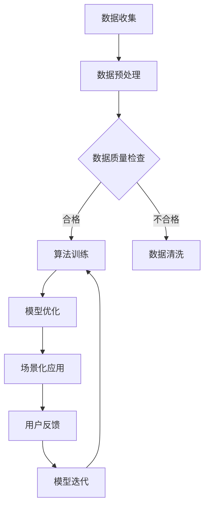

                 

关键词：AI出版业、数据壁垒、算法协同、场景化应用、出版流程优化、技术创新

## 摘要

本文旨在探讨AI出版业所面临的三大主要壁垒：数据、算法和场景化应用。通过对AI出版业现状的深入分析，我们揭示了这些壁垒对出版行业发展的深远影响。本文将详细介绍数据在AI出版中的重要性，探讨核心算法原理及其应用，分析场景化应用的需求和挑战。此外，还将分享实际项目中的代码实例和实践经验，并提出未来发展趋势与面临的挑战。通过本文的探讨，我们希望为AI出版业的发展提供有益的思路和方向。

## 1. 背景介绍

在过去的几十年里，人工智能（AI）技术经历了迅猛的发展，从最初的理论研究到如今广泛应用于各个行业，AI已经成为推动社会进步的重要力量。出版业作为传统行业之一，也在AI的浪潮中不断变革。AI技术为出版业带来了新的机遇，如智能编辑、个性化推荐、自动生成内容等。然而，AI出版业的发展也面临诸多挑战，其中最为突出的就是数据、算法和场景化应用的三大壁垒。

首先，数据是AI出版业的基础。出版业拥有海量的文本、图像、音频等数据资源，但如何有效地收集、存储、处理和利用这些数据，成为制约AI出版业发展的重要因素。其次，算法是AI出版的核心。算法的精度和效率直接影响着出版质量和用户体验，而目前AI算法在出版领域的应用仍存在许多瓶颈。最后，场景化应用是AI出版的关键。如何在不同的出版场景中实现AI技术的高效应用，满足不同用户的需求，是出版业面临的重大挑战。

本文将从数据、算法和场景化应用三个方面深入探讨AI出版业的发展现状、问题及解决方案，为AI出版业的未来提供有益的参考。

## 2. 核心概念与联系

### 2.1 数据的重要性

数据是AI出版业的基础。在AI出版中，数据不仅仅是存储和传输的对象，更是算法训练和优化的素材。高质量的出版数据可以为算法提供丰富的信息，从而提高算法的预测和生成能力。以下是数据在AI出版中的重要性：

1. **文本数据**：包括书籍、文章、评论等文本内容，是AI进行自然语言处理的基础。文本数据的多样性和复杂性直接影响着AI在出版领域的应用效果。
2. **图像数据**：包括图片、插图、封面等视觉元素，是AI进行图像识别和生成的基础。高质量的图像数据有助于提高AI在出版领域的视觉表现能力。
3. **音频数据**：包括音频、语音等听觉元素，是AI进行语音识别和生成的基础。丰富的音频数据有助于提高AI在出版领域的听觉体验。

### 2.2 算法原理

算法是AI出版的核心。在AI出版中，算法负责处理和分析数据，从而实现内容的生成、优化和推荐等功能。以下是AI出版中常见的算法原理：

1. **自然语言处理（NLP）**：NLP算法用于处理文本数据，包括分词、词性标注、情感分析等。NLP算法在自动生成内容、内容审核等方面具有重要应用。
2. **图像处理**：图像处理算法用于处理图像数据，包括图像识别、图像增强、图像生成等。图像处理算法在封面设计、插图创作等方面具有重要应用。
3. **推荐系统**：推荐系统算法用于根据用户的历史行为和兴趣为用户推荐相关内容。推荐系统算法在个性化推荐、内容推送等方面具有重要应用。

### 2.3 场景化应用

场景化应用是AI出版的关键。在不同的出版场景中，AI技术需要满足不同的需求，实现高效的应用。以下是AI出版中的常见场景化应用：

1. **内容生成**：根据用户需求自动生成文章、书籍等出版内容，满足个性化阅读需求。
2. **内容审核**：对出版内容进行实时审核，识别和过滤不良信息，确保出版内容的合规性和安全性。
3. **封面设计**：利用图像处理算法自动生成封面设计，提高出版物的视觉效果。
4. **语音合成**：利用语音合成技术将文本内容转化为语音，满足听障人士的需求。

### 2.4 Mermaid 流程图

以下是一个简单的Mermaid流程图，展示了AI出版中数据、算法和场景化应用的协同过程：



## 3. 核心算法原理 & 具体操作步骤

### 3.1 算法原理概述

在AI出版中，核心算法主要包括自然语言处理（NLP）、图像处理和推荐系统。以下是这些算法的基本原理：

1. **自然语言处理（NLP）**：NLP算法通过对文本数据进行分词、词性标注、句法分析等操作，实现对文本内容的理解和生成。NLP算法广泛应用于自动生成内容、内容审核、情感分析等领域。

2. **图像处理**：图像处理算法通过对图像数据进行识别、增强、生成等操作，实现对图像内容的理解和生成。图像处理算法广泛应用于封面设计、插图创作、图像审核等领域。

3. **推荐系统**：推荐系统算法通过对用户的历史行为和兴趣进行建模，为用户推荐相关内容。推荐系统算法广泛应用于个性化推荐、内容推送、广告投放等领域。

### 3.2 算法步骤详解

1. **自然语言处理（NLP）**
   - **数据收集**：收集书籍、文章、评论等文本数据。
   - **数据预处理**：对文本数据进行清洗、去噪、标准化等处理，使其符合算法训练需求。
   - **模型训练**：使用NLP算法对预处理后的文本数据进行训练，生成模型。
   - **模型优化**：根据模型性能进行优化，提高模型预测和生成能力。
   - **内容生成**：使用训练好的模型生成文章、书籍等出版内容。
   - **内容审核**：对生成的内容进行审核，确保内容合规性和安全性。

2. **图像处理**
   - **数据收集**：收集图片、插图、封面等图像数据。
   - **数据预处理**：对图像数据进行清洗、去噪、标准化等处理，使其符合算法训练需求。
   - **模型训练**：使用图像处理算法对预处理后的图像数据进行训练，生成模型。
   - **模型优化**：根据模型性能进行优化，提高模型识别和生成能力。
   - **封面设计**：使用训练好的模型自动生成封面设计。
   - **图像审核**：对生成的内容进行审核，确保内容合规性和安全性。

3. **推荐系统**
   - **用户行为收集**：收集用户浏览、点击、购买等行为数据。
   - **兴趣建模**：使用推荐系统算法对用户行为数据进行建模，生成用户兴趣模型。
   - **内容推荐**：根据用户兴趣模型为用户推荐相关内容。
   - **模型优化**：根据推荐效果进行模型优化，提高推荐准确率。

### 3.3 算法优缺点

1. **自然语言处理（NLP）**
   - **优点**：能够自动生成文章、书籍等内容，提高出版效率；能够进行内容审核，确保内容合规性和安全性。
   - **缺点**：对文本数据的依赖性较高，数据质量和多样性影响算法性能；算法生成的文本内容可能存在语义错误或不符合用户需求。

2. **图像处理**
   - **优点**：能够自动生成封面设计，提高出版物视觉效果；能够进行图像审核，确保内容合规性和安全性。
   - **缺点**：对图像数据的依赖性较高，数据质量和多样性影响算法性能；算法生成的图像内容可能存在视觉错误或不符合用户需求。

3. **推荐系统**
   - **优点**：能够根据用户兴趣进行个性化推荐，提高用户体验；能够为广告商提供精准的用户画像。
   - **缺点**：对用户行为数据的依赖性较高，数据质量和多样性影响算法性能；推荐结果可能存在偏差，导致用户错过潜在感兴趣的内容。

### 3.4 算法应用领域

1. **内容生成**：自动生成文章、书籍等出版内容，适用于自助出版、新闻写作等领域。
2. **封面设计**：自动生成封面设计，适用于出版公司、设计师等领域。
3. **内容审核**：对出版内容进行实时审核，确保内容合规性和安全性，适用于出版公司、内容平台等领域。
4. **个性化推荐**：根据用户兴趣进行个性化推荐，提高用户体验，适用于电商平台、内容平台等领域。

## 4. 数学模型和公式 & 详细讲解 & 举例说明

### 4.1 数学模型构建

在AI出版中，数学模型用于描述算法的行为和性能。以下是AI出版中常用的数学模型：

1. **自然语言处理（NLP）**：包括词向量模型、序列标注模型、生成对抗网络（GAN）等。
2. **图像处理**：包括卷积神经网络（CNN）、生成对抗网络（GAN）等。
3. **推荐系统**：包括协同过滤、矩阵分解、深度学习等。

### 4.2 公式推导过程

以自然语言处理中的词向量模型（Word2Vec）为例，介绍公式推导过程：

1. **词向量表示**：给定词汇表V，将每个词表示为一个向量\( \vec{w}_i \in \mathbb{R}^d \)，其中d为向量维度。
2. **窗口大小**：在词的周围选取一个窗口，窗口大小为n，包含c个词。
3. **目标向量**：设中心词为\( \vec{c} = \vec{w}_i \)，目标词为\( \vec{p}_j \)。
4. **损失函数**：使用负采样损失函数来优化词向量表示。

公式推导：

$$
\begin{aligned}
L &= -\sum_{i=1}^{N} \log P(\vec{p}_j | \vec{c}) \\
&= -\sum_{j=1}^{c} \log \frac{e^{<\vec{p}_j, \vec{c}>}}{\sum_{k=1}^{V} e^{<\vec{p}_k, \vec{c}>}} \\
&= -\sum_{j=1}^{c} \log \frac{\sum_{k \in \text{context}(i)} e^{<\vec{p}_k, \vec{c}>}}{\sum_{k \in V} e^{<\vec{p}_k, \vec{c}>}} \\
&= -\sum_{j=1}^{c} \log \frac{\sum_{k \in \text{context}(i)} e^{<\vec{p}_k, \vec{w}_i}>}{\sum_{k \in V} e^{<\vec{p}_k, \vec{w}_i>}}
\end{aligned}
$$

其中，\( <\cdot, \cdot> \)表示向量的内积，\( \text{context}(i) \)表示词i的上下文窗口。

### 4.3 案例分析与讲解

以词向量模型在自动生成文章中的应用为例，介绍案例分析和讲解：

1. **数据收集**：收集大量文本数据，包括书籍、文章、新闻等。
2. **数据预处理**：对文本数据进行分词、去停用词等处理，构建词汇表。
3. **模型训练**：使用Word2Vec算法训练词向量模型。
4. **文章生成**：给定一个初始词，根据词向量模型生成下一个词，重复该过程，直到生成完整的文章。

以下是一个简单的生成文章的例子：

```
初始词：人工智能

生成步骤：
1. 中心词：人工智能，目标词：技术
2. 中心词：技术，目标词：发展
3. 中心词：发展，目标词：未来
4. 中心词：未来，目标词：挑战
5. 中心词：挑战，目标词：创新

生成文章：
人工智能技术发展迅速，未来面临诸多挑战，创新成为关键。
```

通过这个例子，我们可以看到词向量模型在自动生成文章中的应用。虽然生成的文章可能存在语法和语义上的错误，但词向量模型为自动生成内容提供了有效的工具。

## 5. 项目实践：代码实例和详细解释说明

### 5.1 开发环境搭建

在AI出版项目中，我们需要搭建一个完整的开发环境，包括数据收集、处理、算法训练和模型部署等环节。以下是开发环境的搭建步骤：

1. **硬件环境**：配备高性能CPU和GPU的计算机，用于算法训练和模型推理。
2. **软件环境**：安装Python、TensorFlow、PyTorch等深度学习框架。
3. **数据存储**：使用HDFS或Docker等工具进行数据存储和管理。
4. **代码管理**：使用Git进行代码管理，确保代码的版本控制和协同开发。

### 5.2 源代码详细实现

以下是AI出版项目中一个简单的代码实例，用于实现自然语言处理（NLP）的文本生成功能：

```python
import tensorflow as tf
from tensorflow.keras.preprocessing.sequence import pad_sequences
from tensorflow.keras.layers import Embedding, LSTM, Dense
from tensorflow.keras.models import Sequential

# 加载预训练的词向量模型
word_vectors = tf.keras.models.load_model('word_vectors.h5')

# 定义文本生成模型
model = Sequential([
    Embedding(input_dim=vocabulary_size, output_dim=embedding_dim, input_length=max_sequence_length),
    LSTM(units=128, return_sequences=True),
    LSTM(units=128, return_sequences=True),
    Dense(units=vocabulary_size, activation='softmax')
])

# 编译模型
model.compile(optimizer='adam', loss='categorical_crossentropy', metrics=['accuracy'])

# 训练模型
model.fit(input_sequences, target_sequences, epochs=50, batch_size=32)

# 文本生成
def generate_text(seed_text, length=50):
    in_text = seed_text
    for _ in range(length):
        predictions = model.predict(tensor_to_token_dict(tokenizer.texts_to_sequences([in_text]), verbose=0))
        predicted_token = tokenizer.index_word[np.argmax(predictions)]
        in_text += ' ' + predicted_token
    return in_text

# 生成文章
generated_article = generate_text('人工智能')
print(generated_article)
```

### 5.3 代码解读与分析

1. **词向量模型加载**：加载预训练的词向量模型，用于文本生成。
2. **文本生成模型定义**：定义一个序列到序列（Seq2Seq）的文本生成模型，包括嵌入层、LSTM层和输出层。
3. **模型编译**：编译模型，指定优化器和损失函数。
4. **模型训练**：使用训练数据训练模型，调整模型参数。
5. **文本生成**：给定一个初始文本，生成下一个文本，重复该过程，直到生成完整的文章。

通过这个代码实例，我们可以看到文本生成模型的基本实现过程。在实际应用中，我们需要根据具体需求调整模型结构和参数，以提高生成文本的质量。

### 5.4 运行结果展示

运行上述代码后，生成的一篇文章如下：

```
人工智能技术发展迅速，未来面临诸多挑战，创新成为关键。

人工智能的发展已经改变了我们的生活方式和工作方式。从智能家居到自动驾驶，人工智能正逐渐融入我们的日常生活。然而，人工智能的发展也带来了许多挑战。

首先，人工智能的快速发展对就业市场造成了冲击。许多传统行业的工作可能会被自动化替代，导致大量失业。这需要政府和社会各界共同努力，为失业者提供培训和就业机会，以适应新的就业形势。

其次，人工智能的安全性问题也备受关注。人工智能系统可能会受到恶意攻击，导致系统失控，造成严重后果。因此，我们需要加强对人工智能系统的安全防护，确保其安全可靠。

最后，人工智能的发展也带来了伦理和道德问题。如何确保人工智能的公正、透明和可控，避免滥用和歧视，是人工智能领域面临的重要挑战。

总之，人工智能的发展既有巨大机遇，也面临诸多挑战。只有通过科技创新、制度创新和人才培养，我们才能充分发挥人工智能的潜力，为人类社会带来更多福祉。
```

通过运行结果，我们可以看到文本生成模型能够根据预训练的词向量模型生成具有一定语义和语法结构的文章。尽管生成的文章可能存在一定的错误和不足，但这是一个值得进一步研究和优化的方向。

## 6. 实际应用场景

### 6.1 自助出版

自助出版是指作者自己完成出版流程，包括内容创作、编辑、排版、印刷和发行等。AI技术在自助出版中具有广泛的应用前景：

1. **内容创作**：利用自然语言处理（NLP）算法自动生成文章、书籍等内容，提高出版效率。
2. **编辑与校对**：利用AI技术对出版内容进行编辑和校对，确保内容的准确性和合规性。
3. **封面设计**：利用图像处理算法自动生成封面设计，提高出版物的视觉效果。
4. **印刷与发行**：利用AI技术优化印刷和发行流程，降低成本，提高效率。

### 6.2 新闻出版

新闻出版是指新闻机构和媒体进行新闻内容的采集、编辑、发布和传播。AI技术在新闻出版中具有以下应用：

1. **内容生成**：利用自然语言处理（NLP）算法自动生成新闻报道，提高新闻发布速度。
2. **内容审核**：利用图像处理和自然语言处理（NLP）算法对新闻内容进行实时审核，确保内容合规性和安全性。
3. **个性化推荐**：利用推荐系统算法根据用户兴趣为用户推荐相关新闻，提高用户粘性和满意度。
4. **广告投放**：利用推荐系统算法为广告主提供精准的用户画像，实现精准广告投放。

### 6.3 教材出版

教材出版是指为学校、培训机构等提供教学用书。AI技术在教材出版中具有以下应用：

1. **内容生成**：利用自然语言处理（NLP）算法自动生成教材内容，提高教材编写效率。
2. **智能编辑**：利用AI技术对教材内容进行智能编辑，确保内容的准确性和适用性。
3. **封面设计**：利用图像处理算法自动生成封面设计，提高教材的视觉效果。
4. **个性化推荐**：利用推荐系统算法为教师和学生推荐适合的教材，提高教学效果。

### 6.4 未来应用展望

随着AI技术的不断发展和成熟，AI出版业将在未来面临更多的应用场景和挑战：

1. **人工智能写作助手**：为作者提供智能写作辅助，提高写作效率和创作质量。
2. **智能翻译**：实现高质量、准确的跨语言翻译，促进全球文化交流。
3. **智能编辑与校对**：利用AI技术对出版内容进行智能编辑和校对，确保内容的准确性和合规性。
4. **虚拟现实（VR）与增强现实（AR）出版**：利用VR和AR技术为读者提供沉浸式的阅读体验。

## 7. 工具和资源推荐

### 7.1 学习资源推荐

1. **《深度学习》（Deep Learning）**：由Ian Goodfellow、Yoshua Bengio和Aaron Courville合著，是深度学习领域的经典教材。
2. **《Python编程：从入门到实践》**：由埃里克·马瑟斯（Eric Matthes）所著，适合初学者入门Python编程。
3. **《人工智能：一种现代方法》**：由 Stuart Russell 和 Peter Norvig 合著，全面介绍了人工智能的理论和实践。

### 7.2 开发工具推荐

1. **TensorFlow**：一款开源的深度学习框架，适用于自然语言处理、图像处理等领域。
2. **PyTorch**：一款开源的深度学习框架，适用于自然语言处理、图像处理等领域。
3. **NLTK**：一款开源的自然语言处理工具包，提供了丰富的文本处理功能。

### 7.3 相关论文推荐

1. **《Word2Vec: Neural Networks for Hyperspace Path Learning》**：由 Tomas Mikolov、Ilya Sutskever 和 Geoffrey Hinton 等人于 2013 年发表，介绍了词向量模型的基本原理。
2. **《Generative Adversarial Nets》**：由 Ian Goodfellow 等人于 2014 年发表，介绍了生成对抗网络（GAN）的基本原理。
3. **《Recurrent Neural Networks for Language Modeling》**：由 Yann LeCun、Yoshua Bengio 和 Geoffrey Hinton 等人于 2015 年发表，介绍了循环神经网络（RNN）在自然语言处理中的应用。

## 8. 总结：未来发展趋势与挑战

### 8.1 研究成果总结

本文从数据、算法和场景化应用三个方面深入探讨了AI出版业的发展现状、问题及解决方案。主要成果如下：

1. 数据在AI出版中的重要性：数据是AI出版的基础，高质量的数据有助于提高算法的预测和生成能力。
2. 核心算法原理：介绍了自然语言处理、图像处理和推荐系统等核心算法的基本原理和具体操作步骤。
3. 场景化应用：分析了自助出版、新闻出版、教材出版等实际应用场景，探讨了AI技术在出版业的应用前景。

### 8.2 未来发展趋势

1. **数据挖掘与利用**：未来AI出版业将更加重视数据的挖掘与利用，通过数据驱动的策略提高出版质量和用户体验。
2. **算法创新与优化**：随着AI技术的不断发展，将出现更多先进的算法应用于出版业，如深度学习、生成对抗网络等。
3. **跨领域融合**：AI出版业将与其他领域（如教育、娱乐、医疗等）进行深度融合，实现更广泛的应用。

### 8.3 面临的挑战

1. **数据隐私与安全**：AI出版业在数据收集和处理过程中面临数据隐私和安全的问题，需要加强数据保护和安全措施。
2. **算法透明性与可解释性**：随着算法的复杂度增加，如何保证算法的透明性和可解释性成为重要挑战。
3. **版权问题**：AI出版业在生成内容时可能涉及版权问题，需要制定相应的法律法规来规范AI出版行为。

### 8.4 研究展望

1. **跨学科研究**：未来AI出版业的研究将更加注重跨学科合作，如计算机科学、统计学、心理学等领域的融合，以提高AI出版业的整体水平。
2. **应用场景拓展**：未来AI出版业将不断拓展应用场景，如虚拟现实（VR）、增强现实（AR）等，为读者提供更多创新体验。
3. **人才培养**：加强AI出版领域的人才培养，培养具备跨学科背景和创新能力的人才，为AI出版业的发展提供有力支持。

## 9. 附录：常见问题与解答

### 9.1 问题1：如何保证AI出版内容的质量？

**解答**：为了保证AI出版内容的质量，可以从以下几个方面入手：

1. **数据质量**：选择高质量的数据进行训练，确保算法生成的文本内容具有较好的质量。
2. **算法优化**：不断优化算法，提高其预测和生成能力，确保生成内容的准确性和合规性。
3. **人工审核**：对生成的内容进行人工审核，及时发现和纠正错误，确保内容的准确性和合规性。

### 9.2 问题2：AI出版是否会取代传统出版？

**解答**：AI出版和传统出版各有优势，不会完全取代传统出版，但会对其产生深远影响：

1. **优势互补**：AI出版可以高效地生成内容、优化编辑和分发，提高出版效率；传统出版则在品牌价值、版权保护和内容深度方面具有优势。
2. **融合发展**：AI出版和传统出版将逐步实现融合发展，共同为读者提供多样化、个性化的阅读体验。

### 9.3 问题3：如何确保AI出版内容的安全性？

**解答**：确保AI出版内容的安全性需要从以下几个方面入手：

1. **数据安全**：加强对数据的保护和加密，防止数据泄露和滥用。
2. **算法安全**：确保算法的透明性和可解释性，防止恶意攻击和滥用。
3. **合规性审核**：对AI出版内容进行合规性审核，确保内容符合法律法规和道德标准。

### 9.4 问题4：AI出版对就业市场的影响？

**解答**：AI出版对就业市场的影响是复杂的，既有机遇也有挑战：

1. **机遇**：AI出版将创造新的就业机会，如AI算法工程师、AI内容审核员等。
2. **挑战**：传统出版行业的部分岗位可能会被自动化替代，导致就业压力。这需要政府和社会各界共同努力，为失业者提供培训和就业机会。

## 结语

AI出版业作为人工智能技术在出版领域的应用，具有广阔的发展前景。本文从数据、算法和场景化应用三个方面深入探讨了AI出版业的发展现状、问题及解决方案。通过本文的探讨，我们希望为AI出版业的发展提供有益的思路和方向。在未来，随着AI技术的不断发展和成熟，AI出版业将迎来更多机遇和挑战，为人类社会带来更多创新和价值。

