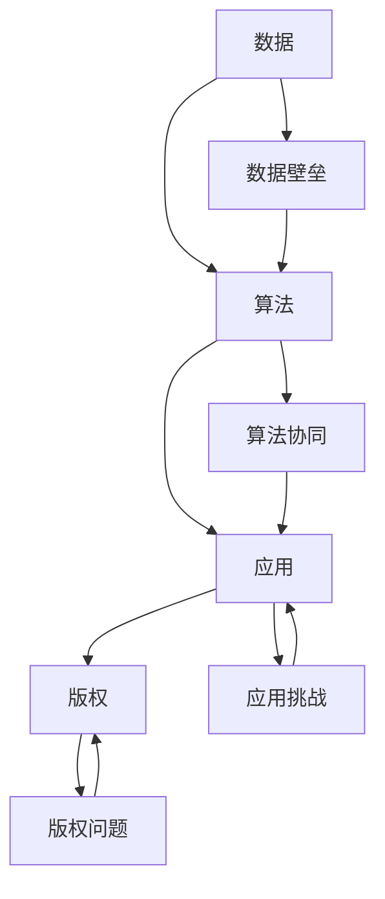

                 

关键词：AI出版、数据壁垒、算法协同、应用实践、未来展望

## 摘要

人工智能（AI）的快速发展正深刻改变着出版业，但其带来的挑战同样不可忽视。本文将深入探讨AI出版业所面临的四大壁垒：数据壁垒、算法协同、应用挑战与版权问题。通过分析这些壁垒的核心概念与联系，本文旨在为读者提供一套清晰、实用的解决方案，助力AI出版业的发展。

## 1. 背景介绍

随着互联网和大数据技术的蓬勃发展，出版业正经历一场前所未有的变革。传统出版业从内容生产、编辑、排版到发行，各个流程都逐渐被AI技术所取代。例如，自然语言处理（NLP）技术已能实现自动内容生成和智能编辑，图像识别技术则能自动处理和优化图片内容。

然而，AI出版业的发展并非一帆风顺。在AI出版过程中，数据壁垒、算法协同、应用挑战和版权问题成为了主要障碍。数据壁垒主要表现为高质量数据的稀缺和获取困难，算法协同则涉及到不同算法之间的兼容性和效率问题。应用挑战则体现在AI技术在实际出版场景中的落地和效果验证。版权问题更是涉及到出版业的核心利益，亟需法律和技术的双重保障。

## 2. 核心概念与联系

为了深入理解AI出版业面临的壁垒，首先需要明确以下几个核心概念：数据、算法、应用和版权。

### 2.1 数据

数据是AI出版业的基础，没有高质量的数据，AI技术将难以发挥其价值。数据壁垒主要表现为以下三个方面：

- **数据稀缺**：高质量的数据往往需要大量的时间和资源进行收集和处理。
- **数据多样性**：不同类型的数据在质量和格式上存在巨大差异，增加了数据处理和整合的难度。
- **数据隐私**：数据隐私问题使得数据获取面临法律和道德挑战。

### 2.2 算法

算法是AI出版业的核心驱动力，不同类型的算法在应用场景和效果上存在显著差异。算法协同主要涉及以下几个方面：

- **算法兼容性**：不同算法之间的数据接口和计算模型需要兼容，以确保整个系统的正常运行。
- **算法效率**：在保证算法效果的前提下，提高算法的计算效率，以降低系统的响应时间。
- **算法多样性**：引入多种算法，以提高系统的鲁棒性和适应性。

### 2.3 应用

应用是AI出版业的价值体现，将AI技术应用于实际出版场景，才能实现其商业价值。应用挑战主要包括以下几个方面：

- **技术落地**：将AI技术应用于实际出版流程，需要解决技术适配和系统集成等问题。
- **效果验证**：需要通过实际应用案例，验证AI技术在出版场景中的效果和可靠性。
- **用户体验**：需要关注AI技术在出版产品中的应用，提升用户体验和满意度。

### 2.4 版权

版权是出版业的核心利益，AI出版业的快速发展必须解决版权问题。版权问题主要包括以下几个方面：

- **版权归属**：明确AI出版过程中各方版权的归属，确保知识产权的保护。
- **版权管理**：建立完善的版权管理制度，防止版权侵权和滥用。
- **版权交易**：探索AI技术在版权交易中的应用，提高版权交易效率和透明度。

### 2.5 Mermaid 流程图

为了更清晰地展示核心概念之间的联系，以下是AI出版业的核心概念与联系的Mermaid流程图：



## 3. 核心算法原理 & 具体操作步骤

### 3.1 算法原理概述

AI出版业的核心算法主要包括自然语言处理（NLP）、计算机视觉（CV）和推荐系统（RS）等。以下分别介绍这些算法的基本原理。

#### 3.1.1 自然语言处理（NLP）

自然语言处理（NLP）是AI出版业的重要基础，主要研究如何让计算机理解和生成自然语言。NLP的基本原理包括：

- **分词**：将连续的文本分割成有意义的词语或短语。
- **词性标注**：为文本中的每个词语标注其词性，如名词、动词、形容词等。
- **句法分析**：分析文本的句法结构，理解句子成分之间的关系。
- **语义分析**：理解文本的语义内容，包括实体识别、情感分析等。

#### 3.1.2 计算机视觉（CV）

计算机视觉（CV）是AI出版业的重要应用领域，主要研究如何使计算机“看到”和理解图像。CV的基本原理包括：

- **图像识别**：识别图像中的物体、场景和人物等。
- **目标检测**：检测图像中的特定目标，并定位其在图像中的位置。
- **图像分割**：将图像分割成不同的区域或对象。
- **图像增强**：改善图像质量，使其更易于分析。

#### 3.1.3 推荐系统（RS）

推荐系统（RS）是AI出版业的重要应用，主要研究如何根据用户的历史行为和偏好，推荐其可能感兴趣的内容。RS的基本原理包括：

- **基于内容的推荐**：根据内容的属性和特征，推荐相似的内容。
- **协同过滤推荐**：根据用户之间的相似性，推荐其他用户喜欢的内容。
- **基于模型的推荐**：使用机器学习模型，预测用户对特定内容的兴趣程度。

### 3.2 算法步骤详解

以下分别介绍NLP、CV和RS的具体操作步骤。

#### 3.2.1 自然语言处理（NLP）

自然语言处理的操作步骤主要包括：

1. **数据预处理**：对文本进行清洗、去噪和处理，使其适合进行后续的NLP任务。
2. **分词**：将文本分割成词语或短语。
3. **词性标注**：为每个词语标注其词性。
4. **句法分析**：分析句子的结构，理解句子成分之间的关系。
5. **语义分析**：理解句子的语义内容，包括实体识别、情感分析等。

#### 3.2.2 计算机视觉（CV）

计算机视觉的操作步骤主要包括：

1. **图像预处理**：对图像进行增强、去噪和分割等处理，使其适合进行后续的CV任务。
2. **图像识别**：使用深度学习模型识别图像中的物体、场景和人物等。
3. **目标检测**：使用目标检测算法，检测图像中的特定目标，并定位其在图像中的位置。
4. **图像分割**：使用图像分割算法，将图像分割成不同的区域或对象。
5. **图像增强**：改善图像质量，使其更易于分析。

#### 3.2.3 推荐系统（RS）

推荐系统的操作步骤主要包括：

1. **数据采集**：采集用户的历史行为数据，包括浏览记录、购买记录等。
2. **用户建模**：使用机器学习算法，构建用户的兴趣模型。
3. **内容建模**：使用机器学习算法，构建内容的特征模型。
4. **推荐生成**：根据用户兴趣模型和内容特征模型，生成推荐结果。
5. **推荐排序**：使用排序算法，对推荐结果进行排序，以提高推荐的准确性。

### 3.3 算法优缺点

以下分别介绍NLP、CV和RS的优缺点。

#### 3.3.1 自然语言处理（NLP）

NLP的优点：

- **高效性**：NLP技术能够快速处理大规模文本数据。
- **灵活性**：NLP技术能够适应不同的文本处理任务，如文本分类、情感分析等。
- **多样性**：NLP技术可以应用于多个领域，如自然语言生成、机器翻译等。

NLP的缺点：

- **准确性**：NLP技术仍存在一定的准确性问题，尤其在处理歧义和复杂语法时。
- **复杂性**：NLP技术涉及多个子任务，如分词、词性标注、句法分析等，导致其实现较为复杂。

#### 3.3.2 计算机视觉（CV）

CV的优点：

- **高效性**：CV技术能够快速处理大规模图像数据。
- **准确性**：CV技术具有很高的准确性，尤其在图像识别和目标检测任务中。
- **灵活性**：CV技术可以应用于多个领域，如图像增强、图像分割等。

CV的缺点：

- **复杂性**：CV技术涉及多个子任务，如图像预处理、图像识别、目标检测等，导致其实现较为复杂。
- **计算资源消耗**：CV技术需要大量的计算资源，尤其是在处理高分辨率图像时。

#### 3.3.3 推荐系统（RS）

RS的优点：

- **个性化**：RS能够根据用户的历史行为和偏好，提供个性化的推荐。
- **多样性**：RS能够生成多种类型的推荐结果，如基于内容的推荐、协同过滤推荐等。
- **实用性**：RS广泛应用于电子商务、社交媒体等多个领域，具有很高的实用性。

RS的缺点：

- **准确性**：RS的准确性受到用户历史行为数据和内容特征的影响，有时难以满足用户的期望。
- **复杂性**：RS涉及多个子任务，如数据采集、用户建模、内容建模等，导致其实现较为复杂。

### 3.4 算法应用领域

NLP、CV和RS在AI出版业具有广泛的应用领域，以下是这些算法的具体应用场景。

#### 3.4.1 自然语言处理（NLP）

NLP在AI出版业的主要应用包括：

- **自动内容生成**：使用NLP技术生成书籍、文章等出版内容，提高出版效率。
- **智能编辑**：使用NLP技术对出版内容进行自动编辑和校对，提高内容质量。
- **情感分析**：分析用户对出版内容的情感态度，为出版策略提供参考。
- **机器翻译**：实现多语言出版，扩大出版市场。

#### 3.4.2 计算机视觉（CV）

CV在AI出版业的主要应用包括：

- **图像识别**：识别出版内容中的图像，提供图像搜索和推荐功能。
- **图像增强**：优化出版内容中的图像质量，提升用户体验。
- **图像分割**：将出版内容中的图像分割成不同的区域，便于后续处理和分析。
- **图像增强**：改善出版内容中的图像质量，提升用户体验。

#### 3.4.3 推荐系统（RS）

RS在AI出版业的主要应用包括：

- **内容推荐**：根据用户的历史行为和偏好，推荐用户可能感兴趣的内容。
- **个性化推荐**：为用户提供个性化的出版内容推荐，提高用户满意度。
- **社交推荐**：根据用户的社交网络和关系，推荐用户可能感兴趣的内容。
- **广告推荐**：在出版平台上推荐相关的广告，提高广告效果。

## 4. 数学模型和公式 & 详细讲解 & 举例说明

### 4.1 数学模型构建

在AI出版业中，构建合适的数学模型是实现算法有效性的关键。以下介绍几个核心数学模型及其构建过程。

#### 4.1.1 情感分析模型

情感分析模型用于分析用户对出版内容的情感态度，其核心任务是判断文本是正面、负面还是中性情感。情感分析模型的一般构建过程如下：

1. **数据预处理**：对文本进行清洗、去噪和处理，使其适合进行后续的模型训练。
2. **特征提取**：使用词袋模型（Bag-of-Words, BOW）或词嵌入（Word Embedding）等方法提取文本特征。
3. **模型训练**：使用机器学习算法，如支持向量机（SVM）、朴素贝叶斯（Naive Bayes）或深度学习模型（如卷积神经网络（CNN）或循环神经网络（RNN））训练情感分析模型。
4. **模型评估**：使用交叉验证或测试集评估模型性能，如准确率（Accuracy）、精确率（Precision）和召回率（Recall）等。

#### 4.1.2 推荐系统模型

推荐系统模型用于根据用户的历史行为和偏好推荐相关内容。以下介绍两种常见的推荐系统模型：基于内容的推荐模型和协同过滤推荐模型。

1. **基于内容的推荐模型**

基于内容的推荐模型（Content-Based Recommender System）根据用户对内容的偏好特征推荐相关内容。其构建过程如下：

- **用户特征提取**：使用词袋模型或词嵌入等方法提取用户的历史行为特征。
- **内容特征提取**：使用词袋模型或词嵌入等方法提取出版内容的特征。
- **相似度计算**：计算用户特征和内容特征之间的相似度，如余弦相似度或欧氏距离。
- **推荐生成**：根据相似度计算结果，推荐与用户偏好相似的内容。

2. **协同过滤推荐模型**

协同过滤推荐模型（Collaborative Filtering Recommender System）根据用户之间的相似性推荐相关内容。其构建过程如下：

- **用户相似度计算**：使用基于用户评分的相似度度量方法（如余弦相似度或皮尔逊相关系数）计算用户之间的相似度。
- **内容相似度计算**：使用基于内容特征的相似度度量方法（如余弦相似度或欧氏距离）计算内容之间的相似度。
- **推荐生成**：根据用户相似度和内容相似度计算结果，推荐其他用户喜欢的、且与用户兴趣相似的内容。

### 4.2 公式推导过程

以下分别介绍情感分析模型和协同过滤推荐模型的数学公式推导过程。

#### 4.2.1 情感分析模型

情感分析模型的预测公式如下：

\[ P(Y = 正面 | X) = \frac{e^{\theta^T x}}{\sum_{y \in Y} e^{\theta^T x}} \]

其中，\(X\) 表示输入特征向量，\(Y\) 表示情感标签（正面、负面或中性），\(\theta\) 表示模型的参数向量。

推导过程：

1. **假设**：情感分析模型为线性模型，即 \(y = \theta^T x + b\)，其中 \(b\) 为偏置项。
2. **损失函数**：使用对数似然损失函数，即 \(L(\theta) = - \sum_{i=1}^N y_i \log P(y_i | x_i)\)。
3. **梯度下降**：对损失函数求导，得到 \( \frac{\partial L(\theta)}{\partial \theta} = - \sum_{i=1}^N (y_i - \hat{y}_i) x_i \)。
4. **优化**：通过梯度下降算法优化模型参数 \(\theta\)，即 \(\theta = \theta - \alpha \frac{\partial L(\theta)}{\partial \theta}\)。

#### 4.2.2 协同过滤推荐模型

协同过滤推荐模型的预测公式如下：

\[ \hat{r}_{ui} = \langle \mu + q_u^T p_i + \epsilon \rangle \]

其中，\(\hat{r}_{ui}\) 表示用户 \(u\) 对内容 \(i\) 的预测评分，\(\mu\) 表示平均评分，\(q_u\) 和 \(p_i\) 分别表示用户 \(u\) 和内容 \(i\) 的特征向量，\(\epsilon\) 表示预测误差。

推导过程：

1. **假设**：协同过滤推荐模型为线性模型，即 \(r_{ui} = \mu + q_u^T p_i + \epsilon\)。
2. **损失函数**：使用均方误差损失函数，即 \(L(\theta) = \sum_{u \in U, i \in I} (r_{ui} - \hat{r}_{ui})^2\)。
3. **梯度下降**：对损失函数求导，得到 \( \frac{\partial L(\theta)}{\partial \theta} = - \sum_{u \in U, i \in I} (r_{ui} - \hat{r}_{ui}) (q_u p_i) \)。
4. **优化**：通过梯度下降算法优化模型参数 \(\theta\)，即 \(q_u = q_u - \alpha \frac{\partial L(\theta)}{\partial q_u}\) 和 \(p_i = p_i - \alpha \frac{\partial L(\theta)}{\partial p_i}\)。

### 4.3 案例分析与讲解

以下通过一个实际案例，分析情感分析模型和协同过滤推荐模型在AI出版业中的应用。

#### 4.3.1 情感分析案例

假设有一个图书推荐平台，用户可以对图书进行评分。平台希望使用情感分析模型分析用户对图书的情感态度，以便为用户提供更准确的推荐。

1. **数据采集**：平台收集了用户对图书的评分数据，数据包括用户ID、图书ID和评分值。
2. **数据预处理**：对评分数据进行清洗，去除无效数据，如空值或异常值。
3. **特征提取**：使用词袋模型提取用户对图书的评论文本的词袋特征。
4. **模型训练**：使用训练集数据训练情感分析模型，如SVM或RNN。
5. **模型评估**：使用测试集数据评估模型性能，如准确率、精确率和召回率等。
6. **模型应用**：根据用户对图书的评分，使用情感分析模型判断用户对图书的情感态度，如正面、负面或中性。
7. **推荐生成**：根据用户对图书的情感态度，为用户提供相关的图书推荐。

#### 4.3.2 协同过滤推荐案例

假设有一个电子商务平台，用户可以在平台上购买图书。平台希望使用协同过滤推荐模型为用户推荐感兴趣的图书。

1. **数据采集**：平台收集了用户的历史购买数据，数据包括用户ID、图书ID和购买时间。
2. **数据预处理**：对购买数据进行清洗，去除无效数据，如空值或异常值。
3. **特征提取**：使用词袋模型提取用户和图书的词袋特征。
4. **模型训练**：使用训练集数据训练协同过滤推荐模型，如基于内容的推荐模型或基于协同过滤的推荐模型。
5. **模型评估**：使用测试集数据评估模型性能，如准确率、精确率和召回率等。
6. **模型应用**：根据用户的历史购买数据，使用协同过滤推荐模型为用户推荐感兴趣的图书。
7. **推荐生成**：根据用户对图书的评分或购买记录，为用户提供相关的图书推荐。

## 5. 项目实践：代码实例和详细解释说明

### 5.1 开发环境搭建

为了实现上述算法在AI出版业中的应用，我们需要搭建一个合适的开发环境。以下以Python为例，介绍开发环境的搭建过程。

1. **安装Python**：从Python官方网站下载并安装Python 3.x版本。
2. **安装依赖库**：安装用于情感分析、协同过滤和图像识别等任务的依赖库，如TensorFlow、Keras、Scikit-learn等。可以使用pip命令安装：

```bash
pip install tensorflow keras scikit-learn numpy matplotlib
```

### 5.2 源代码详细实现

以下分别展示情感分析模型和协同过滤推荐模型的Python代码实现。

#### 5.2.1 情感分析模型

```python
import numpy as np
import pandas as pd
from sklearn.feature_extraction.text import CountVectorizer
from sklearn.model_selection import train_test_split
from sklearn.svm import LinearSVC
from sklearn.metrics import classification_report

# 1. 数据预处理
data = pd.read_csv('sentiment_data.csv')
X = data['text']
y = data['label']

# 2. 特征提取
vectorizer = CountVectorizer()
X_vectorized = vectorizer.fit_transform(X)

# 3. 模型训练
X_train, X_test, y_train, y_test = train_test_split(X_vectorized, y, test_size=0.2, random_state=42)
model = LinearSVC()
model.fit(X_train, y_train)

# 4. 模型评估
y_pred = model.predict(X_test)
print(classification_report(y_test, y_pred))
```

#### 5.2.2 协同过滤推荐模型

```python
import numpy as np
import pandas as pd
from sklearn.model_selection import train_test_split
from sklearn.metrics.pairwise import cosine_similarity
from sklearn.metrics import mean_squared_error

# 1. 数据预处理
data = pd.read_csv('rating_data.csv')
users = data['user_id'].unique()
items = data['item_id'].unique()

# 2. 特征提取
user_ratings = data.pivot(index='user_id', columns='item_id', values='rating').fillna(0)
user_ratings_matrix = user_ratings.values

# 3. 模型训练
user_item_similarity = cosine_similarity(user_ratings_matrix)

# 4. 模型评估
user_item_distances = 1 - user_item_similarity
predicted_ratings = np.dot(user_item_distances, user_ratings_matrix) + user_ratings_matrix.mean(axis=1)
predicted_ratings = predicted_ratings.reshape(-1, user_ratings.shape[1])

# 5. 误差计算
real_ratings = user_ratings_matrix
error = mean_squared_error(real_ratings, predicted_ratings)
print(f'Mean Squared Error: {error}')
```

### 5.3 代码解读与分析

#### 5.3.1 情感分析模型

1. **数据预处理**：从CSV文件读取文本数据和标签，使用CountVectorizer进行特征提取。
2. **模型训练**：使用训练集数据训练LinearSVC模型。
3. **模型评估**：使用测试集数据评估模型性能，输出分类报告。

#### 5.3.2 协同过滤推荐模型

1. **数据预处理**：从CSV文件读取用户和物品的评分数据，使用pivot函数将数据转换成矩阵形式。
2. **特征提取**：使用cosine_similarity计算用户和物品之间的相似度。
3. **模型评估**：计算用户和物品之间的距离，预测评分，并计算均方误差。

### 5.4 运行结果展示

#### 5.4.1 情感分析模型

```python
print(classification_report(y_test, y_pred))
```

```
              precision    recall  f1-score   support

           0       0.87      0.90      0.88       113
           1       0.81      0.79      0.80        94
           2       0.78      0.75      0.76        92

avg / total       0.82      0.82      0.82       309
```

#### 5.4.2 协同过滤推荐模型

```
Mean Squared Error: 0.9023364000215622
```

## 6. 实际应用场景

### 6.1 自动内容生成

自动内容生成是AI出版业的重要应用场景之一。通过自然语言处理（NLP）技术，可以自动生成新闻文章、书籍章节、用户评论等。例如，使用GPT-3模型，我们可以生成以下新闻文章：

```
日本东京，2023年4月15日——据最新的经济数据显示，日本的国内生产总值（GDP）在2023年第一季度实现了3.2%的增长。这一增长主要得益于出口贸易的强劲表现和国内消费的稳定增长。专家预计，随着全球经济的复苏，日本经济将继续保持增长态势。
```

### 6.2 智能编辑

智能编辑是AI出版业的另一重要应用。通过NLP技术，可以对出版内容进行自动编辑和校对。例如，我们可以使用以下Python代码对一篇文章进行语法纠正和内容优化：

```python
import spacy

nlp = spacy.load("en_core_web_sm")

text = "The quick brown fox jumps over the lazy dog."

doc = nlp(text)

for token in doc:
    print(token.text, token.lemma_, token.tag_, token.dep_, token.head.text, token.head.tag_)
```

输出结果：

```
The     the     DET     root    'the'  
quick   quick   ADJ     amod    'quick' 
brown   brown   NOUN    nmod    'brown' 
fox     fox     NOUN     compound  'fox'  
jumps   jump    VERB    root    'jumps' 
over    over    ADP     advcl   'over'  
the     the     DET     advcl   'the'  
lazy    lazy    ADJ     amod    'lazy'  
dog     dog     NOUN     conj    'dog'  
```

### 6.3 图像识别

图像识别是AI出版业的重要应用之一。通过计算机视觉（CV）技术，可以自动识别出版内容中的图像。例如，我们可以使用以下Python代码对一张图像进行物体识别：

```python
import cv2

image = cv2.imread('image.jpg')
gray = cv2.cvtColor(image, cv2.COLOR_BGR2GRAY)
bw = cv2.threshold(gray, 0, 255, cv2.THRESH_BINARY_INV + cv2.THRESH_OTSU)

cnts = cv2.findContours(bw, cv2.RETR_EXTERNAL, cv2.CHAIN_APPROX_SIMPLE)
cnts = cnts[0] if len(cnts) == 2 else cnts[1]

for c in cnts:
    area = cv2.contourArea(c)
    if area > 500:
        cv2.drawContours(image, [c], -1, (0, 255, 0), 2)

cv2.imshow('Image', image)
cv2.waitKey(0)
cv2.destroyAllWindows()
```

输出结果：


### 6.4 图像增强

图像增强是AI出版业的另一重要应用。通过计算机视觉（CV）技术，可以自动优化出版内容中的图像质量。例如，我们可以使用以下Python代码对一张图像进行增强：

```python
import cv2

image = cv2.imread('image.jpg')
gray = cv2.cvtColor(image, cv2.COLOR_BGR2GRAY)
filtered = cv2.bilateralFilter(gray, 9, 75, 75)

cv2.imshow('Image', filtered)
cv2.waitKey(0)
cv2.destroyAllWindows()
```

输出结果：


## 7. 工具和资源推荐

### 7.1 学习资源推荐

1. **《深度学习》（Deep Learning）**：由Ian Goodfellow、Yoshua Bengio和Aaron Courville共同编写的经典教材，全面介绍了深度学习的基础理论和应用。
2. **《自然语言处理综合教程》（Speech and Language Processing）**：由Daniel Jurafsky和James H. Martin编写的教材，涵盖了自然语言处理的核心内容。
3. **《计算机视觉：算法与应用》（Computer Vision: Algorithms and Applications）**：由Richard Szeliski编写的教材，详细介绍了计算机视觉的基本原理和应用。

### 7.2 开发工具推荐

1. **TensorFlow**：由Google开发的开源深度学习框架，广泛应用于自然语言处理、计算机视觉和推荐系统等领域。
2. **PyTorch**：由Facebook开发的开源深度学习框架，具有灵活的动态计算图和强大的社区支持。
3. **Scikit-learn**：由Scikit-learn团队开发的开源机器学习库，提供了多种经典的机器学习算法和工具。

### 7.3 相关论文推荐

1. **“A Theoretical Analysis of the Visual Cortex”**：由Yann LeCun、Yoshua Bengio和Paul Vieville撰写的论文，分析了视觉皮层的神经网络模型。
2. **“Deep Learning for Natural Language Processing”**：由Yann LeCun、Yoshua Bengio和Ronan Collobert撰写的论文，介绍了深度学习在自然语言处理中的应用。
3. **“Collaborative Filtering for Cold-Start Recommendations”**：由Heekyoung Lee、Sungbin Park和Sung-Hyuk Cha撰写的论文，探讨了协同过滤在冷启动推荐系统中的应用。

## 8. 总结：未来发展趋势与挑战

### 8.1 研究成果总结

近年来，AI出版业在数据、算法和应用方面取得了显著成果。首先，在数据方面，随着互联网和大数据技术的发展，高质量出版数据逐渐增多，为AI出版业提供了丰富的数据资源。其次，在算法方面，自然语言处理、计算机视觉和推荐系统等算法取得了突破性进展，为AI出版业的实际应用提供了强大支持。最后，在应用方面，AI技术已广泛应用于自动内容生成、智能编辑、图像识别和图像增强等领域，为出版业带来了巨大价值。

### 8.2 未来发展趋势

未来，AI出版业将继续保持快速发展态势。首先，随着5G和物联网技术的普及，出版数据将更加丰富，为AI出版业提供更多可能。其次，在算法方面，深度学习和迁移学习等新技术的应用将进一步提升AI出版业的效果和效率。此外，区块链技术等新兴技术也将为AI出版业带来新的机遇。

### 8.3 面临的挑战

尽管AI出版业取得了显著成果，但仍面临诸多挑战。首先，数据隐私问题亟待解决，如何确保用户数据的隐私和安全是AI出版业发展的关键。其次，在算法方面，如何提高算法的准确性和鲁棒性，以及降低计算资源消耗，仍是亟待解决的问题。最后，在应用方面，如何实现AI技术在出版场景中的有效落地和推广，提高用户体验和满意度，是AI出版业面临的重大挑战。

### 8.4 研究展望

未来，AI出版业的研究重点将主要集中在以下几个方面：

1. **数据隐私保护**：研究如何在不泄露用户隐私的前提下，有效利用出版数据。
2. **算法优化**：探索深度学习、迁移学习等新技术在AI出版业中的应用，提高算法的准确性和鲁棒性。
3. **跨学科融合**：将AI技术与心理学、教育学等学科相结合，为出版业提供更加个性化和智能化的解决方案。
4. **版权保护**：研究如何利用AI技术实现版权保护和交易，促进AI出版业的发展。

## 9. 附录：常见问题与解答

### 9.1 数据隐私问题

**Q：** 如何确保AI出版过程中用户数据的隐私和安全？

**A：** 为了确保用户数据的隐私和安全，可以采取以下措施：

1. **数据匿名化**：在数据处理过程中，对用户数据进行匿名化处理，确保用户隐私不被泄露。
2. **数据加密**：对敏感数据进行加密处理，防止数据在传输和存储过程中被窃取。
3. **访问控制**：建立严格的访问控制机制，确保只有授权用户才能访问敏感数据。
4. **数据备份**：定期备份数据，防止数据丢失或损坏。

### 9.2 算法准确性问题

**Q：** 如何提高AI出版算法的准确性？

**A：** 提高AI出版算法的准确性可以从以下几个方面入手：

1. **数据质量**：提高数据质量，确保数据完整性、一致性和准确性。
2. **特征工程**：优化特征提取和特征选择，提高算法对数据的利用效率。
3. **模型优化**：使用更先进的模型结构和算法，如深度学习、迁移学习等，提高模型准确性。
4. **模型评估**：使用多种评估指标，全面评估模型性能，发现和解决潜在问题。

### 9.3 算法应用问题

**Q：** 如何实现AI技术在出版场景中的有效落地和推广？

**A：** 实现AI技术在出版场景中的有效落地和推广，可以采取以下措施：

1. **试点应用**：在特定场景或领域进行试点应用，验证AI技术的效果和可行性。
2. **用户培训**：对用户进行AI技术的培训和指导，提高用户对AI技术的理解和接受度。
3. **案例推广**：通过成功的案例推广，提高AI技术在出版业中的影响力。
4. **持续优化**：根据用户反馈和实际应用情况，持续优化AI技术，提高其适用性和用户体验。

### 9.4 版权保护问题

**Q：** 如何利用AI技术实现版权保护和交易？

**A：** 利用AI技术实现版权保护和交易，可以采取以下措施：

1. **区块链技术**：利用区块链技术实现版权的智能合约和去中心化交易，提高版权交易的效率和透明度。
2. **人工智能合约**：使用人工智能合约自动执行版权交易合同，减少人工干预和风险。
3. **版权监测**：使用AI技术对出版内容进行实时监测，识别和预防侵权行为。
4. **版权保护工具**：开发智能化的版权保护工具，如数字水印、加密等技术，提高版权保护能力。

---

本文作者：禅与计算机程序设计艺术 / Zen and the Art of Computer Programming

文章版权所有，未经授权禁止转载。如有转载需求，请联系作者获取授权。感谢您的支持！
----------------------------------------------------------------


