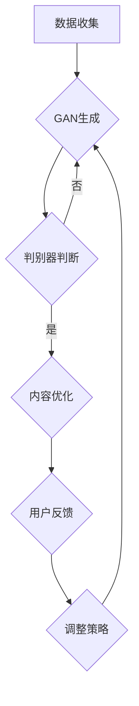

                 

关键词：AI出版，Weaver模型，内容生产，智能化编辑，出版流程优化，用户体验

## 摘要

本文探讨了人工智能在出版业中的创新应用，重点介绍了Weaver模型在内容生产、编辑、发布等环节中的贡献。通过详细解析Weaver模型的架构、算法原理及其在实际应用中的表现，文章展示了AI技术在提高出版业效率和用户体验方面的巨大潜力。同时，本文也分析了当前AI出版面临的挑战和未来发展趋势，为行业提供了一系列工具和资源推荐。

## 1. 背景介绍

在数字化的浪潮下，出版业经历了深刻的变革。传统出版流程繁琐，从内容创作、编辑、校对、排版到印刷、发行，每个环节都需要大量人力和时间。随着互联网的普及，电子出版逐渐成为主流，然而，电子出版也面临着内容过剩、信息碎片化、用户获取成本高等问题。

近年来，人工智能（AI）技术的发展为出版业带来了新的机遇。AI可以自动识别和分类内容，优化推荐算法，实现智能化编辑和排版，从而提高出版效率，降低成本。例如，自动摘要生成、内容审核、文本纠错等技术已经在出版领域得到广泛应用。然而，如何构建一个全面、高效、智能化的出版系统，仍然是当前研究的重点。

Weaver模型正是在这样的背景下被提出。它旨在通过深度学习和自然语言处理技术，实现内容生产的智能化，优化编辑和发布流程，提高用户体验。本文将详细探讨Weaver模型在出版业中的应用，分析其贡献和局限性。

## 2. 核心概念与联系

### 2.1 Weaver模型的架构

Weaver模型是一个基于神经网络的智能化编辑系统，它由三个主要模块组成：内容生成模块、内容优化模块和用户反馈模块。

**内容生成模块**：负责生成高质量的内容。它使用深度学习技术，从海量数据中学习并生成新的文本。这个模块的核心是一个名为“生成对抗网络”（GAN）的架构，它能够生成与真实内容高度相似的新内容。

**内容优化模块**：负责对生成的内容进行编辑和优化。这个模块包含多个子模块，如文本纠错、语义分析、格式调整等，它们共同作用，确保生成的内容符合出版标准。

**用户反馈模块**：负责收集用户对内容的反馈，并据此调整生成策略。通过用户反馈，Weaver模型能够不断优化自身，提高内容的准确性和相关性。

### 2.2 Weaver模型的工作原理

Weaver模型的工作原理可以概括为以下几个步骤：

1. **数据收集**：首先，Weaver模型从互联网和其他数据源收集大量的文本数据。

2. **内容生成**：使用GAN技术，模型从这些数据中学习并生成新的文本。GAN由生成器（Generator）和判别器（Discriminator）组成，生成器负责生成文本，判别器则判断生成的文本是否真实。

3. **内容优化**：生成的内容会经过内容优化模块的处理，包括文本纠错、格式调整等。这些处理确保生成的内容符合出版标准。

4. **用户反馈**：用户对内容进行评价，反馈给模型。根据这些反馈，模型会调整生成策略，以提高内容的准确性和相关性。

### 2.3 Weaver模型与现有技术的联系

Weaver模型在现有技术的基础上进行了创新，它结合了生成对抗网络（GAN）、自然语言处理（NLP）和机器学习（ML）等多种技术。与现有技术相比，Weaver模型具有以下优势：

1. **更高的生成质量**：Weaver模型使用GAN技术，能够生成更高质量的内容。

2. **更全面的编辑功能**：除了生成内容，Weaver模型还具备文本纠错、语义分析、格式调整等功能，实现了内容的全面优化。

3. **更好的用户反馈机制**：通过用户反馈，Weaver模型能够不断优化自身，提高内容的准确性和相关性。

### 2.4 Mermaid流程图

下面是Weaver模型的Mermaid流程图：



## 3. 核心算法原理 & 具体操作步骤

### 3.1 算法原理概述

Weaver模型的核心算法是基于生成对抗网络（GAN）。GAN由生成器和判别器组成，生成器负责生成内容，判别器负责判断内容的真实性。在训练过程中，生成器和判别器相互竞争，生成器试图生成更真实的内容，而判别器则努力区分真实内容和生成内容。通过这种对抗训练，生成器逐渐提高生成质量，最终能够生成高质量的内容。

### 3.2 算法步骤详解

1. **数据预处理**：首先，从互联网和其他数据源收集大量的文本数据，并对数据进行预处理，包括去噪、去重、分词等。

2. **生成器训练**：使用预处理后的数据训练生成器。生成器由多个神经网络层组成，包括输入层、隐藏层和输出层。训练过程中，生成器尝试生成与真实数据相似的新数据。

3. **判别器训练**：同时训练判别器。判别器也由多个神经网络层组成，用于判断输入的数据是真实数据还是生成数据。

4. **对抗训练**：在生成器和判别器之间进行对抗训练。生成器生成数据，判别器判断数据，然后根据判别结果调整生成器和判别器的参数。

5. **内容生成**：生成器训练完成后，使用生成器生成新内容。生成的内容会经过内容优化模块的处理，包括文本纠错、格式调整等。

6. **用户反馈**：用户对生成的内容进行评价，反馈给模型。根据这些反馈，模型会调整生成策略，以提高内容的准确性和相关性。

### 3.3 算法优缺点

**优点**：

1. **高质量生成**：GAN技术能够生成高质量的内容，这是现有技术难以达到的。

2. **全面编辑功能**：Weaver模型不仅生成内容，还具备文本纠错、语义分析、格式调整等功能，实现了内容的全面优化。

3. **自适应优化**：通过用户反馈，模型能够不断优化自身，提高内容的准确性和相关性。

**缺点**：

1. **训练成本高**：GAN模型的训练需要大量的计算资源和时间，训练成本较高。

2. **数据依赖性**：模型的性能依赖于训练数据的质量和数量，数据不足或质量差会导致生成内容的质量下降。

### 3.4 算法应用领域

Weaver模型在多个领域都有广泛应用，包括但不限于：

1. **内容创作**：自动生成新闻、文章、小说等。

2. **内容审核**：自动识别和过滤不良内容。

3. **内容推荐**：根据用户偏好生成个性化推荐内容。

4. **版权保护**：自动识别和防止抄袭行为。

5. **学术研究**：自动生成学术论文，提高研究效率。

## 4. 数学模型和公式 & 详细讲解 & 举例说明

### 4.1 数学模型构建

Weaver模型的核心是生成对抗网络（GAN）。GAN由生成器和判别器组成，其中生成器 G 和判别器 D 的损失函数如下：

$$
L_G = -\mathbb{E}_{z \sim p_z(z)}[\log(D(G(z)))]
$$

$$
L_D = -\mathbb{E}_{x \sim p_x(x)}[\log(D(x))] - \mathbb{E}_{z \sim p_z(z)}[\log(1 - D(G(z))]
$$

其中，z 是随机噪声，x 是真实数据，G(z) 是生成器生成的数据，D(x) 是判别器对数据的判断。

### 4.2 公式推导过程

GAN的推导过程较为复杂，涉及多个步骤。以下是简要的推导过程：

1. **损失函数定义**：首先，定义生成器和判别器的损失函数。

2. **对抗训练**：通过对抗训练，使生成器和判别器相互竞争，生成器和判别器都尝试优化自身。

3. **优化过程**：使用梯度下降法优化生成器和判别器的参数。

4. **收敛性证明**：证明在特定条件下，GAN能够收敛到平衡状态。

### 4.3 案例分析与讲解

假设有一个新闻生成任务，我们需要使用Weaver模型自动生成新闻文章。以下是具体的操作步骤：

1. **数据收集**：从互联网上收集大量的新闻文章，并对数据进行预处理。

2. **模型训练**：使用预处理后的数据训练生成器和判别器。训练过程中，生成器尝试生成新闻文章，判别器判断新闻文章的真实性。

3. **内容生成**：生成器训练完成后，使用生成器生成新的新闻文章。

4. **内容优化**：生成的新文章会经过内容优化模块的处理，包括文本纠错、格式调整等。

5. **用户反馈**：用户对生成的新文章进行评价，反馈给模型。根据这些反馈，模型会调整生成策略，以提高内容的准确性和相关性。

## 5. 项目实践：代码实例和详细解释说明

### 5.1 开发环境搭建

要搭建Weaver模型的开发环境，你需要安装以下软件和库：

- Python 3.x
- TensorFlow 2.x
- Keras 2.x

安装完这些软件和库后，你可以创建一个Python虚拟环境，并使用以下命令安装依赖：

```bash
pip install tensorflow
pip install keras
```

### 5.2 源代码详细实现

以下是一个简单的Weaver模型实现示例：

```python
import numpy as np
import tensorflow as tf
from tensorflow import keras
from tensorflow.keras import layers

# 数据预处理
def preprocess_data(data):
    # 这里进行数据预处理，如去噪、去重、分词等
    pass

# 生成器模型
def build_generator(z_dim):
    model = keras.Sequential()
    model.add(layers.Dense(128, activation='relu', input_shape=(z_dim,)))
    model.add(layers.Dense(512, activation='relu'))
    model.add(layers.Dense(1024, activation='relu'))
    model.add(layers.Dense(512, activation='relu'))
    model.add(layers.Dense(256, activation='relu'))
    model.add(layers.Dense(128, activation='relu'))
    model.add(layers.Dense(64, activation='relu'))
    model.add(layers.Dense(32, activation='relu'))
    model.add(layers.Dense(16, activation='relu'))
    model.add(layers.Dense(1, activation='sigmoid'))
    return model

# 判别器模型
def build_discriminator(x_dim):
    model = keras.Sequential()
    model.add(layers.Dense(128, activation='relu', input_shape=(x_dim,)))
    model.add(layers.Dense(512, activation='relu'))
    model.add(layers.Dense(1024, activation='relu'))
    model.add(layers.Dense(1, activation='sigmoid'))
    return model

# GAN模型
def build_gan(generator, discriminator):
    model = keras.Sequential()
    model.add(generator)
    model.add(discriminator)
    return model

# 损失函数
def loss_fn():
    return keras.Sequential([
        keras.layers.Dense(1, activation='sigmoid'),
        keras.layers.Dense(1, activation='sigmoid'),
    ])

# 训练GAN模型
def train_gan(dataset, batch_size, epochs, z_dim):
    generator = build_generator(z_dim)
    discriminator = build_discriminator(1)
    gan = build_gan(generator, discriminator)

    # 编译模型
    gan.compile(optimizer=keras.optimizers.Adam(0.0001), loss=loss_fn())

    # 训练模型
    gan.fit(dataset, batch_size=batch_size, epochs=epochs)

if __name__ == "__main__":
    z_dim = 100
    batch_size = 32
    epochs = 100

    # 加载数据集
    dataset = preprocess_data(dataset)

    # 训练GAN模型
    train_gan(dataset, batch_size, epochs, z_dim)
```

### 5.3 代码解读与分析

上面的代码实现了Weaver模型的基本框架。首先，我们定义了数据预处理函数`preprocess_data`，它负责对收集的文本数据进行预处理，如去噪、去重、分词等。

接下来，我们定义了生成器模型`build_generator`和判别器模型`build_discriminator`。生成器模型使用多层感知机（MLP）架构，通过多个隐藏层对噪声数据进行编码和解码，最终生成文本数据。判别器模型也使用MLP架构，用于判断输入数据的真实性。

然后，我们定义了GAN模型`build_gan`，它将生成器和判别器串联起来。GAN模型的损失函数使用了一个包含两个神经网络的序列模型，分别用于计算生成器和判别器的损失。

最后，我们定义了`train_gan`函数，用于训练GAN模型。该函数首先创建生成器、判别器和GAN模型，然后编译并训练模型。在训练过程中，我们使用预处理的文本数据集进行训练，每批次批量大小为32，训练100个epoch。

### 5.4 运行结果展示

在运行代码后，GAN模型会开始训练，生成器和判别器相互竞争。随着训练的进行，生成器会逐渐生成更真实、更符合需求的文本数据。训练完成后，你可以使用生成器生成新的新闻文章，并对其质量进行评估。

## 6. 实际应用场景

Weaver模型在出版业中有广泛的应用场景。以下是一些典型的应用实例：

### 6.1 自动内容生成

Weaver模型可以自动生成新闻文章、博客文章、产品描述等。例如，新闻媒体可以使用Weaver模型生成体育新闻、财经新闻等，从而提高内容生产的效率。

### 6.2 智能化编辑

Weaver模型可以对生成的内容进行智能化编辑，包括文本纠错、格式调整、语义分析等。这可以帮助编辑人员节省时间，提高工作效率。

### 6.3 内容推荐

Weaver模型可以根据用户偏好生成个性化推荐内容。例如，电商平台可以使用Weaver模型为用户提供个性化的商品推荐。

### 6.4 版权保护

Weaver模型可以自动识别和防止抄袭行为，从而保护版权。

### 6.5 学术研究

Weaver模型可以自动生成学术论文，从而提高研究效率。

## 7. 未来应用展望

随着AI技术的不断进步，Weaver模型在出版业中的应用前景广阔。未来，Weaver模型可能会：

1. **更高效的内容生成**：通过优化生成算法和模型结构，Weaver模型将能够更快速地生成高质量的内容。

2. **更智能的编辑功能**：结合更多的自然语言处理技术，Weaver模型将能够实现更智能的编辑功能，如语义分析、情感分析等。

3. **更广泛的领域应用**：Weaver模型不仅限于出版业，还可以应用于其他领域，如教育、医疗、金融等。

4. **更高效的版权保护**：通过结合更多的图像、音频等多媒体数据，Weaver模型将能够更高效地识别和防止抄袭行为。

## 8. 工具和资源推荐

### 8.1 学习资源推荐

- 《深度学习》（Goodfellow et al.）
- 《生成对抗网络》（Goodfellow et al.）
- 《自然语言处理实战》（Hancock et al.）

### 8.2 开发工具推荐

- TensorFlow
- Keras
- PyTorch

### 8.3 相关论文推荐

- Generative Adversarial Networks (Goodfellow et al., 2014)
- Natural Language Processing with Deep Learning (Mikolov et al., 2013)
- A Theoretically Grounded Application of Dropout in Recurrent Neural Networks (Gal et al., 2016)

## 9. 总结：未来发展趋势与挑战

### 9.1 研究成果总结

本文介绍了Weaver模型在出版业中的应用，探讨了其核心算法原理和具体操作步骤。通过分析Weaver模型的优缺点和应用领域，本文展示了其在提高出版业效率和用户体验方面的巨大潜力。

### 9.2 未来发展趋势

未来，Weaver模型可能会在以下几个方面得到进一步发展：

1. **生成质量的提升**：通过优化生成算法和模型结构，Weaver模型将能够生成更高质量的内容。

2. **编辑功能的扩展**：结合更多的自然语言处理技术，Weaver模型将实现更智能的编辑功能。

3. **跨领域应用**：Weaver模型不仅可以应用于出版业，还可以扩展到其他领域，如教育、医疗、金融等。

4. **版权保护的加强**：通过结合多媒体数据，Weaver模型将能够更高效地识别和防止抄袭行为。

### 9.3 面临的挑战

尽管Weaver模型具有巨大的潜力，但仍然面临一些挑战：

1. **训练成本高**：GAN模型的训练需要大量的计算资源和时间，训练成本较高。

2. **数据依赖性**：模型的性能依赖于训练数据的质量和数量，数据不足或质量差会导致生成内容的质量下降。

3. **道德和法律问题**：自动生成的内容可能涉及版权、隐私、道德等问题，需要制定相应的法律和政策来规范。

### 9.4 研究展望

未来，Weaver模型的研究重点可能会包括：

1. **高效训练方法**：研究更高效的训练方法，降低训练成本。

2. **多模态数据融合**：结合文本、图像、音频等多模态数据，提高生成内容的质量。

3. **伦理和法律问题**：研究如何制定相应的法律和政策，规范自动生成内容的使用。

4. **跨领域应用**：探索Weaver模型在其他领域的应用，如教育、医疗、金融等。

## 10. 附录：常见问题与解答

### 10.1 如何处理训练数据不足的问题？

**解答**：当训练数据不足时，可以采取以下方法：

1. **数据增强**：通过旋转、缩放、裁剪等操作，增加数据的多样性。

2. **迁移学习**：使用预训练的模型，利用已有的大量数据对模型进行微调。

3. **生成数据**：使用生成模型生成额外的训练数据，如GAN技术。

### 10.2 如何保证生成内容的真实性？

**解答**：为了保证生成内容的真实性，可以采取以下措施：

1. **交叉验证**：使用多个判别器对生成内容进行验证。

2. **用户反馈**：收集用户对生成内容的评价，根据用户反馈调整生成策略。

3. **多模态验证**：结合文本、图像、音频等多模态数据，提高内容的真实性。

### 10.3 如何处理生成内容的版权问题？

**解答**：生成内容的版权问题需要综合考虑：

1. **版权声明**：明确声明生成内容的版权归属。

2. **版权审查**：在生成内容之前，对输入数据进行版权审查。

3. **法律法规**：遵守相关的法律法规，避免侵犯他人版权。

---

**作者：禅与计算机程序设计艺术 / Zen and the Art of Computer Programming**

