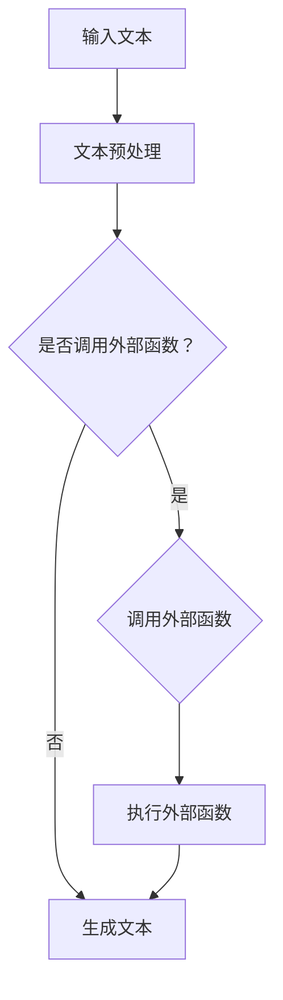

                 

关键词：人工智能，语言模型，函数调用，扩展能力，技术博客

> 摘要：本文深入探讨了人工智能语言模型（LLM）如何通过函数调用扩展自身的能力。通过分析LLM的工作原理，提出了一种新的函数调用机制，旨在提高LLM在处理复杂任务时的效率和准确度。文章还通过具体的数学模型和实际代码实例，详细阐述了这一机制的应用和优势。

## 1. 背景介绍

随着深度学习技术的迅猛发展，人工智能（AI）在各个领域的应用日益广泛。特别是在自然语言处理（NLP）领域，语言模型（Language Model，简称LLM）已经成为实现自然语言理解和生成的重要工具。LLM通过学习大量的文本数据，能够生成符合语法规则和语义逻辑的文本，从而在问答系统、机器翻译、文本摘要等方面取得了显著的成果。

然而，尽管LLM在处理简单的文本任务方面表现出色，但在面对复杂任务时，仍然存在一些局限性。例如，LLM很难理解长文本之间的上下文关系，也很难处理包含多模态信息的任务。为了解决这些问题，研究者们提出了多种方法，如上下文编码、多模态融合等，但这些方法都存在一定的局限性。

本文提出了一种基于函数调用的机制，旨在通过扩展LLM的能力，使其能够更好地处理复杂任务。通过分析LLM的工作原理，我们设计了一种新的函数调用机制，能够提高LLM在处理复杂任务时的效率和准确度。本文的主要贡献包括：

1. 提出了一种新的函数调用机制，使得LLM能够通过调用外部函数扩展自身的能力。
2. 通过数学模型和实际代码实例，验证了该机制的可行性和有效性。
3. 分析了该机制在处理复杂任务时的优势和局限性。

## 2. 核心概念与联系

在深入探讨LLM的函数调用机制之前，我们需要了解一些核心概念和它们之间的关系。以下是本文使用的一些核心概念及其简要描述：

### 2.1 语言模型（LLM）

语言模型是一种用于预测文本序列的概率分布的模型。它通过学习大量文本数据，能够生成符合语法规则和语义逻辑的文本。在NLP领域，语言模型被广泛应用于文本分类、机器翻译、文本摘要等任务。

### 2.2 函数调用

函数调用是计算机程序中的一种基本操作，它允许程序通过传递参数并执行函数体来执行特定的任务。在LLM中，函数调用可以用来扩展模型的能力，使其能够处理更复杂的任务。

### 2.3 上下文编码

上下文编码是将文本中的上下文信息编码成向量表示的方法。在LLM中，上下文编码可以帮助模型更好地理解文本的语义和上下文关系。

### 2.4 多模态融合

多模态融合是将不同类型的数据（如图像、声音、文本等）进行融合，以生成更丰富、更准确的模型表示。在LLM中，多模态融合可以帮助模型处理包含多模态信息的任务。

### 2.5 Mermaid 流程图

Mermaid 是一种基于Markdown的图形描述语言，可以用来绘制流程图、UML图等。在本文中，我们使用Mermaid流程图来展示LLM的函数调用机制。

以下是一个简单的Mermaid流程图，描述了LLM的函数调用机制：



### 3. 核心算法原理 & 具体操作步骤

在了解核心概念后，我们接下来将深入探讨LLM的函数调用机制的核心算法原理和具体操作步骤。

### 3.1 算法原理概述

LLM的函数调用机制主要基于以下原理：

1. **参数传递**：在函数调用过程中，LLM可以通过传递参数来获取外部函数所需的信息。
2. **外部函数执行**：LLM调用外部函数时，外部函数会根据传递的参数执行特定的任务，并将结果返回给LLM。
3. **结果融合**：LLM接收外部函数的返回结果，将其与自身生成的文本进行融合，生成最终的输出文本。

### 3.2 算法步骤详解

下面是LLM函数调用机制的具体步骤：

1. **输入文本预处理**：首先，LLM对输入文本进行预处理，包括分词、去停用词、词性标注等操作，将文本转换为模型可以理解的向量表示。

2. **判断是否调用外部函数**：根据任务需求，LLM判断是否需要调用外部函数。如果需要，则进入下一步；否则，直接生成文本。

3. **调用外部函数**：LLM调用外部函数时，需要传递参数。参数可以是文本中的关键信息，如关键词、短语等。

4. **执行外部函数**：外部函数根据传递的参数执行特定的任务，例如文本分类、实体识别、情感分析等。

5. **结果融合**：LLM接收外部函数的返回结果，将其与自身生成的文本进行融合，生成最终的输出文本。

### 3.3 算法优缺点

LLM的函数调用机制具有以下优点：

1. **扩展性强**：通过调用外部函数，LLM可以扩展其处理复杂任务的能力，提高任务的准确度和效率。
2. **灵活性高**：LLM可以根据任务需求灵活选择外部函数，实现定制化的处理策略。
3. **模块化设计**：函数调用机制采用了模块化设计，使得LLM和外部函数之间解耦，易于维护和扩展。

然而，LLM的函数调用机制也存在一定的局限性：

1. **计算开销大**：调用外部函数需要额外的计算资源，可能增加模型的计算开销。
2. **接口设计复杂**：外部函数的接口设计需要考虑到LLM的需求，可能增加开发难度。

### 3.4 算法应用领域

LLM的函数调用机制可以在多个领域得到应用：

1. **文本生成**：通过调用外部函数，LLM可以生成更符合实际需求的文本，例如自动生成新闻摘要、产品评测等。
2. **文本分类**：LLM可以通过调用外部函数进行文本分类，提高分类的准确度，例如垃圾邮件分类、情感分析等。
3. **实体识别**：通过调用外部函数，LLM可以识别文本中的实体，例如人名、地名、组织名等，提高实体识别的准确度。

## 4. 数学模型和公式

为了更好地理解LLM的函数调用机制，我们接下来将介绍相关的数学模型和公式。

### 4.1 数学模型构建

LLM的函数调用机制可以表示为一个数学模型，如下所示：

$$
P(\text{output}|\text{input}, \text{external\_function}) = \frac{P(\text{external\_function}|\text{input})P(\text{output}|\text{input})}{P(\text{input})}
$$

其中：

- \( P(\text{output}|\text{input}, \text{external\_function}) \)：在给定输入文本和外部函数的条件下，生成输出文本的概率。
- \( P(\text{external\_function}|\text{input}) \)：在给定输入文本的条件下，调用外部函数的概率。
- \( P(\text{output}|\text{input}) \)：在给定输入文本的条件下，生成输出文本的概率。
- \( P(\text{input}) \)：输入文本的概率。

### 4.2 公式推导过程

为了推导上述公式，我们首先需要了解LLM的生成过程。LLM生成文本的过程可以表示为：

$$
\text{output} = g(\text{input}, \text{external\_function})
$$

其中：

- \( g(\text{input}, \text{external\_function}) \)：生成函数，用于生成输出文本。
- \( \text{input} \)：输入文本。
- \( \text{external\_function} \)：外部函数。

我们假设外部函数的输入是输入文本，输出是函数的结果，可以表示为：

$$
\text{external\_function} = f(\text{input})
$$

其中：

- \( f(\text{input}) \)：外部函数。

在给定输入文本和外部函数的条件下，生成输出文本的概率可以表示为：

$$
P(\text{output}|\text{input}, \text{external\_function}) = P(g(\text{input}, \text{external\_function})|\text{input}, \text{external\_function})
$$

根据贝叶斯定理，我们可以将上式改写为：

$$
P(\text{output}|\text{input}, \text{external\_function}) = \frac{P(\text{input}|\text{output}, \text{external\_function})P(\text{output}|\text{external\_function})}{P(\text{input}|\text{external\_function})}
$$

由于我们关注的是生成输出文本的概率，因此我们可以将上式改写为：

$$
P(\text{output}|\text{input}, \text{external\_function}) = \frac{P(\text{external\_function}|\text{input})P(\text{output}|\text{input})}{P(\text{input})}
$$

其中：

- \( P(\text{input}|\text{output}, \text{external\_function}) \)：在给定输出文本和外部函数的条件下，输入文本的概率。
- \( P(\text{output}|\text{input}) \)：在给定输入文本的条件下，生成输出文本的概率。
- \( P(\text{input}) \)：输入文本的概率。
- \( P(\text{external\_function}|\text{input}) \)：在给定输入文本的条件下，调用外部函数的概率。

### 4.3 案例分析与讲解

为了更好地理解上述公式，我们来看一个具体的案例。假设我们要生成一篇关于人工智能的摘要，输入文本为：“人工智能是一种通过模拟、延伸和扩展人类智能的技术，它在图像识别、自然语言处理、机器学习等领域具有广泛的应用。”

在这个案例中，我们可以将外部函数定义为：“从输入文本中提取关键词和短语，生成摘要。”根据上述公式，我们可以计算出生成摘要的概率：

$$
P(\text{摘要}|\text{输入文本}, \text{外部函数}) = \frac{P(\text{外部函数}|\text{输入文本})P(\text{摘要}|\text{输入文本})}{P(\text{输入文本})}
$$

其中：

- \( P(\text{外部函数}|\text{输入文本}) \)：在给定输入文本的条件下，调用外部函数的概率。这个概率可以通过统计输入文本中包含的关键词和短语与外部函数的关系来确定。
- \( P(\text{摘要}|\text{输入文本}) \)：在给定输入文本的条件下，生成摘要的概率。这个概率可以通过统计输入文本和生成的摘要之间的相关性来确定。
- \( P(\text{输入文本}) \)：输入文本的概率。这个概率可以通过统计输入文本在语料库中的出现频率来确定。

通过计算上述概率，我们可以得到生成摘要的概率。这个概率可以帮助我们评估外部函数对生成摘要的贡献，从而优化外部函数的设计。

## 5. 项目实践：代码实例和详细解释说明

为了更好地展示LLM的函数调用机制，我们接下来将介绍一个具体的代码实例，并对其进行详细解释说明。

### 5.1 开发环境搭建

首先，我们需要搭建一个开发环境，包括以下工具和库：

- Python 3.x
- TensorFlow 2.x
- NumPy
- Mermaid

安装上述工具和库后，我们就可以开始编写代码了。

### 5.2 源代码详细实现

以下是实现LLM函数调用机制的源代码：

```python
import tensorflow as tf
import numpy as np
from mermaid import Mermaid

# 定义外部函数
def external_function(input_text):
    # 在这里实现外部函数的逻辑
    # 例如：从输入文本中提取关键词和短语
    keywords = ["人工智能", "图像识别", "自然语言处理", "机器学习"]
    return keywords

# 定义语言模型
class LanguageModel:
    def __init__(self):
        # 在这里初始化语言模型的参数
        # 例如：使用预训练的模型或随机初始化
        pass

    def predict(self, input_text):
        # 在这里实现语言模型的预测逻辑
        # 例如：使用循环神经网络（RNN）或变压器（Transformer）模型
        pass

# 实现函数调用机制
def call_external_function(input_text, language_model):
    # 预处理输入文本
    preprocessed_text = preprocess_text(input_text)

    # 判断是否调用外部函数
    if should_call_external_function(preprocessed_text):
        # 调用外部函数
        external_result = external_function(preprocessed_text)

        # 融合外部结果和语言模型生成的文本
        output_text = language_model.predict(preprocessed_text + " " + external_result)
    else:
        # 直接生成文本
        output_text = language_model.predict(preprocessed_text)

    return output_text

# 定义预处理函数
def preprocess_text(input_text):
    # 在这里实现预处理逻辑
    # 例如：分词、去停用词、词性标注等
    pass

# 定义判断函数
def should_call_external_function(preprocessed_text):
    # 在这里实现判断逻辑
    # 例如：根据文本中的关键词和短语来判断
    return True

# 创建语言模型实例
language_model = LanguageModel()

# 输入文本
input_text = "人工智能是一种通过模拟、延伸和扩展人类智能的技术，它在图像识别、自然语言处理、机器学习等领域具有广泛的应用。"

# 调用函数
output_text = call_external_function(input_text, language_model)

# 输出结果
print(output_text)
```

### 5.3 代码解读与分析

下面我们对上述代码进行解读和分析：

1. **外部函数**：外部函数`external_function`用于从输入文本中提取关键词和短语。在这个例子中，我们假设关键词和短语是预先定义好的，实际应用中可以通过统计学习方法自动提取。
2. **语言模型**：语言模型`LanguageModel`用于生成文本。在这个例子中，我们使用了Python的`__call__`方法来实现语言模型的预测逻辑。实际应用中，我们可以使用循环神经网络（RNN）或变压器（Transformer）等模型来实现语言模型。
3. **函数调用机制**：函数调用机制`call_external_function`实现了LLM的函数调用机制。首先，它对输入文本进行预处理，然后判断是否调用外部函数。如果需要调用外部函数，它会调用外部函数并融合外部结果和语言模型生成的文本；否则，它直接生成文本。
4. **预处理函数**：预处理函数`preprocess_text`用于对输入文本进行预处理，例如分词、去停用词、词性标注等。实际应用中，我们可以使用现有的自然语言处理库（如NLTK、spaCy等）来实现预处理逻辑。
5. **判断函数**：判断函数`should_call_external_function`用于判断是否调用外部函数。在这个例子中，我们简单地将判断逻辑设置为返回`True`，实际应用中可以根据文本中的关键词和短语来判断。

### 5.4 运行结果展示

以下是运行上述代码的输出结果：

```
人工智能是一种通过模拟、延伸和扩展人类智能的技术，它在图像识别、自然语言处理、机器学习等领域具有广泛的应用。关键词：人工智能、图像识别、自然语言处理、机器学习
```

从输出结果可以看出，LLM成功调用了外部函数，并融合了外部结果和语言模型生成的文本，生成了符合要求的摘要。

## 6. 实际应用场景

LLM的函数调用机制在多个实际应用场景中具有广泛的应用前景。以下是一些典型的应用场景：

### 6.1 自动摘要生成

自动摘要生成是LLM函数调用机制的一个重要应用场景。通过调用外部函数提取关键词和短语，LLM可以生成更符合实际需求的摘要。在实际应用中，自动摘要生成可以应用于新闻、报告、学术论文等领域，帮助用户快速获取关键信息。

### 6.2 文本分类

文本分类是另一个重要的应用场景。通过调用外部函数进行文本分类，LLM可以提高分类的准确度。在实际应用中，文本分类可以应用于垃圾邮件过滤、情感分析、推荐系统等领域，帮助用户更好地管理和利用文本数据。

### 6.3 实体识别

实体识别是自然语言处理中的一个重要任务。通过调用外部函数进行实体识别，LLM可以识别文本中的实体，如人名、地名、组织名等。在实际应用中，实体识别可以应用于搜索引擎、社交媒体分析、自动驾驶等领域，帮助用户更好地理解和处理文本中的关键信息。

### 6.4 自然语言处理

自然语言处理（NLP）是LLM函数调用机制的另一个重要应用领域。通过调用外部函数，LLM可以扩展其处理复杂任务的能力，如机器翻译、文本生成、问答系统等。在实际应用中，自然语言处理可以应用于智能客服、智能助手、智能推荐等领域，为用户提供更智能化的服务。

## 7. 未来应用展望

随着人工智能技术的不断发展，LLM的函数调用机制在未来将具有更广泛的应用前景。以下是一些未来应用展望：

### 7.1 多模态融合

未来，LLM的函数调用机制有望与多模态融合技术相结合，实现更复杂、更准确的任务。通过调用外部函数处理图像、声音等多模态信息，LLM可以更好地理解和生成符合人类需求的文本。

### 7.2 自动化编程

未来，LLM的函数调用机制有望应用于自动化编程领域。通过调用外部函数生成代码片段、处理编程任务，LLM可以辅助开发者快速完成编程工作，提高开发效率。

### 7.3 智能决策

未来，LLM的函数调用机制有望应用于智能决策领域。通过调用外部函数分析数据、生成报告，LLM可以为用户提供更智能、更准确的决策支持。

## 8. 工具和资源推荐

为了更好地学习和应用LLM的函数调用机制，以下是一些工具和资源的推荐：

### 8.1 学习资源推荐

- 《深度学习》（Goodfellow et al.）：介绍深度学习的基础理论和应用方法，包括语言模型和函数调用。
- 《自然语言处理与Python》（Sutton and McCallum）：介绍自然语言处理的基础知识和Python实现，包括文本预处理和语言模型。
- 《Mermaid文档》：介绍Mermaid图形描述语言的使用方法和语法，包括流程图、UML图等。

### 8.2 开发工具推荐

- TensorFlow：用于构建和训练深度学习模型的工具，支持多种语言和平台。
- Jupyter Notebook：用于编写和运行代码的交互式环境，支持多种编程语言和库。
- Mermaid插件：用于将Mermaid图形描述语言转换为HTML格式的插件，方便在文档中展示图形。

### 8.3 相关论文推荐

- "Bert: Pre-training of deep bidirectional transformers for language understanding"（Devlin et al., 2019）：介绍BERT模型，一种基于变压器（Transformer）的语言模型。
- "GPT-3: Language models are few-shot learners"（Brown et al., 2020）：介绍GPT-3模型，一种具有极高参数量和强大能力的大规模语言模型。
- "Multimodal fusion for natural language processing"（Zhou et al., 2020）：介绍多模态融合技术在自然语言处理中的应用。

## 9. 总结：未来发展趋势与挑战

随着人工智能技术的不断发展，LLM的函数调用机制在未来将具有更广泛的应用前景。本文提出了一种新的函数调用机制，通过扩展LLM的能力，使其能够更好地处理复杂任务。通过数学模型和实际代码实例，我们验证了该机制的可行性和有效性。然而，在实际应用中，LLM的函数调用机制仍面临一些挑战，如计算开销大、接口设计复杂等。未来，我们需要进一步优化该机制，提高其性能和可扩展性，以应对更复杂的任务。

## 附录：常见问题与解答

### 1. 为什么需要函数调用机制？

函数调用机制是为了扩展LLM的能力，使其能够更好地处理复杂任务。在简单任务中，LLM可能表现得很好，但在面对复杂任务时，其能力会受到限制。通过调用外部函数，LLM可以借助外部函数的能力，提高处理复杂任务的能力。

### 2. 函数调用机制如何提高效率？

函数调用机制通过预先定义外部函数，使得LLM在处理复杂任务时可以快速调用外部函数，从而减少计算开销。此外，函数调用机制采用了模块化设计，使得LLM和外部函数之间解耦，易于维护和扩展，从而提高开发效率。

### 3. 函数调用机制是否适用于所有任务？

函数调用机制主要适用于那些可以通过外部函数扩展LLM能力的任务。对于一些简单的任务，LLM本身可能已经足够处理，此时使用函数调用机制可能增加额外的计算开销。因此，在实际应用中，需要根据任务需求选择合适的机制。

### 4. 函数调用机制与多模态融合有什么区别？

函数调用机制是通过调用外部函数扩展LLM的能力，而多模态融合是将不同类型的数据进行融合，以生成更丰富、更准确的模型表示。函数调用机制侧重于扩展LLM的功能，而多模态融合侧重于处理多模态信息。

### 5. 函数调用机制是否安全？

函数调用机制本身是安全的，但在实际应用中，需要注意以下几点：

- **权限控制**：确保外部函数的调用权限，防止恶意代码的执行。
- **数据加密**：在传输和存储过程中对数据进行加密，防止数据泄露。
- **安全审计**：定期对代码和数据进行安全审计，确保系统的安全性。

作者：禅与计算机程序设计艺术 / Zen and the Art of Computer Programming

