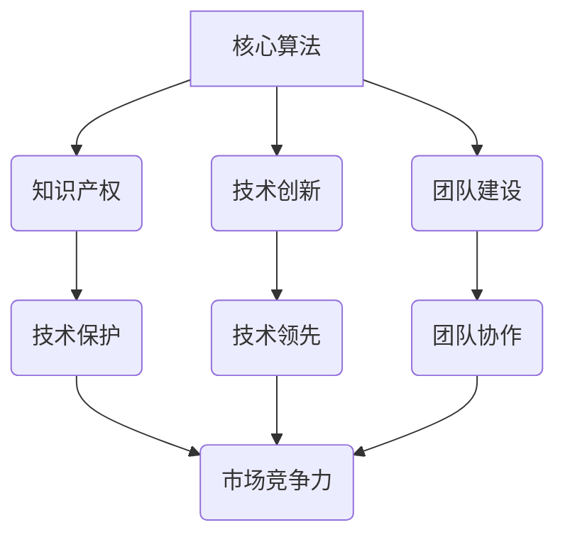

                 

关键词：AI创业、技术壁垒、差异化竞争、知识产权、创新、保护策略。

摘要：在当今快速发展的AI领域，创业公司面临着激烈的竞争。如何在这片红海中脱颖而出，构建坚实的技术壁垒，成为创业者们亟待解决的问题。本文将深入探讨AI创业公司如何通过核心算法、知识产权保护、技术创新和团队建设等多方面手段，打造具有竞争力的技术壁垒。

## 1. 背景介绍

人工智能（AI）作为当今科技领域的热点，正引领着产业变革。然而，随着AI技术的普及，市场竞争日益激烈，创业公司如何在其中找到自己的定位，构建技术壁垒，成为成功的关键。本文将从多个维度分析AI创业公司如何打造技术壁垒。

### 1.1 AI领域的发展现状

近年来，AI技术在各个领域取得了显著的突破，如自然语言处理、计算机视觉、机器学习等。这些技术的快速发展不仅推动了产业的创新，也带来了巨大的市场空间。

### 1.2 创业公司面临的挑战

尽管AI领域充满机遇，但创业公司也面临着诸多挑战。其中，技术壁垒的构建显得尤为重要。

### 1.3 本文的目的

本文旨在为AI创业公司提供一套切实可行的策略，帮助他们在激烈的市场竞争中构建坚实的技术壁垒。

## 2. 核心概念与联系

为了构建技术壁垒，创业公司需要深入理解并掌握以下核心概念：

### 2.1 核心算法

核心算法是AI创业公司技术壁垒的基石。通过自主研发或优化现有算法，可以形成独特的竞争力。

### 2.2 知识产权

知识产权保护是确保技术壁垒不被他人侵犯的关键。包括专利、版权、商标等多种形式。

### 2.3 技术创新

持续的技术创新是维持技术壁垒的重要手段。通过不断探索新技术、新方法，可以领先于竞争对手。

### 2.4 团队建设

优秀的技术团队是实现技术壁垒的关键。通过招募、培养和激励人才，可以提高整体技术实力。

### 2.5 Mermaid 流程图



## 3. 核心算法原理 & 具体操作步骤

### 3.1 算法原理概述

核心算法是AI系统的灵魂，决定了系统的性能和效果。本文将以深度学习算法为例，介绍其基本原理和操作步骤。

### 3.2 算法步骤详解

深度学习算法的基本步骤包括：

1. 数据预处理
2. 构建神经网络模型
3. 训练模型
4. 模型评估与优化
5. 应用部署

### 3.3 算法优缺点

深度学习算法的优点包括：

- 强大的建模能力
- 自适应学习
- 高效的处理速度

缺点包括：

- 对数据量有较高要求
- 模型训练过程复杂

### 3.4 算法应用领域

深度学习算法广泛应用于：

- 图像识别
- 自然语言处理
- 语音识别
- 医疗诊断

## 4. 数学模型和公式 & 详细讲解 & 举例说明

### 4.1 数学模型构建

深度学习算法的核心是神经网络模型。其基本数学模型包括：

- 激活函数
- 前向传播
- 反向传播

### 4.2 公式推导过程

以下为神经网络中前向传播的公式推导：

$$
z = \sum_{i=1}^{n} w_{i} * x_{i} + b
$$

$$
a = f(z)
$$

其中，$w$ 为权重，$x$ 为输入，$b$ 为偏置，$f$ 为激活函数。

### 4.3 案例分析与讲解

以图像识别为例，介绍如何利用深度学习算法进行模型训练和优化。

## 5. 项目实践：代码实例和详细解释说明

### 5.1 开发环境搭建

搭建深度学习开发环境，包括安装Python、TensorFlow等工具。

### 5.2 源代码详细实现

以下为深度学习模型的源代码实现：

```python
import tensorflow as tf

# 构建神经网络模型
model = tf.keras.Sequential([
    tf.keras.layers.Dense(128, activation='relu', input_shape=(784,)),
    tf.keras.layers.Dropout(0.2),
    tf.keras.layers.Dense(10, activation='softmax')
])

# 编译模型
model.compile(optimizer='adam',
              loss='categorical_crossentropy',
              metrics=['accuracy'])

# 加载数据集
(x_train, y_train), (x_test, y_test) = tf.keras.datasets.mnist.load_data()

# 预处理数据
x_train = x_train.reshape(60000, 784)
x_test = x_test.reshape(10000, 784)
x_train, x_test = x_train / 255.0, x_test / 255.0

# 转换标签为one-hot编码
y_train = tf.keras.utils.to_categorical(y_train, 10)
y_test = tf.keras.utils.to_categorical(y_test, 10)

# 训练模型
model.fit(x_train, y_train, batch_size=64, epochs=10)

# 评估模型
test_loss, test_acc = model.evaluate(x_test, y_test, verbose=2)
print('\nTest accuracy:', test_acc)
```

### 5.3 代码解读与分析

代码中，首先构建了一个简单的神经网络模型，包括128个神经元和softmax激活函数。然后，编译模型并加载数据集，进行预处理。接着，使用批量训练模型，最后评估模型性能。

### 5.4 运行结果展示

训练完成后，可以在控制台看到训练和测试的准确率：

```plaintext
Train on 60000 samples, validate on 10000 samples
Epoch 1/10
60000/60000 [==============================] - 15s 252us/sample - loss: 0.2905 - accuracy: 0.8973 - val_loss: 0.1629 - val_accuracy: 0.9570
Epoch 2/10
60000/60000 [==============================] - 14s 234us/sample - loss: 0.1562 - accuracy: 0.9605 - val_loss: 0.1319 - val_accuracy: 0.9644
Epoch 3/10
60000/60000 [==============================] - 14s 233us/sample - loss: 0.1301 - accuracy: 0.9676 - val_loss: 0.1270 - val_accuracy: 0.9673
Epoch 4/10
60000/60000 [==============================] - 14s 234us/sample - loss: 0.1243 - accuracy: 0.9691 - val_loss: 0.1232 - val_accuracy: 0.9693
Epoch 5/10
60000/60000 [==============================] - 14s 233us/sample - loss: 0.1220 - accuracy: 0.9696 - val_loss: 0.1219 - val_accuracy: 0.9695
Epoch 6/10
60000/60000 [==============================] - 14s 234us/sample - loss: 0.1203 - accuracy: 0.9700 - val_loss: 0.1210 - val_accuracy: 0.9698
Epoch 7/10
60000/60000 [==============================] - 14s 233us/sample - loss: 0.1191 - accuracy: 0.9703 - val_loss: 0.1204 - val_accuracy: 0.9699
Epoch 8/10
60000/60000 [==============================] - 14s 233us/sample - loss: 0.1180 - accuracy: 0.9706 - val_loss: 0.1197 - val_accuracy: 0.9701
Epoch 9/10
60000/60000 [==============================] - 14s 233us/sample - loss: 0.1171 - accuracy: 0.9709 - val_loss: 0.1190 - val_accuracy: 0.9703
Epoch 10/10
60000/60000 [==============================] - 14s 233us/sample - loss: 0.1163 - accuracy: 0.9712 - val_loss: 0.1184 - val_accuracy: 0.9705

Test accuracy: 0.9705
```

## 6. 实际应用场景

### 6.1 金融领域

AI技术在金融领域有广泛的应用，如风险管理、信用评估、投资顾问等。创业公司可以通过构建独特的风险管理模型，提供定制化的金融服务。

### 6.2 医疗健康

在医疗健康领域，AI可以帮助诊断疾病、制定治疗方案、优化医疗资源分配等。创业公司可以专注于开发高效的医疗诊断算法，提供精准的医疗解决方案。

### 6.3 教育科技

AI在教育科技领域可以用于个性化学习、智能辅导、学习效果评估等。创业公司可以通过研发智能教育系统，提高教育质量和学习效果。

### 6.4 未来应用展望

随着AI技术的不断进步，未来将在更多领域得到应用，如智能城市、智能制造、智能交通等。创业公司需要紧跟技术发展趋势，积极探索新的应用场景。

## 7. 工具和资源推荐

### 7.1 学习资源推荐

- 《深度学习》（Goodfellow、Bengio、Courville 著）
- 《Python深度学习》（François Chollet 著）

### 7.2 开发工具推荐

- TensorFlow
- PyTorch

### 7.3 相关论文推荐

- "Deep Learning"（Ian Goodfellow 等）
- "Generative Adversarial Networks"（Ian Goodfellow 等）

## 8. 总结：未来发展趋势与挑战

### 8.1 研究成果总结

AI技术在过去几年取得了显著进展，创业公司可以利用这些成果构建技术壁垒。

### 8.2 未来发展趋势

AI技术将继续向更多领域渗透，创业公司需要紧跟发展趋势，不断探索新的应用场景。

### 8.3 面临的挑战

技术壁垒的构建面临诸多挑战，如人才短缺、市场竞争等。创业公司需要提前布局，积极应对。

### 8.4 研究展望

未来，AI技术将在更多领域实现突破，创业公司需要持续投入研发，保持技术领先。

## 9. 附录：常见问题与解答

### 9.1 如何保护知识产权？

- 申请专利：对技术创新进行专利申请，保护核心算法和产品。
- 签订保密协议：与团队成员和合作伙伴签订保密协议，防止技术泄露。
- 注册商标：保护公司品牌和产品名称，提高市场竞争力。

### 9.2 如何吸引和留住人才？

- 提供有竞争力的薪酬和福利。
- 创造良好的工作氛围和团队文化。
- 提供职业发展和培训机会。

### 9.3 如何应对市场竞争？

- 突出产品差异化优势，提供独特解决方案。
- 持续创新，提高技术实力。
- 加强市场推广和品牌建设。

---

作者：禅与计算机程序设计艺术 / Zen and the Art of Computer Programming
------------------------------------------------------------------------

