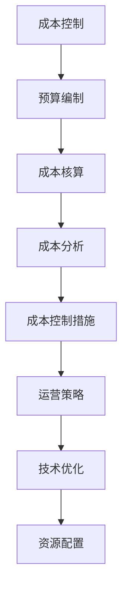

                 

关键词：成本控制、AI创业公司、运营策略、技术优化、资源配置

> 摘要：本文将深入探讨AI创业公司在成长过程中如何进行有效的成本控制，通过分析运营策略、技术优化、资源配置等方面，提供实用的建议和策略，以帮助AI创业公司实现可持续发展。

## 1. 背景介绍

近年来，人工智能（AI）技术的飞速发展，使得越来越多的创业公司投身于这个领域。然而，AI项目的高研发成本和复杂的技术栈，使得许多公司在运营过程中面临巨大的经济压力。因此，如何进行有效的成本控制，成为AI创业公司能否成功的关键因素之一。

### 1.1 AI创业公司的特点

- **高研发成本**：AI项目通常需要大量的计算资源和人力投入，研发成本较高。
- **技术复杂度**：AI技术涉及多个学科，如数学、计算机科学、统计学等，技术复杂度高。
- **高风险**：AI项目的成功往往依赖于不可预测的因素，如市场需求、技术突破等，因此风险较高。

### 1.2 成本控制的重要性

- **确保公司财务健康**：有效的成本控制有助于确保公司有足够的资金进行持续研发和市场推广。
- **提高竞争力**：通过成本控制，AI创业公司可以在价格上更具竞争力，吸引更多客户。
- **资源优化**：合理分配资源，提高资源利用率，有助于公司实现可持续发展。

## 2. 核心概念与联系

### 2.1 成本控制的定义

成本控制是指在企业的经营活动中，通过各种手段和方法，对成本进行合理的规划和控制，以确保企业能够实现预期的经济效益。

### 2.2 成本控制的要素

- **预算编制**：根据企业的经营目标和实际情况，制定合理的成本预算。
- **成本核算**：对各项成本进行准确的核算和统计。
- **成本分析**：对成本进行分析，找出成本过高的原因，并提出改进措施。
- **成本控制措施**：制定和实施一系列控制成本的具体措施。

### 2.3 成本控制与运营策略的关系

成本控制是运营策略的重要组成部分。合理的成本控制可以帮助企业优化运营策略，提高运营效率，从而实现成本和效益的双赢。

### 2.4 成本控制与技术优化的关系

技术优化是降低成本的重要手段。通过不断优化技术，提高系统的运行效率，可以显著降低运营成本。

### 2.5 成本控制与资源配置的关系

资源配置是成本控制的关键。合理的资源配置可以提高资源利用率，降低浪费，从而实现成本控制。

### 2.6 Mermaid流程图



## 3. 核心算法原理 & 具体操作步骤

### 3.1 算法原理概述

成本控制的核心在于制定合理的预算，并对成本进行有效监控和管理。具体操作步骤如下：

1. **预算编制**：根据公司的经营目标和实际情况，制定合理的成本预算。
2. **成本核算**：对各项成本进行准确的核算和统计。
3. **成本分析**：对成本进行分析，找出成本过高的原因。
4. **成本控制措施**：根据成本分析的结果，制定和实施一系列控制成本的具体措施。

### 3.2 算法步骤详解

1. **预算编制**：

   - **目标确定**：明确公司的经营目标，如市场份额、利润率等。
   - **成本预测**：根据历史数据和市场情况，预测各项成本的支出。
   - **预算编制**：将预测的成本分配到不同的部门或项目，形成预算。

2. **成本核算**：

   - **数据收集**：收集各项成本的数据，如人力成本、设备成本、运营成本等。
   - **数据整理**：对收集的数据进行整理和分类，便于后续分析。

3. **成本分析**：

   - **成本结构分析**：分析各项成本的构成，找出成本过高的原因。
   - **成本效益分析**：评估各项成本对公司效益的影响，确定哪些成本可以削减。

4. **成本控制措施**：

   - **优化资源配置**：根据成本分析的结果，调整资源分配，提高资源利用率。
   - **降低成本**：通过优化技术、减少浪费等方式，降低运营成本。
   - **加强成本监控**：对各项成本进行实时监控，确保成本控制在预算范围内。

### 3.3 算法优缺点

**优点**：

- **提高成本效益**：通过成本控制，可以提高公司的成本效益，实现可持续发展。
- **优化资源配置**：合理的资源配置可以提高资源利用率，降低浪费。

**缺点**：

- **管理难度大**：成本控制需要大量的数据支持和专业分析，管理难度较大。
- **可能影响研发效率**：过于严格的成本控制可能影响公司的研发效率，导致项目延期。

### 3.4 算法应用领域

成本控制适用于所有需要成本管理的行业，如制造业、服务业、IT行业等。在AI创业公司中，成本控制尤为重要，因为AI项目的成本较高，风险也较大。

## 4. 数学模型和公式 & 详细讲解 & 举例说明

### 4.1 数学模型构建

成本控制的数学模型主要包括预算编制模型、成本核算模型和成本效益分析模型。

1. **预算编制模型**：

   假设某AI创业公司的经营目标为年利润率为10%，预算期为一年。

   - **利润目标**：利润 = 营业收入 × 利润率
   - **成本预算**：成本 = 营业收入 - 利润

2. **成本核算模型**：

   成本 = 固定成本 + 变动成本

   - **固定成本**：不受业务量变化的影响，如房租、设备折旧等。
   - **变动成本**：随业务量变化而变化的成本，如人力成本、材料成本等。

3. **成本效益分析模型**：

   成本效益比 = 成本 / 效益

   - **成本**：实施某项目的总成本。
   - **效益**：实施项目后带来的经济效益。

### 4.2 公式推导过程

1. **预算编制模型推导**：

   利润 = 营业收入 × 利润率

   成本 = 营业收入 - 利润

   代入利润公式，得：

   成本 = 营业收入 - 营业收入 × 利润率

   即：

   成本 = 营业收入 × (1 - 利润率)

2. **成本核算模型推导**：

   成本 = 固定成本 + 变动成本

   假设固定成本为F，变动成本为V，业务量为Q。

   则：

   成本 = F + VQ

3. **成本效益分析模型推导**：

   成本效益比 = 成本 / 效益

   代入成本公式，得：

   成本效益比 = (F + VQ) / 效益

### 4.3 案例分析与讲解

假设某AI创业公司计划开发一款智能助手产品，预计年营业收入为1000万元，固定成本为200万元，变动成本为500万元/年。

1. **预算编制**：

   - 利润率 = 10%
   - 利润 = 1000万元 × 10% = 100万元
   - 成本 = 1000万元 - 100万元 = 900万元

2. **成本核算**：

   - 固定成本 = 200万元
   - 变动成本 = 500万元
   - 总成本 = 200万元 + 500万元 = 700万元

3. **成本效益分析**：

   - 效益 = 1000万元
   - 成本效益比 = 700万元 / 1000万元 = 0.7

根据成本效益比，该公司在成本控制上还有较大的优化空间。

## 5. 项目实践：代码实例和详细解释说明

### 5.1 开发环境搭建

- **开发语言**：Python
- **开发工具**：Jupyter Notebook
- **依赖库**：NumPy、Pandas、Matplotlib

### 5.2 源代码详细实现

```python
import numpy as np
import pandas as pd
import matplotlib.pyplot as plt

# 预算编制
def budget_planning(annual_revenue, profit_margin):
    profit = annual_revenue * profit_margin
    cost = annual_revenue - profit
    return cost

# 成本核算
def cost_accounting(fixed_cost, variable_cost):
    total_cost = fixed_cost + variable_cost
    return total_cost

# 成本效益分析
def cost_benefit_analysis(total_cost, benefit):
    cost_benefit_ratio = total_cost / benefit
    return cost_benefit_ratio

# 数据输入
annual_revenue = 10000000
profit_margin = 0.1
fixed_cost = 2000000
variable_cost = 5000000
benefit = 10000000

# 执行函数
cost = budget_planning(annual_revenue, profit_margin)
total_cost = cost_accounting(fixed_cost, variable_cost)
cost_benefit_ratio = cost_benefit_analysis(total_cost, benefit)

# 输出结果
print("预算成本：", cost)
print("总成本：", total_cost)
print("成本效益比：", cost_benefit_ratio)

# 数据可视化
data = {'年度收入': [annual_revenue], '成本': [total_cost], '效益': [benefit]}
df = pd.DataFrame(data)
df.plot(kind='bar', figsize=(10, 6))
plt.xlabel('项目')
plt.ylabel('金额（万元）')
plt.title('成本与效益分析')
plt.show()
```

### 5.3 代码解读与分析

该代码实现了一个简单的成本控制模型，主要包括三个函数：

1. **budget\_planning()**：预算编制函数，根据年营业收入和利润率计算成本。
2. **cost\_accounting()**：成本核算函数，根据固定成本和变动成本计算总成本。
3. **cost\_benefit\_analysis()**：成本效益分析函数，根据总成本和效益计算成本效益比。

代码首先输入了公司的年度营业收入、利润率、固定成本和变动成本，然后调用这三个函数，计算并输出预算成本、总成本和成本效益比。

最后，代码使用Matplotlib库将成本和效益进行了可视化展示，便于直观地分析公司的成本效益情况。

## 6. 实际应用场景

### 6.1 智能家居行业

智能家居行业是AI技术的重要应用领域之一。在智能家居产品的研发和运营过程中，成本控制尤为重要。通过制定合理的预算，对研发成本、生产成本和运营成本进行有效监控和管理，智能家居公司可以降低成本，提高竞争力。

### 6.2 无人驾驶行业

无人驾驶技术是AI领域的另一重要应用领域。由于无人驾驶项目的技术复杂度和研发成本较高，成本控制显得尤为重要。通过优化技术、提高研发效率，无人驾驶公司可以降低研发成本，提高市场竞争力。

### 6.3 人工智能医疗

人工智能医疗是近年来快速发展的领域。在医疗应用中，成本控制可以帮助医疗机构降低诊断和治疗成本，提高医疗服务质量。例如，通过优化算法，提高医学影像识别的准确率，可以降低人工成本，提高诊断效率。

## 7. 未来应用展望

随着AI技术的不断发展，成本控制的应用领域将不断扩展。未来，成本控制将更加智能化、自动化，利用大数据、机器学习等技术，实现成本的精细化管理。同时，随着技术的进步，AI创业公司的成本也将逐渐降低，为创业公司提供更多的机会和挑战。

### 7.1 智能制造

智能制造是AI技术的重要应用领域。通过成本控制，可以提高生产效率，降低生产成本，提高产品质量。未来，智能制造将更加普及，成本控制将在其中发挥重要作用。

### 7.2 金融科技

金融科技（Fintech）是AI技术的另一重要应用领域。在金融科技领域，成本控制可以帮助金融机构提高运营效率，降低成本，提高竞争力。例如，通过自动化风控系统，可以降低信贷风险，提高贷款审批效率。

### 7.3 健康医疗

健康医疗是AI技术的重要应用领域之一。通过成本控制，可以提高医疗服务的质量和效率，降低医疗成本。未来，随着AI技术的不断发展，健康医疗领域的成本控制将更加精细化，为人民群众提供更好的医疗服务。

## 8. 总结：未来发展趋势与挑战

### 8.1 研究成果总结

本文从成本控制的定义、要素、原理、算法、数学模型等多个角度，探讨了AI创业公司如何进行有效的成本控制。通过分析运营策略、技术优化、资源配置等方面，提供了实用的建议和策略。

### 8.2 未来发展趋势

- **智能化、自动化**：成本控制将更加智能化、自动化，利用大数据、机器学习等技术，实现成本的精细化管理。
- **跨领域应用**：成本控制的应用领域将不断扩展，涵盖智能制造、金融科技、健康医疗等多个领域。
- **成本降低**：随着AI技术的不断发展，AI创业公司的成本将逐渐降低，为创业公司提供更多的机会。

### 8.3 面临的挑战

- **技术复杂性**：AI项目的成本较高，技术复杂度较大，成本控制难度较大。
- **数据质量**：成本控制需要大量的数据支持，数据质量对成本控制的效果有很大影响。
- **市场变化**：市场需求的不确定性，可能导致成本控制的计划发生变化。

### 8.4 研究展望

- **算法优化**：研究更加高效、智能的成本控制算法，提高成本控制的精度和效率。
- **跨领域研究**：探讨成本控制在不同领域的应用，为各行业提供实用的成本控制解决方案。

## 9. 附录：常见问题与解答

### 9.1 问题1：成本控制是否会影响研发效率？

**回答**：适当的成本控制可以优化资源配置，提高研发效率。但过于严格的成本控制可能导致研发人员过度关注成本，影响研发效率。因此，成本控制需要适度，平衡成本和研发效率。

### 9.2 问题2：成本控制的数据来源有哪些？

**回答**：成本控制的数据来源主要包括历史财务数据、市场数据、客户数据等。这些数据可以通过财务报表、市场调研、客户反馈等方式获取。

### 9.3 问题3：成本控制与预算编制有何关系？

**回答**：成本控制是预算编制的重要组成部分。预算编制是根据公司的经营目标和实际情况，制定合理的成本预算。而成本控制则是确保预算得到有效执行，对成本进行监控和管理。

### 9.4 问题4：成本控制是否适用于所有企业？

**回答**：是的，成本控制适用于所有需要成本管理的行业和企业。不同行业和企业的成本控制方法和重点可能有所不同，但基本原则是相通的。

作者：禅与计算机程序设计艺术 / Zen and the Art of Computer Programming
----------------------------------------------------------------

以上是本文的完整内容。通过本文，我们深入探讨了AI创业公司如何进行有效的成本控制，提供了实用的建议和策略。希望本文能对AI创业公司的发展有所帮助。同时，也欢迎读者在评论区提出宝贵意见和建议。谢谢阅读！<|assistant|>

