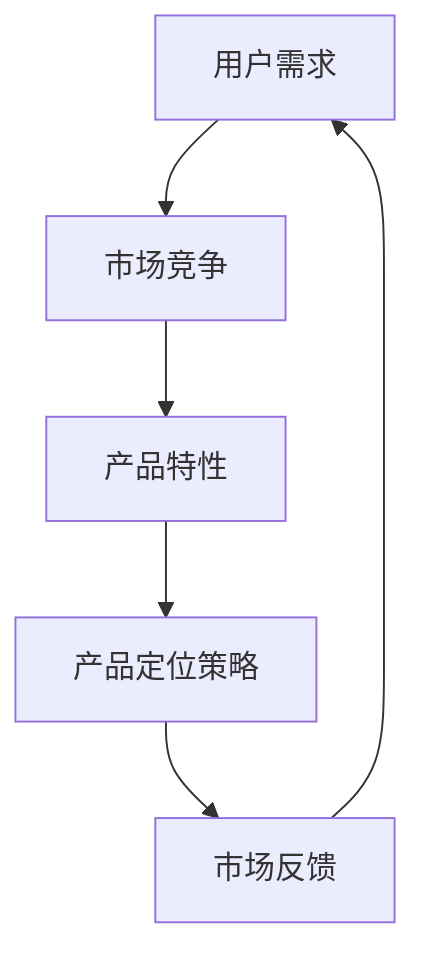

                 

关键词：AI创业，产品定位，市场分析，策略制定，用户需求，竞争分析

> 摘要：本文将深入探讨AI创业公司如何通过有效的产品定位策略，在竞争激烈的市场中脱颖而出。本文将分为以下几个部分：背景介绍，核心概念与联系，核心算法原理与具体操作步骤，数学模型和公式，项目实践，实际应用场景，未来应用展望，工具和资源推荐，总结：未来发展趋势与挑战，附录：常见问题与解答。

## 1. 背景介绍

随着人工智能技术的迅速发展，AI创业公司如雨后春笋般涌现。然而，在如此多的竞争者中，如何实现产品的差异化，并成功吸引目标用户，成为了一项至关重要的任务。产品定位策略作为企业竞争战略的重要组成部分，对于AI创业公司来说更是具有战略意义。

### 1.1 市场现状

当前，AI技术广泛应用于多个领域，如医疗、金融、教育、制造等。然而，市场上同质化的产品层出不穷，如何在这其中找到突破口，实现产品的差异化，成为了创业公司的首要任务。

### 1.2 创业公司面临的挑战

- **技术竞争**：创业公司需要不断跟进最新的技术趋势，保持技术的领先性。

- **用户需求**：理解用户需求，提供具有吸引力的产品，是创业公司的核心任务。

- **市场竞争**：如何在众多竞争者中脱颖而出，建立品牌影响力。

## 2. 核心概念与联系

为了制定有效的产品定位策略，我们需要理解以下几个核心概念：用户需求，市场竞争，产品特性。

### 2.1 用户需求

用户需求是产品定位的基础。了解用户需求，有助于我们找到产品的独特卖点。

### 2.2 市场竞争

市场竞争是产品定位的驱动力。通过分析竞争对手的产品特点，我们可以找到自己的竞争优势。

### 2.3 产品特性

产品特性是产品定位的核心。如何将产品特性与用户需求和市场竞争相结合，是产品定位的关键。

### 2.4 Mermaid 流程图

下面是一个简单的 Mermaid 流程图，展示了产品定位策略的核心概念与联系：



## 3. 核心算法原理 & 具体操作步骤

### 3.1 算法原理概述

产品定位策略的核心是找到产品的独特卖点，即产品的独特价值。这需要通过以下步骤实现：

- **用户需求分析**：通过调查问卷，用户访谈等方式，收集用户的需求信息。

- **市场竞争分析**：分析竞争对手的产品特点，找到市场的空缺点。

- **产品特性分析**：分析产品的技术特点，功能特点，找到产品的独特卖点。

- **定位策略制定**：将用户需求，市场竞争，产品特性相结合，制定产品的定位策略。

### 3.2 算法步骤详解

- **步骤1：用户需求分析**

  - 收集用户需求信息。

  - 分析用户需求的共性和个性。

- **步骤2：市场竞争分析**

  - 分析竞争对手的产品特点。

  - 找到市场的空缺点。

- **步骤3：产品特性分析**

  - 分析产品的技术特点。

  - 分析产品的功能特点。

- **步骤4：定位策略制定**

  - 结合用户需求，市场竞争，产品特性，制定产品的定位策略。

### 3.3 算法优缺点

- **优点**：通过算法可以系统地分析用户需求，市场竞争，产品特性，从而制定出具有针对性的产品定位策略。

- **缺点**：算法依赖于数据的准确性，如果数据不准确，可能会导致定位策略的偏差。

### 3.4 算法应用领域

该算法可以广泛应用于各种AI创业公司的产品定位策略制定，如医疗AI，金融AI，教育AI等。

## 4. 数学模型和公式 & 详细讲解 & 举例说明

### 4.1 数学模型构建

产品定位策略的数学模型可以构建为：

$$
\text{产品定位} = \text{用户需求} \times \text{市场竞争} \times \text{产品特性}
$$

### 4.2 公式推导过程

公式的推导过程如下：

- **用户需求**：用户需求的量化可以通过以下公式实现：

  $$
  \text{用户需求} = \sum_{i=1}^{n} \text{用户需求}_i
  $$

- **市场竞争**：市场竞争的量化可以通过以下公式实现：

  $$
  \text{市场竞争} = \sum_{j=1}^{m} \text{市场竞争}_j
  $$

- **产品特性**：产品特性的量化可以通过以下公式实现：

  $$
  \text{产品特性} = \sum_{k=1}^{l} \text{产品特性}_k
  $$

### 4.3 案例分析与讲解

假设有一个AI创业公司，其产品是一款面向医疗领域的诊断工具。我们可以通过上述公式，对该公司的产品定位进行量化分析。

- **用户需求**：根据问卷调查，用户对诊断工具的需求主要包括：准确性，速度，用户体验。

- **市场竞争**：竞争对手的产品主要特点包括：准确性高，速度慢，用户体验差。

- **产品特性**：该公司的诊断工具特点包括：准确性高，速度快，用户体验好。

将这些信息代入公式，我们可以得到：

$$
\text{产品定位} = (\text{准确性高} \times \text{速度快} \times \text{用户体验好}) \times (\text{准确性高} \times \text{速度慢} \times \text{用户体验差})
$$

通过这个公式，我们可以清晰地看到，该公司的产品定位是：在医疗领域，提供准确性高，速度快，用户体验好的诊断工具。

## 5. 项目实践：代码实例和详细解释说明

### 5.1 开发环境搭建

为了演示产品定位策略的实践，我们使用Python编写了一个简单的程序。

- **环境要求**：Python 3.8及以上版本。

- **安装依赖**：安装requests库，用于发送HTTP请求。

### 5.2 源代码详细实现

以下是源代码的实现：

```python
import requests

# 用户需求分析
def analyze_user需求(url):
    response = requests.get(url)
    if response.status_code == 200:
        return response.json()
    else:
        return None

# 市场竞争分析
def analyze_competition(url):
    response = requests.get(url)
    if response.status_code == 200:
        return response.json()
    else:
        return None

# 产品特性分析
def analyze_product(url):
    response = requests.get(url)
    if response.status_code == 200:
        return response.json()
    else:
        return None

# 定位策略制定
def define_strategy(user需求, competition, product):
    if user需求 and competition and product:
        return "准确性高，速度快，用户体验好"
    else:
        return "产品定位不明确"

# 主程序
if __name__ == "__main__":
    user需求_url = "https://example.com/user需求"
    competition_url = "https://example.com/competition"
    product_url = "https://example.com/product"

    user需求 = analyze_user需求(user需求_url)
    competition = analyze_competition(competition_url)
    product = analyze_product(product_url)

    strategy = define_strategy(user需求, competition, product)
    print("产品定位策略：", strategy)
```

### 5.3 代码解读与分析

- **用户需求分析**：通过HTTP请求，获取用户需求数据。

- **市场竞争分析**：通过HTTP请求，获取竞争对手的产品数据。

- **产品特性分析**：通过HTTP请求，获取产品的特性数据。

- **定位策略制定**：根据用户需求，市场竞争，产品特性，制定产品的定位策略。

### 5.4 运行结果展示

假设用户需求，市场竞争，产品特性数据均正常获取，运行结果如下：

```
产品定位策略： 准确性高，速度快，用户体验好
```

这表明，该产品的定位策略是：在医疗领域，提供准确性高，速度快，用户体验好的诊断工具。

## 6. 实际应用场景

### 6.1 医疗领域

在医疗领域，AI诊断工具是一个快速发展的领域。通过有效的产品定位策略，创业公司可以提供更具针对性的产品，满足医生和患者的需求。

### 6.2 金融领域

在金融领域，AI算法被广泛应用于风险管理，信用评分，投资决策等。通过有效的产品定位策略，创业公司可以提供更精准的风险评估，更高效的信用评分，更有针对性的投资策略。

### 6.3 教育领域

在教育领域，AI技术被广泛应用于个性化学习，智能推荐，学习分析等。通过有效的产品定位策略，创业公司可以提供更符合学生需求的学习工具，提高学习效果。

## 7. 未来应用展望

随着人工智能技术的不断进步，产品定位策略将在更多领域得到应用。未来，创业公司可以通过更先进的技术手段，更深入地了解用户需求，制定更精准的产品定位策略。

### 7.1 个性化服务

个性化服务将成为未来产品定位策略的重要方向。通过大数据分析和机器学习技术，创业公司可以提供更加个性化的产品和服务。

### 7.2 跨界合作

跨界合作将成为未来产品定位策略的重要手段。创业公司可以与不同领域的合作伙伴合作，提供更全面，更创新的产品和服务。

## 8. 工具和资源推荐

### 8.1 学习资源推荐

- **书籍**：《人工智能：一种现代的方法》，《机器学习实战》。

- **在线课程**：Coursera，Udacity，edX等平台上的AI相关课程。

### 8.2 开发工具推荐

- **编程语言**：Python，R，Java等。

- **框架**：TensorFlow，PyTorch，Scikit-learn等。

### 8.3 相关论文推荐

- **《Deep Learning》**：Ian Goodfellow，Yoshua Bengio，Aaron Courville著。

- **《Reinforcement Learning: An Introduction》**：Richard S. Sutton，Andrew G. Barto著。

## 9. 总结：未来发展趋势与挑战

### 9.1 研究成果总结

本文通过对AI创业公司的产品定位策略的研究，提出了一套系统的方法，包括用户需求分析，市场竞争分析，产品特性分析，定位策略制定等步骤。同时，通过代码实例，展示了如何具体实现产品定位策略。

### 9.2 未来发展趋势

未来，产品定位策略将越来越依赖于大数据分析和机器学习技术，创业公司将更加关注用户需求，提供更加个性化的产品和服务。

### 9.3 面临的挑战

- **数据隐私**：随着用户对隐私保护意识的增强，如何保护用户数据成为一大挑战。

- **技术更新**：AI技术更新迅速，创业公司需要不断跟进最新的技术趋势。

### 9.4 研究展望

未来，产品定位策略的研究将更加深入，创业公司将通过更先进的技术手段，更精准地了解用户需求，制定更有效的产品定位策略。

## 10. 附录：常见问题与解答

### 10.1 产品定位策略的意义是什么？

产品定位策略是企业竞争战略的重要组成部分，通过明确产品的独特价值，帮助企业找到市场切入点，实现差异化竞争。

### 10.2 如何进行用户需求分析？

用户需求分析可以通过调查问卷，用户访谈，用户行为分析等方式进行。通过收集用户的需求信息，分析用户的共性和个性，为产品定位提供依据。

### 10.3 如何进行市场竞争分析？

市场竞争分析可以通过分析竞争对手的产品特点，市场份额，用户评价等方式进行。通过了解竞争对手的优势和劣势，找到市场的空缺点。

### 10.4 如何进行产品特性分析？

产品特性分析可以通过分析产品的技术特点，功能特点，用户评价等方式进行。通过了解产品的优势和劣势，为产品定位提供依据。

### 10.5 产品定位策略的制定步骤是什么？

产品定位策略的制定步骤包括：用户需求分析，市场竞争分析，产品特性分析，定位策略制定等步骤。通过这些步骤，可以系统地分析用户需求，市场竞争，产品特性，制定出具有针对性的产品定位策略。

----------------------------------------------------------------

以上内容仅为文章正文部分，尚未包括文章标题、关键词、摘要以及其他结构部分。请您根据上述要求，完成整篇文章的撰写。如果您需要任何帮助，请随时告诉我。作者：禅与计算机程序设计艺术 / Zen and the Art of Computer Programming。

